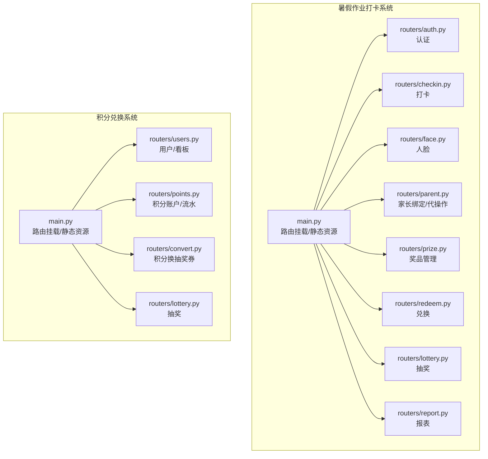
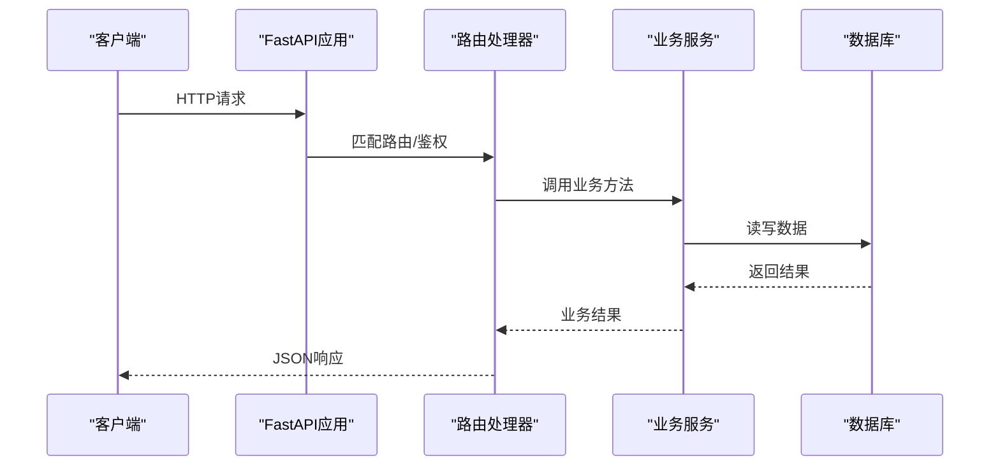
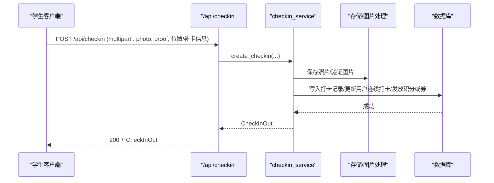
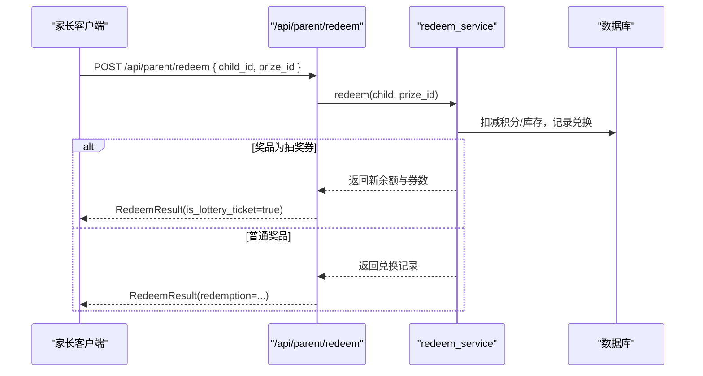
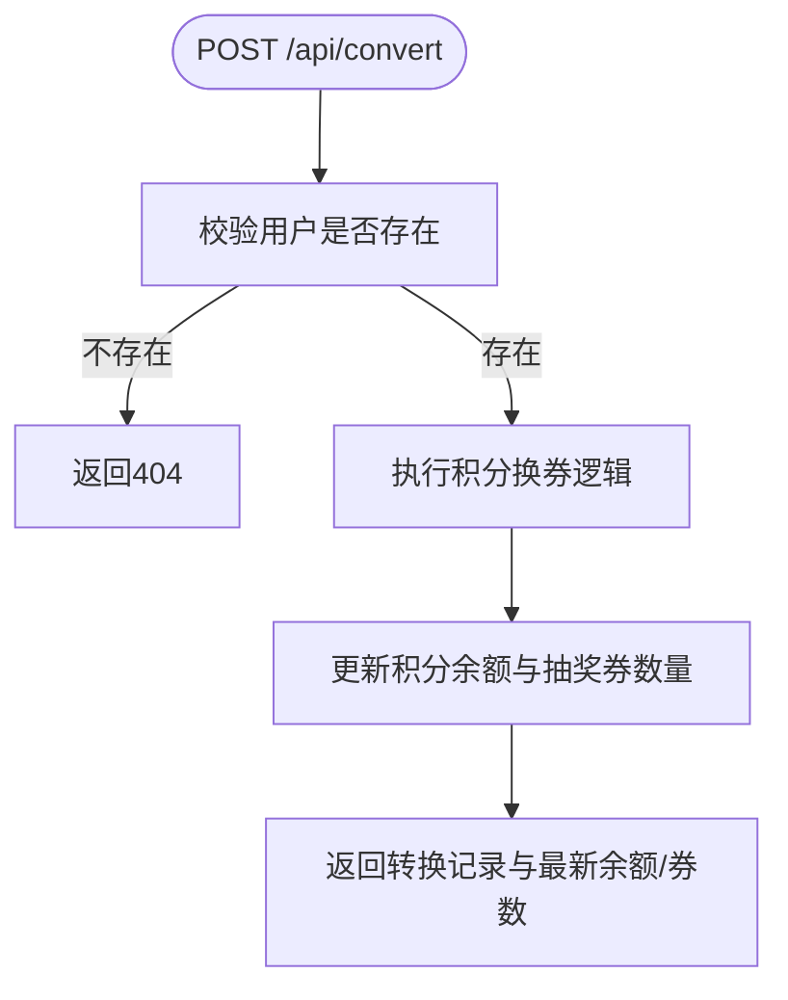
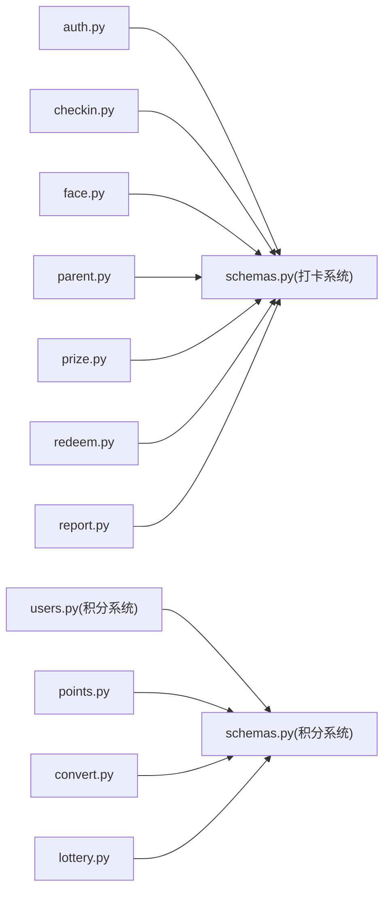

# API接口文档

<cite>
**本文引用的文件**   
- [summer-homework-checkin/backend/app/main.py](file://summer-homework-checkin/backend/app/main.py)
- [summer-homework-checkin/backend/app/routers/auth.py](file://summer-homework-checkin/backend/app/routers/auth.py)
- [summer-homework-checkin/backend/app/routers/checkin.py](file://summer-homework-checkin/backend/app/routers/checkin.py)
- [summer-homework-checkin/backend/app/routers/face.py](file://summer-homework-checkin/backend/app/routers/face.py)
- [summer-homework-checkin/backend/app/routers/lottery.py](file://summer-homework-checkin/backend/app/routers/lottery.py)
- [summer-homework-checkin/backend/app/routers/parent.py](file://summer-homework-checkin/backend/app/routers/parent.py)
- [summer-homework-checkin/backend/app/routers/prize.py](file://summer-homework-checkin/backend/app/routers/prize.py)
- [summer-homework-checkin/backend/app/routers/redeem.py](file://summer-homework-checkin/backend/app/routers/redeem.py)
- [summer-homework-checkin/backend/app/routers/report.py](file://summer-homework-checkin/backend/app/routers/report.py)
- [summer-homework-checkin/backend/app/schemas.py](file://summer-homework-checkin/backend/app/schemas.py)
- [points-system/backend/app/main.py](file://points-system/backend/app/main.py)
- [points-system/backend/app/routers/users.py](file://points-system/backend/app/routers/users.py)
- [points-system/backend/app/routers/points.py](file://points-system/backend/app/routers/points.py)
- [points-system/backend/app/routers/convert.py](file://points-system/backend/app/routers/convert.py)
- [points-system/backend/app/routers/lottery.py](file://points-system/backend/app/routers/lottery.py)
- [points-system/backend/app/schemas.py](file://points-system/backend/app/schemas.py)
</cite>

## 目录
1. [简介](#简介)
2. [项目结构](#项目结构)
3. [核心组件](#核心组件)
4. [架构总览](#架构总览)
5. [详细接口说明](#详细接口说明)
6. [依赖关系分析](#依赖关系分析)
7. [性能与可用性建议](#性能与可用性建议)
8. [故障排查指南](#故障排查指南)
9. [结论](#结论)
10. [附录：认证、数据格式与版本兼容](#附录认证数据格式与版本兼容)

## 简介
本文件为“暑假作业打卡系统”与“积分兑换系统”的完整API参考，覆盖以下能力：
- 用户认证（注册、登录、获取当前用户）
- 打卡管理（提交打卡、查询今日状态、连续打卡统计、历史记录）
- 人脸识别（采集人脸底图、查询/撤销采集状态）
- 家长绑定与代操作（绑定孩子、代打卡、代抽奖、查看报告）
- 奖品与商城（公开奖品列表、后台奖品管理、积分兑换、兑换替换）
- 报表生成（学生个人报告、HTML报告）
- 积分账户与流水（余额、明细）
- 积分兑换抽奖券（转换记录、抽奖券流水）
- 抽奖功能（奖池、抽奖、抽奖记录）

所有接口基于FastAPI实现，采用RESTful风格。部分接口需要认证（Bearer Token），部分接口仅对特定角色开放（如admin、student、parent）。

## 项目结构
两个后端服务分别提供不同业务域：
- 暑假作业打卡系统：面向学生与家长，包含打卡、人脸、家长绑定、兑换、抽奖、报表等
- 积分兑换系统：面向通用用户，提供积分账户、兑换、抽奖券转换与抽奖

图示来源
- [summer-homework-checkin/backend/app/main.py:1-48](file://summer-homework-checkin/backend/app/main.py#L1-L48)
- [points-system/backend/app/main.py:1-33](file://points-system/backend/app/main.py#L1-L33)

章节来源
- [summer-homework-checkin/backend/app/main.py:1-48](file://summer-homework-checkin/backend/app/main.py#L1-L48)
- [points-system/backend/app/main.py:1-33](file://points-system/backend/app/main.py#L1-L33)

## 核心组件
- 路由层：按模块划分（auth、checkin、face、parent、prize、redeem、report、users、points、convert、lottery）
- 模型与Schema：Pydantic定义请求/响应结构，确保类型校验与序列化
- 服务层：封装业务逻辑（如打卡、人脸、兑换、报表、抽奖）
- 安全与鉴权：基于Bearer Token的角色校验（get_current_user、require_role）
- 静态资源：上传照片、前端页面托管

章节来源
- [summer-homework-checkin/backend/app/routers/auth.py:1-52](file://summer-homework-checkin/backend/app/routers/auth.py#L1-L52)
- [summer-homework-checkin/backend/app/routers/checkin.py:1-80](file://summer-homework-checkin/backend/app/routers/checkin.py#L1-L80)
- [summer-homework-checkin/backend/app/routers/face.py:1-45](file://summer-homework-checkin/backend/app/routers/face.py#L1-L45)
- [summer-homework-checkin/backend/app/routers/parent.py:1-237](file://summer-homework-checkin/backend/app/routers/parent.py#L1-L237)
- [summer-homework-checkin/backend/app/routers/prize.py:1-66](file://summer-homework-checkin/backend/app/routers/prize.py#L1-L66)
- [summer-homework-checkin/backend/app/routers/redeem.py:1-81](file://summer-homework-checkin/backend/app/routers/redeem.py#L1-L81)
- [summer-homework-checkin/backend/app/routers/report.py:1-36](file://summer-homework-checkin/backend/app/routers/report.py#L1-L36)
- [summer-homework-checkin/backend/app/schemas.py:1-244](file://summer-homework-checkin/backend/app/schemas.py#L1-L244)
- [points-system/backend/app/routers/users.py:1-192](file://points-system/backend/app/routers/users.py#L1-L192)
- [points-system/backend/app/routers/points.py:1-28](file://points-system/backend/app/routers/points.py#L1-L28)
- [points-system/backend/app/routers/convert.py:1-64](file://points-system/backend/app/routers/convert.py#L1-L64)
- [points-system/backend/app/routers/lottery.py:1-55](file://points-system/backend/app/routers/lottery.py#L1-L55)
- [points-system/backend/app/schemas.py:1-147](file://points-system/backend/app/schemas.py#L1-L147)

## 架构总览
整体采用前后端分离，后端以FastAPI提供REST API，前端通过HTTP访问；支持CORS跨域；启动时自动建表；静态资源直接托管。

图示来源
- [summer-homework-checkin/backend/app/main.py:1-48](file://summer-homework-checkin/backend/app/main.py#L1-L48)
- [points-system/backend/app/main.py:1-33](file://points-system/backend/app/main.py#L1-L33)

## 详细接口说明

### 通用约定
- 基础路径
  - 暑假作业打卡系统：/api/*
  - 积分兑换系统：/api/*
- 认证方式
  - 需要认证的接口在Header中携带：Authorization: Bearer <access_token>
- 统一错误码
  - 200：成功
  - 400：请求参数错误
  - 401：未认证或认证失败
  - 403：无权限（角色不符或未绑定）
  - 404：资源不存在
  - 409：冲突（如用户名已存在）
  - 5xx：服务端异常
- 数据格式
  - 请求/响应均为JSON，除非明确返回HTML
  - 日期时间遵循ISO格式
- 分页与限制
  - 多数列表接口默认返回全部或有限条数，具体见各接口说明

#### 健康检查
- GET /api/health
- 无需认证
- 响应示例
  - { "status": "ok" }

章节来源
- [summer-homework-checkin/backend/app/main.py:32-34](file://summer-homework-checkin/backend/app/main.py#L32-L34)

---

### 用户认证（暑假作业打卡系统）
- POST /api/auth/register
  - 请求体：UserRegister（username, password, nickname, role=student|parent, grade?, phone?, home_lat?, home_lng?）
  - 响应：TokenOut（access_token, token_type, user）
  - 错误：400（角色非法/用户名重复）
- POST /api/auth/login
  - 请求体：UserLogin（username, password）
  - 响应：TokenOut
  - 错误：401（用户名或密码错误）
- GET /api/auth/me
  - 需认证
  - 响应：UserOut

章节来源
- [summer-homework-checkin/backend/app/routers/auth.py:10-52](file://summer-homework-checkin/backend/app/routers/auth.py#L10-L52)
- [summer-homework-checkin/backend/app/schemas.py:5-44](file://summer-homework-checkin/backend/app/schemas.py#L5-L44)

---

### 打卡管理（暑假作业打卡系统）
- POST /api/checkin
  - 需认证（仅学生）
  - 表单字段：photo(必填), proof(可选), location_lat?, location_lng?, check_type="normal|makeup", makeup_reason?, makeup_for_date?
  - 响应：CheckInOut
  - 错误：403（非学生）、400（图片校验失败等）
- POST /api/checkin/upload
  - 需认证
  - 表单字段：photo(必填)
  - 响应：{ photo_path, photo_url }
- GET /api/checkin/today
  - 需认证
  - 响应：今日打卡状态对象（today_checked, today_pending, can_makeup_this_month等）
- GET /api/checkin/streak
  - 需认证
  - 响应：StreakOut（current_streak, longest_streak, effective_checkins, lottery_tickets, today_checked, today_pending, can_makeup_this_month）
- GET /api/checkin/history
  - 需认证
  - 响应：CheckInOut[]（按时间倒序）

章节来源
- [summer-homework-checkin/backend/app/routers/checkin.py:14-80](file://summer-homework-checkin/backend/app/routers/checkin.py#L14-L80)
- [summer-homework-checkin/backend/app/schemas.py:46-96](file://summer-homework-checkin/backend/app/schemas.py#L46-L96)

---

### 人脸识别（暑假作业打卡系统）
- POST /api/face/enroll
  - 需认证（仅学生）
  - 表单字段：photo(必填)
  - 响应：FaceEnrollOut（ok, has_face, face_count, face_id_url, message）
  - 错误：400（未收到照片）、403（非学生）
- GET /api/face/status
  - 需认证
  - 响应：FaceStatusOut（face_enrolled, face_id_url, message）
- DELETE /api/face/enroll
  - 需认证
  - 响应：FaceStatusOut

章节来源
- [summer-homework-checkin/backend/app/routers/face.py:11-45](file://summer-homework-checkin/backend/app/routers/face.py#L11-L45)
- [summer-homework-checkin/backend/app/schemas.py:232-244](file://summer-homework-checkin/backend/app/schemas.py#L232-L244)

---

### 家长绑定与代操作（暑假作业打卡系统）
- POST /api/parent/bind
  - 需认证（仅家长）
  - 请求体：BindRequest（child_username, bind_code）
  - 响应：{ ok, message }
  - 错误：400（账号或绑定码错误）、403（非家长）
- GET /api/parent/children
  - 需认证（仅家长）
  - 响应：ChildSummary[]
- GET /api/parent/child-streak/{child_id}
  - 需认证（仅家长且已绑定）
  - 响应：ChildSummary
- POST /api/parent/checkin
  - 需认证（仅家长且已绑定）
  - 表单字段：child_id(必填), photo(必填), proof?, location_lat?, location_lng?, check_type, makeup_reason?, makeup_for_date?
  - 响应：{ ok, child_id, checkin_id, points, message }
- GET /api/parent/mall/{child_id}
  - 需认证（仅家长且已绑定）
  - 响应：MallOut（points, lottery_tickets, prizes[], redemptions[], lottery_records[]）
- POST /api/parent/redeem
  - 需认证（仅家长且已绑定）
  - 请求体：RedeemRequest（prize_id）
  - 响应：RedeemResult（普通奖品返回redemption；抽奖机会返回is_lottery_ticket=true及券数）
- POST /api/parent/redeem/{rid}/replace
  - 需认证（仅家长且已绑定）
  - 请求体：RedeemReplaceRequest（new_prize_id）
  - 响应：RedemptionOut
- GET /api/parent/lottery/{child_id}
  - 需认证（仅家长且已绑定）
  - 响应：{ tickets, records[] }
- POST /api/parent/lottery/{child_id}/draw
  - 需认证（仅家长且已绑定）
  - 响应：抽奖结果（由服务返回）
- GET /api/parent/notifications
  - 需认证（仅家长）
  - 响应：NotificationOut[]
- PATCH /api/parent/notifications/{nid}/read
  - 需认证（仅家长）
  - 响应：{ ok: true }
- GET /api/parent/child-report/{child_id}
  - 需认证（仅家长且已绑定）
  - 查询参数：start(date), end(date)，默认暑期范围
  - 响应：ReportOut
- GET /api/parent/child-report/{child_id}/html
  - 需认证（仅家长且已绑定）
  - 查询参数：start(date), end(date)
  - 响应：HTML字符串

章节来源
- [summer-homework-checkin/backend/app/routers/parent.py:17-237](file://summer-homework-checkin/backend/app/routers/parent.py#L17-L237)
- [summer-homework-checkin/backend/app/schemas.py:156-230](file://summer-homework-checkin/backend/app/schemas.py#L156-L230)

---

### 奖品与商城（暑假作业打卡系统）
- GET /api/prizes
  - 无需认证（仅展示上架奖品）
  - 响应：PrizeOut[]
- GET /api/admin/prizes
  - 需认证（仅admin）
  - 响应：PrizeOut[]
- POST /api/admin/prizes
  - 需认证（仅admin）
  - 请求体：PrizeCreate（name, description?, category, probability, stock, status, cost_points, is_lottery_ticket, ticket_qty, image_url?）
  - 响应：PrizeOut
  - 错误：400（类别不合法/概率越界）
- PUT /api/admin/prizes/{pid}
  - 需认证（仅admin）
  - 请求体：PrizeUpdate（可更新字段）
  - 响应：PrizeOut
  - 错误：404（奖品不存在）
- DELETE /api/admin/prizes/{pid}
  - 需认证（仅admin）
  - 响应：{ ok: true }
  - 错误：404（奖品不存在）
- GET /api/mall
  - 需认证（学生/家长）
  - 响应：MallOut（points, lottery_tickets, prizes[], redemptions[], lottery_records[]）
- POST /api/redeem
  - 需认证（学生/家长）
  - 请求体：RedeemRequest（prize_id）
  - 响应：RedeemResult
  - 错误：403（非学生/家长）
- POST /api/redeem/{rid}/replace
  - 需认证（学生/家长）
  - 请求体：RedeemReplaceRequest（new_prize_id）
  - 响应：RedemptionOut
  - 错误：403（非学生/家长）

章节来源
- [summer-homework-checkin/backend/app/routers/prize.py:9-66](file://summer-homework-checkin/backend/app/routers/prize.py#L9-L66)
- [summer-homework-checkin/backend/app/routers/redeem.py:12-81](file://summer-homework-checkin/backend/app/routers/redeem.py#L12-L81)
- [summer-homework-checkin/backend/app/schemas.py:98-213](file://summer-homework-checkin/backend/app/schemas.py#L98-L213)

---

### 抽奖（暑假作业打卡系统）
- GET /api/lottery/tickets
  - 需认证
  - 响应：{ tickets, records[] }
- POST /api/lottery/draw
  - 需认证（仅学生）
  - 响应：LotteryResult（is_win, prize_name?, prize_id?, tickets_left, message）
  - 错误：403（非学生）

章节来源
- [summer-homework-checkin/backend/app/routers/lottery.py:10-30](file://summer-homework-checkin/backend/app/routers/lottery.py#L10-L30)
- [summer-homework-checkin/backend/app/schemas.py:140-154](file://summer-homework-checkin/backend/app/schemas.py#L140-L154)

---

### 报表（暑假作业打卡系统）
- GET /api/report/me
  - 需认证（仅学生）
  - 查询参数：start(date), end(date)，默认暑期范围
  - 响应：ReportOut
  - 错误：403（非学生）
- GET /api/report/me/html
  - 需认证（仅学生）
  - 查询参数：start(date), end(date)
  - 响应：HTML字符串
  - 错误：403（非学生）

章节来源
- [summer-homework-checkin/backend/app/routers/report.py:14-36](file://summer-homework-checkin/backend/app/routers/report.py#L14-L36)
- [summer-homework-checkin/backend/app/schemas.py:215-230](file://summer-homework-checkin/backend/app/schemas.py#L215-L230)

---

### 用户与看板（积分兑换系统）
- POST /api/register
  - 无需认证
  - 请求体：UserCreate（username, display_name?）
  - 响应：UserOut
  - 错误：409（用户名已存在）
- GET /api/users
  - 无需认证
  - 响应：UserOut[]
- GET /api/dashboard
  - 无需认证
  - 查询参数：user_id(int)
  - 响应：一次性聚合数据（用户信息、积分余额、累计收支、抽奖券、是否今日已打卡、连续天数、奖品列表、奖池、兑换记录、转换记录、抽奖券流水、抽奖记录等）

章节来源
- [points-system/backend/app/routers/users.py:8-192](file://points-system/backend/app/routers/users.py#L8-L192)
- [points-system/backend/app/schemas.py:6-16](file://points-system/backend/app/schemas.py#L6-L16)

---

### 积分账户与流水（积分兑换系统）
- GET /api/points
  - 无需认证
  - 查询参数：user_id(int)
  - 响应：AccountOut（user_id, balance, total_earned, total_spent, updated_at）
  - 错误：404（积分账户不存在）
- GET /api/ledger
  - 无需认证
  - 查询参数：user_id(int), limit(int, 默认50)
  - 响应：LedgerOut[]（按创建时间倒序）

章节来源
- [points-system/backend/app/routers/points.py:7-28](file://points-system/backend/app/routers/points.py#L7-L28)
- [points-system/backend/app/schemas.py:18-36](file://points-system/backend/app/schemas.py#L18-L36)

---

### 积分兑换抽奖券（积分兑换系统）
- POST /api/convert
  - 无需认证
  - 请求体：ConvertRequest（user_id, qty≥1）
  - 响应：ConvertResult（conversion, balance, lottery_tickets）
  - 错误：404（用户不存在）
- GET /api/conversions
  - 无需认证
  - 查询参数：user_id(int)
  - 响应：ConversionOut[]
- GET /api/ticket-ledger
  - 无需认证
  - 查询参数：user_id(int)
  - 响应：LotteryTicketLedgerOut[]

章节来源
- [points-system/backend/app/routers/convert.py:8-64](file://points-system/backend/app/routers/convert.py#L8-L64)
- [points-system/backend/app/schemas.py:90-120](file://points-system/backend/app/schemas.py#L90-L120)

---

### 抽奖（积分兑换系统）
- GET /api/lottery/pool
  - 无需认证
  - 响应：LotteryPrizeOut[]（供前端初始化转盘）
- POST /api/lottery/draw
  - 无需认证
  - 请求体：DrawRequest（user_id）
  - 响应：DrawResult（draw, lottery_tickets, can_lottery）
  - 错误：404（用户不存在）
- GET /api/lottery/draws
  - 无需认证
  - 查询参数：user_id(int)
  - 响应：LotteryDrawOut[]

章节来源
- [points-system/backend/app/routers/lottery.py:8-55](file://points-system/backend/app/routers/lottery.py#L8-L55)
- [points-system/backend/app/schemas.py:122-147](file://points-system/backend/app/schemas.py#L122-L147)

---

### 关键流程时序图

#### 学生打卡流程（暑假作业打卡系统）

图示来源
- [summer-homework-checkin/backend/app/routers/checkin.py:17-37](file://summer-homework-checkin/backend/app/routers/checkin.py#L17-L37)

#### 家长代孩子兑换并可能获得抽奖券（暑假作业打卡系统）

图示来源
- [summer-homework-checkin/backend/app/routers/parent.py:131-154](file://summer-homework-checkin/backend/app/routers/parent.py#L131-L154)
- [summer-homework-checkin/backend/app/routers/redeem.py:48-69](file://summer-homework-checkin/backend/app/routers/redeem.py#L48-L69)

#### 积分兑换抽奖券（积分兑换系统）

图示来源
- [points-system/backend/app/routers/convert.py:11-28](file://points-system/backend/app/routers/convert.py#L11-L28)

## 依赖关系分析
- 路由到服务：各router通过Depends注入Session与当前用户，再调用services完成业务
- 静态资源：uploads、admin、student静态目录挂载
- 跨域：启用CORS中间件
- 启动行为：应用启动时创建数据库表

图示来源
- [summer-homework-checkin/backend/app/routers/auth.py:1-52](file://summer-homework-checkin/backend/app/routers/auth.py#L1-L52)
- [summer-homework-checkin/backend/app/routers/checkin.py:1-80](file://summer-homework-checkin/backend/app/routers/checkin.py#L1-L80)
- [summer-homework-checkin/backend/app/routers/face.py:1-45](file://summer-homework-checkin/backend/app/routers/face.py#L1-L45)
- [summer-homework-checkin/backend/app/routers/parent.py:1-237](file://summer-homework-checkin/backend/app/routers/parent.py#L1-L237)
- [summer-homework-checkin/backend/app/routers/prize.py:1-66](file://summer-homework-checkin/backend/app/routers/prize.py#L1-L66)
- [summer-homework-checkin/backend/app/routers/redeem.py:1-81](file://summer-homework-checkin/backend/app/routers/redeem.py#L1-L81)
- [summer-homework-checkin/backend/app/routers/report.py:1-36](file://summer-homework-checkin/backend/app/routers/report.py#L1-L36)
- [summer-homework-checkin/backend/app/schemas.py:1-244](file://summer-homework-checkin/backend/app/schemas.py#L1-L244)
- [points-system/backend/app/routers/users.py:1-192](file://points-system/backend/app/routers/users.py#L1-L192)
- [points-system/backend/app/routers/points.py:1-28](file://points-system/backend/app/routers/points.py#L1-L28)
- [points-system/backend/app/routers/convert.py:1-64](file://points-system/backend/app/routers/convert.py#L1-L64)
- [points-system/backend/app/routers/lottery.py:1-55](file://points-system/backend/app/routers/lottery.py#L1-L55)
- [points-system/backend/app/schemas.py:1-147](file://points-system/backend/app/schemas.py#L1-L147)

## 性能与可用性建议
- 图片上传
  - 控制单文件大小与格式，避免大体积导致超时
  - 使用分片上传或异步处理大图压缩（若后续扩展）
- 并发与锁
  - 兑换与抽奖涉及库存/券数变更，建议在事务内加行级锁或乐观锁，防止超卖
- 缓存
  - 奖池、公开奖品列表可短期缓存，降低热点读压力
- 限流
  - 对打卡、人脸采集、抽奖等高频接口增加速率限制
- 日志与监控
  - 记录关键操作（兑换、抽奖、人脸采集）审计日志，便于追踪问题

[本节为通用建议，不涉及具体代码文件]

## 故障排查指南
- 401 未认证
  - 检查Authorization头是否正确携带Bearer Token
  - 确认Token未过期
- 403 无权限
  - 学生/家长/管理员角色校验失败
  - 家长未绑定目标孩子
- 400 参数错误
  - 图片校验失败、类别/概率越界、必填字段缺失
- 404 资源不存在
  - 用户/奖品/兑换记录不存在
- 409 冲突
  - 用户名已存在
- 常见问题定位
  - 打卡失败：检查图片大小/格式、地理位置参数、补卡日期格式
  - 人脸采集失败：确认照片中仅检测到一张人脸
  - 兑换失败：检查积分余额与奖品库存
  - 抽奖失败：检查剩余抽奖券数量与奖池配置

章节来源
- [summer-homework-checkin/backend/app/routers/auth.py:40-46](file://summer-homework-checkin/backend/app/routers/auth.py#L40-L46)
- [summer-homework-checkin/backend/app/routers/prize.py:31-35](file://summer-homework-checkin/backend/app/routers/prize.py#L31-L35)
- [points-system/backend/app/routers/users.py:12-15](file://points-system/backend/app/routers/users.py#L12-L15)

## 结论
本文档系统化梳理了两个系统的API能力与交互方式，涵盖认证、打卡、人脸、家长绑定、兑换、抽奖、报表与积分账户等核心场景。建议在生产环境结合限流、缓存、事务与审计日志提升稳定性与可观测性。

## 附录：认证、数据格式与版本兼容
- 认证机制
  - 注册/登录后返回access_token
  - 受保护接口需在请求头添加：Authorization: Bearer <access_token>
- 数据格式规范
  - JSON为主，multipart/form-data用于文件上传
  - 日期时间使用ISO格式
- 版本兼容性
  - 应用标题中包含版本号（v1.0.0），后续可通过URL前缀或Header进行版本控制
- 最佳实践
  - 幂等设计：对重复提交做幂等处理（如打卡、兑换）
  - 最小化敏感信息：响应中避免泄露隐私字段
  - 错误信息标准化：保持错误码与消息一致，便于前端统一处理

章节来源
- [summer-homework-checkin/backend/app/main.py:11-11](file://summer-homework-checkin/backend/app/main.py#L11-L11)
- [points-system/backend/app/main.py:20-20](file://points-system/backend/app/main.py#L20-L20)