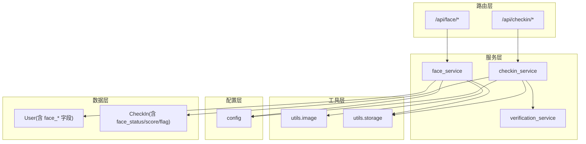
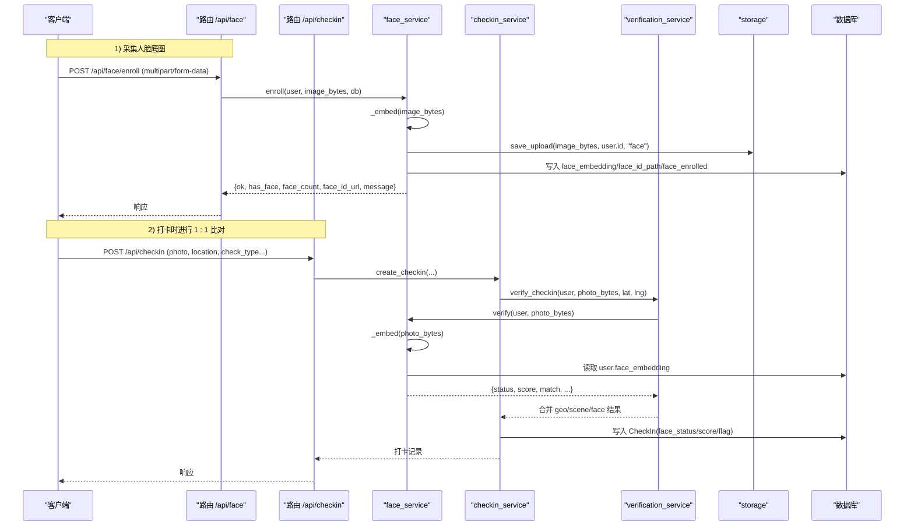
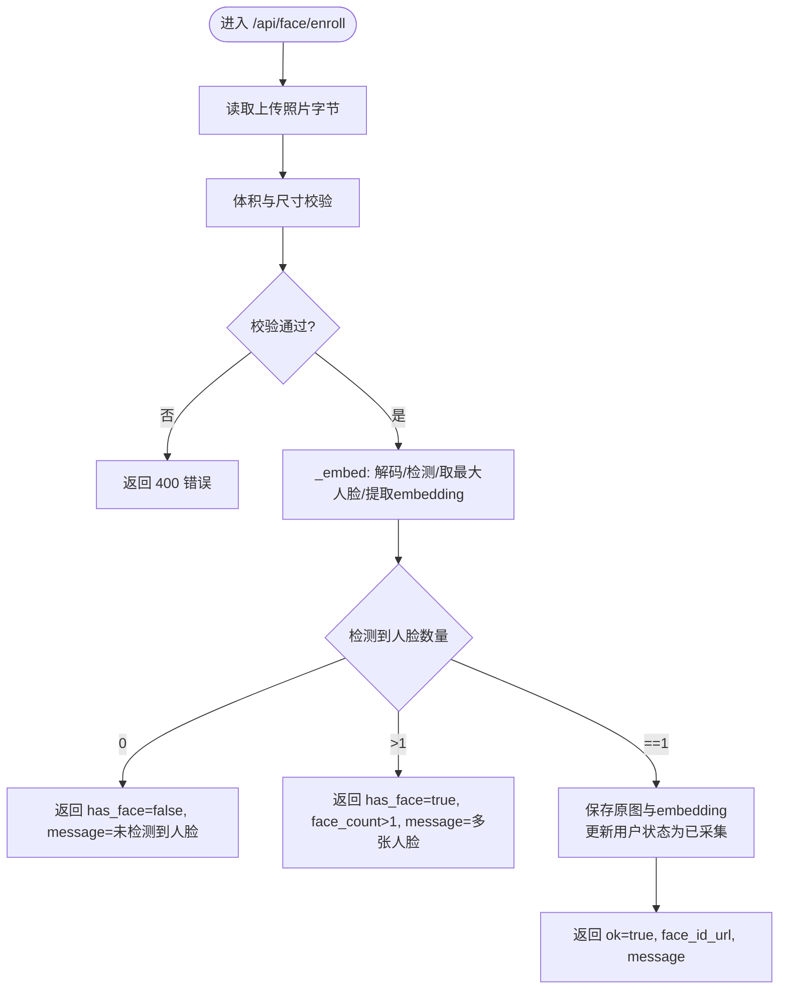
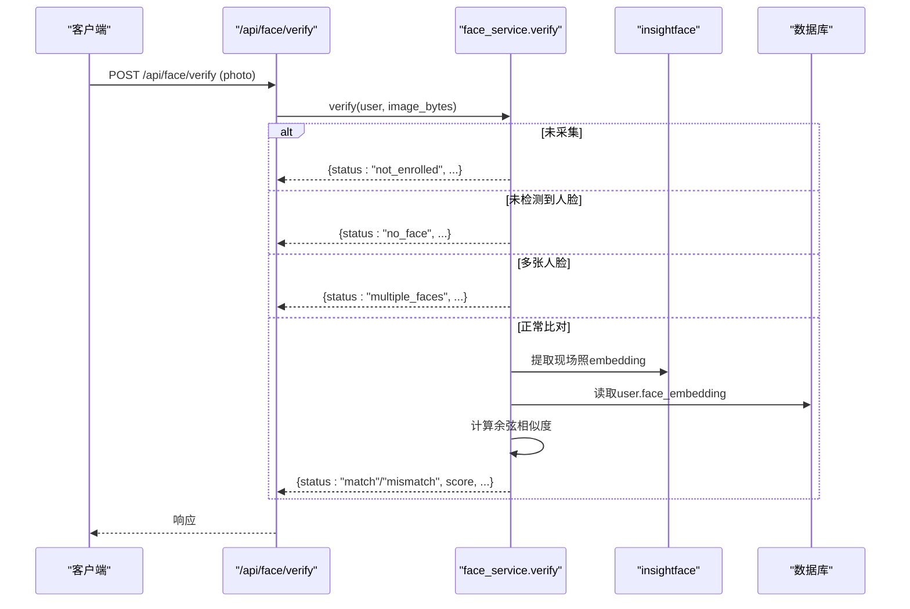
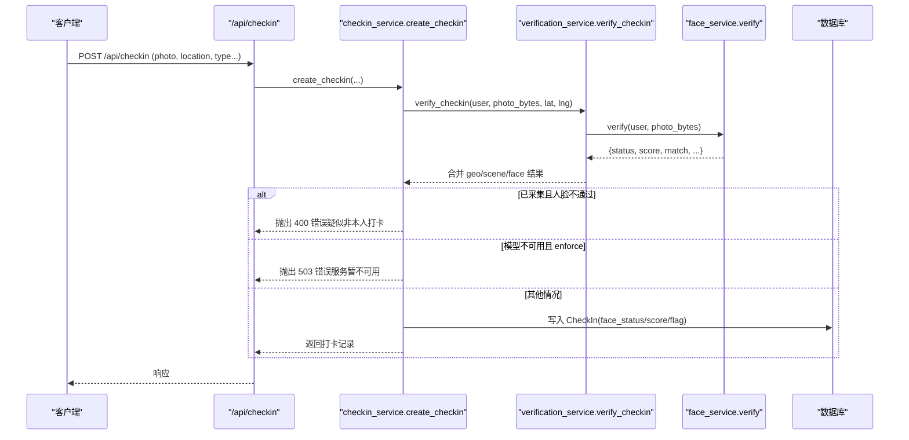
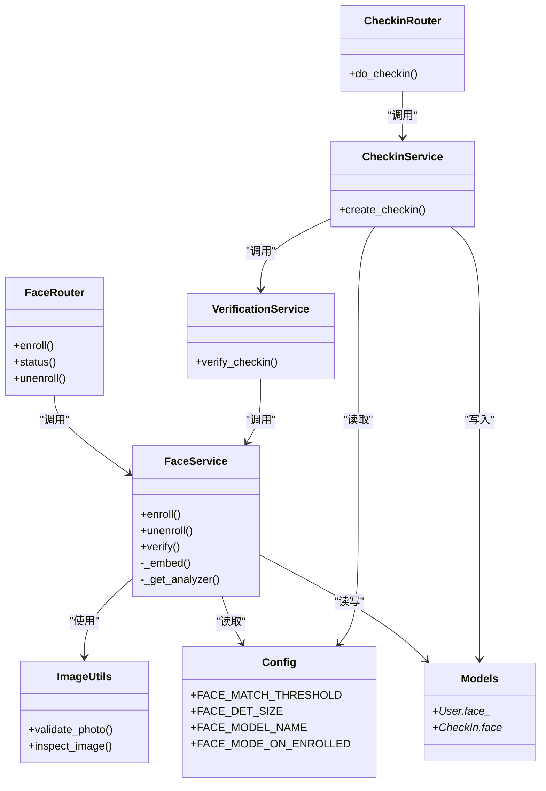

# 人脸识别接口

<cite>
**本文引用的文件**   
- [face.py](file://summer-homework-checkin/backend/app/routers/face.py)
- [face_service.py](file://summer-homework-checkin/backend/app/services/face_service.py)
- [image.py](file://summer-homework-checkin/backend/app/utils/image.py)
- [config.py](file://summer-homework-checkin/backend/app/config.py)
- [models.py](file://summer-homework-checkin/backend/app/models.py)
- [schemas.py](file://summer-homework-checkin/backend/app/schemas.py)
- [checkin.py](file://summer-homework-checkin/backend/app/routers/checkin.py)
- [checkin_service.py](file://summer-homework-checkin/backend/app/services/checkin_service.py)
</cite>

## 目录
1. [简介](#简介)
2. [项目结构](#项目结构)
3. [核心组件](#核心组件)
4. [架构总览](#架构总览)
5. [详细组件分析](#详细组件分析)
6. [依赖关系分析](#依赖关系分析)
7. [性能与调优](#性能与调优)
8. [故障排查指南](#故障排查指南)
9. [结论](#结论)
10. [附录：接口规范与示例](#附录接口规范与示例)

## 简介
本文件面向“暑假作业打卡”系统中的人脸识别能力，提供完整的 API 文档与集成说明。重点覆盖以下能力：
- 人脸底图采集（注册式 1:1 比对基准）
- 人脸特征提取与存储机制
- 实时 1:1 身份比对流程、阈值策略与返回格式
- 图像质量评估标准、格式与大小限制
- 准确率相关配置参数与调优建议
- 与打卡系统的集成方式与数据流转
- 完整调用示例、错误处理方案与性能优化指南

## 项目结构
本项目采用 FastAPI 路由 + 服务层 + 工具层的分层设计。人脸识别功能位于后端模块中，关键路径如下：
- 路由层：定义 /api/face 系列接口
- 服务层：封装模型加载、特征提取、相似度计算与业务规则
- 工具层：轻量图像解析与上传存储
- 配置层：阈值、尺寸、模型名等可调参数
- 数据层：用户表包含人脸字段；打卡记录表包含人脸校验结果字段

图示来源
- [face.py:1-45](file://summer-homework-checkin/backend/app/routers/face.py#L1-L45)
- [face_service.py:1-133](file://summer-homework-checkin/backend/app/services/face_service.py#L1-L133)
- [checkin.py:1-80](file://summer-homework-checkin/backend/app/routers/checkin.py#L1-L80)
- [checkin_service.py:1-254](file://summer-homework-checkin/backend/app/services/checkin_service.py#L1-L254)
- [image.py:1-61](file://summer-homework-checkin/backend/app/utils/image.py#L1-L61)
- [config.py:1-50](file://summer-homework-checkin/backend/app/config.py#L1-L50)
- [models.py:1-212](file://summer-homework-checkin/backend/app/models.py#L1-L212)

章节来源
- [face.py:1-45](file://summer-homework-checkin/backend/app/routers/face.py#L1-L45)
- [face_service.py:1-133](file://summer-homework-checkin/backend/app/services/face_service.py#L1-L133)
- [checkin.py:1-80](file://summer-homework-checkin/backend/app/routers/checkin.py#L1-L80)
- [checkin_service.py:1-254](file://summer-homework-checkin/backend/app/services/checkin_service.py#L1-L254)
- [image.py:1-61](file://summer-homework-checkin/backend/app/utils/image.py#L1-L61)
- [config.py:1-50](file://summer-homework-checkin/backend/app/config.py#L1-L50)
- [models.py:1-212](file://summer-homework-checkin/backend/app/models.py#L1-L212)

## 核心组件
- 路由组件
  - POST /api/face/enroll：采集人脸底图（仅学生角色），要求检测到且仅一张人脸
  - GET /api/face/status：查询当前账号是否已采集人脸底图及底图 URL
  - DELETE /api/face/enroll：撤销人脸底图（仅解绑，保留历史文件）
- 服务组件
  - 懒加载 insightface 分析器（CPU 模式），检测+512 维特征提取
  - enroll/unenroll/verify 三个核心方法，实现注册、撤销与 1:1 比对
- 工具组件
  - 轻量图像解析：支持 JPEG/PNG 头解析与尺寸提取，用于合规校验
  - 上传存储：保存上传文件并生成公开访问 URL
- 配置组件
  - 相似度阈值 FACE_MATCH_THRESHOLD、检测输入尺寸 FACE_DET_SIZE、模型名称 FACE_MODEL_NAME
  - 已采集后的人脸策略 FACE_MODE_ON_ENROLLED（enforce/soft）
- 数据模型
  - User 表新增 face_enrolled、face_embedding、face_id_path 字段
  - CheckIn 表新增 face_status、face_score、face_flag 字段用于记录比对结果

章节来源
- [face.py:14-44](file://summer-homework-checkin/backend/app/routers/face.py#L14-L44)
- [face_service.py:28-133](file://summer-homework-checkin/backend/app/services/face_service.py#L28-L133)
- [image.py:34-61](file://summer-homework-checkin/backend/app/utils/image.py#L34-L61)
- [config.py:41-50](file://summer-homework-checkin/backend/app/config.py#L41-L50)
- [models.py:27-31](file://summer-homework-checkin/backend/app/models.py#L27-L31)
- [models.py:87-90](file://summer-homework-checkin/backend/app/models.py#L87-L90)

## 架构总览
下图展示了从客户端到服务端的端到端流程，包括底图采集与打卡时的 1:1 比对。

图示来源
- [face.py:14-44](file://summer-homework-checkin/backend/app/routers/face.py#L14-L44)
- [face_service.py:71-125](file://summer-homework-checkin/backend/app/services/face_service.py#L71-L125)
- [checkin.py:17-37](file://summer-homework-checkin/backend/app/routers/checkin.py#L17-L37)
- [checkin_service.py:64-163](file://summer-homework-checkin/backend/app/services/checkin_service.py#L64-L163)

## 详细组件分析

### 组件一：POST /api/face/enroll（人脸底图采集）
- 功能概述
  - 接收用户上传的现场照片作为“人脸底图”，要求检测到且仅检测到一张人脸
  - 使用预训练模型进行人脸检测与 512 维特征提取，将特征向量与底图路径持久化至用户表
- 请求
  - 方法：POST
  - 路径：/api/face/enroll
  - Content-Type：multipart/form-data
  - 表单字段：
    - photo：图片文件（JPEG/PNG）
- 前置条件
  - 仅学生角色可调用
  - 图像需通过体积与尺寸校验（见“图像质量与格式要求”）
- 处理流程
  - 读取二进制数据
  - 调用服务层 _embed 进行解码、检测、排序取最大人脸、提取 embedding
  - 若未检测到人脸或检测到多张人脸，直接返回失败信息
  - 成功则保存原始图片与 embedding，标记已采集
- 响应
  - 返回 FaceEnrollOut 结构体，包含 ok、has_face、face_count、face_id_url、message
- 错误处理
  - 非学生角色：403
  - 未收到照片：400
  - 未检测到人脸或多张人脸：400（由服务层返回结构化消息）
- 存储机制
  - 原始图片保存到 uploads 目录，相对路径存入 user.face_id_path
  - 512 维向量以 JSON 字符串形式存入 user.face_embedding
  - 标记 user.face_enrolled = True

图示来源
- [face.py:14-26](file://summer-homework-checkin/backend/app/routers/face.py#L14-L26)
- [face_service.py:71-87](file://summer-homework-checkin/backend/app/services/face_service.py#L71-L87)
- [image.py:51-61](file://summer-homework-checkin/backend/app/utils/image.py#L51-L61)
- [models.py:27-31](file://summer-homework-checkin/backend/app/models.py#L27-L31)

章节来源
- [face.py:14-26](file://summer-homework-checkin/backend/app/routers/face.py#L14-L26)
- [face_service.py:71-87](file://summer-homework-checkin/backend/app/services/face_service.py#L71-L87)
- [image.py:51-61](file://summer-homework-checkin/backend/app/utils/image.py#L51-L61)
- [models.py:27-31](file://summer-homework-checkin/backend/app/models.py#L27-L31)

### 组件二：GET /api/face/status（查询采集状态）
- 功能概述
  - 查询当前账号是否已采集人脸底图，并提供底图公开 URL（若存在）
- 请求
  - 方法：GET
  - 路径：/api/face/status
- 响应
  - 返回 FaceStatusOut 结构体，包含 face_enrolled、face_id_url、message
- 用途
  - 前端在采集前提示用户先采集，或在管理端展示采集状态

章节来源
- [face.py:29-37](file://summer-homework-checkin/backend/app/routers/face.py#L29-L37)
- [schemas.py:240-244](file://summer-homework-checkin/backend/app/schemas.py#L240-L244)

### 组件三：DELETE /api/face/enroll（撤销底图）
- 功能概述
  - 撤销人脸底图（仅解绑，不删除历史文件，便于审计）
- 请求
  - 方法：DELETE
  - 路径：/api/face/enroll
- 响应
  - 返回 FaceStatusOut，表示已撤销

章节来源
- [face.py:40-44](file://summer-homework-checkin/backend/app/routers/face.py#L40-L44)
- [face_service.py:90-96](file://summer-homework-checkin/backend/app/services/face_service.py#L90-L96)

### 组件三：POST /api/face/verify（1:1 身份比对）
- 功能概述
  - 对现场照与已采集底图进行 1:1 比对，返回结构化结果
- 请求
  - 方法：POST
  - 路径：/api/face/verify
  - Content-Type：multipart/form-data
  - 表单字段：
    - photo：现场照片（JPEG/PNG）
- 处理流程
  - 若用户未采集底图：返回 not_enrolled
  - 若未检测到人脸：返回 no_face
  - 若检测到多张人脸：返回 multiple_faces
  - 否则计算余弦相似度并与阈值比较，返回 match/mismatch
- 响应
  - 返回结构包含 status、match、score、has_face、face_count、message
- 阈值与策略
  - 相似度阈值 FACE_MATCH_THRESHOLD 默认 0.4，可通过环境变量调整
  - 当模型不可用时，根据 FACE_MODE_ON_ENROLLED 决定拒绝或降级提示

图示来源
- [face_service.py:99-125](file://summer-homework-checkin/backend/app/services/face_service.py#L99-L125)
- [config.py:41-44](file://summer-homework-checkin/backend/app/config.py#L41-L44)

章节来源
- [face_service.py:99-125](file://summer-homework-checkin/backend/app/services/face_service.py#L99-L125)
- [config.py:41-44](file://summer-homework-checkin/backend/app/config.py#L41-L44)

### 组件四：与打卡系统集成（POST /api/checkin）
- 功能概述
  - 打卡流程中自动触发人脸 1:1 比对，依据策略决定是否拒绝打卡
- 集成点
  - 路由层：/api/checkin 接收打卡请求
  - 服务层：create_checkin 调用 verification_service 获取人脸结果
  - 人脸策略：
    - enforce：已采集且人脸不通过则拒绝打卡
    - soft：已采集但人脸不通过仅标记风险但仍记录
- 数据落库
  - CheckIn 表记录 face_status、face_score、face_flag 等字段
- 通知
  - 提交后通知学生与家长，等待审核

图示来源
- [checkin.py:17-37](file://summer-homework-checkin/backend/app/routers/checkin.py#L17-L37)
- [checkin_service.py:64-163](file://summer-homework-checkin/backend/app/services/checkin_service.py#L64-L163)
- [face_service.py:99-125](file://summer-homework-checkin/backend/app/services/face_service.py#L99-L125)

章节来源
- [checkin.py:17-37](file://summer-homework-checkin/backend/app/routers/checkin.py#L17-L37)
- [checkin_service.py:64-163](file://summer-homework-checkin/backend/app/services/checkin_service.py#L64-L163)
- [face_service.py:99-125](file://summer-homework-checkin/backend/app/services/face_service.py#L99-L125)

## 依赖关系分析
- 组件耦合
  - 路由层依赖服务层，服务层依赖工具层与配置层
  - 打卡服务依赖验证服务，验证服务调用人脸识别服务
- 外部依赖
  - insightface：首次调用按需下载模型，CPU 模式运行
  - OpenCV：图像解码
- 潜在循环依赖
  - 未发现循环导入；各层职责清晰
- 接口契约
  - 路由层与 Pydantic Schema 严格约束入参出参
  - 服务层返回结构化字典，便于统一处理

图示来源
- [face.py:1-45](file://summer-homework-checkin/backend/app/routers/face.py#L1-L45)
- [face_service.py:1-133](file://summer-homework-checkin/backend/app/services/face_service.py#L1-L133)
- [checkin.py:1-80](file://summer-homework-checkin/backend/app/routers/checkin.py#L1-L80)
- [checkin_service.py:1-254](file://summer-homework-checkin/backend/app/services/checkin_service.py#L1-L254)
- [image.py:1-61](file://summer-homework-checkin/backend/app/utils/image.py#L1-L61)
- [config.py:1-50](file://summer-homework-checkin/backend/app/config.py#L1-L50)
- [models.py:1-212](file://summer-homework-checkin/backend/app/models.py#L1-L212)

章节来源
- [face.py:1-45](file://summer-homework-checkin/backend/app/routers/face.py#L1-L45)
- [face_service.py:1-133](file://summer-homework-checkin/backend/app/services/face_service.py#L1-L133)
- [checkin.py:1-80](file://summer-homework-checkin/backend/app/routers/checkin.py#L1-L80)
- [checkin_service.py:1-254](file://summer-homework-checkin/backend/app/services/checkin_service.py#L1-L254)
- [image.py:1-61](file://summer-homework-checkin/backend/app/utils/image.py#L1-L61)
- [config.py:1-50](file://summer-homework-checkin/backend/app/config.py#L1-L50)
- [models.py:1-212](file://summer-homework-checkin/backend/app/models.py#L1-L212)

## 性能与调优
- 模型加载与缓存
  - 分析器懒加载且线程安全，避免重复初始化开销
  - 首次调用可能触发模型下载，建议在启动阶段预热或后台预加载
- 推理性能
  - 强制 CPU 模式（ctx_id=-1），适合无 GPU 环境
  - 检测输入尺寸 FACE_DET_SIZE 越小越快，但漏检率上升；可按场景权衡
- 相似度计算
  - 余弦相似度计算复杂度 O(d)，d=512，开销较小
- I/O 与存储
  - 上传文件按用户 ID 分目录存放，注意磁盘空间与清理策略
- 并发与锁
  - 全局锁保护模型实例与推理过程，避免竞态
- 调优建议
  - 提高 FACE_MATCH_THRESHOLD 可降低误识率但可能增加拒真率
  - 增大 FACE_DET_SIZE 提升检测稳定性但增加耗时
  - 在弱网或高并发环境下，考虑异步预热与连接池优化

章节来源
- [face_service.py:28-46](file://summer-homework-checkin/backend/app/services/face_service.py#L28-L46)
- [config.py:41-44](file://summer-homework-checkin/backend/app/config.py#L41-L44)

## 故障排查指南
- 常见问题
  - 未检测到人脸：检查光线、正脸角度、遮挡物
  - 多张人脸：确保画面中仅出现目标人物
  - 模型不可用：确认网络可下载模型或本地 ~/.insightface 目录可用
  - 体积/尺寸不符：确保 JPEG/PNG 且满足最小体积与边长限制
- 错误码与消息
  - 400：请求参数或图像不合规、人脸校验未通过
  - 403：非学生角色
  - 503：人脸识别服务暂不可用（enforce 模式下）
- 定位步骤
  - 查看返回的 face_status、face_score、face_flag 字段
  - 核对 FACE_MATCH_THRESHOLD 与 FACE_MODE_ON_ENROLLED 配置
  - 检查 uploads 目录是否存在对应文件与路径

章节来源
- [face_service.py:99-125](file://summer-homework-checkin/backend/app/services/face_service.py#L99-L125)
- [checkin_service.py:116-123](file://summer-homework-checkin/backend/app/services/checkin_service.py#L116-L123)
- [image.py:51-61](file://summer-homework-checkin/backend/app/utils/image.py#L51-L61)

## 结论
本系统实现了稳定的人脸底图采集与 1:1 比对能力，并通过打卡流程集成形成防代打卡闭环。通过合理的阈值与策略配置，可在准确率与用户体验之间取得平衡。建议在生产环境做好模型预热、监控与日志记录，持续优化检测尺寸与相似度阈值。

## 附录：接口规范与示例

### 通用要求
- 认证：所有接口均需携带有效令牌（Bearer Token）
- 字符集：UTF-8
- 时间与时区：UTC

### 图像质量与格式要求
- 支持格式：JPEG、PNG
- 文件大小：大于 5KB 且小于 10MB
- 最小边长：不小于 200 像素
- 质量建议：正脸、光线充足、无遮挡、背景简洁

章节来源
- [image.py:51-61](file://summer-homework-checkin/backend/app/utils/image.py#L51-L61)
- [config.py:30-32](file://summer-homework-checkin/backend/app/config.py#L30-L32)

### 接口清单与示例

#### POST /api/face/enroll
- 描述：采集人脸底图（1:1 比对基准）
- 请求
  - Content-Type：multipart/form-data
  - 字段：photo（图片文件）
- 响应
  - 结构：FaceEnrollOut
  - 关键字段：ok、has_face、face_count、face_id_url、message
- 示例（cURL）
  - curl -X POST https://your-domain/api/face/enroll -H "Authorization: Bearer YOUR_TOKEN" -F "photo=@/path/to/photo.jpg"
- 错误
  - 400：未收到照片、未检测到人脸、多张人脸
  - 403：非学生角色

章节来源
- [face.py:14-26](file://summer-homework-checkin/backend/app/routers/face.py#L14-L26)
- [schemas.py:232-238](file://summer-homework-checkin/backend/app/schemas.py#L232-L238)

#### GET /api/face/status
- 描述：查询人脸底图采集状态
- 请求：无额外参数
- 响应
  - 结构：FaceStatusOut
  - 关键字段：face_enrolled、face_id_url、message
- 示例（cURL）
  - curl -X GET https://your-domain/api/face/status -H "Authorization: Bearer YOUR_TOKEN"

章节来源
- [face.py:29-37](file://summer-homework-checkin/backend/app/routers/face.py#L29-L37)
- [schemas.py:240-244](file://summer-homework-checkin/backend/app/schemas.py#L240-L244)

#### DELETE /api/face/enroll
- 描述：撤销人脸底图
- 请求：无额外参数
- 响应
  - 结构：FaceStatusOut
- 示例（cURL）
  - curl -X DELETE https://your-domain/api/face/enroll -H "Authorization: Bearer YOUR_TOKEN"

章节来源
- [face.py:40-44](file://summer-homework-checkin/backend/app/routers/face.py#L40-L44)

#### POST /api/face/verify
- 描述：1:1 身份比对
- 请求
  - Content-Type：multipart/form-data
  - 字段：photo（现场照片）
- 响应
  - 结构：包含 status、match、score、has_face、face_count、message
  - status 取值：not_enrolled、no_face、multiple_faces、match、mismatch
- 示例（cURL）
  - curl -X POST https://your-domain/api/face/verify -H "Authorization: Bearer YOUR_TOKEN" -F "photo=@/path/to/photo.jpg"
- 错误
  - 400：未检测到人脸、多张人脸
  - 503：模型不可用（enforce 模式）

章节来源
- [face_service.py:99-125](file://summer-homework-checkin/backend/app/services/face_service.py#L99-L125)
- [config.py:41-50](file://summer-homework-checkin/backend/app/config.py#L41-L50)

### 与打卡系统的集成要点
- 打卡时自动触发人脸比对
- 若已采集且人脸不通过，按策略拒绝或标记风险
- 打卡记录中包含 face_status、face_score、face_flag 字段，便于后续审计与分析

章节来源
- [checkin_service.py:116-143](file://summer-homework-checkin/backend/app/services/checkin_service.py#L116-L143)
- [models.py:87-90](file://summer-homework-checkin/backend/app/models.py#L87-L90)

### 配置参数与调优建议
- FACE_MATCH_THRESHOLD：相似度阈值，默认 0.4，越高越严格
- FACE_DET_SIZE：检测输入尺寸，默认 (320, 320)，影响速度与稳定性
- FACE_MODEL_NAME：模型名称，默认 buffalo_l
- FACE_MODE_ON_ENROLLED：已采集后的策略，enforce 或 soft
- 调优建议
  - 在真实场景中收集样本，统计误识率与拒真率，动态调整阈值
  - 针对光照与遮挡问题，优化前端拍摄引导与预处理
  - 在高并发场景下，预热模型并监控推理延迟

章节来源
- [config.py:41-50](file://summer-homework-checkin/backend/app/config.py#L41-L50)