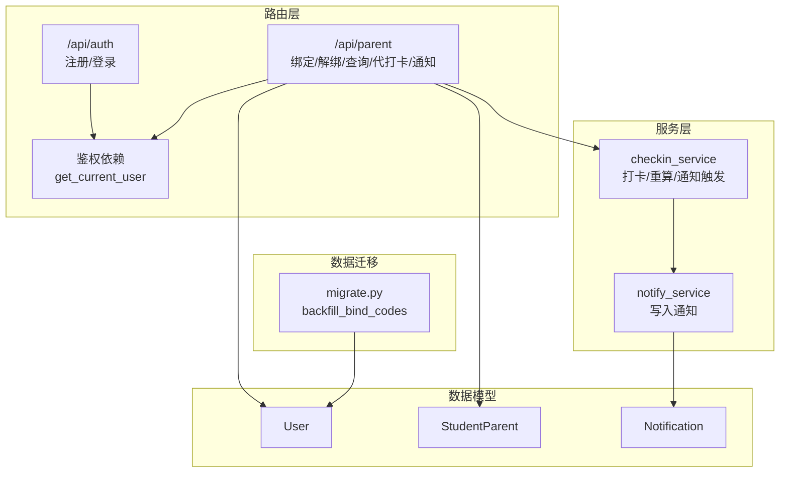
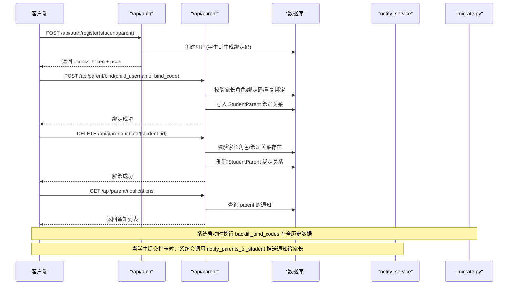
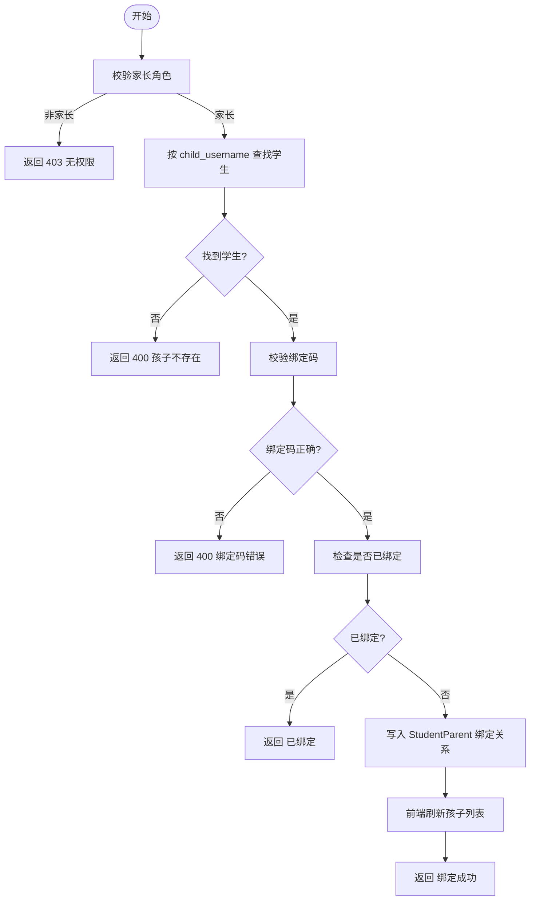
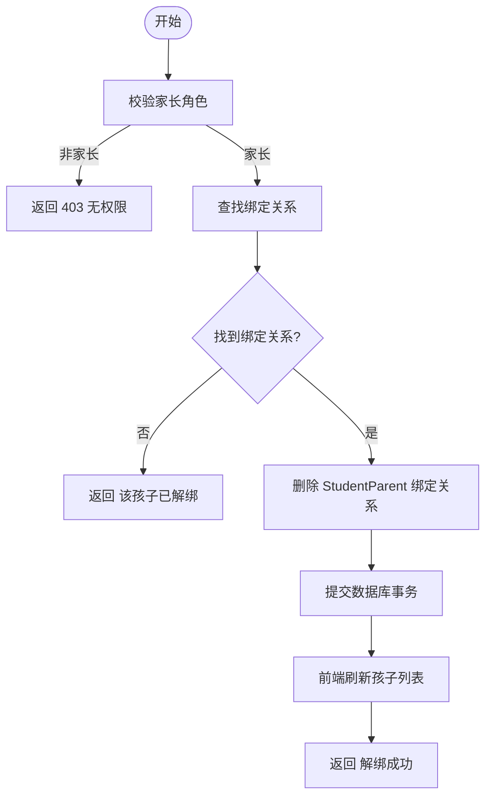
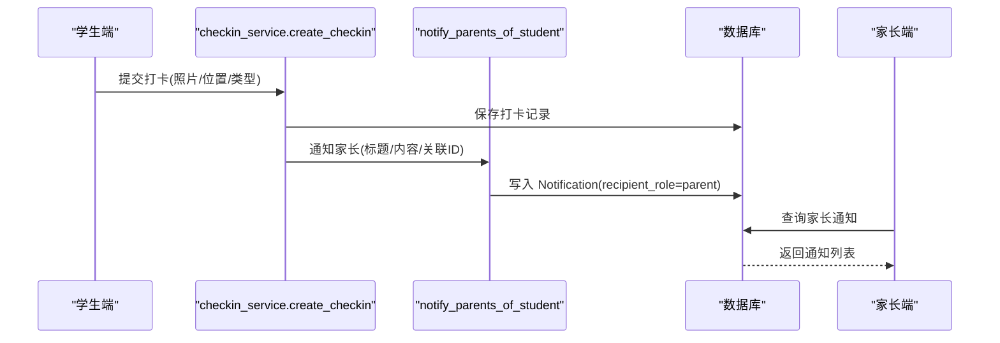
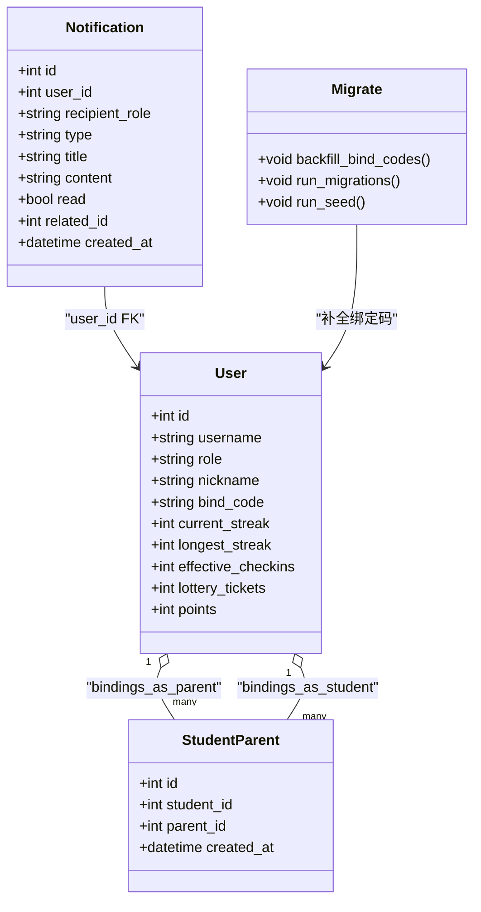

# 家长绑定接口

<cite>
**本文引用的文件**
- [README.md](file://summer-homework-checkin/README.md)
- [auth.py](file://summer-homework-checkin/backend/app/routers/auth.py)
- [parent.py](file://summer-homework-checkin/backend/app/routers/parent.py)
- [models.py](file://summer-homework-checkin/backend/app/models.py)
- [schemas.py](file://summer-homework-checkin/backend/app/schemas.py)
- [checkin_service.py](file://summer-homework-checkin/backend/app/services/checkin_service.py)
- [notify_service.py](file://summer-homework-checkin/backend/app/services/notify_service.py)
- [migrate.py](file://summer-homework-checkin/backend/migrate.py)
- [app.js](file://summer-homework-checkin/frontend/student/app.js)
- [index.html](file://summer-homework-checkin/frontend/student/index.html)
</cite>

## 更新摘要
**变更内容**
- 新增后端解绑接口 DELETE /api/parent/unbind/{student_id} 的完整实现
- 前端家长解绑界面功能完善，支持在已绑定孩子列表中执行解绑操作
- 增强了家长对孩子绑定关系的管理能力，提供完整的绑定-解绑闭环体验
- 解绑操作包含权限校验、关系验证和状态管理

## 目录
1. [简介](#简介)
2. [项目结构](#项目结构)
3. [核心组件](#核心组件)
4. [架构总览](#架构总览)
5. [详细组件分析](#详细组件分析)
6. [依赖关系分析](#依赖关系分析)
7. [性能与扩展性](#性能与扩展性)
8. [故障排查指南](#故障排查指南)
9. [结论](#结论)
10. [附录：完整流程示例与最佳实践](#附录完整流程示例与最佳实践)

## 简介
本文件面向"家长-孩子绑定关系"的API，覆盖以下能力：
- 家长账号注册、登录与鉴权
- 孩子账号注册与绑定码生成机制
- 家长绑定孩子、查询已绑定的孩子列表
- **新增**：家长解绑孩子、管理绑定关系
- 家长查看孩子学习进度（连续打卡、今日状态等）
- 接收打卡通知（站内通知）
- 家长代孩子打卡、兑换、抽奖等关联操作
- 权限控制与安全性保障（角色校验、绑定关系校验）
- 数据模型与状态管理（绑定关系表、通知表、用户统计字段）
- 错误处理方案与用户体验优化建议

该功能基于 FastAPI + SQLAlchemy 实现，采用前后端分离架构。学生端 H5 提供绑定码展示；家长端通过绑定码完成绑定并接收实时通知。**最新更新**：新增了完整的家长解绑功能，包括后端DELETE /api/parent/unbind/{student_id}接口和前端解绑界面，增强了家长对孩子绑定关系的管理能力。

章节来源
- [README.md:81-94](file://summer-homework-checkin/README.md#L81-L94)

## 项目结构
与"家长绑定"相关的关键路径与职责：
- 路由层
  - /api/auth：注册、登录、获取当前用户信息
  - /api/parent：家长专属能力（绑定、解绑、查询、代打卡、通知、报告等）
- 服务层
  - checkin_service：打卡业务逻辑（含通知触发）
  - notify_service：站内通知写入
- 数据模型
  - User：统一用户表（student/parent/admin），包含绑定码、统计冗余字段
  - StudentParent：家长-孩子多对多绑定关系
  - Notification：站内通知记录
- 请求/响应模式
  - schemas：BindRequest、ChildSummary、NotificationOut 等
- **新增**：数据迁移工具
  - migrate.py：数据库迁移和数据回填功能

图表来源
- [auth.py:13-37](file://summer-homework-checkin/backend/app/routers/auth.py#L13-L37)
- [parent.py:20-46](file://summer-homework-checkin/backend/app/routers/parent.py#L20-L46)
- [checkin_service.py:148-163](file://summer-homework-checkin/backend/app/services/checkin_service.py#L148-L163)
- [notify_service.py:1-20](file://summer-homework-checkin/backend/app/services/notify_service.py#L1-L20)
- [models.py:11-68](file://summer-homework-checkin/backend/app/models.py#L11-L68)
- [migrate.py:136-156](file://summer-homework-checkin/backend/migrate.py#L136-L156)

章节来源
- [README.md:26-49](file://summer-homework-checkin/README.md#L26-L49)

## 核心组件
- 认证与令牌
  - 注册：支持 student/parent 两种角色；学生注册后自动生成绑定码
  - 登录：返回访问令牌与用户基本信息
  - 当前用户：通过依赖注入获取当前登录用户上下文
- 家长绑定管理
  - 绑定：仅家长可绑定；根据孩子用户名+绑定码校验；重复绑定幂等
  - **新增**：解绑：仅家长可解绑；校验绑定关系存在性；删除绑定关系
  - 查询：列出家长已绑定的所有孩子及其关键状态
- 通知
  - 家长通知：按 recipient_role=parent 过滤
  - 打卡通知：提交打卡时自动向孩子与家长发送站内通知
- 数据模型
  - User.bind_code：学生绑定码（Sxxxxx 格式）
  - StudentParent：绑定关系（多对多）
  - Notification：通知记录（type、title、content、read 等）
- **新增**：数据迁移增强
  - backfill_bind_codes：为已有学生补全缺失的绑定码

章节来源
- [auth.py:13-37](file://summer-homework-checkin/backend/app/routers/auth.py#L13-L37)
- [parent.py:20-46](file://summer-homework-checkin/backend/app/routers/parent.py#L20-L46)
- [notify_service.py:1-20](file://summer-homework-checkin/backend/app/services/notify_service.py#L1-L20)
- [models.py:11-68](file://summer-homework-checkin/backend/app/models.py#L11-L68)
- [schemas.py:156-182](file://summer-homework-checkin/backend/app/schemas.py#L156-L182)
- [migrate.py:136-156](file://summer-homework-checkin/backend/migrate.py#L136-L156)

## 架构总览
家长绑定链路涉及"认证 → 绑定/解绑 → 通知 → 查询"的闭环。下图展示了从家长注册到绑定成功、再到收到通知的核心交互。

图表来源
- [auth.py:13-37](file://summer-homework-checkin/backend/app/routers/auth.py#L13-L37)
- [parent.py:20-46](file://summer-homework-checkin/backend/app/routers/parent.py#L20-L46)
- [parent.py:190-196](file://summer-homework-checkin/backend/app/routers/parent.py#L190-L196)
- [notify_service.py:16-20](file://summer-homework-checkin/backend/app/services/notify_service.py#L16-L20)
- [migrate.py:136-156](file://summer-homework-checkin/backend/migrate.py#L136-L156)

## 详细组件分析

### 家长注册与登录
- 注册
  - 支持 role=student 或 role=parent
  - 学生注册成功后自动生成绑定码（Sxxxxx 格式）
  - 返回 access_token 与用户信息
- 登录
  - 校验用户名与密码，返回 access_token 与用户信息
- 当前用户
  - 通过依赖注入获取当前登录用户上下文，用于后续鉴权

章节来源
- [auth.py:13-37](file://summer-homework-checkin/backend/app/routers/auth.py#L13-L37)
- [auth.py:40-52](file://summer-homework-checkin/backend/app/routers/auth.py#L40-L52)
- [schemas.py:5-44](file://summer-homework-checkin/backend/app/schemas.py#L5-L44)

### 绑定码生成机制
- 生成时机：学生注册成功时
- 生成规则：以 S 开头，拼接用户ID的五位定长数字（不足补零）
- 存储位置：User.bind_code
- 用途：家长凭此码绑定对应孩子账号
- **增强**：系统启动时自动为历史数据补全缺失的绑定码

章节来源
- [auth.py:32-36](file://summer-homework-checkin/backend/app/routers/auth.py#L32-L36)
- [models.py:25](file://summer-homework-checkin/backend/app/models.py#L25)
- [migrate.py:136-156](file://summer-homework-checkin/backend/migrate.py#L136-L156)

### 家长绑定孩子
- 接口：POST /api/parent/bind
- 入参：child_username、bind_code
- 校验逻辑：
  - 仅家长角色可绑定
  - 孩子存在且为 student 角色
  - 绑定码匹配
  - 重复绑定幂等返回"已绑定"
- 结果：写入 StudentParent 绑定关系，返回绑定成功
- **前端实现**：家长登录后显示绑定界面，支持输入孩子用户名和绑定码进行绑定

图表来源
- [parent.py:20-32](file://summer-homework-checkin/backend/app/routers/parent.py#L20-L32)
- [app.js:112-133](file://summer-homework-checkin/frontend/student/app.js#L112-L133)
- [index.html:53-62](file://summer-homework-checkin/frontend/student/index.html#L53-L62)

章节来源
- [parent.py:20-32](file://summer-homework-checkin/backend/app/routers/parent.py#L20-L32)
- [schemas.py:156-159](file://summer-homework-checkin/backend/app/schemas.py#L156-L159)
- [app.js:112-133](file://summer-homework-checkin/frontend/student/app.js#L112-L133)
- [index.html:53-62](file://summer-homework-checkin/frontend/student/index.html#L53-L62)

### 家长解绑孩子
- 接口：DELETE /api/parent/unbind/{student_id}
- 入参：student_id（要解绑的孩子ID）
- 校验逻辑：
  - 仅家长角色可解绑
  - 检查是否存在有效的绑定关系
  - 如果已解绑则返回提示信息
- 结果：删除 StudentParent 绑定关系，返回解绑成功
- **前端实现**：在家长已绑定孩子列表中显示"解绑"按钮，点击后确认并执行解绑操作

图表来源
- [parent.py:35-46](file://summer-homework-checkin/backend/app/routers/parent.py#L35-L46)
- [app.js:134-142](file://summer-homework-checkin/frontend/student/app.js#L134-L142)
- [index.html:236-237](file://summer-homework-checkin/frontend/student/index.html#L236-L237)

**新增** 家长解绑功能提供了完整的绑定关系管理能力，确保家长可以灵活管理多个孩子的绑定状态。

章节来源
- [parent.py:35-46](file://summer-homework-checkin/backend/app/routers/parent.py#L35-L46)
- [app.js:134-142](file://summer-homework-checkin/frontend/student/app.js#L134-L142)
- [index.html:236-237](file://summer-homework-checkin/frontend/student/index.html#L236-L237)

### 家长查询已绑定孩子
- 接口：GET /api/parent/children
- 返回：每个孩子的摘要信息（昵称、连续天数、有效打卡数、抽奖券、积分、今日打卡状态等）
- 数据来源：StudentParent 绑定关系 + User 统计字段 + 今日打卡状态
- **前端集成**：家长登录后自动加载已绑定孩子列表，支持切换不同孩子进行操作，并提供解绑功能

章节来源
- [parent.py:49-65](file://summer-homework-checkin/backend/app/routers/parent.py#L49-L65)
- [schemas.py:172-182](file://summer-homework-checkin/backend/app/schemas.py#L172-L182)
- [app.js:147-158](file://summer-homework-checkin/frontend/student/app.js#L147-L158)

### 家长查看孩子学习进度
- 接口：GET /api/parent/child-streak/{child_id}
- 权限：需先绑定该孩子
- 返回：孩子当前连续天数、历史最长连续、有效打卡次数、抽奖券、积分、今日打卡状态

章节来源
- [parent.py:81-91](file://summer-homework-checkin/backend/app/routers/parent.py#L81-L91)
- [checkin_service.py:225-253](file://summer-homework-checkin/backend/app/services/checkin_service.py#L225-L253)

### 接收打卡通知
- 接口：GET /api/parent/notifications
- 说明：返回当前家长收到的站内通知列表（按时间倒序）
- 触发时机：学生提交打卡时，系统调用 notify_parents_of_student 向家长写入通知

图表来源
- [checkin_service.py:148-163](file://summer-homework-checkin/backend/app/services/checkin_service.py#L148-L163)
- [notify_service.py:16-20](file://summer-homework-checkin/backend/app/services/notify_service.py#L16-L20)
- [parent.py:204-210](file://summer-homework-checkin/backend/app/routers/parent.py#L204-L210)

章节来源
- [parent.py:204-210](file://summer-homework-checkin/backend/app/routers/parent.py#L204-L210)
- [notify_service.py:1-20](file://summer-homework-checkin/backend/app/services/notify_service.py#L1-L20)

### 家长代孩子打卡（可选能力）
- 接口：POST /api/parent/checkin
- 说明：家长可为已绑定的孩子提交打卡，积分计入孩子账户
- 权限：需先绑定该孩子
- 注意：仍遵循正常打卡的业务规则（照片合规、人脸策略、地理阈值等）

章节来源
- [parent.py:94-118](file://summer-homework-checkin/backend/app/routers/parent.py#L94-L118)
- [checkin_service.py:64-163](file://summer-homework-checkin/backend/app/services/checkin_service.py#L64-L163)

### 批量绑定/解绑
- 现状：未提供批量绑定/解绑接口
- 建议：在管理员侧提供批量操作接口（如 /api/admin/batch-bind），并对操作者进行 admin 角色校验与审计日志记录

章节来源
- [admin.py:1-214](file://summer-homework-checkin/backend/app/routers/admin.py#L1-L214)

### 绑定关系的查询接口与状态管理
- 查询已绑定孩子：GET /api/parent/children
- 查询单个孩子进度：GET /api/parent/child-streak/{child_id}
- 状态管理：
  - 绑定关系持久化于 StudentParent
  - 孩子状态由 User 统计字段与打卡服务维护（连续天数、有效打卡数、抽奖券等）
  - **新增**：解绑操作直接删除绑定关系记录，不影响历史数据

章节来源
- [parent.py:49-65](file://summer-homework-checkin/backend/app/routers/parent.py#L49-L65)
- [parent.py:81-91](file://summer-homework-checkin/backend/app/routers/parent.py#L81-L91)
- [models.py:35-41](file://summer-homework-checkin/backend/app/models.py#L35-L41)

### 数据同步机制
- 打卡审核通过后，系统会：
  - 更新打卡记录的 is_effective 与 review_status
  - 增加孩子积分
  - 重算连续天数与抽奖资格
  - 向学生与家长发送通知
- 家长端可通过 children 与 child-streak 接口获取最新状态
- **数据迁移增强**：系统启动时自动执行 backfill_bind_codes 确保所有学生都有有效的绑定码

章节来源
- [checkin_service.py:166-191](file://summer-homework-checkin/backend/app/services/checkin_service.py#L166-L191)
- [checkin_service.py:39-61](file://summer-homework-checkin/backend/app/services/checkin_service.py#L39-L61)
- [notify_service.py:1-20](file://summer-homework-checkin/backend/app/services/notify_service.py#L1-L20)
- [migrate.py:136-156](file://summer-homework-checkin/backend/migrate.py#L136-L156)

### 与家长监督功能的集成与数据访问权限控制
- 权限控制：
  - 家长操作均需通过 get_current_user 鉴权
  - 针对具体孩子操作前，使用 _resolve_child/_check_child_access 校验绑定关系
  - **新增**：解绑操作同样需要严格的权限校验和绑定关系验证
- 数据访问：
  - 家长仅能访问自己绑定的孩子数据
  - 通知按 recipient_role=parent 隔离

章节来源
- [parent.py:68-78](file://summer-homework-checkin/backend/app/routers/parent.py#L68-78)
- [parent.py:222-228](file://summer-homework-checkin/backend/app/routers/parent.py#L222-L228)
- [parent.py:204-210](file://summer-homework-checkin/backend/app/routers/parent.py#L204-L210)

## 依赖关系分析
- 路由依赖
  - auth.py 负责用户注册/登录，生成 token
  - parent.py 依赖 deps.get_current_user 进行鉴权，依赖 services.checkin_service 与 services.notify_service
- 模型依赖
  - User 与 StudentParent 双向关系
  - Notification 独立表，被 notify_service 写入
- 外部依赖
  - 人脸识别与地理位置校验在打卡流程中触发（影响家长代打卡场景）
- **新增依赖**：数据迁移工具
  - migrate.py 在应用启动时执行数据回填和种子数据初始化

图表来源
- [models.py:11-68](file://summer-homework-checkin/backend/app/models.py#L11-L68)
- [migrate.py:136-156](file://summer-homework-checkin/backend/migrate.py#L136-L156)

章节来源
- [auth.py:13-37](file://summer-homework-checkin/backend/app/routers/auth.py#L13-L37)
- [parent.py:20-46](file://summer-homework-checkin/backend/app/routers/parent.py#L20-L46)
- [models.py:11-68](file://summer-homework-checkin/backend/app/models.py#L11-L68)
- [migrate.py:136-156](file://summer-homework-checkin/backend/migrate.py#L136-L156)

## 性能与扩展性
- 绑定查询：children 接口为 O(n) 遍历绑定关系，n 为家长绑定的孩子数量，通常较小
- 通知写入：notify_parents_of_student 为循环写入，家长数量少时开销可控
- 数据回填：backfill_bind_codes 为一次性操作，仅在系统启动时执行
- **新增**：解绑操作为 O(1) 数据库删除操作，性能开销极小
- 可扩展点：
  - 引入缓存（如 Redis）缓存 children 列表，降低频繁查询压力
  - 通知异步化（消息队列）提升高并发下的稳定性
  - 批量绑定/解绑接口可结合事务与分批写入避免锁竞争

[本节为通用指导，不直接分析具体文件]

## 故障排查指南
- 绑定失败
  - 403 无权限：确认当前用户角色为 parent
  - 400 孩子不存在/绑定码错误：核对 child_username 与 bind_code
  - 重复绑定：幂等返回"已绑定"，无需重试
- **新增**：解绑失败
  - 403 无权限：确认当前用户角色为 parent
  - 已解绑：如果返回"该孩子已解绑"，说明绑定关系不存在，无需重复操作
  - 网络错误：检查网络连接和服务器状态
- 通知未收到
  - 确认学生已提交打卡且系统触发了 notify_parents_of_student
  - 检查 Notification 表中 recipient_role=parent 的记录是否存在
- 家长代打卡失败
  - 照片尺寸/格式不合规
  - 人脸策略拒绝（已采集底图且比对不通过）
  - 地理位置异常标记风险（不影响提交，但后台可见）
- **新增**：前端解绑问题
  - 确认解绑按钮是否正确绑定到 unbindChild 方法
  - 检查 API 调用是否正确传递 student_id 参数
  - 验证解绑成功后是否正确刷新孩子列表

章节来源
- [parent.py:20-46](file://summer-homework-checkin/backend/app/routers/parent.py#L20-L46)
- [checkin_service.py:64-163](file://summer-homework-checkin/backend/app/services/checkin_service.py#L64-L163)
- [notify_service.py:16-20](file://summer-homework-checkin/backend/app/services/notify_service.py#L16-L20)
- [migrate.py:136-156](file://summer-homework-checkin/backend/migrate.py#L136-L156)
- [app.js:134-142](file://summer-homework-checkin/frontend/student/app.js#L134-L142)

## 结论
家长绑定体系以"学生绑定码 + 家长角色校验 + 绑定关系表"为核心，实现了安全的家长-孩子关联与通知联动。**最新更新**：新增了完整的家长解绑功能，包括后端DELETE /api/parent/unbind/{student_id}接口和前端解绑界面，显著增强了家长对孩子绑定关系的管理能力。现有接口覆盖了注册、绑定、解绑、查询、通知与代打卡等完整生命周期。系统提供了完善的权限控制和错误处理机制，确保了操作的安全性和用户体验的流畅性。若需进一步完善，可考虑添加批量操作接口和更丰富的操作历史记录功能。

[本节为总结，不直接分析具体文件]

## 附录：完整流程示例与最佳实践

### 完整绑定与解绑流程示例
- 步骤一：学生注册
  - 调用 /api/auth/register(role=student)，系统生成绑定码
- 步骤二：家长注册
  - 调用 /api/auth/register(role=parent)
- 步骤三：家长登录
  - 调用 /api/auth/login，获取 access_token
- 步骤四：家长绑定孩子
  - 在前端界面输入孩子用户名和绑定码
  - 调用 /api/parent/bind(child_username, bind_code)
- 步骤五：家长查看孩子列表
  - 调用 /api/parent/children
- 步骤六：家长查看孩子进度
  - 调用 /api/parent/child-streak/{child_id}
- **新增**：步骤七：家长解绑孩子
  - 在孩子列表中点击"解绑"按钮
  - 确认解绑操作
  - 调用 /api/parent/unbind/{student_id}
- 步骤八：家长接收通知
  - 调用 /api/parent/notifications
- **新增**：数据迁移
  - 系统启动时自动执行 backfill_bind_codes 补全历史数据

章节来源
- [auth.py:13-37](file://summer-homework-checkin/backend/app/routers/auth.py#L13-L37)
- [auth.py:40-52](file://summer-homework-checkin/backend/app/routers/auth.py#L40-L52)
- [parent.py:20-46](file://summer-homework-checkin/backend/app/routers/parent.py#L20-L46)
- [parent.py:81-91](file://summer-homework-checkin/backend/app/routers/parent.py#L81-L91)
- [parent.py:204-210](file://summer-homework-checkin/backend/app/routers/parent.py#L204-L210)
- [migrate.py:136-156](file://summer-homework-checkin/backend/migrate.py#L136-L156)

### 错误处理方案
- 统一返回 HTTP 状态码与 detail 消息
- 重复绑定幂等返回"已绑定"
- **新增**：重复解绑返回"该孩子已解绑"提示
- 人脸/地理校验失败时返回明确提示，便于前端引导用户修正
- **前端优化**：绑定/解绑失败时显示具体错误原因，支持用户重新尝试

章节来源
- [parent.py:20-46](file://summer-homework-checkin/backend/app/routers/parent.py#L20-L46)
- [checkin_service.py:64-163](file://summer-homework-checkin/backend/app/services/checkin_service.py#L64-L163)
- [app.js:112-142](file://summer-homework-checkin/frontend/student/app.js#L112-L142)

### 用户体验优化建议
- 在学生端"我的"页面清晰展示绑定码，并提供一键复制
- 家长端绑定成功后即时刷新孩子列表与今日状态
- **新增**：家长端解绑操作前显示确认对话框，防止误操作
- **新增**：解绑成功后自动刷新孩子列表，如无孩子则返回首页
- 通知中心提供未读计数与已读标记（已有 read 字段）
- 家长代打卡时给出明确的失败原因与修复指引（如照片尺寸、人脸策略）
- **新增优化**：绑定/解绑界面提供清晰的输入提示和错误反馈，支持操作状态验证

章节来源
- [schemas.py:172-182](file://summer-homework-checkin/backend/app/schemas.py#L172-L182)
- [notify_service.py:1-20](file://summer-homework-checkin/backend/app/services/notify_service.py#L1-L20)
- [index.html:236-237](file://summer-homework-checkin/frontend/student/index.html#L236-L237)
- [app.js:112-142](file://summer-homework-checkin/frontend/student/app.js#L112-L142)