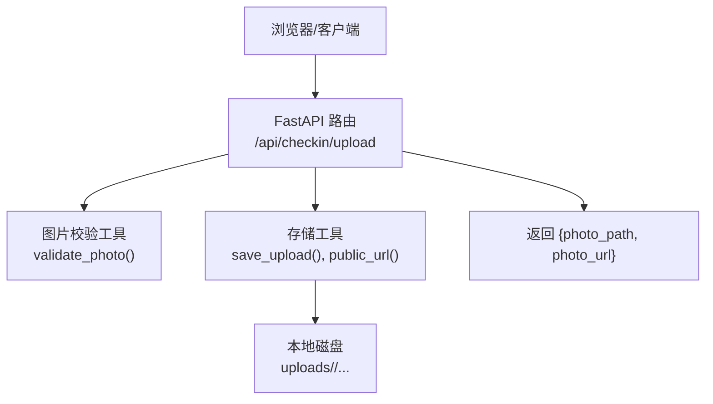
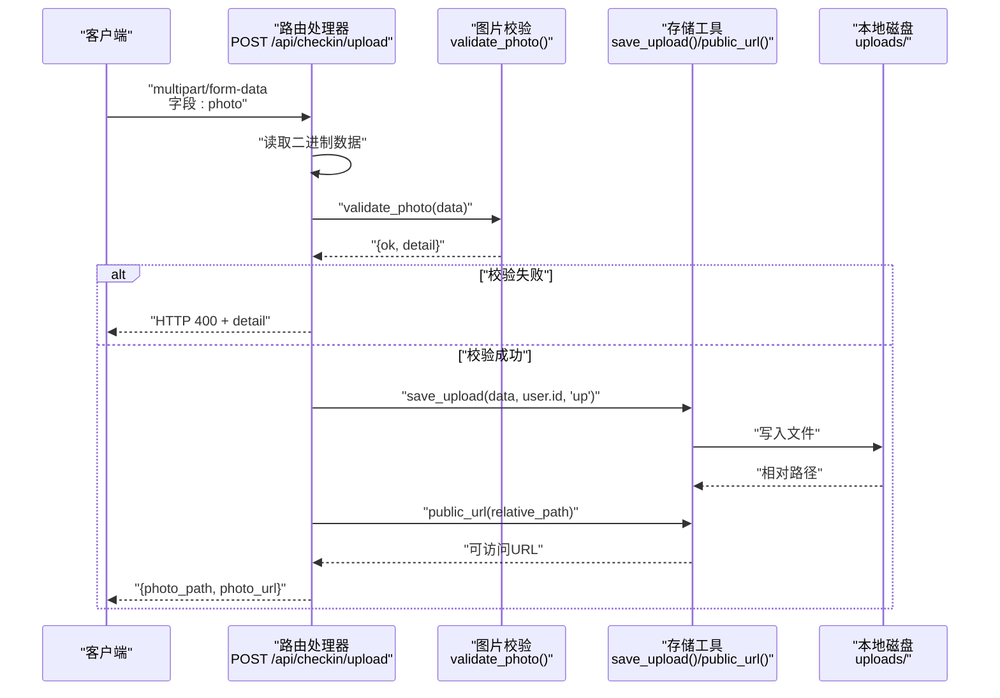
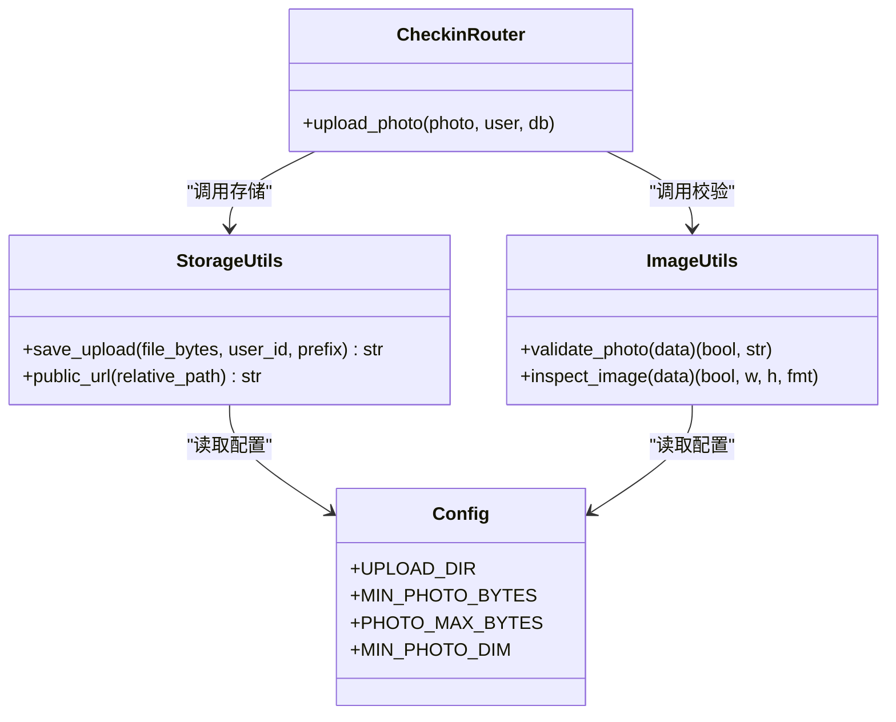
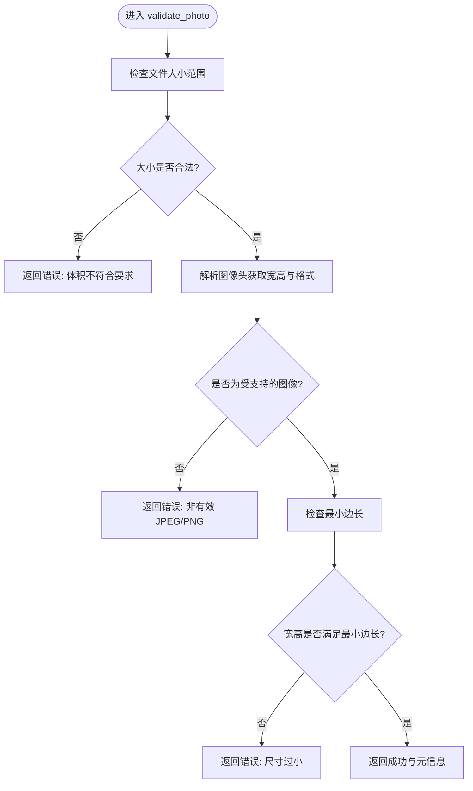
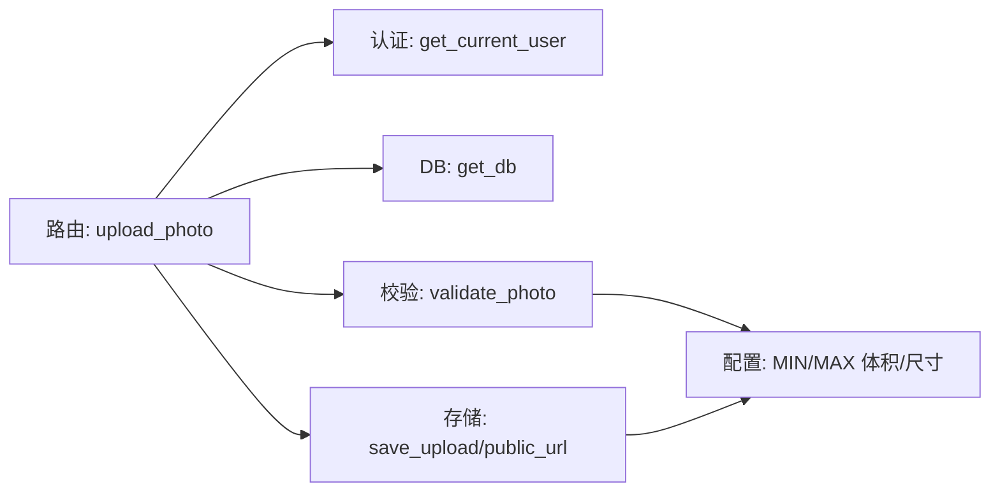

# 图片上传接口

<cite>
**本文引用的文件**
- [checkin.py](file://summer-homework-checkin/backend/app/routers/checkin.py)
- [image.py](file://summer-homework-checkin/backend/app/utils/image.py)
- [storage.py](file://summer-homework-checkin/backend/app/utils/storage.py)
- [config.py](file://summer-homework-checkin/backend/app/config.py)
- [app.js（管理员前端）](file://summer-homework-checkin/frontend/admin/app.js)
</cite>

## 目录
1. [简介](#简介)
2. [项目结构](#项目结构)
3. [核心组件](#核心组件)
4. [架构总览](#架构总览)
5. [详细组件分析](#详细组件分析)
6. [依赖关系分析](#依赖关系分析)
7. [性能与容量规划](#性能与容量规划)
8. [故障排查指南](#故障排查指南)
9. [结论](#结论)
10. [附录：API 规范与前端集成示例](#附录api-规范与前端集成示例)

## 简介
本接口为通用图片上传能力，主要服务于“图片查看器”的上传场景。通过 POST /api/checkin/upload，客户端可上传单张图片，后端进行基础安全与格式校验、落盘存储并返回可直接访问的图片路径与 URL，便于在图片查看器中即时展示。

该接口与打卡主流程中的照片上传不同：它不创建打卡记录，仅做“纯图片上传”，适用于管理端或任意需要临时/持久化上传图片的场景。

## 项目结构
与图片上传相关的后端实现位于 summer-homework-checkin/backend/app 下，关键文件如下：
- 路由层：定义 /api/checkin/upload 接口
- 工具层：图片校验、文件保存与公开 URL 生成
- 配置层：上传目录、大小限制等常量
- 前端：管理员前端的图片查看器调用该接口完成上传

图示来源
- [checkin.py:40-52](file://summer-homework-checkin/backend/app/routers/checkin.py#L40-L52)
- [image.py:51-61](file://summer-homework-checkin/backend/app/utils/image.py#L51-L61)
- [storage.py:7-24](file://summer-homework-checkin/backend/app/utils/storage.py#L7-L24)

章节来源
- [checkin.py:40-52](file://summer-homework-checkin/backend/app/routers/checkin.py#L40-L52)
- [image.py:51-61](file://summer-homework-checkin/backend/app/utils/image.py#L51-L61)
- [storage.py:7-24](file://summer-homework-checkin/backend/app/utils/storage.py#L7-L24)
- [config.py:7-10](file://summer-homework-checkin/backend/app/config.py#L7-L10)

## 核心组件
- 路由处理器：接收 multipart/form-data 表单，读取图片二进制数据，执行校验与存储，返回结果
- 图片校验：基于头部字节识别 JPEG/PNG，解析尺寸，校验体积与最小边长
- 存储工具：按用户维度组织目录，生成唯一文件名，写入本地磁盘，并构造可访问 URL
- 配置项：上传根目录、最小/最大体积、最小边长等

章节来源
- [checkin.py:40-52](file://summer-homework-checkin/backend/app/routers/checkin.py#L40-L52)
- [image.py:34-61](file://summer-homework-checkin/backend/app/utils/image.py#L34-L61)
- [storage.py:7-24](file://summer-homework-checkin/backend/app/utils/storage.py#L7-L24)
- [config.py:27-32](file://summer-homework-checkin/backend/app/config.py#L27-L32)

## 架构总览
下图展示了从请求到响应的完整链路，包括认证、校验、存储与响应。

图示来源
- [checkin.py:40-52](file://summer-homework-checkin/backend/app/routers/checkin.py#L40-L52)
- [image.py:51-61](file://summer-homework-checkin/backend/app/utils/image.py#L51-L61)
- [storage.py:7-24](file://summer-homework-checkin/backend/app/utils/storage.py#L7-L24)

## 详细组件分析

### 路由处理器：POST /api/checkin/upload
- 功能：接收图片文件，执行基础校验，保存到本地，返回可访问路径与 URL
- 认证：依赖当前登录用户上下文（由依赖注入提供）
- 输入：
  - 表单字段：photo（必填，文件类型）
- 输出：
  - JSON 对象：包含 photo_path 与 photo_url 两个字段
- 错误处理：
  - 当图片校验失败时，返回 HTTP 400 及具体错误信息

章节来源
- [checkin.py:40-52](file://summer-homework-checkin/backend/app/routers/checkin.py#L40-L52)

#### 类图（代码级关系）

图示来源
- [checkin.py:40-52](file://summer-homework-checkin/backend/app/routers/checkin.py#L40-L52)
- [image.py:34-61](file://summer-homework-checkin/backend/app/utils/image.py#L34-L61)
- [storage.py:7-24](file://summer-homework-checkin/backend/app/utils/storage.py#L7-L24)
- [config.py:7-10](file://summer-homework-checkin/backend/app/config.py#L7-L10)
- [config.py:27-32](file://summer-homework-checkin/backend/app/config.py#L27-L32)

### 图片校验：validate_photo
- 支持格式：JPEG、PNG（基于文件头识别）
- 体积限制：大于等于 MIN_PHOTO_BYTES，小于等于 PHOTO_MAX_BYTES
- 尺寸限制：宽和高均不得小于 MIN_PHOTO_DIM
- 返回值：布尔值与描述字符串；失败时返回错误原因

章节来源
- [image.py:51-61](file://summer-homework-checkin/backend/app/utils/image.py#L51-L61)
- [config.py:27-32](file://summer-homework-checkin/backend/app/config.py#L27-L32)

#### 流程图（校验逻辑）

图示来源
- [image.py:51-61](file://summer-homework-checkin/backend/app/utils/image.py#L51-L61)

### 存储工具：save_upload 与 public_url
- save_upload：
  - 以用户 ID 为一级目录，生成唯一文件名（含前缀），扩展名固定为 .jpg
  - 将二进制数据写入本地磁盘，返回相对于 UPLOAD_DIR 的相对路径
- public_url：
  - 将相对路径转换为可被 Web 服务器直接访问的 URL 路径（统一以 /uploads/ 开头）

章节来源
- [storage.py:7-24](file://summer-homework-checkin/backend/app/utils/storage.py#L7-L24)
- [config.py:7-10](file://summer-homework-checkin/backend/app/config.py#L7-L10)

#### 存储路径生成机制
- 根目录：UPLOAD_DIR（默认 backend/uploads）
- 用户目录：{UPLOAD_DIR}/{user_id}/
- 文件名：{prefix}_{uuid}.jpg（prefix 固定为 up）
- 相对路径：相对于 UPLOAD_DIR 的路径
- 公开 URL：/uploads/{relative_path}

章节来源
- [storage.py:7-24](file://summer-homework-checkin/backend/app/utils/storage.py#L7-L24)

### 配置项说明
- 上传目录：UPLOAD_DIR
- 体积限制：MIN_PHOTO_BYTES、PHOTO_MAX_BYTES
- 尺寸限制：MIN_PHOTO_DIM
- 其他：SECRET、TOKEN_EXPIRE_DAYS 等（与本接口无直接关联）

章节来源
- [config.py:7-10](file://summer-homework-checkin/backend/app/config.py#L7-L10)
- [config.py:27-32](file://summer-homework-checkin/backend/app/config.py#L27-L32)

## 依赖关系分析
- 路由层依赖：
  - 认证依赖：get_current_user（确保只有已登录用户可上传）
  - 数据库依赖：get_db（本接口未使用，但声明了依赖）
  - 业务工具：validate_photo、save_upload、public_url
- 工具层依赖：
  - image.validate_photo 依赖 config 中的体积与尺寸阈值
  - storage.save_upload/public_url 依赖 config.UPLOAD_DIR

图示来源
- [checkin.py:40-52](file://summer-homework-checkin/backend/app/routers/checkin.py#L40-L52)
- [image.py:51-61](file://summer-homework-checkin/backend/app/utils/image.py#L51-L61)
- [storage.py:7-24](file://summer-homework-checkin/backend/app/utils/storage.py#L7-L24)
- [config.py:27-32](file://summer-homework-checkin/backend/app/config.py#L27-L32)

## 性能与容量规划
- 单次请求只处理一个图片文件，内存占用与图片大小成正比
- 建议在前端增加本地预览与压缩，减少大体积图片上传耗时
- 磁盘空间需根据用户量与图片数量评估，定期清理无用图片
- 并发上传场景下，注意文件系统 I/O 与进程/线程模型

[本节为通用指导，无需源码引用]

## 故障排查指南
- 常见错误码与原因
  - 400：图片体积不符合要求、非有效 JPEG/PNG、尺寸过小
  - 401：未登录或令牌失效
- 定位步骤
  - 确认 Content-Type 为 multipart/form-data，且表单字段名为 photo
  - 检查图片大小是否在允许范围内，格式是否为 JPEG/PNG
  - 检查服务端日志与 uploads 目录权限
- 前端错误处理建议
  - 捕获 HTTP 状态码与 detail 消息，向用户提示具体原因
  - 对 401 跳转登录页或刷新令牌
  - 对 400 给出友好提示（如“请上传清晰的照片，大小不超过 X MB”）

章节来源
- [checkin.py:40-52](file://summer-homework-checkin/backend/app/routers/checkin.py#L40-L52)
- [image.py:51-61](file://summer-homework-checkin/backend/app/utils/image.py#L51-L61)

## 结论
POST /api/checkin/upload 提供了轻量、安全的通用图片上传能力，适合图片查看器等场景快速接入。其设计聚焦于基础安全校验与稳定存储，返回可直接使用的路径与 URL，便于前端无缝集成。

[本节为总结性内容，无需源码引用]

## 附录：API 规范与前端集成示例

### API 定义
- 方法：POST
- 路径：/api/checkin/upload
- 认证：需要有效的 Bearer Token（Authorization: Bearer <token>）
- 请求体：multipart/form-data
  - 字段：photo（必填，图片文件）
- 响应体：JSON
  - photo_path：相对 UPLOAD_DIR 的文件路径（例如：uploads/12/up_xxxx.jpg 的相对部分）
  - photo_url：可直接访问的 HTTP 路径（例如：/uploads/12/up_xxxx.jpg）
- 错误响应：
  - 400：detail 中包含具体错误原因（体积、格式、尺寸等）
  - 401：认证失败

章节来源
- [checkin.py:40-52](file://summer-homework-checkin/backend/app/routers/checkin.py#L40-L52)

### 技术规范
- 支持格式：JPEG、PNG
- 大小限制：
  - 最小：MIN_PHOTO_BYTES（默认 5KB）
  - 最大：PHOTO_MAX_BYTES（默认 10MB）
- 尺寸限制：
  - 最小边长：MIN_PHOTO_DIM（默认 200px）
- 存储路径：
  - 根目录：backend/uploads
  - 用户目录：{user_id}/
  - 文件名：up_{uuid}.jpg
  - 公开 URL：/uploads/{相对路径}

章节来源
- [image.py:51-61](file://summer-homework-checkin/backend/app/utils/image.py#L51-L61)
- [storage.py:7-24](file://summer-homework-checkin/backend/app/utils/storage.py#L7-L24)
- [config.py:27-32](file://summer-homework-checkin/backend/app/config.py#L27-L32)

### 前端集成示例（管理员图片查看器）
- 选择图片后，构建 FormData，字段名为 photo
- 设置 Authorization 头携带 Bearer Token
- 发送 POST 请求至 /api/checkin/upload
- 成功后从响应中提取 photo_url 或 photo_path，用于图片展示
- 失败时根据 detail 提示用户调整图片或重试

章节来源
- [app.js（管理员前端）:390-424](file://summer-homework-checkin/frontend/admin/app.js#L390-L424)