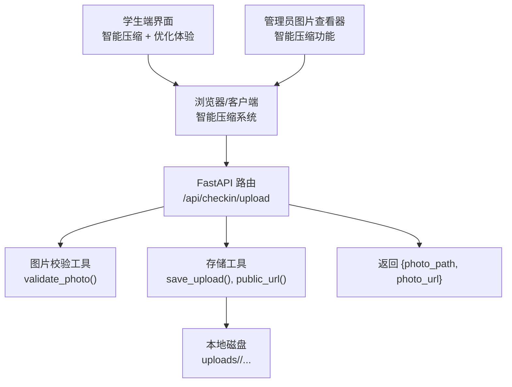
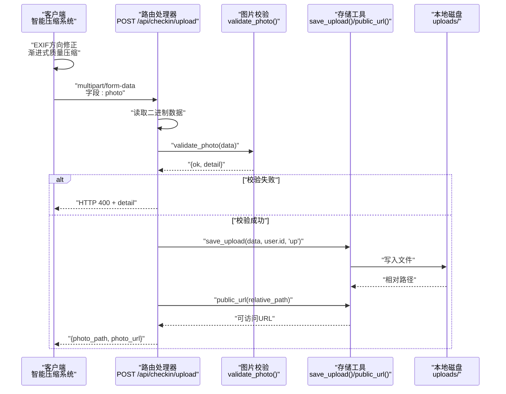
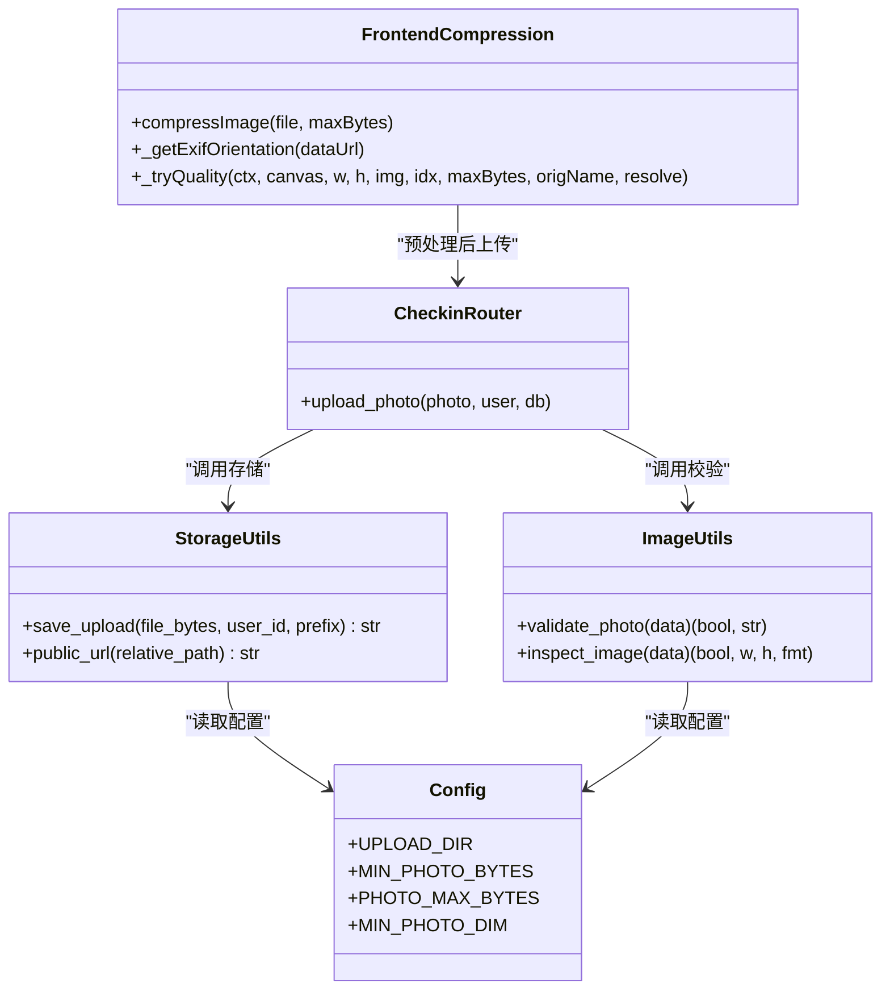
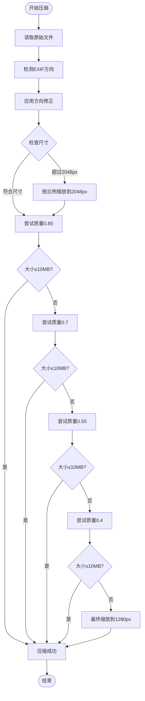
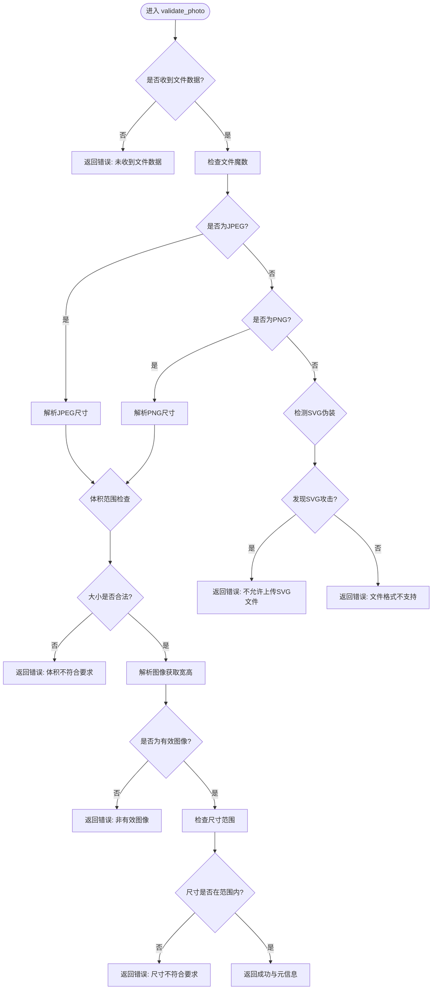
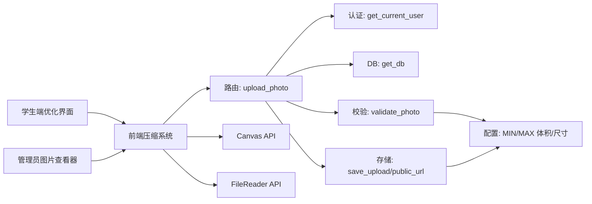

# 图片上传接口

<cite>
**本文引用的文件**
- [checkin.py](file://summer-homework-checkin/backend/app/routers/checkin.py)
- [image.py](file://summer-homework-checkin/backend/app/utils/image.py)
- [storage.py](file://summer-homework-checkin/backend/app/utils/storage.py)
- [config.py](file://summer-homework-checkin/backend/app/config.py)
- [app.js（管理员前端）](file://summer-homework-checkin/frontend/admin/app.js)
- [app.js（学生端）](file://summer-homework-checkin/frontend/student/app.js)
- [index.html（学生端）](file://summer-homework-checkin/frontend/student/index.html)
</cite>

## 更新摘要
**变更内容**   
- 新增智能图片压缩系统，包含EXIF方向修正、微信浏览器兼容性优化、渐进式质量压缩等核心功能
- 前端实现了自动压缩管道，支持2048px最大尺寸缩放和0.85→0.7→0.55→0.4的渐进式JPEG质量降低
- 实现了10MB限制下的自动尺寸降级到1280px的智能处理机制
- 增强了移动端用户体验，移除了capture属性限制，提供更灵活的图片选择体验

## 目录
1. [简介](#简介)
2. [项目结构](#项目结构)
3. [核心组件](#核心组件)
4. [架构总览](#架构总览)
5. [详细组件分析](#详细组件分析)
6. [依赖关系分析](#依赖关系分析)
7. [性能与容量规划](#性能与容量规划)
8. [故障排查指南](#故障排查指南)
9. [结论](#结论)
10. [附录：API 规范与前端集成示例](#附录api-规范与前端集成示例)

## 简介
本接口为通用图片上传能力，主要服务于"图片查看器"的上传场景。通过 POST /api/checkin/upload，客户端可上传单张图片，后端进行基础安全与格式校验、落盘存储并返回可直接访问的图片路径与 URL，便于在图片查看器中即时展示。

该接口与打卡主流程中的照片上传不同：它不创建打卡记录，仅做"纯图片上传"，适用于管理端或任意需要临时/持久化上传图片的场景。

**重大更新** 系统现已集成智能图片压缩系统，在前端自动处理图片压缩、EXIF方向修正和微信浏览器兼容性优化，显著提升上传体验和传输效率。

## 项目结构
与图片上传相关的后端实现位于 summer-homework-checkin/backend/app 下，关键文件如下：
- 路由层：定义 /api/checkin/upload 接口
- 工具层：图片校验、文件保存与公开 URL 生成
- 配置层：上传目录、大小限制等常量
- 前端：管理员前端的图片查看器调用该接口完成上传，学生端提供优化的移动端上传体验，均集成了智能压缩系统

```mermaid
graph TB
Client["浏览器/客户端<br/>智能压缩系统"] --> Router["FastAPI 路由<br/>/api/checkin/upload"]
Router --> ImageUtil["图片校验工具<br/>validate_photo()"]
Router --> StorageUtil["存储工具<br/>save_upload(), public_url()"]
StorageUtil --> Disk["本地磁盘<br/>uploads/<user_id>/..."]
Router --> Response["返回 {photo_path, photo_url}"]
StudentUI["学生端界面<br/>智能压缩 + 优化体验"] --> Client
AdminUI["管理员图片查看器<br/>智能压缩功能"] --> Client
```

图示来源
- [checkin.py:41-53](file://summer-homework-checkin/backend/app/routers/checkin.py#L41-L53)
- [image.py:60-100](file://summer-homework-checkin/backend/app/utils/image.py#L60-L100)
- [storage.py:20-43](file://summer-homework-checkin/backend/app/utils/storage.py#L20-L43)
- [app.js（管理员）:108-164](file://summer-homework-checkin/frontend/admin/app.js#L108-L164)
- [app.js（学生端）:99-158](file://summer-homework-checkin/frontend/student/app.js#L99-L158)

章节来源
- [checkin.py:41-53](file://summer-homework-checkin/backend/app/routers/checkin.py#L41-L53)
- [image.py:60-100](file://summer-homework-checkin/backend/app/utils/image.py#L60-L100)
- [storage.py:20-43](file://summer-homework-checkin/backend/app/utils/storage.py#L20-L43)
- [config.py:93-95](file://summer-homework-checkin/backend/app/config.py#L93-L95)
- [app.js（管理员）:11-13](file://summer-homework-checkin/frontend/admin/app.js#L11-L13)
- [app.js（学生端）:12-15](file://summer-homework-checkin/frontend/student/app.js#L12-L15)

## 核心组件
- 路由处理器：接收 multipart/form-data 表单，读取图片二进制数据，执行校验与存储，返回结果
- 图片校验：基于头部字节识别 JPEG/PNG，解析尺寸，校验体积与最小边长
- 存储工具：按用户维度组织目录，生成唯一文件名，写入本地磁盘，并构造可访问 URL
- 配置项：上传根目录、最小/最大体积、最小边长等
- **智能压缩系统**：前端自动压缩、EXIF方向修正、微信浏览器兼容性优化
- 前端优化：移除移动端capture限制，提供更灵活的图片选择体验

章节来源
- [checkin.py:41-53](file://summer-homework-checkin/backend/app/routers/checkin.py#L41-L53)
- [image.py:60-100](file://summer-homework-checkin/backend/app/utils/image.py#L60-L100)
- [storage.py:20-43](file://summer-homework-checkin/backend/app/utils/storage.py#L20-L43)
- [config.py:93-95](file://summer-homework-checkin/backend/app/config.py#L93-L95)
- [app.js（管理员）:108-164](file://summer-homework-checkin/frontend/admin/app.js#L108-L164)
- [app.js（学生端）:99-158](file://summer-homework-checkin/frontend/student/app.js#L99-L158)

## 架构总览
下图展示了从请求到响应的完整链路，包括认证、校验、存储与响应，以及前端智能压缩流程。

```mermaid
sequenceDiagram
participant C as "客户端<br/>智能压缩系统"
participant R as "路由处理器<br/>POST /api/checkin/upload"
participant V as "图片校验<br/>validate_photo()"
participant S as "存储工具<br/>save_upload()/public_url()"
participant D as "本地磁盘<br/>uploads/"
C->>C : "EXIF方向修正<br/>渐进式质量压缩"
C->>R : "multipart/form-data<br/>字段 : photo"
R->>R : "读取二进制数据"
R->>V : "validate_photo(data)"
V-->>R : "{ok, detail}"
alt "校验失败"
R-->>C : "HTTP 400 + detail"
else "校验成功"
R->>S : "save_upload(data, user.id, 'up')"
S->>D : "写入文件"
D-->>S : "相对路径"
R->>S : "public_url(relative_path)"
S-->>R : "可访问URL"
R-->>C : "{photo_path, photo_url}"
end
```

图示来源
- [checkin.py:41-53](file://summer-homework-checkin/backend/app/routers/checkin.py#L41-L53)
- [image.py:60-100](file://summer-homework-checkin/backend/app/utils/image.py#L60-L100)
- [storage.py:20-43](file://summer-homework-checkin/backend/app/utils/storage.py#L20-L43)
- [app.js（管理员）:108-164](file://summer-homework-checkin/frontend/admin/app.js#L108-L164)
- [app.js（学生端）:99-158](file://summer-homework-checkin/frontend/student/app.js#L99-L158)

## 详细组件分析

### 路由处理器：POST /api/checkin/upload
- 功能：接收图片文件，执行基础校验，保存到本地，返回可访问路径与 URL
- 认证：依赖当前登录用户上下文（由依赖注入提供）
- 输入：
  - 表单字段：photo（必填，文件类型）
- 输出：
  - JSON 对象：包含 photo_path 与 photo_url 两个字段
- 错误处理：
  - 当图片校验失败时，返回 HTTP 400 及具体错误信息

章节来源
- [checkin.py:41-53](file://summer-homework-checkin/backend/app/routers/checkin.py#L41-L53)

#### 类图（代码级关系）

```mermaid
classDiagram
class CheckinRouter {
+upload_photo(photo, user, db)
}
class ImageUtils {
+validate_photo(data) (bool, str)
+inspect_image(data) (bool, w, h, fmt)
}
class StorageUtils {
+save_upload(file_bytes, user_id, prefix) str
+public_url(relative_path) str
}
class Config {
+UPLOAD_DIR
+MIN_PHOTO_BYTES
+PHOTO_MAX_BYTES
+MIN_PHOTO_DIM
}
class FrontendCompression {
+compressImage(file, maxBytes)
+_getExifOrientation(dataUrl)
+_tryQuality(ctx, canvas, w, h, img, idx, maxBytes, origName, resolve)
}
CheckinRouter --> ImageUtils : "调用校验"
CheckinRouter --> StorageUtils : "调用存储"
StorageUtils --> Config : "读取配置"
ImageUtils --> Config : "读取配置"
FrontendCompression --> CheckinRouter : "预处理后上传"
```

图示来源
- [checkin.py:41-53](file://summer-homework-checkin/backend/app/routers/checkin.py#L41-L53)
- [image.py:60-100](file://summer-homework-checkin/backend/app/utils/image.py#L60-L100)
- [storage.py:20-43](file://summer-homework-checkin/backend/app/utils/storage.py#L20-L43)
- [config.py:93-95](file://summer-homework-checkin/backend/app/config.py#L93-L95)
- [app.js（管理员）:108-164](file://summer-homework-checkin/frontend/admin/app.js#L108-L164)
- [app.js（学生端）:99-158](file://summer-homework-checkin/frontend/student/app.js#L99-L158)

### 智能图片压缩系统
**新增功能** 前后端协同的智能图片压缩系统，显著提升上传效率和用户体验：

#### 前端压缩特性
- **EXIF方向修正**：自动检测并修正图片方向，确保正确显示
- **渐进式质量压缩**：采用0.85→0.7→0.55→0.4的四级质量递减策略
- **智能尺寸缩放**：最大2048px尺寸限制，超限自动按比例缩放
- **微信浏览器兼容**：专门优化微信X5内核和旧版WebView兼容性
- **自动降级机制**：10MB限制下自动缩小到1280px保证上传成功

#### 压缩算法流程

```mermaid
flowchart TD
Start(["开始压缩"]) --> ReadFile["读取原始文件"]
ReadFile --> EXIF["检测EXIF方向"]
EXIF --> CorrectOrient["应用方向修正"]
CorrectOrient --> CheckSize{"检查尺寸"}
CheckSize --> |超过2048px| ScaleDown["按比例缩放到2048px"]
CheckSize --> |符合尺寸| QualityStep1["尝试质量0.85"]
ScaleDown --> QualityStep1
QualityStep1 --> SizeCheck{"大小≤10MB?"}
SizeCheck --> |是| Success["压缩成功"]
SizeCheck --> |否| QualityStep2["尝试质量0.7"]
QualityStep2 --> SizeCheck2{"大小≤10MB?"}
SizeCheck2 --> |是| Success
SizeCheck2 --> |否| QualityStep3["尝试质量0.55"]
QualityStep3 --> SizeCheck3{"大小≤10MB?"}
SizeCheck3 --> |是| Success
SizeCheck3 --> |否| QualityStep4["尝试质量0.4"]
QualityStep4 --> SizeCheck4{"大小≤10MB?"}
SizeCheck4 --> |是| Success
SizeCheck4 --> |否| FinalScale["最终缩放到1280px"]
FinalScale --> Success
Success --> End(["结束"])
```

图示来源
- [app.js（管理员）:108-164](file://summer-homework-checkin/frontend/admin/app.js#L108-L164)
- [app.js（学生端）:99-158](file://summer-homework-checkin/frontend/student/app.js#L99-L158)

章节来源
- [app.js（管理员）:108-164](file://summer-homework-checkin/frontend/admin/app.js#L108-L164)
- [app.js（学生端）:99-158](file://summer-homework-checkin/frontend/student/app.js#L99-L158)

### 图片校验：validate_photo
- 支持格式：JPEG、PNG（基于文件头识别）
- 体积限制：大于等于 MIN_PHOTO_BYTES，小于等于 PHOTO_MAX_BYTES
- 尺寸限制：宽和高均不得小于 MIN_PHOTO_DIM
- 安全加固：防止SVG伪装攻击，限制最大图像尺寸
- 返回值：布尔值与描述字符串；失败时返回错误原因

章节来源
- [image.py:60-100](file://summer-homework-checkin/backend/app/utils/image.py#L60-L100)
- [config.py:93-95](file://summer-homework-checkin/backend/app/config.py#L93-L95)

#### 流程图（校验逻辑）

```mermaid
flowchart TD
Start(["进入 validate_photo"]) --> CheckEmpty{"是否收到文件数据?"}
CheckEmpty --> |否| ErrEmpty["返回错误: 未收到文件数据"]
CheckEmpty --> |是| CheckMagic["检查文件魔数"]
CheckMagic --> IsJPG{"是否为JPEG?"}
IsJPG --> |是| ParseJPG["解析JPEG尺寸"]
IsJPG --> |否| IsPNG{"是否为PNG?"}
IsPNG --> |是| ParsePNG["解析PNG尺寸"]
IsPNG --> |否| CheckSVG{"检测SVG伪装"}
CheckSVG --> SVGAttack{"发现SVG攻击?"}
SVGAttack --> |是| ErrSVG["返回错误: 不允许上传SVG文件"]
SVGAttack --> |否| ErrFormat["返回错误: 文件格式不支持"]
ParseJPG --> CheckSizeRange{"体积范围检查"}
ParsePNG --> CheckSizeRange
CheckSizeRange --> SizeOK{"大小是否合法?"}
SizeOK -- "否" --> ErrSize["返回错误: 体积不符合要求"]
SizeOK -- "是" --> Inspect["解析图像获取宽高"]
Inspect --> ImgOK{"是否为有效图像?"}
ImgOK -- "否" --> ErrImg["返回错误: 非有效图像"]
ImgOK -- "是" --> DimCheck["检查尺寸范围"]
DimCheck --> DimOK{"尺寸是否在范围内?"}
DimOK -- "否" --> ErrDim["返回错误: 尺寸不符合要求"]
DimOK -- "是" --> Ok["返回成功与元信息"]
```

图示来源
- [image.py:60-100](file://summer-homework-checkin/backend/app/utils/image.py#L60-L100)

### 存储工具：save_upload 与 public_url
- save_upload：
  - 以用户 ID 为一级目录，生成唯一文件名（含前缀），扩展名固定为 .jpg
  - 将二进制数据写入本地磁盘，返回相对于 UPLOAD_DIR 的相对路径
- public_url：
  - 将相对路径转换为可被 Web 服务器直接访问的 URL 路径（统一以 /api/uploads/ 开头）

章节来源
- [storage.py:20-43](file://summer-homework-checkin/backend/app/utils/storage.py#L20-L43)
- [config.py:9](file://summer-homework-checkin/backend/app/config.py#L9)

#### 存储路径生成机制
- 根目录：UPLOAD_DIR（默认 backend/uploads）
- 用户目录：{UPLOAD_DIR}/{user_id}/
- 文件名：{prefix}_{uuid}.jpg（prefix 固定为 up）
- 相对路径：相对于 UPLOAD_DIR 的路径
- 公开 URL：/api/uploads/{relative_path}

章节来源
- [storage.py:20-43](file://summer-homework-checkin/backend/app/utils/storage.py#L20-L43)

### 配置项说明
- 上传目录：UPLOAD_DIR
- 体积限制：MIN_PHOTO_BYTES（5KB）、PHOTO_MAX_BYTES（10MB）
- 尺寸限制：MIN_PHOTO_DIM（200px）
- 前端压缩配置：COMPRESS_MAX_DIM（2048px）、COMPRESS_QUALITY_STEPS（[0.85, 0.7, 0.55, 0.4]）
- 其他：SECRET、TOKEN_EXPIRE_DAYS 等（与本接口无直接关联）

章节来源
- [config.py:9](file://summer-homework-checkin/backend/app/config.py#L9)
- [config.py:93-95](file://summer-homework-checkin/backend/app/config.py#L93-L95)
- [app.js（管理员）:11-13](file://summer-homework-checkin/frontend/admin/app.js#L11-L13)
- [app.js（学生端）:12-15](file://summer-homework-checkin/frontend/student/app.js#L12-L15)

### 前端移动端体验优化
**更新** 学生端打卡功能已优化移动端用户体验：

- **移除capture限制**：打卡功能的file input元素不再使用`capture='environment'`属性
- **自由切换体验**：移动端用户可以在相机拍摄和相册选择之间自由切换
- **跨平台兼容**：提供更好的跨平台用户体验，避免强制打开特定摄像头
- **保留专用场景**：人脸采集功能仍保留`capture="user"`以确保最佳的人脸识别体验
- **智能压缩集成**：所有上传都经过前端智能压缩处理，提升上传成功率

章节来源
- [index.html:113](file://summer-homework-checkin/frontend/student/index.html#L113)
- [index.html:127](file://summer-homework-checkin/frontend/student/index.html#L127)
- [index.html:216](file://summer-homework-checkin/frontend/student/index.html#L216)
- [app.js（学生端）:99-158](file://summer-homework-checkin/frontend/student/app.js#L99-L158)

## 依赖关系分析
- 路由层依赖：
  - 认证依赖：get_current_user（确保只有已登录用户可上传）
  - 数据库依赖：get_db（本接口未使用，但声明了依赖）
  - 业务工具：validate_photo、save_upload、public_url
- 工具层依赖：
  - image.validate_photo 依赖 config 中的体积与尺寸阈值
  - storage.save_upload/public_url 依赖 config.UPLOAD_DIR
- **前端压缩依赖**：
  - Canvas API用于图片处理和压缩
  - FileReader API用于文件读取
  - Blob和File API用于文件操作

```mermaid
graph LR
Router["路由: upload_photo"] --> Auth["认证: get_current_user"]
Router --> DB["DB: get_db"]
Router --> Img["校验: validate_photo"]
Router --> Sto["存储: save_upload/public_url"]
Img --> Cfg["配置: MIN/MAX 体积/尺寸"]
Sto --> Cfg
Frontend["前端压缩系统"] --> Router
Frontend --> Canvas["Canvas API"]
Frontend --> FileReader["FileReader API"]
StudentUI["学生端优化界面"] --> Frontend
AdminUI["管理员图片查看器"] --> Frontend
```

图示来源
- [checkin.py:41-53](file://summer-homework-checkin/backend/app/routers/checkin.py#L41-L53)
- [image.py:60-100](file://summer-homework-checkin/backend/app/utils/image.py#L60-L100)
- [storage.py:20-43](file://summer-homework-checkin/backend/app/utils/storage.py#L20-L43)
- [config.py:93-95](file://summer-homework-checkin/backend/app/config.py#L93-L95)
- [app.js（管理员）:108-164](file://summer-homework-checkin/frontend/admin/app.js#L108-L164)
- [app.js（学生端）:99-158](file://summer-homework-checkin/frontend/student/app.js#L99-L158)

## 性能与容量规划
- 单次请求只处理一个图片文件，内存占用与图片大小成正比
- **前端智能压缩显著减少上传数据量**：通过渐进式质量压缩和尺寸缩放，通常可减少50-90%的传输数据
- 建议在前端增加本地预览与压缩，减少大体积图片上传耗时
- 磁盘空间需根据用户量与图片数量评估，定期清理无用图片
- 并发上传场景下，注意文件系统 I/O 与进程/线程模型
- 移动端优化后，用户可选择更合适的图片来源，减少不必要的重新拍摄
- **微信浏览器兼容性优化**：特别针对微信X5内核和旧版WebView进行了兼容性处理

[本节为通用指导，无需源码引用]

## 故障排查指南
- 常见错误码与原因
  - 400：图片体积不符合要求、非有效 JPEG/PNG、尺寸过小、SVG伪装攻击
  - 401：未登录或令牌失效
- 定位步骤
  - 确认 Content-Type 为 multipart/form-data，且表单字段名为 photo
  - 检查图片大小是否在允许范围内，格式是否为 JPEG/PNG
  - 检查服务端日志与 uploads 目录权限
  - 验证移动端file input元素是否正确配置
  - **检查前端压缩系统是否正常工作**：确认EXIF方向修正和质量压缩是否正常执行
- 前端错误处理建议
  - 捕获 HTTP 状态码与 detail 消息，向用户提示具体原因
  - 对 401 跳转登录页或刷新令牌
  - 对 400 给出友好提示（如"请上传清晰的照片，大小不超过 X MB"）
  - 移动端用户应能自由选择相机或相册来源
  - **添加压缩失败的回退机制**：当智能压缩失败时，回退到原始文件上传

章节来源
- [checkin.py:41-53](file://summer-homework-checkin/backend/app/routers/checkin.py#L41-L53)
- [image.py:60-100](file://summer-homework-checkin/backend/app/utils/image.py#L60-L100)
- [index.html:113](file://summer-homework-checkin/frontend/student/index.html#L113)
- [app.js（管理员）:108-164](file://summer-homework-checkin/frontend/admin/app.js#L108-L164)
- [app.js（学生端）:99-158](file://summer-homework-checkin/frontend/student/app.js#L99-L158)

## 结论
POST /api/checkin/upload 提供了轻量、安全的通用图片上传能力，适合图片查看器等场景快速接入。其设计聚焦于基础安全校验与稳定存储，返回可直接使用的路径与 URL，便于前端无缝集成。

**重大改进** 通过集成智能图片压缩系统，系统在保持安全性和稳定性的同时，大幅提升了用户体验和传输效率。前端自动压缩、EXIF方向修正和微信浏览器兼容性优化使得在各种设备和网络环境下都能获得良好的上传体验。

[本节为总结性内容，无需源码引用]

## 附录：API 规范与前端集成示例

### API 定义
- 方法：POST
- 路径：/api/checkin/upload
- 认证：需要有效的 Bearer Token（Authorization: Bearer <token>）
- 请求体：multipart/form-data
  - 字段：photo（必填，图片文件）
- 响应体：JSON
  - photo_path：相对 UPLOAD_DIR 的文件路径（例如：uploads/12/up_xxxx.jpg 的相对部分）
  - photo_url：可直接访问的 HTTP 路径（例如：/api/uploads/12/up_xxxx.jpg）
- 错误响应：
  - 400：detail 中包含具体错误原因（体积、格式、尺寸等）
  - 401：认证失败

章节来源
- [checkin.py:41-53](file://summer-homework-checkin/backend/app/routers/checkin.py#L41-L53)

### 技术规范
- 支持格式：JPEG、PNG
- 大小限制：
  - 最小：MIN_PHOTO_BYTES（默认 5KB）
  - 最大：PHOTO_MAX_BYTES（默认 10MB）
- 尺寸限制：
  - 最小边长：MIN_PHOTO_DIM（默认 200px）
  - 最大边长：MAX_IMAGE_DIM（默认 8000px）
- 存储路径：
  - 根目录：backend/uploads
  - 用户目录：{user_id}/
  - 文件名：up_{uuid}.jpg
  - 公开 URL：/api/uploads/{相对路径}
- **前端压缩规格**：
  - 最大尺寸：2048px
  - 质量级别：[0.85, 0.7, 0.55, 0.4]
  - 最终降级：1280px @ 0.5质量

章节来源
- [image.py:60-100](file://summer-homework-checkin/backend/app/utils/image.py#L60-L100)
- [storage.py:20-43](file://summer-homework-checkin/backend/app/utils/storage.py#L20-L43)
- [config.py:93-95](file://summer-homework-checkin/backend/app/config.py#L93-L95)
- [app.js（管理员）:11-13](file://summer-homework-checkin/frontend/admin/app.js#L11-L13)
- [app.js（学生端）:12-15](file://summer-homework-checkin/frontend/student/app.js#L12-L15)

### 前端集成示例（管理员图片查看器）
- 选择图片后，构建 FormData，字段名为 photo
- 设置 Authorization 头携带 Bearer Token
- 发送 POST 请求至 /api/checkin/upload
- 成功后从响应中提取 photo_url 或 photo_path，用于图片展示
- 失败时根据 detail 提示用户调整图片或重试
- **智能压缩集成**：上传前自动进行EXIF方向修正、渐进式质量压缩和尺寸缩放

章节来源
- [app.js（管理员前端）:108-164](file://summer-homework-checkin/frontend/admin/app.js#L108-L164)

### 移动端集成示例（学生端打卡功能）
**更新** 学生端打卡功能的移动端优化实现：

- **File Input配置**：使用`<input type="file" accept="image/*">`，不包含capture属性
- **用户体验**：移动端用户点击后可自由选择相机拍摄或相册选择
- **兼容性**：支持所有主流移动设备和浏览器，特别优化微信内置浏览器
- **特殊场景**：人脸采集功能保留`capture="user"`以确保最佳识别效果
- **智能压缩**：所有图片上传都经过前端智能压缩处理，确保上传成功率和速度

章节来源
- [index.html:113](file://summer-homework-checkin/frontend/student/index.html#L113)
- [index.html:127](file://summer-homework-checkin/frontend/student/index.html#L127)
- [index.html:216](file://summer-homework-checkin/frontend/student/index.html#L216)
- [app.js（学生端）:99-158](file://summer-homework-checkin/frontend/student/app.js#L99-L158)

### 智能压缩系统技术细节
**新增** 前端智能压缩系统的核心技术实现：

#### EXIF方向修正
- 自动检测图片EXIF方向信息
- 支持8种方向的自动旋转修正
- 确保图片在不同设备上正确显示

#### 渐进式质量压缩
- 四级质量递减策略：0.85 → 0.7 → 0.55 → 0.4
- 动态调整压缩质量以满足大小限制
- 在保证画质的前提下最大化压缩比

#### 微信浏览器兼容性
- 专门处理微信X5内核的FormData限制
- 分块解码防止栈溢出
- toBlob/toDataURL双回退机制

章节来源
- [app.js（管理员）:70-105](file://summer-homework-checkin/frontend/admin/app.js#L70-L105)
- [app.js（学生端）:74-96](file://summer-homework-checkin/frontend/student/app.js#L74-L96)
- [app.js（管理员）:55-68](file://summer-homework-checkin/frontend/admin/app.js#L55-L68)
- [app.js（学生端）:59-72](file://summer-homework-checkin/frontend/student/app.js#L59-L72)