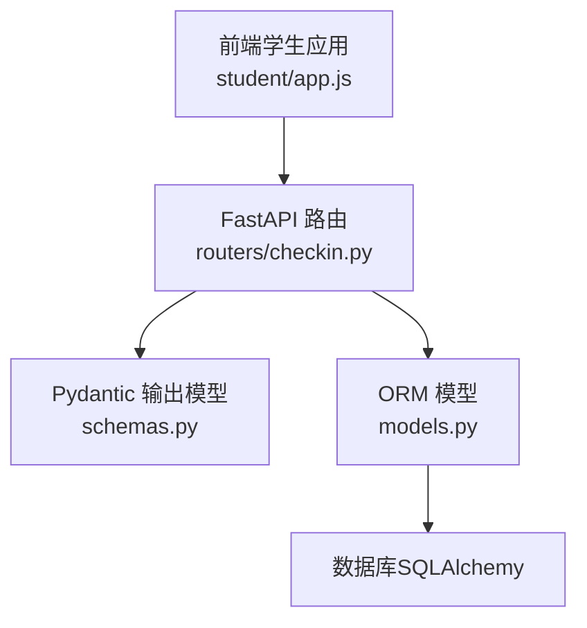
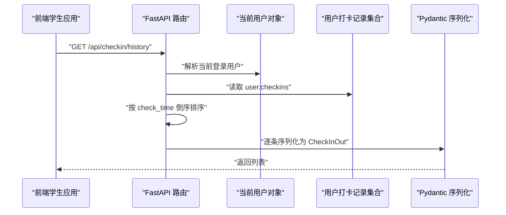
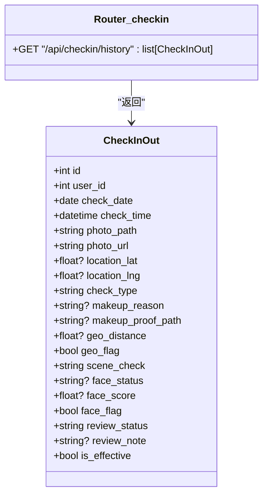

# 打卡历史记录接口

<cite>
**本文引用的文件**   
- [summer-homework-checkin/backend/app/routers/checkin.py](file://summer-homework-checkin/backend/app/routers/checkin.py)
- [summer-homework-checkin/backend/app/schemas.py](file://summer-homework-checkin/backend/app/schemas.py)
- [summer-homework-checkin/backend/app/models.py](file://summer-homework-checkin/backend/app/models.py)
- [summer-homework-checkin/frontend/student/app.js](file://summer-homework-checkin/frontend/student/app.js)
</cite>

## 目录
1. [简介](#简介)
2. [项目结构](#项目结构)
3. [核心组件](#核心组件)
4. [架构总览](#架构总览)
5. [详细组件分析](#详细组件分析)
6. [依赖关系分析](#依赖关系分析)
7. [性能与数据量控制](#性能与数据量控制)
8. [前端展示示例与数据处理建议](#前端展示示例与数据处理建议)
9. [故障排查指南](#故障排查指南)
10. [结论](#结论)

## 简介
本章节面向“打卡历史记录查询”场景，聚焦 GET /api/checkin/history 接口的功能说明、返回数据结构、排序规则、过滤能力现状以及前端使用方式。同时给出在数据量增长时的优化策略与落地建议，帮助前后端协同提升体验与稳定性。

## 项目结构
该接口位于后端 FastAPI 路由模块中，返回的数据模型由 Pydantic Schema 定义，底层数据来源于 SQLAlchemy ORM 模型。前端学生端通过 Vue 应用调用该接口并渲染历史列表。

图表来源
- [summer-homework-checkin/backend/app/routers/checkin.py:1-80](file://summer-homework-checkin/backend/app/routers/checkin.py#L1-L80)
- [summer-homework-checkin/backend/app/schemas.py:54-76](file://summer-homework-checkin/backend/app/schemas.py#L54-L76)
- [summer-homework-checkin/backend/app/models.py:70-96](file://summer-homework-checkin/backend/app/models.py#L70-L96)
- [summer-homework-checkin/frontend/student/app.js:319-325](file://summer-homework-checkin/frontend/student/app.js#L319-L325)

章节来源
- [summer-homework-checkin/backend/app/routers/checkin.py:1-80](file://summer-homework-checkin/backend/app/routers/checkin.py#L1-L80)
- [summer-homework-checkin/backend/app/schemas.py:54-76](file://summer-homework-checkin/backend/app/schemas.py#L54-L76)
- [summer-homework-checkin/backend/app/models.py:70-96](file://summer-homework-checkin/backend/app/models.py#L70-L96)
- [summer-homework-checkin/frontend/student/app.js:319-325](file://summer-homework-checkin/frontend/student/app.js#L319-L325)

## 核心组件
- 路由层：GET /api/checkin/history
  - 鉴权：基于当前登录用户上下文
  - 行为：获取当前用户的打卡记录，按打卡时间倒序排列后返回
- 数据模型：CheckInOut
  - 描述单条打卡记录的字段集合，包含时间、状态、位置、人脸校验结果、审核信息、有效性等
- 前端调用：学生端在“我的”页面加载历史列表时调用该接口

章节来源
- [summer-homework-checkin/backend/app/routers/checkin.py:76-79](file://summer-homework-checkin/backend/app/routers/checkin.py#L76-L79)
- [summer-homework-checkin/backend/app/schemas.py:54-76](file://summer-homework-checkin/backend/app/schemas.py#L54-L76)
- [summer-homework-checkin/frontend/student/app.js:319-325](file://summer-homework-checkin/frontend/student/app.js#L319-L325)

## 架构总览
下图展示了从前端发起请求到后端返回历史记录的完整流程。

图表来源
- [summer-homework-checkin/backend/app/routers/checkin.py:76-79](file://summer-homework-checkin/backend/app/routers/checkin.py#L76-L79)
- [summer-homework-checkin/backend/app/schemas.py:54-76](file://summer-homework-checkin/backend/app/schemas.py#L54-L76)

## 详细组件分析

### 接口定义与行为
- 路径与方法：GET /api/checkin/history
- 认证要求：需要有效的登录态（Bearer Token）
- 返回类型：CheckInOut 数组
- 排序规则：按打卡时间（check_time）倒序（最新在前）
- 分页参数：当前未实现
- 过滤条件：当前未实现（如按日期范围、审核状态、打卡类型等）

章节来源
- [summer-homework-checkin/backend/app/routers/checkin.py:76-79](file://summer-homework-checkin/backend/app/routers/checkin.py#L76-L79)

### 返回数据结构 CheckInOut
以下为字段说明（类型以实际模型为准）：
- id：记录主键
- user_id：所属用户 ID
- check_date：打卡对应的自然日
- check_time：精确提交时间（用于排序与展示）
- photo_path：照片相对存储路径
- photo_url：可访问的公开图片 URL（由模型属性计算）
- location_lat：纬度（可选）
- location_lng：经度（可选）
- check_type：打卡类型（normal 正常；makeup 补卡）
- makeup_reason：补卡原因（可选）
- makeup_proof_path：补卡凭证路径（可选）
- geo_distance：距常用位置距离（米，可选）
- geo_flag：是否超出阈值（代打卡风险标记）
- scene_check：场景检测结果（如 pass/warn/pending）
- face_status：人脸比对状态（match/mismatch/no_face/...）
- face_score：人脸相似度分数（可选）
- face_flag：人脸不通过标记（代打卡风险）
- review_status：审核状态（pending/approved/rejected）
- review_note：审核备注（可选）
- is_effective：是否计入有效打卡

章节来源
- [summer-homework-checkin/backend/app/schemas.py:54-76](file://summer-homework-checkin/backend/app/schemas.py#L54-L76)
- [summer-homework-checkin/backend/app/models.py:70-96](file://summer-homework-checkin/backend/app/models.py#L70-L96)

### 前端调用与展示
- 调用时机：进入“我的”页面时加载历史
- 调用方式：GET /api/checkin/history
- 数据绑定：将返回的数组赋值给 history 变量，并在模板中遍历渲染
- 时间格式化：对 ISO 字符串进行本地化显示（例如替换 T 为空格并截取）

章节来源
- [summer-homework-checkin/frontend/student/app.js:319-325](file://summer-homework-checkin/frontend/student/app.js#L319-L325)
- [summer-homework-checkin/frontend/student/app.js:334-335](file://summer-homework-checkin/frontend/student/app.js#L334-L335)

## 依赖关系分析
- 路由依赖当前用户上下文与数据库会话
- 返回数据依赖 CheckInOut 模型约束
- 前端依赖该接口返回的稳定字段与顺序

图表来源
- [summer-homework-checkin/backend/app/routers/checkin.py:76-79](file://summer-homework-checkin/backend/app/routers/checkin.py#L76-L79)
- [summer-homework-checkin/backend/app/schemas.py:54-76](file://summer-homework-checkin/backend/app/schemas.py#L54-L76)

## 性能与数据量控制
当前实现特点
- 全量拉取：接口直接返回用户的全部打卡记录，无分页与过滤
- 内存排序：在应用层对 user.checkins 按 check_time 倒序排序
- 潜在风险：当用户历史数据较大时，响应体体积与序列化开销会显著增加，影响首屏加载与滚动体验

优化建议（可按需逐步落地）
- 服务端分页
  - 新增 query 参数：page、page_size（或 limit/offset）
  - 限制最大 page_size（如 50/100），避免超大页
- 服务端排序与索引
  - 使用数据库级 ORDER BY check_time DESC，配合 (user_id, check_time) 复合索引
  - 减少应用层排序开销
- 按需过滤
  - 支持按日期范围（start_date/end_date）、审核状态（review_status）、打卡类型（check_type）过滤
  - 结合索引优化查询
- 增量加载
  - 基于游标（last_check_time）或 last_id 的“加载更多”模式，降低初始负载
- 响应裁剪
  - 仅返回必要字段，避免传输冗余信息
- 缓存策略
  - 对热点用户的历史列表做短时缓存（注意一致性）
- 前端优化
  - 虚拟列表渲染长列表
  - 骨架屏与懒加载
  - 错误重试与降级（网络异常时提示）

章节来源
- [summer-homework-checkin/backend/app/routers/checkin.py:76-79](file://summer-homework-checkin/backend/app/routers/checkin.py#L76-L79)

## 前端展示示例与数据处理建议
- 基础用法
  - 在页面初始化时调用 GET /api/checkin/history
  - 将返回数组绑定至 history 变量，并按 check_time 倒序渲染
- 字段映射建议
  - 时间：使用 check_time 进行排序与展示，格式化为本地可读形式
  - 状态：根据 review_status 显示“待审核/已通过/已拒绝”，并结合 is_effective 标注是否计入有效打卡
  - 类型：根据 check_type 区分“正常/补卡”，必要时展示 makeup_reason
  - 位置与风险：geo_flag 与 face_flag 可作为风险提示标识
  - 图片：photo_url 可直接作为图片源
- 交互建议
  - 首次加载显示骨架屏
  - 提供“加载更多”按钮，后续采用分页或游标方式
  - 对网络失败进行友好提示与重试

章节来源
- [summer-homework-checkin/frontend/student/app.js:319-325](file://summer-homework-checkin/frontend/student/app.js#L319-L325)
- [summer-homework-checkin/frontend/student/app.js:334-335](file://summer-homework-checkin/frontend/student/app.js#L334-L335)

## 故障排查指南
- 401 未授权
  - 检查请求头是否携带正确的 Authorization: Bearer <token>
  - 确认 token 未过期且未被撤销
- 空列表
  - 确认用户是否存在打卡记录
  - 若计划引入过滤参数，请确保传参正确
- 大数据量导致卡顿
  - 优先启用分页与按需加载
  - 前端采用虚拟列表与懒加载
- 图片无法显示
  - 检查 photo_url 是否为公网可访问地址
  - 确认存储服务权限配置

章节来源
- [summer-homework-checkin/frontend/student/app.js:58-66](file://summer-homework-checkin/frontend/student/app.js#L58-L66)

## 结论
当前 GET /api/checkin/history 接口实现了基础的“按打卡时间倒序返回全部历史”的能力，满足小数据量场景下的快速查看需求。随着用户规模与历史数据的增长，建议尽快引入分页、过滤与索引优化，并结合前端的虚拟列表与增量加载，以获得更稳定、流畅的用户体验。