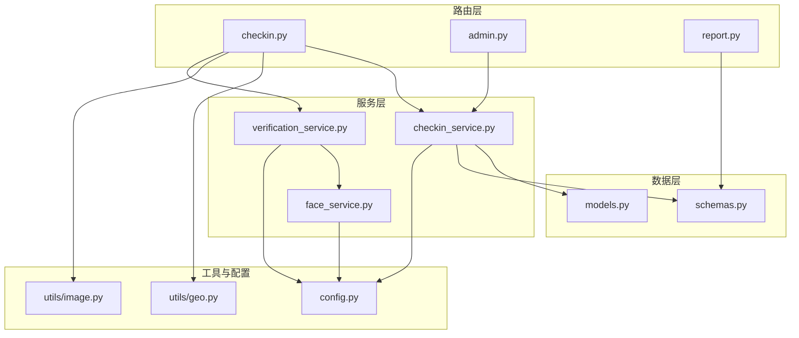
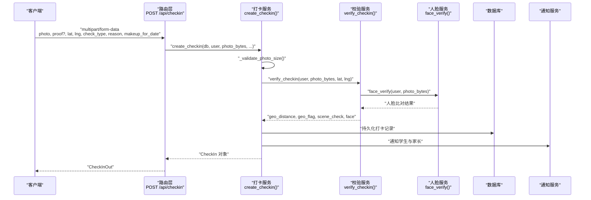
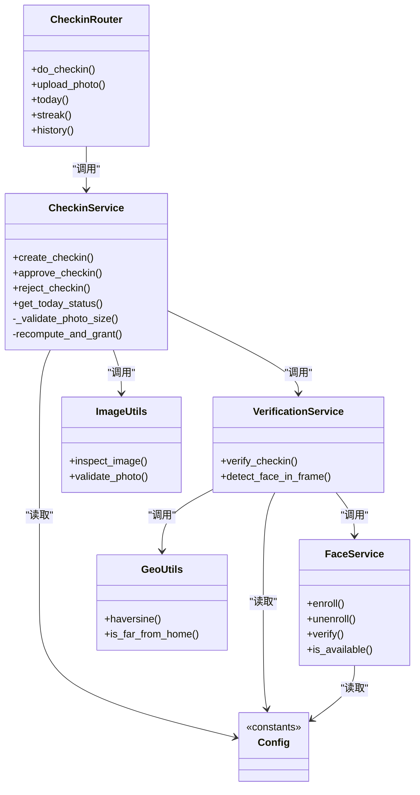

# 打卡接口

<cite>
**本文引用的文件**   
- [summer-homework-checkin/backend/app/routers/checkin.py](file://summer-homework-checkin/backend/app/routers/checkin.py)
- [summer-homework-checkin/backend/app/services/checkin_service.py](file://summer-homework-checkin/backend/app/services/checkin_service.py)
- [summer-homework-checkin/backend/app/models.py](file://summer-homework-checkin/backend/app/models.py)
- [summer-homework-checkin/backend/app/schemas.py](file://summer-homework-checkin/backend/app/schemas.py)
- [summer-homework-checkin/backend/app/utils/geo.py](file://summer-homework-checkin/backend/app/utils/geo.py)
- [summer-homework-checkin/backend/app/services/face_service.py](file://summer-homework-checkin/backend/app/services/face_service.py)
- [summer-homework-checkin/backend/app/services/verification_service.py](file://summer-homework-checkin/backend/app/services/verification_service.py)
- [summer-homework-checkin/backend/app/config.py](file://summer-homework-checkin/backend/app/config.py)
- [summer-homework-checkin/backend/app/utils/image.py](file://summer-homework-checkin/backend/app/utils/image.py)
- [summer-homework-checkin/backend/app/routers/admin.py](file://summer-homework-checkin/backend/app/routers/admin.py)
- [summer-homework-checkin/backend/app/routers/report.py](file://summer-homework-checkin/backend/app/routers/report.py)
</cite>

## 目录
1. [简介](#简介)
2. [项目结构](#项目结构)
3. [核心组件](#核心组件)
4. [架构总览](#架构总览)
5. [详细接口说明](#详细接口说明)
6. [依赖关系分析](#依赖关系分析)
7. [性能与扩展性](#性能与扩展性)
8. [错误码与异常处理](#错误码与异常处理)
9. [防作弊机制](#防作弊机制)
10. [故障排查指南](#故障排查指南)
11. [结论](#结论)

## 简介
本文件为“暑假作业打卡”系统的打卡管理接口文档，覆盖以下能力：
- 提交打卡照片（含正常打卡与补卡）
- 查询今日状态、连续打卡统计、历史打卡记录
- 管理员审核打卡（批准/拒绝）
- 打卡积分计算规则与连续打卡奖励机制
- 地理位置验证与人脸识别验证流程
- 防作弊校验在接口层面的体现
- 完整的请求/响应示例与错误码定义

## 项目结构
后端采用 FastAPI + SQLAlchemy 的模块化分层设计：
- routers：HTTP 路由层，定义 API 端点
- services：业务逻辑与服务编排
- models：数据库模型
- schemas：Pydantic 数据模型（请求/响应结构）
- utils：工具函数（图片解析、地理距离计算、存储等）
- config：全局配置（阈值、开关、路径等）



图表来源
- [summer-homework-checkin/backend/app/routers/checkin.py:1-80](file://summer-homework-checkin/backend/app/routers/checkin.py#L1-L80)
- [summer-homework-checkin/backend/app/services/checkin_service.py:1-254](file://summer-homework-checkin/backend/app/services/checkin_service.py#L1-L254)
- [summer-homework-checkin/backend/app/services/verification_service.py:1-71](file://summer-homework-checkin/backend/app/services/verification_service.py#L1-L71)
- [summer-homework-checkin/backend/app/services/face_service.py:1-133](file://summer-homework-checkin/backend/app/services/face_service.py#L1-L133)
- [summer-homework-checkin/backend/app/utils/geo.py:1-24](file://summer-homework-checkin/backend/app/utils/geo.py#L1-L24)
- [summer-homework-checkin/backend/app/utils/image.py:1-61](file://summer-homework-checkin/backend/app/utils/image.py#L1-L61)
- [summer-homework-checkin/backend/app/config.py:1-50](file://summer-homework-checkin/backend/app/config.py#L1-L50)
- [summer-homework-checkin/backend/app/models.py:1-212](file://summer-homework-checkin/backend/app/models.py#L1-L212)
- [summer-homework-checkin/backend/app/schemas.py:1-322](file://summer-homework-checkin/backend/app/schemas.py#L1-L322)

章节来源
- [summer-homework-checkin/backend/app/routers/checkin.py:1-80](file://summer-homework-checkin/backend/app/routers/checkin.py#L1-L80)
- [summer-homework-checkin/backend/app/services/checkin_service.py:1-254](file://summer-homework-checkin/backend/app/services/checkin_service.py#L1-L254)
- [summer-homework-checkin/backend/app/models.py:1-212](file://summer-homework-checkin/backend/app/models.py#L1-L212)
- [summer-homework-checkin/backend/app/schemas.py:1-322](file://summer-homework-checkin/backend/app/schemas.py#L1-L322)
- [summer-homework-checkin/backend/app/config.py:1-50](file://summer-homework-checkin/backend/app/config.py#L1-L50)

## 核心组件
- 打卡路由：提供 POST /api/checkin、GET /api/checkin/today、GET /api/checkin/streak、GET /api/checkin/history、POST /api/checkin/upload
- 审核路由：提供 PUT /api/admin/checkins/{id}/review
- 报告路由：提供 GET /api/report/me（用于统计汇总）
- 校验服务：综合图像、地理、人脸三重校验
- 人脸识别服务：1:1 本人比对（基于 insightface）
- 配置中心：阈值、开关、统计周期、积分规则等

章节来源
- [summer-homework-checkin/backend/app/routers/checkin.py:1-80](file://summer-homework-checkin/backend/app/routers/checkin.py#L1-L80)
- [summer-homework-checkin/backend/app/routers/admin.py:1-214](file://summer-homework-checkin/backend/app/routers/admin.py#L1-L214)
- [summer-homework-checkin/backend/app/routers/report.py:1-36](file://summer-homework-checkin/backend/app/routers/report.py#L1-L36)
- [summer-homework-checkin/backend/app/services/verification_service.py:1-71](file://summer-homework-checkin/backend/app/services/verification_service.py#L1-L71)
- [summer-homework-checkin/backend/app/services/face_service.py:1-133](file://summer-homework-checkin/backend/app/services/face_service.py#L1-L133)
- [summer-homework-checkin/backend/app/config.py:1-50](file://summer-homework-checkin/backend/app/config.py#L1-L50)

## 架构总览
下图展示一次“提交打卡”的端到端调用链：客户端上传照片与位置信息，路由层进行鉴权与参数接收，服务层执行合规校验、保存文件、触发通知，并返回结构化结果。



图表来源
- [summer-homework-checkin/backend/app/routers/checkin.py:17-37](file://summer-homework-checkin/backend/app/routers/checkin.py#L17-L37)
- [summer-homework-checkin/backend/app/services/checkin_service.py:64-163](file://summer-homework-checkin/backend/app/services/checkin_service.py#L64-L163)
- [summer-homework-checkin/backend/app/services/verification_service.py:19-71](file://summer-homework-checkin/backend/app/services/verification_service.py#L19-L71)
- [summer-homework-checkin/backend/app/services/face_service.py:99-125](file://summer-homework-checkin/backend/app/services/face_service.py#L99-L125)

## 详细接口说明

### 通用鉴权与角色
- 所有需要登录的接口均通过依赖注入获取当前用户；仅学生可提交打卡；管理员操作需具备 admin 角色。

章节来源
- [summer-homework-checkin/backend/app/routers/checkin.py:26-30](file://summer-homework-checkin/backend/app/routers/checkin.py#L26-L30)
- [summer-homework-checkin/backend/app/routers/admin.py:10-11](file://summer-homework-checkin/backend/app/routers/admin.py#L10-L11)

---

### 提交打卡（支持正常打卡与补卡）
- 方法：POST
- 路径：/api/checkin
- 内容类型：multipart/form-data
- 必填字段：
  - photo: 图片文件（JPEG/PNG，体积与尺寸受限制）
- 可选字段：
  - proof: 补卡凭证（仅补卡时必填）
  - location_lat: 纬度（浮点数）
  - location_lng: 经度（浮点数）
  - check_type: 打卡类型，默认 normal；可选值 normal | makeup
  - makeup_reason: 补卡原因（字符串）
  - makeup_for_date: 补卡目标日期（YYYY-MM-DD），仅补卡时必填
- 鉴权：需要登录且角色为学生
- 业务流程要点：
  - 照片体积与格式校验（最小 5KB，最大 10MB，最小边长 200px）
  - 补卡规则：只能补过去日期、需在暑假统计范围内、同一天不可重复有效打卡、单月补卡次数上限
  - 保存照片与凭证到服务器
  - 防代打卡校验：图像真实性、场景合规性、地理位置一致性、人脸 1:1 比对
  - 若已采集人脸且处于严格模式，不通过则直接拒绝
  - 创建打卡记录，初始审核状态 pending，is_effective=false
  - 通知学生与家长
- 成功响应：返回 CheckInOut 对象（包含 id、user_id、check_date、check_time、photo_url、location_lat/lng、check_type、makeup_reason、geo_distance、geo_flag、scene_check、face_status、face_score、face_flag、review_status、is_effective 等）
- 失败情形：
  - 非学生：403
  - 照片不符合要求：400
  - 补卡参数或规则不满足：400
  - 人脸模型不可用且强制策略：503

章节来源
- [summer-homework-checkin/backend/app/routers/checkin.py:17-37](file://summer-homework-checkin/backend/app/routers/checkin.py#L17-L37)
- [summer-homework-checkin/backend/app/services/checkin_service.py:64-163](file://summer-homework-checkin/backend/app/services/checkin_service.py#L64-L163)
- [summer-homework-checkin/backend/app/utils/image.py:51-61](file://summer-homework-checkin/backend/app/utils/image.py#L51-L61)
- [summer-homework-checkin/backend/app/config.py:27-49](file://summer-homework-checkin/backend/app/config.py#L27-L49)

#### 请求示例（multipart/form-data）
- 正常打卡
  - photo: 图片文件
  - location_lat: 31.2304
  - location_lng: 121.4737
  - check_type: normal
- 补卡
  - photo: 图片文件
  - proof: 凭证图片
  - location_lat: 31.2304
  - location_lng: 121.4737
  - check_type: makeup
  - makeup_reason: 生病请假
  - makeup_for_date: 2026-07-10

#### 响应示例（简化）
- 成功
  - {
      "id": 123,
      "user_id": 5,
      "check_date": "2026-07-12",
      "check_time": "2026-07-12T10:05:00Z",
      "photo_url": "/uploads/c/...jpg",
      "location_lat": 31.2304,
      "location_lng": 121.4737,
      "check_type": "normal",
      "geo_distance": 120.5,
      "geo_flag": false,
      "scene_check": "pass",
      "face_status": "match",
      "face_score": 0.82,
      "face_flag": false,
      "review_status": "pending",
      "is_effective": false
    }
- 失败
  - 400: {"detail": "照片体积不符合要求（需大于 5KB 且小于 10MB）"}
  - 400: {"detail": "补卡需指定补卡目标日期"}
  - 400: {"detail": "该日期已有打卡记录，无需重复补卡"}
  - 400: {"detail": "本月补卡次数已达上限（3 次）"}
  - 400: {"detail": "人脸校验未通过，疑似非本人打卡"}
  - 503: {"detail": "人脸识别服务暂不可用，请稍后重试"}

---

### 上传图片（通用）
- 方法：POST
- 路径：/api/checkin/upload
- 用途：供前端图片查看器“上传”功能使用，返回可访问 URL
- 必填字段：
  - photo: 图片文件（JPEG/PNG，体积与尺寸受限制）
- 成功响应：
  - {
      "photo_path": "c/xxx.jpg",
      "photo_url": "/uploads/c/xxx.jpg"
    }
- 失败情形：
  - 400: 图片不符合要求

章节来源
- [summer-homework-checkin/backend/app/routers/checkin.py:40-52](file://summer-homework-checkin/backend/app/routers/checkin.py#L40-L52)
- [summer-homework-checkin/backend/app/utils/image.py:51-61](file://summer-homework-checkin/backend/app/utils/image.py#L51-L61)

---

### 今日打卡状态
- 方法：GET
- 路径：/api/checkin/today
- 返回：
  - today_checked: 今日是否已审核通过
  - today_pending: 今日是否有待审核记录
  - today_count: 今日打卡总数
  - approved_count: 今日已通过数
  - pending_count: 今日待审核数
  - can_makeup_this_month: 本月剩余可补卡次数

章节来源
- [summer-homework-checkin/backend/app/routers/checkin.py:56-59](file://summer-homework-checkin/backend/app/routers/checkin.py#L56-L59)
- [summer-homework-checkin/backend/app/services/checkin_service.py:225-253](file://summer-homework-checkin/backend/app/services/checkin_service.py#L225-L253)

---

### 连续打卡与抽奖资格统计
- 方法：GET
- 路径：/api/checkin/streak
- 返回：
  - current_streak: 当前连续有效打卡天数
  - longest_streak: 历史最长连续天数
  - effective_checkins: 累计有效打卡次数
  - lottery_tickets: 当前可用抽奖资格
  - today_checked: 今日是否已审核通过
  - today_pending: 今日是否有待审核记录
  - can_makeup_this_month: 本月剩余可补卡次数

章节来源
- [summer-homework-checkin/backend/app/routers/checkin.py:62-73](file://summer-homework-checkin/backend/app/routers/checkin.py#L62-L73)
- [summer-homework-checkin/backend/app/services/checkin_service.py:39-61](file://summer-homework-checkin/backend/app/services/checkin_service.py#L39-L61)

---

### 打卡历史记录
- 方法：GET
- 路径：/api/checkin/history
- 分页与过滤：
  - 当前实现：返回该用户全部打卡记录，按时间倒序排列
  - 无分页参数与过滤条件
- 返回：CheckInOut 列表

章节来源
- [summer-homework-checkin/backend/app/routers/checkin.py:76-79](file://summer-homework-checkin/backend/app/routers/checkin.py#L76-L79)

---

### 管理员审核打卡（补卡申请审核）
- 方法：PUT
- 路径：/api/admin/checkins/{checkin_id}/review
- 权限：管理员
- 请求体：
  - status: approved | rejected
  - note: 备注（可选）
- 业务规则：
  - 仅允许对 pending 状态的记录进行审核
  - 批准：标记 is_effective=true，发放积分（正常打卡 CHECKIN_POINTS，补卡 MAKEUP_POINTS），重算连续天数与抽奖资格，通知学生
  - 拒绝：标记 rejected，is_effective=false，通知学生
- 成功响应：
  - {
      "message": "审核完成",
      "review_status": "approved|rejected"
    }
- 失败情形：
  - 404: 记录不存在
  - 400: 记录已审核或状态非法

章节来源
- [summer-homework-checkin/backend/app/routers/admin.py:84-103](file://summer-homework-checkin/backend/app/routers/admin.py#L84-L103)
- [summer-homework-checkin/backend/app/services/checkin_service.py:166-209](file://summer-homework-checkin/backend/app/services/checkin_service.py#L166-L209)

---

### 个人报告（打卡统计）
- 方法：GET
- 路径：/api/report/me
- 参数：
  - start: 起始日期（默认暑假开始）
  - end: 结束日期（默认暑假结束）
- 返回：ReportOut（包含 total_days、checked_days、effective_checkins、makeup_count、completion_rate、weekly_buckets、prize_wins、lottery_draws 等）

章节来源
- [summer-homework-checkin/backend/app/routers/report.py:17-24](file://summer-homework-checkin/backend/app/routers/report.py#L17-L24)
- [summer-homework-checkin/backend/app/schemas.py:215-230](file://summer-homework-checkin/backend/app/schemas.py#L215-L230)

## 依赖关系分析
- 路由层依赖服务层与工具层
- 校验服务聚合图像校验、地理距离计算、人脸比对
- 人脸识别服务懒加载模型，线程安全，支持降级提示
- 配置集中管理阈值与开关，便于环境切换



图表来源
- [summer-homework-checkin/backend/app/routers/checkin.py:1-80](file://summer-homework-checkin/backend/app/routers/checkin.py#L1-L80)
- [summer-homework-checkin/backend/app/services/checkin_service.py:1-254](file://summer-homework-checkin/backend/app/services/checkin_service.py#L1-L254)
- [summer-homework-checkin/backend/app/services/verification_service.py:1-71](file://summer-homework-checkin/backend/app/services/verification_service.py#L1-L71)
- [summer-homework-checkin/backend/app/services/face_service.py:1-133](file://summer-homework-checkin/backend/app/services/face_service.py#L1-L133)
- [summer-homework-checkin/backend/app/utils/geo.py:1-24](file://summer-homework-checkin/backend/app/utils/geo.py#L1-L24)
- [summer-homework-checkin/backend/app/utils/image.py:1-61](file://summer-homework-checkin/backend/app/utils/image.py#L1-L61)
- [summer-homework-checkin/backend/app/config.py:1-50](file://summer-homework-checkin/backend/app/config.py#L1-L50)

章节来源
- [summer-homework-checkin/backend/app/routers/checkin.py:1-80](file://summer-homework-checkin/backend/app/routers/checkin.py#L1-L80)
- [summer-homework-checkin/backend/app/services/checkin_service.py:1-254](file://summer-homework-checkin/backend/app/services/checkin_service.py#L1-L254)
- [summer-homework-checkin/backend/app/services/verification_service.py:1-71](file://summer-homework-checkin/backend/app/services/verification_service.py#L1-L71)
- [summer-homework-checkin/backend/app/services/face_service.py:1-133](file://summer-homework-checkin/backend/app/services/face_service.py#L1-L133)
- [summer-homework-checkin/backend/app/utils/geo.py:1-24](file://summer-homework-checkin/backend/app/utils/geo.py#L1-L24)
- [summer-homework-checkin/backend/app/utils/image.py:1-61](file://summer-homework-checkin/backend/app/utils/image.py#L1-L61)
- [summer-homework-checkin/backend/app/config.py:1-50](file://summer-homework-checkin/backend/app/config.py#L1-L50)

## 性能与扩展性
- 人脸识别模型懒加载与线程锁保护，避免重复初始化开销
- 人脸检测输入尺寸可调，平衡速度与精度
- 地理位置计算使用 Haversine 公式，轻量高效
- 图片解析不依赖 Pillow，降低依赖与内存占用
- 建议：
  - 生产环境启用缓存（如人脸 embedding 缓存）
  - 异步任务队列处理通知与报表生成
  - 针对历史打卡接口增加分页与过滤以提升大数据量下的性能

[本节为通用指导，不涉及具体文件分析]

## 错误码与异常处理
- 400 Bad Request
  - 照片体积或格式不符
  - 照片尺寸过小
  - 补卡参数缺失或日期格式错误
  - 补卡日期不在暑假统计范围
  - 同一天已存在有效打卡
  - 单月补卡次数超限
  - 人脸不通过（严格模式）
  - 审核状态非法或重复审核
- 403 Forbidden
  - 非学生尝试提交打卡
  - 非管理员尝试审核
- 404 Not Found
  - 打卡记录不存在
- 503 Service Unavailable
  - 人脸识别服务不可用（严格模式下）

章节来源
- [summer-homework-checkin/backend/app/routers/checkin.py:29-30](file://summer-homework-checkin/backend/app/routers/checkin.py#L29-L30)
- [summer-homework-checkin/backend/app/services/checkin_service.py:67-122](file://summer-homework-checkin/backend/app/services/checkin_service.py#L67-L122)
- [summer-homework-checkin/backend/app/routers/admin.py:94-102](file://summer-homework-checkin/backend/app/routers/admin.py#L94-L102)

## 防作弊机制
- 图像真实性与场景合规性
  - 体积与尺寸门槛，过滤占位图/缩略图
  - 场景检查 pass/warn/pending，风险等级 low/medium/high
- 地理位置一致性
  - 计算与常用位置的距离，超过阈值标记风险
- 人脸 1:1 比对
  - 已采集底图的账号，不通过则拒绝（严格模式）或标记高风险（容错模式）
- 综合判定
  - 任一环节异常将提升风险等级，辅助人工审核

```mermaid
flowchart TD
Start(["进入 verify_checkin"]) --> PhotoCheck["图像体积/格式/尺寸校验"]
PhotoCheck --> GeoCalc["计算距常用位置距离"]
GeoCalc --> FaceVerify["人脸 1:1 比对"]
FaceVerify --> RiskAssess{"综合风险判定"}
RiskAssess --> |图像不合法| HighRisk["高风险"]
RiskAssess --> |距离超阈值| MediumRisk["中风险"]
RiskAssess --> |人脸不通过(已注册)| HighRisk
RiskAssess --> |人脸不可用(已注册)| MediumRisk
RiskAssess --> |其他| LowRisk["低风险"]
HighRisk --> End(["返回 scene_check=warn, risk=high"])
MediumRisk --> End
LowRisk --> End(["返回 scene_check=pass, risk=low"])
```

图表来源
- [summer-homework-checkin/backend/app/services/verification_service.py:19-71](file://summer-homework-checkin/backend/app/services/verification_service.py#L19-L71)
- [summer-homework-checkin/backend/app/utils/image.py:51-61](file://summer-homework-checkin/backend/app/utils/image.py#L51-L61)
- [summer-homework-checkin/backend/app/utils/geo.py:6-24](file://summer-homework-checkin/backend/app/utils/geo.py#L6-L24)
- [summer-homework-checkin/backend/app/services/face_service.py:99-125](file://summer-homework-checkin/backend/app/services/face_service.py#L99-L125)

章节来源
- [summer-homework-checkin/backend/app/services/verification_service.py:1-71](file://summer-homework-checkin/backend/app/services/verification_service.py#L1-L71)
- [summer-homework-checkin/backend/app/utils/image.py:1-61](file://summer-homework-checkin/backend/app/utils/image.py#L1-L61)
- [summer-homework-checkin/backend/app/utils/geo.py:1-24](file://summer-homework-checkin/backend/app/utils/geo.py#L1-L24)
- [summer-homework-checkin/backend/app/services/face_service.py:1-133](file://summer-homework-checkin/backend/app/services/face_service.py#L1-L133)

## 故障排查指南
- 人脸模型不可用
  - 现象：503 或 scene_check=warn，risk=medium
  - 排查：确认 insightface 安装与模型下载；检查 FACE_MODE_ON_ENROLLED 配置
- 照片被拒
  - 现象：400 提示体积/格式/尺寸问题
  - 排查：确保 JPEG/PNG，大小 5KB~10MB，边长≥200
- 补卡失败
  - 现象：400 提示日期或次数问题
  - 排查：确认日期格式 YYYY-MM-DD、在暑假范围内、未重复有效打卡、未达月度上限
- 审核不生效
  - 现象：400 提示已审核
  - 排查：仅 pending 状态可审核；注意并发重复提交

章节来源
- [summer-homework-checkin/backend/app/services/face_service.py:28-46](file://summer-homework-checkin/backend/app/services/face_service.py#L28-L46)
- [summer-homework-checkin/backend/app/services/checkin_service.py:67-122](file://summer-homework-checkin/backend/app/services/checkin_service.py#L67-L122)
- [summer-homework-checkin/backend/app/routers/admin.py:94-102](file://summer-homework-checkin/backend/app/routers/admin.py#L94-L102)

## 结论
本打卡系统通过“图像+地理+人脸”三重校验与“管理员审核”闭环，构建了较为完善的防作弊体系。接口设计清晰，职责分层明确，配置项集中可控。建议在后续版本中增强历史打卡接口的分页与过滤能力，并引入异步任务优化通知与报表生成性能。