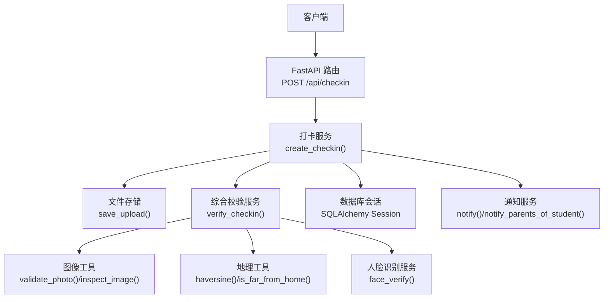
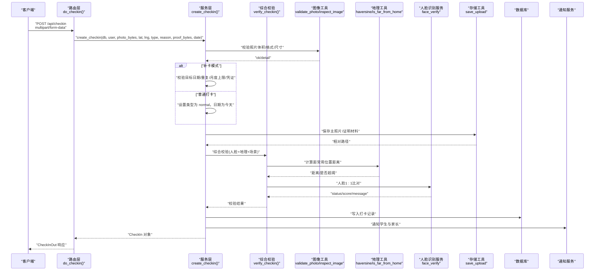
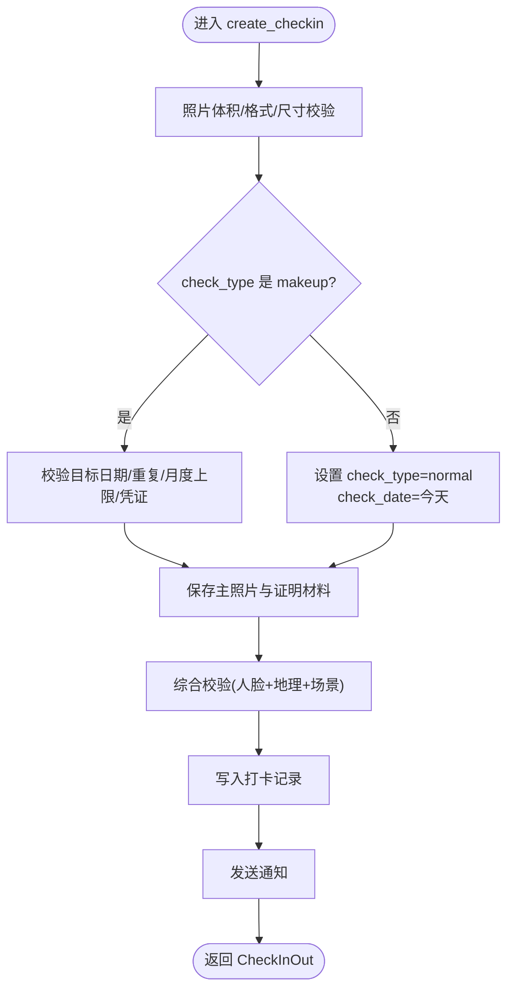
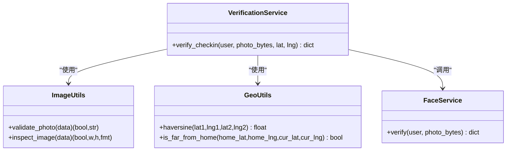
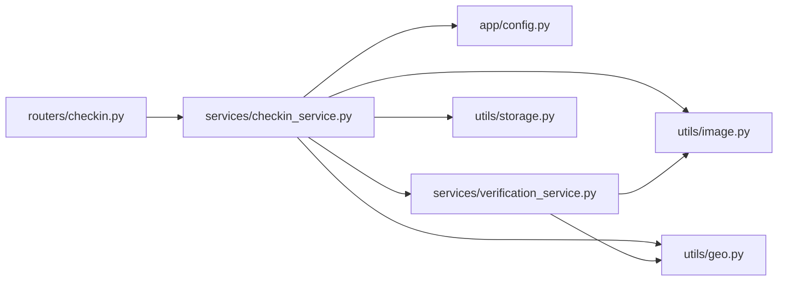

# 打卡提交接口

<cite>
**本文引用的文件列表**
- [checkin.py](file://summer-homework-checkin/backend/app/routers/checkin.py)
- [checkin_service.py](file://summer-homework-checkin/backend/app/services/checkin_service.py)
- [schemas.py](file://summer-homework-checkin/backend/app/schemas.py)
- [models.py](file://summer-homework-checkin/backend/app/models.py)
- [image.py](file://summer-homework-checkin/backend/app/utils/image.py)
- [geo.py](file://summer-homework-checkin/backend/app/utils/geo.py)
- [config.py](file://summer-homework-checkin/backend/app/config.py)
- [verification_service.py](file://summer-homework-checkin/backend/app/services/verification_service.py)
- [storage.py](file://summer-homework-checkin/backend/app/utils/storage.py)
</cite>

## 目录
1. [简介](#简介)
2. [项目结构](#项目结构)
3. [核心组件](#核心组件)
4. [架构总览](#架构总览)
5. [详细组件分析](#详细组件分析)
6. [依赖关系分析](#依赖关系分析)
7. [性能与容量限制](#性能与容量限制)
8. [错误码与排错指南](#错误码与排错指南)
9. [结论](#结论)
10. [附录：请求与响应示例](#附录请求与响应示例)

## 简介
本文件为“打卡提交接口”的完整 API 文档，聚焦于 POST /api/checkin 的实现细节。该接口支持两种模式：
- 普通打卡（当日作业打卡）
- 补卡打卡（补录历史日期）

接口要求上传主照片 photo，可选上传证明材料 proof；支持传入地理位置 location_lat、location_lng；支持选择打卡类型 check_type（normal/late/makeup）。在接口层面实现了图片质量校验、人脸识别验证流程、防作弊机制（位置一致性、人脸比对、场景合规性），并返回结构化结果供前端展示与后续审核。

## 项目结构
后端采用 FastAPI 路由 + 服务层 + 工具层的分层设计：
- 路由层：定义 REST 端点，解析表单与文件，调用服务层
- 服务层：实现业务规则（打卡创建、补卡规则、积分与连续天数重算、通知等）
- 工具层：图片解析、地理距离计算、文件存储
- 配置层：阈值、策略、常量
- 数据模型：数据库 ORM 映射与输出 Schema

图示来源
- [checkin.py:17-37](file://summer-homework-checkin/backend/app/routers/checkin.py#L17-L37)
- [checkin_service.py:64-163](file://summer-homework-checkin/backend/app/services/checkin_service.py#L64-L163)
- [verification_service.py:19-71](file://summer-homework-checkin/backend/app/services/verification_service.py#L19-L71)
- [image.py:34-61](file://summer-homework-checkin/backend/app/utils/image.py#L34-L61)
- [geo.py:6-24](file://summer-homework-checkin/backend/app/utils/geo.py#L6-L24)
- [storage.py:7-16](file://summer-homework-checkin/backend/app/utils/storage.py#L7-L16)

章节来源
- [checkin.py:1-80](file://summer-homework-checkin/backend/app/routers/checkin.py#L1-L80)
- [checkin_service.py:1-254](file://summer-homework-checkin/backend/app/services/checkin_service.py#L1-L254)
- [schemas.py:46-76](file://summer-homework-checkin/backend/app/schemas.py#L46-L76)
- [models.py:70-101](file://summer-homework-checkin/backend/app/models.py#L70-L101)
- [image.py:1-61](file://summer-homework-checkin/backend/app/utils/image.py#L1-L61)
- [geo.py:1-24](file://summer-homework-checkin/backend/app/utils/geo.py#L1-L24)
- [config.py:27-50](file://summer-homework-checkin/backend/app/config.py#L27-L50)
- [verification_service.py:1-71](file://summer-homework-checkin/backend/app/services/verification_service.py#L1-71)
- [storage.py:1-24](file://summer-homework-checkin/backend/app/utils/storage.py#L1-L24)

## 核心组件
- 路由层
  - POST /api/checkin：接收 multipart/form-data，包含 photo、proof、location_lat、location_lng、check_type、makeup_reason、makeup_for_date；鉴权后调用服务层创建打卡记录。
  - GET /api/checkin/today：查询今日打卡状态（含待审/通过计数、本月剩余补卡次数）。
  - GET /api/checkin/streak：返回连续打卡统计与抽奖资格信息。
  - GET /api/checkin/history：返回用户打卡历史（按时间倒序）。
  - POST /api/checkin/upload：通用图片上传（用于图片查看器），返回可访问 URL。

- 服务层
  - create_checkin：执行图片体积与尺寸校验、补卡规则校验、保存文件、触发综合校验（人脸+地理+场景）、写入数据库、发送通知。
  - approve_checkin/reject_checkin：管理员审核逻辑（非本次重点）。
  - get_today_status：汇总今日打卡情况与补卡额度。

- 工具层
  - image.validate_photo/inspect_image：仅依赖标准库解析 JPEG/PNG 头，提取宽高，过滤占位图/缩略图。
  - geo.haversine/is_far_from_home：计算经纬度距离与是否超出阈值。
  - storage.save_upload/public_url：落盘与生成公开访问路径。

- 配置层
  - 地理阈值、补卡上限、图片大小与尺寸门槛、人脸识别策略等。

章节来源
- [checkin.py:17-80](file://summer-homework-checkin/backend/app/routers/checkin.py#L17-L80)
- [checkin_service.py:64-163](file://summer-homework-checkin/backend/app/services/checkin_service.py#L64-L163)
- [image.py:34-61](file://summer-homework-checkin/backend/app/utils/image.py#L34-L61)
- [geo.py:6-24](file://summer-homework-checkin/backend/app/utils/geo.py#L6-L24)
- [storage.py:7-16](file://summer-homework-checkin/backend/app/utils/storage.py#L7-L16)
- [config.py:27-50](file://summer-homework-checkin/backend/app/config.py#L27-L50)

## 架构总览
以下时序图展示了 POST /api/checkin 的完整调用链，包括参数校验、文件保存、综合校验、数据库写入与通知。

图示来源
- [checkin.py:17-37](file://summer-homework-checkin/backend/app/routers/checkin.py#L17-L37)
- [checkin_service.py:64-163](file://summer-homework-checkin/backend/app/services/checkin_service.py#L64-L163)
- [verification_service.py:19-71](file://summer-homework-checkin/backend/app/services/verification_service.py#L19-L71)
- [image.py:34-61](file://summer-homework-checkin/backend/app/utils/image.py#L34-L61)
- [geo.py:6-24](file://summer-homework-checkin/backend/app/utils/geo.py#L6-L24)
- [storage.py:7-16](file://summer-homework-checkin/backend/app/utils/storage.py#L7-L16)

## 详细组件分析

### 接口定义与参数说明
- 端点：POST /api/checkin
- 认证：需要携带有效令牌（由依赖注入获取当前用户）
- Content-Type：multipart/form-data
- 表单字段
  - photo：必填，主照片（JPEG/PNG）
  - proof：选填，补卡时必需（证明材料）
  - location_lat：选填，浮点数，纬度
  - location_lng：选填，浮点数，经度
  - check_type：选填，字符串，默认 "normal"，取值范围：normal、late、makeup
  - makeup_reason：选填，字符串，补卡原因
  - makeup_for_date：选填，字符串，ISO 日期（YYYY-MM-DD），仅补卡时使用
- 权限控制：仅 student 角色可打卡，否则返回 403

章节来源
- [checkin.py:17-37](file://summer-homework-checkin/backend/app/routers/checkin.py#L17-L37)
- [schemas.py:46-52](file://summer-homework-checkin/backend/app/schemas.py#L46-L52)

### 普通打卡与补卡打卡流程
- 普通打卡（check_type=normal）
  - 检查照片合规（体积、格式、尺寸）
  - 保存主照片
  - 触发综合校验（人脸、地理、场景）
  - 写入打卡记录，状态 pending
  - 发送通知
- 补卡打卡（check_type=makeup）
  - 必须提供 makeup_for_date（过去日期且在暑假统计范围内）
  - 目标日期不可已存在有效打卡
  - 单自然月补卡次数不超过上限
  - 必须上传 proof 证明材料
  - 其余与普通打卡一致

图示来源
- [checkin_service.py:64-163](file://summer-homework-checkin/backend/app/services/checkin_service.py#L64-L163)

章节来源
- [checkin_service.py:64-163](file://summer-homework-checkin/backend/app/services/checkin_service.py#L64-L163)

### 图片上传与验证规则
- 支持的图片格式：JPEG、PNG
- 文件大小限制：大于 5KB 且小于 10MB
- 最小尺寸：宽或高不得小于 200 像素
- 验证方式：基于文件头解析，不依赖第三方图像处理库
- 通用上传接口：POST /api/checkin/upload 返回 photo_path 与 photo_url，便于前端预览与二次提交

章节来源
- [image.py:34-61](file://summer-homework-checkin/backend/app/utils/image.py#L34-L61)
- [config.py:30-32](file://summer-homework-checkin/backend/app/config.py#L30-L32)
- [checkin.py:40-52](file://summer-homework-checkin/backend/app/routers/checkin.py#L40-L52)

### 地理位置参数验证与风险标记
- 若用户设置了常用位置（home_lat/home_lng）且请求提供了 location_lat/location_lng，则计算两点间距离（米）
- 超过阈值（默认 1500 米）将标记 geo_flag=true，作为代打卡风险提示
- 距离与标记会写入打卡记录，便于后续审核

章节来源
- [geo.py:6-24](file://summer-homework-checkin/backend/app/utils/geo.py#L6-L24)
- [checkin_service.py:114-136](file://summer-homework-checkin/backend/app/services/checkin_service.py#L114-L136)
- [config.py:28](file://summer-homework-checkin/backend/app/config.py#L28)

### 人脸识别验证流程与防作弊机制
- 人脸 1:1 比对：当用户已采集人脸底图（face_enrolled=true）时，进行本人比对
- 策略配置：FACE_MODE_ON_ENROLLED 可为 enforce 或 soft
  - enforce：人脸不通过直接拒绝打卡
  - soft：仅标记高风险但仍允许记录
- 风险判定：
  - 照片不合规 -> scene_check=warn，risk=high
  - 位置超阈 -> scene_check=warn，risk=medium
  - 人脸不匹配/多脸/无脸 -> scene_check=warn，risk=high
  - 模型不可用 -> 根据策略决定是否放行或降级为待复核
- 结果持久化：face_status、face_score、face_flag 写入打卡记录

图示来源
- [verification_service.py:19-71](file://summer-homework-checkin/backend/app/services/verification_service.py#L19-L71)
- [image.py:34-61](file://summer-homework-checkin/backend/app/utils/image.py#L34-L61)
- [geo.py:6-24](file://summer-homework-checkin/backend/app/utils/geo.py#L6-L24)

章节来源
- [verification_service.py:19-71](file://summer-homework-checkin/backend/app/services/verification_service.py#L19-L71)
- [config.py:42-49](file://summer-homework-checkin/backend/app/config.py#L42-L49)

### 数据结构与响应模型
- 输入模型（部分）：CheckInCreate（不含文件，用于描述表单字段语义）
- 输出模型：CheckInOut（包含打卡记录所有字段及派生 URL）
- 相关模型：CheckIn（ORM 映射，含 photo_url 属性）

章节来源
- [schemas.py:46-76](file://summer-homework-checkin/backend/app/schemas.py#L46-L76)
- [models.py:70-101](file://summer-homework-checkin/backend/app/models.py#L70-L101)

## 依赖关系分析
- 路由层依赖：
  - 依赖注入：get_current_user（鉴权）、get_db（数据库会话）
  - 服务层：checkin_service.create_checkin
  - 工具层：storage.save_upload、utils.image.validate_photo
- 服务层依赖：
  - 配置：MAX_MAKEUP_PER_MONTH、CHECKIN_POINTS、MAKEUP_POINTS、FACE_MODE_ON_ENROLLED
  - 工具：storage.save_upload、utils.geo.haversine/is_far_from_home、utils.image.inspect_image
  - 服务：verification_service.verify_checkin、notify_service.notify/notify_parents_of_student
- 工具层依赖：
  - config：MIN_PHOTO_BYTES、PHOTO_MAX_BYTES、MIN_PHOTO_DIM、GEO_THRESHOLD_METERS

图示来源
- [checkin.py:17-37](file://summer-homework-checkin/backend/app/routers/checkin.py#L17-L37)
- [checkin_service.py:64-163](file://summer-homework-checkin/backend/app/services/checkin_service.py#L64-L163)
- [verification_service.py:19-71](file://summer-homework-checkin/backend/app/services/verification_service.py#L19-L71)
- [config.py:27-50](file://summer-homework-checkin/backend/app/config.py#L27-L50)

章节来源
- [checkin.py:1-80](file://summer-homework-checkin/backend/app/routers/checkin.py#L1-L80)
- [checkin_service.py:1-254](file://summer-homework-checkin/backend/app/services/checkin_service.py#L1-L254)
- [verification_service.py:1-71](file://summer-homework-checkin/backend/app/services/verification_service.py#L1-71)
- [config.py:1-50](file://summer-homework-checkin/backend/app/config.py#L1-L50)

## 性能与容量限制
- 图片处理：轻量级头部解析，避免引入重型图像处理库，降低 CPU 与内存占用
- 文件存储：按用户 ID 分目录，命名带 UUID，避免冲突
- 地理计算：Haversine 公式，O(1) 复杂度
- 补卡上限：按月统计，减少全量扫描开销
- 建议：
  - 生产环境可将 UPLOAD_DIR 迁移至对象存储（如 OSS/S3），并通过 CDN 加速
  - 对大流量场景增加限流与队列异步处理通知

[本节为通用指导，无需列出具体文件来源]

## 错误码与排错指南
- 403 仅学生可打卡：非 student 角色尝试打卡
- 400 参数/规则错误
  - 照片体积不符合要求（需大于 5KB 且小于 10MB）
  - 文件不是有效的 JPEG/PNG 图像
  - 照片尺寸过小（宽或高小于 200）
  - 补卡需指定补卡目标日期
  - 补卡日期格式错误（应为 YYYY-MM-DD）
  - 补卡只能补过去的日期
  - 补卡日期不在暑假统计范围内
  - 该日期已有打卡记录，无需重复补卡
  - 本月补卡次数已达上限（{MAX_MAKEUP_PER_MONTH} 次）
  - 补卡需上传补充作业完成凭证
  - 人脸校验未通过，疑似非本人打卡
- 503 人脸识别服务暂不可用：已采集人脸但模型不可用且策略为 enforce

排查要点
- 确认图片格式与大小符合限制
- 补卡需提供合理日期与证明材料
- 检查用户是否已采集人脸以及策略配置
- 关注地理位置是否超出阈值导致风险标记

章节来源
- [checkin.py:29-37](file://summer-homework-checkin/backend/app/routers/checkin.py#L29-L37)
- [checkin_service.py:64-123](file://summer-homework-checkin/backend/app/services/checkin_service.py#L64-L123)
- [image.py:51-61](file://summer-homework-checkin/backend/app/utils/image.py#L51-L61)
- [config.py:27-50](file://summer-homework-checkin/backend/app/config.py#L27-L50)

## 结论
POST /api/checkin 在接口层实现了完整的打卡业务闭环：严格的图片质量校验、灵活的补卡规则、基于人脸与地理位置的综合防作弊机制，以及完善的通知与审计字段。配合配置项可灵活调整策略强度，满足从教育到企业场景的多变需求。

[本节为总结性内容，无需列出具体文件来源]

## 附录：请求与响应示例

### 请求示例（普通打卡）
- 方法：POST
- 路径：/api/checkin
- 头部：Authorization: Bearer <token>
- 表单字段：
  - photo：二进制文件（JPEG/PNG，5KB~10MB，边长≥200）
  - location_lat：浮点数（可选）
  - location_lng：浮点数（可选）
  - check_type：normal（默认）
  - makeup_reason：空或不传
  - makeup_for_date：空或不传

### 请求示例（补卡打卡）
- 方法：POST
- 路径：/api/checkin
- 头部：Authorization: Bearer <token>
- 表单字段：
  - photo：同上
  - proof：二进制文件（证明材料）
  - location_lat/location_lng：可选
  - check_type：makeup
  - makeup_reason：补卡原因
  - makeup_for_date：YYYY-MM-DD（过去日期且在暑假统计范围内）

### 成功响应体（CheckInOut）
- id：整型
- user_id：整型
- check_date：日期
- check_time：时间戳
- photo_path：相对路径
- photo_url：可访问 URL
- location_lat/location_lng：浮点数（可能为空）
- check_type：normal|makeup
- makeup_reason：字符串（可能为空）
- makeup_proof_path：字符串（可能为空）
- geo_distance：浮点数（米，可能为空）
- geo_flag：布尔
- scene_check：pass|warn|pending
- face_status：match|mismatch|no_face|multiple_faces|not_enrolled|model_unavailable
- face_score：浮点数（可能为空）
- face_flag：布尔
- review_status：pending|approved|rejected
- review_note：字符串（可能为空）
- is_effective：布尔

章节来源
- [schemas.py:54-76](file://summer-homework-checkin/backend/app/schemas.py#L54-L76)
- [models.py:70-101](file://summer-homework-checkin/backend/app/models.py#L70-L101)