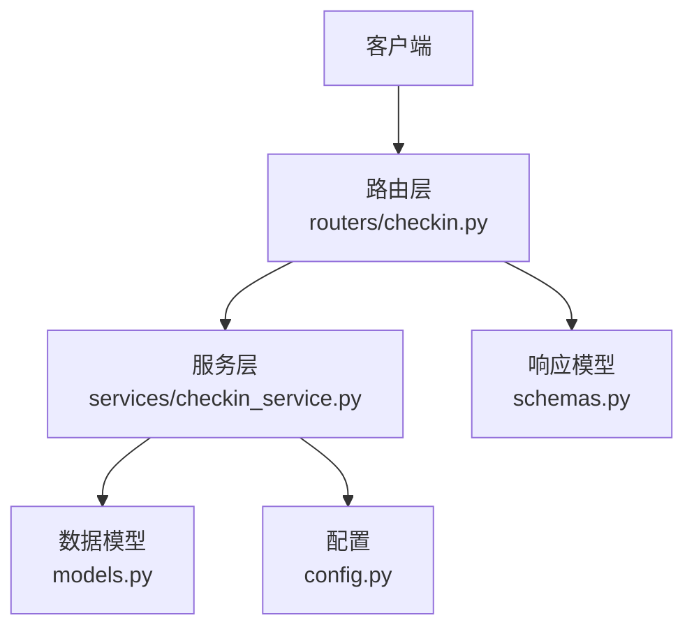
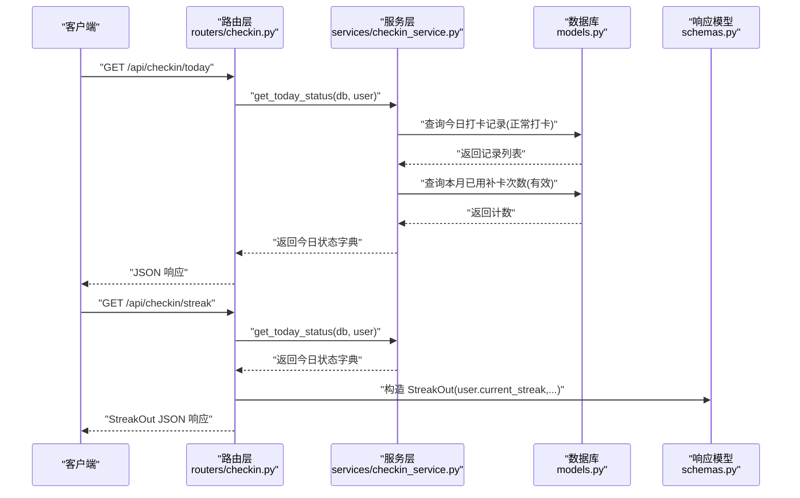
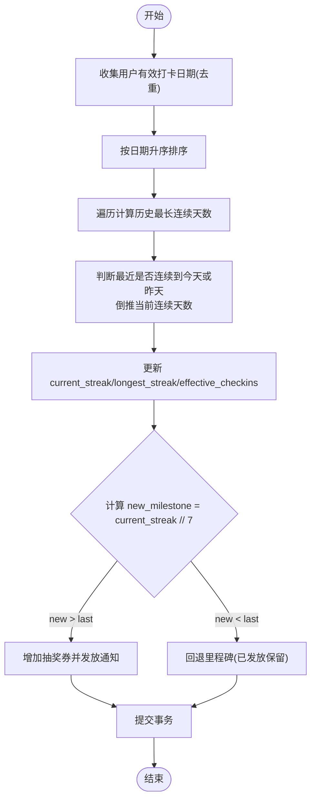
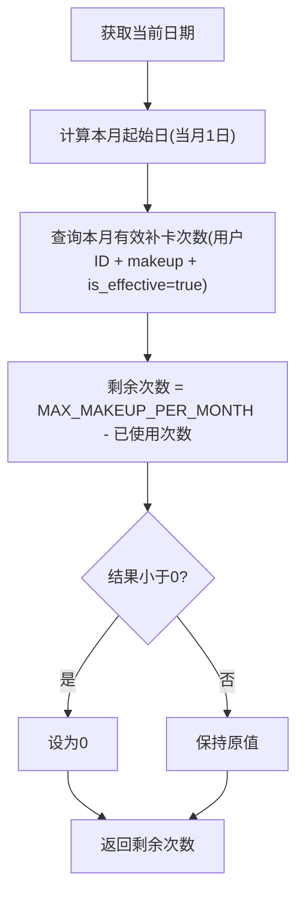
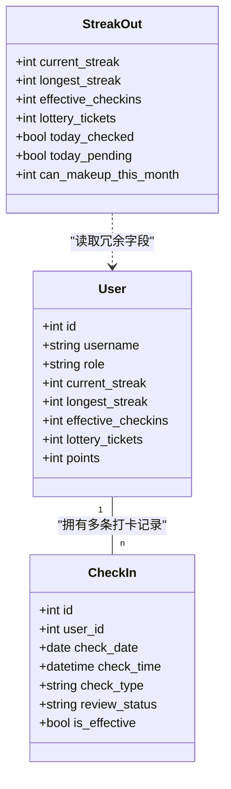

# 打卡状态查询接口

<cite>
**本文引用的文件**   
- [summer-homework-checkin/backend/app/routers/checkin.py](file://summer-homework-checkin/backend/app/routers/checkin.py)
- [summer-homework-checkin/backend/app/services/checkin_service.py](file://summer-homework-checkin/backend/app/services/checkin_service.py)
- [summer-homework-checkin/backend/app/schemas.py](file://summer-homework-checkin/backend/app/schemas.py)
- [summer-homework-checkin/backend/app/models.py](file://summer-homework-checkin/backend/app/models.py)
- [summer-homework-checkin/backend/app/config.py](file://summer-homework-checkin/backend/app/config.py)
</cite>

## 目录
1. [简介](#简介)
2. [项目结构](#项目结构)
3. [核心组件](#核心组件)
4. [架构总览](#架构总览)
5. [详细接口说明](#详细接口说明)
6. [依赖关系分析](#依赖关系分析)
7. [性能与一致性](#性能与一致性)
8. [故障排查指南](#故障排查指南)
9. [结论](#结论)

## 简介
本文件为“暑假作业打卡”系统中打卡状态查询接口的权威文档，聚焦以下两个只读接口：
- GET /api/checkin/today：返回今日打卡状态（是否已打卡、是否待审核等）
- GET /api/checkin/streak：返回连续打卡统计信息（当前连续天数、最长连续记录、有效打卡数、抽奖券数量等），并包含本月补卡权限提示

## 项目结构
与本次文档相关的后端代码位于 summer-homework-checkin/backend/app 下，关键文件职责如下：
- routers/checkin.py：定义 /api/checkin 路由集合，包括 today、streak、history 等
- services/checkin_service.py：实现打卡业务逻辑，含 get_today_status、recompute_and_grant 等
- schemas.py：定义请求/响应模型，如 StreakOut、CheckInOut 等
- models.py：数据库模型，如 User、CheckIn 等
- config.py：系统配置项，如 MAX_MAKEUP_PER_MONTH、CHECKIN_POINTS 等

图表来源
- [summer-homework-checkin/backend/app/routers/checkin.py:56-73](file://summer-homework-checkin/backend/app/routers/checkin.py#L56-L73)
- [summer-homework-checkin/backend/app/services/checkin_service.py:225-253](file://summer-homework-checkin/backend/app/services/checkin_service.py#L225-L253)
- [summer-homework-checkin/backend/app/schemas.py:88-96](file://summer-homework-checkin/backend/app/schemas.py#L88-L96)
- [summer-homework-checkin/backend/app/models.py:70-96](file://summer-homework-checkin/backend/app/models.py#L70-L96)
- [summer-homework-checkin/backend/app/config.py:27-39](file://summer-homework-checkin/backend/app/config.py#L27-L39)

章节来源
- [summer-homework-checkin/backend/app/routers/checkin.py:56-73](file://summer-homework-checkin/backend/app/routers/checkin.py#L56-L73)
- [summer-homework-checkin/backend/app/services/checkin_service.py:225-253](file://summer-homework-checkin/backend/app/services/checkin_service.py#L225-L253)
- [summer-homework-checkin/backend/app/schemas.py:88-96](file://summer-homework-checkin/backend/app/schemas.py#L88-L96)
- [summer-homework-checkin/backend/app/models.py:70-96](file://summer-homework-checkin/backend/app/models.py#L70-L96)
- [summer-homework-checkin/backend/app/config.py:27-39](file://summer-homework-checkin/backend/app/config.py#L27-L39)

## 核心组件
- 路由层
  - GET /api/checkin/today：调用服务层获取今日状态
  - GET /api/checkin/streak：聚合用户连续打卡统计与今日状态，按 StreakOut 返回
- 服务层
  - get_today_status：计算今日是否已打卡、是否待审核、本月剩余可补卡次数等
  - recompute_and_grant：重算连续天数、历史最长连续、有效打卡数，并按里程碑发放抽奖资格
- 数据模型
  - User：存储 current_streak、longest_streak、effective_checkins、lottery_tickets 等冗余字段
  - CheckIn：打卡记录，含 review_status、is_effective、check_type 等关键字段
- 响应模型
  - StreakOut：streak 接口统一返回结构
  - CheckInOut：历史记录条目结构（history 使用）

章节来源
- [summer-homework-checkin/backend/app/routers/checkin.py:56-73](file://summer-homework-checkin/backend/app/routers/checkin.py#L56-L73)
- [summer-homework-checkin/backend/app/services/checkin_service.py:39-61](file://summer-homework-checkin/backend/app/services/checkin_service.py#L39-L61)
- [summer-homework-checkin/backend/app/services/checkin_service.py:225-253](file://summer-homework-checkin/backend/app/services/checkin_service.py#L225-L253)
- [summer-homework-checkin/backend/app/schemas.py:88-96](file://summer-homework-checkin/backend/app/schemas.py#L88-L96)
- [summer-homework-checkin/backend/app/models.py:35-41](file://summer-homework-checkin/backend/app/models.py#L35-L41)
- [summer-homework-checkin/backend/app/models.py:70-96](file://summer-homework-checkin/backend/app/models.py#L70-L96)

## 架构总览
下图展示了从客户端到数据库的调用链路与数据流向。

图表来源
- [summer-homework-checkin/backend/app/routers/checkin.py:56-73](file://summer-homework-checkin/backend/app/routers/checkin.py#L56-L73)
- [summer-homework-checkin/backend/app/services/checkin_service.py:225-253](file://summer-homework-checkin/backend/app/services/checkin_service.py#L225-L253)
- [summer-homework-checkin/backend/app/schemas.py:88-96](file://summer-homework-checkin/backend/app/schemas.py#L88-L96)
- [summer-homework-checkin/backend/app/models.py:70-96](file://summer-homework-checkin/backend/app/models.py#L70-L96)

## 详细接口说明

### GET /api/checkin/today
- 功能：返回当前用户的今日打卡状态
- 认证：需要登录态（通过依赖注入获取当前用户）
- 路径：/api/checkin/today
- 方法：GET
- 请求参数：无
- 响应体：对象，包含以下字段
  - today_checked: boolean
    - 含义：今日是否存在已审核通过的正常打卡记录
    - 取值：true/false
  - today_pending: boolean
    - 含义：今日是否存在待审核的正常打卡记录
    - 取值：true/false
  - today_count: integer
    - 含义：今日提交的正常打卡记录总数（含待审核与已通过）
  - approved_count: integer
    - 含义：今日已审核通过的打卡记录数
  - pending_count: integer
    - 含义：今日待审核的打卡记录数
  - can_makeup_this_month: integer
    - 含义：本月剩余可补卡次数
    - 计算方式：MAX_MAKEUP_PER_MONTH - 本月已使用的有效补卡次数（最小为 0）
      - MAX_MAKEUP_PER_MONTH 来自配置项，默认值为 3，可通过环境变量覆盖
- 业务规则要点
  - 今日仅统计 check_type=normal 的记录
  - 补卡次数仅统计 is_effective=true 且在本自然月内的 makeup 记录
  - 若今日已有 approved 记录，则 today_checked=true；若存在 pending 记录，则 today_pending=true

章节来源
- [summer-homework-checkin/backend/app/routers/checkin.py:56-59](file://summer-homework-checkin/backend/app/routers/checkin.py#L56-L59)
- [summer-homework-checkin/backend/app/services/checkin_service.py:225-253](file://summer-homework-checkin/backend/app/services/checkin_service.py#L225-L253)
- [summer-homework-checkin/backend/app/config.py:27-39](file://summer-homework-checkin/backend/app/config.py#L27-L39)

### GET /api/checkin/streak
- 功能：返回连续打卡统计信息与本月补卡权限提示
- 认证：需要登录态（通过依赖注入获取当前用户）
- 路径：/api/checkin/streak
- 方法：GET
- 请求参数：无
- 响应体：遵循 StreakOut 模型，包含以下字段
  - current_streak: integer
    - 含义：当前连续有效打卡天数
    - 数据来源：User.current_streak（由服务层在审核通过后重算）
  - longest_streak: integer
    - 含义：历史最长连续有效打卡天数
    - 数据来源：User.longest_streak
  - effective_checkins: integer
    - 含义：累计有效打卡次数（去重后的日期数）
    - 数据来源：User.effective_checkins
  - lottery_tickets: integer
    - 含义：当前可用抽奖券数量
    - 数据来源：User.lottery_tickets
  - today_checked: boolean
    - 含义：同 today 接口，表示今日是否已审核通过
  - today_pending: boolean
    - 含义：同 today 接口，表示今日是否有待审核记录
  - can_makeup_this_month: integer
    - 含义：同 today 接口，表示本月剩余可补卡次数
- 业务规则要点
  - 连续天数的重算与抽奖资格发放由服务层维护，详见下方“连续打卡与抽奖资格重算流程”
  - streak 接口复用 today 的状态计算结果，保证两者一致

章节来源
- [summer-homework-checkin/backend/app/routers/checkin.py:62-73](file://summer-homework-checkin/backend/app/routers/checkin.py#L62-L73)
- [summer-homework-checkin/backend/app/schemas.py:88-96](file://summer-homework-checkin/backend/app/schemas.py#L88-L96)
- [summer-homework-checkin/backend/app/services/checkin_service.py:225-253](file://summer-homework-checkin/backend/app/services/checkin_service.py#L225-L253)
- [summer-homework-checkin/backend/app/models.py:35-41](file://summer-homework-checkin/backend/app/models.py#L35-L41)

### 连续打卡与抽奖资格重算流程
- 触发时机：管理员审核通过打卡记录后
- 主要步骤
  - 收集该用户所有 is_effective=true 的打卡日期，去重排序
  - 计算当前连续天数与历史最长连续天数
  - 更新 User.current_streak、User.longest_streak、User.effective_checkins
  - 根据 current_streak // 7 的里程碑差值，增加对应数量的抽奖券
  - 推送系统通知告知解锁的抽奖机会
- 边界情况
  - 若连续中断，last_7_milestone 回退至新里程碑，但已发放的抽奖券不扣减

图表来源
- [summer-homework-checkin/backend/app/services/checkin_service.py:39-61](file://summer-homework-checkin/backend/app/services/checkin_service.py#L39-L61)
- [summer-homework-checkin/backend/app/models.py:35-41](file://summer-homework-checkin/backend/app/models.py#L35-L41)

章节来源
- [summer-homework-checkin/backend/app/services/checkin_service.py:39-61](file://summer-homework-checkin/backend/app/services/checkin_service.py#L39-L61)
- [summer-homework-checkin/backend/app/models.py:35-41](file://summer-homework-checkin/backend/app/models.py#L35-L41)

### can_makeup_this_month 补卡权限判断逻辑
- 计算方式
  - 取当前自然月的起始日（当月 1 日）
  - 统计该用户在本月内已使用的有效补卡次数（check_type=makeup 且 is_effective=true）
  - 剩余次数 = MAX_MAKEUP_PER_MONTH - 已使用次数，最小为 0
- 相关配置
  - MAX_MAKEUP_PER_MONTH：单自然月最多补卡次数，默认 3，支持环境变量覆盖
- 注意
  - 仅统计“有效”的补卡记录，未审核通过的补卡不计入已使用次数
  - 与 create_checkin 中的补卡上限校验保持一致

图表来源
- [summer-homework-checkin/backend/app/services/checkin_service.py:238-253](file://summer-homework-checkin/backend/app/services/checkin_service.py#L238-L253)
- [summer-homework-checkin/backend/app/config.py:27-39](file://summer-homework-checkin/backend/app/config.py#L27-L39)

章节来源
- [summer-homework-checkin/backend/app/services/checkin_service.py:238-253](file://summer-homework-checkin/backend/app/services/checkin_service.py#L238-L253)
- [summer-homework-checkin/backend/app/config.py:27-39](file://summer-homework-checkin/backend/app/config.py#L27-L39)

## 依赖关系分析
- 路由层依赖
  - 依赖服务层提供 get_today_status
  - 依赖响应模型 StreakOut 对 streak 接口进行结构化输出
- 服务层依赖
  - 依赖数据模型 User、CheckIn 进行查询与更新
  - 依赖配置项 MAX_MAKEUP_PER_MONTH 等
- 数据模型
  - User 中冗余字段用于快速读取连续打卡与抽奖券信息
  - CheckIn 中 review_status、is_effective、check_type 决定统计口径

图表来源
- [summer-homework-checkin/backend/app/models.py:11-41](file://summer-homework-checkin/backend/app/models.py#L11-L41)
- [summer-homework-checkin/backend/app/models.py:70-96](file://summer-homework-checkin/backend/app/models.py#L70-L96)
- [summer-homework-checkin/backend/app/schemas.py:88-96](file://summer-homework-checkin/backend/app/schemas.py#L88-L96)

章节来源
- [summer-homework-checkin/backend/app/models.py:11-41](file://summer-homework-checkin/backend/app/models.py#L11-L41)
- [summer-homework-checkin/backend/app/models.py:70-96](file://summer-homework-checkin/backend/app/models.py#L70-L96)
- [summer-homework-checkin/backend/app/schemas.py:88-96](file://summer-homework-checkin/backend/app/schemas.py#L88-L96)

## 性能与一致性
- 查询复杂度
  - today 接口涉及两次简单查询：今日正常打卡记录、本月有效补卡次数，时间复杂度 O(n)（n 为当日记录数）
- 数据一致性
  - 连续天数与抽奖券数量在审核通过后由服务层统一重算，避免前端自行计算导致不一致
- 缓存建议
  - 若 QPS 较高，可对今日状态做短时缓存（例如 1~5 分钟），并在审核通过后失效

[本节为通用指导，无需源码引用]

## 故障排查指南
- 常见错误
  - 未登录：依赖注入失败，返回鉴权错误
  - 非学生角色：创建打卡时会有角色限制，但查询接口一般不受限
- 数据异常
  - today_checked 与 today_pending 同时为 true：表示既有已通过也有待审核记录，属正常
  - can_makeup_this_month 为 0：表示本月补卡次数已达上限
- 日志与定位
  - 检查数据库中 CheckIn 记录的 review_status 与 is_effective 是否符合预期
  - 核对配置项 MAX_MAKEUP_PER_MONTH 是否与期望一致

章节来源
- [summer-homework-checkin/backend/app/services/checkin_service.py:225-253](file://summer-homework-checkin/backend/app/services/checkin_service.py#L225-L253)
- [summer-homework-checkin/backend/app/config.py:27-39](file://summer-homework-checkin/backend/app/config.py#L27-L39)

## 结论
- GET /api/checkin/today 提供简洁的今日打卡状态，便于前端展示“已打卡/待审核/剩余补卡次数”
- GET /api/checkin/streak 提供完整的连续打卡统计与抽奖券信息，并与 today 状态保持一致
- can_makeup_this_month 的计算严格基于“本月有效补卡次数”，确保与补卡创建时的上限校验一致
- 连续天数与抽奖券数量在服务层集中维护，保障数据一致性与幂等性