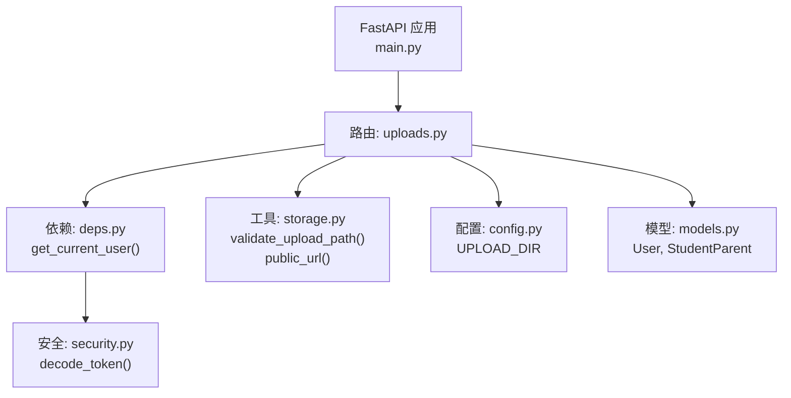
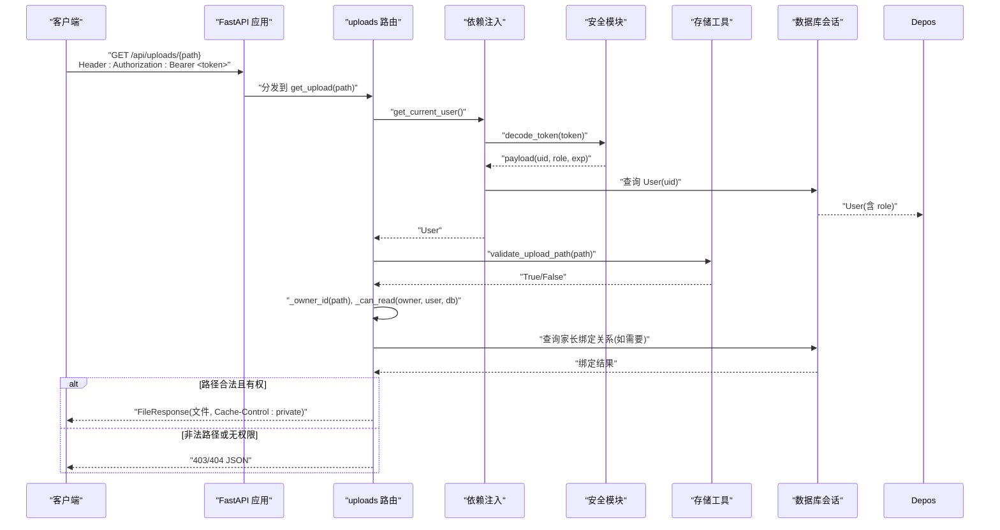
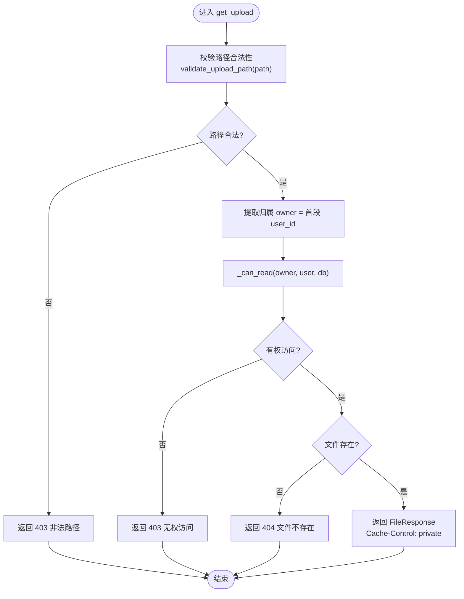
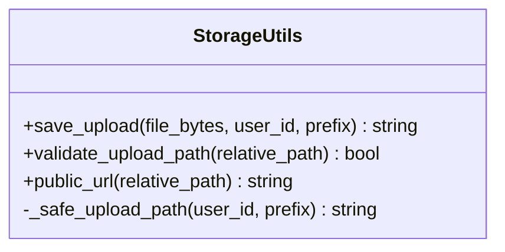
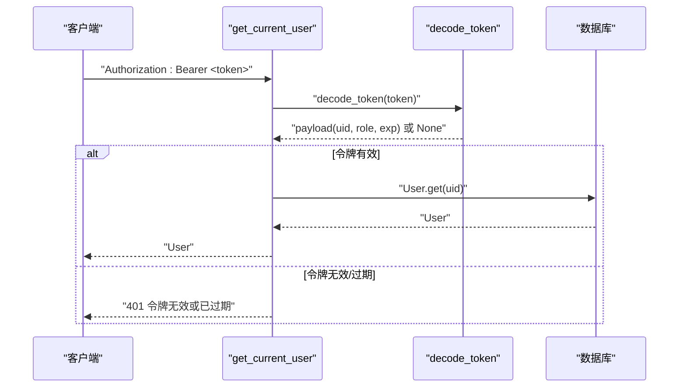
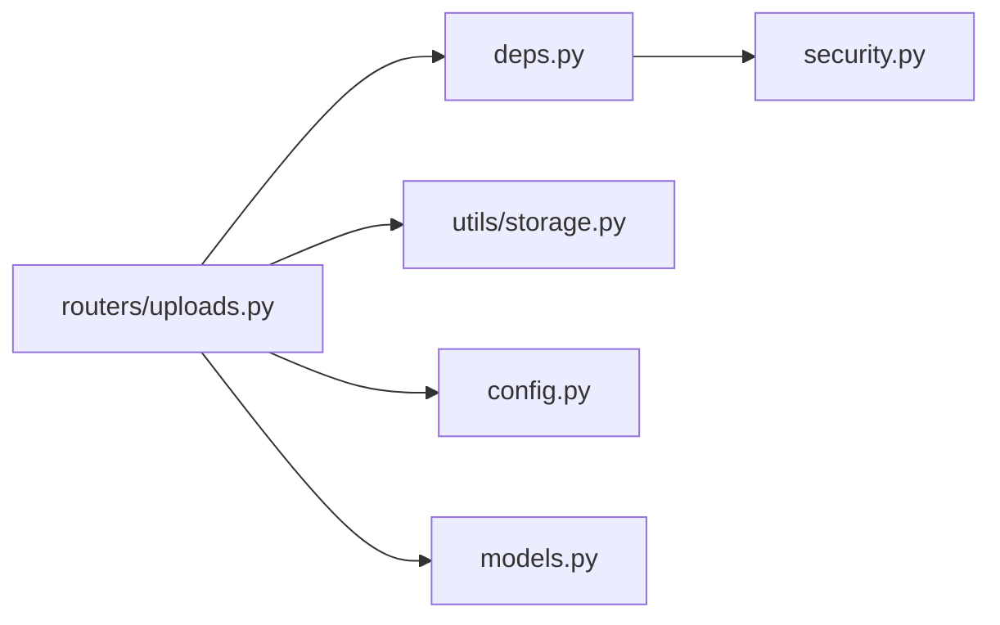

# 文件上传认证接口

<cite>
**本文引用的文件**
- [uploads.py](file://summer-homework-checkin/backend/app/routers/uploads.py)
- [storage.py](file://summer-homework-checkin/backend/app/utils/storage.py)
- [security.py](file://summer-homework-checkin/backend/app/security.py)
- [deps.py](file://summer-homework-checkin/backend/app/deps.py)
- [config.py](file://summer-homework-checkin/backend/app/config.py)
- [main.py](file://summer-homework-checkin/backend/app/main.py)
- [models.py](file://summer-homework-checkin/backend/app/models.py)
</cite>

## 目录
1. [简介](#简介)
2. [项目结构](#项目结构)
3. [核心组件](#核心组件)
4. [架构总览](#架构总览)
5. [详细组件分析](#详细组件分析)
6. [依赖关系分析](#依赖关系分析)
7. [性能与安全性考量](#性能与安全性考量)
8. [故障排查指南](#故障排查指南)
9. [结论](#结论)

## 简介
本文件聚焦“暑假作业打卡系统”后端中的“文件上传认证接口”，说明其设计目标、访问控制策略、数据流与安全机制。该接口替代了原先公开挂载的静态上传目录，通过鉴权后下载的方式，防止人脸照片等敏感资源被遍历或越权访问。

## 项目结构
围绕文件上传认证的核心代码分布在以下模块：
- 路由层：定义受保护的上传文件读取接口
- 存储工具：生成安全路径、校验路径、构造公开 URL
- 安全模块：令牌签发/校验、密码哈希、生物特征加密
- 依赖注入：从请求头解析并校验 Bearer Token，获取当前用户
- 配置：上传目录、CORS、密钥、过期时间等
- 应用入口：注册路由、中间件、静态资源挂载
- 数据模型：用户角色、家长绑定关系等，用于权限判定

图表来源
- [main.py:37-50](file://summer-homework-checkin/backend/app/main.py#L37-L50)
- [uploads.py:1-55](file://summer-homework-checkin/backend/app/routers/uploads.py#L1-L55)
- [deps.py:1-34](file://summer-homework-checkin/backend/app/deps.py#L1-L34)
- [storage.py:1-44](file://summer-homework-checkin/backend/app/utils/storage.py#L1-L44)
- [config.py:1-123](file://summer-homework-checkin/backend/app/config.py#L1-L123)
- [models.py:13-70](file://summer-homework-checkin/backend/app/models.py#L13-L70)

章节来源
- [main.py:37-50](file://summer-homework-checkin/backend/app/main.py#L37-L50)
- [uploads.py:1-55](file://summer-homework-checkin/backend/app/routers/uploads.py#L1-L55)

## 核心组件
- 认证下载接口：GET /api/uploads/{path:path}
  - 要求携带 Bearer Token（Authorization）
  - 校验请求路径合法性，防止路径穿越
  - 基于用户角色与绑定关系进行细粒度访问控制
  - 返回文件响应并设置私有缓存头
- 存储工具：
  - 生成安全的相对路径（按 user_id 分目录 + 随机文件名）
  - 校验相对路径是否位于允许目录内
  - 将相对路径转换为带认证的 HTTP 路径
- 安全与依赖：
  - 从请求头解析并校验 JWT-like 令牌
  - 根据 payload 中的 uid 查询用户
  - 提供角色检查能力（require_role）
- 配置：
  - 上传根目录 UPLOAD_DIR（支持环境变量覆盖）
  - 令牌有效期 TOKEN_EXPIRE_DAYS
  - CORS 白名单与方法/头部限制

章节来源
- [uploads.py:16-55](file://summer-homework-checkin/backend/app/routers/uploads.py#L16-L55)
- [storage.py:7-44](file://summer-homework-checkin/backend/app/utils/storage.py#L7-L44)
- [deps.py:10-34](file://summer-homework-checkin/backend/app/deps.py#L10-L34)
- [config.py:8-12](file://summer-homework-checkin/backend/app/config.py#L8-L12)
- [config.py:68-84](file://summer-homework-checkin/backend/app/config.py#L68-L84)

## 架构总览
下图展示了客户端请求到文件响应的完整流程，包括鉴权、路径校验、权限判定与文件返回。

图表来源
- [main.py:37-50](file://summer-homework-checkin/backend/app/main.py#L37-L50)
- [uploads.py:37-55](file://summer-homework-checkin/backend/app/routers/uploads.py#L37-L55)
- [deps.py:13-25](file://summer-homework-checkin/backend/app/deps.py#L13-L25)
- [security.py:27-53](file://summer-homework-checkin/backend/app/security.py#L27-L53)
- [storage.py:28-44](file://summer-homework-checkin/backend/app/utils/storage.py#L28-L44)
- [models.py:13-70](file://summer-homework-checkin/backend/app/models.py#L13-L70)

## 详细组件分析

### 认证下载接口 GET /api/uploads/{path}
- 功能
  - 接收相对路径 path（例如 "12/xxx.jpg"），在认证通过后返回对应文件
  - 设置私有缓存头，避免浏览器/CDN 缓存敏感文件
- 安全要点
  - 必须携带有效的 Bearer Token，否则返回 401
  - 使用 validate_upload_path 校验路径，拒绝包含 ".." 或以 "/" 开头的路径，确保最终解析路径位于 UPLOAD_DIR 下
  - 基于用户角色与绑定关系进行访问控制：
    - 管理员：可访问任意文件
    - 学生：仅能访问自己 user_id 目录下的文件
    - 家长：仅能访问已绑定孩子的文件（通过 StudentParent 表查询）
  - 若文件不存在，返回 404

图表来源
- [uploads.py:37-55](file://summer-homework-checkin/backend/app/routers/uploads.py#L37-L55)
- [storage.py:28-36](file://summer-homework-checkin/backend/app/utils/storage.py#L28-L36)

章节来源
- [uploads.py:16-55](file://summer-homework-checkin/backend/app/routers/uploads.py#L16-L55)

### 存储工具 storage.py
- 安全路径生成
  - 以 user_id 为根目录创建子目录，确保每个用户的文件隔离
  - 文件名采用前缀 + UUID + 固定扩展名，避免命名冲突与猜测
  - 使用 realpath 校验生成的路径确实在 UPLOAD_DIR 之下，防止路径穿越
- 路径校验
  - 禁止 ".." 和以 "/" 开头，确保相对路径安全
  - 再次用 realpath 比对，确保最终路径位于 UPLOAD_DIR
- 公开 URL 转换
  - 将相对路径转换为 "/api/uploads/..." 形式，强制走认证接口

图表来源
- [storage.py:7-44](file://summer-homework-checkin/backend/app/utils/storage.py#L7-L44)

章节来源
- [storage.py:7-44](file://summer-homework-checkin/backend/app/utils/storage.py#L7-L44)

### 安全与依赖 deps.py / security.py
- 依赖注入 get_current_user
  - 从请求头解析 Bearer Token
  - 调用 decode_token 校验签名与过期时间
  - 根据 uid 查询用户对象，未找到则返回 401
- 安全模块
  - create_token/decode_token：基于 HMAC 签名的无状态令牌，包含 uid、role、exp
  - hash_password/verify_password：PBKDF2 加盐哈希，防暴力破解
  - 人脸特征向量加密/解密：AES-GCM/CTR 兼容旧格式，保证机密性与完整性

图表来源
- [deps.py:13-25](file://summer-homework-checkin/backend/app/deps.py#L13-L25)
- [security.py:27-53](file://summer-homework-checkin/backend/app/security.py#L27-L53)

章节来源
- [deps.py:13-25](file://summer-homework-checkin/backend/app/deps.py#L13-L25)
- [security.py:27-53](file://summer-homework-checkin/backend/app/security.py#L27-L53)

### 配置 config.py
- 上传目录 UPLOAD_DIR：默认 backend/uploads，可通过环境变量覆盖，便于 Docker 持久化
- 令牌有效期 TOKEN_EXPIRE_DAYS：默认 7 天，缩短风险窗口
- CORS 白名单：生产环境建议严格限定域名与方法/头部
- 其他：最小/最大图片大小、地理阈值、人脸识别参数等

章节来源
- [config.py:8-12](file://summer-homework-checkin/backend/app/config.py#L8-L12)
- [config.py:68-84](file://summer-homework-checkin/backend/app/config.py#L68-L84)

### 应用入口 main.py
- 注册所有路由，包括 uploads.router
- 添加 CORS 中间件与安全响应头（X-Frame-Options、CSP 等）
- 挂载前端静态资源（admin、student）
- 健康检查与健康探针

章节来源
- [main.py:37-50](file://summer-homework-checkin/backend/app/main.py#L37-L50)
- [main.py:53-89](file://summer-homework-checkin/backend/app/main.py#L53-L89)

## 依赖关系分析
- 路由层对依赖注入与安全模块的耦合度较高，但职责清晰：路由负责业务逻辑与权限判定，依赖注入负责鉴权，安全模块负责令牌与加密
- 存储工具与路由解耦良好，仅暴露通用方法供多处复用
- 模型层提供用户角色与家长绑定关系，支撑细粒度权限控制
- 配置集中管理，便于环境与部署差异处理

图表来源
- [uploads.py:1-55](file://summer-homework-checkin/backend/app/routers/uploads.py#L1-L55)
- [deps.py:1-34](file://summer-homework-checkin/backend/app/deps.py#L1-L34)
- [storage.py:1-44](file://summer-homework-checkin/backend/app/utils/storage.py#L1-L44)
- [config.py:1-123](file://summer-homework-checkin/backend/app/config.py#L1-L123)
- [models.py:13-70](file://summer-homework-checkin/backend/app/models.py#L13-L70)
- [security.py:27-53](file://summer-homework-checkin/backend/app/security.py#L27-L53)

章节来源
- [uploads.py:1-55](file://summer-homework-checkin/backend/app/routers/uploads.py#L1-L55)
- [deps.py:1-34](file://summer-homework-checkin/backend/app/deps.py#L1-L34)
- [storage.py:1-44](file://summer-homework-checkin/backend/app/utils/storage.py#L1-L44)
- [config.py:1-123](file://summer-homework-checkin/backend/app/config.py#L1-L123)
- [models.py:13-70](file://summer-homework-checkin/backend/app/models.py#L13-L70)
- [security.py:27-53](file://summer-homework-checkin/backend/app/security.py#L27-L53)

## 性能与安全性考量
- 性能
  - 文件读取直接返回本地文件，避免额外序列化开销
  - 设置私有缓存头，减少重复请求对服务器的压力
  - 路径校验与数据库查询仅在必要时执行，保持低开销
- 安全性
  - 路径穿越防护：双重校验（字符串规则 + realpath）
  - 细粒度权限控制：管理员/学生/家长不同策略，家长需绑定孩子
  - 令牌安全：HMAC 签名、过期时间、弱密钥检测与字符多样性检查
  - 生物特征数据加密：AES-GCM/CTR 兼容旧格式，保证机密性与完整性
  - 安全响应头：防点击劫持、MIME 嗅探、XSS、CSP、Referrer-Policy、Permissions-Policy

章节来源
- [config.py:24-66](file://summer-homework-checkin/backend/app/config.py#L24-L66)
- [security.py:11-24](file://summer-homework-checkin/backend/app/security.py#L11-L24)
- [security.py:58-104](file://summer-homework-checkin/backend/app/security.py#L58-L104)
- [main.py:64-89](file://summer-homework-checkin/backend/app/main.py#L64-L89)

## 故障排查指南
- 401 未提供认证令牌/令牌无效或已过期
  - 检查请求头是否包含 Authorization: Bearer <token>
  - 确认 token 未过期且由服务端签发
  - 参考：[deps.py:13-25](file://summer-homework-checkin/backend/app/deps.py#L13-L25)、[security.py:27-53](file://summer-homework-checkin/backend/app/security.py#L27-L53)
- 403 非法的文件路径/无权访问该文件
  - 检查 path 是否包含 ".." 或以 "/" 开头
  - 确认最终解析路径位于 UPLOAD_DIR
  - 家长角色需先绑定孩子；学生只能访问自己的 user_id 目录
  - 参考：[uploads.py:44-48](file://summer-homework-checkin/backend/app/routers/uploads.py#L44-L48)、[storage.py:28-36](file://summer-homework-checkin/backend/app/utils/storage.py#L28-L36)
- 404 文件不存在
  - 确认相对路径正确且文件确实存在于 UPLOAD_DIR
  - 参考：[uploads.py:50-52](file://summer-homework-checkin/backend/app/routers/uploads.py#L50-L52)
- 前端无法加载页面或跨域失败
  - 检查 ALLOWED_ORIGINS、ALLOWED_METHODS、ALLOWED_HEADERS 配置
  - 参考：[config.py:78-84](file://summer-homework-checkin/backend/app/config.py#L78-L84)

章节来源
- [deps.py:13-25](file://summer-homework-checkin/backend/app/deps.py#L13-L25)
- [security.py:27-53](file://summer-homework-checkin/backend/app/security.py#L27-L53)
- [uploads.py:44-52](file://summer-homework-checkin/backend/app/routers/uploads.py#L44-L52)
- [storage.py:28-36](file://summer-homework-checkin/backend/app/utils/storage.py#L28-L36)
- [config.py:78-84](file://summer-homework-checkin/backend/app/config.py#L78-L84)

## 结论
该文件上传认证接口通过“认证+路径校验+细粒度权限控制”的组合策略，有效保护了用户上传的敏感文件（尤其是人脸照片）。整体设计遵循最小权限原则，结合安全响应头与令牌机制，兼顾了可用性与安全性。建议在部署时严格配置 SECRET、TOKEN_EXPIRE_DAYS、ALLOWED_ORIGINS 等关键参数，并定期审计日志与权限策略，持续降低安全风险。