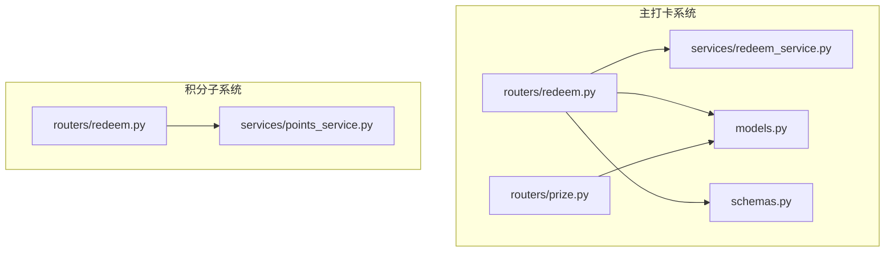
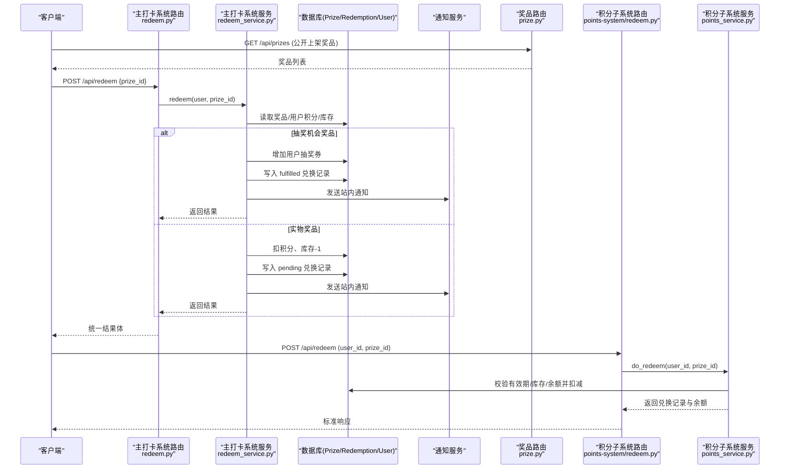
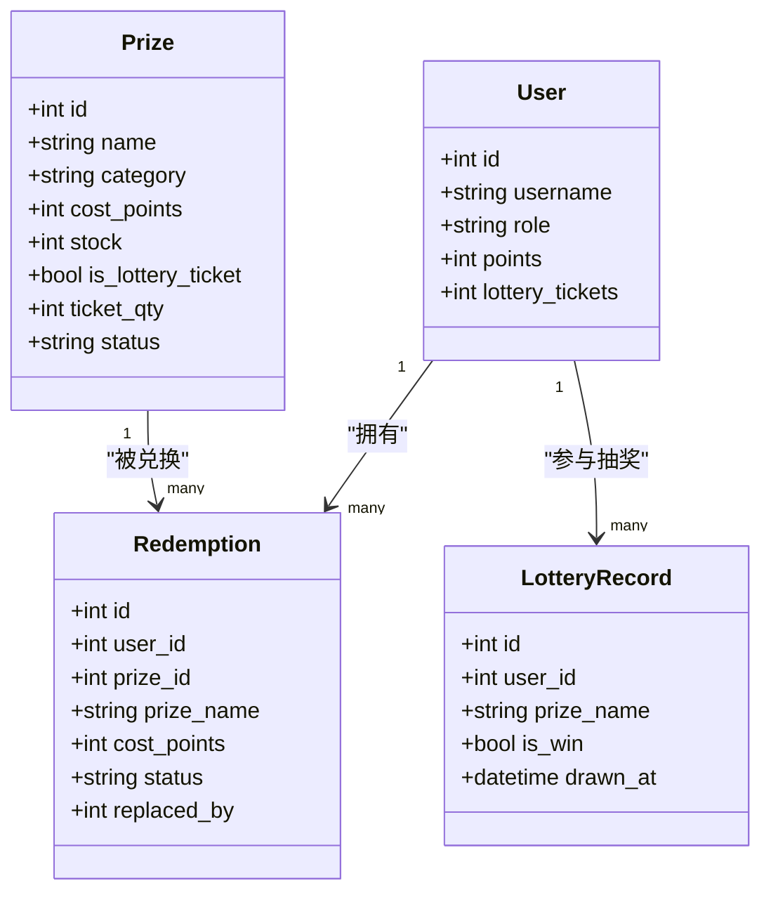
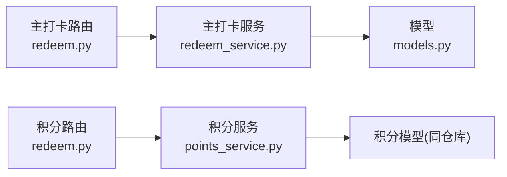

# 兑换业务接口

<cite>
**本文引用的文件列表**
- [summer-homework-checkin/backend/app/routers/redeem.py](file://summer-homework-checkin/backend/app/routers/redeem.py)
- [summer-homework-checkin/backend/app/services/redeem_service.py](file://summer-homework-checkin/backend/app/services/redeem_service.py)
- [summer-homework-checkin/backend/app/models.py](file://summer-homework-checkin/backend/app/models.py)
- [summer-homework-checkin/backend/app/schemas.py](file://summer-homework-checkin/backend/app/schemas.py)
- [summer-homework-checkin/backend/app/routers/prize.py](file://summer-homework-checkin/backend/app/routers/prize.py)
- [points-system/backend/app/routers/redeem.py](file://points-system/backend/app/routers/redeem.py)
- [points-system/backend/app/services/points_service.py](file://points-system/backend/app/services/points_service.py)
</cite>

## 目录
1. [简介](#简介)
2. [项目结构](#项目结构)
3. [核心组件](#核心组件)
4. [架构总览](#架构总览)
5. [详细组件分析](#详细组件分析)
6. [依赖关系分析](#依赖关系分析)
7. [性能与一致性](#性能与一致性)
8. [故障排查指南](#故障排查指南)
9. [结论](#结论)
10. [附录：API 定义与示例](#附录api-定义与示例)

## 简介
本文件为“兑换业务”的完整 API 文档，覆盖以下能力：
- 商品查询：支持按类别、价格范围、库存状态筛选可兑换商品。
- 兑换下单：包含积分余额检查、库存扣减（或虚拟奖品发放）、订单创建与通知流程。
- 兑换记录查询：支持按用户、时间范围、状态筛选历史记录。
- 业务流程示例：从商品选择到订单完成的端到端流程。
- 库存管理策略、事务处理机制与数据一致性保证。
- 与主打卡系统的积分同步机制与异常处理方案。

## 项目结构
本项目包含两个相关后端模块：
- summer-homework-checkin：主打卡系统，提供面向学生/家长的积分商城与兑换服务。
- points-system：独立的积分子系统，提供通用积分账户与兑换逻辑。

图表来源
- [summer-homework-checkin/backend/app/routers/redeem.py:1-81](file://summer-homework-checkin/backend/app/routers/redeem.py#L1-L81)
- [summer-homework-checkin/backend/app/services/redeem_service.py:1-168](file://summer-homework-checkin/backend/app/services/redeem_service.py#L1-L168)
- [summer-homework-checkin/backend/app/models.py:103-161](file://summer-homework-checkin/backend/app/models.py#L103-L161)
- [summer-homework-checkin/backend/app/schemas.py:184-213](file://summer-homework-checkin/backend/app/schemas.py#L184-L213)
- [summer-homework-checkin/backend/app/routers/prize.py:1-66](file://summer-homework-checkin/backend/app/routers/prize.py#L1-L66)
- [points-system/backend/app/routers/redeem.py:1-52](file://points-system/backend/app/routers/redeem.py#L1-L52)
- [points-system/backend/app/services/points_service.py:1-146](file://points-system/backend/app/services/points_service.py#L1-L146)

章节来源
- [summer-homework-checkin/backend/app/routers/redeem.py:1-81](file://summer-homework-checkin/backend/app/routers/redeem.py#L1-L81)
- [summer-homework-checkin/backend/app/services/redeem_service.py:1-168](file://summer-homework-checkin/backend/app/services/redeem_service.py#L1-L168)
- [summer-homework-checkin/backend/app/models.py:103-161](file://summer-homework-checkin/backend/app/models.py#L103-L161)
- [summer-homework-checkin/backend/app/schemas.py:184-213](file://summer-homework-checkin/backend/app/schemas.py#L184-L213)
- [summer-homework-checkin/backend/app/routers/prize.py:1-66](file://summer-homework-checkin/backend/app/routers/prize.py#L1-L66)
- [points-system/backend/app/routers/redeem.py:1-52](file://points-system/backend/app/routers/redeem.py#L1-L52)
- [points-system/backend/app/services/points_service.py:1-146](file://points-system/backend/app/services/points_service.py#L1-L146)

## 核心组件
- 路由层
  - 主打卡系统：提供聚合页面 mall、兑换 redeem、替换 replace_redeem 等接口。
  - 积分子系统：提供通用兑换与记录查询接口。
- 服务层
  - 主打卡系统：实现兑换核心逻辑（含抽奖券发放、库存扣减、通知）。
  - 积分子系统：实现基于独立积分账户的兑换逻辑（含流水记录）。
- 模型与模式
  - 用户、奖品、兑换记录、抽奖记录、通知等实体定义。
  - 请求/响应 Pydantic 模型用于参数校验与返回封装。

章节来源
- [summer-homework-checkin/backend/app/routers/redeem.py:1-81](file://summer-homework-checkin/backend/app/routers/redeem.py#L1-L81)
- [summer-homework-checkin/backend/app/services/redeem_service.py:1-168](file://summer-homework-checkin/backend/app/services/redeem_service.py#L1-L168)
- [summer-homework-checkin/backend/app/models.py:103-161](file://summer-homework-checkin/backend/app/models.py#L103-L161)
- [summer-homework-checkin/backend/app/schemas.py:184-213](file://summer-homework-checkin/backend/app/schemas.py#L184-L213)
- [points-system/backend/app/routers/redeem.py:1-52](file://points-system/backend/app/routers/redeem.py#L1-L52)
- [points-system/backend/app/services/points_service.py:1-146](file://points-system/backend/app/services/points_service.py#L1-L146)

## 架构总览
下图展示主打卡系统中“商品查询—兑换—记录查询”的整体交互路径，以及积分子系统提供的通用兑换能力。

图表来源
- [summer-homework-checkin/backend/app/routers/redeem.py:24-69](file://summer-homework-checkin/backend/app/routers/redeem.py#L24-L69)
- [summer-homework-checkin/backend/app/services/redeem_service.py:22-94](file://summer-homework-checkin/backend/app/services/redeem_service.py#L22-L94)
- [summer-homework-checkin/backend/app/routers/prize.py:12-16](file://summer-homework-checkin/backend/app/routers/prize.py#L12-L16)
- [points-system/backend/app/routers/redeem.py:11-28](file://points-system/backend/app/routers/redeem.py#L11-L28)
- [points-system/backend/app/services/points_service.py:94-145](file://points-system/backend/app/services/points_service.py#L94-L145)

## 详细组件分析

### 商品查询接口
- 公开接口
  - 获取上架奖品列表：GET /api/prizes
  - 说明：仅返回 status=on 的奖品，便于前端渲染商城。
- 管理接口
  - 获取全部奖品：GET /api/admin/prizes（需管理员权限）
  - 新增/更新/删除奖品：POST/PUT/DELETE /api/admin/prizes/{id}
- 筛选建议
  - 类别：category ∈ {"stationery","outdoor","interest"}
  - 价格范围：cost_points 区间过滤
  - 库存状态：stock > 0 或 stock == -1（不限量）
  - 注意：当前公开接口未内置筛选参数，可在网关或前端进行二次过滤；如需服务端筛选，建议在路由层扩展 Query 参数。

章节来源
- [summer-homework-checkin/backend/app/routers/prize.py:12-22](file://summer-homework-checkin/backend/app/routers/prize.py#L12-L22)
- [summer-homework-checkin/backend/app/models.py:103-124](file://summer-homework-checkin/backend/app/models.py#L103-L124)

### 兑换下单接口（主打卡系统）
- 接口
  - POST /api/redeem
  - 请求体：{ "prize_id": int }
  - 响应体：统一结果体 RedeemResult，包含 redemption、balance、lottery_tickets、is_lottery_ticket、message
- 前置条件
  - 用户角色必须为学生或家长
  - 奖品存在且上架、成本积分>0
  - 实物奖品库存>0；抽奖券奖品无库存限制
  - 用户积分余额足够
- 处理流程
  - 校验奖品与库存
  - 校验用户积分
  - 若为抽奖券：直接增加用户抽奖券数量，写入 fulfilled 状态的兑换记录
  - 若为实物：扣积分、库存-1，写入 pending 状态的兑换记录
  - 发送站内通知
- 错误码
  - 403：非学生/家长
  - 404：奖品不存在
  - 400：奖品下架/不支持积分兑换/库存不足/积分不足
- 幂等性
  - 同一请求重复提交会重复扣积分与库存，需在调用方做防抖或去重

章节来源
- [summer-homework-checkin/backend/app/routers/redeem.py:48-69](file://summer-homework-checkin/backend/app/routers/redeem.py#L48-L69)
- [summer-homework-checkin/backend/app/services/redeem_service.py:22-94](file://summer-homework-checkin/backend/app/services/redeem_service.py#L22-L94)
- [summer-homework-checkin/backend/app/schemas.py:184-213](file://summer-homework-checkin/backend/app/schemas.py#L184-L213)

### 兑换记录查询接口（主打卡系统）
- 聚合页面
  - GET /api/mall
  - 返回：用户积分、抽奖券、可兑换奖品、我的兑换记录、抽奖记录
- 个人兑换记录
  - 通过 /api/mall 中的 redemptions 字段获取当前用户的兑换历史
  - 可按前端侧对返回数据进行时间范围与状态筛选
- 备注
  - 当前未提供按用户ID、时间范围、状态的服务端筛选参数；如需服务端筛选，可在路由层扩展 Query 参数并在服务层实现过滤

章节来源
- [summer-homework-checkin/backend/app/routers/redeem.py:24-45](file://summer-homework-checkin/backend/app/routers/redeem.py#L24-L45)
- [summer-homework-checkin/backend/app/services/redeem_service.py:15-19](file://summer-homework-checkin/backend/app/services/redeem_service.py#L15-L19)
- [summer-homework-checkin/backend/app/schemas.py:207-213](file://summer-homework-checkin/backend/app/schemas.py#L207-L213)

### 兑换记录查询接口（积分子系统）
- 接口
  - GET /api/redemptions?user_id={int}
  - 返回：指定用户的兑换记录列表
- 说明
  - 该接口属于独立的积分子系统，适用于需要集中查询积分消费历史的场景

章节来源
- [points-system/backend/app/routers/redeem.py:31-51](file://points-system/backend/app/routers/redeem.py#L31-L51)

### 兑换替换接口（主打卡系统）
- 接口
  - POST /api/redeem/{rid}/replace
  - 请求体：{ "new_prize_id": int }
  - 行为：将原兑换替换为新奖品，退还原消耗积分，补差价，回滚原库存并扣新库存，原记录标记 replaced，新记录 pending
- 约束
  - 原记录不可为 replaced/cancelled
  - 新奖品需上架且库存充足
  - 用户积分需满足新奖品成本

章节来源
- [summer-homework-checkin/backend/app/routers/redeem.py:72-80](file://summer-homework-checkin/backend/app/routers/redeem.py#L72-L80)
- [summer-homework-checkin/backend/app/services/redeem_service.py:97-167](file://summer-homework-checkin/backend/app/services/redeem_service.py#L97-L167)

### 数据模型与关系

图表来源
- [summer-homework-checkin/backend/app/models.py:11-55](file://summer-homework-checkin/backend/app/models.py#L11-L55)
- [summer-homework-checkin/backend/app/models.py:103-161](file://summer-homework-checkin/backend/app/models.py#L103-L161)

## 依赖关系分析
- 路由层依赖服务层完成业务编排，服务层访问模型并通过 SQLAlchemy Session 操作数据库。
- 主打卡系统与积分子系统各自维护独立的兑换逻辑与数据表，二者在功能上互补：前者侧重学生端体验与通知，后者提供通用积分账户与流水。

图表来源
- [summer-homework-checkin/backend/app/routers/redeem.py:1-81](file://summer-homework-checkin/backend/app/routers/redeem.py#L1-L81)
- [summer-homework-checkin/backend/app/services/redeem_service.py:1-168](file://summer-homework-checkin/backend/app/services/redeem_service.py#L1-L168)
- [points-system/backend/app/routers/redeem.py:1-52](file://points-system/backend/app/routers/redeem.py#L1-L52)
- [points-system/backend/app/services/points_service.py:1-146](file://points-system/backend/app/services/points_service.py#L1-L146)

## 性能与一致性
- 事务与一致性
  - 主打卡系统：在同一会话中执行积分扣减、库存变更与记录写入，随后 commit；异常时由框架回滚，避免半更新。
  - 积分子系统：明确注释强调“读-改-写”在同一事务内完成，使用 IntegrityError 兜底并发冲突。
- 并发控制
  - SQLite 行锁有限，依赖单事务原子性与唯一约束兜底；如迁移至 PostgreSQL，可对关键行加悲观锁提升强一致。
- 性能优化建议
  - 商品列表缓存：对热门奖品列表引入 Redis 缓存，设置合理过期时间。
  - 读写分离：读多写少场景下，可将查询路由到只读副本。
  - 批量操作：后台报表与导出采用分批查询，避免一次性加载大量数据。

章节来源
- [summer-homework-checkin/backend/app/services/redeem_service.py:22-94](file://summer-homework-checkin/backend/app/services/redeem_service.py#L22-L94)
- [points-system/backend/app/services/points_service.py:94-145](file://points-system/backend/app/services/points_service.py#L94-L145)

## 故障排查指南
- 常见错误
  - 403：非学生/家长尝试兑换
  - 404：奖品不存在或用户不存在（积分子系统）
  - 400：奖品下架/不支持积分兑换/库存不足/积分不足
  - 409：库存不足（积分子系统）
- 定位步骤
  - 核对请求 prize_id 是否存在且上架
  - 检查用户积分余额是否足够
  - 查看兑换记录状态是否为 pending/fulfilled/replaced
  - 确认通知是否成功投递（站内通知）
- 日志与监控
  - 在路由与服务层添加结构化日志，记录关键变量（用户ID、奖品ID、积分变化、库存变化）
  - 对异常分支进行告警，尤其是库存与积分不一致的情况

章节来源
- [summer-homework-checkin/backend/app/routers/redeem.py:48-80](file://summer-homework-checkin/backend/app/routers/redeem.py#L48-L80)
- [summer-homework-checkin/backend/app/services/redeem_service.py:22-167](file://summer-homework-checkin/backend/app/services/redeem_service.py#L22-L167)
- [points-system/backend/app/routers/redeem.py:11-51](file://points-system/backend/app/routers/redeem.py#L11-L51)
- [points-system/backend/app/services/points_service.py:94-145](file://points-system/backend/app/services/points_service.py#L94-L145)

## 结论
- 主打卡系统提供了完整的兑换体验：商品展示、兑换下单、记录查询与替换，同时兼顾了抽奖券的自动化发放与通知。
- 积分子系统提供了通用的积分账户与兑换能力，适合跨业务复用。
- 通过事务与约束保障数据一致性，结合缓存与读写分离可进一步提升性能。
- 建议在前端或服务端增加筛选参数以增强商品与记录的查询灵活性。

## 附录：API 定义与示例

### 商品查询
- GET /api/prizes
  - 描述：获取上架奖品列表
  - 返回：PrizeOut 数组
- GET /api/admin/prizes
  - 描述：获取全部奖品（管理员）
  - 返回：PrizeOut 数组
- 筛选建议
  - 类别：stationery/outdoor/interest
  - 价格范围：cost_points 区间
  - 库存状态：stock > 0 或 stock == -1

章节来源
- [summer-homework-checkin/backend/app/routers/prize.py:12-22](file://summer-homework-checkin/backend/app/routers/prize.py#L12-L22)
- [summer-homework-checkin/backend/app/schemas.py:124-138](file://summer-homework-checkin/backend/app/schemas.py#L124-L138)

### 兑换下单
- POST /api/redeem
  - 请求体：{ "prize_id": int }
  - 返回：RedeemResult
    - redemption：RedemptionOut | null
    - balance：int
    - lottery_tickets：int
    - is_lottery_ticket：bool
    - message：string
- 错误码
  - 403/404/400 见上文

章节来源
- [summer-homework-checkin/backend/app/routers/redeem.py:48-69](file://summer-homework-checkin/backend/app/routers/redeem.py#L48-L69)
- [summer-homework-checkin/backend/app/schemas.py:184-213](file://summer-homework-checkin/backend/app/schemas.py#L184-L213)

### 兑换记录查询
- GET /api/mall
  - 返回：MallOut
    - points：int
    - lottery_tickets：int
    - prizes：list
    - redemptions：list[RedemptionOut]
    - lottery_records：list
- GET /api/redemptions?user_id={int}（积分子系统）
  - 返回：list[RedemptionOut]

章节来源
- [summer-homework-checkin/backend/app/routers/redeem.py:24-45](file://summer-homework-checkin/backend/app/routers/redeem.py#L24-L45)
- [summer-homework-checkin/backend/app/schemas.py:207-213](file://summer-homework-checkin/backend/app/schemas.py#L207-L213)
- [points-system/backend/app/routers/redeem.py:31-51](file://points-system/backend/app/routers/redeem.py#L31-L51)

### 兑换替换
- POST /api/redeem/{rid}/replace
  - 请求体：{ "new_prize_id": int }
  - 返回：RedemptionOut

章节来源
- [summer-homework-checkin/backend/app/routers/redeem.py:72-80](file://summer-homework-checkin/backend/app/routers/redeem.py#L72-L80)
- [summer-homework-checkin/backend/app/services/redeem_service.py:97-167](file://summer-homework-checkin/backend/app/services/redeem_service.py#L97-L167)

### 业务流程示例（端到端）
- 步骤
  1) 获取商品列表：GET /api/prizes
  2) 选择目标商品（注意类别、价格、库存）
  3) 发起兑换：POST /api/redeem { "prize_id": 所选ID }
  4) 查看结果：根据 is_lottery_ticket 判断是获得抽奖券还是生成待发放订单
  5) 查询记录：GET /api/mall 查看 redemptions 与 lottery_records
  6) 如需替换：POST /api/redeem/{rid}/replace { "new_prize_id": 新奖品ID }
- 注意事项
  - 防重复提交：前端应禁用按钮直至收到响应
  - 库存竞争：高并发场景可能出现库存不足，需提示重试
  - 通知：兑换成功后会推送站内通知，可在前端展示

章节来源
- [summer-homework-checkin/backend/app/routers/redeem.py:24-80](file://summer-homework-checkin/backend/app/routers/redeem.py#L24-L80)
- [summer-homework-checkin/backend/app/services/redeem_service.py:22-167](file://summer-homework-checkin/backend/app/services/redeem_service.py#L22-L167)

### 库存管理与事务机制
- 库存策略
  - 实物奖品：库存-1，库存不足则拒绝兑换
  - 抽奖券奖品：不扣库存，直接增加用户抽奖券数量
- 事务机制
  - 主打卡系统：在同一次会话中完成积分扣减、库存变更与记录写入，commit 后刷新对象
  - 积分子系统：在单一事务内完成余额与库存扣减，并写入流水；捕获 IntegrityError 进行并发兜底

章节来源
- [summer-homework-checkin/backend/app/services/redeem_service.py:22-94](file://summer-homework-checkin/backend/app/services/redeem_service.py#L22-L94)
- [points-system/backend/app/services/points_service.py:94-145](file://points-system/backend/app/services/points_service.py#L94-L145)

### 与主打卡系统的积分同步与异常处理
- 积分来源
  - 主打卡系统用户表包含 points 字段，由打卡服务维护；兑换时直接扣减该字段
- 同步机制
  - 主打卡系统内部闭环：打卡→累计积分→兑换扣积分，无需跨系统同步
  - 积分子系统提供独立账户体系，适用于其他业务复用
- 异常处理
  - 主打卡系统：抛出 HTTPException 并返回具体错误信息
  - 积分子系统：捕获 IntegrityError 并转换为 409 重复打卡/库存不足等语义化错误

章节来源
- [summer-homework-checkin/backend/app/models.py:11-55](file://summer-homework-checkin/backend/app/models.py#L11-L55)
- [summer-homework-checkin/backend/app/services/redeem_service.py:22-94](file://summer-homework-checkin/backend/app/services/redeem_service.py#L22-L94)
- [points-system/backend/app/services/points_service.py:77-83](file://points-system/backend/app/services/points_service.py#L77-L83)