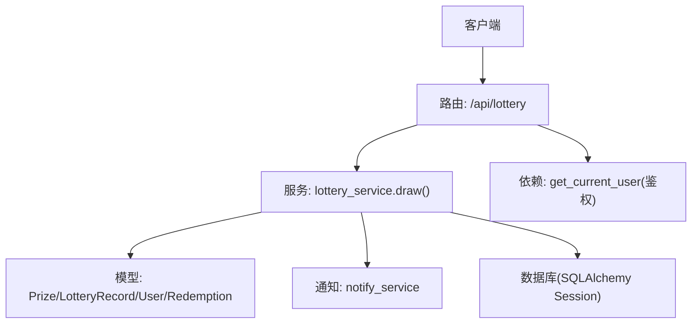
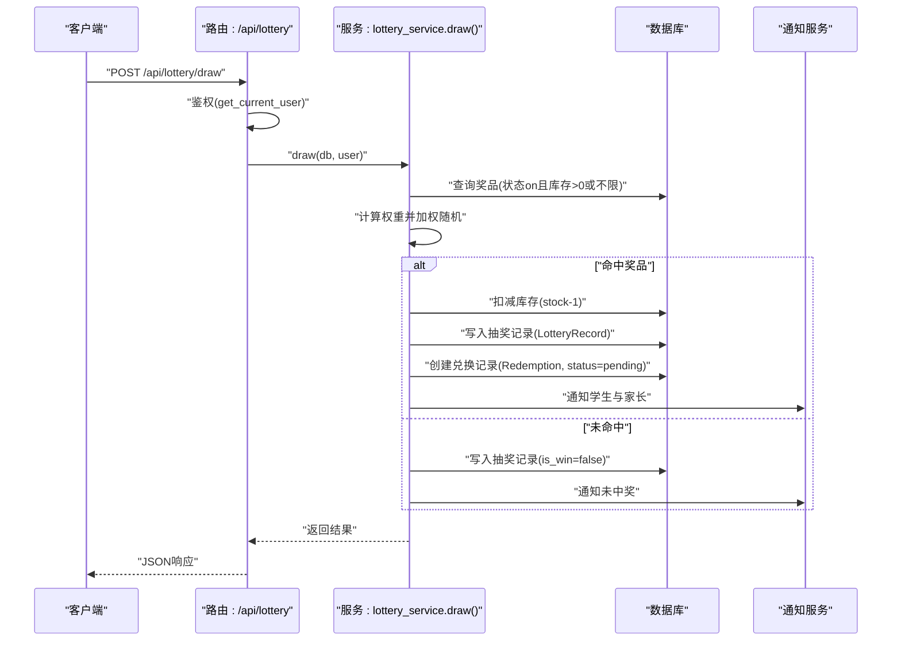
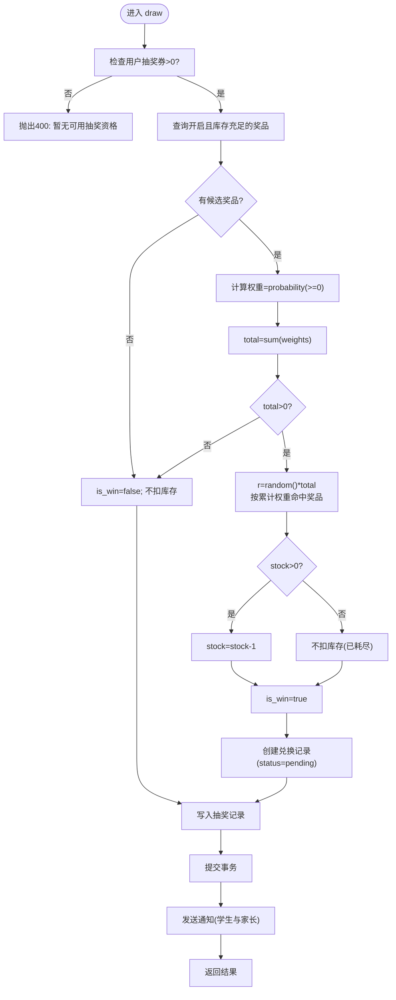
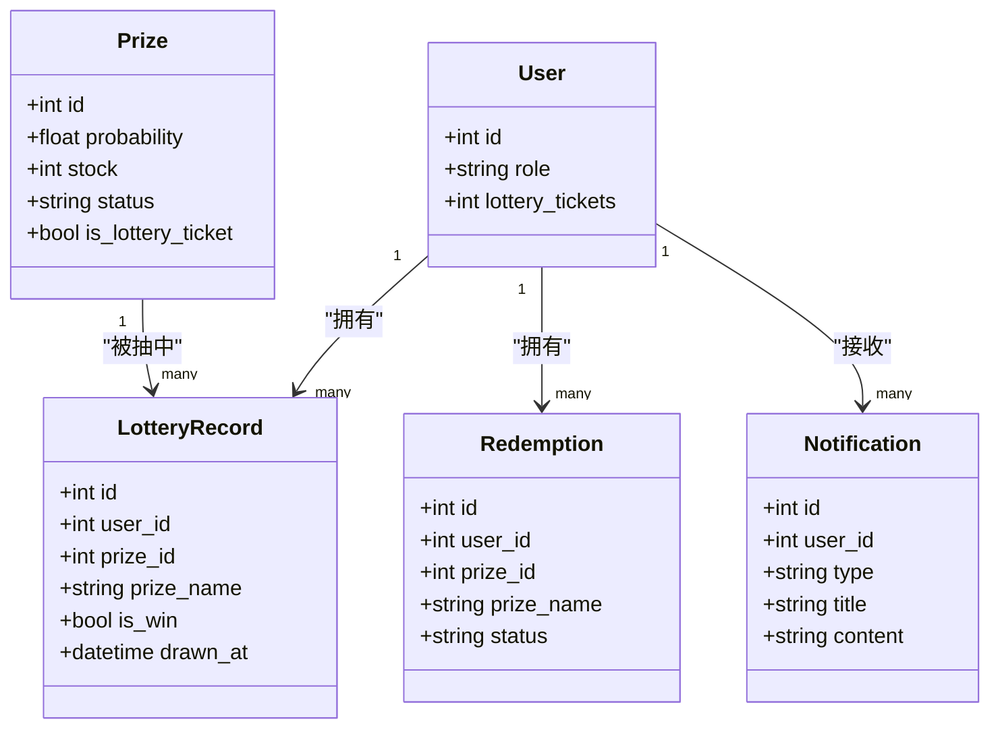

# 抽奖系统接口

<cite>
**本文引用的文件**   
- [summer-homework-checkin/backend/app/routers/lottery.py](file://summer-homework-checkin/backend/app/routers/lottery.py)
- [summer-homework-checkin/backend/app/services/lottery_service.py](file://summer-homework-checkin/backend/app/services/lottery_service.py)
- [summer-homework-checkin/backend/app/models.py](file://summer-homework-checkin/backend/app/models.py)
- [summer-homework-checkin/backend/app/schemas.py](file://summer-homework-checkin/backend/app/schemas.py)
- [summer-homework-checkin/backend/app/deps.py](file://summer-homework-checkin/backend/app/deps.py)
- [summer-homework-checkin/backend/app/config.py](file://summer-homework-checkin/backend/app/config.py)
- [summer-homework-checkin/backend/app/services/checkin_service.py](file://summer-homework-checkin/backend/app/services/checkin_service.py)
- [summer-homework-checkin/backend/app/services/notify_service.py](file://summer-homework-checkin/backend/app/services/notify_service.py)
</cite>

## 目录
1. [简介](#简介)
2. [项目结构](#项目结构)
3. [核心组件](#核心组件)
4. [架构总览](#架构总览)
5. [详细组件分析](#详细组件分析)
6. [依赖关系分析](#依赖关系分析)
7. [性能与并发控制](#性能与并发控制)
8. [防作弊机制](#防作弊机制)
9. [故障排查指南](#故障排查指南)
10. [结论](#结论)
11. [附录：API 定义](#附录api-定义)

## 简介
本文件为“暑假作业打卡”系统中的抽奖子系统接口文档，覆盖以下能力：
- 抽奖券获取：基于连续有效打卡里程碑自动发放；支持通过积分兑换奖品（当奖品类型为“抽奖机会”时等价于获得抽奖券）。
- 抽奖执行：按奖品概率权重进行加权随机抽取，扣减库存并生成记录。
- 抽奖记录查询：返回用户历史抽奖结果。
- 通知与联动：中奖后创建兑换记录、推送站内通知与学生家长通知。

## 项目结构
与抽奖相关的后端代码主要位于 summer-homework-checkin/backend/app 下，路由层、服务层、数据模型与配置分布如下：
- 路由层：/api/lottery 提供抽奖相关接口
- 服务层：抽奖业务逻辑封装在 lottery_service
- 数据模型：Prize、LotteryRecord、User、Redemption、Notification 等
- 认证依赖：get_current_user 校验令牌与角色
- 配置：LOTTERY_STREAK_THRESHOLD 等规则常量

图表来源
- [summer-homework-checkin/backend/app/routers/lottery.py:1-30](file://summer-homework-checkin/backend/app/routers/lottery.py#L1-L30)
- [summer-homework-checkin/backend/app/services/lottery_service.py:1-77](file://summer-homework-checkin/backend/app/services/lottery_service.py#L1-L77)
- [summer-homework-checkin/backend/app/deps.py:1-34](file://summer-homework-checkin/backend/app/deps.py#L1-L34)
- [summer-homework-checkin/backend/app/services/notify_service.py:1-20](file://summer-homework-checkin/backend/app/services/notify_service.py#L1-L20)

章节来源
- [summer-homework-checkin/backend/app/routers/lottery.py:1-30](file://summer-homework-checkin/backend/app/routers/lottery.py#L1-L30)
- [summer-homework-checkin/backend/app/services/lottery_service.py:1-77](file://summer-homework-checkin/backend/app/services/lottery_service.py#L1-L77)
- [summer-homework-checkin/backend/app/deps.py:1-34](file://summer-homework-checkin/backend/app/deps.py#L1-L34)
- [summer-homework-checkin/backend/app/services/notify_service.py:1-20](file://summer-homework-checkin/backend/app/services/notify_service.py#L1-L20)

## 核心组件
- 路由层
  - GET /api/lottery/tickets：返回当前用户的抽奖券数量与最近抽奖记录列表。
  - POST /api/lottery/draw：执行一次抽奖，消耗 1 张抽奖券，返回是否中奖及奖品信息。
- 服务层
  - draw(db, user)：校验资格、筛选可抽奖品、加权随机、扣库存、写记录、创建兑换记录（若中奖）、发送通知。
- 数据模型
  - User.lottery_tickets：当前可用抽奖券数
  - Prize：包含 probability、stock、status、is_lottery_ticket 等字段
  - LotteryRecord：每次抽奖行为记录
  - Redemption：中奖后创建的兑换记录（状态 pending）
  - Notification：站内通知
- 依赖与配置
  - get_current_user：JWT 鉴权与角色校验
  - LOTTERY_STREAK_THRESHOLD：连续打卡解锁阈值（用于发放抽奖券）

章节来源
- [summer-homework-checkin/backend/app/routers/lottery.py:1-30](file://summer-homework-checkin/backend/app/routers/lottery.py#L1-L30)
- [summer-homework-checkin/backend/app/services/lottery_service.py:1-77](file://summer-homework-checkin/backend/app/services/lottery_service.py#L1-L77)
- [summer-homework-checkin/backend/app/models.py:103-176](file://summer-homework-checkin/backend/app/models.py#L103-L176)
- [summer-homework-checkin/backend/app/deps.py:13-25](file://summer-homework-checkin/backend/app/deps.py#L13-L25)
- [summer-homework-checkin/backend/app/config.py:34-36](file://summer-homework-checkin/backend/app/config.py#L34-L36)

## 架构总览
下图展示了从请求到落库与通知的完整链路，以及关键的数据实体关系。

图表来源
- [summer-homework-checkin/backend/app/routers/lottery.py:25-29](file://summer-homework-checkin/backend/app/routers/lottery.py#L25-L29)
- [summer-homework-checkin/backend/app/services/lottery_service.py:9-76](file://summer-homework-checkin/backend/app/services/lottery_service.py#L9-L76)
- [summer-homework-checkin/backend/app/services/notify_service.py:5-20](file://summer-homework-checkin/backend/app/services/notify_service.py#L5-L20)

## 详细组件分析

### 接口一：获取抽奖券与抽奖记录
- 路径与方法
  - GET /api/lottery/tickets
- 鉴权与权限
  - 需要有效的 Bearer Token；仅学生角色可访问（由上层鉴权与业务共同保证）。
- 功能说明
  - 返回当前用户的抽奖券数量与最近抽奖记录列表（按时间倒序）。
- 输入参数
  - 无
- 输出字段
  - tickets：当前可用抽奖券数量
  - records：抽奖记录数组，包含 id、prize_name、is_win、drawn_at
- 错误码
  - 401：未提供或无效令牌
  - 403：非学生角色
- 示例路径参考
  - [summer-homework-checkin/backend/app/routers/lottery.py:13-22](file://summer-homework-checkin/backend/app/routers/lottery.py#L13-L22)
  - [summer-homework-checkin/backend/app/schemas.py:148-154](file://summer-homework-checkin/backend/app/schemas.py#L148-L154)

章节来源
- [summer-homework-checkin/backend/app/routers/lottery.py:13-22](file://summer-homework-checkin/backend/app/routers/lottery.py#L13-L22)
- [summer-homework-checkin/backend/app/schemas.py:148-154](file://summer-homework-checkin/backend/app/schemas.py#L148-L154)

### 接口二：执行抽奖
- 路径与方法
  - POST /api/lottery/draw
- 鉴权与权限
  - 需要有效的 Bearer Token；仅学生角色可访问。
- 功能说明
  - 校验用户是否有可用抽奖券；从“开启且库存充足”的奖品中按概率权重随机抽取；若中奖则扣库存并创建兑换记录；最后写入抽奖记录并发送通知。
- 输入参数
  - 无
- 输出字段
  - is_win：是否中奖
  - prize_name：奖品名称（未中奖为空）
  - prize_id：奖品ID（未中奖为空）
  - tickets_left：剩余抽奖券数量
  - message：提示文案
- 错误码
  - 400：无可用抽奖券
  - 403：非学生角色
  - 401：令牌无效或缺失
- 算法要点
  - 候选奖品集合：Prize.status == "on" 且 (stock == -1 或 stock > 0)
  - 权重计算：weights = max(probability, 0.0)
  - 归一化累加：r = random.random() * sum(weights)，按累计权重命中
  - 库存扣减：仅对 stock > 0 的奖品扣减
- 示例路径参考
  - [summer-homework-checkin/backend/app/routers/lottery.py:25-29](file://summer-homework-checkin/backend/app/routers/lottery.py#L25-L29)
  - [summer-homework-checkin/backend/app/services/lottery_service.py:9-76](file://summer-homework-checkin/backend/app/services/lottery_service.py#L9-L76)

图表来源
- [summer-homework-checkin/backend/app/services/lottery_service.py:9-76](file://summer-homework-checkin/backend/app/services/lottery_service.py#L9-L76)

章节来源
- [summer-homework-checkin/backend/app/routers/lottery.py:25-29](file://summer-homework-checkin/backend/app/routers/lottery.py#L25-L29)
- [summer-homework-checkin/backend/app/services/lottery_service.py:9-76](file://summer-homework-checkin/backend/app/services/lottery_service.py#L9-L76)

### 接口三：抽奖记录查询
- 路径与方法
  - GET /api/lottery/tickets（返回 records 列表）
- 筛选能力
  - 当前实现返回该用户的全部历史记录（按时间倒序），未提供按时间范围过滤的参数。
- 扩展建议
  - 可在路由层增加 start_date、end_date 参数，并在查询条件中追加 drawn_at 范围过滤。
- 示例路径参考
  - [summer-homework-checkin/backend/app/routers/lottery.py:13-22](file://summer-homework-checkin/backend/app/routers/lottery.py#L13-L22)

章节来源
- [summer-homework-checkin/backend/app/routers/lottery.py:13-22](file://summer-homework-checkin/backend/app/routers/lottery.py#L13-L22)

### 抽奖券获取机制
- 连续打卡里程碑发放
  - 审核通过的打卡记录会触发连续天数重算；每达到 7 天里程碑，将发放对应数量的抽奖券，并发送站内通知。
  - 阈值常量：LOTTERY_STREAK_THRESHOLD = 7
- 积分兑换奖品为“抽奖机会”
  - 当 Prizes.is_lottery_ticket=True 时，兑换该奖品会增加用户 lottery_tickets，且不扣库存、不创建 Redemption 记录。
- 示例路径参考
  - [summer-homework-checkin/backend/app/services/checkin_service.py:39-61](file://summer-homework-checkin/backend/app/services/checkin_service.py#L39-L61)
  - [summer-homework-checkin/backend/app/models.py:103-124](file://summer-homework-checkin/backend/app/models.py#L103-L124)
  - [summer-homework-checkin/backend/app/config.py:34-36](file://summer-homework-checkin/backend/app/config.py#L34-L36)

章节来源
- [summer-homework-checkin/backend/app/services/checkin_service.py:39-61](file://summer-homework-checkin/backend/app/services/checkin_service.py#L39-L61)
- [summer-homework-checkin/backend/app/models.py:103-124](file://summer-homework-checkin/backend/app/models.py#L103-L124)
- [summer-homework-checkin/backend/app/config.py:34-36](file://summer-homework-checkin/backend/app/config.py#L34-L36)

## 依赖关系分析
- 路由依赖
  - get_current_user：解析 JWT、加载用户对象、校验存在性
- 服务依赖
  - notify_service.notify / notify_parents_of_student：写入站内通知并推送给家长
- 数据模型关系
  - User 1:N LotteryRecord
  - User 1:N Redemption
  - Prize 1:N LotteryRecord（可选）
  - StudentParent 多对多绑定（用于家长通知）

图表来源
- [summer-homework-checkin/backend/app/models.py:103-176](file://summer-homework-checkin/backend/app/models.py#L103-L176)
- [summer-homework-checkin/backend/app/services/notify_service.py:5-20](file://summer-homework-checkin/backend/app/services/notify_service.py#L5-L20)

章节来源
- [summer-homework-checkin/backend/app/deps.py:13-25](file://summer-homework-checkin/backend/app/deps.py#L13-L25)
- [summer-homework-checkin/backend/app/services/notify_service.py:5-20](file://summer-homework-checkin/backend/app/services/notify_service.py#L5-L20)
- [summer-homework-checkin/backend/app/models.py:103-176](file://summer-homework-checkin/backend/app/models.py#L103-L176)

## 性能与并发控制
- 当前实现特征
  - 使用 Python 标准库 random 进行加权随机；单进程内内存计算，无外部缓存。
  - 数据库操作在同一事务中完成（commit 前写入所有变更）。
- 潜在瓶颈
  - 高并发下可能出现库存超卖（多个请求同时读取同一库存并扣减）。
  - 大表查询与全量扫描可能影响性能（如奖品列表、记录列表）。
- 优化建议
  - 并发安全：在扣库存时使用数据库行级锁或原子更新（例如 UPDATE prizes SET stock=stock-1 WHERE id=? AND stock>0），失败则重试或降级为未中奖。
  - 索引优化：为 prizes.status、prizes.stock、lottery_records.user_id、lottery_records.drawn_at 建立合适索引。
  - 分页与过滤：抽奖记录查询增加分页与时间范围过滤，避免一次性拉取大量数据。
  - 缓存策略：热点奖品权重与库存可短期缓存，但需处理一致性（如短 TTL+失效事件）。
  - 异步通知：通知写入可异步化，降低主流程延迟。

[本节为通用性能建议，不直接分析具体文件]

## 防作弊机制
- 身份与角色校验
  - 通过 JWT 鉴权与角色限制，确保只有学生可参与抽奖。
- 打卡风控联动
  - 打卡环节包含人脸比对、地理位置校验、图片合规校验；这些风控指标会影响后续奖励发放与风险标记。
- 抽奖券获取门槛
  - 连续有效打卡达到里程碑才发放抽奖券，减少刷券动机。
- 库存与概率控制
  - 仅对开启且库存充足的奖品参与随机；库存不足时不参与本轮随机，避免超发。

章节来源
- [summer-homework-checkin/backend/app/deps.py:13-25](file://summer-homework-checkin/backend/app/deps.py#L13-L25)
- [summer-homework-checkin/backend/app/services/checkin_service.py:113-146](file://summer-homework-checkin/backend/app/services/checkin_service.py#L113-L146)
- [summer-homework-checkin/backend/app/services/lottery_service.py:14-34](file://summer-homework-checkin/backend/app/services/lottery_service.py#L14-L34)

## 故障排查指南
- 常见错误
  - 401：令牌缺失或过期，检查前端是否正确携带 Authorization: Bearer <token>。
  - 403：非学生角色，确认登录用户角色。
  - 400：无可用抽奖券，检查连续打卡里程碑与积分兑换是否成功。
- 定位步骤
  - 查看路由层抛出的异常信息与状态码。
  - 检查服务层日志（如有）与数据库记录（LotteryRecord、Redemption、Notification）。
  - 核对奖品状态与库存是否符合预期。
- 参考位置
  - 路由层异常抛出点
    - [summer-homework-checkin/backend/app/routers/lottery.py:27-29](file://summer-homework-checkin/backend/app/routers/lottery.py#L27-L29)
  - 服务层异常抛出点
    - [summer-homework-checkin/backend/app/services/lottery_service.py:11-12](file://summer-homework-checkin/backend/app/services/lottery_service.py#L11-L12)
  - 鉴权依赖
    - [summer-homework-checkin/backend/app/deps.py:17-25](file://summer-homework-checkin/backend/app/deps.py#L17-L25)

章节来源
- [summer-homework-checkin/backend/app/routers/lottery.py:27-29](file://summer-homework-checkin/backend/app/routers/lottery.py#L27-L29)
- [summer-homework-checkin/backend/app/services/lottery_service.py:11-12](file://summer-homework-checkin/backend/app/services/lottery_service.py#L11-L12)
- [summer-homework-checkin/backend/app/deps.py:17-25](file://summer-homework-checkin/backend/app/deps.py#L17-L25)

## 结论
本抽奖系统以轻量实现为核心，围绕“连续打卡解锁抽奖券 + 加权随机抽取 + 库存控制 + 通知联动”形成闭环。建议在上线前完善并发安全（库存原子扣减）、查询分页与过滤、异步通知与监控告警，以提升稳定性与用户体验。

[本节为总结性内容，不直接分析具体文件]

## 附录：API 定义

### 获取抽奖券与记录
- 方法：GET
- 路径：/api/lottery/tickets
- 鉴权：Bearer Token
- 入参：无
- 出参：
  - tickets：整数
  - records：数组，元素包含 id、prize_name、is_win、drawn_at
- 错误码：401、403

章节来源
- [summer-homework-checkin/backend/app/routers/lottery.py:13-22](file://summer-homework-checkin/backend/app/routers/lottery.py#L13-L22)
- [summer-homework-checkin/backend/app/schemas.py:148-154](file://summer-homework-checkin/backend/app/schemas.py#L148-L154)

### 执行抽奖
- 方法：POST
- 路径：/api/lottery/draw
- 鉴权：Bearer Token
- 入参：无
- 出参：
  - is_win：布尔
  - prize_name：字符串或空
  - prize_id：整数或空
  - tickets_left：整数
  - message：字符串
- 错误码：400、401、403

章节来源
- [summer-homework-checkin/backend/app/routers/lottery.py:25-29](file://summer-homework-checkin/backend/app/routers/lottery.py#L25-L29)
- [summer-homework-checkin/backend/app/schemas.py:140-146](file://summer-homework-checkin/backend/app/schemas.py#L140-L146)

### 业务流程示例（端到端）
- 步骤
  1) 学生连续有效打卡至里程碑，系统自动发放抽奖券并通知。
     - 参考：[summer-homework-checkin/backend/app/services/checkin_service.py:39-61](file://summer-homework-checkin/backend/app/services/checkin_service.py#L39-L61)
  2) 调用 GET /api/lottery/tickets 查看券数与记录。
     - 参考：[summer-homework-checkin/backend/app/routers/lottery.py:13-22](file://summer-homework-checkin/backend/app/routers/lottery.py#L13-L22)
  3) 调用 POST /api/lottery/draw 执行抽奖。
     - 参考：[summer-homework-checkin/backend/app/routers/lottery.py:25-29](file://summer-homework-checkin/backend/app/routers/lottery.py#L25-L29)
  4) 若中奖，系统创建兑换记录（pending）并发送站内通知与学生家长通知。
     - 参考：[summer-homework-checkin/backend/app/services/lottery_service.py:44-68](file://summer-homework-checkin/backend/app/services/lottery_service.py#L44-L68)
  5) 管理员审核兑换记录后，完成奖品发放流程（不在本接口范围内）。

章节来源
- [summer-homework-checkin/backend/app/services/checkin_service.py:39-61](file://summer-homework-checkin/backend/app/services/checkin_service.py#L39-L61)
- [summer-homework-checkin/backend/app/routers/lottery.py:13-29](file://summer-homework-checkin/backend/app/routers/lottery.py#L13-L29)
- [summer-homework-checkin/backend/app/services/lottery_service.py:44-68](file://summer-homework-checkin/backend/app/services/lottery_service.py#L44-L68)