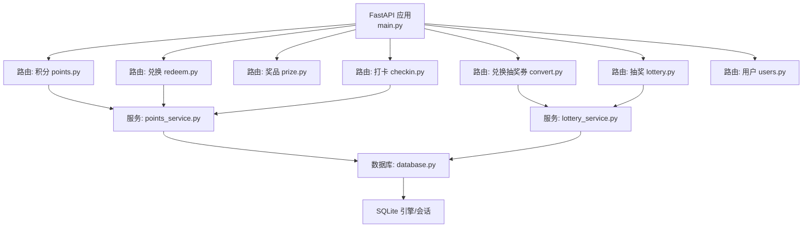
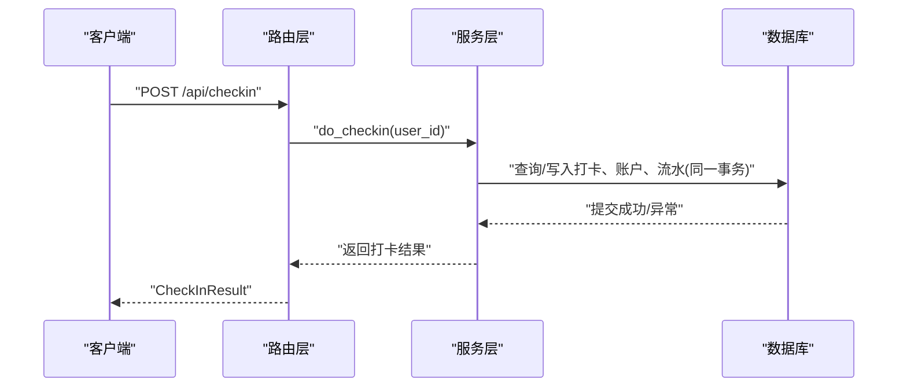
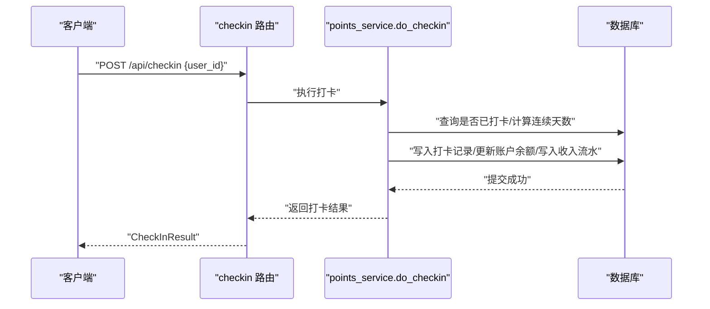
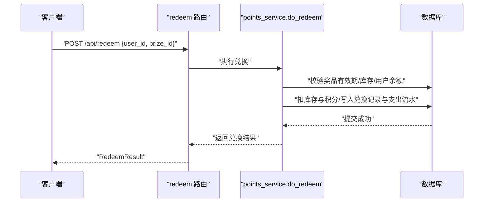
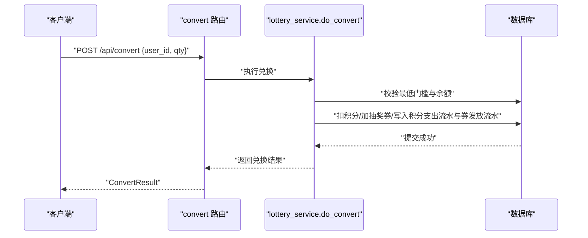
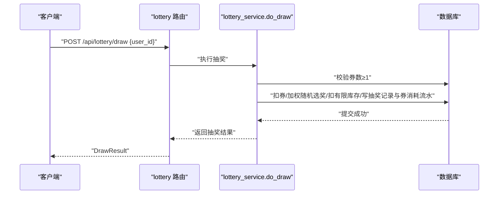
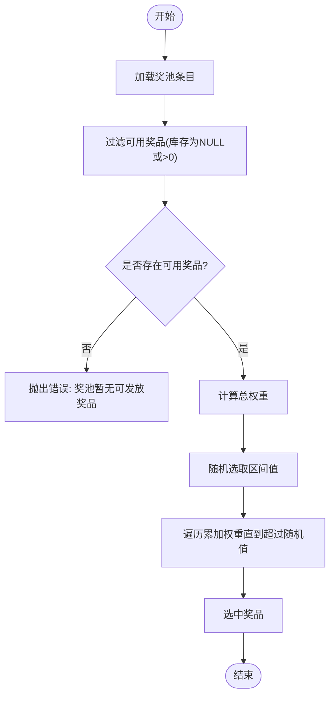
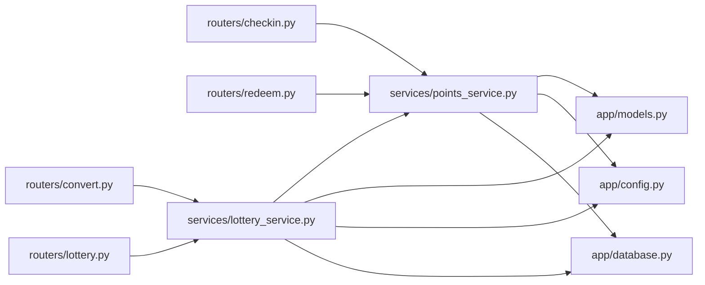
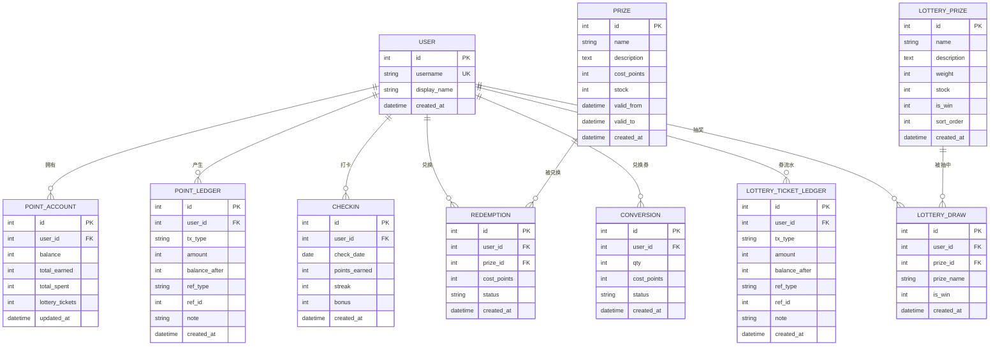

# 积分兑换系统接口

<cite>
**本文引用的文件**   
- [main.py](file://points-system/backend/app/main.py)
- [models.py](file://points-system/backend/app/models.py)
- [schemas.py](file://points-system/backend/app/schemas.py)
- [config.py](file://points-system/backend/app/config.py)
- [database.py](file://points-system/backend/app/database.py)
- [routers/points.py](file://points-system/backend/app/routers/points.py)
- [routers/redeem.py](file://points-system/backend/app/routers/redeem.py)
- [routers/prize.py](file://points-system/backend/app/routers/prize.py)
- [routers/checkin.py](file://points-system/backend/app/routers/checkin.py)
- [routers/convert.py](file://points-system/backend/app/routers/convert.py)
- [routers/lottery.py](file://points-system/backend/app/routers/lottery.py)
- [routers/users.py](file://points-system/backend/app/routers/users.py)
- [services/points_service.py](file://points-system/backend/app/services/points_service.py)
- [services/lottery_service.py](file://points-system/backend/app/services/lottery_service.py)
- [seed.py](file://points-system/backend/seed.py)
</cite>

## 目录
1. [简介](#简介)
2. [项目结构](#项目结构)
3. [核心组件](#核心组件)
4. [架构总览](#架构总览)
5. [详细组件分析](#详细组件分析)
6. [依赖关系分析](#依赖关系分析)
7. [性能与并发控制](#性能与并发控制)
8. [故障排查指南](#故障排查指南)
9. [结论](#结论)
10. [附录：API 规范与数据模型](#附录api-规范与数据模型)

## 简介
本文件为“独立积分兑换系统”的 API 接口文档，覆盖以下核心能力：
- 积分账户管理：余额查询、流水记录、增减操作（打卡获得、兑换消耗）
- 商品兑换：奖品列表、库存检查、订单生成、扣减积分并落库
- 抽奖券体系：积分兑换抽奖券、抽奖券获取/使用/核销、抽奖结果与记录
- 用户看板：一次性聚合展示用户相关的关键数据
- 并发与一致性：事务内原子更新、进程内锁与数据库约束兜底
- 与主打卡系统的集成说明：通过统一用户 ID 进行关联，提供同步建议

## 项目结构
后端采用 FastAPI + SQLAlchemy + SQLite。路由按功能拆分，服务层封装业务逻辑，模型定义数据表结构，配置集中管理规则。

图表来源
- [main.py:1-33](file://points-system/backend/app/main.py#L1-L33)
- [routers/points.py:1-28](file://points-system/backend/app/routers/points.py#L1-L28)
- [routers/redeem.py:1-52](file://points-system/backend/app/routers/redeem.py#L1-L52)
- [routers/prize.py:1-42](file://points-system/backend/app/routers/prize.py#L1-L42)
- [routers/checkin.py:1-16](file://points-system/backend/app/routers/checkin.py#L1-L16)
- [routers/convert.py:1-64](file://points-system/backend/app/routers/convert.py#L1-L64)
- [routers/lottery.py:1-55](file://points-system/backend/app/routers/lottery.py#L1-L55)
- [routers/users.py:1-192](file://points-system/backend/app/routers/users.py#L1-L192)
- [services/points_service.py:1-146](file://points-system/backend/app/services/points_service.py#L1-L146)
- [services/lottery_service.py:1-174](file://points-system/backend/app/services/lottery_service.py#L1-L174)
- [database.py:1-39](file://points-system/backend/app/database.py#L1-L39)

章节来源
- [main.py:1-33](file://points-system/backend/app/main.py#L1-L33)
- [database.py:1-39](file://points-system/backend/app/database.py#L1-L39)

## 核心组件
- 路由层：按功能划分 /api/* 接口，负责参数校验、调用服务层、返回响应模型
- 服务层：封装业务规则（打卡、兑换、积分转券、抽奖），保证事务一致性与并发安全
- 数据模型：用户、积分账户、积分流水、打卡、奖品、兑换记录、积分转券记录、抽奖券流水、抽奖奖池、抽奖记录
- 配置：打卡积分、连续奖励、积分换券比例、每次抽奖券消耗等
- 数据库：SQLite，开启 WAL 模式与忙等待，降低并发冲突窗口

章节来源
- [models.py:1-151](file://points-system/backend/app/models.py#L1-L151)
- [schemas.py:1-147](file://points-system/backend/app/schemas.py#L1-L147)
- [config.py:1-17](file://points-system/backend/app/config.py#L1-L17)
- [database.py:1-39](file://points-system/backend/app/database.py#L1-L39)

## 架构总览
整体分层清晰：请求进入路由后交由服务层处理，服务层在单一事务中完成读改写，并通过数据库唯一约束或进程内锁避免竞态条件。

图表来源
- [routers/checkin.py:1-16](file://points-system/backend/app/routers/checkin.py#L1-L16)
- [services/points_service.py:41-91](file://points-system/backend/app/services/points_service.py#L41-L91)
- [database.py:1-39](file://points-system/backend/app/database.py#L1-L39)

## 详细组件分析

### 用户与看板
- 注册：创建用户并自动开通积分账户
- 用户列表：返回所有用户
- 看板：聚合用户信息、积分余额、累计收支、抽奖券数量、是否可抽奖、今日打卡状态、连续天数、奖品列表（含 can_redeem）、最近兑换/券流水/抽奖记录、奖池配置

章节来源
- [routers/users.py:11-22](file://points-system/backend/app/routers/users.py#L11-L22)
- [routers/users.py:25-27](file://points-system/backend/app/routers/users.py#L25-L27)
- [routers/users.py:30-192](file://points-system/backend/app/routers/users.py#L30-L192)

### 积分账户与流水
- 余额查询：GET /api/points?user_id=...
- 流水查询：GET /api/ledger?user_id=...&limit=...

章节来源
- [routers/points.py:10-15](file://points-system/backend/app/routers/points.py#L10-L15)
- [routers/points.py:18-27](file://points-system/backend/app/routers/points.py#L18-L27)

### 打卡与积分增加
- 打卡：POST /api/checkin，防重复打卡，计算连续天数与额外奖励，写入积分账户与流水

章节来源
- [routers/checkin.py:11-15](file://points-system/backend/app/routers/checkin.py#L11-L15)
- [services/points_service.py:41-91](file://points-system/backend/app/services/points_service.py#L41-L91)

### 奖品管理与兑换
- 奖品列表：GET /api/prizes?user_id=...，返回库存、有效期与 can_redeem
- 兑换：POST /api/redeem，校验有效期/库存/余额，在同一事务内扣库存与积分，写入兑换记录与支出流水
- 兑换记录：GET /api/redemptions?user_id=...

章节来源
- [routers/prize.py:11-41](file://points-system/backend/app/routers/prize.py#L11-L41)
- [routers/redeem.py:11-28](file://points-system/backend/app/routers/redeem.py#L11-L28)
- [routers/redeem.py:31-51](file://points-system/backend/app/routers/redeem.py#L31-L51)
- [services/points_service.py:94-145](file://points-system/backend/app/services/points_service.py#L94-L145)

### 积分兑换抽奖券
- 兑换：POST /api/convert，按 POINTS_PER_TICKET 比例扣积分、增加抽奖券，写入积分支出流水与抽奖券发放流水
- 兑换记录：GET /api/conversions?user_id=...
- 抽奖券流水：GET /api/ticket-ledger?user_id=...

章节来源
- [routers/convert.py:11-28](file://points-system/backend/app/routers/convert.py#L11-L28)
- [routers/convert.py:31-45](file://points-system/backend/app/routers/convert.py#L31-L45)
- [routers/convert.py:48-63](file://points-system/backend/app/routers/convert.py#L48-L63)
- [services/lottery_service.py:30-98](file://points-system/backend/app/services/lottery_service.py#L30-L98)

### 抽奖券与抽奖
- 奖池：GET /api/lottery/pool，返回权重、库存与中奖标记
- 抽奖：POST /api/lottery/draw，校验券数≥1，扣券、加权随机选奖、扣有限库存、写抽奖记录与券消耗流水
- 抽奖记录：GET /api/lottery/draws?user_id=...

章节来源
- [routers/lottery.py:11-21](file://points-system/backend/app/routers/lottery.py#L11-L21)
- [routers/lottery.py:24-37](file://points-system/backend/app/routers/lottery.py#L24-L37)
- [routers/lottery.py:40-54](file://points-system/backend/app/routers/lottery.py#L40-L54)
- [services/lottery_service.py:101-114](file://points-system/backend/app/services/lottery_service.py#L101-L114)
- [services/lottery_service.py:117-173](file://points-system/backend/app/services/lottery_service.py#L117-L173)

### 业务流程示例（序列图）

#### 打卡流程

图表来源
- [routers/checkin.py:11-15](file://points-system/backend/app/routers/checkin.py#L11-L15)
- [services/points_service.py:41-91](file://points-system/backend/app/services/points_service.py#L41-L91)

#### 兑换流程

图表来源
- [routers/redeem.py:11-28](file://points-system/backend/app/routers/redeem.py#L11-L28)
- [services/points_service.py:94-145](file://points-system/backend/app/services/points_service.py#L94-L145)

#### 积分兑换抽奖券流程

图表来源
- [routers/convert.py:11-28](file://points-system/backend/app/routers/convert.py#L11-L28)
- [services/lottery_service.py:30-98](file://points-system/backend/app/services/lottery_service.py#L30-L98)

#### 抽奖流程

图表来源
- [routers/lottery.py:24-37](file://points-system/backend/app/routers/lottery.py#L24-L37)
- [services/lottery_service.py:117-173](file://points-system/backend/app/services/lottery_service.py#L117-L173)

### 复杂逻辑流程图（抽奖选择）

图表来源
- [services/lottery_service.py:101-114](file://points-system/backend/app/services/lottery_service.py#L101-L114)

## 依赖关系分析
- 路由依赖服务层，服务层依赖模型与配置，最终访问数据库
- 服务层内部存在跨模块依赖：lottery_service 复用 points_service 的账户初始化方法
- 数据库连接与事务由 database 模块提供

图表来源
- [routers/checkin.py:1-16](file://points-system/backend/app/routers/checkin.py#L1-L16)
- [routers/redeem.py:1-52](file://points-system/backend/app/routers/redeem.py#L1-L52)
- [routers/convert.py:1-64](file://points-system/backend/app/routers/convert.py#L1-L64)
- [routers/lottery.py:1-55](file://points-system/backend/app/routers/lottery.py#L1-L55)
- [services/points_service.py:1-146](file://points-system/backend/app/services/points_service.py#L1-L146)
- [services/lottery_service.py:1-174](file://points-system/backend/app/services/lottery_service.py#L1-L174)
- [models.py:1-151](file://points-system/backend/app/models.py#L1-L151)
- [config.py:1-17](file://points-system/backend/app/config.py#L1-L17)
- [database.py:1-39](file://points-system/backend/app/database.py#L1-L39)

章节来源
- [main.py:22-29](file://points-system/backend/app/main.py#L22-L29)

## 性能与并发控制
- 事务一致性：所有「读-改-写」在同一 Session 事务内完成，commit 前不持久化，失败时 rollback，确保账户与库存不会半更新
- 并发安全：
  - 单进程内：使用线程锁将账户级「读-改-写」串行化，避免 SQLite 下丢失更新
  - 数据库层：WAL 模式与 busy_timeout 缩短竞态窗口；唯一约束（如打卡日期）作为最终兜底
- 扩展建议：多进程/多实例部署时，改用数据库悲观锁（如 PostgreSQL with_for_update）替代进程内锁

章节来源
- [services/points_service.py:1-9](file://points-system/backend/app/services/points_service.py#L1-L9)
- [services/points_service.py:77-82](file://points-system/backend/app/services/points_service.py#L77-L82)
- [services/lottery_service.py:23-27](file://points-system/backend/app/services/lottery_service.py#L23-L27)
- [services/lottery_service.py:87-91](file://points-system/backend/app/services/lottery_service.py#L87-L91)
- [services/lottery_service.py:161-165](file://points-system/backend/app/services/lottery_service.py#L161-L165)
- [database.py:16-22](file://points-system/backend/app/database.py#L16-L22)

## 故障排查指南
- 重复打卡：返回 409，提示“今日已打卡”，由唯一约束与服务层双重保护
- 奖品无效：返回 400，提示“尚未开始/已过期”
- 库存不足：返回 409，提示“库存不足”
- 积分不足：返回 400，提示“积分不足”
- 抽奖券不足：返回 409，提示“抽奖券不足”
- 兑换/抽奖冲突：捕获 IntegrityError 后回滚并返回 409，提示重试

章节来源
- [services/points_service.py:45-47](file://points-system/backend/app/services/points_service.py#L45-L47)
- [services/points_service.py:102-109](file://points-system/backend/app/services/points_service.py#L102-L109)
- [services/points_service.py:115-116](file://points-system/backend/app/services/points_service.py#L115-L116)
- [services/lottery_service.py:41-50](file://points-system/backend/app/services/lottery_service.py#L41-L50)
- [services/lottery_service.py:123-127](file://points-system/backend/app/services/lottery_service.py#L123-L127)
- [services/lottery_service.py:89-91](file://points-system/backend/app/services/lottery_service.py#L89-L91)
- [services/lottery_service.py:163-165](file://points-system/backend/app/services/lottery_service.py#L163-L165)

## 结论
本系统以清晰的三层架构实现积分账户、商品兑换与抽奖券体系，通过事务与约束保障数据一致性，并以进程内锁提升 SQLite 下的并发安全性。面向生产环境，建议迁移至支持行级锁的关系型数据库，并引入幂等与审计机制以增强健壮性。

## 附录：API 规范与数据模型

### 通用约定
- 基础路径：/api
- 认证方式：当前版本未实现鉴权，通过 user_id 标识主体；生产环境需接入鉴权中间件
- 请求体：application/json
- 响应体：JSON，错误响应包含 detail 字段

### 用户与看板
- POST /api/register
  - 请求体：{ username, display_name }
  - 响应：UserOut
- GET /api/users
  - 响应：list[UserOut]
- GET /api/dashboard?user_id=...
  - 响应：聚合对象（用户、余额、累计收支、抽奖券、是否可抽奖、今日打卡、连续天数、奖品列表、奖池、最近兑换/券流水/抽奖记录、积分流水）

章节来源
- [routers/users.py:11-22](file://points-system/backend/app/routers/users.py#L11-L22)
- [routers/users.py:25-27](file://points-system/backend/app/routers/users.py#L25-L27)
- [routers/users.py:30-192](file://points-system/backend/app/routers/users.py#L30-L192)

### 积分账户与流水
- GET /api/points?user_id=...
  - 响应：AccountOut
- GET /api/ledger?user_id=...&limit=...
  - 响应：list[LedgerOut]

章节来源
- [routers/points.py:10-15](file://points-system/backend/app/routers/points.py#L10-L15)
- [routers/points.py:18-27](file://points-system/backend/app/routers/points.py#L18-L27)

### 打卡
- POST /api/checkin
  - 请求体：{ user_id }
  - 响应：CheckInResult

章节来源
- [routers/checkin.py:11-15](file://points-system/backend/app/routers/checkin.py#L11-L15)
- [services/points_service.py:41-91](file://points-system/backend/app/services/points_service.py#L41-L91)

### 奖品与兑换
- GET /api/prizes?user_id=...
  - 响应：list[PrizeOut]，含 can_redeem
- POST /api/redeem
  - 请求体：{ user_id, prize_id }
  - 响应：RedeemResult
- GET /api/redemptions?user_id=...
  - 响应：list[RedemptionOut]

章节来源
- [routers/prize.py:11-41](file://points-system/backend/app/routers/prize.py#L11-L41)
- [routers/redeem.py:11-28](file://points-system/backend/app/routers/redeem.py#L11-L28)
- [routers/redeem.py:31-51](file://points-system/backend/app/routers/redeem.py#L31-L51)
- [services/points_service.py:94-145](file://points-system/backend/app/services/points_service.py#L94-L145)

### 积分兑换抽奖券
- POST /api/convert
  - 请求体：{ user_id, qty }
  - 响应：ConvertResult
- GET /api/conversions?user_id=...
  - 响应：list[ConversionOut]
- GET /api/ticket-ledger?user_id=...
  - 响应：list[LotteryTicketLedgerOut]

章节来源
- [routers/convert.py:11-28](file://points-system/backend/app/routers/convert.py#L11-L28)
- [routers/convert.py:31-45](file://points-system/backend/app/routers/convert.py#L31-L45)
- [routers/convert.py:48-63](file://points-system/backend/app/routers/convert.py#L48-L63)
- [services/lottery_service.py:30-98](file://points-system/backend/app/services/lottery_service.py#L30-L98)

### 抽奖
- GET /api/lottery/pool
  - 响应：list[LotteryPrizeOut]
- POST /api/lottery/draw
  - 请求体：{ user_id }
  - 响应：DrawResult
- GET /api/lottery/draws?user_id=...
  - 响应：list[LotteryDrawOut]

章节来源
- [routers/lottery.py:11-21](file://points-system/backend/app/routers/lottery.py#L11-L21)
- [routers/lottery.py:24-37](file://points-system/backend/app/routers/lottery.py#L24-L37)
- [routers/lottery.py:40-54](file://points-system/backend/app/routers/lottery.py#L40-L54)
- [services/lottery_service.py:101-114](file://points-system/backend/app/services/lottery_service.py#L101-L114)
- [services/lottery_service.py:117-173](file://points-system/backend/app/services/lottery_service.py#L117-L173)

### 数据模型概览（ER 图）

图表来源
- [models.py:10-151](file://points-system/backend/app/models.py#L10-L151)

### 与主打卡系统的数据同步机制与接口调用规范
- 用户标识：通过统一的 user_id 进行关联，无需额外同步字段
- 推荐同步策略：
  - 事件驱动：主打卡系统在用户打卡成功后，调用本系统 /api/checkin 接口，确保积分实时到账
  - 幂等设计：打卡接口具备唯一约束与 409 语义，调用方可根据状态码判断是否重复
  - 对账：通过积分流水（PointLedger）与打卡记录（CheckIn）的 ref_type/ref_id 进行双向核对
- 接口调用规范：
  - 超时与重试：设置合理超时，遇到 409/5xx 指数退避重试
  - 日志与追踪：记录 user_id、ref_id、时间戳，便于问题定位
  - 鉴权：生产环境建议在网关层对用户身份进行校验，并在路由层校验 user_id 合法性

章节来源
- [routers/checkin.py:11-15](file://points-system/backend/app/routers/checkin.py#L11-L15)
- [services/points_service.py:41-91](file://points-system/backend/app/services/points_service.py#L41-L91)
- [models.py:35-48](file://points-system/backend/app/models.py#L35-L48)
- [models.py:50-66](file://points-system/backend/app/models.py#L50-L66)

### 演示数据初始化
- 脚本 seed.py 用于初始化演示用户、奖品与抽奖奖池，便于快速体验完整流程

章节来源
- [seed.py:38-82](file://points-system/backend/seed.py#L38-L82)