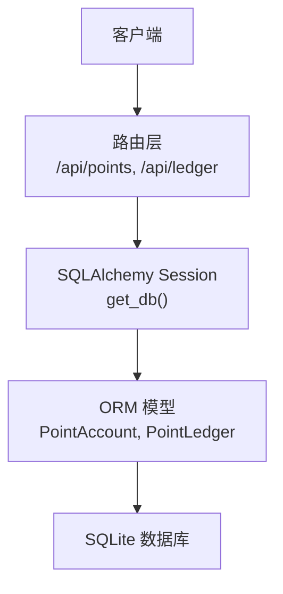
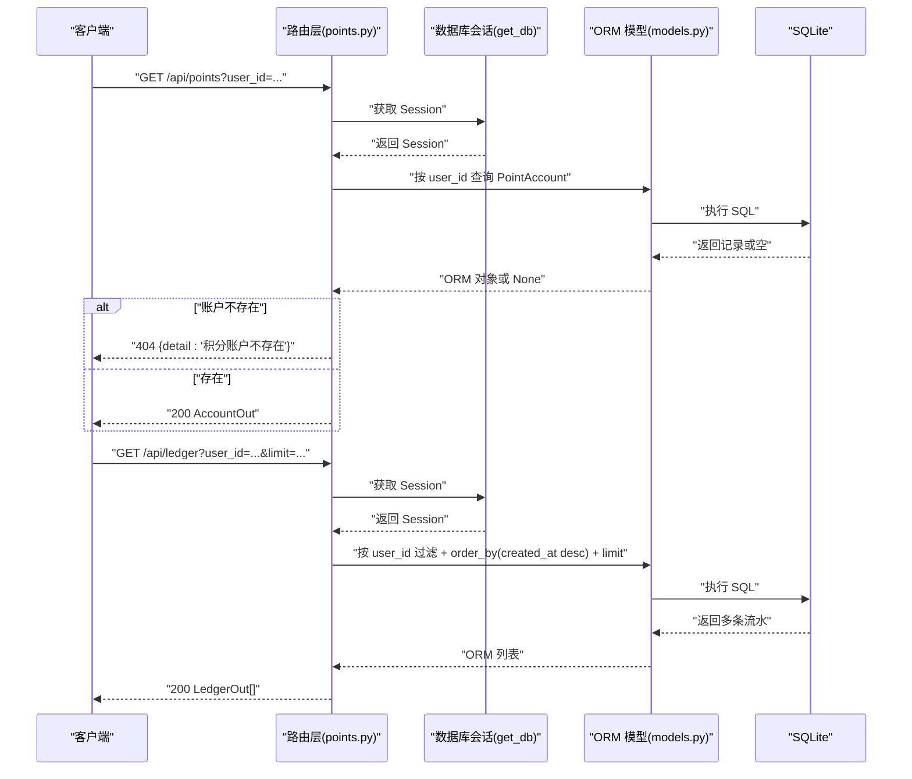
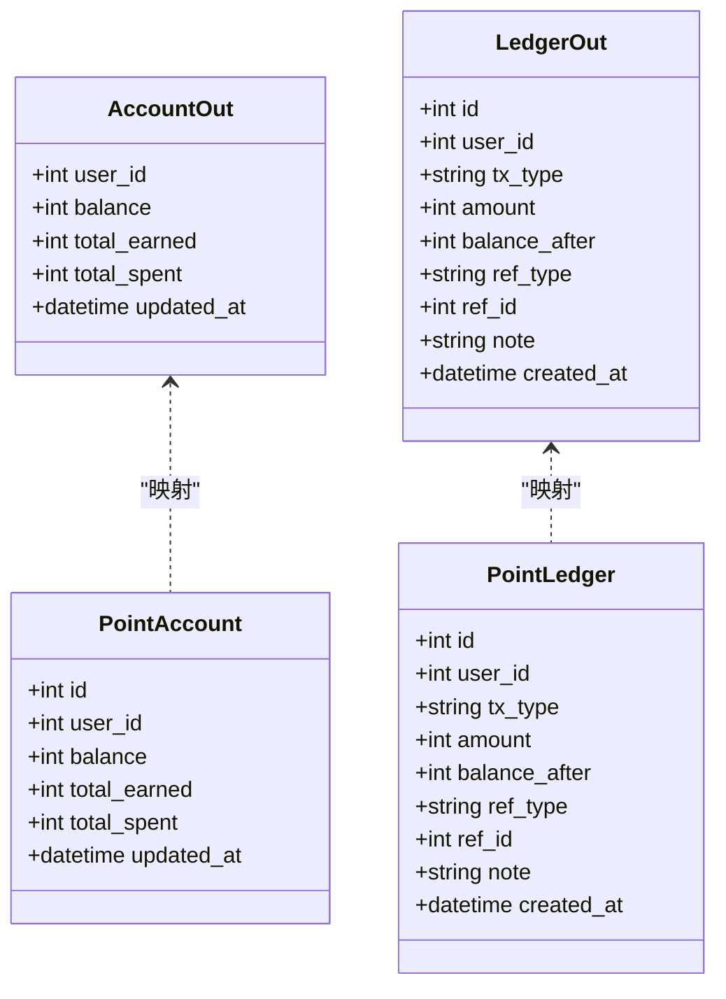

# 积分账户管理接口

<cite>
**本文引用的文件**   
- [points.py](file://points-system/backend/app/routers/points.py)
- [schemas.py](file://points-system/backend/app/schemas.py)
- [models.py](file://points-system/backend/app/models.py)
- [database.py](file://points-system/backend/app/database.py)
</cite>

## 目录
1. [简介](#简介)
2. [项目结构](#项目结构)
3. [核心组件](#核心组件)
4. [架构总览](#架构总览)
5. [详细接口说明](#详细接口说明)
6. [依赖关系分析](#依赖关系分析)
7. [性能与并发一致性](#性能与并发一致性)
8. [故障排查指南](#故障排查指南)
9. [结论](#结论)

## 简介
本文件为“积分账户管理”相关接口的权威文档，覆盖以下能力：
- 查询用户积分余额：GET /api/points
- 查询用户积分流水（分页、倒序）：GET /api/ledger

文档同时给出请求示例、响应格式、错误处理机制，并解释数据模型设计、并发访问控制与数据一致性保证。

## 项目结构
后端采用 FastAPI + SQLAlchemy 的轻量分层：
- 路由层：定义 REST 端点与参数校验
- 服务层：业务逻辑（本仓库中积分查询走直连数据库，复杂写操作在 services 中封装事务）
- 数据模型：SQLAlchemy ORM 映射到 SQLite
- 数据访问：通过 get_db 注入 Session

图表来源
- [points.py:10-27](file://points-system/backend/app/routers/points.py#L10-L27)
- [database.py:28-33](file://points-system/backend/app/database.py#L28-L33)
- [models.py:20-47](file://points-system/backend/app/models.py#L20-L47)

章节来源
- [points.py:1-27](file://points-system/backend/app/routers/points.py#L1-F27)
- [database.py:1-39](file://points-system/backend/app/database.py#L1-L39)
- [models.py:1-151](file://points-system/backend/app/models.py#L1-L151)

## 核心组件
- 路由模块：提供 GET /api/points 与 GET /api/ledger 两个只读接口
- Schema 定义：AccountOut、LedgerOut 用于统一返回结构
- 数据模型：PointAccount（账户）、PointLedger（流水）
- 数据库配置：SQLite + WAL + busy_timeout，提升并发读取性能

章节来源
- [points.py:10-27](file://points-system/backend/app/routers/points.py#L10-L27)
- [schemas.py:18-35](file://points-system/backend/app/schemas.py#L18-L35)
- [models.py:20-47](file://points-system/backend/app/models.py#L20-L47)
- [database.py:16-23](file://points-system/backend/app/database.py#L16-L23)

## 架构总览
从请求到响应的调用链如下：

图表来源
- [points.py:10-27](file://points-system/backend/app/routers/points.py#L10-L27)
- [database.py:28-33](file://points-system/backend/app/database.py#L28-L33)
- [models.py:20-47](file://points-system/backend/app/models.py#L20-L47)

## 详细接口说明

### 查询积分余额
- 方法：GET
- 路径：/api/points
- 查询参数：
  - user_id: 整数，必填
- 成功响应：200，返回 AccountOut 对象
- 失败响应：
  - 404：当 user_id 对应的积分账户不存在时，返回 detail 为“积分账户不存在”

请求示例
- GET /api/points?user_id=1001

响应示例（成功）
{
  "user_id": 1001,
  "balance": 120,
  "total_earned": 500,
  "total_spent": 380,
  "updated_at": "2025-01-01T12:34:56Z"
}

响应示例（账户不存在）
{
  "detail": "积分账户不存在"
}

字段定义（AccountOut）
- user_id: 整数，用户标识
- balance: 整数，当前可用积分
- total_earned: 整数，累计获得积分
- total_spent: 整数，累计支出积分
- updated_at: 时间戳，账户最后更新时间

章节来源
- [points.py:10-15](file://points-system/backend/app/routers/points.py#L10-L15)
- [schemas.py:18-24](file://points-system/backend/app/schemas.py#L18-L24)

### 查询积分流水
- 方法：GET
- 路径：/api/ledger
- 查询参数：
  - user_id: 整数，必填
  - limit: 整数，可选，默认 50；限制返回条数
- 排序规则：按 created_at 倒序（最新在前）
- 成功响应：200，返回 LedgerOut 数组

请求示例
- GET /api/ledger?user_id=1001&limit=10

响应示例（成功）
[
  {
    "id": 10001,
    "user_id": 1001,
    "tx_type": "earn",
    "amount": 10,
    "balance_after": 120,
    "ref_type": "checkin",
    "ref_id": 5001,
    "note": "打卡得积分（连续3天）",
    "created_at": "2025-01-01T12:34:56Z"
  },
  {
    "id": 10000,
    "user_id": 1001,
    "tx_type": "spend",
    "amount": 20,
    "balance_after": 110,
    "ref_type": "redemption",
    "ref_id": 3001,
    "note": "兑换「精美周边」",
    "created_at": "2025-01-01T10:00:00Z"
  }
]

字段定义（LedgerOut）
- id: 整数，流水主键
- user_id: 整数，用户标识
- tx_type: 字符串，交易类型（如 earn/spend）
- amount: 整数，变动数量（正数）
- balance_after: 整数，变动后的余额快照
- ref_type: 字符串，关联业务类型（如 checkin/redemption），可为空
- ref_id: 整数，关联业务主键，可为空
- note: 字符串，备注信息，可为空
- created_at: 时间戳，创建时间

章节来源
- [points.py:18-27](file://points-system/backend/app/routers/points.py#L18-L27)
- [schemas.py:26-35](file://points-system/backend/app/schemas.py#L26-L35)

## 依赖关系分析
- 路由层依赖：
  - schemas.AccountOut、schemas.LedgerOut 作为 response_model
  - models.PointAccount、models.PointLedger 进行查询
  - database.get_db 提供 Session
- 数据模型依赖：
  - PointAccount 与 User 一对零/一关系（仅读场景不强制外键加载）
  - PointLedger 与 User 多对一关系（仅读场景不强制外键加载）

图表来源
- [schemas.py:18-35](file://points-system/backend/app/schemas.py#L18-L35)
- [models.py:20-47](file://points-system/backend/app/models.py#L20-L47)

章节来源
- [points.py:1-27](file://points-system/backend/app/routers/points.py#L1-L27)
- [schemas.py:18-35](file://points-system/backend/app/schemas.py#L18-L35)
- [models.py:20-47](file://points-system/backend/app/models.py#L20-L47)

## 性能与并发一致性

### 数据模型设计要点
- PointAccount
  - 每个用户一行，维护 balance、total_earned、total_spent 等汇总字段，便于快速读取余额
  - user_id 唯一索引，避免重复账户
- PointLedger
  - 每笔收支落一条流水，包含 balance_after 快照，支持对账与审计
  - user_id 与 created_at 建立索引，优化按用户与时间范围查询

章节来源
- [models.py:20-47](file://points-system/backend/app/models.py#L20-L47)

### 并发访问控制与一致性
- 读接口（/api/points、/api/ledger）无写操作，不涉及事务提交，主要关注读取性能与一致性
- 数据库层面：
  - SQLite 开启 WAL 模式，提高并发读性能
  - busy_timeout 设置写忙等待，降低锁冲突概率
- 写接口（如打卡、兑换）在 services 中通过单事务完成“读-改-写”，确保余额与库存原子更新；异常时回滚，防止半更新

章节来源
- [database.py:16-23](file://points-system/backend/app/database.py#L16-L23)
- [points_service.py:1-9](file://points-system/backend/app/services/points_service.py#L1-L9)

## 故障排查指南
- 404 账户不存在
  - 触发条件：GET /api/points 传入的 user_id 在 point_accounts 表中无对应记录
  - 建议处理：
    - 确认上游是否已为该用户初始化积分账户
    - 若允许自动建户，可在业务侧先调用“获取或创建账户”的服务方法，再查询余额
- 参数缺失或类型错误
  - user_id 未传或类型非整数时，FastAPI 会返回参数校验错误
  - limit 非整数或未传时，使用默认值 50
- 大数据量查询
  - 合理设置 limit，避免一次性拉取过多流水
  - 如需翻页，可在应用层基于 last_created_at 与 limit 实现游标式分页

章节来源
- [points.py:10-15](file://points-system/backend/app/routers/points.py#L10-L15)
- [points.py:18-27](file://points-system/backend/app/routers/points.py#L18-L27)

## 结论
- GET /api/points 与 GET /api/ledger 提供了简洁稳定的只读能力，配合 AccountOut/LedgerOut 明确的数据契约，便于前端集成
- 数据模型以“账户+流水”的经典设计保障可追溯性与对账能力
- 读接口在高并发下借助 SQLite WAL 获得良好性能；写接口通过事务保证一致性
- 建议在业务侧完善“自动建户”策略，以避免 404 场景