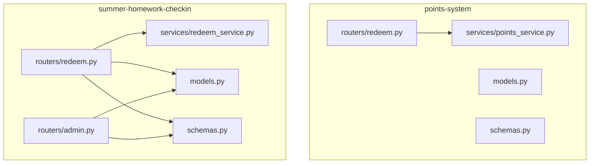
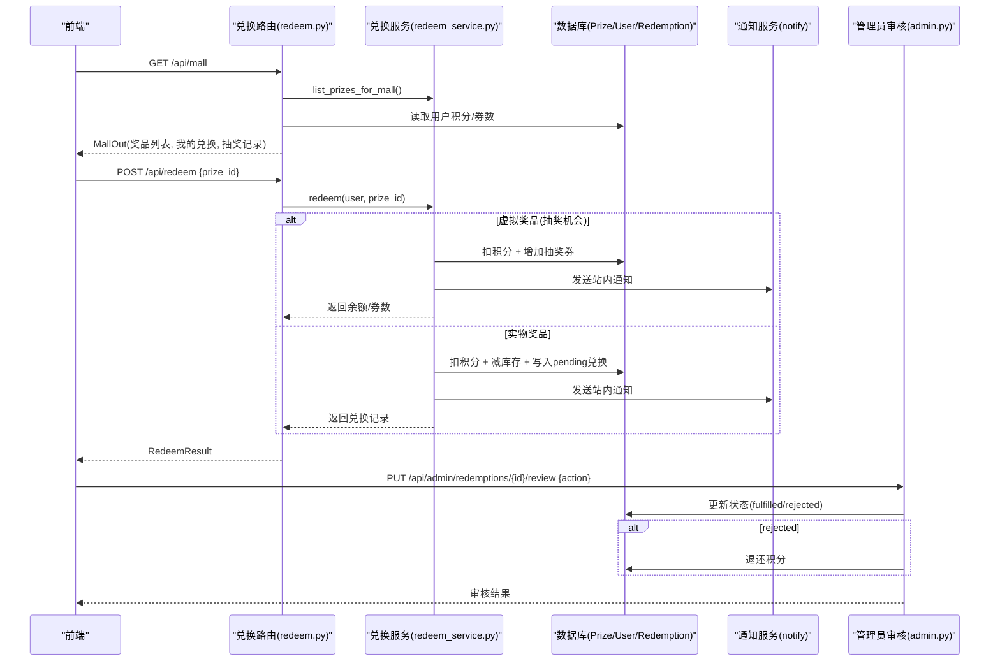
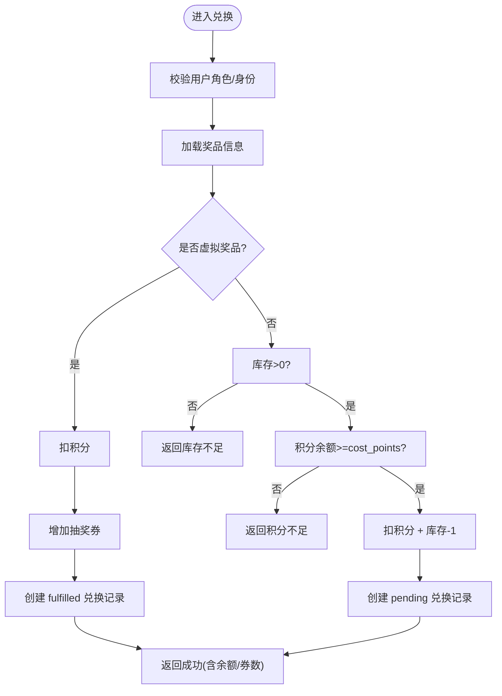
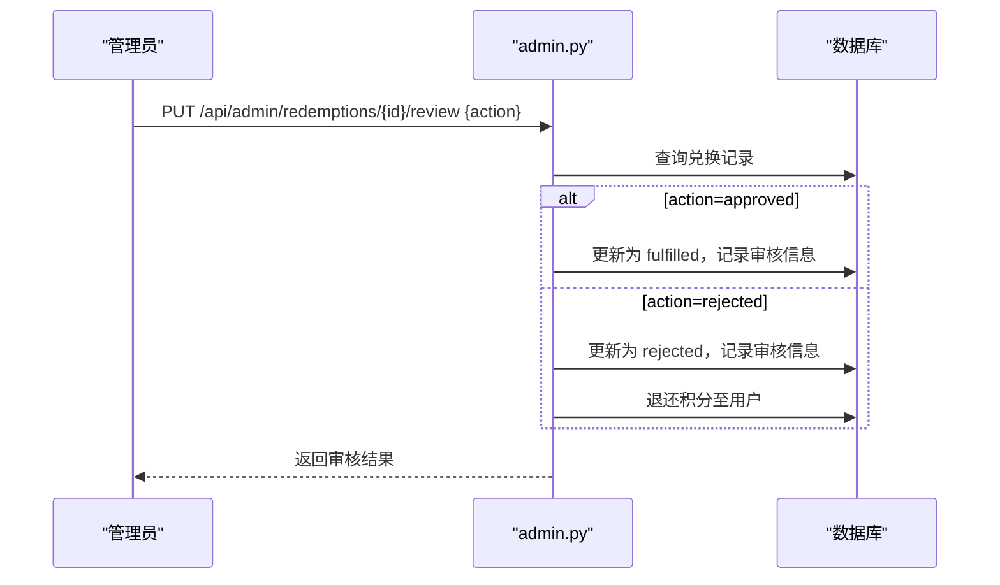
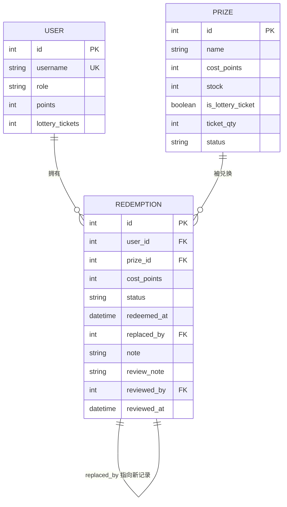
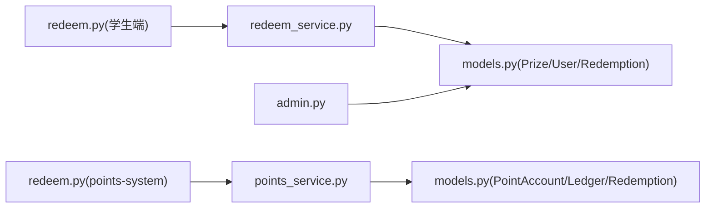

# 奖品兑换接口

<cite>
**本文引用的文件**
- [points-system/backend/app/routers/redeem.py](file://points-system/backend/app/routers/redeem.py)
- [points-system/backend/app/services/points_service.py](file://points-system/backend/app/services/points_service.py)
- [points-system/backend/app/models.py](file://points-system/backend/app/models.py)
- [points-system/backend/app/schemas.py](file://points-system/backend/app/schemas.py)
- [summer-homework-checkin/backend/app/routers/redeem.py](file://summer-homework-checkin/backend/app/routers/redeem.py)
- [summer-homework-checkin/backend/app/services/redeem_service.py](file://summer-homework-checkin/backend/app/services/redeem_service.py)
- [summer-homework-checkin/backend/app/models.py](file://summer-homework-checkin/backend/app/models.py)
- [summer-homework-checkin/backend/app/schemas.py](file://summer-homework-checkin/backend/app/schemas.py)
- [summer-homework-checkin/backend/app/routers/admin.py](file://summer-homework-checkin/backend/app/routers/admin.py)
</cite>

## 目录
1. [简介](#简介)
2. [项目结构](#项目结构)
3. [核心组件](#核心组件)
4. [架构总览](#架构总览)
5. [详细组件分析](#详细组件分析)
6. [依赖关系分析](#依赖关系分析)
7. [性能与一致性](#性能与一致性)
8. [故障排查指南](#故障排查指南)
9. [结论](#结论)
10. [附录：API 定义与示例](#附录api-定义与示例)

## 简介
本文件面向“奖品兑换”功能，提供完整的 API 文档与实现说明。覆盖以下能力：
- 奖品的浏览（含可兑换性判断）
- 兑换申请（积分扣除、库存检查、用户信息验证）
- 兑换状态查询（我的兑换记录、管理端审核）
- 兑换限制条件、重复兑换检测与异常处理策略
- 兑换记录的生成、审核流程与状态更新机制
- 数据一致性保证、事务回滚与错误恢复
- 与“奖品管理系统”和“用户账户系统”的集成方式
- 完整业务流程示例（前端交互与后端处理）

本项目包含两套相关实现：
- points-system：以独立积分账户与流水为核心的通用积分与兑换服务
- summer-homework-checkin：学生打卡场景下的积分商城与兑换流程（含管理员审核）

## 项目结构
围绕“兑换”的核心代码分布在两个子系统中：
- points-system：提供通用的 do_redeem 业务逻辑、积分账户与流水模型、基础兑换路由
- summer-homework-checkin：提供面向学生的积分商城聚合接口、兑换与替换、以及管理员审核

图表来源
- [points-system/backend/app/routers/redeem.py:1-52](file://points-system/backend/app/routers/redeem.py#L1-L52)
- [points-system/backend/app/services/points_service.py:1-146](file://points-system/backend/app/services/points_service.py#L1-L146)
- [summer-homework-checkin/backend/app/routers/redeem.py:1-81](file://summer-homework-checkin/backend/app/routers/redeem.py#L1-L81)
- [summer-homework-checkin/backend/app/services/redeem_service.py:1-168](file://summer-homework-checkin/backend/app/services/redeem_service.py#L1-L168)
- [summer-homework-checkin/backend/app/routers/admin.py:1-214](file://summer-homework-checkin/backend/app/routers/admin.py#L1-L214)

章节来源
- [points-system/backend/app/routers/redeem.py:1-52](file://points-system/backend/app/routers/redeem.py#L1-L52)
- [summer-homework-checkin/backend/app/routers/redeem.py:1-81](file://summer-homework-checkin/backend/app/routers/redeem.py#L1-L81)

## 核心组件
- 积分账户与流水（points-system）
  - PointAccount：用户积分余额、累计收支、抽奖券数量
  - PointLedger：每笔收入/支出明细，支持对账与追溯
  - Redemption：兑换记录（issued/cancelled）
  - Prize：奖品（成本、库存、有效期）
- 学生打卡场景的扩展（summer-homework-checkin）
  - User.points / lottery_tickets：直接冗余在用户表上
  - Redemption：支持 pending/fulfilled/replaced/rejected 等状态，并支持替换与审核
  - Prize：支持 is_lottery_ticket 标记，区分虚拟奖品（抽奖机会）与实物奖品
- 路由与服务
  - points-service.do_redeem：统一的事务内校验与扣减
  - redeem_service.redeem：区分虚拟/实物奖品，创建兑换记录或自动发放券
  - admin.review_redemption：管理员审核（兑现/拒绝），拒绝时退还积分

章节来源
- [points-system/backend/app/models.py:20-94](file://points-system/backend/app/models.py#L20-L94)
- [summer-homework-checkin/backend/app/models.py:103-161](file://summer-homework-checkin/backend/app/models.py#L103-L161)
- [points-system/backend/app/services/points_service.py:94-146](file://points-system/backend/app/services/points_service.py#L94-L146)
- [summer-homework-checkin/backend/app/services/redeem_service.py:22-94](file://summer-homework-checkin/backend/app/services/redeem_service.py#L22-L94)
- [summer-homework-checkin/backend/app/routers/admin.py:165-214](file://summer-homework-checkin/backend/app/routers/admin.py#L165-L214)

## 架构总览
下图展示了从前端到后端的整体调用链，包括普通奖品与抽奖机会两类路径，以及管理员审核闭环。

图表来源
- [summer-homework-checkin/backend/app/routers/redeem.py:24-69](file://summer-homework-checkin/backend/app/routers/redeem.py#L24-L69)
- [summer-homework-checkin/backend/app/services/redeem_service.py:22-94](file://summer-homework-checkin/backend/app/services/redeem_service.py#L22-L94)
- [summer-homework-checkin/backend/app/routers/admin.py:165-214](file://summer-homework-checkin/backend/app/routers/admin.py#L165-L214)

## 详细组件分析

### 1) 奖品浏览接口
- 目的：展示可兑换奖品，并在 points-system 中附带 can_redeem 标志（综合库存、有效期、余额）。
- 关键逻辑
  - 仅上架且 cost_points > 0 的奖品参与兑换
  - 若传入 user_id，则计算当前用户是否满足兑换条件（余额足够、库存>0、有效期内）
- 输出字段：id、name、description、cost_points、stock、valid_from/to、can_redeem

章节来源
- [summer-homework-checkin/backend/app/services/redeem_service.py:7-12](file://summer-homework-checkin/backend/app/services/redeem_service.py#L7-L12)
- [points-system/backend/app/routers/prize.py:11-41](file://points-system/backend/app/routers/prize.py#L11-L41)
- [points-system/backend/app/schemas.py:47-56](file://points-system/backend/app/schemas.py#L47-L56)

### 2) 兑换申请接口
- 入口：POST /api/redeem
- 输入：prize_id（summer-homework-checkin 通过鉴权获取当前用户；points-system 需显式 user_id）
- 校验顺序
  - 用户权限（summer-homework-checkin 要求 student/parent）
  - 奖品存在性与上架状态
  - 是否为虚拟奖品（is_lottery_ticket）
  - 库存检查（实物奖品 stock=0 不可兑换）
  - 积分余额检查
- 处理分支
  - 虚拟奖品：扣积分，增加抽奖券，创建 fulfilled 状态的兑换记录，不扣库存
  - 实物奖品：扣积分，库存 -1，创建 pending 状态的兑换记录，等待管理员审核
- 输出：RedeemResult（包含 redemption、balance、lottery_tickets、message 等）

图表来源
- [summer-homework-checkin/backend/app/routers/redeem.py:48-69](file://summer-homework-checkin/backend/app/routers/redeem.py#L48-L69)
- [summer-homework-checkin/backend/app/services/redeem_service.py:22-94](file://summer-homework-checkin/backend/app/services/redeem_service.py#L22-L94)

章节来源
- [summer-homework-checkin/backend/app/routers/redeem.py:48-69](file://summer-homework-checkin/backend/app/routers/redeem.py#L48-L69)
- [summer-homework-checkin/backend/app/services/redeem_service.py:22-94](file://summer-homework-checkin/backend/app/services/redeem_service.py#L22-L94)
- [points-system/backend/app/services/points_service.py:94-146](file://points-system/backend/app/services/points_service.py#L94-L146)

### 3) 兑换状态查询接口
- 我的兑换记录：GET /api/redemptions（按时间倒序）
- 积分商城聚合：GET /api/mall（返回余额、券数、可兑换奖品、我的兑换、抽奖记录）
- 管理端兑换记录：GET /api/admin/redemptions（支持按状态筛选）
- 管理端详情：GET /api/admin/redemptions/{id}

章节来源
- [summer-homework-checkin/backend/app/routers/redeem.py:24-45](file://summer-homework-checkin/backend/app/routers/redeem.py#L24-L45)
- [summer-homework-checkin/backend/app/routers/redeem.py:31-51](file://summer-homework-checkin/backend/app/routers/redeem.py#L31-L51)
- [summer-homework-checkin/backend/app/routers/admin.py:106-162](file://summer-homework-checkin/backend/app/routers/admin.py#L106-L162)

### 4) 管理员审核与状态更新
- 审核入口：PUT /api/admin/redemptions/{id}/review
- 动作
  - approved：状态改为 fulfilled，记录审核人与时间
  - rejected：状态改为 rejected，并退还对应积分
- 前置校验：仅 pending 状态可审核；记录不存在或已处理将报错

图表来源
- [summer-homework-checkin/backend/app/routers/admin.py:165-214](file://summer-homework-checkin/backend/app/routers/admin.py#L165-L214)

章节来源
- [summer-homework-checkin/backend/app/routers/admin.py:165-214](file://summer-homework-checkin/backend/app/routers/admin.py#L165-L214)

### 5) 兑换替换（直接选择替换）
- 入口：POST /api/redeem/{rid}/replace
- 规则
  - 原记录不能是 replaced/cancelled
  - 目标奖品必须上架且 cost_points>0，且库存>0
  - 退还原消耗积分，再按新奖品分值结算（多退少补）
  - 原奖品库存+1，新奖品库存-1
  - 原记录标记 replaced_by 指向新记录

章节来源
- [summer-homework-checkin/backend/app/routers/redeem.py:72-81](file://summer-homework-checkin/backend/app/routers/redeem.py#L72-L81)
- [summer-homework-checkin/backend/app/services/redeem_service.py:97-167](file://summer-homework-checkin/backend/app/services/redeem_service.py#L97-L167)

### 6) 数据模型与关系

图表来源
- [summer-homework-checkin/backend/app/models.py:103-161](file://summer-homework-checkin/backend/app/models.py#L103-L161)

章节来源
- [summer-homework-checkin/backend/app/models.py:103-161](file://summer-homework-checkin/backend/app/models.py#L103-L161)

## 依赖关系分析
- 路由层依赖服务层进行业务编排
- 服务层依赖模型访问数据库，必要时调用通知服务
- 管理员路由依赖同一套模型与鉴权中间件
- points-system 使用独立的积分账户与流水模型，summer-homework-checkin 使用用户表冗余字段

图表来源
- [summer-homework-checkin/backend/app/routers/redeem.py:1-81](file://summer-homework-checkin/backend/app/routers/redeem.py#L1-L81)
- [summer-homework-checkin/backend/app/services/redeem_service.py:1-168](file://summer-homework-checkin/backend/app/services/redeem_service.py#L1-L168)
- [summer-homework-checkin/backend/app/routers/admin.py:1-214](file://summer-homework-checkin/backend/app/routers/admin.py#L1-L214)
- [points-system/backend/app/routers/redeem.py:1-52](file://points-system/backend/app/routers/redeem.py#L1-L52)
- [points-system/backend/app/services/points_service.py:1-146](file://points-system/backend/app/services/points_service.py#L1-L146)

章节来源
- [summer-homework-checkin/backend/app/routers/redeem.py:1-81](file://summer-homework-checkin/backend/app/routers/redeem.py#L1-L81)
- [summer-homework-checkin/backend/app/services/redeem_service.py:1-168](file://summer-homework-checkin/backend/app/services/redeem_service.py#L1-L168)
- [summer-homework-checkin/backend/app/routers/admin.py:1-214](file://summer-homework-checkin/backend/app/routers/admin.py#L1-L214)
- [points-system/backend/app/routers/redeem.py:1-52](file://points-system/backend/app/routers/redeem.py#L1-L52)
- [points-system/backend/app/services/points_service.py:1-146](file://points-system/backend/app/services/points_service.py#L1-L146)

## 性能与一致性
- 事务与一致性
  - points-system：do_redeem 在同一 SQLAlchemy Session 事务内完成读-改-写，commit 前失败则 rollback，避免半更新
  - summer-homework-checkin：redeem_service 在关键路径执行 db.commit()，并在异常时抛出 HTTPException，由框架回滚未提交变更
- 并发与幂等
  - 重复兑换检测：在兑换前校验库存与余额，防止超卖与透支
  - 唯一约束兜底：如打卡防重有唯一约束，兑换可通过业务层先查后写结合数据库约束保障
- 性能建议
  - 对热点奖品加索引（id、status、cost_points）
  - 高并发下考虑悲观锁（with_for_update）或队列化兑换请求
  - 批量查询 mall 接口时减少 N+1 查询

章节来源
- [points-system/backend/app/services/points_service.py:94-146](file://points-system/backend/app/services/points_service.py#L94-L146)
- [summer-homework-checkin/backend/app/services/redeem_service.py:22-94](file://summer-homework-checkin/backend/app/services/redeem_service.py#L22-L94)

## 故障排查指南
- 常见错误码与原因
  - 404 用户/奖品不存在：检查 user_id/prize_id 是否正确
  - 400 参数非法/奖品下架/不支持积分兑换/积分不足：检查请求体与奖品配置
  - 409 库存不足/重复操作：检查库存与并发控制
- 审核相关问题
  - 非 pending 状态不可审核：确认记录当前状态
  - 拒绝后积分未退还：检查审核逻辑是否执行退款分支
- 日志与追踪
  - 查看兑换记录中的 note/review_note 字段定位问题
  - 核对用户 points 与兑换 cost_points 的一致性

章节来源
- [summer-homework-checkin/backend/app/routers/redeem.py:48-69](file://summer-homework-checkin/backend/app/routers/redeem.py#L48-L69)
- [summer-homework-checkin/backend/app/services/redeem_service.py:22-94](file://summer-homework-checkin/backend/app/services/redeem_service.py#L22-L94)
- [summer-homework-checkin/backend/app/routers/admin.py:165-214](file://summer-homework-checkin/backend/app/routers/admin.py#L165-L214)

## 结论
本方案提供了完整的奖品兑换能力，涵盖浏览、申请、审核与替换，并通过事务与校验保证数据一致性与安全性。针对虚拟奖品与实物奖品分别设计了自动化与人工审核两条路径，兼顾效率与风控。建议在后续版本引入更严格的并发控制与审计日志，进一步提升稳定性与可观测性。

## 附录：API 定义与示例

### 通用数据结构
- 兑换请求
  - prize_id: 整数，必填
- 兑换结果
  - redemption: 兑换记录对象（可为空，当为虚拟奖品时）
  - balance: 积分余额
  - lottery_tickets: 抽奖券数量
  - is_lottery_ticket: 是否虚拟奖品
  - message: 提示信息

章节来源
- [summer-homework-checkin/backend/app/schemas.py:184-213](file://summer-homework-checkin/backend/app/schemas.py#L184-L213)
- [points-system/backend/app/schemas.py:72-88](file://points-system/backend/app/schemas.py#L72-L88)

### 接口清单
- 积分商城聚合
  - GET /api/mall
  - 响应：MallOut（points、lottery_tickets、prizes、redemptions、lottery_records）
- 兑换申请
  - POST /api/redeem
  - 请求体：{prize_id}
  - 响应：RedeemResult
- 我的兑换记录
  - GET /api/redemptions?user_id={id}
  - 响应：RedemptionOut[]
- 管理员审核
  - PUT /api/admin/redemptions/{id}/review
  - 请求体：{action: "approved" | "rejected", note?: string}
  - 响应：审核结果（含状态、审核人、时间）
- 兑换替换
  - POST /api/redeem/{rid}/replace
  - 请求体：{new_prize_id}
  - 响应：RedemptionOut

章节来源
- [summer-homework-checkin/backend/app/routers/redeem.py:24-81](file://summer-homework-checkin/backend/app/routers/redeem.py#L24-L81)
- [summer-homework-checkin/backend/app/routers/admin.py:106-214](file://summer-homework-checkin/backend/app/routers/admin.py#L106-L214)

### 业务流程示例（端到端）
- 前端
  - 调用 GET /api/mall 获取奖品列表与用户余额
  - 用户点击兑换，发起 POST /api/redeem
  - 根据返回的 redemption.status 显示“待发放/已兑现/已拒绝”
  - 需要替换时，调用 POST /api/redeem/{rid}/replace
- 后端
  - 校验用户权限与奖品有效性
  - 虚拟奖品：扣积分、发券、创建 fulfilled 记录
  - 实物奖品：扣积分、减库存、创建 pending 记录
  - 管理员审核：approved 标记 fulfilled；rejected 退还积分并标记 rejected

章节来源
- [summer-homework-checkin/backend/app/routers/redeem.py:24-81](file://summer-homework-checkin/backend/app/routers/redeem.py#L24-L81)
- [summer-homework-checkin/backend/app/services/redeem_service.py:22-167](file://summer-homework-checkin/backend/app/services/redeem_service.py#L22-L167)
- [summer-homework-checkin/backend/app/routers/admin.py:165-214](file://summer-homework-checkin/backend/app/routers/admin.py#L165-L214)