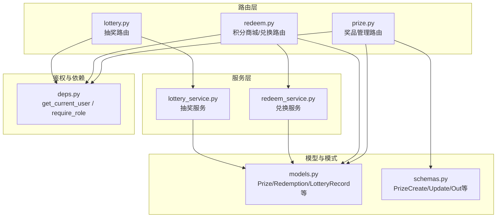
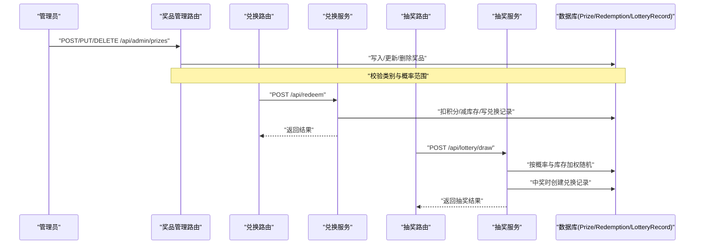
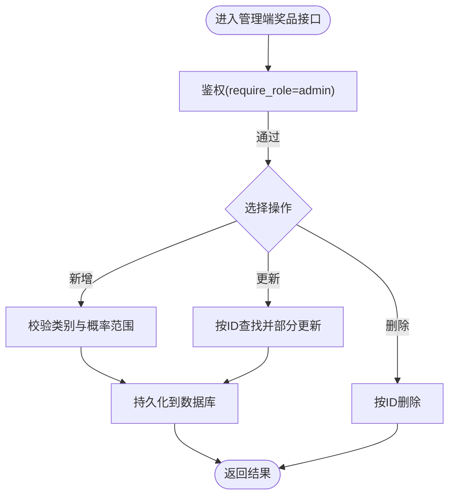
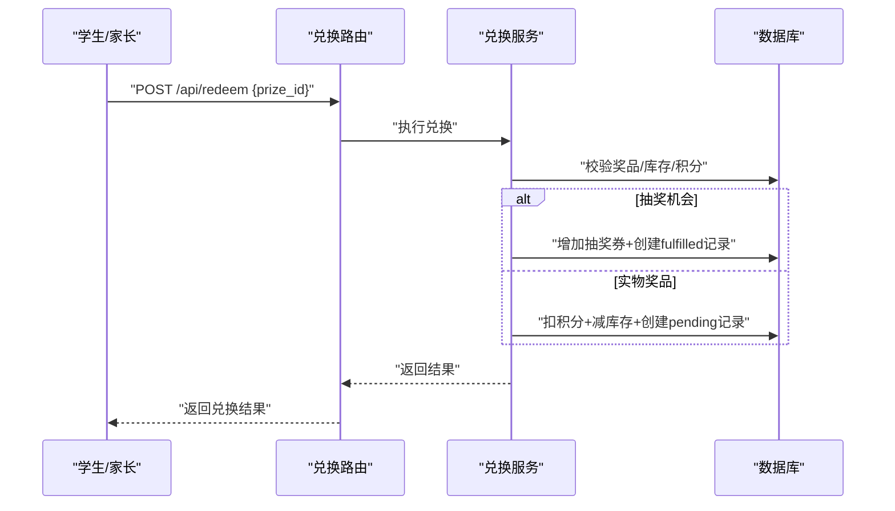
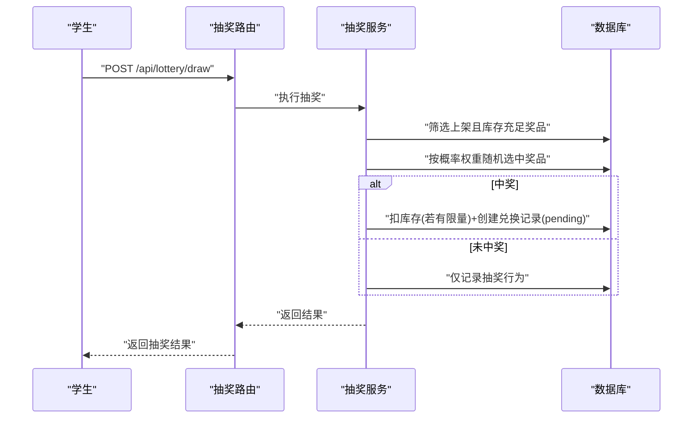
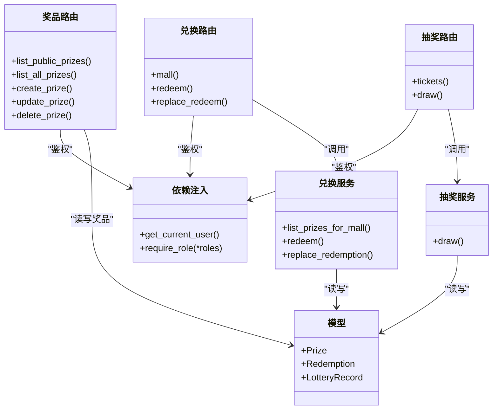
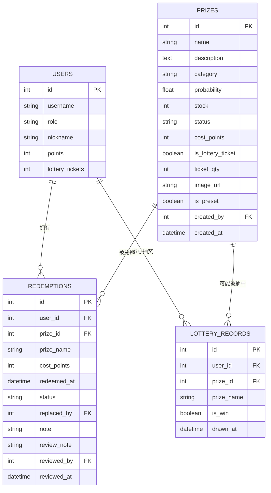

# 奖品管理接口

<cite>
**本文引用的文件**   
- [summer-homework-checkin/backend/app/routers/prize.py](file://summer-homework-checkin/backend/app/routers/prize.py)
- [summer-homework-checkin/backend/app/models.py](file://summer-homework-checkin/backend/app/models.py)
- [summer-homework-checkin/backend/app/schemas.py](file://summer-homework-checkin/backend/app/schemas.py)
- [summer-homework-checkin/backend/app/deps.py](file://summer-homework-checkin/backend/app/deps.py)
- [summer-homework-checkin/backend/app/services/redeem_service.py](file://summer-homework-checkin/backend/app/services/redeem_service.py)
- [summer-homework-checkin/backend/app/services/lottery_service.py](file://summer-homework-checkin/backend/app/services/lottery_service.py)
- [summer-homework-checkin/backend/app/routers/redeem.py](file://summer-homework-checkin/backend/app/routers/redeem.py)
- [summer-homework-checkin/backend/app/routers/lottery.py](file://summer-homework-checkin/backend/app/routers/lottery.py)
</cite>

## 目录
1. [简介](#简介)
2. [项目结构](#项目结构)
3. [核心组件](#核心组件)
4. [架构总览](#架构总览)
5. [详细组件分析](#详细组件分析)
6. [依赖关系分析](#依赖关系分析)
7. [性能与一致性考虑](#性能与一致性考虑)
8. [故障排查指南](#故障排查指南)
9. [结论](#结论)
10. [附录：API 定义与示例](#附录api-定义与示例)

## 简介
本文件面向“奖品管理”相关 API，覆盖以下能力：
- 奖品的增删改查（CRUD）
- 基本信息设置、图片上传（URL 字段）、库存管理
- 分类、概率配置与上架/下架状态管理
- 管理员权限控制与数据校验规则
- 类别限制（文具类、户外类、兴趣类）与概率范围约束
- 完整 CRUD 操作示例与批量管理建议
- 数据完整性检查、业务规则验证与错误处理机制
- 与抽奖系统、兑换系统的关联关系与数据同步策略

## 项目结构
后端采用 FastAPI + SQLAlchemy 的常见分层：路由层负责鉴权与参数校验，服务层封装业务逻辑，模型层定义数据库表结构，Schema 层定义请求/响应体。

图表来源
- [summer-homework-checkin/backend/app/routers/prize.py:1-66](file://summer-homework-checkin/backend/app/routers/prize.py#L1-L66)
- [summer-homework-checkin/backend/app/routers/redeem.py:1-81](file://summer-homework-checkin/backend/app/routers/redeem.py#L1-L81)
- [summer-homework-checkin/backend/app/routers/lottery.py:1-30](file://summer-homework-checkin/backend/app/routers/lottery.py#L1-L30)
- [summer-homework-checkin/backend/app/services/redeem_service.py:1-168](file://summer-homework-checkin/backend/app/services/redeem_service.py#L1-L168)
- [summer-homework-checkin/backend/app/services/lottery_service.py:1-77](file://summer-homework-checkin/backend/app/services/lottery_service.py#L1-L77)
- [summer-homework-checkin/backend/app/models.py:103-139](file://summer-homework-checkin/backend/app/models.py#L103-L139)
- [summer-homework-checkin/backend/app/schemas.py:98-138](file://summer-homework-checkin/backend/app/schemas.py#L98-L138)
- [summer-homework-checkin/backend/app/deps.py:1-34](file://summer-homework-checkin/backend/app/deps.py#L1-L34)

章节来源
- [summer-homework-checkin/backend/app/routers/prize.py:1-66](file://summer-homework-checkin/backend/app/routers/prize.py#L1-L66)
- [summer-homework-checkin/backend/app/models.py:103-139](file://summer-homework-checkin/backend/app/models.py#L103-L139)
- [summer-homework-checkin/backend/app/schemas.py:98-138](file://summer-homework-checkin/backend/app/schemas.py#L98-L138)
- [summer-homework-checkin/backend/app/deps.py:1-34](file://summer-homework-checkin/backend/app/deps.py#L1-L34)

## 核心组件
- 奖品实体与字段
  - 名称、描述、分类、概率、库存、状态、积分兑换价、是否“抽奖机会”、每次获得的券数、图片 URL、创建人、时间戳等
- 管理员权限控制
  - 通过依赖注入实现用户解析与角色校验，仅 admin 可访问管理端奖品接口
- 数据校验
  - 类别限定为 stationery/outdoor/interest
  - 概率限定在 0~1 之间
  - 其他字段由 Pydantic Schema 约束

章节来源
- [summer-homework-checkin/backend/app/models.py:103-139](file://summer-homework-checkin/backend/app/models.py#L103-L139)
- [summer-homework-checkin/backend/app/schemas.py:98-138](file://summer-homework-checkin/backend/app/schemas.py#L98-L138)
- [summer-homework-checkin/backend/app/routers/prize.py:25-65](file://summer-homework-checkin/backend/app/routers/prize.py#L25-L65)
- [summer-homework-checkin/backend/app/deps.py:13-33](file://summer-homework-checkin/backend/app/deps.py#L13-L33)

## 架构总览
下图展示“奖品管理”与“兑换/抽奖”的整体交互：管理员通过管理端接口维护奖品；学生端通过积分商城兑换奖品；抽奖流程按奖品概率与库存随机抽取并生成兑换记录。

图表来源
- [summer-homework-checkin/backend/app/routers/prize.py:12-65](file://summer-homework-checkin/backend/app/routers/prize.py#L12-L65)
- [summer-homework-checkin/backend/app/routers/redeem.py:24-81](file://summer-homework-checkin/backend/app/routers/redeem.py#L24-L81)
- [summer-homework-checkin/backend/app/services/redeem_service.py:22-94](file://summer-homework-checkin/backend/app/services/redeem_service.py#L22-L94)
- [summer-homework-checkin/backend/app/routers/lottery.py:25-30](file://summer-homework-checkin/backend/app/routers/lottery.py#L25-L30)
- [summer-homework-checkin/backend/app/services/lottery_service.py:9-77](file://summer-homework-checkin/backend/app/services/lottery_service.py#L9-L77)

## 详细组件分析

### 奖品管理路由（管理员）
- 公开列表：GET /api/prizes
  - 仅返回上架奖品，按分类与 ID 排序
- 管理列表：GET /api/admin/prizes
  - 需管理员权限，返回全部奖品
- 新增：POST /api/admin/prizes
  - 必填：name；可选：description、category、probability、stock、status、cost_points、is_lottery_ticket、ticket_qty、image_url
  - 校验：category 必须在枚举集合内；probability 必须在 0~1 之间
- 更新：PUT /api/admin/prizes/{pid}
  - 支持部分更新（仅提交变更字段）
- 删除：DELETE /api/admin/prizes/{pid}
  - 若不存在返回 404

图表来源
- [summer-homework-checkin/backend/app/routers/prize.py:12-65](file://summer-homework-checkin/backend/app/routers/prize.py#L12-L65)
- [summer-homework-checkin/backend/app/deps.py:28-33](file://summer-homework-checkin/backend/app/deps.py#L28-L33)

章节来源
- [summer-homework-checkin/backend/app/routers/prize.py:12-65](file://summer-homework-checkin/backend/app/routers/prize.py#L12-L65)
- [summer-homework-checkin/backend/app/schemas.py:98-138](file://summer-homework-checkin/backend/app/schemas.py#L98-L138)
- [summer-homework-checkin/backend/app/deps.py:13-33](file://summer-homework-checkin/backend/app/deps.py#L13-L33)

### 数据模型与校验规则
- 类别限制：stationery（文具）、outdoor（户外）、interest（兴趣）
- 概率范围：0 ≤ probability ≤ 1
- 库存 stock：-1 表示不限量；≥0 表示具体数量
- 状态 status：on（上架）、off（下架）
- 积分兑换 cost_points：0 表示不参与积分兑换
- 抽奖机会 is_lottery_ticket：True 时，兑换后直接增加抽奖券，不扣库存，可无限次兑换
- 图片 image_url：字符串 URL，前端上传后回写该字段

章节来源
- [summer-homework-checkin/backend/app/models.py:103-139](file://summer-homework-checkin/backend/app/models.py#L103-L139)
- [summer-homework-checkin/backend/app/schemas.py:98-138](file://summer-homework-checkin/backend/app/schemas.py#L98-L138)
- [summer-homework-checkin/backend/app/routers/prize.py:31-34](file://summer-homework-checkin/backend/app/routers/prize.py#L31-L34)

### 与兑换系统的关联
- 积分商城聚合：GET /api/mall
  - 返回当前用户积分、抽奖券、可兑换奖品列表（仅上架且 cost_points > 0）、我的兑换记录、抽奖记录
- 积分兑换：POST /api/redeem
  - 校验：奖品存在、上架、支持积分兑换、库存充足、用户积分足够
  - 区分两类奖品：
    - 抽奖机会：自动成功，增加抽奖券，创建 fulfilled 状态的兑换记录
    - 实物奖品：扣积分、减库存，创建 pending 状态的兑换记录，等待管理员核实发放
- 替换兑换：POST /api/redeem/{rid}/replace
  - 原记录标记 replaced，退回旧积分，补差价，新奖品库存 -1，旧奖品库存 +1

图表来源
- [summer-homework-checkin/backend/app/routers/redeem.py:24-81](file://summer-homework-checkin/backend/app/routers/redeem.py#L24-L81)
- [summer-homework-checkin/backend/app/services/redeem_service.py:22-94](file://summer-homework-checkin/backend/app/services/redeem_service.py#L22-L94)

章节来源
- [summer-homework-checkin/backend/app/routers/redeem.py:24-81](file://summer-homework-checkin/backend/app/routers/redeem.py#L24-L81)
- [summer-homework-checkin/backend/app/services/redeem_service.py:22-168](file://summer-homework-checkin/backend/app/services/redeem_service.py#L22-L168)

### 与抽奖系统的关联
- 抽奖资格：POST /api/lottery/draw
  - 仅学生可抽奖
  - 从所有上架且库存充足的奖品中按概率权重随机抽取
  - 中奖则扣库存（若有限量），并创建兑换记录（pending）
  - 未中奖不扣库存，不创建兑换记录
- 抽奖记录查询：GET /api/lottery/tickets
  - 返回剩余抽奖券与历史抽奖记录

图表来源
- [summer-homework-checkin/backend/app/routers/lottery.py:25-30](file://summer-homework-checkin/backend/app/routers/lottery.py#L25-L30)
- [summer-homework-checkin/backend/app/services/lottery_service.py:9-77](file://summer-homework-checkin/backend/app/services/lottery_service.py#L9-L77)

章节来源
- [summer-homework-checkin/backend/app/routers/lottery.py:13-30](file://summer-homework-checkin/backend/app/routers/lottery.py#L13-L30)
- [summer-homework-checkin/backend/app/services/lottery_service.py:9-77](file://summer-homework-checkin/backend/app/services/lottery_service.py#L9-L77)

### 图片上传说明
- 当前奖品模型提供 image_url 字段用于存储图片地址
- 现有路由未暴露独立的“上传图片并回写 image_url”的奖品专用接口
- 建议方案：
  - 使用统一的图片上传接口（如签到图片上传）获取图片 URL，再调用 PUT /api/admin/prizes/{pid} 更新 image_url
  - 或扩展一个专用的图片上传接口，返回图片 URL，再由管理端更新奖品

章节来源
- [summer-homework-checkin/backend/app/models.py:120](file://summer-homework-checkin/backend/app/models.py#L120)
- [summer-homework-checkin/backend/app/routers/prize.py:42-55](file://summer-homework-checkin/backend/app/routers/prize.py#L42-L55)

## 依赖关系分析
- 鉴权依赖
  - get_current_user：解析 Bearer Token，返回当前用户
  - require_role：校验用户角色是否在允许集合内
- 路由与服务依赖
  - 奖品路由依赖 deps 进行鉴权，读写 models.Prize
  - 兑换/抽奖路由分别依赖对应服务，服务层统一处理业务逻辑与数据库事务

图表来源
- [summer-homework-checkin/backend/app/deps.py:13-33](file://summer-homework-checkin/backend/app/deps.py#L13-L33)
- [summer-homework-checkin/backend/app/routers/prize.py:12-65](file://summer-homework-checkin/backend/app/routers/prize.py#L12-L65)
- [summer-homework-checkin/backend/app/routers/redeem.py:24-81](file://summer-homework-checkin/backend/app/routers/redeem.py#L24-L81)
- [summer-homework-checkin/backend/app/routers/lottery.py:13-30](file://summer-homework-checkin/backend/app/routers/lottery.py#L13-L30)
- [summer-homework-checkin/backend/app/services/redeem_service.py:22-168](file://summer-homework-checkin/backend/app/services/redeem_service.py#L22-L168)
- [summer-homework-checkin/backend/app/services/lottery_service.py:9-77](file://summer-homework-checkin/backend/app/services/lottery_service.py#L9-L77)
- [summer-homework-checkin/backend/app/models.py:103-139](file://summer-homework-checkin/backend/app/models.py#L103-L139)

章节来源
- [summer-homework-checkin/backend/app/deps.py:13-33](file://summer-homework-checkin/backend/app/deps.py#L13-L33)
- [summer-homework-checkin/backend/app/routers/prize.py:12-65](file://summer-homework-checkin/backend/app/routers/prize.py#L12-L65)
- [summer-homework-checkin/backend/app/routers/redeem.py:24-81](file://summer-homework-checkin/backend/app/routers/redeem.py#L24-L81)
- [summer-homework-checkin/backend/app/routers/lottery.py:13-30](file://summer-homework-checkin/backend/app/routers/lottery.py#L13-L30)
- [summer-homework-checkin/backend/app/services/redeem_service.py:22-168](file://summer-homework-checkin/backend/app/services/redeem_service.py#L22-L168)
- [summer-homework-checkin/backend/app/services/lottery_service.py:9-77](file://summer-homework-checkin/backend/app/services/lottery_service.py#L9-L77)
- [summer-homework-checkin/backend/app/models.py:103-139](file://summer-homework-checkin/backend/app/models.py#L103-L139)

## 性能与一致性考虑
- 并发安全
  - 高并发下库存扣减与积分扣减建议使用数据库行级锁或乐观锁（版本号）避免超卖
- 事务边界
  - 兑换与抽奖涉及多表写入，应保证在同一事务内提交，失败时整体回滚
- 索引优化
  - 对 prizes.status、prizes.category、redemptions.user_id、lottery_records.user_id 建立索引以提升查询性能
- 概率计算
  - 当候选奖品较多时，累计权重求和可能成为热点，可考虑预计算或缓存策略

[本节为通用指导，无需特定文件引用]

## 故障排查指南
- 401 未认证/令牌无效
  - 检查请求头是否携带有效的 Authorization: Bearer <token>
- 403 无权限
  - 确认当前用户角色是否为 admin（管理端接口）或 student（抽奖接口）
- 404 资源不存在
  - 检查奖品 ID 是否存在
- 400 业务校验失败
  - 类别不在允许集合、概率超出 0~1、奖品已下架、不支持积分兑换、库存不足、积分不足等

章节来源
- [summer-homework-checkin/backend/app/deps.py:13-33](file://summer-homework-checkin/backend/app/deps.py#L13-L33)
- [summer-homework-checkin/backend/app/routers/prize.py:31-34](file://summer-homework-checkin/backend/app/routers/prize.py#L31-L34)
- [summer-homework-checkin/backend/app/services/redeem_service.py:29-42](file://summer-homework-checkin/backend/app/services/redeem_service.py#L29-L42)
- [summer-homework-checkin/backend/app/services/lottery_service.py:11-12](file://summer-homework-checkin/backend/app/services/lottery_service.py#L11-L12)

## 结论
- 奖品管理提供了完善的管理端 CRUD 接口，具备严格的类别与概率校验
- 与兑换、抽奖系统紧密耦合：抽奖中奖自动生成兑换记录，积分兑换支持虚拟与实物两类奖品
- 建议在生产环境补充并发保护、事务边界与索引优化，确保数据一致性与性能

[本节为总结性内容，无需特定文件引用]

## 附录：API 定义与示例

### 公共接口
- GET /api/prizes
  - 功能：获取上架奖品列表（面向学生端）
  - 响应：PrizeOut 数组

章节来源
- [summer-homework-checkin/backend/app/routers/prize.py:12-16](file://summer-homework-checkin/backend/app/routers/prize.py#L12-L16)
- [summer-homework-checkin/backend/app/schemas.py:124-138](file://summer-homework-checkin/backend/app/schemas.py#L124-L138)

### 管理端接口（需管理员）
- GET /api/admin/prizes
  - 功能：获取全部奖品列表
- POST /api/admin/prizes
  - 功能：新增奖品
  - 请求体：PrizeCreate
  - 校验：category ∈ {stationery, outdoor, interest}；probability ∈ [0, 1]
- PUT /api/admin/prizes/{pid}
  - 功能：更新奖品（支持部分更新）
  - 请求体：PrizeUpdate
- DELETE /api/admin/prizes/{pid}
  - 功能：删除奖品

章节来源
- [summer-homework-checkin/backend/app/routers/prize.py:19-65](file://summer-homework-checkin/backend/app/routers/prize.py#L19-L65)
- [summer-homework-checkin/backend/app/schemas.py:98-138](file://summer-homework-checkin/backend/app/schemas.py#L98-L138)

### 积分商城与兑换
- GET /api/mall
  - 功能：聚合当前用户积分、抽奖券、可兑换奖品、我的兑换、抽奖记录
- POST /api/redeem
  - 功能：积分兑换指定奖品
  - 请求体：{ prize_id }
  - 行为：
    - 抽奖机会：自动成功，增加抽奖券，创建 fulfilled 记录
    - 实物奖品：扣积分、减库存，创建 pending 记录
- POST /api/redeem/{rid}/replace
  - 功能：将已有兑换替换为另一个奖品（多退少补，库存回滚/扣减）

章节来源
- [summer-homework-checkin/backend/app/routers/redeem.py:24-81](file://summer-homework-checkin/backend/app/routers/redeem.py#L24-L81)
- [summer-homework-checkin/backend/app/services/redeem_service.py:22-168](file://summer-homework-checkin/backend/app/services/redeem_service.py#L22-L168)

### 抽奖
- GET /api/lottery/tickets
  - 功能：查询剩余抽奖券与历史记录
- POST /api/lottery/draw
  - 功能：消耗一次抽奖资格，按概率与库存随机抽取
  - 行为：中奖则扣库存（若有限量）并创建兑换记录（pending）

章节来源
- [summer-homework-checkin/backend/app/routers/lottery.py:13-30](file://summer-homework-checkin/backend/app/routers/lottery.py#L13-L30)
- [summer-homework-checkin/backend/app/services/lottery_service.py:9-77](file://summer-homework-checkin/backend/app/services/lottery_service.py#L9-L77)

### 数据模型概览

图表来源
- [summer-homework-checkin/backend/app/models.py:103-139](file://summer-homework-checkin/backend/app/models.py#L103-L139)
- [summer-homework-checkin/backend/app/models.py:126-139](file://summer-homework-checkin/backend/app/models.py#L126-L139)
- [summer-homework-checkin/backend/app/models.py:141-161](file://summer-homework-checkin/backend/app/models.py#L141-L161)