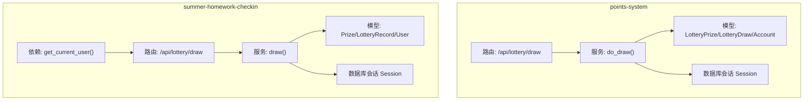
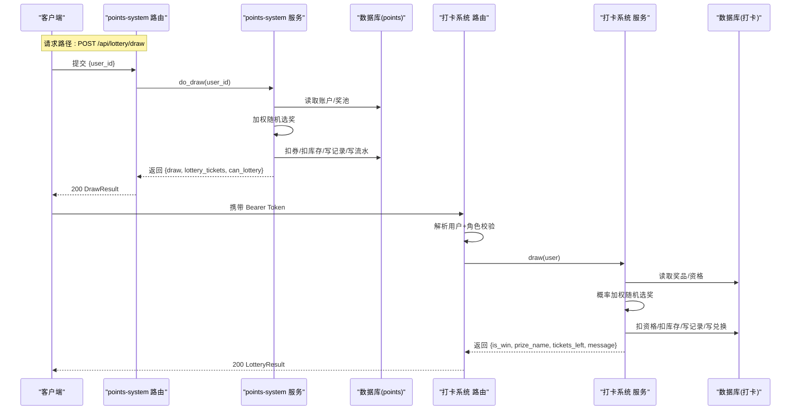
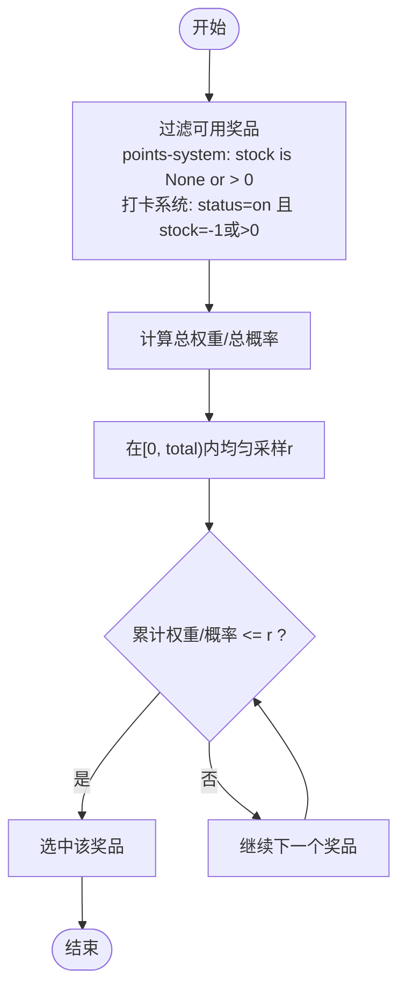
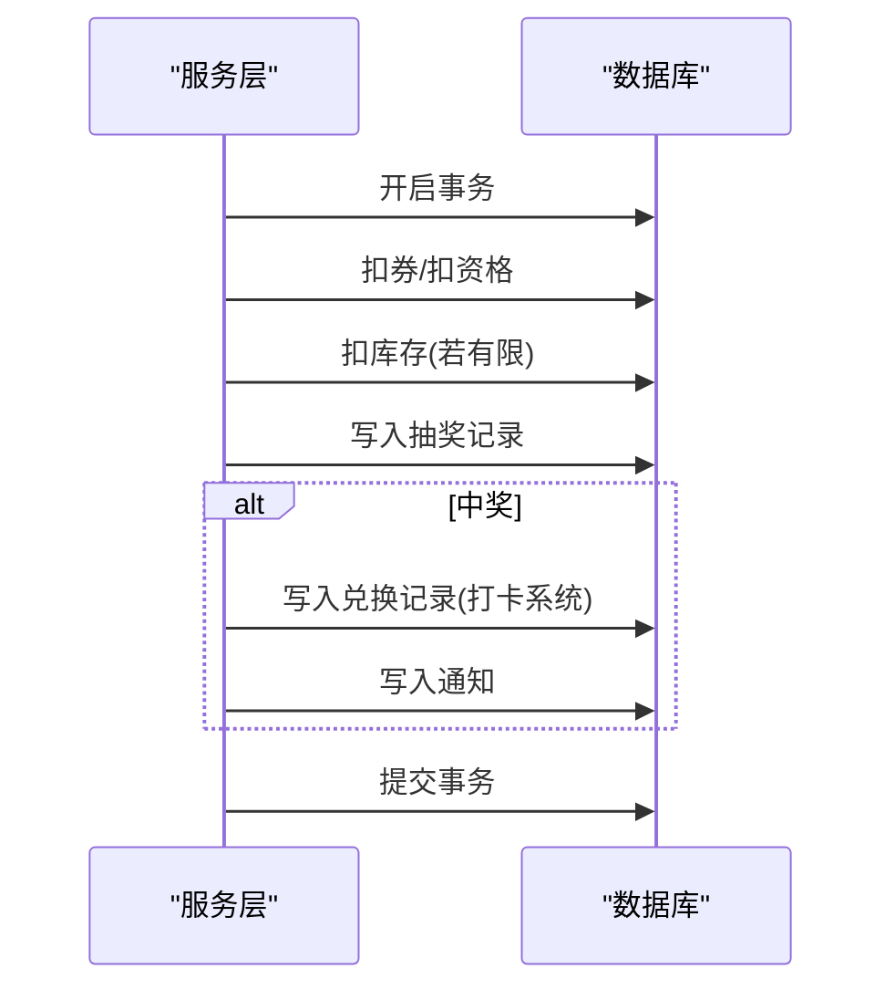
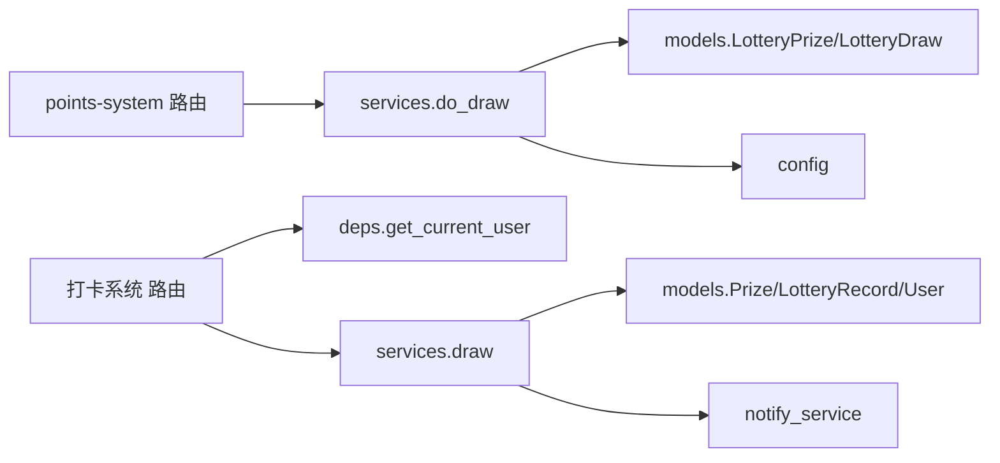

# 抽奖执行接口

<cite>
**本文引用的文件**
- [points-system/backend/app/routers/lottery.py](file://points-system/backend/app/routers/lottery.py)
- [points-system/backend/app/services/lottery_service.py](file://points-system/backend/app/services/lottery_service.py)
- [points-system/backend/app/schemas.py](file://points-system/backend/app/schemas.py)
- [points-system/backend/app/models.py](file://points-system/backend/app/models.py)
- [summer-homework-checkin/backend/app/routers/lottery.py](file://summer-homework-checkin/backend/app/routers/lottery.py)
- [summer-homework-checkin/backend/app/services/lottery_service.py](file://summer-homework-checkin/backend/app/services/lottery_service.py)
- [summer-homework-checkin/backend/app/schemas.py](file://summer-homework-checkin/backend/app/schemas.py)
- [summer-homework-checkin/backend/app/deps.py](file://summer-homework-checkin/backend/app/deps.py)
- [summer-homework-checkin/backend/app/models.py](file://summer-homework-checkin/backend/app/models.py)
</cite>

## 目录
1. [简介](#简介)
2. [项目结构](#项目结构)
3. [核心组件](#核心组件)
4. [架构总览](#架构总览)
5. [详细组件分析](#详细组件分析)
6. [依赖关系分析](#依赖关系分析)
7. [性能与并发控制](#性能与并发控制)
8. [故障排查指南](#故障排查指南)
9. [结论](#结论)
10. [附录：API 定义与调用示例](#附录api-定义与调用示例)

## 简介
本文件聚焦于“抽奖执行”的 API 接口 `/api/lottery/draw`，覆盖两个子系统的实现差异与共性：
- points-system（积分系统）：基于“抽奖券”的加权随机抽奖，返回包含抽奖记录、剩余券数与是否仍可抽奖的标志。
- summer-homework-checkin（打卡系统）：基于“抽奖资格次数”的概率加权随机抽奖，返回中奖状态、奖品信息、剩余次数与消息提示。

文档将详细说明权限验证、资格检查、随机算法、结果结构、并发控制、库存扣减与事务处理等关键实现点，并提供完整的请求/响应示例与错误场景说明。

## 项目结构
本次分析涉及以下模块与职责：
- 路由层：接收 HTTP 请求，进行参数校验与权限检查，调用服务层完成业务逻辑。
- 服务层：封装抽奖核心逻辑（资格校验、随机选奖、库存扣减、记录落库）。
- 数据模型与模式：定义数据库表结构与 Pydantic 输入输出模型。
- 认证依赖：在打卡系统中通过 Bearer Token 解析当前用户并做角色校验。

图示来源
- [points-system/backend/app/routers/lottery.py:24-37](file://points-system/backend/app/routers/lottery.py#L24-L37)
- [points-system/backend/app/services/lottery_service.py:117-174](file://points-system/backend/app/services/lottery_service.py#L117-L174)
- [summer-homework-checkin/backend/app/routers/lottery.py:25-29](file://summer-homework-checkin/backend/app/routers/lottery.py#L25-L29)
- [summer-homework-checkin/backend/app/services/lottery_service.py:9-77](file://summer-homework-checkin/backend/app/services/lottery_service.py#L9-L77)
- [summer-homework-checkin/backend/app/deps.py:13-25](file://summer-homework-checkin/backend/app/deps.py#L13-L25)

章节来源
- [points-system/backend/app/routers/lottery.py:1-55](file://points-system/backend/app/routers/lottery.py#L1-L55)
- [summer-homework-checkin/backend/app/routers/lottery.py:1-30](file://summer-homework-checkin/backend/app/routers/lottery.py#L1-L30)

## 核心组件
- 路由层
  - points-system：POST /api/lottery/draw，入参为 DrawRequest（user_id），返回 DrawResult。
  - summer-homework-checkin：POST /api/lottery/draw，自动从 Bearer Token 解析当前用户，返回 LotteryResult。
- 服务层
  - points-system：do_draw(db, user_id)，负责券余额校验、加权随机选奖、库存扣减、记录写入与流水生成。
  - summer-homework-checkin：draw(db, user)，负责资格次数校验、概率加权随机选奖、库存扣减、记录写入与通知。
- 数据模型与模式
  - points-system：LotteryPrize、LotteryDraw、LotteryTicketLedger、PointAccount 等；Pydantic 模型 DrawResult、LotteryDrawOut 等。
  - summer-homework-checkin：Prize、LotteryRecord、User；Pydantic 模型 LotteryResult、LotteryRecordOut 等。
- 认证依赖
  - summer-homework-checkin：get_current_user 使用 HTTPBearer 解析令牌，校验用户存在性，并在路由中限制仅学生可抽奖。

章节来源
- [points-system/backend/app/routers/lottery.py:24-37](file://points-system/backend/app/routers/lottery.py#L24-L37)
- [points-system/backend/app/services/lottery_service.py:117-174](file://points-system/backend/app/services/lottery_service.py#L117-L174)
- [points-system/backend/app/schemas.py:139-147](file://points-system/backend/app/schemas.py#L139-L147)
- [summer-homework-checkin/backend/app/routers/lottery.py:25-29](file://summer-homework-checkin/backend/app/routers/lottery.py#L25-L29)
- [summer-homework-checkin/backend/app/services/lottery_service.py:9-77](file://summer-homework-checkin/backend/app/services/lottery_service.py#L9-L77)
- [summer-homework-checkin/backend/app/schemas.py:140-146](file://summer-homework-checkin/backend/app/schemas.py#L140-L146)
- [summer-homework-checkin/backend/app/deps.py:13-25](file://summer-homework-checkin/backend/app/deps.py#L13-L25)

## 架构总览
下图展示两个子系统的抽奖执行流程对比：

图示来源
- [points-system/backend/app/routers/lottery.py:24-37](file://points-system/backend/app/routers/lottery.py#L24-L37)
- [points-system/backend/app/services/lottery_service.py:117-174](file://points-system/backend/app/services/lottery_service.py#L117-L174)
- [summer-homework-checkin/backend/app/routers/lottery.py:25-29](file://summer-homework-checkin/backend/app/routers/lottery.py#L25-L29)
- [summer-homework-checkin/backend/app/services/lottery_service.py:9-77](file://summer-homework-checkin/backend/app/services/lottery_service.py#L9-L77)

## 详细组件分析

### 权限与资格校验
- points-system
  - 路由层先校验用户是否存在，不存在则返回 404。
  - 服务层依据账户的抽奖券数量判断是否满足抽奖条件（需至少 TICKETS_PER_DRAW 张）。
- summer-homework-checkin
  - 路由层通过依赖注入 get_current_user 解析 Bearer Token，若未提供或无效返回 401。
  - 额外校验用户角色必须为 student，否则返回 403。
  - 服务层检查用户抽奖资格次数 > 0，否则返回 400。

章节来源
- [points-system/backend/app/routers/lottery.py:24-37](file://points-system/backend/app/routers/lottery.py#L24-L37)
- [points-system/backend/app/services/lottery_service.py:117-127](file://points-system/backend/app/services/lottery_service.py#L117-L127)
- [summer-homework-checkin/backend/app/routers/lottery.py:25-29](file://summer-homework-checkin/backend/app/routers/lottery.py#L25-L29)
- [summer-homework-checkin/backend/app/services/lottery_service.py:10-12](file://summer-homework-checkin/backend/app/services/lottery_service.py#L10-L12)
- [summer-homework-checkin/backend/app/deps.py:13-25](file://summer-homework-checkin/backend/app/deps.py#L13-L25)

### 随机算法与公平性
- points-system（加权随机）
  - 过滤出库存有效（stock 为 None 或 > 0）的奖品集合。
  - 计算总权重 total_weight = sum(weight)。
  - 在 [0, total_weight) 区间均匀采样 r，按累计权重累加比较，命中即返回对应奖品。
  - 公平性保证：每个可用奖品被命中的概率与其 weight 成正比；不限量奖品（如“谢谢参与”）确保不会无奖可选。
- summer-homework-checkin（概率加权随机）
  - 过滤出状态为 on 且库存有效（stock == -1 或 stock > 0）的奖品集合。
  - 取 probability 作为权重，计算总权重 total，在 [0, total) 区间均匀采样 r，按累计概率累加比较，命中即返回对应奖品。
  - 公平性保证：每个可用奖品被命中的概率与其 probability 成正比。

图示来源
- [points-system/backend/app/services/lottery_service.py:101-114](file://points-system/backend/app/services/lottery_service.py#L101-L114)
- [summer-homework-checkin/backend/app/services/lottery_service.py:14-34](file://summer-homework-checkin/backend/app/services/lottery_service.py#L14-L34)

章节来源
- [points-system/backend/app/services/lottery_service.py:101-114](file://points-system/backend/app/services/lottery_service.py#L101-L114)
- [summer-homework-checkin/backend/app/services/lottery_service.py:14-34](file://summer-homework-checkin/backend/app/services/lottery_service.py#L14-L34)

### 库存扣减与事务处理
- points-system
  - 在同一次 SQLAlchemy Session 事务内：扣减抽奖券 → 选择奖品 → 扣有限库存 → 写入抽奖记录 → 写入抽奖券消耗流水 → commit。
  - 捕获 IntegrityError 回滚并返回 409 冲突提示。
- summer-homework-checkin
  - 在同一次 Session 事务内：扣减抽奖资格 → 选择奖品 → 扣有限库存 → 写入抽奖记录 → 若中奖则创建 Redemption 记录 → commit。
  - 同时写入站内通知（学生与家长）。

图示来源
- [points-system/backend/app/services/lottery_service.py:129-166](file://points-system/backend/app/services/lottery_service.py#L129-L166)
- [summer-homework-checkin/backend/app/services/lottery_service.py:35-56](file://summer-homework-checkin/backend/app/services/lottery_service.py#L35-L56)

章节来源
- [points-system/backend/app/services/lottery_service.py:129-166](file://points-system/backend/app/services/lottery_service.py#L129-L166)
- [summer-homework-checkin/backend/app/services/lottery_service.py:35-56](file://summer-homework-checkin/backend/app/services/lottery_service.py#L35-L56)

### 并发控制机制
- points-system
  - 使用进程内锁 _account_lock 对同一进程的“读-改-写”串行化，避免 SQLite 下丢失更新问题。
  - 注释建议多进程/多实例部署时改用数据库悲观锁（如 PostgreSQL with_for_update）。
- summer-homework-checkin
  - 未显式使用进程内锁；依赖单事务原子性与数据库约束保障一致性。在高并发场景建议引入行级锁或分布式锁以避免超卖。

章节来源
- [points-system/backend/app/services/lottery_service.py:23-27](file://points-system/backend/app/services/lottery_service.py#L23-L27)
- [points-system/backend/app/services/lottery_service.py:117-127](file://points-system/backend/app/services/lottery_service.py#L117-L127)

### 结果返回结构
- points-system
  - 返回 DrawResult，包含：
    - draw: LotteryDrawOut（id、user_id、prize_name、is_win、created_at）
    - lottery_tickets: 剩余抽奖券数量
    - can_lottery: 是否仍满足抽奖条件（券≥TICKETS_PER_DRAW）
- summer-homework-checkin
  - 返回 LotteryResult，包含：
    - is_win: 是否中奖
    - prize_name: 奖品名称（可能为空）
    - prize_id: 奖品 ID（可能为空）
    - tickets_left: 剩余抽奖资格次数
    - message: 友好提示信息

章节来源
- [points-system/backend/app/schemas.py:131-147](file://points-system/backend/app/schemas.py#L131-L147)
- [summer-homework-checkin/backend/app/schemas.py:140-146](file://summer-homework-checkin/backend/app/schemas.py#L140-L146)

## 依赖关系分析
- 路由与服务
  - points-system 路由依赖 services.lottery_service.do_draw，后者依赖 models 与 config。
  - 打卡系统路由依赖 deps.get_current_user 与 services.lottery_service.draw，后者依赖 models 与 notify_service。
- 数据访问
  - 两者均通过 SQLAlchemy Session 在同一事务内完成读写，确保一致性。
- 外部集成
  - 打卡系统在成功中奖后调用 notify 与 notify_parents_of_student 发送站内通知。

图示来源
- [points-system/backend/app/routers/lottery.py:24-37](file://points-system/backend/app/routers/lottery.py#L24-L37)
- [points-system/backend/app/services/lottery_service.py:117-174](file://points-system/backend/app/services/lottery_service.py#L117-L174)
- [summer-homework-checkin/backend/app/routers/lottery.py:25-29](file://summer-homework-checkin/backend/app/routers/lottery.py#L25-L29)
- [summer-homework-checkin/backend/app/services/lottery_service.py:9-77](file://summer-homework-checkin/backend/app/services/lottery_service.py#L9-L77)
- [summer-homework-checkin/backend/app/deps.py:13-25](file://summer-homework-checkin/backend/app/deps.py#L13-L25)

章节来源
- [points-system/backend/app/routers/lottery.py:24-37](file://points-system/backend/app/routers/lottery.py#L24-L37)
- [summer-homework-checkin/backend/app/routers/lottery.py:25-29](file://summer-homework-checkin/backend/app/routers/lottery.py#L25-L29)

## 性能与并发控制
- 随机算法复杂度
  - 线性扫描累计权重/概率，时间复杂度 O(n)，n 为可用奖品数量。通常 n 较小，性能可接受。
- 并发安全
  - points-system 使用进程内锁串行化账户操作，适合单机部署；多实例需数据库悲观锁。
  - 打卡系统在高并发下建议增加行级锁或分布式锁，防止库存超卖与重复扣资格。
- 事务边界
  - 所有“读-改-写”在同一事务内完成，失败统一回滚，避免半更新。

章节来源
- [points-system/backend/app/services/lottery_service.py:101-114](file://points-system/backend/app/services/lottery_service.py#L101-L114)
- [summer-homework-checkin/backend/app/services/lottery_service.py:14-34](file://summer-homework-checkin/backend/app/services/lottery_service.py#L14-L34)
- [points-system/backend/app/services/lottery_service.py:23-27](file://points-system/backend/app/services/lottery_service.py#L23-L27)

## 故障排查指南
- 常见错误码与原因
  - 401 未认证：打卡系统缺少或无效 Bearer Token。
  - 403 无权限：打卡系统用户角色非 student。
  - 400 资格不足：打卡系统抽奖资格为 0。
  - 404 用户不存在：points-system 传入的 user_id 不存在。
  - 409 冲突：points-system 抽奖券不足或事务冲突（IntegrityError）。
  - 500 内部错误：points-system 奖池无可发放奖品（理论上不应发生）。
- 定位步骤
  - 确认请求路径与鉴权方式是否正确。
  - 检查数据库中用户余额/资格、奖品库存与状态。
  - 查看日志中事务提交与异常堆栈，确认是否触发 IntegrityError。
  - 核对配置项（如 TICKETS_PER_DRAW、POINTS_PER_TICKET）是否符合预期。

章节来源
- [summer-homework-checkin/backend/app/routers/lottery.py:25-29](file://summer-homework-checkin/backend/app/routers/lottery.py#L25-L29)
- [summer-homework-checkin/backend/app/deps.py:13-25](file://summer-homework-checkin/backend/app/deps.py#L13-L25)
- [points-system/backend/app/routers/lottery.py:24-37](file://points-system/backend/app/routers/lottery.py#L24-L37)
- [points-system/backend/app/services/lottery_service.py:123-136](file://points-system/backend/app/services/lottery_service.py#L123-L136)

## 结论
- 两套实现均采用“同事务内原子更新”的策略，保证券/资格与库存的一致性。
- 随机算法遵循“权重/概率正比”原则，具备良好公平性。
- points-system 通过进程内锁提升并发安全性，建议在多实例部署时升级为数据库悲观锁。
- 打卡系统在成功中奖后联动通知与兑换记录，形成完整闭环。

## 附录：API 定义与调用示例

### 接口定义
- 基础路径
  - points-system: POST /api/lottery/draw
  - summer-homework-checkin: POST /api/lottery/draw
- 请求体
  - points-system: DrawRequest（user_id: int）
  - summer-homework-checkin: 无请求体，通过 Bearer Token 识别用户
- 响应体
  - points-system: DrawResult
    - draw: LotteryDrawOut（id、user_id、prize_name、is_win、created_at）
    - lottery_tickets: int
    - can_lottery: bool
  - summer-homework-checkin: LotteryResult
    - is_win: bool
    - prize_name: string | null
    - prize_id: int | null
    - tickets_left: int
    - message: string

章节来源
- [points-system/backend/app/routers/lottery.py:24-37](file://points-system/backend/app/routers/lottery.py#L24-L37)
- [points-system/backend/app/schemas.py:139-147](file://points-system/backend/app/schemas.py#L139-L147)
- [summer-homework-checkin/backend/app/routers/lottery.py:25-29](file://summer-homework-checkin/backend/app/routers/lottery.py#L25-L29)
- [summer-homework-checkin/backend/app/schemas.py:140-146](file://summer-homework-checkin/backend/app/schemas.py#L140-L146)

### 调用示例（成功）
- points-system
  - 请求
    - 方法: POST
    - 路径: /api/lottery/draw
    - 主体: {"user_id": 123}
  - 响应
    - 状态码: 200
    - 主体:
      - draw: {id, user_id, prize_name, is_win, created_at}
      - lottery_tickets: 剩余券数
      - can_lottery: true/false
- summer-homework-checkin
  - 请求
    - 方法: POST
    - 路径: /api/lottery/draw
    - 头部: Authorization: Bearer <token>
  - 响应
    - 状态码: 200
    - 主体:
      - is_win: true/false
      - prize_name: 奖品名或空
      - prize_id: 奖品ID或空
      - tickets_left: 剩余次数
      - message: 提示语

### 调用示例（失败）
- 未认证（打卡系统）
  - 状态码: 401
  - 详情: 未提供认证令牌/令牌无效或已过期
- 无权限（打卡系统）
  - 状态码: 403
  - 详情: 仅学生可抽奖/无权限访问该资源
- 资格不足（打卡系统）
  - 状态码: 400
  - 详情: 暂无可用抽奖资格
- 用户不存在（points-system）
  - 状态码: 404
  - 详情: 用户不存在
- 券不足/冲突（points-system）
  - 状态码: 409
  - 详情: 抽奖券不足/抽奖处理冲突，请重试
- 内部错误（points-system）
  - 状态码: 500
  - 详情: 奖池暂无可发放奖品

章节来源
- [summer-homework-checkin/backend/app/deps.py:13-25](file://summer-homework-checkin/backend/app/deps.py#L13-L25)
- [summer-homework-checkin/backend/app/routers/lottery.py:25-29](file://summer-homework-checkin/backend/app/routers/lottery.py#L25-L29)
- [summer-homework-checkin/backend/app/services/lottery_service.py:10-12](file://summer-homework-checkin/backend/app/services/lottery_service.py#L10-L12)
- [points-system/backend/app/routers/lottery.py:24-37](file://points-system/backend/app/routers/lottery.py#L24-L37)
- [points-system/backend/app/services/lottery_service.py:123-136](file://points-system/backend/app/services/lottery_service.py#L123-L136)