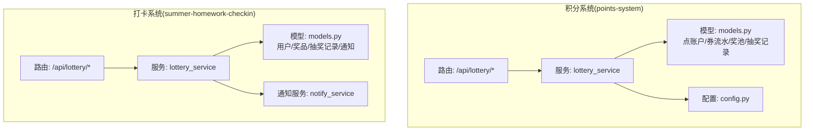
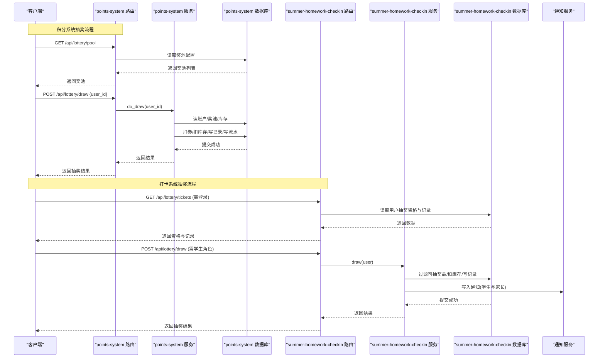
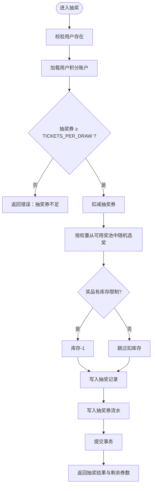
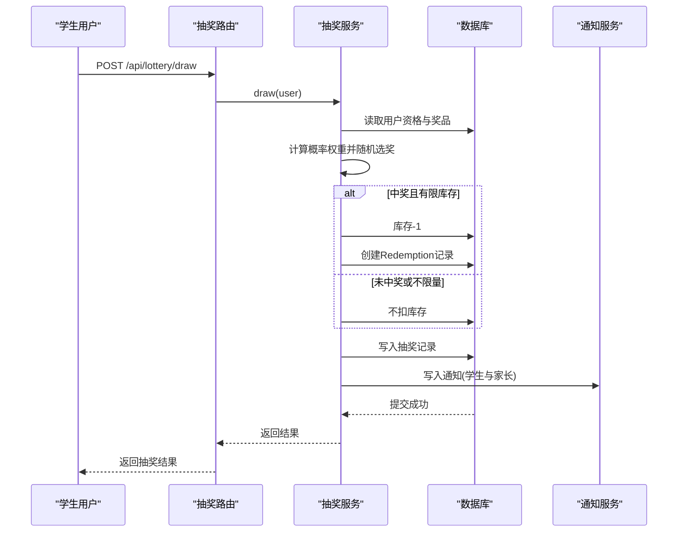
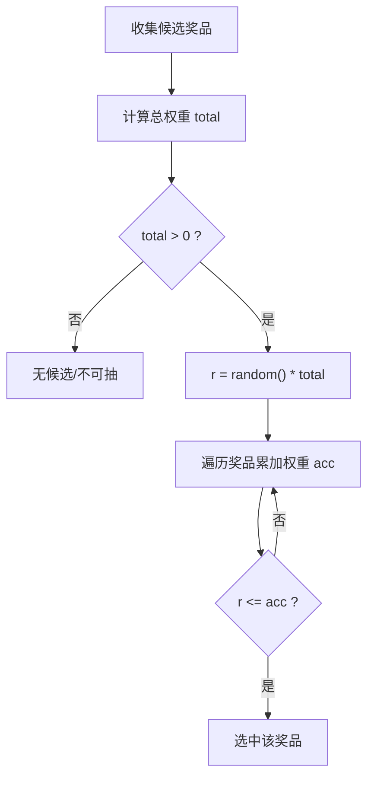
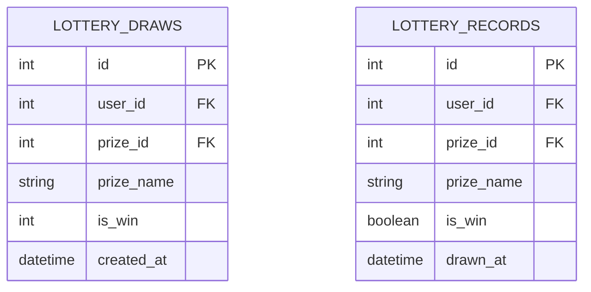
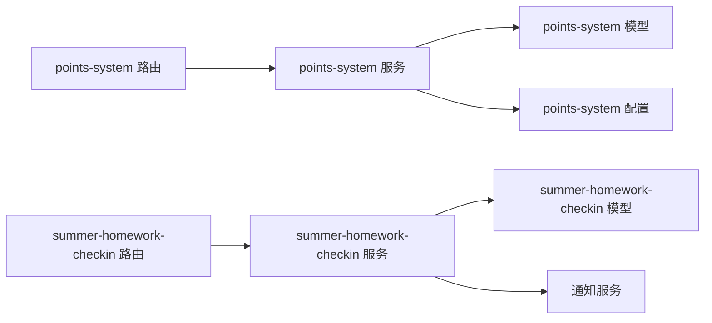

# 抽奖系统接口

<cite>
**本文引用的文件**   
- [points-system/backend/app/routers/lottery.py](file://points-system/backend/app/routers/lottery.py)
- [points-system/backend/app/services/lottery_service.py](file://points-system/backend/app/services/lottery_service.py)
- [points-system/backend/app/models.py](file://points-system/backend/app/models.py)
- [points-system/backend/app/schemas.py](file://points-system/backend/app/schemas.py)
- [points-system/backend/app/config.py](file://points-system/backend/app/config.py)
- [summer-homework-checkin/backend/app/routers/lottery.py](file://summer-homework-checkin/backend/app/routers/lottery.py)
- [summer-homework-checkin/backend/app/services/lottery_service.py](file://summer-homework-checkin/backend/app/services/lottery_service.py)
- [summer-homework-checkin/backend/app/models.py](file://summer-homework-checkin/backend/app/models.py)
- [summer-homework-checkin/backend/app/schemas.py](file://summer-homework-checkin/backend/app/schemas.py)
- [summer-homework-checkin/backend/app/services/notify_service.py](file://summer-homework-checkin/backend/app/services/notify_service.py)
</cite>

## 目录
1. [简介](#简介)
2. [项目结构](#项目结构)
3. [核心组件](#核心组件)
4. [架构总览](#架构总览)
5. [详细组件分析](#详细组件分析)
6. [依赖关系分析](#依赖关系分析)
7. [性能与并发控制](#性能与并发控制)
8. [防作弊与异常处理](#防作弊与异常处理)
9. [与积分系统与奖品管理的集成](#与积分系统与奖品管理的集成)
10. [故障排查指南](#故障排查指南)
11. [结论](#结论)

## 简介
本文件为“抽奖系统”的API接口文档，覆盖两个子系统的抽奖能力：
- 积分兑换抽奖券并参与加权随机抽奖（points-system）
- 基于打卡获得抽奖资格的概率抽奖（summer-homework-checkin）

文档重点包括：
- 抽奖券获取、使用与管理接口定义
- 加权随机算法实现原理与概率控制机制
- 抽奖资格检查、奖品库存管理与中奖结果生成逻辑
- 抽奖记录存储结构与查询方式
- 完整抽奖流程示例（资格验证、随机抽取、库存扣减、结果通知）
- 并发控制、防作弊机制与异常处理方案
- 与用户积分系统和奖品管理模块的集成方式

## 项目结构
本项目包含两套独立的抽奖实现，分别位于不同后端工程中：
- points-system：通过积分兑换抽奖券，再消耗券进行加权随机抽奖
- summer-homework-checkin：通过连续打卡累积抽奖资格，按概率权重随机抽取奖品

图表来源
- [points-system/backend/app/routers/lottery.py:1-55](file://points-system/backend/app/routers/lottery.py#L1-L55)
- [points-system/backend/app/services/lottery_service.py:1-174](file://points-system/backend/app/services/lottery_service.py#L1-L174)
- [points-system/backend/app/models.py:1-151](file://points-system/backend/app/models.py#L1-L151)
- [points-system/backend/app/config.py:1-17](file://points-system/backend/app/config.py#L1-L17)
- [summer-homework-checkin/backend/app/routers/lottery.py:1-30](file://summer-homework-checkin/backend/app/routers/lottery.py#L1-L30)
- [summer-homework-checkin/backend/app/services/lottery_service.py:1-77](file://summer-homework-checkin/backend/app/services/lottery_service.py#L1-L77)
- [summer-homework-checkin/backend/app/models.py:1-212](file://summer-homework-checkin/backend/app/models.py#L1-L212)
- [summer-homework-checkin/backend/app/services/notify_service.py:1-20](file://summer-homework-checkin/backend/app/services/notify_service.py#L1-L20)

章节来源
- [points-system/backend/app/routers/lottery.py:1-55](file://points-system/backend/app/routers/lottery.py#L1-L55)
- [summer-homework-checkin/backend/app/routers/lottery.py:1-30](file://summer-homework-checkin/backend/app/routers/lottery.py#L1-L30)

## 核心组件
- 路由层
  - points-system：提供奖池展示、抽奖、抽奖记录查询等接口
  - summer-homework-checkin：提供抽奖资格与记录查询、抽奖执行接口
- 服务层
  - points-system：积分兑换抽奖券、加权随机抽奖、库存扣减、流水落库
  - summer-homework-checkin：资格校验、概率加权随机、库存扣减、创建兑换记录与通知
- 数据模型
  - points-system：用户、积分账户、积分流水、抽奖券流水、抽奖奖池、抽奖记录
  - summer-homework-checkin：用户、奖品、抽奖记录、通知、家长绑定
- 配置
  - points-system：积分换券比例、每次抽奖消耗券数

章节来源
- [points-system/backend/app/services/lottery_service.py:1-174](file://points-system/backend/app/services/lottery_service.py#L1-L174)
- [summer-homework-checkin/backend/app/services/lottery_service.py:1-77](file://summer-homework-checkin/backend/app/services/lottery_service.py#L1-L77)
- [points-system/backend/app/models.py:1-151](file://points-system/backend/app/models.py#L1-L151)
- [summer-homework-checkin/backend/app/models.py:1-212](file://summer-homework-checkin/backend/app/models.py#L1-L212)
- [points-system/backend/app/config.py:1-17](file://points-system/backend/app/config.py#L1-L17)

## 架构总览
下图展示了两个子系统在请求路径、服务调用与数据落库上的整体交互。

图表来源
- [points-system/backend/app/routers/lottery.py:11-37](file://points-system/backend/app/routers/lottery.py#L11-L37)
- [points-system/backend/app/services/lottery_service.py:117-174](file://points-system/backend/app/services/lottery_service.py#L117-L174)
- [summer-homework-checkin/backend/app/routers/lottery.py:13-29](file://summer-homework-checkin/backend/app/routers/lottery.py#L13-L29)
- [summer-homework-checkin/backend/app/services/lottery_service.py:9-77](file://summer-homework-checkin/backend/app/services/lottery_service.py#L9-L77)
- [summer-homework-checkin/backend/app/services/notify_service.py:5-20](file://summer-homework-checkin/backend/app/services/notify_service.py#L5-L20)

## 详细组件分析

### 积分系统(points-system)抽奖接口
- 接口概览
  - 获取奖池：GET /api/lottery/pool
  - 发起抽奖：POST /api/lottery/draw
  - 查询抽奖记录：GET /api/lottery/draws?user_id=...
- 请求/响应要点
  - 抽奖请求体包含 user_id
  - 返回包含本次抽奖详情、剩余抽奖券数量、是否仍满足抽奖条件
- 业务规则
  - 抽奖权限由账户中抽奖券余额派生（≥1即解锁）
  - 每次抽奖固定消耗 TICKETS_PER_DRAW 张券
  - 有限库存奖品扣库存；不限量奖品(stock为None)不扣库存
  - 所有变更在同一事务内完成，保证一致性

图表来源
- [points-system/backend/app/routers/lottery.py:24-37](file://points-system/backend/app/routers/lottery.py#L24-L37)
- [points-system/backend/app/services/lottery_service.py:117-174](file://points-system/backend/app/services/lottery_service.py#L117-L174)
- [points-system/backend/app/config.py:12-17](file://points-system/backend/app/config.py#L12-L17)

章节来源
- [points-system/backend/app/routers/lottery.py:11-55](file://points-system/backend/app/routers/lottery.py#L11-L55)
- [points-system/backend/app/services/lottery_service.py:101-174](file://points-system/backend/app/services/lottery_service.py#L101-L174)
- [points-system/backend/app/schemas.py:122-147](file://points-system/backend/app/schemas.py#L122-L147)
- [points-system/backend/app/config.py:12-17](file://points-system/backend/app/config.py#L12-L17)

### 打卡系统(summer-homework-checkin)抽奖接口
- 接口概览
  - 查询抽奖资格与记录：GET /api/lottery/tickets（需登录）
  - 发起抽奖：POST /api/lottery/draw（仅学生角色）
- 业务规则
  - 资格校验：用户抽奖资格 > 0 方可抽奖
  - 候选奖品：状态为 on 且 stock=-1 或 stock>0
  - 概率加权：按 probability 权重随机选择，total>0 时生效
  - 中奖后：若有限库存则扣库存，并创建 Redemption 记录
  - 通知：向学生与家长发送站内通知

图表来源
- [summer-homework-checkin/backend/app/routers/lottery.py:25-29](file://summer-homework-checkin/backend/app/routers/lottery.py#L25-L29)
- [summer-homework-checkin/backend/app/services/lottery_service.py:9-77](file://summer-homework-checkin/backend/app/services/lottery_service.py#L9-L77)
- [summer-homework-checkin/backend/app/services/notify_service.py:5-20](file://summer-homework-checkin/backend/app/services/notify_service.py#L5-L20)

章节来源
- [summer-homework-checkin/backend/app/routers/lottery.py:13-29](file://summer-homework-checkin/backend/app/routers/lottery.py#L13-L29)
- [summer-homework-checkin/backend/app/services/lottery_service.py:9-77](file://summer-homework-checkin/backend/app/services/lottery_service.py#L9-L77)
- [summer-homework-checkin/backend/app/schemas.py:140-154](file://summer-homework-checkin/backend/app/schemas.py#L140-L154)

### 加权随机算法与概率控制
- points-system
  - 筛选可用奖品：stock为None或>0
  - 计算总权重 total_weight = sum(weight)
  - 生成随机值 r ∈ [0, total_weight)，累计权重匹配首个区间
- summer-homework-checkin
  - 筛选候选奖品：status="on" 且 stock=-1 或 stock>0
  - 权重为 probability，计算 total = sum(probability)
  - 生成 r ∈ [0, total)，累计匹配选中奖品

图表来源
- [points-system/backend/app/services/lottery_service.py:101-115](file://points-system/backend/app/services/lottery_service.py#L101-L115)
- [summer-homework-checkin/backend/app/services/lottery_service.py:14-34](file://summer-homework-checkin/backend/app/services/lottery_service.py#L14-L34)

章节来源
- [points-system/backend/app/services/lottery_service.py:101-115](file://points-system/backend/app/services/lottery_service.py#L101-L115)
- [summer-homework-checkin/backend/app/services/lottery_service.py:14-34](file://summer-homework-checkin/backend/app/services/lottery_service.py#L14-L34)

### 抽奖记录存储结构与查询
- points-system
  - 表：lottery_draws
  - 字段：id、user_id、prize_id、prize_name、is_win、created_at
  - 查询：按 user_id 倒序返回最近记录
- summer-homework-checkin
  - 表：lottery_records
  - 字段：id、user_id、prize_id、prize_name、is_win、drawn_at
  - 查询：按 drawn_at 倒序返回最近记录

图表来源
- [points-system/backend/app/models.py:139-151](file://points-system/backend/app/models.py#L139-L151)
- [summer-homework-checkin/backend/app/models.py:126-139](file://summer-homework-checkin/backend/app/models.py#L126-L139)

章节来源
- [points-system/backend/app/routers/lottery.py:40-55](file://points-system/backend/app/routers/lottery.py#L40-L55)
- [summer-homework-checkin/backend/app/routers/lottery.py:13-22](file://summer-homework-checkin/backend/app/routers/lottery.py#L13-L22)

### 完整抽奖流程示例
- 积分系统流程
  - 前置：用户通过积分兑换抽奖券（见下一节）
  - 步骤：
    - 校验用户存在
    - 校验抽奖券余额 ≥ TICKETS_PER_DRAW
    - 同事务内扣券、随机选奖、扣库存（如有限）、写记录与流水、提交
    - 返回抽奖结果、剩余券数、是否仍可抽奖
- 打卡系统流程
  - 前置：学生拥有抽奖资格 > 0
  - 步骤：
    - 校验角色为学生
    - 过滤候选奖品并计算概率权重
    - 随机选奖，扣库存（如有限），写抽奖记录
    - 中奖则创建兑换记录，并向学生与家长写入通知
    - 返回结果与消息

章节来源
- [points-system/backend/app/services/lottery_service.py:117-174](file://points-system/backend/app/services/lottery_service.py#L117-L174)
- [summer-homework-checkin/backend/app/services/lottery_service.py:9-77](file://summer-homework-checkin/backend/app/services/lottery_service.py#L9-L77)

## 依赖关系分析
- 路由到服务
  - points-system：lottery 路由依赖 lottery_service 与 models、schemas、config
  - summer-homework-checkin：lottery 路由依赖 lottery_service、models、schemas、deps（鉴权）
- 服务到数据
  - points-system：读写 point_accounts、lottery_ticket_ledgers、lottery_prizes、lottery_draws
  - summer-homework-checkin：读写 users、prizes、lottery_records、notifications、redemptions
- 外部依赖
  - summer-homework-checkin：通知服务写入站内通知，并同步通知家长

图表来源
- [points-system/backend/app/routers/lottery.py:1-55](file://points-system/backend/app/routers/lottery.py#L1-L55)
- [points-system/backend/app/services/lottery_service.py:1-174](file://points-system/backend/app/services/lottery_service.py#L1-L174)
- [summer-homework-checkin/backend/app/routers/lottery.py:1-30](file://summer-homework-checkin/backend/app/routers/lottery.py#L1-L30)
- [summer-homework-checkin/backend/app/services/lottery_service.py:1-77](file://summer-homework-checkin/backend/app/services/lottery_service.py#L1-L77)
- [summer-homework-checkin/backend/app/services/notify_service.py:1-20](file://summer-homework-checkin/backend/app/services/notify_service.py#L1-L20)

章节来源
- [points-system/backend/app/models.py:1-151](file://points-system/backend/app/models.py#L1-L151)
- [summer-homework-checkin/backend/app/models.py:1-212](file://summer-homework-checkin/backend/app/models.py#L1-L212)

## 性能与并发控制
- 并发控制
  - points-system：使用进程内锁 _account_lock 串行化「读-改-写」，避免SQLite下丢失更新；多实例部署建议改用数据库悲观锁
  - summer-homework-checkin：当前实现未显式加锁，建议在热点场景引入行级锁或队列化抽奖任务
- 事务一致性
  - points-system：所有变更在同事务内提交，异常回滚，确保「扣券-选奖-扣库存-写记录-写流水」原子性
  - summer-homework-checkin：在单事务内完成扣资格、写记录与可选的库存扣减与通知写入
- 性能优化建议
  - 对高频查询字段建立索引（如 user_id、created_at、drawn_at）
  - 奖池与奖品缓存（注意失效策略）
  - 批量写入流水与通知（异步化）

章节来源
- [points-system/backend/app/services/lottery_service.py:23-27](file://points-system/backend/app/services/lottery_service.py#L23-L27)
- [points-system/backend/app/services/lottery_service.py:161-166](file://points-system/backend/app/services/lottery_service.py#L161-L166)
- [summer-homework-checkin/backend/app/services/lottery_service.py:56-57](file://summer-homework-checkin/backend/app/services/lottery_service.py#L56-L57)

## 防作弊与异常处理
- 防作弊
  - 资格校验：points-system 以券余额派生权限；summer-homework-checkin 要求用户角色为学生且资格>0
  - 库存保护：仅对有限库存奖品扣减；不限量奖品(stock=-1或None)不扣库存
  - 幂等与冲突：points-system 捕获 IntegrityError 返回冲突提示，建议前端重试
- 异常处理
  - 用户不存在：返回404
  - 积分/券不足：返回400或409
  - 奖池无可发放奖品：返回500兜底
  - 非学生角色：返回403

章节来源
- [points-system/backend/app/routers/lottery.py:24-37](file://points-system/backend/app/routers/lottery.py#L24-L37)
- [points-system/backend/app/services/lottery_service.py:132-136](file://points-system/backend/app/services/lottery_service.py#L132-L136)
- [summer-homework-checkin/backend/app/routers/lottery.py:25-29](file://summer-homework-checkin/backend/app/routers/lottery.py#L25-L29)
- [summer-homework-checkin/backend/app/services/lottery_service.py:11-12](file://summer-homework-checkin/backend/app/services/lottery_service.py#L11-L12)

## 与积分系统与奖品管理的集成
- 积分系统(points-system)
  - 积分兑换抽奖券：根据 POINTS_PER_TICKET 比例兑换，扣积分并增加抽奖券，同时写入积分支出流水与抽奖券发放流水
  - 抽奖消耗：TICKETS_PER_DRAW 张券，写入抽奖券消耗流水与抽奖记录
- 奖品管理
  - points-system：LotteryPrize 含 weight、stock、is_win、sort_order
  - summer-homework-checkin：Prize 含 probability、stock、status、is_lottery_ticket 等
- 通知集成
  - summer-homework-checkin：中奖后向学生与家长写入站内通知，便于前端展示

章节来源
- [points-system/backend/app/services/lottery_service.py:30-98](file://points-system/backend/app/services/lottery_service.py#L30-L98)
- [points-system/backend/app/models.py:125-151](file://points-system/backend/app/models.py#L125-L151)
- [summer-homework-checkin/backend/app/models.py:103-139](file://summer-homework-checkin/backend/app/models.py#L103-L139)
- [summer-homework-checkin/backend/app/services/notify_service.py:5-20](file://summer-homework-checkin/backend/app/services/notify_service.py#L5-L20)

## 故障排查指南
- 常见问题
  - 抽奖失败提示“处理冲突，请重试”：可能因并发导致唯一约束冲突，建议前端指数退避重试
  - “奖池暂无可发放奖品”：检查是否存在 stock=None 或 stock>0 的奖品
  - “抽奖券不足”：确认积分兑换是否成功、券流水是否正确
  - “仅学生可抽奖”：检查用户角色是否为 student
- 定位方法
  - 查看对应用户的积分流水与抽奖券流水，核对 balance_after 与 ref_type/ref_id
  - 查看抽奖记录与库存变动，确认是否按预期扣减
  - 检查通知是否写入，确认家长绑定关系是否存在

章节来源
- [points-system/backend/app/services/lottery_service.py:87-92](file://points-system/backend/app/services/lottery_service.py#L87-L92)
- [points-system/backend/app/services/lottery_service.py:161-166](file://points-system/backend/app/services/lottery_service.py#L161-L166)
- [summer-homework-checkin/backend/app/services/notify_service.py:16-20](file://summer-homework-checkin/backend/app/services/notify_service.py#L16-L20)

## 结论
本抽奖系统通过两条路径支持用户参与抽奖：
- 积分系统：以积分兑换抽奖券，再以券参与加权随机抽奖，具备完善的流水与事务保障
- 打卡系统：以打卡获得的抽奖资格参与概率加权抽奖，并在中奖后联动兑换与通知

两者均实现了库存保护、并发控制与异常处理，具备良好的可扩展性与可维护性。生产环境建议结合数据库悲观锁与异步通知进一步提升稳定性与吞吐。