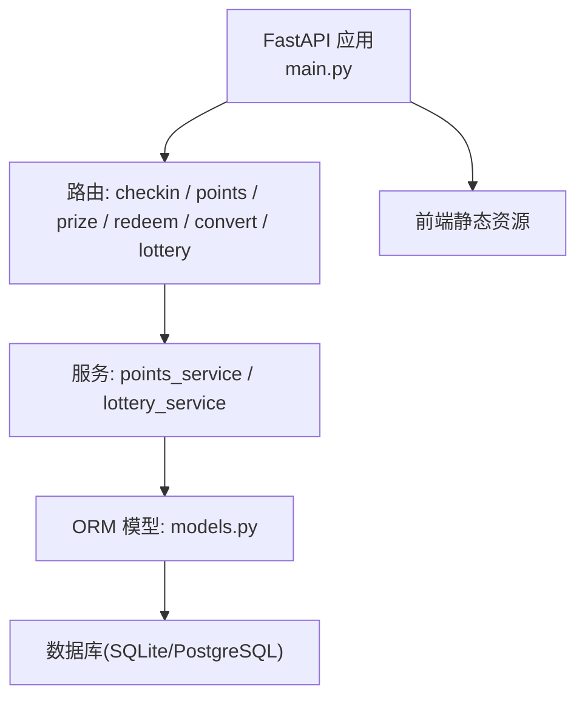
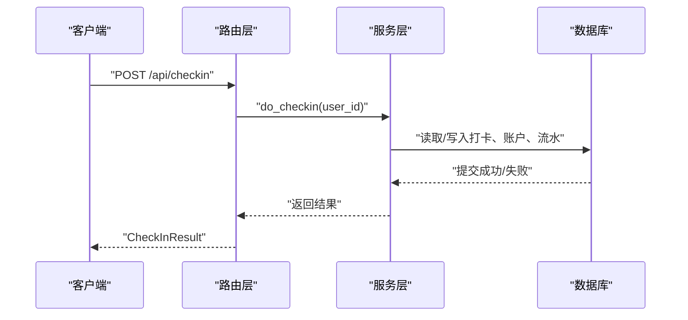
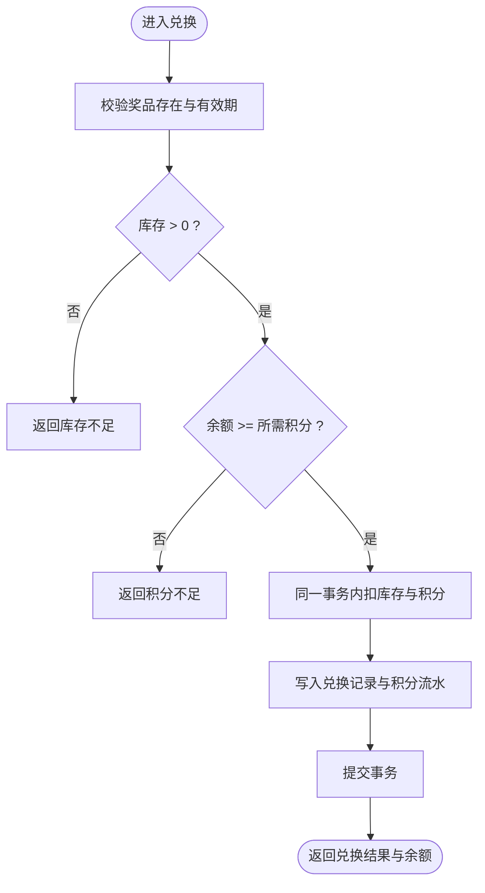
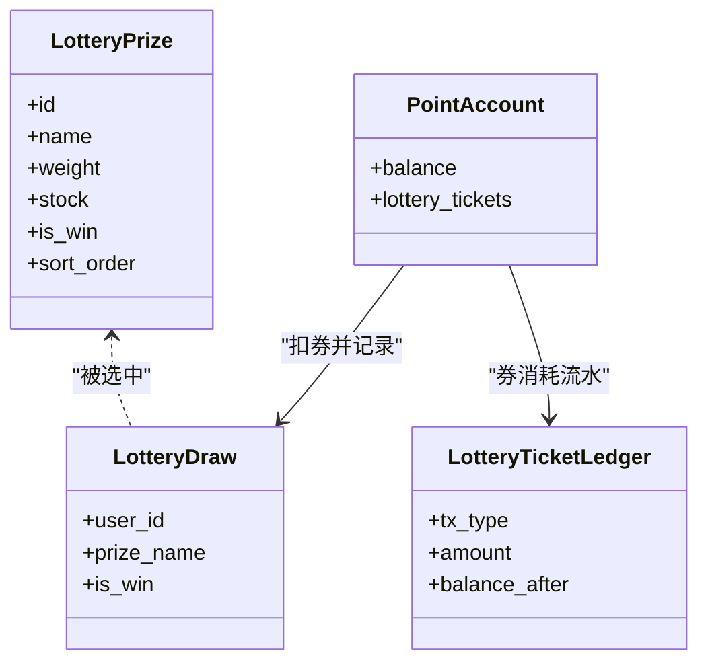
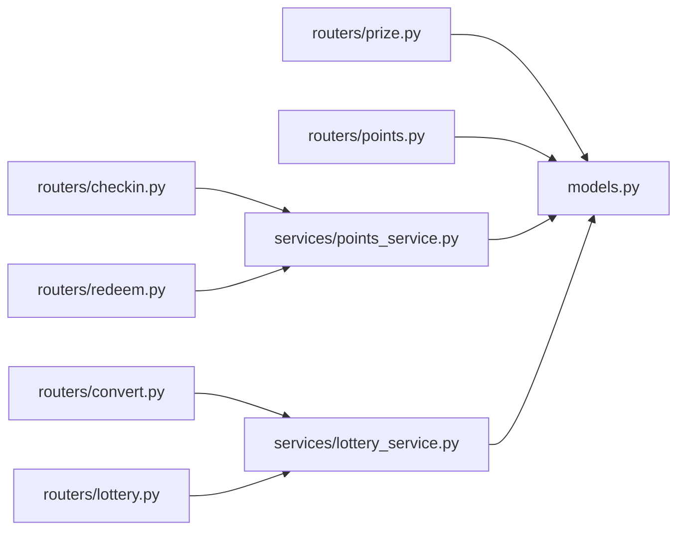

# 积分奖励接口

<cite>
**本文引用的文件**   
- [points-system/backend/app/main.py](file://points-system/backend/app/main.py)
- [points-system/backend/app/routers/points.py](file://points-system/backend/app/routers/points.py)
- [points-system/backend/app/routers/checkin.py](file://points-system/backend/app/routers/checkin.py)
- [points-system/backend/app/routers/prize.py](file://points-system/backend/app/routers/prize.py)
- [points-system/backend/app/routers/redeem.py](file://points-system/backend/app/routers/redeem.py)
- [points-system/backend/app/routers/convert.py](file://points-system/backend/app/routers/convert.py)
- [points-system/backend/app/routers/lottery.py](file://points-system/backend/app/routers/lottery.py)
- [points-system/backend/app/services/points_service.py](file://points-system/backend/app/services/points_service.py)
- [points-system/backend/app/services/lottery_service.py](file://points-system/backend/app/services/lottery_service.py)
- [points-system/backend/app/models.py](file://points-system/backend/app/models.py)
- [points-system/backend/app/schemas.py](file://points-system/backend/app/schemas.py)
- [summer-homework-checkin/backend/app/routers/checkin.py](file://summer-homework-checkin/backend/app/routers/checkin.py)
- [summer-homework-checkin/backend/app/services/checkin_service.py](file://summer-homework-checkin/backend/app/services/checkin_service.py)
</cite>

## 目录
1. [简介](#简介)
2. [项目结构](#项目结构)
3. [核心组件](#核心组件)
4. [架构总览](#架构总览)
5. [详细组件分析](#详细组件分析)
6. [依赖关系分析](#依赖关系分析)
7. [性能与并发安全](#性能与并发安全)
8. [故障排查指南](#故障排查指南)
9. [结论](#结论)
10. [附录：API 定义与示例](#附录api-定义与示例)

## 简介
本文件为“积分奖励与抽奖”系统的 API 文档，覆盖以下能力：
- 积分账户管理、连续打卡奖励、积分流水查询
- 奖品列表与兑换（库存检查、有效期校验、事务一致性）
- 积分兑换抽奖券、抽奖券发放与消耗流水
- 抽奖加权随机算法、库存管理与中奖概率控制
- 抽奖记录与兑换历史查询
- 与打卡系统的数据同步与状态一致性说明

## 项目结构
后端采用 FastAPI + SQLAlchemy 的模块化分层：
- 路由层：按功能划分 routers（checkin、points、prize、redeem、convert、lottery）
- 服务层：业务逻辑集中在 services（points_service、lottery_service）
- 数据模型：models 定义表结构与约束
- 请求/响应模型：schemas 定义 Pydantic 校验与返回结构
- 应用入口：main.py 注册路由、挂载静态资源、初始化数据库

图表来源
- [points-system/backend/app/main.py:1-33](file://points-system/backend/app/main.py#L1-L33)
- [points-system/backend/app/routers/points.py:1-28](file://points-system/backend/app/routers/points.py#L1-L28)
- [points-system/backend/app/routers/checkin.py:1-16](file://points-system/backend/app/routers/checkin.py#L1-L16)
- [points-system/backend/app/routers/prize.py:1-42](file://points-system/backend/app/routers/prize.py#L1-L42)
- [points-system/backend/app/routers/redeem.py:1-52](file://points-system/backend/app/routers/redeem.py#L1-L52)
- [points-system/backend/app/routers/convert.py:1-64](file://points-system/backend/app/routers/convert.py#L1-L64)
- [points-system/backend/app/routers/lottery.py:1-55](file://points-system/backend/app/routers/lottery.py#L1-L55)
- [points-system/backend/app/services/points_service.py:1-146](file://points-system/backend/app/services/points_service.py#L1-L146)
- [points-system/backend/app/services/lottery_service.py:1-174](file://points-system/backend/app/services/lottery_service.py#L1-L174)
- [points-system/backend/app/models.py:1-151](file://points-system/backend/app/models.py#L1-L151)

章节来源
- [points-system/backend/app/main.py:1-33](file://points-system/backend/app/main.py#L1-L33)

## 核心组件
- 积分账户与流水
  - 账户余额、累计收入/支出、抽奖券数量
  - 积分流水记录每笔变动及余额快照
- 打卡与连续奖励
  - 每日防重复打卡
  - 连续天数计算与里程碑奖励
- 奖品与兑换
  - 有效期与库存校验
  - 同一事务内扣积分与库存
- 抽奖券兑换与抽奖
  - 积分兑换抽奖券（批量）
  - 加权随机选奖、库存扣减、券消耗流水
- 查询接口
  - 积分流水、兑换记录、抽奖记录、抽奖券流水

章节来源
- [points-system/backend/app/models.py:20-151](file://points-system/backend/app/models.py#L20-L151)
- [points-system/backend/app/services/points_service.py:1-146](file://points-system/backend/app/services/points_service.py#L1-L146)
- [points-system/backend/app/services/lottery_service.py:1-174](file://points-system/backend/app/services/lottery_service.py#L1-L174)

## 架构总览
整体调用链：客户端 → FastAPI 路由 → 服务层 → ORM 模型 → 数据库。所有写操作在单事务中完成，异常时回滚，保证一致性。

图表来源
- [points-system/backend/app/routers/checkin.py:11-16](file://points-system/backend/app/routers/checkin.py#L11-L16)
- [points-system/backend/app/services/points_service.py:41-91](file://points-system/backend/app/services/points_service.py#L41-L91)

## 详细组件分析

### 积分账户与流水查询
- 获取积分账户
  - 路径: GET /api/points?user_id=...
  - 返回: 账户余额、累计收入/支出、更新时间
- 积分流水
  - 路径: GET /api/ledger?user_id=...&limit=...
  - 返回: 最近 N 条积分流水（按时间倒序）

章节来源
- [points-system/backend/app/routers/points.py:10-27](file://points-system/backend/app/routers/points.py#L10-L27)
- [points-system/backend/app/schemas.py:18-36](file://points-system/backend/app/schemas.py#L18-L36)

### 连续打卡奖励
- 打卡
  - 路径: POST /api/checkin
  - 请求体: { user_id }
  - 行为:
    - 防重复打卡（同用户同日唯一）
    - 计算连续天数与连续奖励
    - 更新账户余额并写入积分流水
  - 返回: 打卡记录、本次获得积分、连续奖励、连续天数、当前余额
- 自动触发机制
  - 连续奖励由配置项决定（例如每 N 天额外奖励），在打卡流程中自动计算并计入

章节来源
- [points-system/backend/app/routers/checkin.py:11-16](file://points-system/backend/app/routers/checkin.py#L11-L16)
- [points-system/backend/app/services/points_service.py:27-91](file://points-system/backend/app/services/points_service.py#L27-L91)
- [points-system/backend/app/models.py:50-66](file://points-system/backend/app/models.py#L50-L66)

### 奖品列表与兑换
- 奖品列表
  - 路径: GET /api/prizes?user_id=...
  - 行为:
    - 若传入 user_id，则附带 can_redeem 标记（综合余额、库存、有效期判断）
- 兑换
  - 路径: POST /api/redeem
  - 请求体: { user_id, prize_id }
  - 行为:
    - 校验奖品存在、有效期、库存、用户积分余额
    - 同一事务内扣减库存与积分，生成兑换记录与积分支出流水
  - 返回: 兑换记录、兑换后余额

图表来源
- [points-system/backend/app/routers/prize.py:11-42](file://points-system/backend/app/routers/prize.py#L11-L42)
- [points-system/backend/app/routers/redeem.py:11-28](file://points-system/backend/app/routers/redeem.py#L11-L28)
- [points-system/backend/app/services/points_service.py:94-146](file://points-system/backend/app/services/points_service.py#L94-L146)

章节来源
- [points-system/backend/app/routers/prize.py:11-42](file://points-system/backend/app/routers/prize.py#L11-L42)
- [points-system/backend/app/routers/redeem.py:11-52](file://points-system/backend/app/routers/redeem.py#L11-L52)
- [points-system/backend/app/services/points_service.py:94-146](file://points-system/backend/app/services/points_service.py#L94-L146)

### 积分兑换抽奖券与券流水
- 兑换抽奖券
  - 路径: POST /api/convert
  - 请求体: { user_id, qty }
  - 行为:
    - 校验最低门槛与余额
    - 同一事务内扣积分、增加抽奖券，写入积分支出流水与抽奖券发放流水
  - 返回: 兑换记录、兑换后余额、抽奖券数量
- 兑换记录与券流水查询
  - 路径: GET /api/conversions?user_id=...
  - 路径: GET /api/ticket-ledger?user_id=...

章节来源
- [points-system/backend/app/routers/convert.py:11-64](file://points-system/backend/app/routers/convert.py#L11-L64)
- [points-system/backend/app/services/lottery_service.py:30-98](file://points-system/backend/app/services/lottery_service.py#L30-L98)
- [points-system/backend/app/schemas.py:90-120](file://points-system/backend/app/schemas.py#L90-L120)

### 抽奖（加权随机与库存控制）
- 奖池配置
  - 路径: GET /api/lottery/pool
  - 返回: 奖品名称、权重、库存、是否中奖标记等
- 发起抽奖
  - 路径: POST /api/lottery/draw
  - 请求体: { user_id }
  - 行为:
    - 校验抽奖券数量是否满足要求
    - 同一事务内扣券、执行加权随机选奖、有限库存奖品扣库存、写入抽奖记录与券消耗流水
  - 返回: 抽奖结果、剩余抽奖券、是否仍可继续抽奖
- 抽奖记录查询
  - 路径: GET /api/lottery/draws?user_id=...

图表来源
- [points-system/backend/app/models.py:125-151](file://points-system/backend/app/models.py#L125-L151)
- [points-system/backend/app/services/lottery_service.py:101-174](file://points-system/backend/app/services/lottery_service.py#L101-L174)

章节来源
- [points-system/backend/app/routers/lottery.py:11-55](file://points-system/backend/app/routers/lottery.py#L11-L55)
- [points-system/backend/app/services/lottery_service.py:101-174](file://points-system/backend/app/services/lottery_service.py#L101-L174)

### 与打卡系统的数据同步与一致性
- 暑假作业打卡系统（独立服务）在管理员审核通过后：
  - 为用户增加积分
  - 重新计算连续天数与有效次数
  - 达到里程碑时发放抽奖资格（抽奖券）
  - 发送通知给用户与家长
- 与积分系统的一致性建议：
  - 通过消息队列或回调将审核通过事件同步至积分系统，确保积分与抽奖券发放一致
  - 幂等设计：以打卡记录 ID 作为幂等键，避免重复发放
  - 对账任务：定期比对两个系统的积分与券数量，发现差异进行补偿

章节来源
- [summer-homework-checkin/backend/app/services/checkin_service.py:39-62](file://summer-homework-checkin/backend/app/services/checkin_service.py#L39-L62)
- [summer-homework-checkin/backend/app/services/checkin_service.py:166-191](file://summer-homework-checkin/backend/app/services/checkin_service.py#L166-L191)
- [summer-homework-checkin/backend/app/routers/checkin.py:62-73](file://summer-homework-checkin/backend/app/routers/checkin.py#L62-L73)

## 依赖关系分析
- 路由与服务解耦：路由仅做参数校验与响应封装，核心逻辑在服务层
- 服务与模型耦合：服务直接操作模型对象，使用 SQLAlchemy Session 事务
- 外部依赖：
  - 配置文件（如连续奖励规则、兑换成本、抽奖券成本等）
  - 可选的通知服务（打卡系统已实现）

图表来源
- [points-system/backend/app/routers/checkin.py:1-16](file://points-system/backend/app/routers/checkin.py#L1-L16)
- [points-system/backend/app/routers/convert.py:1-64](file://points-system/backend/app/routers/convert.py#L1-L64)
- [points-system/backend/app/routers/lottery.py:1-55](file://points-system/backend/app/routers/lottery.py#L1-L55)
- [points-system/backend/app/routers/redeem.py:1-52](file://points-system/backend/app/routers/redeem.py#L1-L52)
- [points-system/backend/app/routers/prize.py:1-42](file://points-system/backend/app/routers/prize.py#L1-L42)
- [points-system/backend/app/routers/points.py:1-28](file://points-system/backend/app/routers/points.py#L1-L28)
- [points-system/backend/app/services/points_service.py:1-146](file://points-system/backend/app/services/points_service.py#L1-L146)
- [points-system/backend/app/services/lottery_service.py:1-174](file://points-system/backend/app/services/lottery_service.py#L1-L174)
- [points-system/backend/app/models.py:1-151](file://points-system/backend/app/models.py#L1-L151)

## 性能与并发安全
- 事务一致性
  - 所有写操作在单个 SQLAlchemy Session 事务内完成，成功统一 commit，异常统一 rollback
- 并发保护
  - 打卡防重复：业务层先查后写，辅以 (user_id, check_date) 唯一约束兜底
  - 抽奖与兑换：单进程内使用线程锁串行化关键读-改-写；多实例部署建议使用数据库悲观锁（如 PostgreSQL with_for_update）
- 索引优化
  - 常用查询字段建立索引（如 user_id、created_at、check_date）
- 限流与幂等
  - 对外部高频接口可加限流；基于业务主键（如打卡日期、兑换记录 ID）实现幂等

章节来源
- [points-system/backend/app/services/points_service.py:41-91](file://points-system/backend/app/services/points_service.py#L41-L91)
- [points-system/backend/app/services/lottery_service.py:23-27](file://points-system/backend/app/services/lottery_service.py#L23-L27)
- [points-system/backend/app/models.py:63-65](file://points-system/backend/app/models.py#L63-L65)

## 故障排查指南
- 常见错误码与原因
  - 404 用户不存在：请求 user_id 对应的用户不存在
  - 409 今日已打卡：重复打卡或库存冲突
  - 400 积分不足/奖品未开始/已过期：余额或有效期不满足
  - 500 奖池暂无可发放奖品：奖池全限量且库存为 0（理论上不应发生）
- 定位步骤
  - 查看对应路由与服务日志
  - 核对数据库事务是否提交成功
  - 检查唯一约束与索引是否生效
  - 对比积分流水与券流水是否成对出现

章节来源
- [points-system/backend/app/routers/checkin.py:11-16](file://points-system/backend/app/routers/checkin.py#L11-L16)
- [points-system/backend/app/services/points_service.py:77-83](file://points-system/backend/app/services/points_service.py#L77-L83)
- [points-system/backend/app/services/lottery_service.py:161-166](file://points-system/backend/app/services/lottery_service.py#L161-L166)

## 结论
本系统通过清晰的分层设计与严格的事务控制，实现了积分获取、兑换、抽奖券发放与抽奖的完整闭环。结合打卡系统的审核与里程碑奖励，形成稳定的激励体系。建议在多实例部署下引入数据库悲观锁与跨系统事件同步，进一步提升一致性与可扩展性。

## 附录：API 定义与示例

### 通用约定
- 基础路径: /api
- 认证方式: 简单 user_id 参数（生产环境建议接入鉴权中间件）
- 错误响应: HTTP 状态码 + detail 描述

### 打卡相关
- POST /api/checkin
  - 请求体: { user_id }
  - 返回: { checkin, points_earned, bonus, streak, balance }
- GET /api/points
  - 查询参数: user_id
  - 返回: { user_id, balance, total_earned, total_spent, updated_at }
- GET /api/ledger
  - 查询参数: user_id, limit
  - 返回: 积分流水列表

章节来源
- [points-system/backend/app/routers/checkin.py:11-16](file://points-system/backend/app/routers/checkin.py#L11-L16)
- [points-system/backend/app/routers/points.py:10-27](file://points-system/backend/app/routers/points.py#L10-L27)
- [points-system/backend/app/schemas.py:68-83](file://points-system/backend/app/schemas.py#L68-L83)

### 奖品与兑换
- GET /api/prizes
  - 查询参数: user_id（可选）
  - 返回: 奖品列表，含 can_redeem 标记
- POST /api/redeem
  - 请求体: { user_id, prize_id }
  - 返回: { redemption, balance }
- GET /api/redemptions
  - 查询参数: user_id
  - 返回: 兑换记录列表

章节来源
- [points-system/backend/app/routers/prize.py:11-42](file://points-system/backend/app/routers/prize.py#L11-L42)
- [points-system/backend/app/routers/redeem.py:11-52](file://points-system/backend/app/routers/redeem.py#L11-L52)
- [points-system/backend/app/schemas.py:47-88](file://points-system/backend/app/schemas.py#L47-L88)

### 抽奖券兑换与查询
- POST /api/convert
  - 请求体: { user_id, qty }
  - 返回: { conversion, balance, lottery_tickets }
- GET /api/conversions
  - 查询参数: user_id
  - 返回: 兑换记录列表
- GET /api/ticket-ledger
  - 查询参数: user_id
  - 返回: 抽奖券流水列表

章节来源
- [points-system/backend/app/routers/convert.py:11-64](file://points-system/backend/app/routers/convert.py#L11-L64)
- [points-system/backend/app/schemas.py:90-120](file://points-system/backend/app/schemas.py#L90-L120)

### 抽奖相关
- GET /api/lottery/pool
  - 返回: 奖池配置（权重、库存、是否中奖）
- POST /api/lottery/draw
  - 请求体: { user_id }
  - 返回: { draw, lottery_tickets, can_lottery }
- GET /api/lottery/draws
  - 查询参数: user_id
  - 返回: 抽奖记录列表

章节来源
- [points-system/backend/app/routers/lottery.py:11-55](file://points-system/backend/app/routers/lottery.py#L11-L55)
- [points-system/backend/app/schemas.py:122-147](file://points-system/backend/app/schemas.py#L122-L147)

### 业务逻辑示例（文字描述）
- 连续打卡奖励
  - 用户首次打卡：连续天数为 1，获得基础积分
  - 连续第 N 天打卡：触发连续奖励，额外获得积分
  - 断卡后再次打卡：连续天数重置为 1
- 积分兑换抽奖券
  - 用户余额足够时，可按张数兑换抽奖券，同时生成积分支出与券发放流水
- 抽奖
  - 用户拥有至少一张抽奖券时可发起抽奖
  - 系统按权重随机选择奖品，有限库存奖品扣库存，生成抽奖记录与券消耗流水
- 奖品兑换
  - 校验有效期与库存后，在同一事务内扣积分与库存，生成兑换记录与积分支出流水

[本节为概念性说明，无需代码来源]