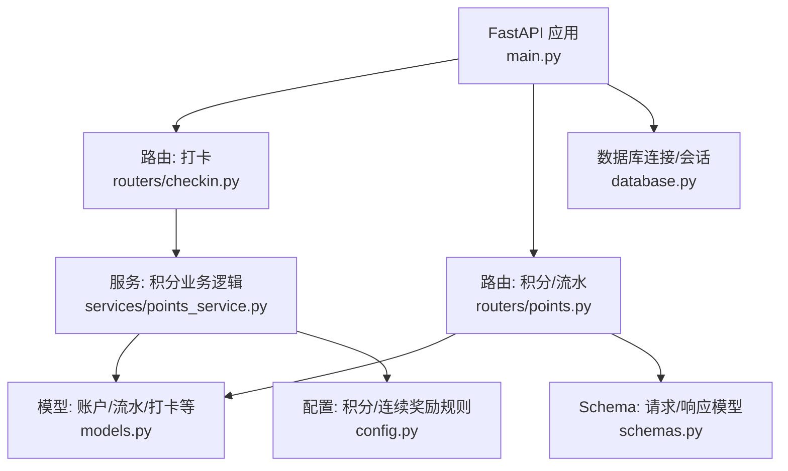
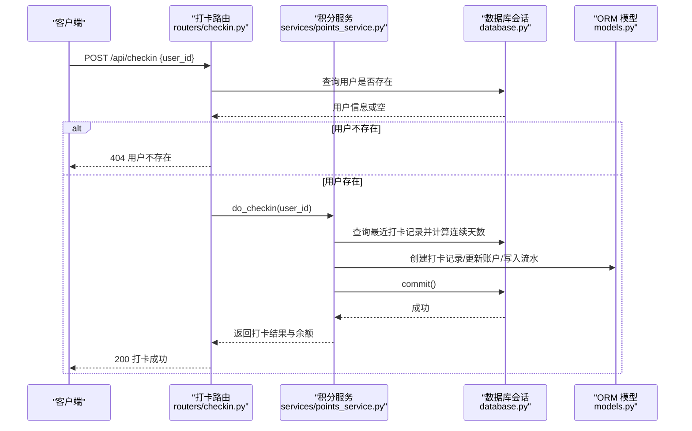
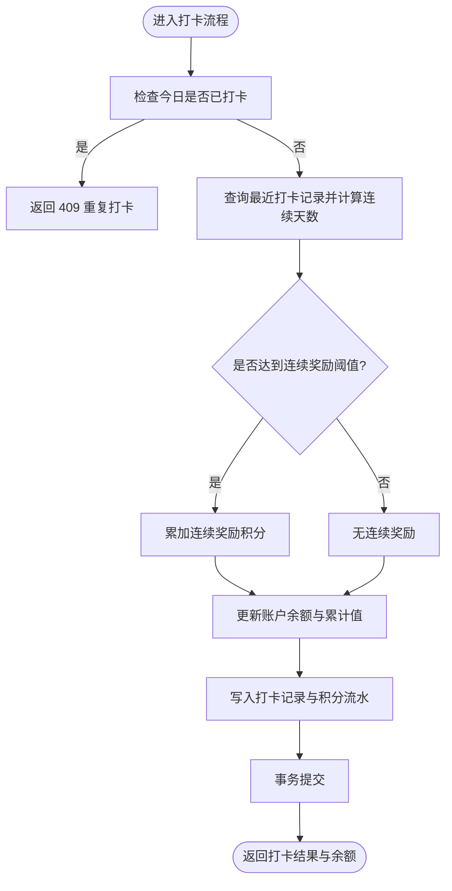
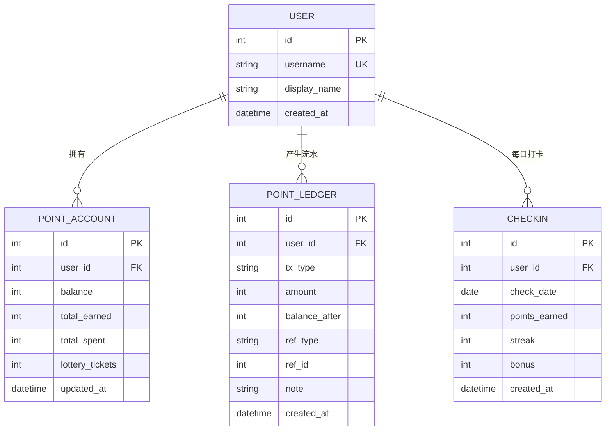
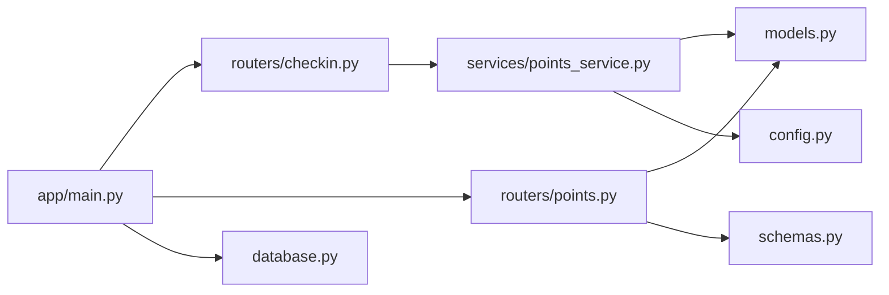

# 积分管理接口

<cite>
**本文引用的文件**   
- [main.py](file://points-system/backend/app/main.py)
- [points.py](file://points-system/backend/app/routers/points.py)
- [checkin.py](file://points-system/backend/app/routers/checkin.py)
- [points_service.py](file://points-system/backend/app/services/points_service.py)
- [models.py](file://points-system/backend/app/models.py)
- [schemas.py](file://points-system/backend/app/schemas.py)
- [config.py](file://points-system/backend/app/config.py)
- [database.py](file://points-system/backend/app/database.py)
</cite>

## 目录
1. [简介](#简介)
2. [项目结构](#项目结构)
3. [核心组件](#核心组件)
4. [架构总览](#架构总览)
5. [详细组件分析](#详细组件分析)
6. [依赖关系分析](#依赖关系分析)
7. [性能与并发](#性能与并发)
8. [故障排查指南](#故障排查指南)
9. [结论](#结论)
10. [附录：API 定义与示例](#附录api-定义与示例)

## 简介
本文件面向“积分管理”相关 API，覆盖以下能力：
- 积分账户余额查询
- 积分流水记录查询
- 连续打卡奖励的计算与发放（打卡接口）
- 并发安全与事务一致性保障说明
- 权限控制策略建议与数据返回格式规范
- 请求/响应示例、错误码与数据校验规则

## 项目结构
后端基于 FastAPI + SQLAlchemy，采用路由层（routers）、服务层（services）、模型层（models）与配置/数据库基础设施分离的组织方式。启动时通过 lifespan 初始化数据库表，随后挂载各业务路由。

图表来源
- [main.py:14-33](file://points-system/backend/app/main.py#L14-L33)
- [points.py:1-28](file://points-system/backend/app/routers/points.py#L1-L28)
- [checkin.py:1-16](file://points-system/backend/app/routers/checkin.py#L1-L16)
- [points_service.py:1-146](file://points-system/backend/app/services/points_service.py#L1-L146)
- [models.py:1-151](file://points-system/backend/app/models.py#L1-L151)
- [schemas.py:1-147](file://points-system/backend/app/schemas.py#L1-L147)
- [config.py:1-17](file://points-system/backend/app/config.py#L1-L17)
- [database.py:1-39](file://points-system/backend/app/database.py#L1-L39)

章节来源
- [main.py:14-33](file://points-system/backend/app/main.py#L14-L33)

## 核心组件
- 路由层
  - 打卡：POST /api/checkin
  - 积分账户：GET /api/points
  - 积分流水：GET /api/ledger
- 服务层
  - 打卡与连续奖励计算、积分入账、流水落库、并发防重
- 数据模型
  - 用户、积分账户、积分流水、打卡记录、奖品、兑换、抽奖券及流水等
- 配置
  - 基础积分、连续奖励阈值与金额、积分换券比例等
- 数据库
  - SQLite + WAL + busy_timeout；Session 生命周期由 FastAPI 依赖注入管理

章节来源
- [points.py:10-27](file://points-system/backend/app/routers/points.py#L10-L27)
- [checkin.py:11-15](file://points-system/backend/app/routers/checkin.py#L11-L15)
- [points_service.py:18-91](file://points-system/backend/app/services/points_service.py#L18-L91)
- [models.py:20-66](file://points-system/backend/app/models.py#L20-L66)
- [config.py:1-17](file://points-system/backend/app/config.py#L1-L17)
- [database.py:16-33](file://points-system/backend/app/database.py#L16-L33)

## 架构总览
下图展示一次打卡的完整调用链：客户端发起打卡请求，路由层校验用户存在后委托服务层完成连续天数计算、奖励判定、账户更新与流水写入，并在同一事务中提交。

图表来源
- [checkin.py:11-15](file://points-system/backend/app/routers/checkin.py#L11-L15)
- [points_service.py:41-91](file://points-system/backend/app/services/points_service.py#L41-L91)
- [database.py:28-33](file://points-system/backend/app/database.py#L28-L33)
- [models.py:50-66](file://points-system/backend/app/models.py#L50-L66)

## 详细组件分析

### 打卡与连续奖励接口
- 接口路径与方法
  - POST /api/checkin
- 功能说明
  - 校验用户存在
  - 防重复打卡（同一天仅允许一次）
  - 计算截至今天的连续打卡天数
  - 根据配置发放基础积分与连续奖励
  - 更新积分账户余额与累计值
  - 写入打卡记录与积分流水
  - 在同一事务内提交，异常回滚
- 请求体
  - user_id: 整数
- 响应体
  - checkin: 本次打卡记录（含日期、获得积分、连续天数、额外奖励）
  - points_earned: 本次获得的总积分
  - bonus: 本次连续奖励积分
  - streak: 当前连续打卡天数
  - balance: 打卡后的账户余额
- 错误处理
  - 404 用户不存在
  - 409 今日已打卡（并发兜底）
- 连续奖励规则
  - 每连续 N 天发放一次额外奖励，金额为固定值
  - 基础积分为固定值
  - 具体数值见配置项
- 并发与一致性
  - 业务层先查后写，数据库层唯一约束兜底
  - IntegrityError 捕获后回滚并返回 409
- 参考实现位置
  - 路由：[checkin.py:11-15](file://points-system/backend/app/routers/checkin.py#L11-L15)
  - 服务：[points_service.py:41-91](file://points-system/backend/app/services/points_service.py#L41-L91)
  - 模型：[models.py:50-66](file://points-system/backend/app/models.py#L50-L66)
  - 配置：[config.py:1-17](file://points-system/backend/app/config.py#L1-L17)

章节来源
- [checkin.py:11-15](file://points-system/backend/app/routers/checkin.py#L11-L15)
- [points_service.py:41-91](file://points-system/backend/app/services/points_service.py#L41-L91)
- [models.py:50-66](file://points-system/backend/app/models.py#L50-L66)
- [config.py:1-17](file://points-system/backend/app/config.py#L1-L17)

#### 连续打卡奖励计算流程

图表来源
- [points_service.py:41-91](file://points-system/backend/app/services/points_service.py#L41-L91)

### 积分账户余额查询接口
- 接口路径与方法
  - GET /api/points?user_id=...
- 功能说明
  - 根据 user_id 查询积分账户
  - 若账户不存在则返回 404
- 请求参数
  - user_id: 整数（必填）
- 响应体
  - user_id, balance, total_earned, total_spent, updated_at
- 权限控制
  - 当前实现未内置鉴权中间件，仅按 user_id 查询
  - 建议在网关或统一鉴权层增加认证与授权校验，确保只能查询本人账户
- 参考实现位置
  - 路由：[points.py:10-15](file://points-system/backend/app/routers/points.py#L10-L15)
  - Schema：[schemas.py:18-24](file://points-system/backend/app/schemas.py#L18-L24)

章节来源
- [points.py:10-15](file://points-system/backend/app/routers/points.py#L10-L15)
- [schemas.py:18-24](file://points-system/backend/app/schemas.py#L18-L24)

### 积分流水查询接口
- 接口路径与方法
  - GET /api/ledger?user_id=...&limit=...
- 功能说明
  - 按时间倒序返回指定用户的积分流水
  - 支持分页上限 limit
- 请求参数
  - user_id: 整数（必填）
  - limit: 整数（可选，默认 50）
- 响应体
  - 列表，每项包含 id, user_id, tx_type, amount, balance_after, ref_type, ref_id, note, created_at
- 筛选能力
  - 当前实现仅支持按 user_id 过滤与 limit 限制
  - 如需按时间范围或类型过滤，可在路由层扩展 Query 条件
- 参考实现位置
  - 路由：[points.py:18-27](file://points-system/backend/app/routers/points.py#L18-L27)
  - Schema：[schemas.py:26-36](file://points-system/backend/app/schemas.py#L26-L36)

章节来源
- [points.py:18-27](file://points-system/backend/app/routers/points.py#L18-L27)
- [schemas.py:26-36](file://points-system/backend/app/schemas.py#L26-L36)

### 数据模型与关系

图表来源
- [models.py:10-66](file://points-system/backend/app/models.py#L10-L66)

## 依赖关系分析
- 路由层依赖服务层进行业务编排
- 服务层依赖 ORM 模型与配置常量
- 数据库连接与会话由 database 模块提供，并通过 FastAPI 依赖注入
- 启动阶段在 lifespan 中执行建表

图表来源
- [main.py:20-29](file://points-system/backend/app/main.py#L20-L29)
- [points.py:1-28](file://points-system/backend/app/routers/points.py#L1-L28)
- [checkin.py:1-16](file://points-system/backend/app/routers/checkin.py#L1-L16)
- [points_service.py:1-146](file://points-system/backend/app/services/points_service.py#L1-L146)
- [models.py:1-151](file://points-system/backend/app/models.py#L1-L151)
- [schemas.py:1-147](file://points-system/backend/app/schemas.py#L1-L147)
- [config.py:1-17](file://points-system/backend/app/config.py#L1-L17)
- [database.py:1-39](file://points-system/backend/app/database.py#L1-L39)

章节来源
- [main.py:20-29](file://points-system/backend/app/main.py#L20-L29)

## 性能与并发
- 事务一致性
  - 所有读-改-写操作在同一个 Session 事务内完成，成功统一 commit，异常统一 rollback，保证余额与库存不会半更新
- 并发安全
  - 打卡防重复：业务层先查后写，数据库层 (user_id, check_date) 唯一约束兜底
  - 捕获 IntegrityError 后回滚并返回 409
- SQLite 优化
  - 开启 WAL 日志模式与 busy_timeout，缩小竞态窗口，提升并发读取性能
- 建议
  - 生产环境可考虑使用支持行级锁的数据库（如 PostgreSQL），并对关键行加悲观锁
  - 对高频查询接口增加缓存层（如 Redis）以降低热点读压力

章节来源
- [points_service.py:1-9](file://points-system/backend/app/services/points_service.py#L1-L9)
- [points_service.py:77-82](file://points-system/backend/app/services/points_service.py#L77-L82)
- [database.py:16-22](file://points-system/backend/app/database.py#L16-L22)

## 故障排查指南
- 常见错误码
  - 404 用户不存在：打卡前校验失败
  - 409 今日已打卡：重复打卡或并发冲突
  - 400 参数或状态不合法：如积分不足、奖品无效等（兑换场景）
- 定位步骤
  - 确认 user_id 是否正确且存在
  - 检查是否已在当天打卡
  - 查看数据库唯一约束是否触发
  - 核对事务是否提交成功
- 日志与追踪
  - 结合 created_at、ref_type、ref_id 等字段定位问题流水

章节来源
- [checkin.py:13-15](file://points-system/backend/app/routers/checkin.py#L13-L15)
- [points_service.py:45-82](file://points-system/backend/app/services/points_service.py#L45-L82)

## 结论
本系统围绕“打卡得积分、连续奖励、流水可追溯”的核心目标，提供了简洁清晰的 API 与服务实现。通过“业务层先查后写 + 数据库唯一约束 + 单事务提交”的组合策略，保证了并发安全与数据一致性。后续可按需扩展流水筛选、权限控制与缓存机制，以满足更高吞吐与更严格的访问控制需求。

## 附录：API 定义与示例

### 打卡接口
- 方法路径
  - POST /api/checkin
- 请求体
  - user_id: 整数
- 响应体
  - checkin: {id, user_id, check_date, points_earned, streak, bonus}
  - points_earned: 整数
  - bonus: 整数
  - streak: 整数
  - balance: 整数
- 错误
  - 404 用户不存在
  - 409 今日已打卡

章节来源
- [checkin.py:11-15](file://points-system/backend/app/routers/checkin.py#L11-L15)
- [schemas.py:68-83](file://points-system/backend/app/schemas.py#L68-L83)

### 积分账户查询接口
- 方法路径
  - GET /api/points?user_id=...
- 响应体
  - user_id, balance, total_earned, total_spent, updated_at
- 错误
  - 404 账户不存在

章节来源
- [points.py:10-15](file://points-system/backend/app/routers/points.py#L10-L15)
- [schemas.py:18-24](file://points-system/backend/app/schemas.py#L18-L24)

### 积分流水查询接口
- 方法路径
  - GET /api/ledger?user_id=...&limit=...
- 响应体
  - 列表项包含：id, user_id, tx_type, amount, balance_after, ref_type, ref_id, note, created_at
- 筛选
  - 当前仅支持 user_id 与 limit
  - 可扩展：start_time, end_time, tx_type 等

章节来源
- [points.py:18-27](file://points-system/backend/app/routers/points.py#L18-L27)
- [schemas.py:26-36](file://points-system/backend/app/schemas.py#L26-L36)

### 权限控制建议
- 当前实现未内置鉴权中间件
- 建议在网关或统一鉴权层：
  - 校验请求者身份（JWT/OAuth2）
  - 将 user_id 绑定到令牌主体，禁止越权查询他人数据
  - 对敏感接口增加二次校验或审计日志

章节来源
- [main.py:20-29](file://points-system/backend/app/main.py#L20-L29)

### 数据验证规则
- 输入校验
  - user_id 为必填整数
  - limit 为非负整数（建议最小 1，最大合理上限）
- 业务校验
  - 打卡：同一天不可重复
  - 账户：不存在则 404
  - 流水：按用户隔离

章节来源
- [points.py:10-27](file://points-system/backend/app/routers/points.py#L10-L27)
- [checkin.py:11-15](file://points-system/backend/app/routers/checkin.py#L11-L15)