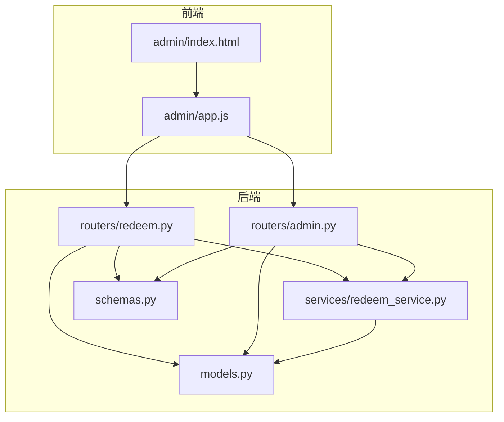
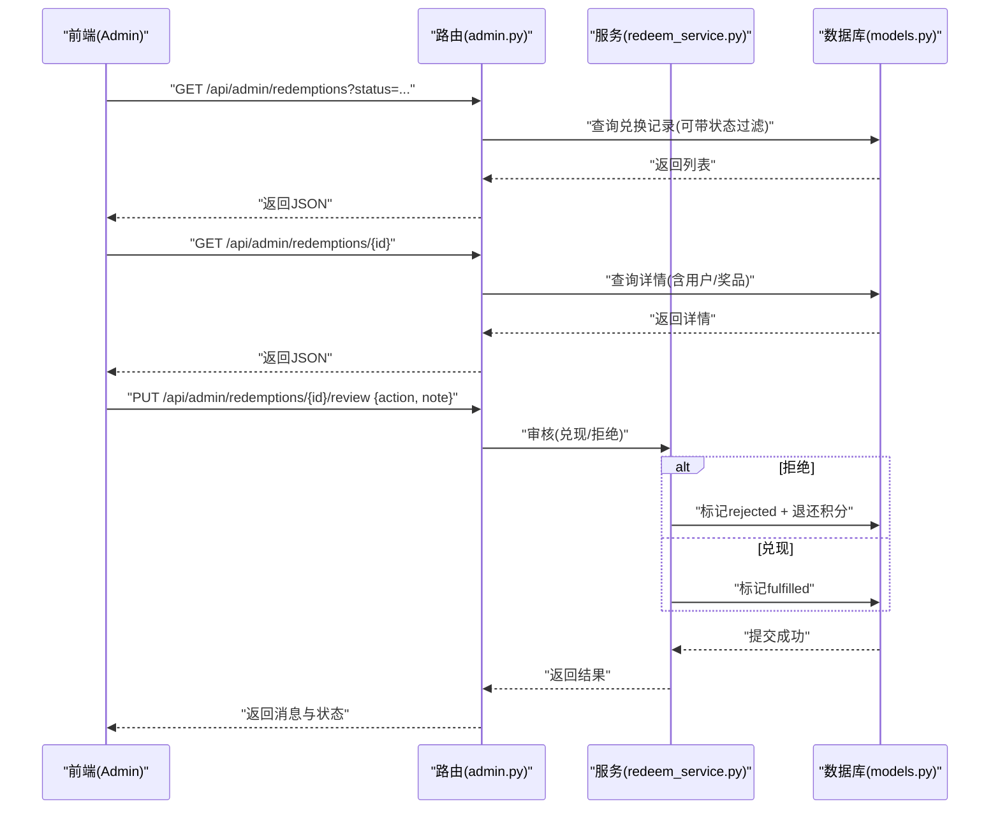
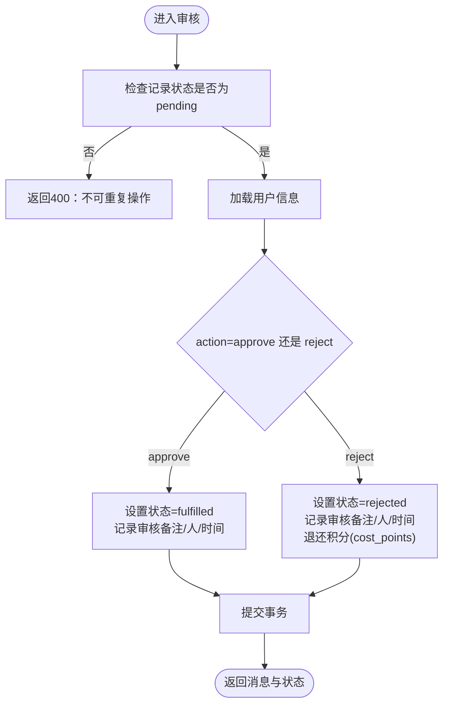
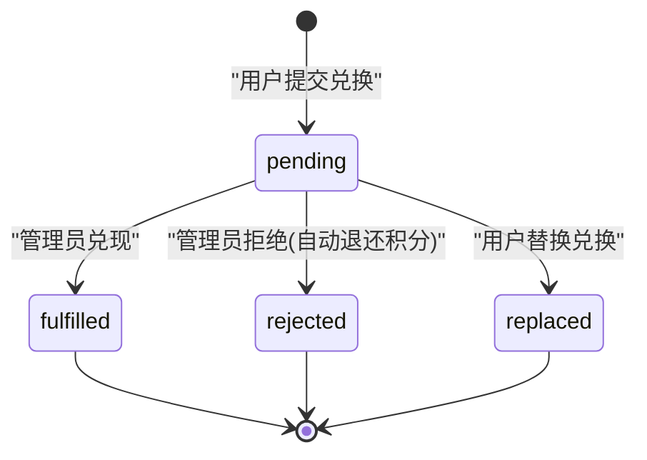

# 兑换管理接口

<cite>
**本文引用的文件**   
- [summer-homework-checkin/backend/app/routers/admin.py](file://summer-homework-checkin/backend/app/routers/admin.py)
- [summer-homework-checkin/backend/app/routers/redeem.py](file://summer-homework-checkin/backend/app/routers/redeem.py)
- [summer-homework-checkin/backend/app/services/redeem_service.py](file://summer-homework-checkin/backend/app/services/redeem_service.py)
- [summer-homework-checkin/backend/app/models.py](file://summer-homework-checkin/backend/app/models.py)
- [summer-homework-checkin/backend/app/schemas.py](file://summer-homework-checkin/backend/app/schemas.py)
- [summer-homework-checkin/frontend/admin/index.html](file://summer-homework-checkin/frontend/admin/index.html)
- [summer-homework-checkin/frontend/admin/app.js](file://summer-homework-checkin/frontend/admin/app.js)
</cite>

## 目录
1. [简介](#简介)
2. [项目结构](#项目结构)
3. [核心组件](#核心组件)
4. [架构总览](#架构总览)
5. [详细接口说明](#详细接口说明)
6. [依赖关系分析](#依赖关系分析)
7. [性能与一致性](#性能与一致性)
8. [故障排查指南](#故障排查指南)
9. [结论](#结论)
10. [附录：数据模型与状态](#附录数据模型与状态)

## 简介
本文件面向“管理后台兑换管理”场景，提供完整的API文档与业务流程说明，覆盖以下目标：
- 兑换记录查询接口：支持按状态筛选（待处理/已兑现/已拒绝）、用户信息与时间范围查询。
- 兑换记录详情接口：展示用户信息、奖品详情、兑换时间与审核记录。
- 兑换审核操作接口：兑现处理与拒绝处理的完整流程。
- 拒绝时自动退还积分的机制与积分账户更新逻辑。
- 完整操作流程示例：包含审核意见填写、状态更新与积分处理。
- 与前端兑换管理界面的数据同步与实时更新机制。

## 项目结构
本项目采用前后端分离架构：
- 后端基于 FastAPI，提供 RESTful API；路由层负责鉴权与参数校验，服务层封装业务逻辑，ORM 模型定义数据库结构。
- 前端为 Vue 3 单页应用，提供管理员登录、概览、奖品管理、用户管理、打卡审核、闯关任务管理与“兑换记录审核”等页面。



图表来源
- [summer-homework-checkin/frontend/admin/index.html:1-533](file://summer-homework-checkin/frontend/admin/index.html#L1-L533)
- [summer-homework-checkin/frontend/admin/app.js:1-641](file://summer-homework-checkin/frontend/admin/app.js#L1-L641)
- [summer-homework-checkin/backend/app/routers/admin.py:1-214](file://summer-homework-checkin/backend/app/routers/admin.py#L1-L214)
- [summer-homework-checkin/backend/app/routers/redeem.py:1-81](file://summer-homework-checkin/backend/app/routers/redeem.py#L1-L81)
- [summer-homework-checkin/backend/app/services/redeem_service.py:1-168](file://summer-homework-checkin/backend/app/services/redeem_service.py#L1-L168)
- [summer-homework-checkin/backend/app/models.py:1-212](file://summer-homework-checkin/backend/app/models.py#L1-L212)
- [summer-homework-checkin/backend/app/schemas.py:1-322](file://summer-homework-checkin/backend/app/schemas.py#L1-L322)

章节来源
- [summer-homework-checkin/backend/app/routers/admin.py:106-163](file://summer-homework-checkin/backend/app/routers/admin.py#L106-L163)
- [summer-homework-checkin/backend/app/routers/redeem.py:24-81](file://summer-homework-checkin/backend/app/routers/redeem.py#L24-L81)
- [summer-homework-checkin/backend/app/services/redeem_service.py:22-94](file://summer-homework-checkin/backend/app/services/redeem_service.py#L22-L94)
- [summer-homework-checkin/backend/app/models.py:141-161](file://summer-homework-checkin/backend/app/models.py#L141-L161)
- [summer-homework-checkin/backend/app/schemas.py:184-213](file://summer-homework-checkin/backend/app/schemas.py#L184-L213)
- [summer-homework-checkin/frontend/admin/app.js:106-136](file://summer-homework-checkin/frontend/admin/app.js#L106-L136)
- [summer-homework-checkin/frontend/admin/index.html:176-245](file://summer-homework-checkin/frontend/admin/index.html#L176-L245)

## 核心组件
- 路由层
  - 管理端路由：提供统计、用户、打卡审核、兑换记录列表/详情/审核等接口。
  - 用户端路由：提供积分商城聚合数据、兑换、替换兑换等接口。
- 服务层
  - 兑换服务：实现“兑换”和“替换兑换”的业务逻辑，包括库存扣减、积分扣减、虚拟奖品自动发放、通知发送等。
- 数据模型
  - Redemption：兑换记录，含用户、奖品、消耗积分、状态、审核备注、审核人、审核时间等字段。
  - Prize：奖品，含是否抽奖机会、库存、积分价格等。
  - User：用户，含角色、积分余额、抽奖券数量等。
- 请求/响应模式
  - schemas.py 定义了兑换相关输入输出结构，如 RedeemRequest、RedemptionOut、MallOut 等。

章节来源
- [summer-homework-checkin/backend/app/routers/admin.py:106-214](file://summer-homework-checkin/backend/app/routers/admin.py#L106-L214)
- [summer-homework-checkin/backend/app/routers/redeem.py:24-81](file://summer-homework-checkin/backend/app/routers/redeem.py#L24-L81)
- [summer-homework-checkin/backend/app/services/redeem_service.py:22-168](file://summer-homework-checkin/backend/app/services/redeem_service.py#L22-L168)
- [summer-homework-checkin/backend/app/models.py:141-161](file://summer-homework-checkin/backend/app/models.py#L141-L161)
- [summer-homework-checkin/backend/app/schemas.py:184-213](file://summer-homework-checkin/backend/app/schemas.py#L184-L213)

## 架构总览
下图展示了管理后台兑换管理的端到端调用链：前端通过浏览器发起 HTTP 请求，后端路由进行鉴权与参数校验，调用服务层完成业务处理，最终持久化到数据库并返回结果。



图表来源
- [summer-homework-checkin/backend/app/routers/admin.py:106-214](file://summer-homework-checkin/backend/app/routers/admin.py#L106-L214)
- [summer-homework-checkin/backend/app/services/redeem_service.py:22-94](file://summer-homework-checkin/backend/app/services/redeem_service.py#L22-L94)
- [summer-homework-checkin/backend/app/models.py:141-161](file://summer-homework-checkin/backend/app/models.py#L141-L161)

## 详细接口说明

### 管理端：兑换记录列表
- 方法路径
  - GET /api/admin/redemptions
- 鉴权
  - 需要管理员角色（由 require_role("admin") 保护）
- 查询参数
  - status: 可选，支持 pending、fulfilled、rejected 三种状态筛选
  - 其他筛选（用户、时间范围）：当前路由未直接暴露，可在前端或网关层组合过滤
- 返回字段
  - id、user_id、nickname、username、prize_name、cost_points、redeemed_at、status、replaced_by、note、review_note、reviewed_by、reviewed_at
- 行为说明
  - 默认按兑换时间倒序，限制最多返回 500 条
  - 若指定 status，则仅返回对应状态的记录

章节来源
- [summer-homework-checkin/backend/app/routers/admin.py:106-131](file://summer-homework-checkin/backend/app/routers/admin.py#L106-L131)

### 管理端：兑换记录详情
- 方法路径
  - GET /api/admin/redemptions/{redemption_id}
- 鉴权
  - 需要管理员角色
- 路径参数
  - redemption_id: 兑换记录ID
- 返回字段
  - id、user_id、nickname、username、prize_id、prize_name、prize_description、cost_points、redeemed_at、status、replaced_by、note、review_note、reviewed_by、reviewed_at
- 行为说明
  - 若记录不存在，返回 404

章节来源
- [summer-homework-checkin/backend/app/routers/admin.py:134-163](file://summer-homework-checkin/backend/app/routers/admin.py#L134-L163)

### 管理端：兑换审核（兑现/拒绝）
- 方法路径
  - PUT /api/admin/redemptions/{redemption_id}/review
- 鉴权
  - 需要管理员角色
- 请求体
  - action: approve | reject（注意：路由实际使用 ReviewRequest 的 status 字段，值为 approved | rejected）
  - note: 审核备注（可选）
- 返回字段
  - message、status、reviewed_at、reviewed_by
- 业务流程
  - 仅允许对 pending 状态的记录进行审核
  - 兑现（approved）：将状态置为 fulfilled，记录审核备注、审核人与时间
  - 拒绝（rejected）：将状态置为 rejected，记录审核备注、审核人与时间，并自动退还用户积分（增加 cost_points）
- 错误处理
  - 记录不存在：404
  - 非 pending 状态：400
  - 用户不存在：404
  - 非法 action/status：400



图表来源
- [summer-homework-checkin/backend/app/routers/admin.py:165-214](file://summer-homework-checkin/backend/app/routers/admin.py#L165-L214)

章节来源
- [summer-homework-checkin/backend/app/routers/admin.py:165-214](file://summer-homework-checkin/backend/app/routers/admin.py#L165-L214)

### 用户端：积分商城聚合数据
- 方法路径
  - GET /api/mall
- 鉴权
  - 需要登录态（get_current_user）
- 返回字段
  - points、lottery_tickets、prizes、redemptions、lottery_records
- 行为说明
  - prizes：仅返回上架且 cost_points > 0 的奖品
  - redemptions：当前用户的兑换记录（按 redeemed_at 倒序）
  - lottery_records：当前用户的抽奖记录（按 drawn_at 倒序）

章节来源
- [summer-homework-checkin/backend/app/routers/redeem.py:24-45](file://summer-homework-checkin/backend/app/routers/redeem.py#L24-L45)
- [summer-homework-checkin/backend/app/services/redeem_service.py:7-19](file://summer-homework-checkin/backend/app/services/redeem_service.py#L7-L19)

### 用户端：积分兑换
- 方法路径
  - POST /api/redeem
- 鉴权
  - 需要登录态，且角色为 student 或 parent
- 请求体
  - prize_id: 奖品ID
- 返回字段
  - redemption（实物奖品时返回）、balance、lottery_tickets、is_lottery_ticket、message
- 业务规则
  - 奖品必须上架、cost_points > 0
  - 实物奖品需有库存；抽奖机会奖品不扣库存，直接增加抽奖券
  - 积分不足则拒绝
  - 实物奖品创建 pending 状态的兑换记录；抽奖机会奖品创建 fulfilled 状态并自动发放券
  - 成功后返回当前积分余额与抽奖券数量

章节来源
- [summer-homework-checkin/backend/app/routers/redeem.py:48-69](file://summer-homework-checkin/backend/app/routers/redeem.py#L48-L69)
- [summer-homework-checkin/backend/app/services/redeem_service.py:22-94](file://summer-homework-checkin/backend/app/services/redeem_service.py#L22-L94)

### 用户端：替换兑换
- 方法路径
  - POST /api/redeem/{rid}/replace
- 鉴权
  - 需要登录态，且角色为 student 或 parent
- 请求体
  - new_prize_id: 新奖品ID
- 返回字段
  - 新的兑换记录（RedemptionOut）
- 业务规则
  - 原记录不能是 replaced 或 cancelled
  - 新奖品必须上架、cost_points > 0、有库存
  - 回滚原奖品库存，退还原积分，再按新奖品结算（多退少补）
  - 新记录初始状态为 pending

章节来源
- [summer-homework-checkin/backend/app/routers/redeem.py:72-81](file://summer-homework-checkin/backend/app/routers/redeem.py#L72-L81)
- [summer-homework-checkin/backend/app/services/redeem_service.py:97-168](file://summer-homework-checkin/backend/app/services/redeem_service.py#L97-L168)

## 依赖关系分析
- 路由与服务解耦：路由只负责鉴权、参数校验与响应组装；具体业务逻辑下沉至 redeem_service。
- 数据模型与状态：
  - Redemption.status 支持 pending、fulfilled、replaced、rejected。
  - 审核接口在 admin.py 中直接修改状态与积分，确保拒绝时自动退还积分。
- 前端交互：
  - 管理端通过 loadRedeems 拉取列表，并根据筛选条件拼接 ?status=...
  - 审核弹窗提交后刷新列表与统计数据，保证界面与后端一致。

```mermaid
classDiagram
class AdminRouter {
+"/api/admin/redemptions"
+"/api/admin/redemptions/{id}"
+"/api/admin/redemptions/{id}/review"
}
class RedeemService {
+redeem(db, user, prize_id)
+replace_redemption(db, user, rid, new_prize_id)
+list_prizes_for_mall(db)
+list_redemptions(db, user)
}
class Models {
+Redemption
+Prize
+User
}
AdminRouter --> RedeemService : "调用"
AdminRouter --> Models : "读写"
RedeemService --> Models : "读写"
```

图表来源
- [summer-homework-checkin/backend/app/routers/admin.py:106-214](file://summer-homework-checkin/backend/app/routers/admin.py#L106-L214)
- [summer-homework-checkin/backend/app/services/redeem_service.py:22-168](file://summer-homework-checkin/backend/app/services/redeem_service.py#L22-L168)
- [summer-homework-checkin/backend/app/models.py:141-161](file://summer-homework-checkin/backend/app/models.py#L141-L161)

章节来源
- [summer-homework-checkin/backend/app/routers/admin.py:106-214](file://summer-homework-checkin/backend/app/routers/admin.py#L106-L214)
- [summer-homework-checkin/backend/app/services/redeem_service.py:22-168](file://summer-homework-checkin/backend/app/services/redeem_service.py#L22-L168)
- [summer-homework-checkin/backend/app/models.py:141-161](file://summer-homework-checkin/backend/app/models.py#L141-L161)

## 性能与一致性
- 列表查询限制：管理端列表默认 limit 500，避免一次性返回过多数据。
- 事务提交：审核接口在状态变更与积分更新后统一提交事务，保证一致性。
- 并发建议：
  - 在高并发下，建议在路由或服务层加入乐观锁或分布式锁，防止重复审核或积分竞态。
  - 对频繁读取的统计接口（如 /api/admin/stats）可引入缓存层（如 Redis）。

[本节为通用指导，无需特定文件引用]

## 故障排查指南
- 常见错误
  - 404 记录不存在：检查 redemption_id 是否正确
  - 400 非 pending 状态：记录已被处理，不可重复审核
  - 400 非法 action/status：请确认请求体字段值
  - 401 登录失效：前端会触发登出并提示
- 定位步骤
  - 查看前端控制台网络请求与响应
  - 核对后端日志中的异常堆栈
  - 检查数据库中 Redemption 与 User 的状态与积分字段

章节来源
- [summer-homework-checkin/frontend/admin/app.js:56-80](file://summer-homework-checkin/frontend/admin/app.js#L56-L80)
- [summer-homework-checkin/backend/app/routers/admin.py:165-214](file://summer-homework-checkin/backend/app/routers/admin.py#L165-L214)

## 结论
本接口体系围绕“兑换记录查询、详情、审核”三大能力构建，结合用户端兑换与替换兑换，形成闭环。管理端审核支持兑现与拒绝，并在拒绝时自动退还积分，保障用户体验与账务一致性。前端通过筛选与弹窗交互，配合后端返回的数据结构，实现了高效的管理与实时反馈。

[本节为总结性内容，无需特定文件引用]

## 附录：数据模型与状态

### 关键数据模型
- Redemption（兑换记录）
  - 关键字段：id、user_id、prize_id、prize_name、cost_points、redeemed_at、status、replaced_by、note、review_note、reviewed_by、reviewed_at
- Prize（奖品）
  - 关键字段：id、name、description、category、stock、status、cost_points、is_lottery_ticket、ticket_qty
- User（用户）
  - 关键字段：id、role、points、lottery_tickets

章节来源
- [summer-homework-checkin/backend/app/models.py:141-161](file://summer-homework-checkin/backend/app/models.py#L141-L161)
- [summer-homework-checkin/backend/app/models.py:103-124](file://summer-homework-checkin/backend/app/models.py#L103-L124)
- [summer-homework-checkin/backend/app/models.py:11-44](file://summer-homework-checkin/backend/app/models.py#L11-L44)

### 状态机（兑换记录）


图表来源
- [summer-homework-checkin/backend/app/models.py:141-161](file://summer-homework-checkin/backend/app/models.py#L141-L161)
- [summer-homework-checkin/backend/app/services/redeem_service.py:97-168](file://summer-homework-checkin/backend/app/services/redeem_service.py#L97-L168)

### 前端数据同步与实时更新机制
- 列表刷新
  - 点击“待核实/已兑现/已拒绝/全部”按钮时，前端根据筛选条件重新调用 /api/admin/redemptions
- 审核反馈
  - 提交审核后，前端弹出成功提示，并立即刷新列表与统计数据，保证界面与后端一致
- 图片查看器
  - 管理端内置图片查看器，支持多图浏览、缩放、旋转与上传，提升审核效率

章节来源
- [summer-homework-checkin/frontend/admin/app.js:106-136](file://summer-homework-checkin/frontend/admin/app.js#L106-L136)
- [summer-homework-checkin/frontend/admin/index.html:176-245](file://summer-homework-checkin/frontend/admin/index.html#L176-L245)