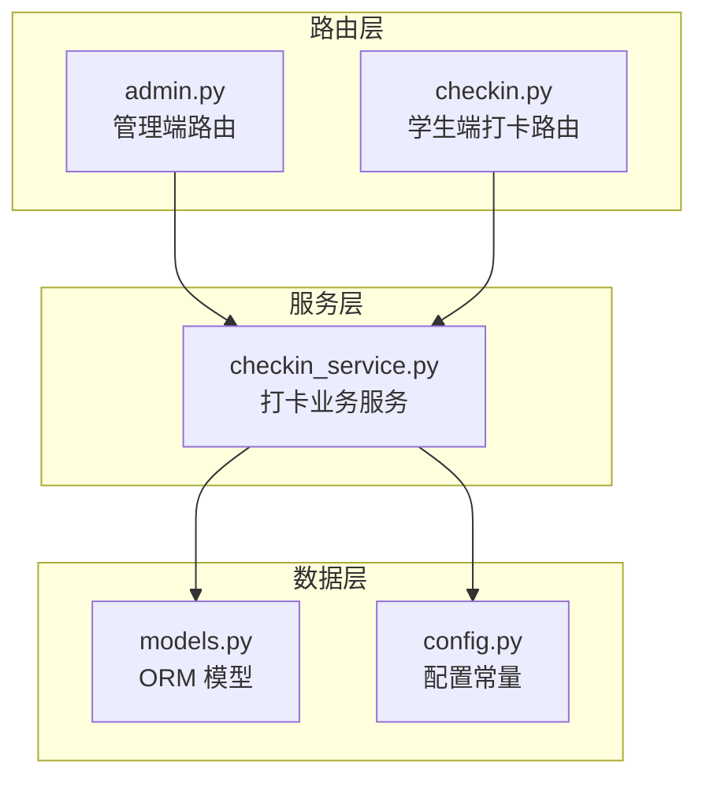
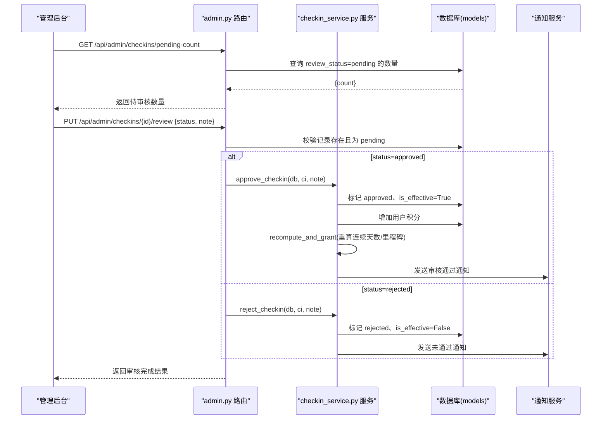
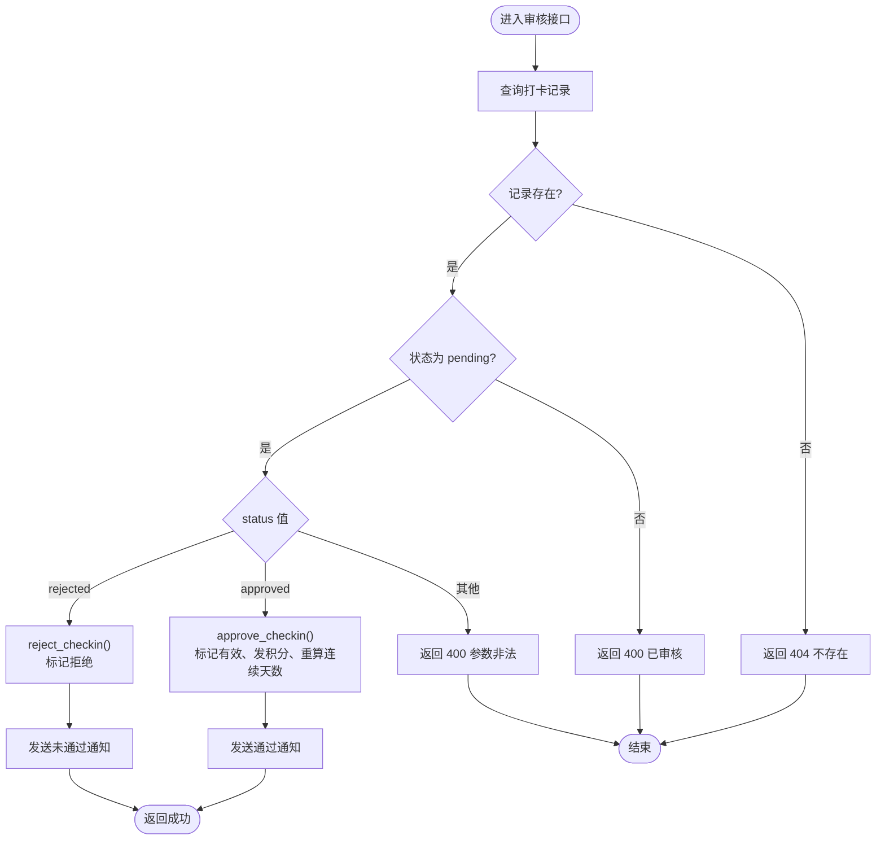
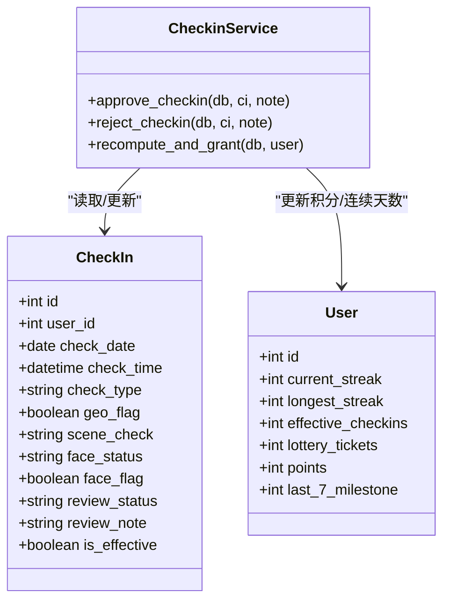
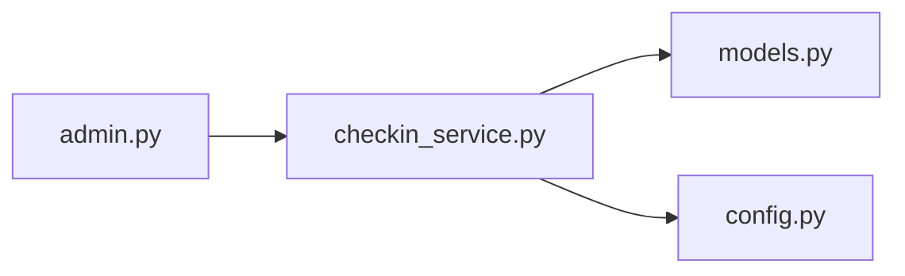

# 打卡审核接口

<cite>
**本文引用的文件列表**
- [admin.py](file://summer-homework-checkin/backend/app/routers/admin.py)
- [checkin_service.py](file://summer-homework-checkin/backend/app/services/checkin_service.py)
- [models.py](file://summer-homework-checkin/backend/app/models.py)
- [schemas.py](file://summer-homework-checkin/backend/app/schemas.py)
- [config.py](file://summer-homework-checkin/backend/app/config.py)
- [checkin.py](file://summer-homework-checkin/backend/app/routers/checkin.py)
- [test_review.py](file://summer-homework-checkin/test_review.py)
</cite>

## 目录
1. [简介](#简介)
2. [项目结构](#项目结构)
3. [核心组件](#核心组件)
4. [架构总览](#架构总览)
5. [详细组件分析](#详细组件分析)
6. [依赖关系分析](#依赖关系分析)
7. [性能与一致性](#性能与一致性)
8. [故障排查指南](#故障排查指南)
9. [结论](#结论)
10. [附录：API 定义](#附录api-定义)

## 简介
本文件面向管理后台，提供“打卡审核”相关 API 的完整说明。重点覆盖以下能力：
- 打卡记录列表查询（支持按日期范围、审核状态、用户昵称等条件筛选）
- 待审核打卡数量统计（实时计数机制）
- 打卡审核操作（批准/拒绝），以及批准后自动发放积分与重算连续天数的业务逻辑
- 完整的审核操作流程示例（含审核意见、状态更新、错误处理）
- 与 checkin_service 的业务集成和数据一致性保证

## 项目结构
后端采用 FastAPI + SQLAlchemy 的分层设计：
- routers：HTTP 路由层，负责鉴权、参数校验、调用服务层
- services：业务服务层，封装核心规则（如审核通过后的积分发放、连续天数重算）
- models：数据库模型（User、CheckIn、Redemption 等）
- schemas：请求/响应数据模型
- config：配置项（暑假周期、积分规则、照片限制等）

图表来源
- [admin.py:1-214](file://summer-homework-checkin/backend/app/routers/admin.py#L1-L214)
- [checkin.py:1-80](file://summer-homework-checkin/backend/app/routers/checkin.py#L1-L80)
- [checkin_service.py:1-254](file://summer-homework-checkin/backend/app/services/checkin_service.py#L1-L254)
- [models.py:1-212](file://summer-homework-checkin/backend/app/models.py#L1-L212)
- [config.py:1-50](file://summer-homework-checkin/backend/app/config.py#L1-L50)

章节来源
- [admin.py:1-214](file://summer-homework-checkin/backend/app/routers/admin.py#L1-L214)
- [checkin.py:1-80](file://summer-homework-checkin/backend/app/routers/checkin.py#L1-L80)
- [checkin_service.py:1-254](file://summer-homework-checkin/backend/app/services/checkin_service.py#L1-L254)
- [models.py:1-212](file://summer-homework-checkin/backend/app/models.py#L1-L212)
- [config.py:1-50](file://summer-homework-checkin/backend/app/config.py#L1-L50)

## 核心组件
- 管理端路由 admin.py
  - 提供打卡列表、待审核数量、审核操作、兑换管理等接口
- 打卡服务 checkin_service.py
  - 实现审核通过/拒绝的核心流程：标记有效、发放积分、重算连续天数与抽奖资格、发送通知
- 数据模型 models.py
  - CheckIn 包含审核状态 review_status、是否有效 is_effective、审核备注 review_note 等字段
- 请求/响应模式 schemas.py
  - ReviewRequest 用于审核请求体（status、note）
- 配置 config.py
  - CHECKIN_POINTS、MAKEUP_POINTS、MAX_MAKEUP_PER_MONTH 等规则常量

章节来源
- [admin.py:53-103](file://summer-homework-checkin/backend/app/routers/admin.py#L53-L103)
- [checkin_service.py:166-209](file://summer-homework-checkin/backend/app/services/checkin_service.py#L166-L209)
- [models.py:70-96](file://summer-homework-checkin/backend/app/models.py#L70-L96)
- [schemas.py:78-81](file://summer-homework-checkin/backend/app/schemas.py#L78-L81)
- [config.py:37-39](file://summer-homework-checkin/backend/app/config.py#L37-L39)

## 架构总览
管理后台审核打卡的整体交互如下：

图表来源
- [admin.py:77-103](file://summer-homework-checkin/backend/app/routers/admin.py#L77-L103)
- [checkin_service.py:166-209](file://summer-homework-checkin/backend/app/services/checkin_service.py#L166-L209)
- [checkin_service.py:39-61](file://summer-homework-checkin/backend/app/services/checkin_service.py#L39-L61)
- [models.py:70-96](file://summer-homework-checkin/backend/app/models.py#L70-L96)

## 详细组件分析

### 打卡记录列表查询接口
- 路径与方法
  - GET /api/admin/checkins
- 鉴权
  - 仅管理员角色可访问
- 返回字段
  - 包含打卡 ID、用户 ID、用户昵称、打卡日期、时间、类型、位置信息、场景校验、审核状态、审核备注、是否有效、照片链接等
- 筛选能力
  - 当前实现返回最近 500 条并按提交时间倒序
  - 建议扩展：在路由层增加 query 参数以支持按日期范围、审核状态、用户昵称过滤（见“扩展建议”小节）
- 性能注意
  - 当前实现逐条关联查询用户昵称，存在 N+1 问题；建议使用 join 或批量加载优化

章节来源
- [admin.py:53-74](file://summer-homework-checkin/backend/app/routers/admin.py#L53-L74)
- [models.py:70-96](file://summer-homework-checkin/backend/app/models.py#L70-L96)

#### 扩展建议：支持多条件筛选
- 新增可选参数
  - start_date、end_date：按打卡日期范围筛选
  - review_status：pending/approved/rejected
  - nickname：模糊匹配用户昵称
- 实现要点
  - 使用 SQLAlchemy 动态构建 filter
  - 对 nickname 使用 like 模糊匹配
  - 对日期范围使用 between
  - 保持分页或限制 limit，避免大数据量

[本节为概念性扩展建议，不直接分析具体代码文件]

### 待审核打卡数量统计接口
- 路径与方法
  - GET /api/admin/checkins/pending-count
- 功能
  - 实时统计 review_status 为 pending 的记录数
- 返回值
  - { count: number }
- 适用场景
  - 管理后台顶部展示待审核数量，便于快速定位任务

章节来源
- [admin.py:77-81](file://summer-homework-checkin/backend/app/routers/admin.py#L77-L81)
- [models.py:70-96](file://summer-homework-checkin/backend/app/models.py#L70-L96)

### 打卡审核操作接口
- 路径与方法
  - PUT /api/admin/checkins/{checkin_id}/review
- 请求体
  - ReviewRequest：{ status: "approved" | "rejected", note?: string }
- 前置校验
  - 记录必须存在
  - 记录当前状态必须为 pending
- 业务处理
  - approved：标记 approved、is_effective=True；根据打卡类型发放对应积分；重算连续天数与里程碑；发送通知
  - rejected：标记 rejected、is_effective=False；发送通知
- 返回值
  - { message: "审核完成", review_status: ... }

图表来源
- [admin.py:84-103](file://summer-homework-checkin/backend/app/routers/admin.py#L84-L103)
- [checkin_service.py:166-209](file://summer-homework-checkin/backend/app/services/checkin_service.py#L166-L209)

章节来源
- [admin.py:84-103](file://summer-homework-checkin/backend/app/routers/admin.py#L84-L103)
- [checkin_service.py:166-209](file://summer-homework-checkin/backend/app/services/checkin_service.py#L166-L209)
- [schemas.py:78-81](file://summer-homework-checkin/backend/app/schemas.py#L78-L81)

### 审核通过后自动发放积分与重算连续天数
- 积分发放
  - 正常打卡：CHECKIN_POINTS
  - 补卡：MAKEUP_POINTS
- 连续天数重算
  - 基于该用户所有 is_effective=True 的打卡日期集合，计算当前连续天数与历史最长连续天数
  - 每达到 7 天里程碑，授予一次抽奖资格，并记录里程碑进度
- 通知
  - 审核通过后向学生发送站内通知，包含获得积分与当前积分余额

图表来源
- [models.py:70-96](file://summer-homework-checkin/backend/app/models.py#L70-L96)
- [checkin_service.py:39-61](file://summer-homework-checkin/backend/app/services/checkin_service.py#L39-L61)
- [checkin_service.py:166-209](file://summer-homework-checkin/backend/app/services/checkin_service.py#L166-L209)

章节来源
- [checkin_service.py:39-61](file://summer-homework-checkin/backend/app/services/checkin_service.py#L39-L61)
- [checkin_service.py:166-209](file://summer-homework-checkin/backend/app/services/checkin_service.py#L166-L209)
- [config.py:37-39](file://summer-homework-checkin/backend/app/config.py#L37-L39)

### 完整审核操作流程示例
以下为端到端流程（结合测试脚本验证点）：
- 步骤
  1) 学生提交打卡（同一天允许多次，均处于 pending）
  2) 管理后台查看待审核数量
  3) 管理后台查看打卡列表（含审核状态）
  4) 对某条记录执行审核通过，填写审核意见
  5) 系统自动发放积分并重算连续天数
  6) 对另一条记录执行拒绝，填写拒绝原因
  7) 学生端查看历史记录与今日状态，确认状态与积分变化
- 关键断言（来自测试脚本）
  - 新提交的记录均为 pending 且 is_effective=False
  - 待审核数量为预期值
  - 审核通过后积分增加、有效打卡数增加
  - 拒绝后积分不变
  - 历史记录中各记录的审核状态正确

章节来源
- [test_review.py:90-179](file://summer-homework-checkin/test_review.py#L90-L179)
- [admin.py:77-103](file://summer-homework-checkin/backend/app/routers/admin.py#L77-L103)
- [checkin_service.py:166-209](file://summer-homework-checkin/backend/app/services/checkin_service.py#L166-L209)

### 与 checkin_service 的业务集成与数据一致性
- 集成点
  - 路由层仅做权限与基础校验，核心业务委托给 checkin_service
  - approve_checkin/reject_checkin 内部进行多次 db.commit()，并在成功后触发通知
- 一致性保障
  - 建议在事务内完成“标记审核结果 + 更新用户积分 + 重算连续天数”，以避免中间态不一致
  - 若外部通知失败，应确保不影响主流程，但需记录日志以便补偿
- 并发安全
  - 同一记录重复审核会被拒绝（状态非 pending）
  - 高并发下建议对记录加行级锁或使用乐观锁版本号，防止竞态

章节来源
- [admin.py:84-103](file://summer-homework-checkin/backend/app/routers/admin.py#L84-L103)
- [checkin_service.py:166-209](file://summer-homework-checkin/backend/app/services/checkin_service.py#L166-L209)

## 依赖关系分析
- 路由到服务
  - admin.py 调用 checkin_service 的 approve/reject 方法
- 服务到模型
  - checkin_service 读写 CheckIn、User 模型
- 配置依赖
  - 积分规则、补卡上限、照片尺寸阈值等由 config.py 提供

图表来源
- [admin.py:84-103](file://summer-homework-checkin/backend/app/routers/admin.py#L84-L103)
- [checkin_service.py:166-209](file://summer-homework-checkin/backend/app/services/checkin_service.py#L166-L209)
- [models.py:70-96](file://summer-homework-checkin/backend/app/models.py#L70-L96)
- [config.py:37-39](file://summer-homework-checkin/backend/app/config.py#L37-L39)

章节来源
- [admin.py:84-103](file://summer-homework-checkin/backend/app/routers/admin.py#L84-L103)
- [checkin_service.py:166-209](file://summer-homework-checkin/backend/app/services/checkin_service.py#L166-L209)
- [models.py:70-96](file://summer-homework-checkin/backend/app/models.py#L70-L96)
- [config.py:37-39](file://summer-homework-checkin/backend/app/config.py#L37-L39)

## 性能与一致性
- 列表查询优化
  - 当前实现存在 N+1 查询（逐条查用户昵称），建议改为 JOIN 或批量加载
  - 增加分页与索引（check_date、review_status、user_id）
- 事务与幂等
  - 将“标记审核结果 + 更新用户积分 + 重算连续天数”放入单一事务
  - 对审核接口增加幂等保护（如记录审核流水表，避免重复提交）
- 通知异步化
  - 将通知发送改为异步队列，降低主流程延迟

[本节为通用优化建议，不直接分析具体代码文件]

## 故障排查指南
- 常见错误码
  - 404：打卡记录不存在
  - 400：记录已审核/参数非法
- 排查要点
  - 检查记录是否存在且状态为 pending
  - 检查请求体 status 是否为 approved 或 rejected
  - 核对积分与连续天数是否正确更新
  - 查看通知是否发送成功（必要时开启调试日志）

章节来源
- [admin.py:92-103](file://summer-homework-checkin/backend/app/routers/admin.py#L92-L103)
- [checkin_service.py:166-209](file://summer-homework-checkin/backend/app/services/checkin_service.py#L166-L209)

## 结论
本接口文档梳理了管理后台打卡审核的全链路：从列表查询、待审统计，到审核操作与后续积分/连续天数重算。通过路由与服务分层，核心业务集中在 checkin_service，便于统一维护与扩展。建议后续完善列表筛选、事务一致性与通知异步化，以提升体验与稳定性。

## 附录：API 定义

### 管理端打卡相关接口
- 获取打卡列表
  - 方法：GET
  - 路径：/api/admin/checkins
  - 鉴权：管理员
  - 返回：打卡记录数组（含用户昵称、审核状态、照片链接等）
- 获取待审核数量
  - 方法：GET
  - 路径：/api/admin/checkins/pending-count
  - 鉴权：管理员
  - 返回：{ count: number }
- 审核打卡
  - 方法：PUT
  - 路径：/api/admin/checkins/{checkin_id}/review
  - 鉴权：管理员
  - 请求体：ReviewRequest { status: "approved"|"rejected", note?: string }
  - 返回：{ message: "审核完成", review_status: ... }

章节来源
- [admin.py:53-103](file://summer-homework-checkin/backend/app/routers/admin.py#L53-L103)
- [schemas.py:78-81](file://summer-homework-checkin/backend/app/schemas.py#L78-L81)

### 学生端打卡相关接口（参考）
- 提交打卡
  - 方法：POST
  - 路径：/api/checkin
  - 鉴权：学生
  - 表单：photo、proof（补卡）、location_lat/lng、check_type、makeup_reason、makeup_for_date
- 今日状态
  - 方法：GET
  - 路径：/api/checkin/today
- 连续天数与统计
  - 方法：GET
  - 路径：/api/checkin/streak
- 历史记录
  - 方法：GET
  - 路径：/api/checkin/history

章节来源
- [checkin.py:17-80](file://summer-homework-checkin/backend/app/routers/checkin.py#L17-L80)