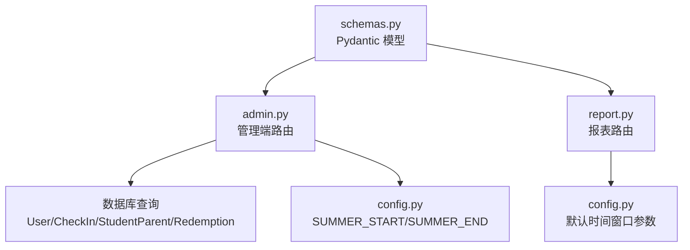
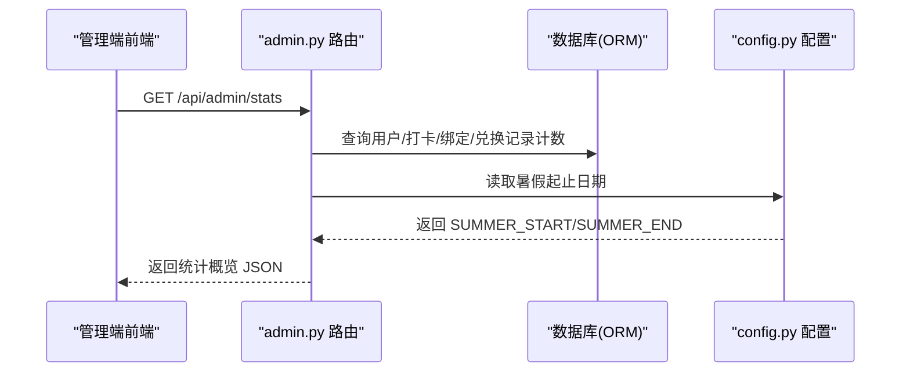
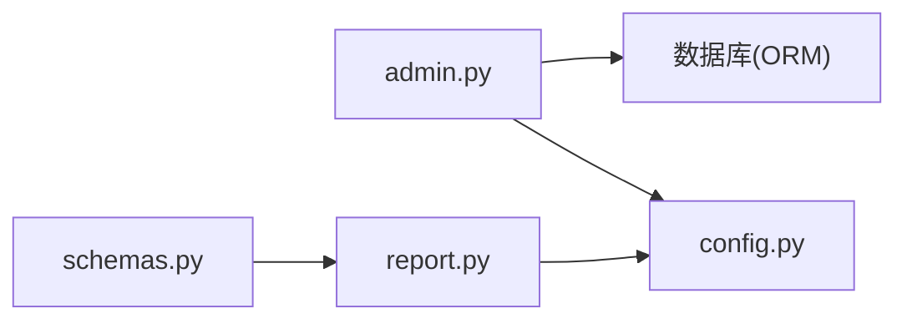

# 数据统计接口

<cite>
**本文引用的文件**   
- [admin.py](file://summer-homework-checkin/backend/app/routers/admin.py)
- [config.py](file://summer-homework-checkin/backend/app/config.py)
- [report.py](file://summer-homework-checkin/backend/app/routers/report.py)
- [schemas.py](file://summer-homework-checkin/backend/app/schemas.py)
</cite>

## 目录
1. [简介](#简介)
2. [项目结构](#项目结构)
3. [核心组件](#核心组件)
4. [架构总览](#架构总览)
5. [详细组件分析](#详细组件分析)
6. [依赖关系分析](#依赖关系分析)
7. [性能与缓存策略](#性能与缓存策略)
8. [故障排查指南](#故障排查指南)
9. [结论](#结论)

## 简介
本文件面向管理后台，提供“系统统计概览”API的完整说明。该接口用于聚合展示以下核心指标：
- 学生数量、家长数量
- 有效打卡数
- 绑定关系数（学生与家长）
- 地理风险打卡数
- 兑换状态统计：待处理、已兑现、已拒绝的数量
- 暑假时间窗口配置信息（起止日期范围）

同时，文档还给出完整的统计数据响应格式示例、字段含义说明，以及数据更新实时性与缓存策略建议。

## 项目结构
与本次文档相关的后端代码位于 summer-homework-checkin/backend 下，关键文件如下：
- 路由层：admin.py（管理端路由）、report.py（报表相关路由）
- 配置层：config.py（包含暑假时间窗口等全局配置）
- 数据模型与响应模式：schemas.py（定义输出结构体）

图表来源
- [admin.py:16-35](file://summer-homework-checkin/backend/app/routers/admin.py#L16-L35)
- [config.py:23-25](file://summer-homework-checkin/backend/app/config.py#L23-L25)
- [report.py:17-24](file://summer-homework-checkin/backend/app/routers/report.py#L17-L24)
- [schemas.py:215-229](file://summer-homework-checkin/backend/app/schemas.py#L215-L229)

章节来源
- [admin.py:16-35](file://summer-homework-checkin/backend/app/routers/admin.py#L16-L35)
- [config.py:23-25](file://summer-homework-checkin/backend/app/config.py#L23-L25)
- [report.py:17-24](file://summer-homework-checkin/backend/app/routers/report.py#L17-L24)
- [schemas.py:215-229](file://summer-homework-checkin/backend/app/schemas.py#L215-L229)

## 核心组件
- 统计概览接口：GET /api/admin/stats
  - 功能：返回系统级统计概览，包括用户规模、打卡质量、绑定关系、地理风险、兑换状态及暑假时间窗口。
  - 权限：需要管理员角色。
  - 数据来源：直接对数据库进行计数查询；暑假窗口来自配置常量。
- 暑假时间窗口：由配置模块提供 SUMMER_START 与 SUMMER_END，作为报表默认统计区间，并在统计概览中以字符串形式返回。

章节来源
- [admin.py:16-35](file://summer-homework-checkin/backend/app/routers/admin.py#L16-L35)
- [config.py:23-25](file://summer-homework-checkin/backend/app/config.py#L23-L25)

## 架构总览
下图展示了管理端统计概览接口的调用路径与数据流向：客户端请求进入 FastAPI 路由，路由层执行数据库计数并组装响应，其中暑假窗口取自配置模块。

图表来源
- [admin.py:16-35](file://summer-homework-checkin/backend/app/routers/admin.py#L16-L35)
- [config.py:23-25](file://summer-homework-checkin/backend/app/config.py#L23-L25)

## 详细组件分析

### 系统统计概览接口：GET /api/admin/stats
- 接口说明
  - 返回系统级统计概览，涵盖学生/家长数量、有效打卡数、绑定关系数、地理风险打卡数、兑换状态统计（待处理/已兑现/已拒绝），以及暑假时间窗口。
- 权限要求
  - 需要管理员角色。
- 请求参数
  - 无
- 响应字段说明
  - students: 整数，学生用户总数
  - parents: 整数，家长用户总数
  - effective_checkins: 整数，标记为有效的打卡记录总数
  - bindings: 整数，学生与家长绑定关系总数
  - geo_risk_checkins: 整数，被标记为地理风险的打卡记录总数
  - redeem_pending: 整数，兑换记录中状态为“待处理”的数量
  - redeem_approved: 整数，兑换记录中状态为“已兑现”的数量
  - redeem_rejected: 整数，兑换记录中状态为“已拒绝”的数量
  - summer_window: 字符串，暑假时间窗口范围，格式为“YYYY-MM-DD ~ YYYY-MM-DD”，来源于配置中的起止日期拼接
- 响应示例
  {
    "students": 120,
    "parents": 98,
    "effective_checkins": 3456,
    "bindings": 110,
    "geo_risk_checkins": 12,
    "redeem_pending": 5,
    "redeem_approved": 42,
    "redeem_rejected": 3,
    "summer_window": "2026-07-01 ~ 2026-08-31"
  }
- 业务规则与计算逻辑
  - 有效打卡数：仅统计 is_effective 为真的打卡记录
  - 地理风险打卡数：仅统计 geo_flag 为真的打卡记录
  - 兑换状态统计：按 Redemption.status 分别计数 pending、fulfilled、rejected
  - 暑假窗口：由配置模块提供的 SUMMER_START 与 SUMMER_END 拼接而成
- 错误码
  - 未授权或无管理员权限时返回 401/403（由权限依赖注入控制）

章节来源
- [admin.py:16-35](file://summer-homework-checkin/backend/app/routers/admin.py#L16-L35)
- [config.py:23-25](file://summer-homework-checkin/backend/app/config.py#L23-L25)

### 暑假时间窗口配置获取方式
- 配置来源
  - 暑假起止日期在配置文件中定义，供报表与统计接口使用。
- 使用位置
  - 统计概览接口将起止日期拼接为字符串返回
  - 报表接口以起止日期作为默认参数，用于限定统计区间
- 字段说明
  - SUMMER_START: 暑假开始日期
  - SUMMER_END: 暑假结束日期
- 注意
  - 生产环境可通过环境变量覆盖其他行为，但暑假窗口目前由配置文件固定值提供

章节来源
- [config.py:23-25](file://summer-homework-checkin/backend/app/config.py#L23-L25)
- [report.py:17-24](file://summer-homework-checkin/backend/app/routers/report.py#L17-L24)

### 兑换状态统计说明
- 统计维度
  - 待处理：status 为 pending 的记录数
  - 已兑现：status 为 fulfilled 的记录数
  - 已拒绝：status 为 rejected 的记录数
- 数据来源
  - 直接从 Redemption 表按状态分组计数
- 一致性保证
  - 审核操作会更新 Redemption 的状态与审计字段，确保统计口径一致

章节来源
- [admin.py:23-26](file://summer-homework-checkin/backend/app/routers/admin.py#L23-L26)

## 依赖关系分析
- 路由层依赖
  - admin.py 依赖数据库会话、权限校验、配置常量
  - report.py 依赖当前用户上下文、服务层构建报告、配置常量
- 数据模型与响应模式
  - schemas.py 定义了 ReportOut 等 Pydantic 模型，用于规范响应结构
- 外部依赖
  - FastAPI、SQLAlchemy ORM、SQLite（本地持久化）

图表来源
- [admin.py:16-35](file://summer-homework-checkin/backend/app/routers/admin.py#L16-L35)
- [report.py:17-24](file://summer-homework-checkin/backend/app/routers/report.py#L17-L24)
- [config.py:23-25](file://summer-homework-checkin/backend/app/config.py#L23-L25)
- [schemas.py:215-229](file://summer-homework-checkin/backend/app/schemas.py#L215-L229)

## 性能与缓存策略
- 实时性
  - 统计接口直接对数据库执行计数查询，结果反映最新数据，具备强一致性
- 潜在瓶颈
  - 当数据量增长时，频繁全表计数可能带来一定开销
- 优化建议
  - 引入应用层缓存（如 Redis）对热点统计指标设置短TTL（例如 10~30 秒），降低数据库压力
  - 针对高并发场景，可考虑异步预计算或增量更新机制
  - 合理索引：确保 User.role、CheckIn.is_effective、CheckIn.geo_flag、Redemption.status 等字段具备合适索引以提升计数效率

[本节为通用性能建议，不直接分析具体文件]

## 故障排查指南
- 常见问题
  - 未授权访问：确认调用方是否携带有效令牌且具备管理员角色
  - 数据不一致：检查兑换审核流程是否正确更新状态与审计字段
  - 暑假窗口异常：核对配置文件中的起止日期是否符合预期
- 定位方法
  - 查看路由层日志与数据库查询耗时
  - 验证权限依赖注入是否生效
  - 检查配置加载与环境变量覆盖情况

章节来源
- [admin.py:16-35](file://summer-homework-checkin/backend/app/routers/admin.py#L16-L35)
- [config.py:23-25](file://summer-homework-checkin/backend/app/config.py#L23-L25)

## 结论
管理后台统计概览接口提供了系统运行状况的关键视图，涵盖用户规模、打卡质量、绑定关系、地理风险与兑换状态等核心指标，并以暑假时间窗口作为统一的时间基准。该接口实现简洁、数据实时性强，适合在管理端高频刷新。若需进一步提升性能，可在应用层引入短期缓存与合适的数据库索引。