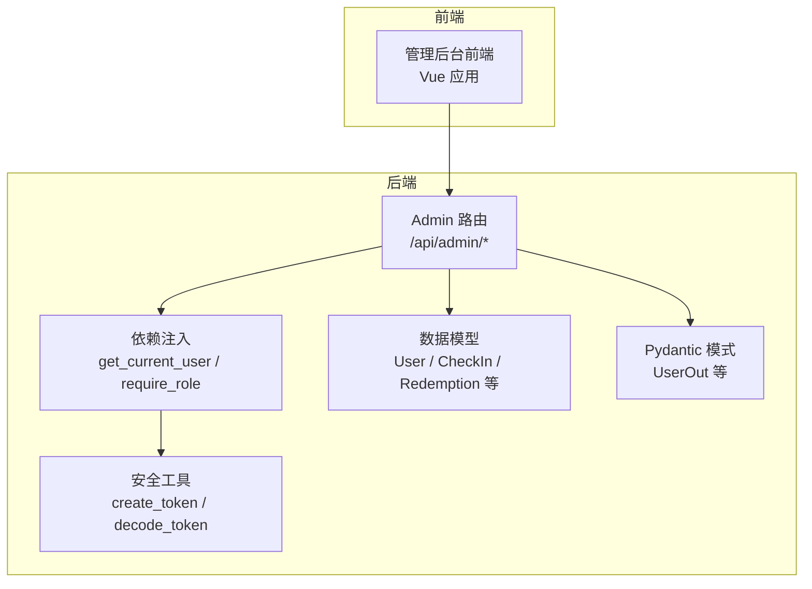
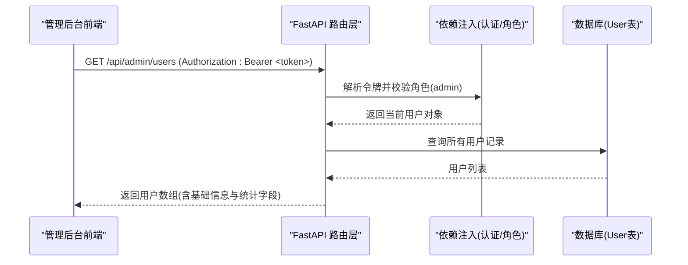
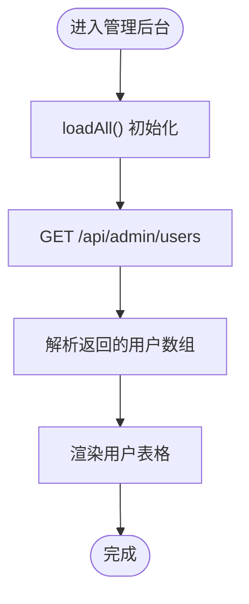
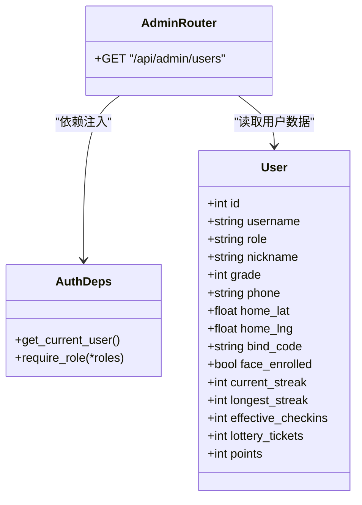
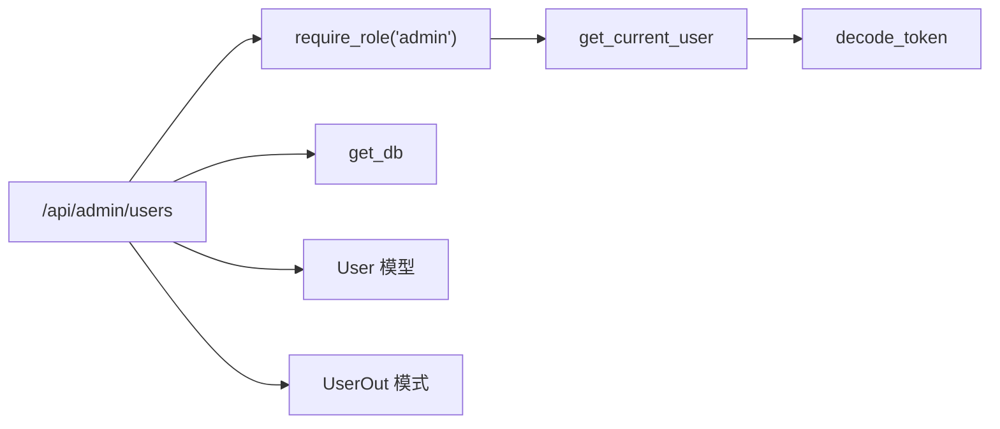

# 用户管理接口

<cite>
**本文引用的文件**   
- [admin.py](file://summer-homework-checkin/backend/app/routers/admin.py)
- [models.py](file://summer-homework-checkin/backend/app/models.py)
- [schemas.py](file://summer-homework-checkin/backend/app/schemas.py)
- [deps.py](file://summer-homework-checkin/backend/app/deps.py)
- [security.py](file://summer-homework-checkin/backend/app/security.py)
- [app.js](file://summer-homework-checkin/frontend/admin/app.js)
</cite>

## 目录
1. [简介](#简介)
2. [项目结构](#项目结构)
3. [核心组件](#核心组件)
4. [架构总览](#架构总览)
5. [详细组件分析](#详细组件分析)
6. [依赖关系分析](#依赖关系分析)
7. [性能考虑](#性能考虑)
8. [故障排查指南](#故障排查指南)
9. [结论](#结论)
10. [附录](#附录)

## 简介
本文件面向“管理后台”的用户管理模块，聚焦于“用户列表查询接口”。该接口用于管理员在后台查看系统内所有用户，并展示与学习进度、积分账户、抽奖券数量等相关的统计信息。当前实现为全量返回用户列表，未内置分页与搜索参数；前端以一次性加载为主。文档同时说明用户状态管理与权限控制机制，并提供请求/响应示例与前后端交互模式说明。

## 项目结构
后端采用 FastAPI + SQLAlchemy 分层设计：路由层（routers）负责 HTTP 接口定义，服务层（services）封装业务逻辑，数据模型（models）映射数据库表，Pydantic 模式（schemas）定义输入输出结构，依赖注入（deps）与鉴权（security）提供认证与角色校验。前端管理界面使用 Vue 3 通过 fetch 调用后端 API。

图表来源
- [admin.py:1-214](file://summer-homework-checkin/backend/app/routers/admin.py#L1-L214)
- [deps.py:1-34](file://summer-homework-checkin/backend/app/deps.py#L1-L34)
- [security.py:1-47](file://summer-homework-checkin/backend/app/security.py#L1-L47)
- [models.py:1-212](file://summer-homework-checkin/backend/app/models.py#L1-L212)
- [schemas.py:1-322](file://summer-homework-checkin/backend/app/schemas.py#L1-L322)

章节来源
- [admin.py:1-214](file://summer-homework-checkin/backend/app/routers/admin.py#L1-L214)
- [models.py:1-212](file://summer-homework-checkin/backend/app/models.py#L1-L212)
- [schemas.py:1-322](file://summer-homework-checkin/backend/app/schemas.py#L1-L322)
- [deps.py:1-34](file://summer-homework-checkin/backend/app/deps.py#L1-L34)
- [security.py:1-47](file://summer-homework-checkin/backend/app/security.py#L1-L47)
- [app.js:1-641](file://summer-homework-checkin/frontend/admin/app.js#L1-L641)

## 核心组件
- 用户列表查询接口
  - 路径与方法：GET /api/admin/users
  - 权限要求：仅管理员可访问（require_role("admin")）
  - 功能：返回全部用户的基本信息与统计字段
  - 筛选/分页/搜索：当前实现不支持按角色筛选、分页或关键词搜索
- 用户数据模型
  - 统一用户表包含角色区分（student/parent/admin），以及学生与家长专属字段
  - 统计冗余字段由打卡服务维护，包括连续打卡天数、有效打卡次数、抽奖券数量、积分余额等
- 认证与授权
  - Bearer Token 认证，基于 HMAC 签名与过期时间校验
  - 依赖注入 get_current_user 解析令牌并获取当前用户
  - require_role 装饰器进行角色校验

章节来源
- [admin.py:38-50](file://summer-homework-checkin/backend/app/routers/admin.py#L38-L50)
- [models.py:11-55](file://summer-homework-checkin/backend/app/models.py#L11-L55)
- [deps.py:13-33](file://summer-homework-checkin/backend/app/deps.py#L13-L33)
- [security.py:20-46](file://summer-homework-checkin/backend/app/security.py#L20-L46)

## 架构总览
下图展示了管理后台用户列表接口的端到端流程：前端携带 Bearer Token 发起请求，后端路由层校验管理员权限后从数据库读取用户记录，并以字典形式返回给前端。

图表来源
- [admin.py:38-50](file://summer-homework-checkin/backend/app/routers/admin.py#L38-L50)
- [deps.py:13-33](file://summer-homework-checkin/backend/app/deps.py#L13-L33)
- [models.py:11-55](file://summer-homework-checkin/backend/app/models.py#L11-L55)

## 详细组件分析

### 用户列表查询接口
- 接口定义
  - 路径：GET /api/admin/users
  - 权限：require_role("admin")
  - 返回：用户数组，每个元素包含 id、username、role、nickname、grade、phone、current_streak、longest_streak、effective_checkins、lottery_tickets、points、bind_code
- 筛选/分页/搜索
  - 当前实现不支持 role 筛选、分页参数（如 page/limit）、关键词搜索（如 username/nickname）
  - 如需支持，可在路由层增加可选参数并在查询时动态构建过滤条件
- 前端调用
  - 管理后台在初始化时调用 loadAll()，其中包含对 /api/admin/users 的请求
  - 返回数据直接赋值到 users 变量供表格渲染

图表来源
- [admin.py:38-50](file://summer-homework-checkin/backend/app/routers/admin.py#L38-L50)
- [app.js:82-88](file://summer-homework-checkin/frontend/admin/app.js#L82-L88)

章节来源
- [admin.py:38-50](file://summer-homework-checkin/backend/app/routers/admin.py#L38-L50)
- [app.js:82-88](file://summer-homework-checkin/frontend/admin/app.js#L82-L88)

### 用户信息字段详情
- 基本信息
  - id：用户唯一标识
  - username：用户名（唯一）
  - role：角色（student/parent/admin）
  - nickname：昵称
  - grade：年级（学生）
  - phone：手机号（家长）
  - bind_code：绑定码（学生，供家长绑定）
- 学习进度
  - current_streak：当前连续有效打卡天数
  - longest_streak：历史最长连续天数
  - effective_checkins：累计有效打卡次数
- 积分账户
  - points：积分余额（打卡获得，用于兑换奖品）
- 抽奖券数量
  - lottery_tickets：当前可用抽奖资格
- 其他
  - face_enrolled：是否已录入人脸（预留扩展）
  - home_lat/home_lng：常用位置坐标（学生）

章节来源
- [models.py:11-55](file://summer-homework-checkin/backend/app/models.py#L11-L55)
- [schemas.py:21-38](file://summer-homework-checkin/backend/app/schemas.py#L21-L38)

### 用户状态管理与权限控制机制
- 认证
  - 登录成功后返回 access_token（Bearer），前端在后续请求头中携带 Authorization: Bearer <token>
  - 服务端通过 decode_token 校验签名与过期时间，再根据 uid 查询用户对象
- 授权
  - require_role("admin") 确保只有管理员能访问管理接口
  - 非管理员或未提供令牌将收到 401/403 错误
- 用户状态
  - 用户角色 role 决定其权限范围
  - 统计字段（连续打卡、有效打卡、积分、抽奖券）由打卡服务在审核通过后更新

图表来源
- [models.py:11-55](file://summer-homework-checkin/backend/app/models.py#L11-L55)
- [admin.py:38-50](file://summer-homework-checkin/backend/app/routers/admin.py#L38-L50)
- [deps.py:13-33](file://summer-homework-checkin/backend/app/deps.py#L13-L33)

章节来源
- [deps.py:13-33](file://summer-homework-checkin/backend/app/deps.py#L13-L33)
- [security.py:20-46](file://summer-homework-checkin/backend/app/security.py#L20-L46)
- [admin.py:38-50](file://summer-homework-checkin/backend/app/routers/admin.py#L38-L50)

### 请求与响应示例
- 请求
  - 方法：GET
  - 路径：/api/admin/users
  - 头部：Authorization: Bearer <token>
- 响应
  - 类型：application/json
  - 主体：用户数组，每项包含 id、username、role、nickname、grade、phone、current_streak、longest_streak、effective_checkins、lottery_tickets、points、bind_code
- 错误
  - 401：未提供令牌或令牌无效/过期
  - 403：无权限访问（非管理员）

章节来源
- [admin.py:38-50](file://summer-homework-checkin/backend/app/routers/admin.py#L38-L50)
- [deps.py:13-33](file://summer-homework-checkin/backend/app/deps.py#L13-L33)

### 与前端用户管理界面的数据交互模式与实时更新机制
- 数据交互模式
  - 前端在登录后调用 loadAll()，依次拉取统计数据、奖品、用户列表、打卡记录等
  - 用户列表通过 GET /api/admin/users 获取，返回结果直接赋值为 users 变量
- 实时更新机制
  - 当前实现为“主动刷新”：当用户操作（如审核打卡、审核兑换）完成后，前端会重新拉取相关数据
  - 对于用户列表，前端在页面初始化时加载一次，未实现定时轮询或 WebSocket 推送
  - 若需实时性，可在用户数据变更时触发前端刷新或引入事件推送机制

章节来源
- [app.js:82-88](file://summer-homework-checkin/frontend/admin/app.js#L82-L88)
- [app.js:120-136](file://summer-homework-checkin/frontend/admin/app.js#L120-L136)
- [app.js:169-187](file://summer-homework-checkin/frontend/admin/app.js#L169-L187)

## 依赖关系分析
- 路由层依赖
  - admin.py 中的 /api/admin/users 依赖 deps.require_role("admin") 进行权限校验
  - 依赖 database.get_db 获取数据库会话
- 认证与安全
  - deps.get_current_user 使用 security.decode_token 解析并校验令牌
  - security.create_token 生成带签名的 token，包含 uid、role、exp
- 数据模型
  - models.User 定义了用户表结构与统计字段
  - schemas.UserOut 定义了对外输出的用户数据结构（与路由返回字段一致）

图表来源
- [admin.py:38-50](file://summer-homework-checkin/backend/app/routers/admin.py#L38-L50)
- [deps.py:13-33](file://summer-homework-checkin/backend/app/deps.py#L13-L33)
- [security.py:20-46](file://summer-homework-checkin/backend/app/security.py#L20-L46)
- [models.py:11-55](file://summer-homework-checkin/backend/app/models.py#L11-L55)
- [schemas.py:21-38](file://summer-homework-checkin/backend/app/schemas.py#L21-L38)

章节来源
- [admin.py:38-50](file://summer-homework-checkin/backend/app/routers/admin.py#L38-L50)
- [deps.py:13-33](file://summer-homework-checkin/backend/app/deps.py#L13-L33)
- [security.py:20-46](file://summer-homework-checkin/backend/app/security.py#L20-L46)
- [models.py:11-55](file://summer-homework-checkin/backend/app/models.py#L11-L55)
- [schemas.py:21-38](file://summer-homework-checkin/backend/app/schemas.py#L21-L38)

## 性能考虑
- 当前接口返回全量用户列表，适用于小规模用户场景
- 若用户规模增长，建议引入分页（page/limit）与搜索（keyword）参数，减少单次响应体积
- 可增加索引优化查询（例如按 role 或 username 建立索引）
- 前端可结合虚拟滚动提升大数据量渲染性能

[本节为通用指导，不直接分析具体文件]

## 故障排查指南
- 401 未提供认证令牌或令牌无效/过期
  - 检查前端是否在请求头中正确设置 Authorization: Bearer <token>
  - 确认 token 未过期且签名有效
- 403 无权限访问该资源
  - 确认当前用户角色为 admin
  - 检查 require_role 是否正确传入 "admin"
- 数据为空或异常
  - 检查数据库连接是否正常
  - 确认用户表是否有数据

章节来源
- [deps.py:13-33](file://summer-homework-checkin/backend/app/deps.py#L13-L33)
- [security.py:33-46](file://summer-homework-checkin/backend/app/security.py#L33-L46)

## 结论
当前用户列表查询接口满足管理员查看全量用户的基础需求，具备完善的认证与角色控制。为满足更复杂的筛选与分页需求，建议在路由层扩展查询参数，并结合前端分页与搜索能力提升用户体验。对于大规模用户场景，应关注性能优化与实时更新的实现方案。

[本节为总结性内容，不直接分析具体文件]

## 附录
- 相关接口参考
  - 统计概览：GET /api/admin/stats
  - 打卡记录：GET /api/admin/checkins
  - 待审核计数：GET /api/admin/checkins/pending-count
  - 审核打卡：PUT /api/admin/checkins/{checkin_id}/review
  - 兑换记录：GET /api/admin/redemptions
  - 审核兑换：PUT /api/admin/redemptions/{redemption_id}/review

章节来源
- [admin.py:16-35](file://summer-homework-checkin/backend/app/routers/admin.py#L16-L35)
- [admin.py:53-103](file://summer-homework-checkin/backend/app/routers/admin.py#L53-L103)
- [admin.py:106-213](file://summer-homework-checkin/backend/app/routers/admin.py#L106-L213)