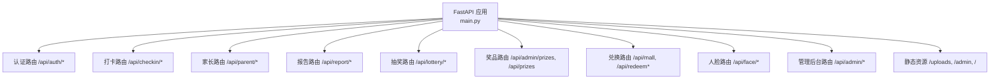
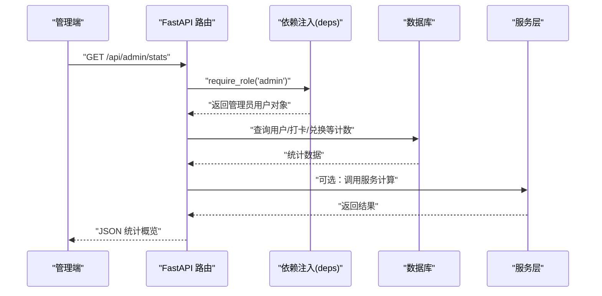
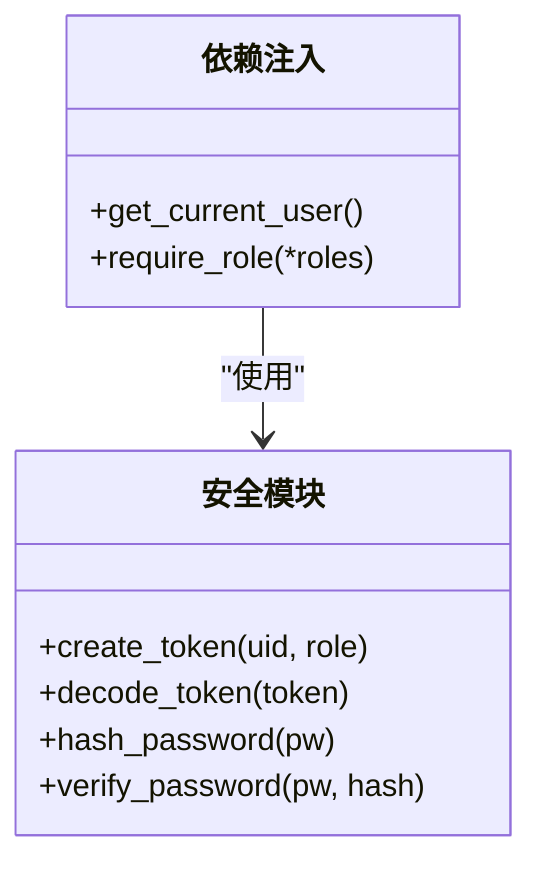
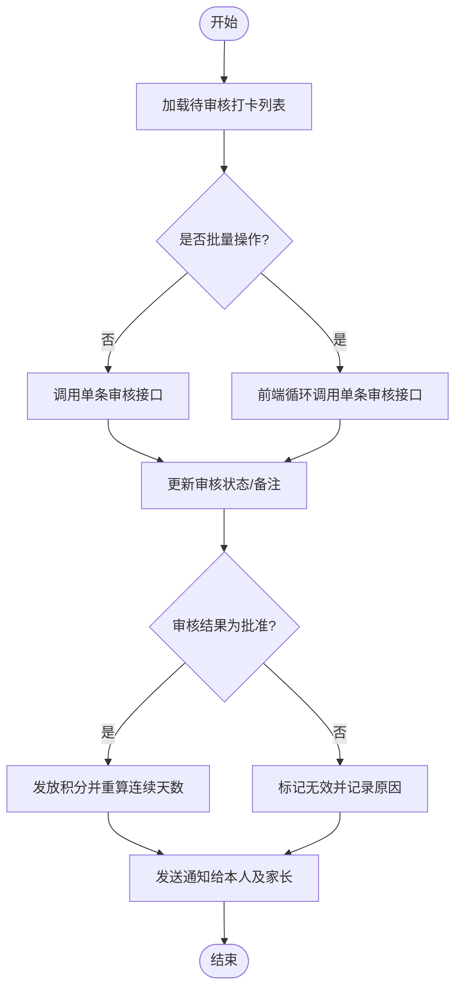
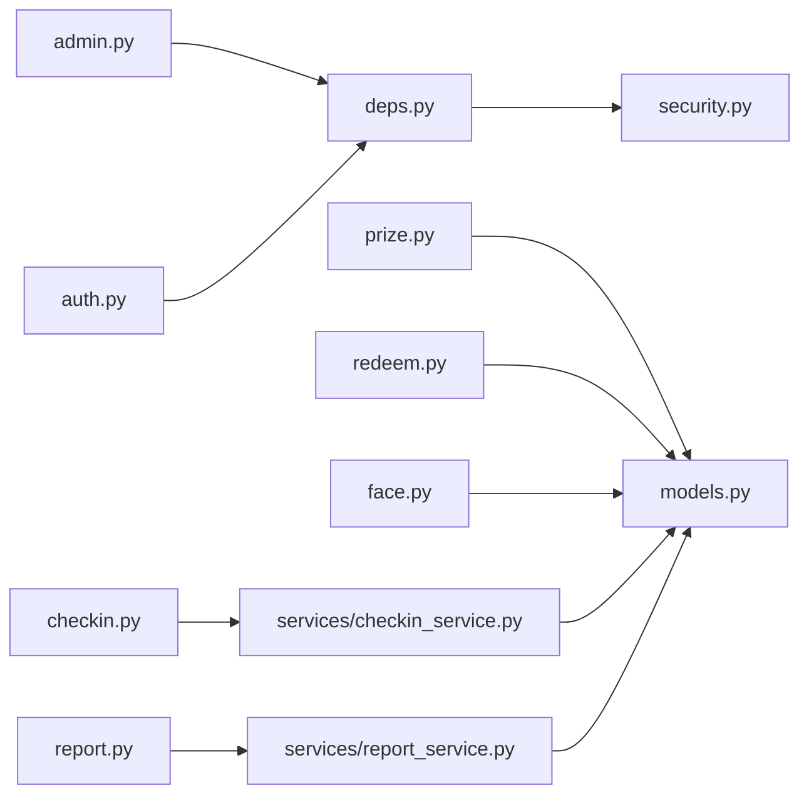

# 管理后台接口

<cite>
**本文引用的文件**   
- [backend/app/main.py](file://summer-homework-checkin/backend/app/main.py)
- [backend/app/routers/admin.py](file://summer-homework-checkin/backend/app/routers/admin.py)
- [backend/app/routers/auth.py](file://summer-homework-checkin/backend/app/routers/auth.py)
- [backend/app/routers/checkin.py](file://summer-homework-checkin/backend/app/routers/checkin.py)
- [backend/app/routers/report.py](file://summer-homework-checkin/backend/app/routers/report.py)
- [backend/app/routers/prize.py](file://summer-homework-checkin/backend/app/routers/prize.py)
- [backend/app/routers/redeem.py](file://summer-homework-checkin/backend/app/routers/redeem.py)
- [backend/app/routers/face.py](file://summer-homework-checkin/backend/app/routers/face.py)
- [backend/app/routers/parent.py](file://summer-homework-checkin/backend/app/routers/parent.py)
- [backend/app/models.py](file://summer-homework-checkin/backend/app/models.py)
- [backend/app/schemas.py](file://summer-homework-checkin/backend/app/schemas.py)
- [backend/app/security.py](file://summer-homework-checkin/backend/app/security.py)
- [backend/app/deps.py](file://summer-homework-checkin/backend/app/deps.py)
- [backend/app/services/checkin_service.py](file://summer-homework-checkin/backend/app/services/checkin_service.py)
- [backend/app/services/report_service.py](file://summer-homework-checkin/backend/app/services/report_service.py)
</cite>

## 目录
1. [简介](#简介)
2. [项目结构](#项目结构)
3. [核心组件](#核心组件)
4. [架构总览](#架构总览)
5. [详细组件分析](#详细组件分析)
6. [依赖关系分析](#依赖关系分析)
7. [性能与扩展性](#性能与扩展性)
8. [故障排查指南](#故障排查指南)
9. [结论](#结论)
10. [附录：前端交互与实时更新建议](#附录前端交互与实时更新建议)

## 简介
本文件为“暑假作业打卡系统”的管理后台专用 API 文档，聚焦管理员专属能力：用户管理、打卡审核、数据统计、奖品与兑换管理、人脸采集状态等。文档覆盖权限验证机制、安全策略、数据模型、关键业务流程（含批量处理建议）、以及与前端管理界面的交互模式与实时更新的可行方案。

## 项目结构
后端基于 FastAPI，采用路由分层与依赖注入，结合 SQLAlchemy ORM 访问数据库；静态资源挂载用于上传照片与管理端页面。

图表来源
- [backend/app/main.py:11-49](file://summer-homework-checkin/backend/app/main.py#L11-L49)

章节来源
- [backend/app/main.py:11-49](file://summer-homework-checkin/backend/app/main.py#L11-L49)

## 核心组件
- 认证与鉴权
  - 登录/注册生成无状态令牌，依赖 HTTPBearer 校验，角色校验通过 require_role 实现。
- 管理后台路由
  - 提供统计概览、用户列表、打卡记录与审核、兑换记录与审核等。
- 业务服务
  - 打卡服务负责创建打卡、审核通过/拒绝、连续天数重算与奖励发放。
  - 报表服务负责按区间聚合打卡与抽奖结果，并生成可视化 HTML。
- 数据模型
  - 统一用户表支持 student/parent/admin 三种角色；打卡、兑换、奖品、通知、闯关任务等实体。

章节来源
- [backend/app/deps.py:13-33](file://summer-homework-checkin/backend/app/deps.py#L13-L33)
- [backend/app/routers/admin.py:16-214](file://summer-homework-checkin/backend/app/routers/admin.py#L16-L214)
- [backend/app/services/checkin_service.py:166-209](file://summer-homework-checkin/backend/app/services/checkin_service.py#L166-L209)
- [backend/app/services/report_service.py:6-50](file://summer-homework-checkin/backend/app/services/report_service.py#L6-L50)
- [backend/app/models.py:11-212](file://summer-homework-checkin/backend/app/models.py#L11-L212)

## 架构总览
管理后台请求经 FastAPI 路由进入，依赖注入解析当前用户与数据库会话，再调用服务层完成业务逻辑，最终返回 JSON 或 HTML。

图表来源
- [backend/app/routers/admin.py:16-35](file://summer-homework-checkin/backend/app/routers/admin.py#L16-L35)
- [backend/app/deps.py:28-33](file://summer-homework-checkin/backend/app/deps.py#L28-L33)

## 详细组件分析

### 认证与权限
- 登录/注册
  - POST /api/auth/register：注册学生或家长账号，返回 access_token 与用户信息。
  - POST /api/auth/login：用户名密码登录，返回 access_token 与用户信息。
  - GET /api/auth/me：获取当前用户信息。
- 权限控制
  - 所有受保护接口通过 HTTPBearer 校验 token，并通过 require_role 限制角色。
  - 管理后台接口需 admin 角色。

图表来源
- [backend/app/deps.py:13-33](file://summer-homework-checkin/backend/app/deps.py#L13-L33)
- [backend/app/security.py:10-46](file://summer-homework-checkin/backend/app/security.py#L10-L46)
- [backend/app/routers/auth.py:13-52](file://summer-homework-checkin/backend/app/routers/auth.py#L13-L52)

章节来源
- [backend/app/routers/auth.py:13-52](file://summer-homework-checkin/backend/app/routers/auth.py#L13-L52)
- [backend/app/deps.py:13-33](file://summer-homework-checkin/backend/app/deps.py#L13-L33)
- [backend/app/security.py:10-46](file://summer-homework-checkin/backend/app/security.py#L10-L46)

### 管理后台统计
- GET /api/admin/stats
  - 返回学生/家长数量、有效打卡数、绑定关系数、地理风险打卡数、待处理/已兑现/已拒绝兑换数、暑期时间窗口。
  - 仅管理员可访问。

章节来源
- [backend/app/routers/admin.py:16-35](file://summer-homework-checkin/backend/app/routers/admin.py#L16-L35)

### 用户管理
- GET /api/admin/users
  - 返回用户列表（包含基础信息与统计冗余字段）。
  - 仅管理员可访问。
- 说明
  - 当前未提供用户增删改与角色分配的直接接口；如需完善，可在管理路由中新增对应 CRUD 与 require_role("admin") 保护。

章节来源
- [backend/app/routers/admin.py:38-50](file://summer-homework-checkin/backend/app/routers/admin.py#L38-L50)
- [backend/app/models.py:11-55](file://summer-homework-checkin/backend/app/models.py#L11-L55)

### 打卡审核
- 列表与待审计数
  - GET /api/admin/checkins：最近打卡记录（含用户昵称、审核状态、图片预览 URL）。
  - GET /api/admin/checkins/pending-count：待审核数量。
- 单条审核
  - PUT /api/admin/checkins/{checkin_id}/review
    - 请求体：ReviewRequest(status="approved"|"rejected", note?)
    - 批准：标记有效、发放积分、重算连续天数与抽奖资格、发送通知。
    - 拒绝：标记无效、发送通知。
- 批量处理建议
  - 当前仅提供单条审核接口。建议在管理前端实现批量选择后循环调用该接口，或在服务端新增批量审核接口以优化性能与一致性。

图表来源
- [backend/app/routers/admin.py:53-103](file://summer-homework-checkin/backend/app/routers/admin.py#L53-L103)
- [backend/app/services/checkin_service.py:166-209](file://summer-homework-checkin/backend/app/services/checkin_service.py#L166-L209)

章节来源
- [backend/app/routers/admin.py:53-103](file://summer-homework-checkin/backend/app/routers/admin.py#L53-L103)
- [backend/app/services/checkin_service.py:166-209](file://summer-homework-checkin/backend/app/services/checkin_service.py#L166-L209)

### 兑换记录管理
- 列表与详情
  - GET /api/admin/redemptions?status=pending|approved|rejected
  - GET /api/admin/redemptions/{redemption_id}
- 审核处理
  - PUT /api/admin/redemptions/{redemption_id}/review
    - approved：标记 fulfilled，记录审核人与时间。
    - rejected：标记 rejected，退还积分，记录审核人与时间。

章节来源
- [backend/app/routers/admin.py:106-214](file://summer-homework-checkin/backend/app/routers/admin.py#L106-L214)

### 数据统计与报表
- 个人报告（学生）
  - GET /api/report/me?start=YYYY-MM-DD&end=YYYY-MM-DD：返回结构化报表数据。
  - GET /api/report/me/html：返回可直接打印的可视化 HTML。
- 家长代查
  - GET /api/parent/child-report/{child_id}?start=...&end=...：家长查看绑定孩子的报告。
  - GET /api/parent/child-report/{child_id}/html：HTML 版本。
- 数据导出与可视化
  - 可通过 /me 与 /me/html 两种形式输出；若需 CSV/Excel 导出，可在管理端增加导出接口，复用 report_service.build_report 的数据结构。

章节来源
- [backend/app/routers/report.py:17-36](file://summer-homework-checkin/backend/app/routers/report.py#L17-L36)
- [backend/app/routers/parent.py:217-237](file://summer-homework-checkin/backend/app/routers/parent.py#L217-L237)
- [backend/app/services/report_service.py:6-109](file://summer-homework-checkin/backend/app/services/report_service.py#L6-L109)

### 奖品与积分商城
- 公开奖品列表（学生端）
  - GET /api/prizes：仅展示上架奖品。
- 管理端奖品管理
  - GET /api/admin/prizes：列出全部奖品。
  - POST /api/admin/prizes：创建奖品。
  - PUT /api/admin/prizes/{pid}：更新奖品。
  - DELETE /api/admin/prizes/{pid}：删除奖品。
- 积分商城（学生/家长）
  - GET /api/mall：聚合余额、可兑换奖品、我的兑换、抽奖记录。
  - POST /api/redeem：兑换奖品（普通奖品或抽奖机会）。
  - POST /api/redeem/{rid}/replace：替换已提交的兑换申请。

章节来源
- [backend/app/routers/prize.py:12-66](file://summer-homework-checkin/backend/app/routers/prize.py#L12-L66)
- [backend/app/routers/redeem.py:24-81](file://summer-homework-checkin/backend/app/routers/redeem.py#L24-L81)

### 人脸采集与状态
- 学生端人脸底图采集
  - POST /api/face/enroll：上传一张人脸照片作为比对基准。
  - GET /api/face/status：查询是否已采集及底图预览。
  - DELETE /api/face/enroll：撤销采集（保留历史文件以供审计）。

章节来源
- [backend/app/routers/face.py:14-45](file://summer-homework-checkin/backend/app/routers/face.py#L14-L45)

### 家长相关能力（辅助管理）
- 绑定孩子、代打卡、代兑换、代抽奖、查看孩子报告与通知等。
- 这些能力虽非管理员直接操作，但有助于家长参与监督，间接提升管理效率。

章节来源
- [backend/app/routers/parent.py:20-237](file://summer-homework-checkin/backend/app/routers/parent.py#L20-L237)

## 依赖关系分析
- 路由层依赖
  - 依赖注入：get_current_user、require_role。
  - 数据库会话：get_db。
  - 服务层：checkin_service、report_service、redeem_service、lottery_service、face_service。
- 模型与配置
  - models.py 定义实体与关系。
  - schemas.py 定义请求/响应模型。
  - security.py 提供令牌与密码工具。
  - deps.py 提供认证与角色校验。

图表来源
- [backend/app/routers/admin.py:1-214](file://summer-homework-checkin/backend/app/routers/admin.py#L1-L214)
- [backend/app/routers/auth.py:1-52](file://summer-homework-checkin/backend/app/routers/auth.py#L1-L52)
- [backend/app/routers/checkin.py:1-80](file://summer-homework-checkin/backend/app/routers/checkin.py#L1-L80)
- [backend/app/routers/report.py:1-36](file://summer-homework-checkin/backend/app/routers/report.py#L1-L36)
- [backend/app/routers/prize.py:1-66](file://summer-homework-checkin/backend/app/routers/prize.py#L1-L66)
- [backend/app/routers/redeem.py:1-81](file://summer-homework-checkin/backend/app/routers/redeem.py#L1-L81)
- [backend/app/routers/face.py:1-45](file://summer-homework-checkin/backend/app/routers/face.py#L1-L45)
- [backend/app/services/checkin_service.py:1-254](file://summer-homework-checkin/backend/app/services/checkin_service.py#L1-L254)
- [backend/app/services/report_service.py:1-109](file://summer-homework-checkin/backend/app/services/report_service.py#L1-L109)
- [backend/app/models.py:1-212](file://summer-homework-checkin/backend/app/models.py#L1-L212)
- [backend/app/deps.py:1-34](file://summer-homework-checkin/backend/app/deps.py#L1-L34)
- [backend/app/security.py:1-47](file://summer-homework-checkin/backend/app/security.py#L1-L47)

## 性能与扩展性
- 批量审核
  - 当前为单条审核接口，建议在前端实现批量提交；若数据量大，可在服务端新增批量审核接口以减少往返与事务开销。
- 分页与筛选
  - 打卡与兑换列表目前固定 limit(500)，建议增加分页参数与多条件筛选以提升大数据量下的性能。
- 缓存
  - 统计接口可考虑短期缓存（如 Redis），降低高频查询对数据库的压力。
- 并发与事务
  - 审核通过涉及积分发放与连续天数重算，应保持事务一致性；必要时引入乐观锁避免竞态。

[本节为通用建议，不直接分析具体文件]

## 故障排查指南
- 常见错误码
  - 401：未提供或无效/过期令牌。
  - 403：角色不足（非管理员访问管理接口）。
  - 400：业务校验失败（如补卡规则、重复审核、参数非法）。
  - 404：资源不存在（打卡/兑换记录）。
- 定位步骤
  - 检查请求头是否携带正确的 Authorization: Bearer <token>。
  - 确认当前用户角色是否为 admin。
  - 核对请求体字段是否符合 ReviewRequest 等 schema 定义。
  - 查看服务层异常抛出位置与消息提示。

章节来源
- [backend/app/deps.py:13-33](file://summer-homework-checkin/backend/app/deps.py#L13-L33)
- [backend/app/routers/admin.py:84-103](file://summer-homework-checkin/backend/app/routers/admin.py#L84-L103)
- [backend/app/services/checkin_service.py:166-209](file://summer-homework-checkin/backend/app/services/checkin_service.py#L166-L209)

## 结论
管理后台提供了完整的打卡审核、兑换审核、统计概览与奖品管理能力，配合统一的认证与角色校验机制，满足日常运营需求。后续可扩展批量审核、分页筛选、报表导出与更细粒度的权限控制，进一步提升效率与安全性。

[本节为总结，不直接分析具体文件]

## 附录：前端交互与实时更新建议
- 数据交互模式
  - 管理端登录后保存 access_token，在后续请求中通过 Authorization 头传递。
  - 列表页拉取数据，详情页按需加载；审核操作成功后刷新列表与待审计数。
- 实时更新机制
  - 短轮询：每 N 秒轮询 /api/admin/checkins/pending-count 与 /api/admin/checkins 增量更新。
  - WebSocket/SSE：若需要即时推送，可在服务端新增事件通道，当审核完成后向管理端推送变更。
- 安全加固
  - 强制 HTTPS、CORS 白名单、限流与防刷、敏感操作二次确认与审计日志。

[本节为通用建议，不直接分析具体文件]