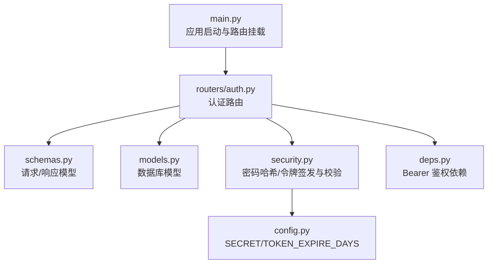
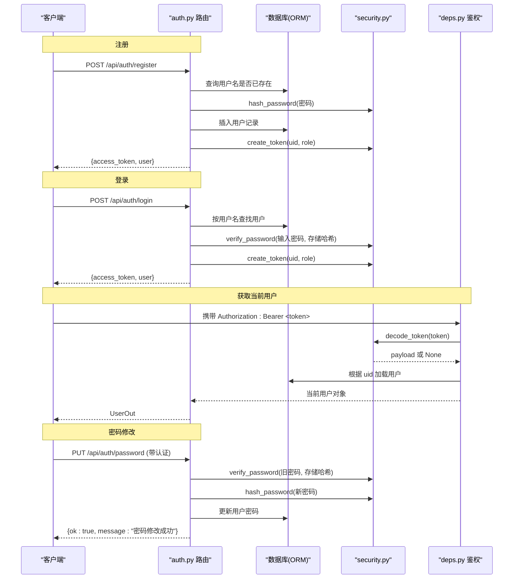
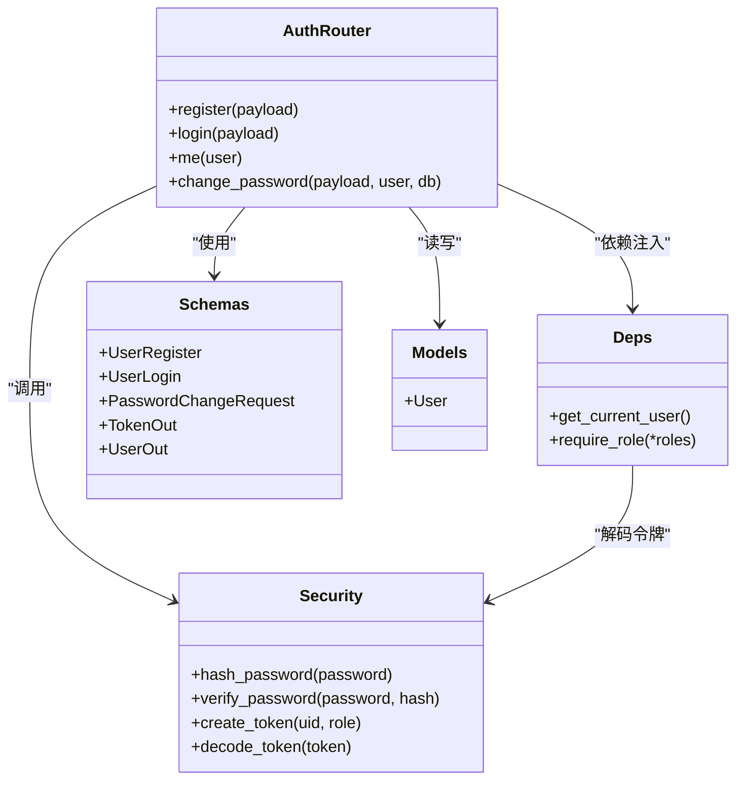

# 认证接口

<cite>
**本文引用的文件**
- [summer-homework-checkin/backend/app/routers/auth.py](file://summer-homework-checkin/backend/app/routers/auth.py)
- [summer-homework-checkin/backend/app/schemas.py](file://summer-homework-checkin/backend/app/schemas.py)
- [summer-homework-checkin/backend/app/models.py](file://summer-homework-checkin/backend/app/models.py)
- [summer-homework-checkin/backend/app/security.py](file://summer-homework-checkin/backend/app/security.py)
- [summer-homework-checkin/backend/app/deps.py](file://summer-homework-checkin/backend/app/deps.py)
- [summer-homework-checkin/backend/app/config.py](file://summer-homework-checkin/backend/app/config.py)
- [summer-homework-checkin/backend/app/main.py](file://summer-homework-checkin/backend/app/main.py)
- [summer-homework-checkin/tests/test_auth.py](file://summer-homework-checkin/tests/test_auth.py)
</cite>

## 更新摘要
**变更内容**
- 新增密码修改端点 `/api/auth/password` 的详细文档说明
- 更新认证流程架构图以包含密码修改功能
- 添加密码修改接口的请求参数、响应格式和错误处理说明
- 完善安全考虑部分，强调密码修改的安全机制

## 目录
1. [简介](#简介)
2. [项目结构](#项目结构)
3. [核心组件](#核心组件)
4. [架构总览](#架构总览)
5. [详细接口说明](#详细接口说明)
6. [依赖关系分析](#依赖关系分析)
7. [性能与安全考虑](#性能与安全考虑)
8. [故障排查指南](#故障排查指南)
9. [结论](#结论)
10. [附录：客户端集成示例与最佳实践](#附录客户端集成示例与最佳实践)

## 简介
本文件为"暑假作业打卡系统"后端认证模块的 API 文档，覆盖以下核心能力：
- 用户注册：POST /api/auth/register
- 用户登录：POST /api/auth/login
- 获取当前用户信息：GET /api/auth/me
- **新增** 密码修改：PUT /api/auth/password

同时说明令牌生成机制、有效期、刷新策略建议、错误处理规范以及客户端集成要点。

## 项目结构
认证相关代码位于 summer-homework-checkin/backend/app 下，关键文件职责如下：
- routers/auth.py：定义认证路由（注册、登录、获取当前用户、**密码修改**）
- schemas.py：请求/响应数据模型（Pydantic），包含 PasswordChangeRequest
- models.py：数据库模型（SQLAlchemy）
- security.py：密码哈希、令牌签发与校验
- deps.py：FastAPI 依赖注入（Bearer 鉴权、角色校验）
- config.py：全局配置（密钥、令牌有效期等）
- main.py：应用入口与路由挂载

**图表来源**
- [summer-homework-checkin/backend/app/main.py:1-48](file://summer-homework-checkin/backend/app/main.py#L1-L48)
- [summer-homework-checkin/backend/app/routers/auth.py:1-67](file://summer-homework-checkin/backend/app/routers/auth.py#L1-L67)
- [summer-homework-checkin/backend/app/schemas.py:1-327](file://summer-homework-checkin/backend/app/schemas.py#L1-L327)
- [summer-homework-checkin/backend/app/models.py:1-212](file://summer-homework-checkin/backend/app/models.py#L1-L212)
- [summer-homework-checkin/backend/app/security.py:1-54](file://summer-homework-checkin/backend/app/security.py#L1-L54)
- [summer-homework-checkin/backend/app/deps.py:1-34](file://summer-homework-checkin/backend/app/deps.py#L1-L34)
- [summer-homework-checkin/backend/app/config.py:1-80](file://summer-homework-checkin/backend/app/config.py#L1-L80)

## 核心组件
- 路由层：提供 /api/auth/* 端点，负责参数校验、业务编排与响应封装
- 安全层：密码哈希、HMAC 签名令牌签发与校验
- 依赖注入：HTTP Bearer 鉴权，解析并校验令牌，返回当前用户对象
- 数据模型：User 实体及 TokenOut/UserOut/PasswordChangeRequest 等响应结构

**章节来源**
- [summer-homework-checkin/backend/app/routers/auth.py:1-67](file://summer-homework-checkin/backend/app/routers/auth.py#L1-L67)
- [summer-homework-checkin/backend/app/security.py:1-54](file://summer-homework-checkin/backend/app/security.py#L1-L54)
- [summer-homework-checkin/backend/app/deps.py:1-34](file://summer-homework-checkin/backend/app/deps.py#L1-L34)
- [summer-homework-checkin/backend/app/schemas.py:1-327](file://summer-homework-checkin/backend/app/schemas.py#L1-L327)
- [summer-homework-checkin/backend/app/models.py:1-212](file://summer-homework-checkin/backend/app/models.py#L1-L212)

## 架构总览
认证流程涉及路由、安全、依赖注入与数据库访问。下图展示注册、登录、获取当前用户和密码修改的调用链。

**图表来源**
- [summer-homework-checkin/backend/app/routers/auth.py:13-66](file://summer-homework-checkin/backend/app/routers/auth.py#L13-L66)
- [summer-homework-checkin/backend/app/security.py:11-24](file://summer-homework-checkin/backend/app/security.py#L11-L24)
- [summer-homework-checkin/backend/app/deps.py:13-25](file://summer-homework-checkin/backend/app/deps.py#L13-L25)
- [summer-homework-checkin/backend/app/models.py:11-54](file://summer-homework-checkin/backend/app/models.py#L11-L54)

## 详细接口说明

### 通用约定
- 基础路径：/api/auth
- 内容类型：application/json
- 认证方式：Bearer Token（Authorization: Bearer <token>）
- 统一错误格式：HTTPException 返回 JSON，包含 detail 字段
- 状态码：
  - 200：成功
  - 400：请求参数错误或业务校验失败
  - 401：未认证或令牌无效/过期
  - 403：权限不足（如角色不匹配）
  - 5xx：服务端异常

**章节来源**
- [summer-homework-checkin/backend/app/routers/auth.py:1-10](file://summer-homework-checkin/backend/app/routers/auth.py#L1-L10)
- [summer-homework-checkin/backend/app/deps.py:17-25](file://summer-homework-checkin/backend/app/deps.py#L17-L25)

---

### 用户注册
- 方法：POST
- 路径：/api/auth/register
- 功能：创建新用户并返回访问令牌与用户信息

请求体（JSON）
- username：字符串，必填，唯一
- password：字符串，必填
- nickname：字符串，必填
- role：枚举，可选，默认 student；取值 student | parent
- grade：整数，可选，默认 3；仅学生有效
- phone：字符串，可选；仅家长有效
- home_lat：浮点数，可选；仅学生有效
- home_lng：浮点数，可选；仅学生有效

响应体（JSON）
- access_token：字符串，HMAC 签名的无状态令牌
- token_type：固定值 bearer
- user：用户信息对象，包含 id、username、role、nickname、grade、phone、home_lat、home_lng、bind_code、face_enrolled、current_streak、longest_streak、effective_checkins、lottery_tickets、points 等字段

错误处理
- 400：角色不支持、用户名已存在
- 其他：由 FastAPI 自动处理的参数校验错误（422）

**章节来源**
- [summer-homework-checkin/backend/app/routers/auth.py:13-39](file://summer-homework-checkin/backend/app/routers/auth.py#L13-L39)
- [summer-homework-checkin/backend/app/schemas.py:5-14](file://summer-homework-checkin/backend/app/schemas.py#L5-L14)
- [summer-homework-checkin/backend/app/schemas.py:21-44](file://summer-homework-checkin/backend/app/schemas.py#L21-L44)
- [summer-homework-checkin/backend/app/models.py:11-54](file://summer-homework-checkin/backend/app/models.py#L11-L54)

---

### 用户登录
- 方法：POST
- 路径：/api/auth/login
- 功能：验证用户名与密码，成功后返回访问令牌与用户信息

请求体（JSON）
- username：字符串，必填
- password：字符串，必填

响应体（JSON）
- access_token：字符串，HMAC 签名的无状态令牌
- token_type：固定值 bearer
- user：用户信息对象（同注册响应）

错误处理
- 401：用户名或密码错误
- 其他：参数校验错误（422）

JWT 令牌机制说明
- 令牌格式：base64(body).hmac_sha256_signature
- body 包含：uid、role、exp（过期时间戳）
- 有效期：TOKEN_EXPIRE_DAYS 天（默认 30 天），通过环境变量配置
- 校验过程：依赖注入中先验签再判过期，再根据 uid 查库确认用户存在

**章节来源**
- [summer-homework-checkin/backend/app/routers/auth.py:42-48](file://summer-homework-checkin/backend/app/routers/auth.py#L42-L48)
- [summer-homework-checkin/backend/app/security.py:27-53](file://summer-homework-checkin/backend/app/security.py#L27-L53)
- [summer-homework-checkin/backend/app/config.py:46](file://summer-homework-checkin/backend/app/config.py#L46)
- [summer-homework-checkin/backend/app/deps.py:17-25](file://summer-homework-checkin/backend/app/deps.py#L17-L25)

---

### 获取当前用户信息
- 方法：GET
- 路径：/api/auth/me
- 功能：在已认证前提下返回当前用户信息

请求头
- Authorization: Bearer <token>

响应体（JSON）
- user：用户信息对象（同注册/登录响应中的 user）

错误处理
- 401：未提供令牌、令牌无效或已过期、用户不存在
- 其他：参数校验错误（422）

**章节来源**
- [summer-homework-checkin/backend/app/routers/auth.py:51-53](file://summer-homework-checkin/backend/app/routers/auth.py#L51-L53)
- [summer-homework-checkin/backend/app/deps.py:13-25](file://summer-homework-checkin/backend/app/deps.py#L13-L25)

---

### 密码修改
- 方法：PUT
- 路径：/api/auth/password
- 功能：修改当前用户的密码，需要验证原密码并提供新密码

**新增** 此接口提供了完整的密码修改功能，包含严格的安全验证机制。

请求头
- Authorization: Bearer <token>

请求体（JSON）
- old_password：字符串，必填，用于验证用户身份
- new_password：字符串，必填，新密码必须至少4个字符

响应体（JSON）
- ok：布尔值，表示操作是否成功
- message：字符串，操作结果描述信息

错误处理
- 400：原密码错误、新密码长度不足4位
- 401：未提供令牌、令牌无效或已过期、用户不存在
- 其他：参数校验错误（422）

安全特性
- 原密码验证：使用 PBKDF2-SHA256 算法验证旧密码正确性
- 密码强度检查：新密码最小长度为4个字符
- 安全哈希：新密码使用随机盐进行 PBKDF2-SHA256 哈希存储
- 原子操作：密码更新在单个数据库事务中完成

**章节来源**
- [summer-homework-checkin/backend/app/routers/auth.py:56-66](file://summer-homework-checkin/backend/app/routers/auth.py#L56-L66)
- [summer-homework-checkin/backend/app/schemas.py:40-43](file://summer-homework-checkin/backend/app/schemas.py#L40-L43)
- [summer-homework-checkin/backend/app/security.py:11-24](file://summer-homework-checkin/backend/app/security.py#L11-L24)

---

### 数据模型与字段说明
- 用户注册/登录/响应模型定义见 schemas.py
- **新增** 密码修改请求模型 PasswordChangeRequest
- 用户实体字段定义见 models.py（含学生与家长差异化字段）
- 令牌输出结构见 TokenOut

**章节来源**
- [summer-homework-checkin/backend/app/schemas.py:5-49](file://summer-homework-checkin/backend/app/schemas.py#L5-L49)
- [summer-homework-checkin/backend/app/models.py:11-54](file://summer-homework-checkin/backend/app/models.py#L11-L54)

## 依赖关系分析
- 路由 auth.py 依赖：
  - schemas.py：请求/响应模型（包含 PasswordChangeRequest）
  - models.py：数据库模型
  - security.py：密码哈希、令牌签发与校验
  - deps.py：Bearer 鉴权与角色检查
  - database.get_db：会话注入（由 main.py 挂载路由时生效）

**图表来源**
- [summer-homework-checkin/backend/app/routers/auth.py:1-67](file://summer-homework-checkin/backend/app/routers/auth.py#L1-L67)
- [summer-homework-checkin/backend/app/security.py:1-54](file://summer-homework-checkin/backend/app/security.py#L1-L54)
- [summer-homework-checkin/backend/app/deps.py:1-34](file://summer-homework-checkin/backend/app/deps.py#L1-L34)
- [summer-homework-checkin/backend/app/schemas.py:1-49](file://summer-homework-checkin/backend/app/schemas.py#L1-L49)
- [summer-homework-checkin/backend/app/models.py:11-54](file://summer-homework-checkin/backend/app/models.py#L11-L54)

## 性能与安全考虑
- 密码哈希：采用 PBKDF2-SHA256，迭代次数较高，兼顾安全性与性能
- 令牌校验：HMAC 签名 + 过期时间校验，避免第三方篡改
- 令牌有效期：默认 30 天，可通过环境变量调整
- **新增** 密码修改安全机制：
  - 原密码验证防止未授权密码修改
  - 新密码长度验证确保基本安全性
  - 随机盐生成避免彩虹表攻击
  - 原子数据库操作保证数据一致性
- 生产环境建议：
  - SECRET 必须通过环境变量注入，禁止硬编码
  - 启用 HTTPS，防止中间人攻击
  - 对敏感字段进行脱敏输出
  - 增加速率限制与账号锁定策略，防范暴力破解
  - 实现令牌刷新机制（见附录）
  - 考虑添加密码复杂度规则（大小写字母、数字、特殊字符）
  - 实施密码历史检查，防止重复使用旧密码

**章节来源**
- [summer-homework-checkin/backend/app/security.py:11-24](file://summer-homework-checkin/backend/app/security.py#L11-L24)
- [summer-homework-checkin/backend/app/config.py:46](file://summer-homework-checkin/backend/app/config.py#L46)
- [summer-homework-checkin/backend/app/routers/auth.py:56-66](file://summer-homework-checkin/backend/app/routers/auth.py#L56-L66)

## 故障排查指南
- 401 未认证或令牌无效：
  - 检查 Authorization 头是否正确携带 Bearer Token
  - 确认令牌未过期且未被篡改
  - 确认用户仍存在数据库中
- 400 用户名已存在：
  - 更换用户名或提示用户登录
- 400 角色不支持：
  - 仅支持 student 与 parent，检查传入 role
- **新增** 400 密码修改错误：
  - 原密码错误：检查输入的旧密码是否正确
  - 新密码太短：确保新密码至少4个字符
- 422 参数校验失败：
  - 检查请求体字段类型与必填项是否符合 schema 定义

**章节来源**
- [summer-homework-checkin/backend/app/routers/auth.py:14-18](file://summer-homework-checkin/backend/app/routers/auth.py#L14-L18)
- [summer-homework-checkin/backend/app/routers/auth.py:58-61](file://summer-homework-checkin/backend/app/routers/auth.py#L58-L61)
- [summer-homework-checkin/backend/app/deps.py:17-25](file://summer-homework-checkin/backend/app/deps.py#L17-L25)

## 结论
认证模块以简洁清晰的 FastAPI 路由为核心，结合 Pydantic 模型与 SQLAlchemy 模型，实现了注册、登录、获取当前用户与密码修改的完整认证能力。新增的密码修改接口提供了完善的安全验证机制，包括原密码验证、密码长度检查和安全的哈希存储。令牌采用 HMAC 签名与过期控制，满足无状态鉴权需求。生产部署需关注密钥管理、HTTPS、速率限制与令牌刷新策略。

## 附录：客户端集成示例与最佳实践

### 请求与响应示例（文本描述）
- 注册
  - 请求示例（JSON）：
    {
      "username": "alice",
      "password": "your-password",
      "nickname": "Alice",
      "role": "student",
      "grade": 5,
      "home_lat": 31.2304,
      "home_lng": 121.4737
    }
  - 响应示例（JSON）：
    {
      "access_token": "eyJ...signature",
      "token_type": "bearer",
      "user": {
        "id": 1,
        "username": "alice",
        "role": "student",
        "nickname": "Alice",
        "grade": 5,
        "phone": null,
        "home_lat": 31.2304,
        "home_lng": 121.4737,
        "bind_code": "S00001",
        "face_enrolled": false,
        "current_streak": 0,
        "longest_streak": 0,
        "effective_checkins": 0,
        "lottery_tickets": 0,
        "points": 0
      }
    }

- 登录
  - 请求示例（JSON）：
    {
      "username": "alice",
      "password": "your-password"
    }
  - 响应示例（JSON）：
    {
      "access_token": "eyJ...signature",
      "token_type": "bearer",
      "user": { ...同上 user 结构... }
    }

- 获取当前用户
  - 请求头：
    Authorization: Bearer eyJ...signature
  - 响应示例（JSON）：
    {
      "id": 1,
      "username": "alice",
      "role": "student",
      "nickname": "Alice",
      "grade": 5,
      "phone": null,
      "home_lat": 31.2304,
      "home_lng": 121.4737,
      "bind_code": "S00001",
      "face_enrolled": false,
      "current_streak": 0,
      "longest_streak": 0,
      "effective_checkins": 0,
      "lottery_tickets": 0,
      "points": 0
    }

- **新增** 密码修改
  - 请求头：
    Authorization: Bearer eyJ...signature
  - 请求示例（JSON）：
    {
      "old_password": "your-current-password",
      "new_password": "your-new-password"
    }
  - 成功响应示例（JSON）：
    {
      "ok": true,
      "message": "密码修改成功，下次登录请使用新密码"
    }
  - 错误响应示例（JSON）：
    {
      "detail": "原密码错误"
    }
    或
    {
      "detail": "新密码至少 4 位"
    }

### 令牌有效期与刷新机制
- 有效期：TOKEN_EXPIRE_DAYS 天（默认 30 天），可在配置中调整
- 刷新机制建议：
  - 引入 refresh_token（可独立签发，更长有效期，绑定设备指纹或 IP 白名单）
  - 前端在 access_token 即将过期前调用刷新接口换取新 access_token
  - 服务端维护 refresh_token 黑名单或短期缓存，支持主动失效
  - 刷新接口需二次校验（如最近登录时间、设备指纹一致性）

**章节来源**
- [summer-homework-checkin/backend/app/config.py:46](file://summer-homework-checkin/backend/app/config.py#L46)
- [summer-homework-checkin/backend/app/security.py:27-53](file://summer-homework-checkin/backend/app/security.py#L27-L53)

### 客户端集成最佳实践
- 始终通过 HTTPS 发起请求
- 将 access_token 保存在安全存储（如内存或安全键值存储），避免持久化到明文
- 每次请求自动附加 Authorization: Bearer <token>
- 捕获 401 错误后触发刷新流程；若刷新失败则引导重新登录
- 对敏感操作增加二次确认或额外校验（如短信验证码）
- 记录必要的日志与指标（登录成功率、令牌刷新率、异常分布）
- **新增** 密码修改最佳实践：
  - 修改密码后提示用户重新登录
  - 显示友好的错误消息指导用户修正输入
  - 实施密码强度实时验证
  - 提供密码可见性切换功能
  - 记录密码修改操作日志用于安全审计

[本节为概念性指导，无需源码引用]