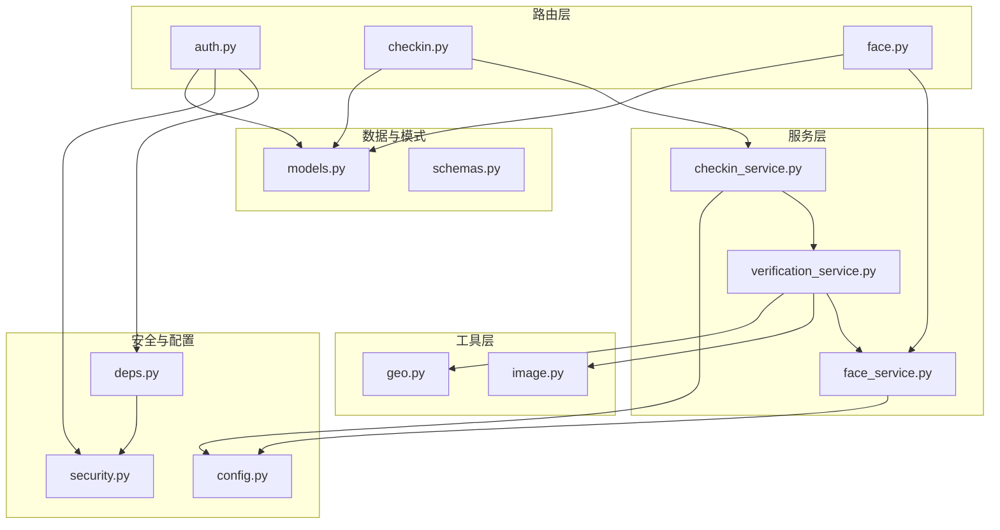
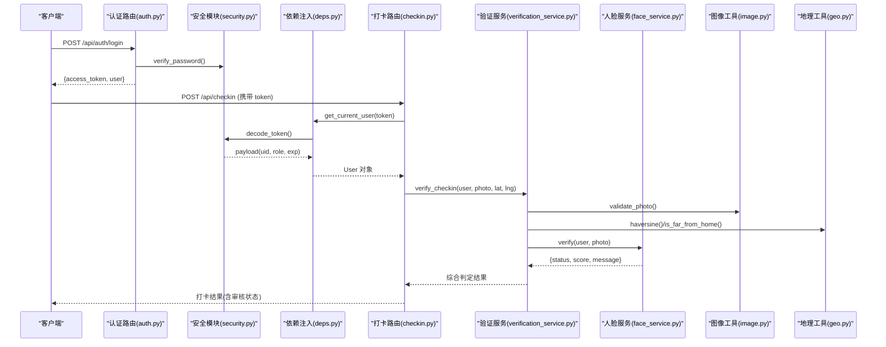
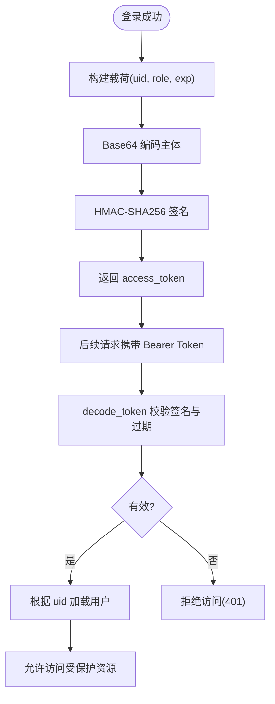
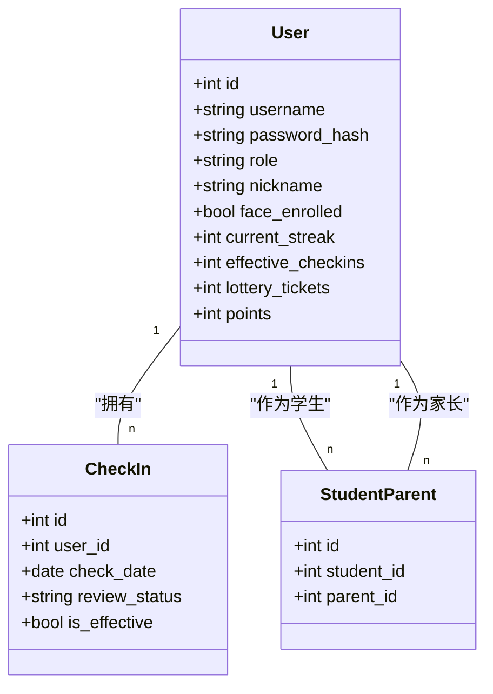
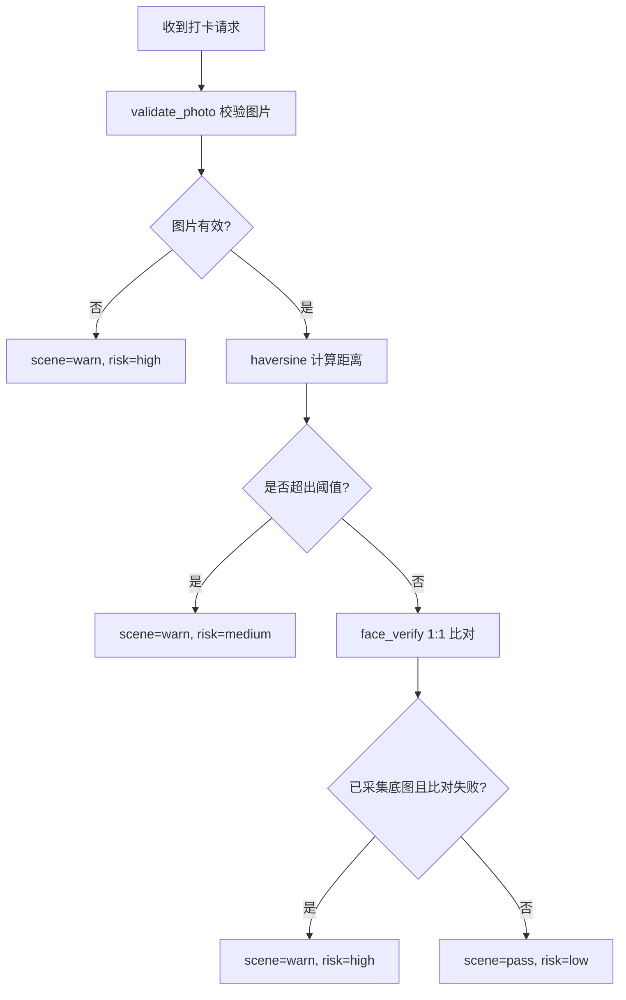
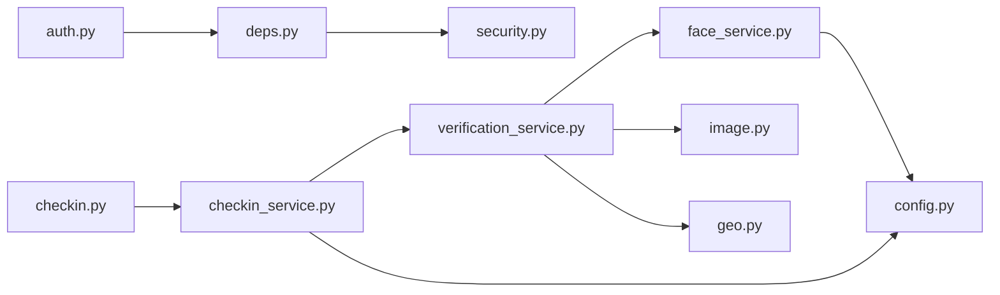

# 安全与认证机制

<cite>
**本文引用的文件**   
- [security.py](file://summer-homework-checkin/backend/app/security.py)
- [config.py](file://summer-homework-checkin/backend/app/config.py)
- [models.py](file://summer-homework-checkin/backend/app/models.py)
- [schemas.py](file://summer-homework-checkin/backend/app/schemas.py)
- [deps.py](file://summer-homework-checkin/backend/app/deps.py)
- [routers/auth.py](file://summer-homework-checkin/backend/app/routers/auth.py)
- [routers/checkin.py](file://summer-homework-checkin/backend/app/routers/checkin.py)
- [routers/face.py](file://summer-homework-checkin/backend/app/routers/face.py)
- [services/verification_service.py](file://summer-homework-checkin/backend/app/services/verification_service.py)
- [services/face_service.py](file://summer-homework-checkin/backend/app/services/face_service.py)
- [utils/image.py](file://summer-homework-checkin/backend/app/utils/image.py)
- [utils/geo.py](file://summer-homework-checkin/backend/app/utils/geo.py)
</cite>

## 目录
1. [简介](#简介)
2. [项目结构](#项目结构)
3. [核心组件](#核心组件)
4. [架构总览](#架构总览)
5. [详细组件分析](#详细组件分析)
6. [依赖关系分析](#依赖关系分析)
7. [性能与安全考量](#性能与安全考量)
8. [故障排查指南](#故障排查指南)
9. [结论](#结论)
10. [附录：配置项清单](#附录配置项清单)

## 简介
本文件聚焦于“暑假作业打卡”后端的安全与认证机制，系统性阐述以下能力：
- JWT 令牌认证（生成、校验、会话管理）
- 多角色权限控制（学生、家长、管理员）
- 四重防代打卡验证（照片真实性检测、地理位置一致性、人脸识别 1:1 比对、场景合规综合判定）
- 密码哈希加密、输入校验、SQL 注入防护等基础安全措施
- 安全配置建议、漏洞防护与最佳实践

## 项目结构
本项目采用分层架构：路由层负责 HTTP 接口与参数校验；服务层封装业务规则；工具层提供图像解析、地理距离计算等通用能力；安全模块提供密码哈希与令牌处理；模型与模式定义数据与请求响应结构。

图表来源
- [routers/auth.py:1-52](file://summer-homework-checkin/backend/app/routers/auth.py#L1-L52)
- [routers/checkin.py:1-80](file://summer-homework-checkin/backend/app/routers/checkin.py#L1-L80)
- [routers/face.py:1-45](file://summer-homework-checkin/backend/app/routers/face.py#L1-L45)
- [services/checkin_service.py:1-254](file://summer-homework-checkin/backend/app/services/checkin_service.py#L1-L254)
- [services/verification_service.py:1-71](file://summer-homework-checkin/backend/app/services/verification_service.py#L1-L71)
- [services/face_service.py:1-133](file://summer-homework-checkin/backend/app/services/face_service.py#L1-L133)
- [utils/image.py:1-61](file://summer-homework-checkin/backend/app/utils/image.py#L1-L61)
- [utils/geo.py:1-24](file://summer-homework-checkin/backend/app/utils/geo.py#L1-L24)
- [security.py:1-47](file://summer-homework-checkin/backend/app/security.py#L1-L47)
- [config.py:1-50](file://summer-homework-checkin/backend/app/config.py#L1-L50)
- [deps.py:1-34](file://summer-homework-checkin/backend/app/deps.py#L1-L34)
- [models.py:1-176](file://summer-homework-checkin/backend/app/models.py#L1-L176)
- [schemas.py:1-244](file://summer-homework-checkin/backend/app/schemas.py#L1-244)

章节来源
- [routers/auth.py:1-52](file://summer-homework-checkin/backend/app/routers/auth.py#L1-L52)
- [routers/checkin.py:1-80](file://summer-homework-checkin/backend/app/routers/checkin.py#L1-L80)
- [routers/face.py:1-45](file://summer-homework-checkin/backend/app/routers/face.py#L1-L45)
- [services/checkin_service.py:1-254](file://summer-homework-checkin/backend/app/services/checkin_service.py#L1-L254)
- [services/verification_service.py:1-71](file://summer-homework-checkin/backend/app/services/verification_service.py#L1-L71)
- [services/face_service.py:1-133](file://summer-homework-checkin/backend/app/services/face_service.py#L1-L133)
- [utils/image.py:1-61](file://summer-homework-checkin/backend/app/utils/image.py#L1-L61)
- [utils/geo.py:1-24](file://summer-homework-checkin/backend/app/utils/geo.py#L1-L24)
- [security.py:1-47](file://summer-homework-checkin/backend/app/security.py#L1-L47)
- [config.py:1-50](file://summer-homework-checkin/backend/app/config.py#L1-L50)
- [deps.py:1-34](file://summer-homework-checkin/backend/app/deps.py#L1-L34)
- [models.py:1-176](file://summer-homework-checkin/backend/app/models.py#L1-L176)
- [schemas.py:1-244](file://summer-homework-checkin/backend/app/schemas.py#L1-244)

## 核心组件
- 认证与授权
  - 密码哈希与校验：使用 PBKDF2-SHA256 对密码进行单向哈希存储与恒定时间比较校验。
  - 无状态令牌：自定义 HMAC 签名令牌，包含用户标识、角色与过期时间，服务端仅做签名与过期校验。
  - 依赖注入：通过 FastAPI 的依赖注入获取当前用户并实现基于角色的访问控制。
- 防代打卡四重验证
  - 照片真实性检测：体积与尺寸门槛、JPEG/PNG 头解析，过滤占位图与缩略图。
  - 地理位置一致性：Haversine 公式计算与阈值判定，标记远距离风险。
  - 人脸识别 1:1 比对：insightface 提取特征向量，余弦相似度与阈值判定，支持降级策略。
  - 场景合规综合判定：融合上述结果输出风险等级与场景检查结论。
- 数据存储与 ORM
  - SQLAlchemy 模型定义用户、打卡记录、奖品、兑换、通知等实体，避免 SQL 拼接，天然防范 SQL 注入。
- 配置与环境变量
  - 密钥、阈值、人脸模型参数、补卡上限、积分规则等均通过环境变量或配置文件集中管理。

章节来源
- [security.py:10-47](file://summer-homework-checkin/backend/app/security.py#L10-L47)
- [deps.py:13-34](file://summer-homework-checkin/backend/app/deps.py#L13-L34)
- [utils/image.py:51-61](file://summer-homework-checkin/backend/app/utils/image.py#L51-L61)
- [utils/geo.py:6-24](file://summer-homework-checkin/backend/app/utils/geo.py#L6-L24)
- [services/face_service.py:99-125](file://summer-homework-checkin/backend/app/services/face_service.py#L99-L125)
- [services/verification_service.py:19-71](file://summer-homework-checkin/backend/app/services/verification_service.py#L19-L71)
- [models.py:11-96](file://summer-homework-checkin/backend/app/models.py#L11-L96)
- [config.py:19-50](file://summer-homework-checkin/backend/app/config.py#L19-L50)

## 架构总览
下图展示从客户端发起登录到受保护资源访问的整体流程，以及打卡时四重验证的调用链。

图表来源
- [routers/auth.py:40-46](file://summer-homework-checkin/backend/app/routers/auth.py#L40-L46)
- [security.py:16-47](file://summer-homework-checkin/backend/app/security.py#L16-L47)
- [deps.py:13-25](file://summer-homework-checkin/backend/app/deps.py#L13-L25)
- [routers/checkin.py:17-37](file://summer-homework-checkin/backend/app/routers/checkin.py#L17-L37)
- [services/verification_service.py:19-71](file://summer-homework-checkin/backend/app/services/verification_service.py#L19-L71)
- [services/face_service.py:99-125](file://summer-homework-checkin/backend/app/services/face_service.py#L99-L125)
- [utils/image.py:51-61](file://summer-homework-checkin/backend/app/utils/image.py#L51-L61)
- [utils/geo.py:6-24](file://summer-homework-checkin/backend/app/utils/geo.py#L6-L24)

## 详细组件分析

### 令牌认证与会话管理
- 令牌生成
  - 载荷包含用户 ID、角色与过期时间；主体部分经 Base64 编码后以 HMAC-SHA256 签名，形成 body.sig 格式。
  - 过期时间按天配置，默认 30 天。
- 令牌校验
  - 解码时先校验签名，再校验过期时间；失败返回空载荷。
- 会话管理
  - 无状态设计，服务端不维护会话表；每次请求携带 Bearer Token，由依赖注入解析为当前用户。
- 刷新与撤销
  - 当前未实现显式刷新与黑名单撤销；如需增强，可引入短期 Access Token + 长期 Refresh Token 与 Redis 黑名单。

图表来源
- [security.py:20-47](file://summer-homework-checkin/backend/app/security.py#L20-L47)
- [deps.py:13-25](file://summer-homework-checkin/backend/app/deps.py#L13-L25)

章节来源
- [security.py:20-47](file://summer-homework-checkin/backend/app/security.py#L20-L47)
- [deps.py:13-25](file://summer-homework-checkin/backend/app/deps.py#L13-L25)
- [routers/auth.py:40-46](file://summer-homework-checkin/backend/app/routers/auth.py#L40-L46)

### 多角色权限控制
- 角色定义
  - student：学生，可打卡、采集人脸、查看个人数据。
  - parent：家长，可绑定孩子、查看孩子汇总与通知。
  - admin：管理员，可审核打卡、管理奖品与报表。
- 访问控制策略
  - 路由级限制：例如打卡接口仅学生可用，否则返回 403。
  - 依赖注入：get_current_user 统一鉴权；require_role 可按需扩展角色白名单。
- 绑定关系
  - 学生与家长通过 StudentParent 表建立多对多绑定，用于家长查看孩子数据与接收通知。

图表来源
- [models.py:11-96](file://summer-homework-checkin/backend/app/models.py#L11-L96)
- [routers/checkin.py:29-30](file://summer-homework-checkin/backend/app/routers/checkin.py#L29-L30)
- [deps.py:28-33](file://summer-homework-checkin/backend/app/deps.py#L28-L33)

章节来源
- [models.py:11-96](file://summer-homework-checkin/backend/app/models.py#L11-L96)
- [routers/checkin.py:29-30](file://summer-homework-checkin/backend/app/routers/checkin.py#L29-L30)
- [deps.py:28-33](file://summer-homework-checkin/backend/app/deps.py#L28-L33)

### 四重防代打卡验证机制
- 照片真实性检测
  - 校验 JPEG/PNG 头部，解析宽高，要求最小体积与最小边长，过滤占位图与缩略图。
- 地理位置一致性验证
  - Haversine 计算提交位置与学生常用位置的距离，超过阈值则标记风险。
- 人脸识别 1:1 比对
  - 使用 insightface 提取最大人脸的 512 维特征向量，与已采集底图进行余弦相似度比对；支持模型不可用时的降级策略。
- 场景合规综合判定
  - 融合图片校验、地理风险、人脸比对结果，输出 scene_check 与 risk 等级；若已采集底图且人脸不通过，直接拒绝打卡。

图表来源
- [utils/image.py:51-61](file://summer-homework-checkin/backend/app/utils/image.py#L51-L61)
- [utils/geo.py:6-24](file://summer-homework-checkin/backend/app/utils/geo.py#L6-L24)
- [services/face_service.py:99-125](file://summer-homework-checkin/backend/app/services/face_service.py#L99-L125)
- [services/verification_service.py:19-71](file://summer-homework-checkin/backend/app/services/verification_service.py#L19-L71)

章节来源
- [utils/image.py:51-61](file://summer-homework-checkin/backend/app/utils/image.py#L51-L61)
- [utils/geo.py:6-24](file://summer-homework-checkin/backend/app/utils/geo.py#L6-L24)
- [services/face_service.py:99-125](file://summer-homework-checkin/backend/app/services/face_service.py#L99-L125)
- [services/verification_service.py:19-71](file://summer-homework-checkin/backend/app/services/verification_service.py#L19-L71)

### 密码哈希与输入验证
- 密码哈希
  - 使用 PBKDF2-SHA256，固定盐（演示用途），迭代次数 100,000；注册与登录均使用该函数。
- 输入验证
  - Pydantic 模型对用户注册、登录、打卡等请求体进行类型与必填字段校验。
  - 打卡接口对照片体积、格式、尺寸进行严格校验；补卡需指定目标日期并在暑假统计范围内。

章节来源
- [security.py:10-17](file://summer-homework-checkin/backend/app/security.py#L10-L17)
- [schemas.py:5-19](file://summer-homework-checkin/backend/app/schemas.py#L5-L19)
- [routers/checkin.py:17-37](file://summer-homework-checkin/backend/app/routers/checkin.py#L17-L37)
- [services/checkin_service.py:64-103](file://summer-homework-checkin/backend/app/services/checkin_service.py#L64-L103)

### SQL 注入防护
- 使用 SQLAlchemy ORM 进行查询与更新，所有条件通过参数化构造，避免字符串拼接 SQL。
- 模型字段约束与索引提升安全性与性能。

章节来源
- [models.py:11-96](file://summer-homework-checkin/backend/app/models.py#L11-L96)
- [services/checkin_service.py:85-100](file://summer-homework-checkin/backend/app/services/checkin_service.py#L85-L100)

## 依赖关系分析
- 低耦合高内聚
  - 路由层仅负责参数校验与调度，核心逻辑下沉至服务层。
  - 安全与配置独立成模块，便于替换与扩展。
- 外部依赖
  - insightface 与 OpenCV 用于人脸识别；在不可用时自动降级，保证系统可用性。
- 潜在循环依赖
  - 当前未发现明显循环导入；各模块职责清晰。

图表来源
- [routers/auth.py:1-52](file://summer-homework-checkin/backend/app/routers/auth.py#L1-L52)
- [routers/checkin.py:1-80](file://summer-homework-checkin/backend/app/routers/checkin.py#L1-L80)
- [services/checkin_service.py:1-254](file://summer-homework-checkin/backend/app/services/checkin_service.py#L1-L254)
- [services/verification_service.py:1-71](file://summer-homework-checkin/backend/app/services/verification_service.py#L1-L71)
- [services/face_service.py:1-133](file://summer-homework-checkin/backend/app/services/face_service.py#L1-L133)
- [utils/image.py:1-61](file://summer-homework-checkin/backend/app/utils/image.py#L1-L61)
- [utils/geo.py:1-24](file://summer-homework-checkin/backend/app/utils/geo.py#L1-L24)
- [security.py:1-47](file://summer-homework-checkin/backend/app/security.py#L1-L47)
- [config.py:1-50](file://summer-homework-checkin/backend/app/config.py#L1-L50)

章节来源
- [routers/auth.py:1-52](file://summer-homework-checkin/backend/app/routers/auth.py#L1-L52)
- [routers/checkin.py:1-80](file://summer-homework-checkin/backend/app/routers/checkin.py#L1-L80)
- [services/checkin_service.py:1-254](file://summer-homework-checkin/backend/app/services/checkin_service.py#L1-L254)
- [services/verification_service.py:1-71](file://summer-homework-checkin/backend/app/services/verification_service.py#L1-L71)
- [services/face_service.py:1-133](file://summer-homework-checkin/backend/app/services/face_service.py#L1-L133)
- [utils/image.py:1-61](file://summer-homework-checkin/backend/app/utils/image.py#L1-L61)
- [utils/geo.py:1-24](file://summer-homework-checkin/backend/app/utils/geo.py#L1-L24)
- [security.py:1-47](file://summer-homework-checkin/backend/app/security.py#L1-L47)
- [config.py:1-50](file://summer-homework-checkin/backend/app/config.py#L1-L50)

## 性能与安全考量
- 性能
  - 人脸模型懒加载与线程锁保护，避免重复初始化；CPU 运行降低部署复杂度。
  - 图片解析轻量实现，减少第三方库依赖。
- 安全
  - 令牌无状态、签名校验与过期控制；生产环境务必更换 SECRET。
  - 密码哈希使用 PBKDF2，建议升级为随机盐与更高迭代次数。
  - 输入校验全面覆盖，防止恶意上传与越权访问。
  - ORM 查询避免 SQL 注入。
- 可用性
  - 人脸识别服务不可用时明确提示与降级策略，不静默放行高风险操作。

[本节为通用指导，无需具体文件引用]

## 故障排查指南
- 令牌无效或过期
  - 检查客户端是否正确携带 Bearer Token；确认服务器时间与 TOKEN_EXPIRE_DAYS 配置。
- 人脸比对失败
  - 确认学生已完成人脸底图采集；检查 FACE_MATCH_THRESHOLD 阈值；查看模型是否可用。
- 图片上传失败
  - 检查图片体积与尺寸是否符合要求；确认 JPEG/PNG 头部完整。
- 地理位置风险
  - 核对 home_lat/home_lng 设置与 GEO_THRESHOLD_METERS 阈值；确认客户端定位精度。

章节来源
- [deps.py:13-25](file://summer-homework-checkin/backend/app/deps.py#L13-L25)
- [services/face_service.py:128-133](file://summer-homework-checkin/backend/app/services/face_service.py#L128-L133)
- [utils/image.py:51-61](file://summer-homework-checkin/backend/app/utils/image.py#L51-L61)
- [utils/geo.py:19-24](file://summer-homework-checkin/backend/app/utils/geo.py#L19-L24)

## 结论
本系统通过无状态令牌认证、严格的输入校验、ORM 安全查询与四重防代打卡验证，构建了较为完善的安全体系。建议在后续迭代中引入更安全的密码哈希方案、令牌刷新与撤销机制，并持续优化人脸模型的可用性与准确率。

[本节为总结性内容，无需具体文件引用]

## 附录：配置项清单
- 安全与令牌
  - SUMMER_SECRET：令牌签名密钥（生产环境必须修改）
  - TOKEN_EXPIRE_DAYS：令牌有效期（天）
- 地理位置
  - GEO_THRESHOLD_METERS：距离阈值（米）
- 图片与人脸
  - MIN_PHOTO_BYTES、PHOTO_MAX_BYTES、MIN_PHOTO_DIM：图片体积与尺寸门槛
  - FACE_MATCH_THRESHOLD：人脸相似度阈值
  - FACE_DET_SIZE：人脸检测输入尺寸
  - FACE_MODEL_NAME：insightface 预训练模型名称
  - FACE_MODE_ON_ENROLLED：已采集底图时的人脸策略（enforce/soft）
- 业务规则
  - MAX_MAKEUP_PER_MONTH：单月补卡上限
  - CHECKIN_POINTS、MAKEUP_POINTS：正常打卡与补卡积分

章节来源
- [config.py:19-50](file://summer-homework-checkin/backend/app/config.py#L19-L50)