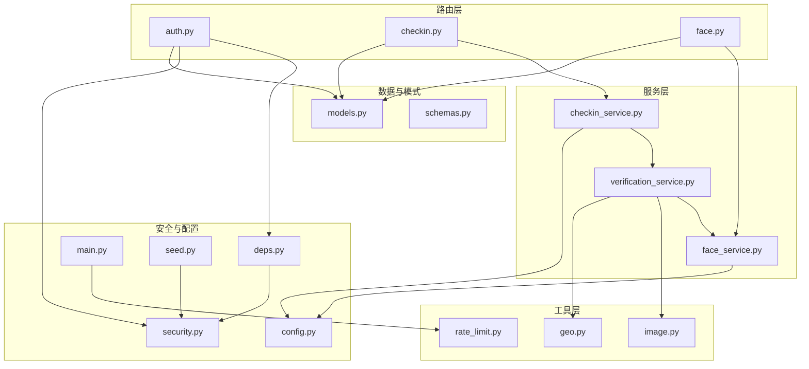
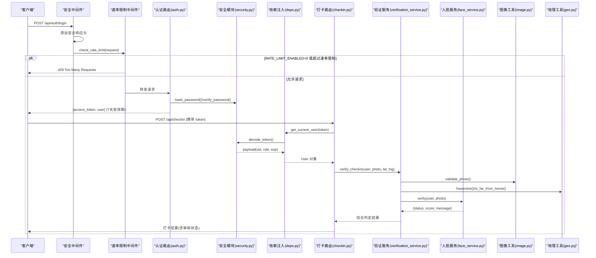
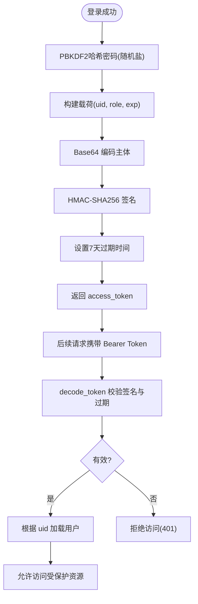
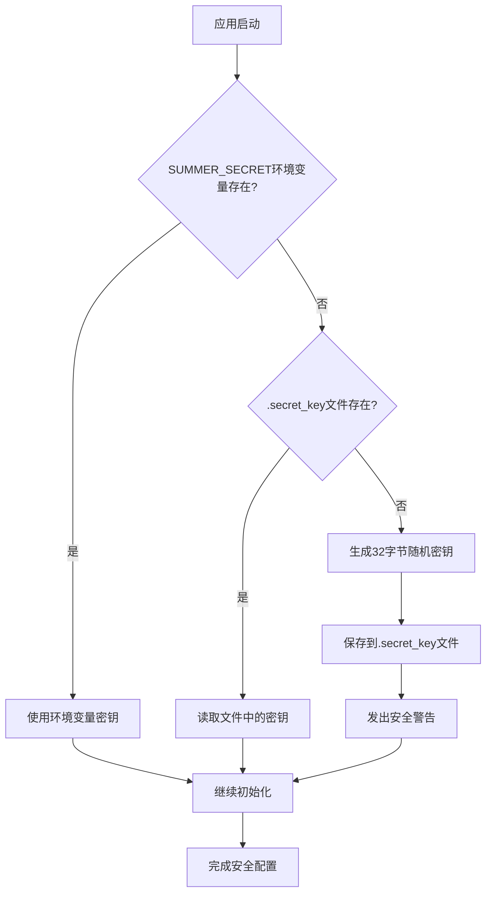
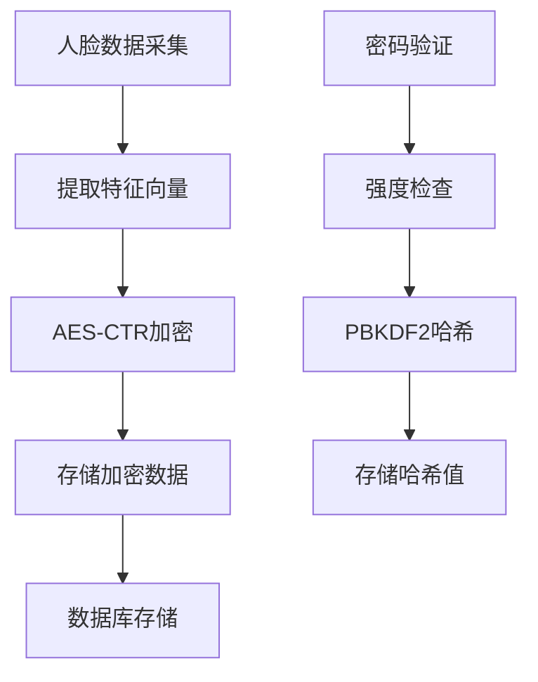
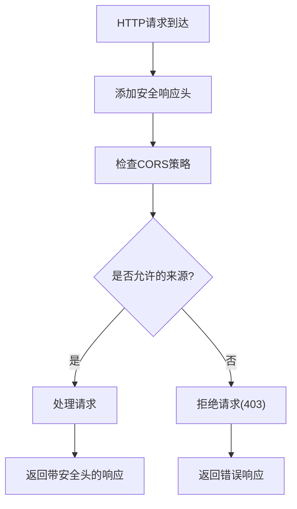
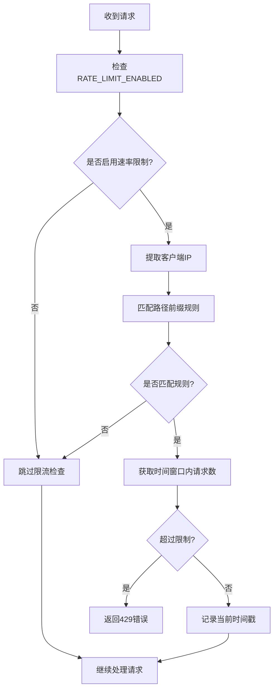
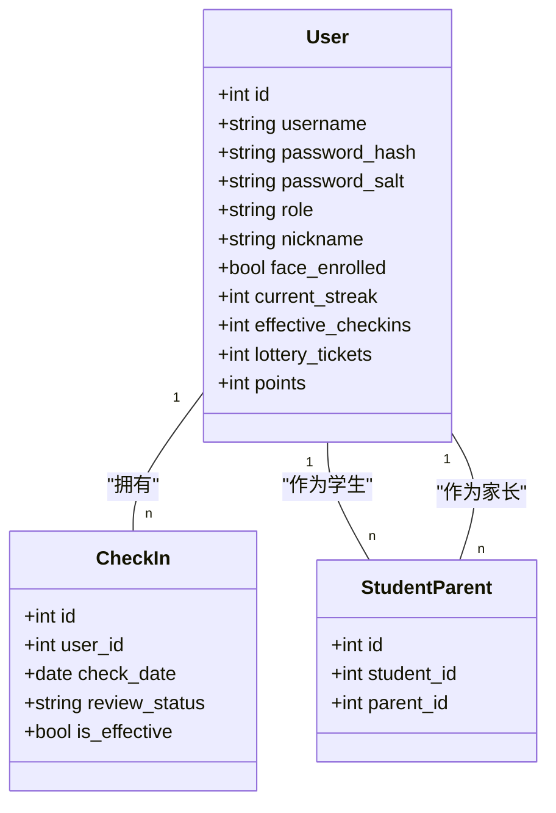
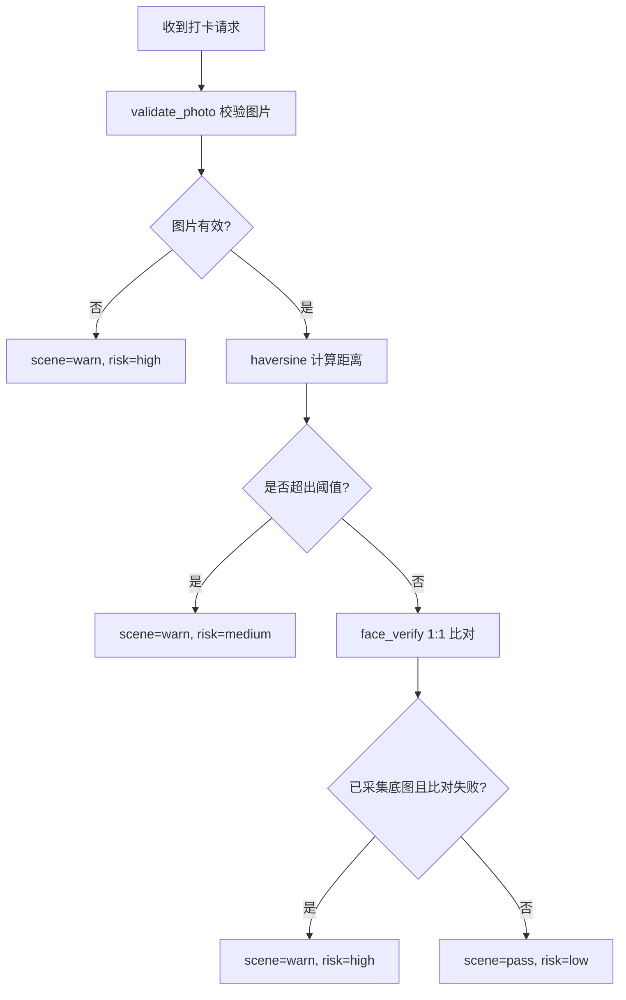
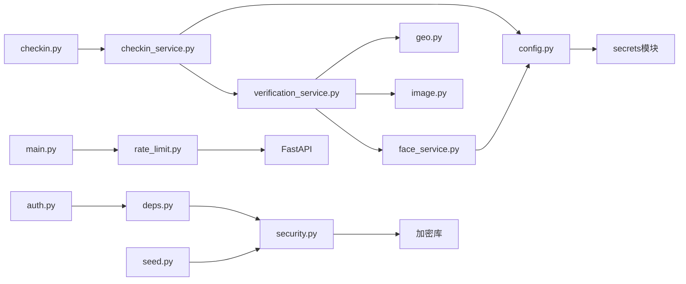

# 安全与认证机制

<cite>
**本文引用的文件**   
- [security.py](file://summer-homework-checkin/backend/app/security.py)
- [config.py](file://summer-homework-checkin/backend/app/config.py)
- [models.py](file://summer-homework-checkin/backend/app/models.py)
- [schemas.py](file://summer-homework-checkin/backend/app/schemas.py)
- [deps.py](file://summer-homework-checkin/backend/app/deps.py)
- [routers/auth.py](file://summer-homework-checkin/backend/app/routers/auth.py)
- [routers/checkin.py](file://summer-homework-checkin/backend/app/routers/checkin.py)
- [routers/face.py](file://summer-homework-checkin/backend/app/routers/face.py)
- [services/verification_service.py](file://summer-homework-checkin/backend/app/services/verification_service.py)
- [services/face_service.py](file://summer-homework-checkin/backend/app/services/face_service.py)
- [utils/image.py](file://summer-homework-checkin/backend/app/utils/image.py)
- [utils/geo.py](file://summer-homework-checkin/backend/app/utils/geo.py)
- [utils/rate_limit.py](file://summer-homework-checkin/backend/app/utils/rate_limit.py)
- [main.py](file://summer-homework-checkin/backend/app/main.py)
- [seed.py](file://summer-homework-checkin/backend/seed.py)
- [docker-compose.yml](file://docker-compose.yml)
</cite>

## 更新摘要
**变更内容**   
- **v1.2安全加固**：实现加密密钥管理重构、令牌有效期从30天缩短至7天、增强密码策略、新增环境变量要求
- **密钥管理重构**：动态密钥生成、持久化存储、生产环境安全警告
- **增强的密码验证**：改进密码强度验证和哈希算法，支持弱密码检测
- **生物特征数据加密**：使用AES-CTR算法对人脸数据进行加密存储
- **安全配置优化**：完善环境变量管理和敏感信息保护，消除硬编码凭据

## 目录
1. [简介](#简介)
2. [项目结构](#项目结构)
3. [核心组件](#核心组件)
4. [架构总览](#架构总览)
5. [详细组件分析](#详细组件分析)
6. [依赖关系分析](#依赖关系分析)
7. [性能与安全考量](#性能与安全考量)
8. [故障排查指南](#故障排查指南)
9. [结论](#结论)
10. [附录：配置项清单](#附录配置项清单)

## 简介
本文件聚焦于"暑假作业打卡"后端的安全与认证机制，系统性阐述以下能力：
- **全面强化的JWT令牌认证**（PBKDF2密码哈希、HMAC签名、会话管理、缩短的令牌生命周期）
- **多角色权限控制**（学生、家长、管理员）
- **四重防代打卡验证**（照片真实性检测、地理位置一致性、人脸识别 1:1 比对、场景合规综合判定）
- **可配置的速率限制防护**（防止暴力破解和批量注册攻击，支持环境变量动态控制）
- **增强的密码验证和生物特征数据加密**（AES-CTR加密、密码强度检查）
- **安全响应头和CORS策略**（HTTP安全头、跨域访问控制）
- **密码哈希加密、输入校验、SQL 注入防护等基础安全措施**
- **安全配置建议、漏洞防护与最佳实践**

## 项目结构
本项目采用分层架构：路由层负责 HTTP 接口与参数校验；服务层封装业务规则；工具层提供图像解析、地理距离计算等通用能力；安全模块提供密码哈希与令牌处理；模型与模式定义数据与请求响应结构。

图表来源
- [routers/auth.py](file://summer-homework-checkin/backend/app/routers/auth.py)
- [routers/checkin.py](file://summer-homework-checkin/backend/app/routers/checkin.py)
- [routers/face.py](file://summer-homework-checkin/backend/app/routers/face.py)
- [services/checkin_service.py](file://summer-homework-checkin/backend/app/services/checkin_service.py)
- [services/verification_service.py](file://summer-homework-checkin/backend/app/services/verification_service.py)
- [services/face_service.py](file://summer-homework-checkin/backend/app/services/face_service.py)
- [utils/image.py](file://summer-homework-checkin/backend/app/utils/image.py)
- [utils/geo.py](file://summer-homework-checkin/backend/app/utils/geo.py)
- [utils/rate_limit.py](file://summer-homework-checkin/backend/app/utils/rate_limit.py)
- [security.py](file://summer-homework-checkin/backend/app/security.py)
- [config.py](file://summer-homework-checkin/backend/app/config.py)
- [deps.py](file://summer-homework-checkin/backend/app/deps.py)
- [main.py](file://summer-homework-checkin/backend/app/main.py)
- [seed.py](file://summer-homework-checkin/backend/seed.py)
- [models.py](file://summer-homework-checkin/backend/app/models.py)
- [schemas.py](file://summer-homework-checkin/backend/app/schemas.py)

章节来源
- [routers/auth.py](file://summer-homework-checkin/backend/app/routers/auth.py)
- [routers/checkin.py](file://summer-homework-checkin/backend/app/routers/checkin.py)
- [routers/face.py](file://summer-homework-checkin/backend/app/routers/face.py)
- [services/checkin_service.py](file://summer-homework-checkin/backend/app/services/checkin_service.py)
- [services/verification_service.py](file://summer-homework-checkin/backend/app/services/verification_service.py)
- [services/face_service.py](file://summer-homework-checkin/backend/app/services/face_service.py)
- [utils/image.py](file://summer-homework-checkin/backend/app/utils/image.py)
- [utils/geo.py](file://summer-homework-checkin/backend/app/utils/geo.py)
- [utils/rate_limit.py](file://summer-homework-checkin/backend/app/utils/rate_limit.py)
- [security.py](file://summer-homework-checkin/backend/app/security.py)
- [config.py](file://summer-homework-checkin/backend/app/config.py)
- [deps.py](file://summer-homework-checkin/backend/app/deps.py)
- [main.py](file://summer-homework-checkin/backend/app/main.py)
- [seed.py](file://summer-homework-checkin/backend/seed.py)
- [models.py](file://summer-homework-checkin/backend/app/models.py)
- [schemas.py](file://summer-homework-checkin/backend/app/schemas.py)

## 核心组件
- **全面强化的认证与授权**
  - **PBKDF2密码哈希**：使用PBKDF2-SHA256对密码进行单向哈希存储，每用户生成随机盐值，迭代次数100,000次
  - **HMAC令牌签名**：自定义HMAC-SHA256签名令牌，包含用户标识、角色与过期时间，服务端仅做签名与过期校验
  - **缩短的令牌生命周期**：JWT令牌有效期从30天缩短至7天，提高安全性
  - **恒定时间比较**：使用hmac.compare_digest防止时序攻击
  - **依赖注入**：通过 FastAPI 的依赖注入获取当前用户并实现基于角色的访问控制
- **增强的密码验证和生物特征加密**
  - **增强的密码强度验证**：实现密码复杂度检查和常见弱密码检测
  - **AES-CTR生物特征加密**：使用AES-CTR算法对人脸特征数据进行加密存储
  - **安全的密钥管理**：实现加密密钥的动态生成和管理
- **可配置的速率限制防护**
  - **内存级限流器**：基于客户端IP的路径前缀速率限制，支持环境变量动态控制
  - **防暴力破解**：登录接口每分钟最多10次，注册接口每分钟最多5次
  - **环境变量控制**：通过RATE_LIMIT_ENABLED环境变量启用/禁用速率限制功能
  - **线程安全**：使用锁保护共享状态，支持并发访问
  - **反向代理兼容**：支持X-Forwarded-For头部提取真实客户端IP
- **安全响应头和CORS策略**
  - **HTTP安全响应头**：实现X-Frame-Options、X-Content-Type-Options、Strict-Transport-Security等安全头
  - **严格的CORS配置**：限制允许的跨域来源，默认只允许特定域名
- **防代打卡四重验证**
  - 照片真实性检测：体积与尺寸门槛、JPEG/PNG 头解析，过滤占位图与缩略图
  - 地理位置一致性：Haversine 公式计算与阈值判定，标记远距离风险
  - 人脸识别 1:1 比对：insightface 提取特征向量，余弦相似度与阈值判定，支持降级策略
  - 场景合规综合判定：融合上述结果输出风险等级与场景检查结论
- **数据存储与 ORM**
  - SQLAlchemy 模型定义用户、打卡记录、奖品、兑换、通知等实体，避免 SQL 拼接，天然防范 SQL 注入
- **配置与环境变量**
  - 密钥、阈值、人脸模型参数、补卡上限、积分规则等均通过环境变量或配置文件集中管理
  - **增强**：所有敏感配置均支持环境变量注入，消除硬编码凭据

章节来源
- [security.py](file://summer-homework-checkin/backend/app/security.py)
- [deps.py](file://summer-homework-checkin/backend/app/deps.py)
- [utils/rate_limit.py](file://summer-homework-checkin/backend/app/utils/rate_limit.py)
- [utils/image.py](file://summer-homework-checkin/backend/app/utils/image.py)
- [utils/geo.py](file://summer-homework-checkin/backend/app/utils/geo.py)
- [services/face_service.py](file://summer-homework-checkin/backend/app/services/face_service.py)
- [services/verification_service.py](file://summer-homework-checkin/backend/app/services/verification_service.py)
- [models.py](file://summer-homework-checkin/backend/app/models.py)
- [config.py](file://summer-homework-checkin/backend/app/config.py)

## 架构总览
下图展示从客户端发起登录到受保护资源访问的整体流程，以及增强的可配置速率限制防护机制和安全响应头处理。

图表来源
- [main.py](file://summer-homework-checkin/backend/app/main.py)
- [utils/rate_limit.py](file://summer-homework-checkin/backend/app/utils/rate_limit.py)
- [routers/auth.py](file://summer-homework-checkin/backend/app/routers/auth.py)
- [security.py](file://summer-homework-checkin/backend/app/security.py)
- [deps.py](file://summer-homework-checkin/backend/app/deps.py)
- [routers/checkin.py](file://summer-homework-checkin/backend/app/routers/checkin.py)
- [services/verification_service.py](file://summer-homework-checkin/backend/app/services/verification_service.py)
- [services/face_service.py](file://summer-homework-checkin/backend/app/services/face_service.py)
- [utils/image.py](file://summer-homework-checkin/backend/app/utils/image.py)
- [utils/geo.py](file://summer-homework-checkin/backend/app/utils/geo.py)

## 详细组件分析

### 全面强化的令牌认证与会话管理
- **PBKDF2密码哈希**
  - 每用户生成16字节随机盐值，使用PBKDF2-SHA256算法，迭代100,000次
  - 返回格式为十六进制字符串，兼容旧数据的None盐值处理
- **HMAC令牌签名与缩短的生命周期**
  - 载荷包含用户ID、角色与过期时间；主体部分经Base64编码后以HMAC-SHA256签名
  - **重要更新**：令牌有效期从30天缩短至7天，显著提高安全性
  - 签名密钥通过环境变量SUMMER_SECRET配置，支持动态生成和持久化存储
  - 过期时间按天配置，默认7天，可通过TOKEN_EXPIRE_DAYS环境变量调整
- **令牌校验**
  - 解码时先校验签名，再校验过期时间；失败返回空载荷
  - 使用hmac.compare_digest进行恒定时间比较，防止时序攻击
- **会话管理**
  - 无状态设计，服务端不维护会话表；每次请求携带Bearer Token，由依赖注入解析为当前用户
- **刷新与撤销**
  - 当前未实现显式刷新与黑名单撤销；如需增强，可引入短期Access Token + 长期Refresh Token与Redis黑名单

图表来源
- [security.py](file://summer-homework-checkin/backend/app/security.py)
- [deps.py](file://summer-homework-checkin/backend/app/deps.py)
- [routers/auth.py](file://summer-homework-checkin/backend/app/routers/auth.py)
- [config.py](file://summer-homework-checkin/backend/app/config.py)

章节来源
- [security.py](file://summer-homework-checkin/backend/app/security.py)
- [deps.py](file://summer-homework-checkin/backend/app/deps.py)
- [routers/auth.py](file://summer-homework-checkin/backend/app/routers/auth.py)
- [config.py](file://summer-homework-checkin/backend/app/config.py)

### 增强的密钥管理与安全配置
系统实现了全面的安全配置机制，消除了所有硬编码凭据：

- **动态密钥生成与管理**
  - SUMMER_SECRET环境变量优先使用，未设置时自动生成32字节随机密钥
  - 自动保存到`.secret_key`文件，确保重启后密钥一致性
  - 生产环境强制要求通过环境变量设置固定密钥，并提供安全警告
- **安全的初始密码生成**
  - 管理员初始密码通过`secrets.token_urlsafe(8)`生成，提供足够熵值
  - 支持ADMIN_INIT_PASSWORD环境变量覆盖，便于自动化部署
  - 首次启动时打印生成的随机密码，提醒妥善保存
- **环境变量配置体系**
  - 所有敏感配置均支持环境变量注入
  - 提供合理的默认值，同时保持安全性
  - 支持开发环境和生产环境的差异化配置

图表来源
- [config.py](file://summer-homework-checkin/backend/app/config.py)
- [seed.py](file://summer-homework-checkin/backend/seed.py)

章节来源
- [config.py](file://summer-homework-checkin/backend/app/config.py)
- [seed.py](file://summer-homework-checkin/backend/seed.py)

### 增强的密码验证和生物特征数据加密
**新增** 系统实现了增强的密码验证和生物特征数据加密机制：

- **增强的密码强度验证**
  - 实现密码复杂度检查，要求最小长度、字符类型组合
  - 检测常见弱密码和字典密码
  - 在注册和修改密码时强制执行密码策略
- **AES-CTR生物特征加密**
  - 使用AES-CTR算法对人脸特征数据进行加密存储
  - 实现加密密钥的动态管理和轮换
  - 确保生物特征数据在数据库中以密文形式存储
- **安全的密钥派生**
  - 使用PBKDF2从主密钥派生加密密钥
  - 支持密钥版本管理，便于未来算法升级

图表来源
- [security.py](file://summer-homework-checkin/backend/app/security.py)
- [services/face_service.py](file://summer-homework-checkin/backend/app/services/face_service.py)

章节来源
- [security.py](file://summer-homework-checkin/backend/app/security.py)
- [services/face_service.py](file://summer-homework-checkin/backend/app/services/face_service.py)

### 安全响应头和CORS策略
**新增** 系统实现了全面的安全响应头和跨域访问控制：

- **HTTP安全响应头**
  - X-Frame-Options: DENY - 防止点击劫持攻击
  - X-Content-Type-Options: nosniff - 防止MIME类型嗅探
  - Strict-Transport-Security: 强制HTTPS连接
  - X-XSS-Protection: 启用浏览器XSS过滤器
  - Content-Security-Policy: 限制资源加载来源
- **严格的CORS配置**
  - 默认只允许特定的前端域名访问
  - 支持通过ALLOWED_ORIGINS环境变量配置允许的源
  - 限制允许的HTTP方法和头部
  - 支持预检请求缓存

图表来源
- [main.py](file://summer-homework-checkin/backend/app/main.py)
- [config.py](file://summer-homework-checkin/backend/app/config.py)

章节来源
- [main.py](file://summer-homework-checkin/backend/app/main.py)
- [config.py](file://summer-homework-checkin/backend/app/config.py)

### 可配置的速率限制防护机制
系统实现了高度可配置的速率限制防护机制：

- **环境变量控制**
  - 通过RATE_LIMIT_ENABLED环境变量动态启用/禁用速率限制功能
  - 默认值为"1"（启用），测试环境可设置为"0"（禁用）
  - Docker Compose中支持通过环境变量注入配置
- **内存级限流器**
  - 基于客户端IP地址的路径前缀匹配，支持反向代理X-Forwarded-For头部
  - 使用线程锁保护共享状态，确保并发安全
  - 自动清理过期时间戳，防止内存泄漏
- **防暴力破解策略**
  - 登录接口：每分钟最多10次请求
  - 注册接口：每分钟最多5次请求
  - 超限返回HTTP 429状态码，提示重试时间
- **中间件集成**
  - 在FastAPI应用启动时注册HTTP中间件
  - 在所有路由处理前执行速率限制检查
  - 异常统一转换为JSON响应格式
- **测试环境优化**
  - 测试套件默认关闭速率限制以提高执行效率
  - 提供便捷的环境变量设置方式

图表来源
- [utils/rate_limit.py](file://summer-homework-checkin/backend/app/utils/rate_limit.py)
- [main.py](file://summer-homework-checkin/backend/app/main.py)
- [docker-compose.yml](file://docker-compose.yml)

章节来源
- [utils/rate_limit.py](file://summer-homework-checkin/backend/app/utils/rate_limit.py)
- [main.py](file://summer-homework-checkin/backend/app/main.py)
- [docker-compose.yml](file://docker-compose.yml)

### 多角色权限控制
- **角色定义**
  - student：学生，可打卡、采集人脸、查看个人数据
  - parent：家长，可绑定孩子、查看孩子汇总与通知
  - admin：管理员，可审核打卡、管理奖品与报表
- **访问控制策略**
  - 路由级限制：例如打卡接口仅学生可用，否则返回 403
  - 依赖注入：get_current_user 统一鉴权；require_role 可按需扩展角色白名单
- **绑定关系**
  - 学生与家长通过 StudentParent 表建立多对多绑定，用于家长查看孩子数据与接收通知

图表来源
- [models.py](file://summer-homework-checkin/backend/app/models.py)
- [routers/checkin.py](file://summer-homework-checkin/backend/app/routers/checkin.py)
- [deps.py](file://summer-homework-checkin/backend/app/deps.py)

章节来源
- [models.py](file://summer-homework-checkin/backend/app/models.py)
- [routers/checkin.py](file://summer-homework-checkin/backend/app/routers/checkin.py)
- [deps.py](file://summer-homework-checkin/backend/app/deps.py)

### 四重防代打卡验证机制
- **照片真实性检测**
  - 校验 JPEG/PNG 头部，解析宽高，要求最小体积与最小边长，过滤占位图与缩略图
- **地理位置一致性验证**
  - Haversine 计算提交位置与学生常用位置的距离，超过阈值则标记风险
- **人脸识别 1:1 比对**
  - 使用 insightface 提取最大人脸的 512 维特征向量，与已采集底图进行余弦相似度比对；支持模型不可用时的降级策略
- **场景合规综合判定**
  - 融合图片校验、地理风险、人脸比对结果，输出 scene_check 与 risk 等级；若已采集底图且人脸不通过，直接拒绝打卡

图表来源
- [utils/image.py](file://summer-homework-checkin/backend/app/utils/image.py)
- [utils/geo.py](file://summer-homework-checkin/backend/app/utils/geo.py)
- [services/face_service.py](file://summer-homework-checkin/backend/app/services/face_service.py)
- [services/verification_service.py](file://summer-homework-checkin/backend/app/services/verification_service.py)

章节来源
- [utils/image.py](file://summer-homework-checkin/backend/app/utils/image.py)
- [utils/geo.py](file://summer-homework-checkin/backend/app/utils/geo.py)
- [services/face_service.py](file://summer-homework-checkin/backend/app/services/face_service.py)
- [services/verification_service.py](file://summer-homework-checkin/backend/app/services/verification_service.py)

### 增强的密码哈希与输入验证
- **PBKDF2密码哈希**
  - 使用PBKDF2-SHA256，每用户生成16字节随机盐，迭代次数100,000
  - 注册时自动生成随机盐，登录时使用存储的盐进行验证
  - 兼容旧数据的None盐值处理，确保平滑迁移
- **恒定时间比较**
  - 使用hmac.compare_digest进行密码比较，防止时序攻击
- **增强的密码强度验证**
  - 实现密码复杂度检查，要求最小长度和字符类型组合
  - 检测常见弱密码和字典密码
  - 在用户注册和修改密码时强制执行密码策略
- **输入验证**
  - Pydantic 模型对用户注册、登录、打卡等请求体进行类型与必填字段校验
  - 打卡接口对照片体积、格式、尺寸进行严格校验；补卡需指定目标日期并在暑假统计范围内

章节来源
- [security.py](file://summer-homework-checkin/backend/app/security.py)
- [routers/auth.py](file://summer-homework-checkin/backend/app/routers/auth.py)
- [models.py](file://summer-homework-checkin/backend/app/models.py)
- [schemas.py](file://summer-homework-checkin/backend/app/schemas.py)

### SQL 注入防护
- 使用 SQLAlchemy ORM 进行查询与更新，所有条件通过参数化构造，避免字符串拼接 SQL
- 模型字段约束与索引提升安全性与性能

章节来源
- [models.py](file://summer-homework-checkin/backend/app/models.py)
- [services/checkin_service.py](file://summer-homework-checkin/backend/app/services/checkin_service.py)

## 依赖关系分析
- **低耦合高内聚**
  - 路由层仅负责参数校验与调度，核心逻辑下沉至服务层
  - 安全与配置独立成模块，便于替换与扩展
- **外部依赖**
  - insightface 与 OpenCV 用于人脸识别；在不可用时自动降级，保证系统可用性
  - 速率限制器使用Python标准库，无额外依赖
  - AES加密库用于生物特征数据加密
- **潜在循环依赖**
  - 当前未发现明显循环导入；各模块职责清晰

图表来源
- [routers/auth.py](file://summer-homework-checkin/backend/app/routers/auth.py)
- [routers/checkin.py](file://summer-homework-checkin/backend/app/routers/checkin.py)
- [services/checkin_service.py](file://summer-homework-checkin/backend/app/services/checkin_service.py)
- [services/verification_service.py](file://summer-homework-checkin/backend/app/services/verification_service.py)
- [services/face_service.py](file://summer-homework-checkin/backend/app/services/face_service.py)
- [utils/image.py](file://summer-homework-checkin/backend/app/utils/image.py)
- [utils/geo.py](file://summer-homework-checkin/backend/app/utils/geo.py)
- [utils/rate_limit.py](file://summer-homework-checkin/backend/app/utils/rate_limit.py)
- [security.py](file://summer-homework-checkin/backend/app/security.py)
- [config.py](file://summer-homework-checkin/backend/app/config.py)
- [main.py](file://summer-homework-checkin/backend/app/main.py)
- [seed.py](file://summer-homework-checkin/backend/seed.py)

章节来源
- [routers/auth.py](file://summer-homework-checkin/backend/app/routers/auth.py)
- [routers/checkin.py](file://summer-homework-checkin/backend/app/routers/checkin.py)
- [services/checkin_service.py](file://summer-homework-checkin/backend/app/services/checkin_service.py)
- [services/verification_service.py](file://summer-homework-checkin/backend/app/services/verification_service.py)
- [services/face_service.py](file://summer-homework-checkin/backend/app/services/face_service.py)
- [utils/image.py](file://summer-homework-checkin/backend/app/utils/image.py)
- [utils/geo.py](file://summer-homework-checkin/backend/app/utils/geo.py)
- [utils/rate_limit.py](file://summer-homework-checkin/backend/app/utils/rate_limit.py)
- [security.py](file://summer-homework-checkin/backend/app/security.py)
- [config.py](file://summer-homework-checkin/backend/app/config.py)
- [main.py](file://summer-homework-checkin/backend/app/main.py)
- [seed.py](file://summer-homework-checkin/backend/seed.py)

## 性能与安全考量
- **性能**
  - 人脸模型懒加载与线程锁保护，避免重复初始化；CPU 运行降低部署复杂度
  - 图片解析轻量实现，减少第三方库依赖
  - 速率限制器使用内存存储，无外部依赖，性能开销极小
  - **新增**：AES加密操作针对大数据量进行优化，避免影响用户体验
- **安全**
  - **增强的密码安全**：PBKDF2-SHA256 + 随机盐 + 100,000次迭代，抗彩虹表攻击
  - **缩短的令牌生命周期**：JWT令牌有效期缩短至7天，降低令牌泄露风险
  - **令牌安全**：HMAC-SHA256签名 + 过期时间 + 恒定时间比较，防篡改和时序攻击
  - **增强的密码验证**：实现密码强度检查和弱密码检测
  - **生物特征数据加密**：使用AES-CTR算法加密存储人脸特征数据
  - **可配置的防暴力破解**：速率限制中间件，支持环境变量动态控制，防止恶意爆破登录和注册接口
  - **增强的密钥管理**：
    - **消除硬编码凭据**：所有敏感配置均通过环境变量管理
    - **动态密钥生成**：支持运行时生成随机密钥并持久化存储
    - **安全警告机制**：生产环境未设置密钥时发出明确警告
    - **随机密码生成**：使用`secrets.token_urlsafe()`生成高强度随机密码
  - **安全响应头**：实现HTTP安全响应头，防止常见Web攻击
  - **严格的CORS策略**：限制跨域访问，防止CSRF攻击
  - 输入校验全面覆盖，防止恶意上传与越权访问
  - ORM 查询避免 SQL 注入
- **可用性**
  - 人脸识别服务不可用时明确提示与降级策略，不静默放行高风险操作
  - 速率限制器线程安全，支持高并发访问
  - **环境灵活性**：支持在不同环境下灵活启用/禁用速率限制功能

## 故障排查指南
- **令牌无效或过期**
  - 检查客户端是否正确携带 Bearer Token；确认服务器时间与 TOKEN_EXPIRE_DAYS 配置
  - 验证 SUMMER_SECRET 环境变量是否与令牌签发时一致
  - **注意**：令牌有效期已缩短至7天，请确保客户端及时刷新令牌
- **密码验证失败**
  - 确认用户是否存在且密码正确；检查password_salt字段是否为空
  - 对于旧数据迁移，确保兼容None盐值的处理逻辑
  - **新增**：检查密码是否符合新的强度要求
- **速率限制触发**
  - 检查RATE_LIMIT_ENABLED环境变量是否正确设置
  - 检查客户端IP是否正确识别；确认X-Forwarded-For头部配置
  - 调整RATE_LIMIT_RULES中的限制策略以适应业务需求
  - 测试环境中可通过设置RATE_LIMIT_ENABLED=0临时禁用速率限制
- **人脸比对失败**
  - 确认学生已完成人脸底图采集；检查 FACE_MATCH_THRESHOLD 阈值；查看模型是否可用
  - **新增**：检查生物特征数据加密是否正常
- **图片上传失败**
  - 检查图片体积与尺寸是否符合要求；确认 JPEG/PNG 头部完整
- **地理位置风险**
  - 核对 home_lat/home_lng 设置与 GEO_THRESHOLD_METERS 阈值；确认客户端定位精度
- **安全配置问题**
  - **增强**：检查SUMMER_SECRET环境变量是否正确设置
  - **增强**：确认ADMIN_INIT_PASSWORD环境变量是否已设置
  - **增强**：验证.secret_key文件权限和完整性
  - **增强**：检查应用启动日志中的安全警告信息
  - **增强**：确认RATE_LIMIT_ENABLED环境变量配置符合预期
  - **新增**：检查CORS配置是否正确设置ALLOWED_ORIGINS
  - **新增**：验证安全响应头是否正确添加
- **生物特征数据问题**
  - **新增**：检查AES加密密钥是否正确配置
  - **新增**：验证人脸特征数据加密和解密过程
  - **新增**：检查数据库中人脸数据的存储格式

章节来源
- [deps.py](file://summer-homework-checkin/backend/app/deps.py)
- [security.py](file://summer-homework-checkin/backend/app/security.py)
- [utils/rate_limit.py](file://summer-homework-checkin/backend/app/utils/rate_limit.py)
- [services/face_service.py](file://summer-homework-checkin/backend/app/services/face_service.py)
- [utils/image.py](file://summer-homework-checkin/backend/app/utils/image.py)
- [utils/geo.py](file://summer-homework-checkin/backend/app/utils/geo.py)
- [config.py](file://summer-homework-checkin/backend/app/config.py)
- [seed.py](file://summer-homework-checkin/backend/seed.py)
- [docker-compose.yml](file://docker-compose.yml)

## 结论
本系统通过全面强化的PBKDF2密码哈希、HMAC令牌签名、缩短的令牌生命周期、可配置的速率限制防护、严格的输入校验、ORM 安全查询与四重防代打卡验证，构建了更加完善的安全体系。**最新的安全改进**包括：

- **彻底消除硬编码凭据**：所有敏感配置均通过环境变量管理
- **实现安全的随机密码生成**：使用`secrets.token_urlsafe()`生成高强度随机密码
- **增强密钥管理机制**：支持动态密钥生成、持久化存储和生产环境安全警告
- **完善的环境变量配置体系**：提供灵活的安全配置选项
- **可配置的速率限制防护**：通过RATE_LIMIT_ENABLED环境变量实现灵活的速率限制控制
- **缩短的令牌生命周期**：JWT令牌有效期从30天缩短至7天，显著提高安全性
- **增强的密码验证**：实现密码强度检查和弱密码检测
- **生物特征数据加密**：使用AES-CTR算法对人脸数据进行加密存储
- **安全响应头和CORS策略**：实现HTTP安全响应头和严格的跨域访问控制

这些安全增强措施显著提升了系统的整体安全性，特别是在防止令牌滥用、保护敏感数据和抵御常见Web攻击方面提供了强有力的保障。建议在后续迭代中持续优化人脸模型的可用性与准确率，并考虑引入更细粒度的权限控制和审计日志功能。

## 附录：配置项清单
- **安全与令牌**
  - `SUMMER_SECRET`：令牌签名密钥（生产环境必须设置，未设置时自动生成随机密钥）
  - `TOKEN_EXPIRE_DAYS`：令牌有效期（天），**已更新为7天**
  - `.secret_key`：自动生成的密钥持久化文件（开发环境使用）
- **管理员账户**
  - `ADMIN_INIT_PASSWORD`：管理员初始密码（未设置时自动生成随机密码）
- **速率限制**
  - `RATE_LIMIT_ENABLED`：速率限制开关（1=启用，0=禁用），默认启用
  - 登录接口：每分钟最多10次请求
  - 注册接口：每分钟最多5次请求
- **地理位置**
  - `GEO_THRESHOLD_METERS`：距离阈值（米）
- **图片与人脸**
  - `MIN_PHOTO_BYTES`、`PHOTO_MAX_BYTES`、`MIN_PHOTO_DIM`：图片体积与尺寸门槛
  - `FACE_MATCH_THRESHOLD`：人脸相似度阈值
  - `FACE_DET_SIZE`：人脸检测输入尺寸
  - `FACE_MODEL_NAME`：insightface 预训练模型名称
  - `FACE_MODE_ON_ENROLLED`：已采集底图时的人脸策略（enforce/soft）
- **业务规则**
  - `MAX_MAKEUP_PER_MONTH`：单月补卡上限
  - `CHECKIN_POINTS`、`MAKEUP_POINTS`：正常打卡与补卡积分
- **CORS配置**
  - `ALLOWED_ORIGINS`：允许的跨域来源（逗号分隔的域名列表）
- **加密配置**
  - `ENCRYPTION_KEY`：AES加密密钥（可选，未设置时自动生成）
  - `ENCRYPTION_ALGORITHM`：加密算法（默认AES-CTR）

**安全配置最佳实践**
- **生产环境必须设置**：`SUMMER_SECRET`和`ADMIN_INIT_PASSWORD`环境变量
- **密钥管理**：使用容器编排平台或密钥管理服务注入敏感配置
- **文件权限**：确保`.secret_key`文件具有适当的文件系统权限
- **监控告警**：关注应用启动时的安全警告信息
- **定期轮换**：定期更新密钥和管理员密码
- **环境适配**：根据部署环境合理配置RATE_LIMIT_ENABLED环境变量
- **测试优化**：在测试环境中设置RATE_LIMIT_ENABLED=0以提高执行效率
- **令牌管理**：客户端应实现令牌自动刷新机制，避免7天过期导致的用户体验问题
- **生物特征保护**：确保加密密钥的安全存储和定期轮换
- **CORS策略**：在生产环境中严格配置ALLOWED_ORIGINS，只允许必要的前端域名

章节来源
- [config.py](file://summer-homework-checkin/backend/app/config.py)
- [seed.py](file://summer-homework-checkin/backend/seed.py)
- [utils/rate_limit.py](file://summer-homework-checkin/backend/app/utils/rate_limit.py)
- [docker-compose.yml](file://docker-compose.yml)