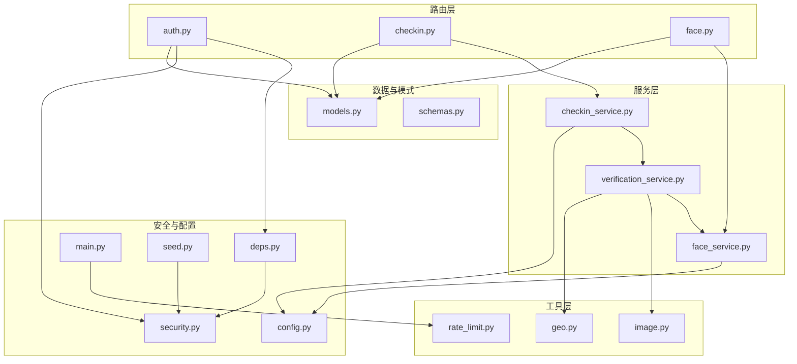
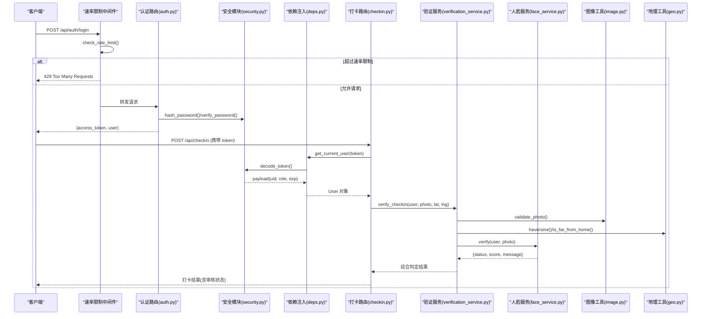
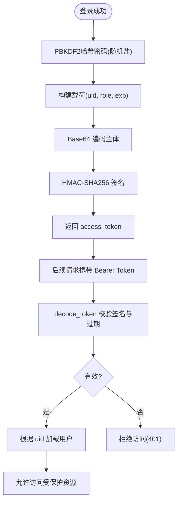
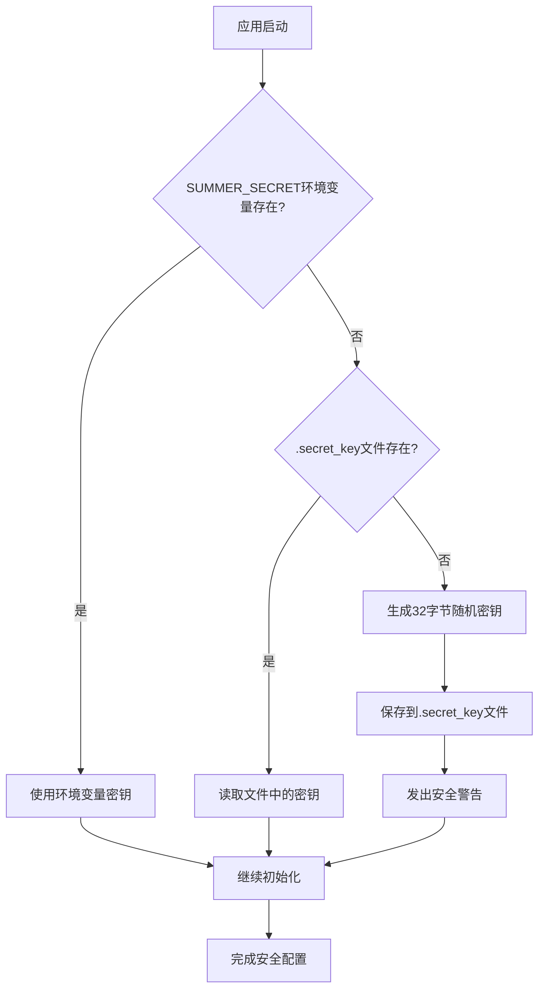
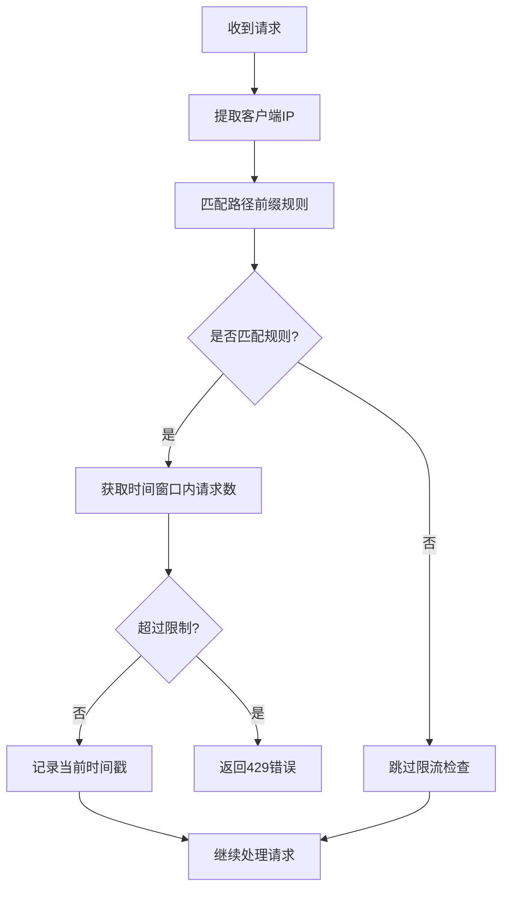
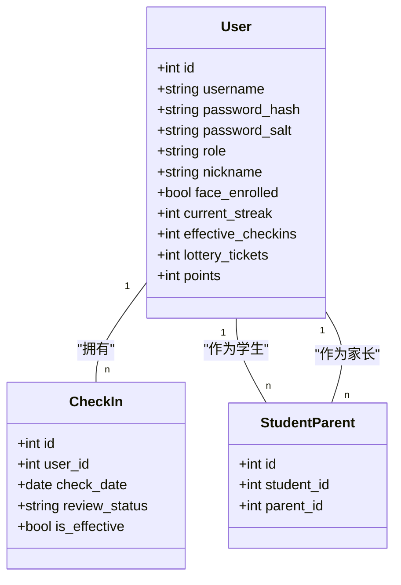
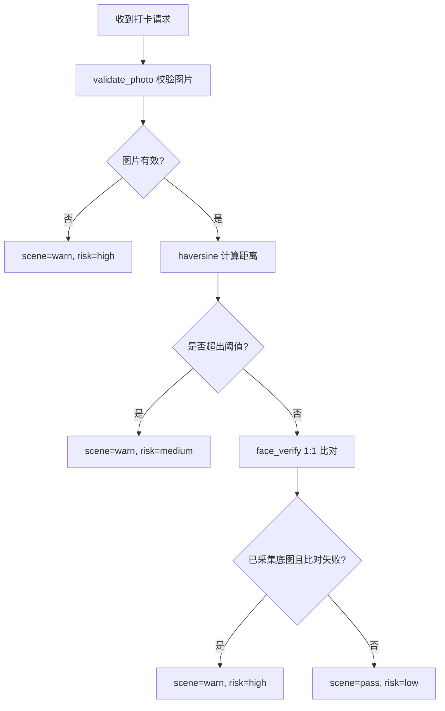
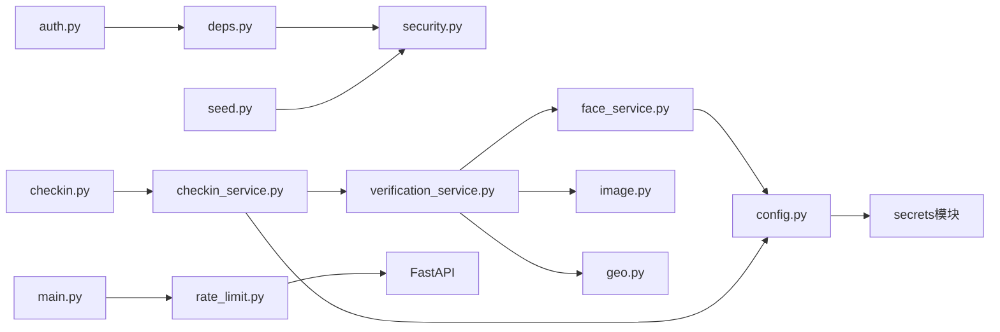

# 安全与认证机制

<cite>
**本文引用的文件**   
- [security.py](file://summer-homework-checkin/backend/app/security.py)
- [config.py](file://summer-homework-checkin/backend/app/config.py)
- [models.py](file://summer-homework-checkin/backend/app/models.py)
- [schemas.py](file://summer-homework-checkin/backend/app/schemas.py)
- [deps.py](file://summer-homework-checkin/backend/app/deps.py)
- [routers/auth.py](file://summer-homework-checkin/backend/app/routers/auth.py)
- [routers/checkin.py](file://summer-homework-checkin/backend/app/routers/checkin.py)
- [routers/face.py](file://summer-homework-checkin/backend/app/routers/face.py)
- [services/verification_service.py](file://summer-homework-checkin/backend/app/services/verification_service.py)
- [services/face_service.py](file://summer-homework-checkin/backend/app/services/face_service.py)
- [utils/image.py](file://summer-homework-checkin/backend/app/utils/image.py)
- [utils/geo.py](file://summer-homework-checkin/backend/app/utils/geo.py)
- [utils/rate_limit.py](file://summer-homework-checkin/backend/app/utils/rate_limit.py)
- [main.py](file://summer-homework-checkin/backend/app/main.py)
- [seed.py](file://summer-homework-checkin/backend/seed.py)
</cite>

## 更新摘要
**变更内容**   
- **消除硬编码凭据**：移除所有硬编码的敏感信息，包括默认密码和密钥
- **实现安全的随机密码生成**：使用 `secrets.token_urlsafe()` 生成管理员初始密码
- **引入环境变量配置**：所有敏感数据（ADMIN_INIT_PASSWORD、SUMMER_SECRET）均通过环境变量管理
- **增强密钥管理机制**：支持动态密钥生成和持久化存储，提供生产环境安全警告
- **完善安全配置指南**：提供详细的环境变量配置说明和安全最佳实践

## 目录
1. [简介](#简介)
2. [项目结构](#项目结构)
3. [核心组件](#核心组件)
4. [架构总览](#架构总览)
5. [详细组件分析](#详细组件分析)
6. [依赖关系分析](#依赖关系分析)
7. [性能与安全考量](#性能与安全考量)
8. [故障排查指南](#故障排查指南)
9. [结论](#结论)
10. [附录：配置项清单](#附录配置项清单)

## 简介
本文件聚焦于"暑假作业打卡"后端的安全与认证机制，系统性阐述以下能力：
- **增强的JWT令牌认证**（PBKDF2密码哈希、HMAC签名、会话管理）
- **多角色权限控制**（学生、家长、管理员）
- **四重防代打卡验证**（照片真实性检测、地理位置一致性、人脸识别 1:1 比对、场景合规综合判定）
- **速率限制防护**（防止暴力破解和批量注册攻击）
- **密码哈希加密、输入校验、SQL 注入防护等基础安全措施**
- **安全配置建议、漏洞防护与最佳实践**

## 项目结构
本项目采用分层架构：路由层负责 HTTP 接口与参数校验；服务层封装业务规则；工具层提供图像解析、地理距离计算等通用能力；安全模块提供密码哈希与令牌处理；模型与模式定义数据与请求响应结构。

图表来源
- [routers/auth.py:1-54](file://summer-homework-checkin/backend/app/routers/auth.py#L1-L54)
- [routers/checkin.py:1-80](file://summer-homework-checkin/backend/app/routers/checkin.py#L1-L80)
- [routers/face.py:1-45](file://summer-homework-checkin/backend/app/routers/face.py#L1-L45)
- [services/checkin_service.py:1-254](file://summer-homework-checkin/backend/app/services/checkin_service.py#L1-L254)
- [services/verification_service.py:1-71](file://summer-homework-checkin/backend/app/services/verification_service.py#L1-L71)
- [services/face_service.py:1-133](file://summer-homework-checkin/backend/app/services/face_service.py#L1-L133)
- [utils/image.py:1-61](file://summer-homework-checkin/backend/app/utils/image.py#L1-L61)
- [utils/geo.py:1-24](file://summer-homework-checkin/backend/app/utils/geo.py#L1-L24)
- [utils/rate_limit.py:1-48](file://summer-homework-checkin/backend/app/utils/rate_limit.py#L1-L48)
- [security.py:1-54](file://summer-homework-checkin/backend/app/security.py#L1-L54)
- [config.py:1-80](file://summer-homework-checkin/backend/app/config.py#L1-L80)
- [deps.py:1-34](file://summer-homework-checkin/backend/app/deps.py#L1-L34)
- [main.py:1-64](file://summer-homework-checkin/backend/app/main.py#L1-L64)
- [seed.py:1-131](file://summer-homework-checkin/backend/seed.py#L1-L131)
- [models.py:1-213](file://summer-homework-checkin/backend/app/models.py#L1-L213)
- [schemas.py:1-322](file://summer-homework-checkin/backend/app/schemas.py#L1-322)

章节来源
- [routers/auth.py:1-54](file://summer-homework-checkin/backend/app/routers/auth.py#L1-L54)
- [routers/checkin.py:1-80](file://summer-homework-checkin/backend/app/routers/checkin.py#L1-L80)
- [routers/face.py:1-45](file://summer-homework-checkin/backend/app/routers/face.py#L1-L45)
- [services/checkin_service.py:1-254](file://summer-homework-checkin/backend/app/services/checkin_service.py#L1-L254)
- [services/verification_service.py:1-71](file://summer-homework-checkin/backend/app/services/verification_service.py#L1-L71)
- [services/face_service.py:1-133](file://summer-homework-checkin/backend/app/services/face_service.py#L1-L133)
- [utils/image.py:1-61](file://summer-homework-checkin/backend/app/utils/image.py#L1-L61)
- [utils/geo.py:1-24](file://summer-homework-checkin/backend/app/utils/geo.py#L1-L24)
- [utils/rate_limit.py:1-48](file://summer-homework-checkin/backend/app/utils/rate_limit.py#L1-L48)
- [security.py:1-54](file://summer-homework-checkin/backend/app/security.py#L1-L54)
- [config.py:1-80](file://summer-homework-checkin/backend/app/config.py#L1-L80)
- [deps.py:1-34](file://summer-homework-checkin/backend/app/deps.py#L1-L34)
- [main.py:1-64](file://summer-homework-checkin/backend/app/main.py#L1-L64)
- [seed.py:1-131](file://summer-homework-checkin/backend/seed.py#L1-L131)
- [models.py:1-213](file://summer-homework-checkin/backend/app/models.py#L1-L213)
- [schemas.py:1-322](file://summer-homework-checkin/backend/app/schemas.py#L1-322)

## 核心组件
- **增强的认证与授权**
  - **PBKDF2密码哈希**：使用PBKDF2-SHA256对密码进行单向哈希存储，每用户生成随机盐值，迭代次数100,000次
  - **HMAC令牌签名**：自定义HMAC-SHA256签名令牌，包含用户标识、角色与过期时间，服务端仅做签名与过期校验
  - **恒定时间比较**：使用hmac.compare_digest防止时序攻击
  - **依赖注入**：通过 FastAPI 的依赖注入获取当前用户并实现基于角色的访问控制
- **速率限制防护**
  - **内存级限流器**：基于客户端IP的路径前缀速率限制
  - **防暴力破解**：登录接口每分钟最多10次，注册接口每分钟最多5次
  - **线程安全**：使用锁保护共享状态，支持并发访问
- **防代打卡四重验证**
  - 照片真实性检测：体积与尺寸门槛、JPEG/PNG 头解析，过滤占位图与缩略图
  - 地理位置一致性：Haversine 公式计算与阈值判定，标记远距离风险
  - 人脸识别 1:1 比对：insightface 提取特征向量，余弦相似度与阈值判定，支持降级策略
  - 场景合规综合判定：融合上述结果输出风险等级与场景检查结论
- **数据存储与 ORM**
  - SQLAlchemy 模型定义用户、打卡记录、奖品、兑换、通知等实体，避免 SQL 拼接，天然防范 SQL 注入
- **配置与环境变量**
  - 密钥、阈值、人脸模型参数、补卡上限、积分规则等均通过环境变量或配置文件集中管理
  - **新增**：所有敏感配置均支持环境变量注入，消除硬编码凭据

章节来源
- [security.py:11-24](file://summer-homework-checkin/backend/app/security.py#L11-L24)
- [security.py:27-53](file://summer-homework-checkin/backend/app/security.py#L27-L53)
- [deps.py:13-34](file://summer-homework-checkin/backend/app/deps.py#L13-L34)
- [utils/rate_limit.py:8-47](file://summer-homework-checkin/backend/app/utils/rate_limit.py#L8-L47)
- [utils/image.py:51-61](file://summer-homework-checkin/backend/app/utils/image.py#L51-L61)
- [utils/geo.py:6-24](file://summer-homework-checkin/backend/app/utils/geo.py#L6-L24)
- [services/face_service.py:99-125](file://summer-homework-checkin/backend/app/services/face_service.py#L99-L125)
- [services/verification_service.py:19-71](file://summer-homework-checkin/backend/app/services/verification_service.py#L19-L71)
- [models.py:11-96](file://summer-homework-checkin/backend/app/models.py#L11-L96)
- [config.py:24-80](file://summer-homework-checkin/backend/app/config.py#L24-L80)

## 架构总览
下图展示从客户端发起登录到受保护资源访问的整体流程，以及新增的速率限制防护机制。

图表来源
- [main.py:34-42](file://summer-homework-checkin/backend/app/main.py#L34-L42)
- [utils/rate_limit.py:27-47](file://summer-homework-checkin/backend/app/utils/rate_limit.py#L27-L47)
- [routers/auth.py:42-48](file://summer-homework-checkin/backend/app/routers/auth.py#L42-L48)
- [security.py:11-24](file://summer-homework-checkin/backend/app/security.py#L11-L24)
- [security.py:27-53](file://summer-homework-checkin/backend/app/security.py#L27-L53)
- [deps.py:13-25](file://summer-homework-checkin/backend/app/deps.py#L13-L25)
- [routers/checkin.py:17-37](file://summer-homework-checkin/backend/app/routers/checkin.py#L17-L37)
- [services/verification_service.py:19-71](file://summer-homework-checkin/backend/app/services/verification_service.py#L19-L71)
- [services/face_service.py:99-125](file://summer-homework-checkin/backend/app/services/face_service.py#L99-L125)
- [utils/image.py:51-61](file://summer-homework-checkin/backend/app/utils/image.py#L51-L61)
- [utils/geo.py:6-24](file://summer-homework-checkin/backend/app/utils/geo.py#L6-L24)

## 详细组件分析

### 增强的令牌认证与会话管理
- **PBKDF2密码哈希**
  - 每用户生成16字节随机盐值，使用PBKDF2-SHA256算法，迭代100,000次
  - 返回格式为十六进制字符串，兼容旧数据的None盐值处理
- **HMAC令牌签名**
  - 载荷包含用户ID、角色与过期时间；主体部分经Base64编码后以HMAC-SHA256签名
  - **更新**：签名密钥通过环境变量SUMMER_SECRET配置，支持动态生成和持久化存储
  - 过期时间按天配置，默认30天，可通过TOKEN_EXPIRE_DAYS环境变量调整
- **令牌校验**
  - 解码时先校验签名，再校验过期时间；失败返回空载荷
  - 使用hmac.compare_digest进行恒定时间比较，防止时序攻击
- **会话管理**
  - 无状态设计，服务端不维护会话表；每次请求携带Bearer Token，由依赖注入解析为当前用户
- **刷新与撤销**
  - 当前未实现显式刷新与黑名单撤销；如需增强，可引入短期Access Token + 长期Refresh Token与Redis黑名单

图表来源
- [security.py:11-19](file://summer-homework-checkin/backend/app/security.py#L11-L19)
- [security.py:27-37](file://summer-homework-checkin/backend/app/security.py#L27-L37)
- [security.py:40-53](file://summer-homework-checkin/backend/app/security.py#L40-L53)
- [deps.py:13-25](file://summer-homework-checkin/backend/app/deps.py#L13-L25)

章节来源
- [security.py:11-53](file://summer-homework-checkin/backend/app/security.py#L11-L53)
- [deps.py:13-25](file://summer-homework-checkin/backend/app/deps.py#L13-L25)
- [routers/auth.py:19-48](file://summer-homework-checkin/backend/app/routers/auth.py#L19-L48)
- [config.py:24-46](file://summer-homework-checkin/backend/app/config.py#L24-L46)

### 增强的密钥管理与安全配置
**新增** 系统实现了全面的安全配置机制，消除了所有硬编码凭据：

- **动态密钥生成与管理**
  - SUMMER_SECRET环境变量优先使用，未设置时自动生成32字节随机密钥
  - 自动保存到`.secret_key`文件，确保重启后密钥一致性
  - 生产环境强制要求通过环境变量设置固定密钥，并提供安全警告
- **安全的初始密码生成**
  - 管理员初始密码通过`secrets.token_urlsafe(8)`生成，提供足够熵值
  - 支持ADMIN_INIT_PASSWORD环境变量覆盖，便于自动化部署
  - 首次启动时打印生成的随机密码，提醒妥善保存
- **环境变量配置体系**
  - 所有敏感配置均支持环境变量注入
  - 提供合理的默认值，同时保持安全性
  - 支持开发环境和生产环境的差异化配置

图表来源
- [config.py:24-45](file://summer-homework-checkin/backend/app/config.py#L24-L45)
- [seed.py:62-77](file://summer-homework-checkin/backend/seed.py#L62-L77)

章节来源
- [config.py:24-46](file://summer-homework-checkin/backend/app/config.py#L24-L46)
- [seed.py:62-77](file://summer-homework-checkin/backend/seed.py#L62-L77)

### 速率限制防护机制
- **内存级限流器**
  - 基于客户端IP地址的路径前缀匹配，支持反向代理X-Forwarded-For头部
  - 使用线程锁保护共享状态，确保并发安全
  - 自动清理过期时间戳，防止内存泄漏
- **防暴力破解策略**
  - 登录接口：每分钟最多10次请求
  - 注册接口：每分钟最多5次请求
  - 超限返回HTTP 429状态码，提示重试时间
- **中间件集成**
  - 在FastAPI应用启动时注册HTTP中间件
  - 在所有路由处理前执行速率限制检查
  - 异常统一转换为JSON响应格式

图表来源
- [utils/rate_limit.py:19-47](file://summer-homework-checkin/backend/app/utils/rate_limit.py#L19-L47)
- [main.py:34-42](file://summer-homework-checkin/backend/app/main.py#L34-L42)

章节来源
- [utils/rate_limit.py:1-48](file://summer-homework-checkin/backend/app/utils/rate_limit.py#L1-48)
- [main.py:34-42](file://summer-homework-checkin/backend/app/main.py#L34-L42)

### 多角色权限控制
- **角色定义**
  - student：学生，可打卡、采集人脸、查看个人数据
  - parent：家长，可绑定孩子、查看孩子汇总与通知
  - admin：管理员，可审核打卡、管理奖品与报表
- **访问控制策略**
  - 路由级限制：例如打卡接口仅学生可用，否则返回 403
  - 依赖注入：get_current_user 统一鉴权；require_role 可按需扩展角色白名单
- **绑定关系**
  - 学生与家长通过 StudentParent 表建立多对多绑定，用于家长查看孩子数据与接收通知

图表来源
- [models.py:11-96](file://summer-homework-checkin/backend/app/models.py#L11-L96)
- [routers/checkin.py:29-30](file://summer-homework-checkin/backend/app/routers/checkin.py#L29-L30)
- [deps.py:28-33](file://summer-homework-checkin/backend/app/deps.py#L28-L33)

章节来源
- [models.py:11-96](file://summer-homework-checkin/backend/app/models.py#L11-L96)
- [routers/checkin.py:29-30](file://summer-homework-checkin/backend/app/routers/checkin.py#L29-L30)
- [deps.py:28-33](file://summer-homework-checkin/backend/app/deps.py#L28-L33)

### 四重防代打卡验证机制
- **照片真实性检测**
  - 校验 JPEG/PNG 头部，解析宽高，要求最小体积与最小边长，过滤占位图与缩略图
- **地理位置一致性验证**
  - Haversine 计算提交位置与学生常用位置的距离，超过阈值则标记风险
- **人脸识别 1:1 比对**
  - 使用 insightface 提取最大人脸的 512 维特征向量，与已采集底图进行余弦相似度比对；支持模型不可用时的降级策略
- **场景合规综合判定**
  - 融合图片校验、地理风险、人脸比对结果，输出 scene_check 与 risk 等级；若已采集底图且人脸不通过，直接拒绝打卡

图表来源
- [utils/image.py:51-61](file://summer-homework-checkin/backend/app/utils/image.py#L51-L61)
- [utils/geo.py:6-24](file://summer-homework-checkin/backend/app/utils/geo.py#L6-L24)
- [services/face_service.py:99-125](file://summer-homework-checkin/backend/app/services/face_service.py#L99-L125)
- [services/verification_service.py:19-71](file://summer-homework-checkin/backend/app/services/verification_service.py#L19-L71)

章节来源
- [utils/image.py:51-61](file://summer-homework-checkin/backend/app/utils/image.py#L51-L61)
- [utils/geo.py:6-24](file://summer-homework-checkin/backend/app/utils/geo.py#L6-L24)
- [services/face_service.py:99-125](file://summer-homework-checkin/backend/app/services/face_service.py#L99-L125)
- [services/verification_service.py:19-71](file://summer-homework-checkin/backend/app/services/verification_service.py#L19-L71)

### 增强的密码哈希与输入验证
- **PBKDF2密码哈希**
  - 使用PBKDF2-SHA256，每用户生成16字节随机盐，迭代次数100,000
  - 注册时自动生成随机盐，登录时使用存储的盐进行验证
  - 兼容旧数据的None盐值处理，确保平滑迁移
- **恒定时间比较**
  - 使用hmac.compare_digest进行密码比较，防止时序攻击
- **输入验证**
  - Pydantic 模型对用户注册、登录、打卡等请求体进行类型与必填字段校验
  - 打卡接口对照片体积、格式、尺寸进行严格校验；补卡需指定目标日期并在暑假统计范围内

章节来源
- [security.py:11-24](file://summer-homework-checkin/backend/app/security.py#L11-L24)
- [routers/auth.py:19-48](file://summer-homework-checkin/backend/app/routers/auth.py#L19-L48)
- [models.py:17-18](file://summer-homework-checkin/backend/app/models.py#L17-L18)
- [schemas.py:5-19](file://summer-homework-checkin/backend/app/schemas.py#L5-L19)

### SQL 注入防护
- 使用 SQLAlchemy ORM 进行查询与更新，所有条件通过参数化构造，避免字符串拼接 SQL
- 模型字段约束与索引提升安全性与性能

章节来源
- [models.py:11-96](file://summer-homework-checkin/backend/app/models.py#L11-L96)
- [services/checkin_service.py:85-100](file://summer-homework-checkin/backend/app/services/checkin_service.py#L85-L100)

## 依赖关系分析
- **低耦合高内聚**
  - 路由层仅负责参数校验与调度，核心逻辑下沉至服务层
  - 安全与配置独立成模块，便于替换与扩展
- **外部依赖**
  - insightface 与 OpenCV 用于人脸识别；在不可用时自动降级，保证系统可用性
  - 速率限制器使用Python标准库，无额外依赖
- **潜在循环依赖**
  - 当前未发现明显循环导入；各模块职责清晰

图表来源
- [routers/auth.py:1-54](file://summer-homework-checkin/backend/app/routers/auth.py#L1-L54)
- [routers/checkin.py:1-80](file://summer-homework-checkin/backend/app/routers/checkin.py#L1-L80)
- [services/checkin_service.py:1-254](file://summer-homework-checkin/backend/app/services/checkin_service.py#L1-L254)
- [services/verification_service.py:1-71](file://summer-homework-checkin/backend/app/services/verification_service.py#L1-L71)
- [services/face_service.py:1-133](file://summer-homework-checkin/backend/app/services/face_service.py#L1-L133)
- [utils/image.py:1-61](file://summer-homework-checkin/backend/app/utils/image.py#L1-L61)
- [utils/geo.py:1-24](file://summer-homework-checkin/backend/app/utils/geo.py#L1-L24)
- [utils/rate_limit.py:1-48](file://summer-homework-checkin/backend/app/utils/rate_limit.py#L1-L48)
- [security.py:1-54](file://summer-homework-checkin/backend/app/security.py#L1-L54)
- [config.py:1-80](file://summer-homework-checkin/backend/app/config.py#L1-L80)
- [main.py:1-64](file://summer-homework-checkin/backend/app/main.py#L1-L64)
- [seed.py:1-131](file://summer-homework-checkin/backend/seed.py#L1-L131)

章节来源
- [routers/auth.py:1-54](file://summer-homework-checkin/backend/app/routers/auth.py#L1-L54)
- [routers/checkin.py:1-80](file://summer-homework-checkin/backend/app/routers/checkin.py#L1-L80)
- [services/checkin_service.py:1-254](file://summer-homework-checkin/backend/app/services/checkin_service.py#L1-L254)
- [services/verification_service.py:1-71](file://summer-homework-checkin/backend/app/services/verification_service.py#L1-L71)
- [services/face_service.py:1-133](file://summer-homework-checkin/backend/app/services/face_service.py#L1-L133)
- [utils/image.py:1-61](file://summer-homework-checkin/backend/app/utils/image.py#L1-L61)
- [utils/geo.py:1-24](file://summer-homework-checkin/backend/app/utils/geo.py#L1-L24)
- [utils/rate_limit.py:1-48](file://summer-homework-checkin/backend/app/utils/rate_limit.py#L1-L48)
- [security.py:1-54](file://summer-homework-checkin/backend/app/security.py#L1-L54)
- [config.py:1-80](file://summer-homework-checkin/backend/app/config.py#L1-L80)
- [main.py:1-64](file://summer-homework-checkin/backend/app/main.py#L1-L64)
- [seed.py:1-131](file://summer-homework-checkin/backend/seed.py#L1-L131)

## 性能与安全考量
- **性能**
  - 人脸模型懒加载与线程锁保护，避免重复初始化；CPU 运行降低部署复杂度
  - 图片解析轻量实现，减少第三方库依赖
  - 速率限制器使用内存存储，无外部依赖，性能开销极小
- **安全**
  - **增强的密码安全**：PBKDF2-SHA256 + 随机盐 + 100,000次迭代，抗彩虹表攻击
  - **令牌安全**：HMAC-SHA256签名 + 过期时间 + 恒定时间比较，防篡改和时序攻击
  - **防暴力破解**：速率限制中间件，防止恶意爆破登录和注册接口
  - **增强的密钥管理**：
    - **消除硬编码凭据**：所有敏感配置均通过环境变量管理
    - **动态密钥生成**：支持运行时生成随机密钥并持久化存储
    - **安全警告机制**：生产环境未设置密钥时发出明确警告
    - **随机密码生成**：使用`secrets.token_urlsafe()`生成高强度随机密码
  - 输入校验全面覆盖，防止恶意上传与越权访问
  - ORM 查询避免 SQL 注入
- **可用性**
  - 人脸识别服务不可用时明确提示与降级策略，不静默放行高风险操作
  - 速率限制器线程安全，支持高并发访问

## 故障排查指南
- **令牌无效或过期**
  - 检查客户端是否正确携带 Bearer Token；确认服务器时间与 TOKEN_EXPIRE_DAYS 配置
  - 验证 SUMMER_SECRET 环境变量是否与令牌签发时一致
- **密码验证失败**
  - 确认用户是否存在且密码正确；检查password_salt字段是否为空
  - 对于旧数据迁移，确保兼容None盐值的处理逻辑
- **速率限制触发**
  - 检查客户端IP是否正确识别；确认X-Forwarded-For头部配置
  - 调整RATE_LIMIT_RULES中的限制策略以适应业务需求
- **人脸比对失败**
  - 确认学生已完成人脸底图采集；检查 FACE_MATCH_THRESHOLD 阈值；查看模型是否可用
- **图片上传失败**
  - 检查图片体积与尺寸是否符合要求；确认 JPEG/PNG 头部完整
- **地理位置风险**
  - 核对 home_lat/home_lng 设置与 GEO_THRESHOLD_METERS 阈值；确认客户端定位精度
- **安全配置问题**
  - **新增**：检查SUMMER_SECRET环境变量是否正确设置
  - **新增**：确认.admin_init_password环境变量是否已设置
  - **新增**：验证.secret_key文件权限和完整性
  - **新增**：检查应用启动日志中的安全警告信息

章节来源
- [deps.py:13-25](file://summer-homework-checkin/backend/app/deps.py#L13-L25)
- [security.py:11-24](file://summer-homework-checkin/backend/app/security.py#L11-L24)
- [utils/rate_limit.py:19-24](file://summer-homework-checkin/backend/app/utils/rate_limit.py#L19-L24)
- [services/face_service.py:128-133](file://summer-homework-checkin/backend/app/services/face_service.py#L128-L133)
- [utils/image.py:51-61](file://summer-homework-checkin/backend/app/utils/image.py#L51-L61)
- [utils/geo.py:19-24](file://summer-homework-checkin/backend/app/utils/geo.py#L19-L24)
- [config.py:24-45](file://summer-homework-checkin/backend/app/config.py#L24-L45)
- [seed.py:62-77](file://summer-homework-checkin/backend/seed.py#L62-L77)

## 结论
本系统通过增强的PBKDF2密码哈希、HMAC令牌签名、速率限制防护、严格的输入校验、ORM 安全查询与四重防代打卡验证，构建了更加完善的安全体系。**最新的重大安全改进**包括：

- **彻底消除硬编码凭据**：所有敏感配置均通过环境变量管理
- **实现安全的随机密码生成**：使用`secrets.token_urlsafe()`生成高强度随机密码
- **增强密钥管理机制**：支持动态密钥生成、持久化存储和生产环境安全警告
- **完善的环境变量配置体系**：提供灵活的安全配置选项

新引入的安全特性显著提升了系统的抗攻击能力和安全性，特别是在防止暴力破解、密码泄露和密钥管理方面提供了强有力的保障。建议在后续迭代中持续优化人脸模型的可用性与准确率，并考虑引入更细粒度的权限控制和审计日志功能。

## 附录：配置项清单
- **安全与令牌**
  - `SUMMER_SECRET`：令牌签名密钥（生产环境必须设置，未设置时自动生成随机密钥）
  - `TOKEN_EXPIRE_DAYS`：令牌有效期（天），默认30天
  - `.secret_key`：自动生成的密钥持久化文件（开发环境使用）
- **管理员账户**
  - `ADMIN_INIT_PASSWORD`：管理员初始密码（未设置时自动生成随机密码）
- **速率限制**
  - 登录接口：每分钟最多10次请求
  - 注册接口：每分钟最多5次请求
- **地理位置**
  - `GEO_THRESHOLD_METERS`：距离阈值（米）
- **图片与人脸**
  - `MIN_PHOTO_BYTES`、`PHOTO_MAX_BYTES`、`MIN_PHOTO_DIM`：图片体积与尺寸门槛
  - `FACE_MATCH_THRESHOLD`：人脸相似度阈值
  - `FACE_DET_SIZE`：人脸检测输入尺寸
  - `FACE_MODEL_NAME`：insightface 预训练模型名称
  - `FACE_MODE_ON_ENROLLED`：已采集底图时的人脸策略（enforce/soft）
- **业务规则**
  - `MAX_MAKEUP_PER_MONTH`：单月补卡上限
  - `CHECKIN_POINTS`、`MAKEUP_POINTS`：正常打卡与补卡积分
- **CORS配置**
  - `ALLOWED_ORIGINS`：允许的跨域来源

**安全配置最佳实践**
- **生产环境必须设置**：`SUMMER_SECRET`和`ADMIN_INIT_PASSWORD`环境变量
- **密钥管理**：使用容器编排平台或密钥管理服务注入敏感配置
- **文件权限**：确保`.secret_key`文件具有适当的文件系统权限
- **监控告警**：关注应用启动时的安全警告信息
- **定期轮换**：定期更新密钥和管理员密码

章节来源
- [config.py:24-80](file://summer-homework-checkin/backend/app/config.py#L24-L80)
- [seed.py:62-77](file://summer-homework-checkin/backend/seed.py#L62-L77)
- [utils/rate_limit.py:8-12](file://summer-homework-checkin/backend/app/utils/rate_limit.py#L8-L12)