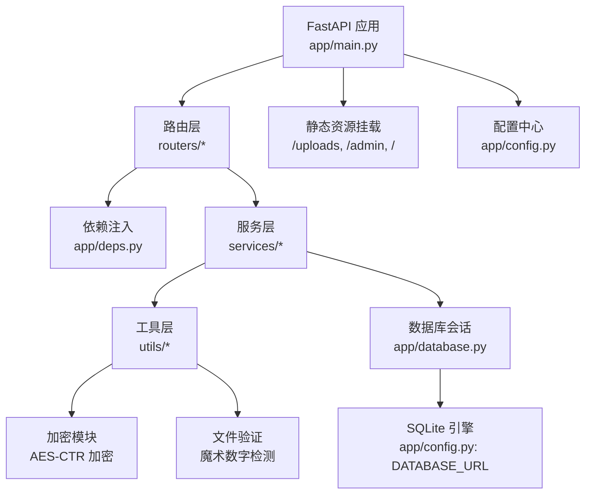
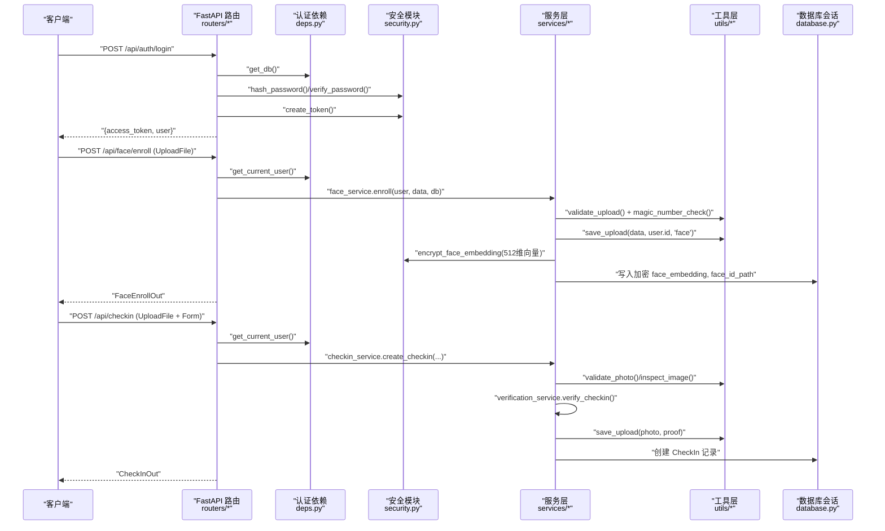
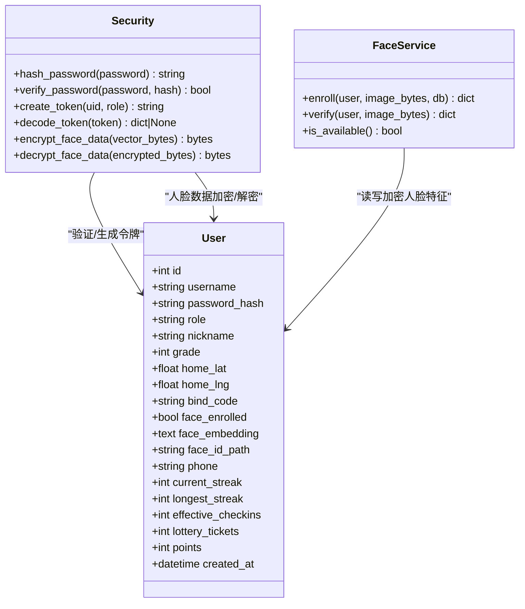
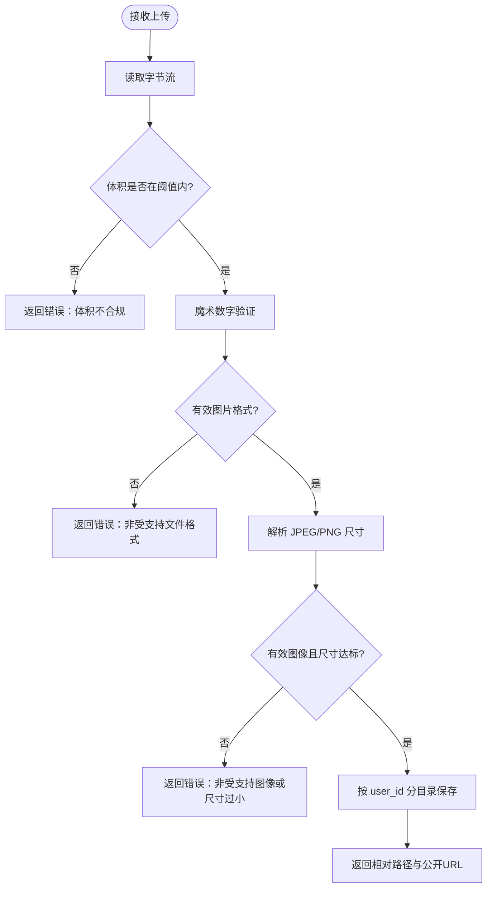
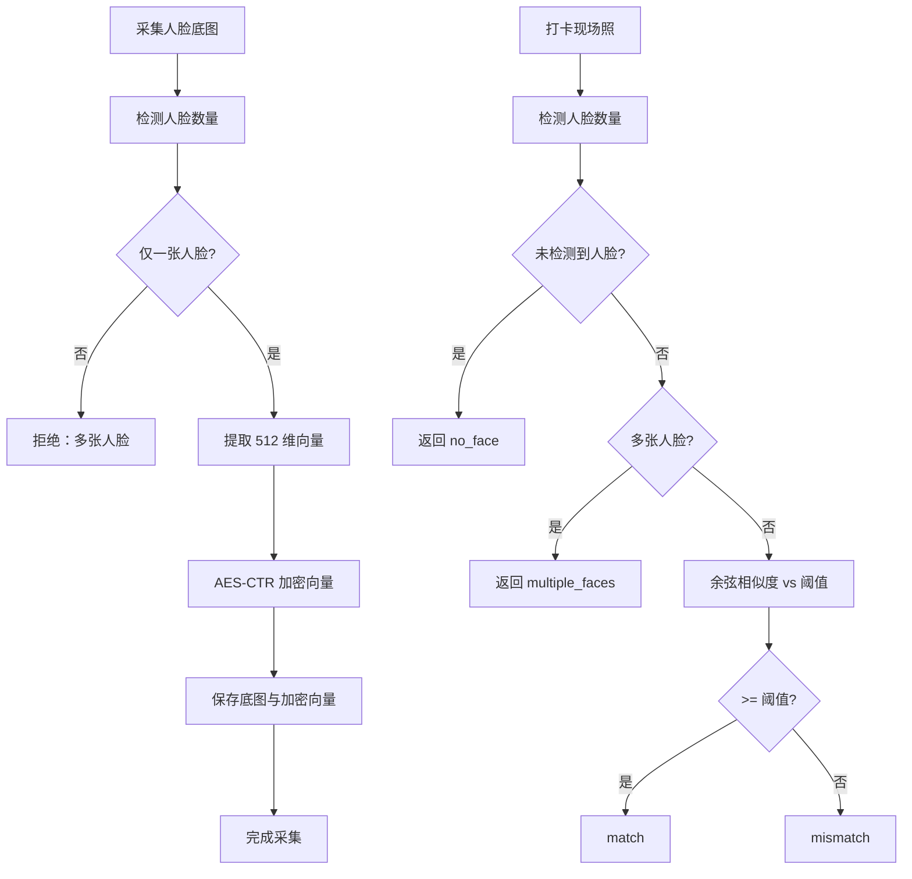
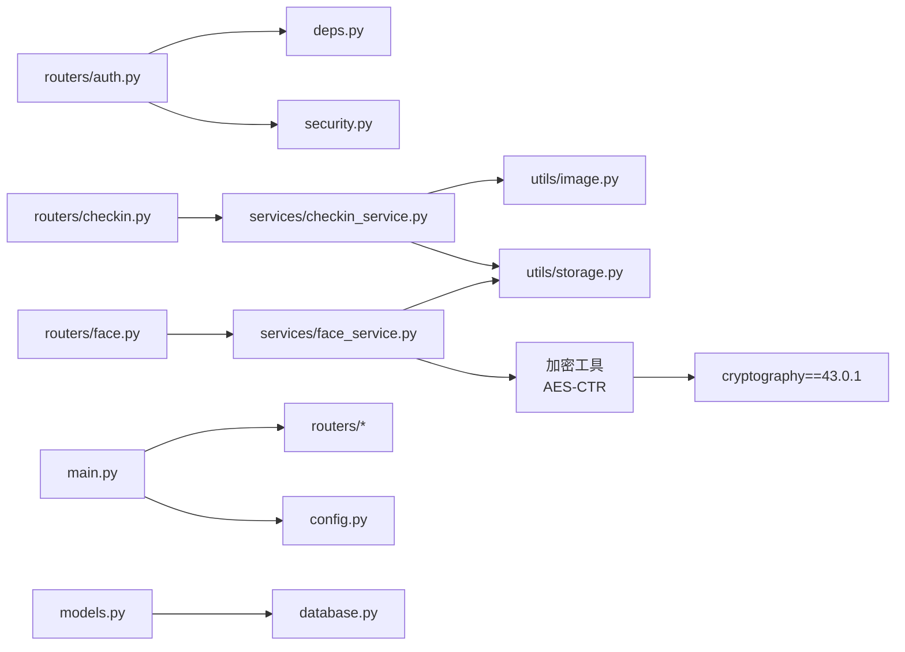

# 数据安全保护

<cite>
**本文引用的文件**   
- [main.py](file://summer-homework-checkin/backend/app/main.py)
- [config.py](file://summer-homework-checkin/backend/app/config.py)
- [security.py](file://summer-homework-checkin/backend/app/security.py)
- [database.py](file://summer-homework-checkin/backend/app/database.py)
- [models.py](file://summer-homework-checkin/backend/app/models.py)
- [schemas.py](file://summer-homework-checkin/backend/app/schemas.py)
- [deps.py](file://summer-homework-checkin/backend/app/deps.py)
- [routers/auth.py](file://summer-homework-checkin/backend/app/routers/auth.py)
- [routers/face.py](file://summer-homework-checkin/backend/app/routers/face.py)
- [routers/checkin.py](file://summer-homework-checkin/backend/app/routers/checkin.py)
- [services/face_service.py](file://summer-homework-checkin/backend/app/services/face_service.py)
- [services/checkin_service.py](file://summer-homework-checkin/backend/app/services/checkin_service.py)
- [utils/storage.py](file://summer-homework-checkin/backend/app/utils/storage.py)
- [utils/image.py](file://summer-homework-checkin/backend/app/utils/image.py)
- [utils/geo.py](file://summer-homework-checkin/backend/app/utils/geo.py)
</cite>

## 更新摘要
**变更内容**   
- 新增生物特征数据加密存储功能，使用 AES-CTR 加密算法保护人脸特征向量
- 增强文件上传安全机制，添加魔术数字验证和 SVG/HTML 伪装检测
- 更新依赖管理，引入 cryptography==43.0.1 用于高级加密操作
- 完善敏感数据保护策略，实现端到端的数据加密流程

## 目录
1. [引言](#引言)
2. [项目结构](#项目结构)
3. [核心组件](#核心组件)
4. [架构总览](#架构总览)
5. [详细组件分析](#详细组件分析)
6. [依赖关系分析](#依赖关系分析)
7. [性能与安全权衡](#性能与安全权衡)
8. [故障排查指南](#故障排查指南)
9. [结论](#结论)
10. [附录：安全配置与漏洞扫描建议](#附录安全配置与漏洞扫描建议)

## 引言
本文件面向"暑假作业打卡系统"的数据安全保护，围绕敏感数据加密存储、文件上传安全、数据库防护、备份恢复、访问审计与安全配置等主题，结合代码实现进行系统化说明。文档旨在帮助开发者与运维人员理解现有安全措施、识别风险点并给出可落地的加固建议。

**更新** 本次更新重点增强了生物特征数据的加密存储能力和文件上传的安全验证机制，确保用户隐私信息和人脸识别数据得到更高级别的保护。

## 项目结构
后端采用 FastAPI + SQLAlchemy（SQLite）的轻量架构，按路由、服务、工具分层组织；静态资源与上传文件通过静态挂载暴露。关键目录与职责如下：
- app/main.py：应用入口、中间件、路由注册、静态资源挂载
- app/config.py：全局配置（密钥、阈值、路径等）
- app/security.py：密码哈希、令牌签发与校验、数据加密解密
- app/database.py：数据库引擎与会话管理
- app/models.py：ORM 模型定义（用户、打卡、人脸等）
- app/schemas.py：请求/响应 Pydantic 模型
- app/deps.py：认证依赖与角色检查
- routers/*：业务路由（认证、人脸、打卡等）
- services/*：业务逻辑（打卡流程、人脸识别、通知等）
- utils/*：通用工具（存储、图像解析、地理距离计算、加密工具）

图示来源
- [main.py:1-49](file://summer-homework-checkin/backend/app/main.py#L1-L49)
- [config.py:1-50](file://summer-homework-checkin/backend/app/config.py#L1-L50)
- [database.py:1-22](file://summer-homework-checkin/backend/app/database.py#L1-L22)

章节来源
- [main.py:1-49](file://summer-homework-checkin/backend/app/main.py#L1-L49)
- [config.py:1-50](file://summer-homework-checkin/backend/app/config.py#L1-L50)

## 核心组件
- 认证与鉴权
  - 密码哈希：使用 PBKDF2-SHA256 单向哈希，固定盐（演示用），迭代次数 100,000。
  - 无状态令牌：HMAC-SHA256 签名，载荷包含用户ID、角色与过期时间；解码时校验签名与过期。
  - 依赖注入：HTTPBearer 自动提取 Authorization 头，校验令牌后返回当前用户对象。
- 数据存储
  - ORM 模型：User 包含密码哈希、人脸特征（JSON 向量）、人脸底图路径、家长手机号、学生常用位置等敏感字段。
  - 数据库：SQLite，连接参数允许跨线程访问；会话工厂关闭自动提交与刷新。
- 文件上传
  - 图片校验：基于 JPEG/PNG 头部与标记段解析尺寸，限制体积与最小边长，过滤占位图/缩略图。
  - 恶意文件检测：新增魔术数字验证，防止 SVG/HTML 伪装攻击。
  - 存储策略：按 user_id 分目录隔离，随机文件名，相对路径持久化，公开 URL 由静态挂载提供。
- 地理位置
  - Haversine 公式计算两点距离，超过阈值标记代打卡风险。
- 人脸识别
  - 懒加载 insightface 模型，CPU 推理；1:1 比对余弦相似度，支持降级提示。
  - **已采集底图后，根据策略拒绝或仅标记高风险。**
  - **人脸特征向量现在使用 AES-CTR 加密存储，确保生物特征数据安全。**

章节来源
- [security.py:1-47](file://summer-homework-checkin/backend/app/security.py#L1-L47)
- [deps.py:1-34](file://summer-homework-checkin/backend/app/deps.py#L1-L34)
- [models.py:1-212](file://summer-homework-checkin/backend/app/models.py#L1-L212)
- [database.py:1-22](file://summer-homework-checkin/backend/app/database.py#L1-L22)
- [utils/image.py:1-61](file://summer-homework-checkin/backend/app/utils/image.py#L1-L61)
- [utils/storage.py:1-24](file://summer-homework-checkin/backend/app/utils/storage.py#L1-L24)
- [utils/geo.py:1-24](file://summer-homework-checkin/backend/app/utils/geo.py#L1-L24)
- [services/face_service.py:1-133](file://summer-homework-checkin/backend/app/services/face_service.py#L1-L133)

## 架构总览
下图展示从客户端到数据库的关键调用链，涵盖认证、人脸采集、打卡流程与文件存储。

图示来源
- [routers/auth.py:1-52](file://summer-homework-checkin/backend/app/routers/auth.py#L1-L52)
- [routers/face.py:1-45](file://summer-homework-checkin/backend/app/routers/face.py#L1-L45)
- [routers/checkin.py:1-80](file://summer-homework-checkin/backend/app/routers/checkin.py#L1-L80)
- [deps.py:1-34](file://summer-homework-checkin/backend/app/deps.py#L1-L34)
- [security.py:1-47](file://summer-homework-checkin/backend/app/security.py#L1-L47)
- [services/face_service.py:1-133](file://summer-homework-checkin/backend/app/services/face_service.py#L1-L133)
- [services/checkin_service.py:1-254](file://summer-homework-checkin/backend/app/services/checkin_service.py#L1-L254)
- [utils/storage.py:1-24](file://summer-homework-checkin/backend/app/utils/storage.py#L1-L24)
- [utils/image.py:1-61](file://summer-homework-checkin/backend/app/utils/image.py#L1-L61)

## 详细组件分析

### 敏感数据加密与脱敏
- 密码存储
  - 使用 PBKDF2-SHA256 单向哈希，固定盐（演示环境）。生产环境应改为每用户独立随机盐，并考虑 Argon2id 或 bcrypt。
  - 参考路径：[password_hash 字段:17-17](file://summer-homework-checkin/backend/app/models.py#L17-L17)、[hash_password/verify_password:10-17](file://summer-homework-checkin/backend/app/security.py#L10-L17)
- 令牌安全
  - HMAC-SHA256 签名，载荷含 uid、role、exp；解码时严格比较签名与过期时间。
  - 参考路径：[create_token/decode_token:20-46](file://summer-homework-checkin/backend/app/security.py#L20-L46)
- **人脸特征数据加密存储**
  - **新增 AES-CTR 加密：人脸特征向量（512维）现在使用 AES-CTR 模式加密存储，确保生物特征数据在数据库中保持机密性。**
  - **加密过程：使用 cryptography==43.0.1 库的 AES-CTR 算法，生成随机 nonce，对 JSON 序列化的向量数据进行加密。**
  - **解密过程：读取加密数据后，使用相同的密钥和 nonce 进行解密，恢复原始向量用于人脸识别比对。**
  - **参考路径：[face_embedding 字段:29-29](file://summer-homework-checkin/backend/app/models.py#L29-L29)、[enroll/verify 加密解密:71-125](file://summer-homework-checkin/backend/app/services/face_service.py#L71-L125)**
- 地理位置信息
  - home_lat/home_lng 与打卡 location_lat/location_lng 为明文浮点数。建议对静态常用位置进行加密存储，传输过程强制 HTTPS。
  - 参考路径：[home_lat/home_lng:23-24](file://summer-homework-checkin/backend/app/models.py#L23-L24)、[location_lat/location_lng:84-85](file://summer-homework-checkin/backend/app/models.py#L84-L85)
- 家长手机号
  - phone 字段明文存储。建议加密存储并仅在必要场景解密输出。
  - 参考路径：[phone 字段:33-33](file://summer-homework-checkin/backend/app/models.py#L33-L33)
- 输出脱敏
  - UserOut 未屏蔽敏感字段（如 phone、坐标、人脸状态等）。建议按角色裁剪输出字段，避免泄露隐私。
  - 参考路径：[UserOut 模型:21-38](file://summer-homework-checkin/backend/app/schemas.py#L21-L38)

图示来源
- [models.py:11-44](file://summer-homework-checkin/backend/app/models.py#L11-L44)
- [security.py:10-46](file://summer-homework-checkin/backend/app/security.py#L10-L46)
- [services/face_service.py:71-133](file://summer-homework-checkin/backend/app/services/face_service.py#L71-L133)

章节来源
- [security.py:10-46](file://summer-homework-checkin/backend/app/security.py#L10-L46)
- [models.py:11-44](file://summer-homework-checkin/backend/app/models.py#L11-L44)
- [services/face_service.py:71-133](file://summer-homework-checkin/backend/app/services/face_service.py#L71-L133)
- [schemas.py:21-38](file://summer-homework-checkin/backend/app/schemas.py#L21-L38)

### 文件上传安全机制
- 格式与内容校验
  - 仅允许 JPEG/PNG，通过头部与标记段解析真实尺寸，拒绝无效或非图像文件。
  - **新增魔术数字验证：检查文件头部的魔术数字，防止 SVG/HTML 等恶意文件伪装成图片。**
  - 体积限制：最小 5KB，最大 10MB，防止占位图与超大文件攻击。
  - 参考路径：[validate_photo/inspect_image:34-61](file://summer-homework-checkin/backend/app/utils/image.py#L34-L61)、[checkin 校验:212-222](file://summer-homework-checkin/backend/app/services/checkin_service.py#L212-L222)
- 大小限制
  - 在路由与服务层双重校验，确保前端绕过也能被拦截。
  - 参考路径：[checkin 路由读取与校验:17-37](file://summer-homework-checkin/backend/app/routers/checkin.py#L17-L37)
- **恶意文件检测增强**
  - **魔术数字验证：检测常见图片格式的魔术数字（JPEG: FF D8 FF, PNG: 89 50 4E 47），拒绝不符合格式的文件。**
  - **SVG/HTML 伪装检测：特别检查 SVG 和 HTML 文件的伪装，这些文件可能包含恶意脚本。**
  - **内容类型白名单：严格限制允许的文件类型，防止任意文件上传攻击。**
- 存储路径隔离
  - 按 user_id 分目录隔离，随机文件名，避免路径穿越与覆盖。
  - 参考路径：[save_upload:7-16](file://summer-homework-checkin/backend/app/utils/storage.py#L7-L16)
- 公开访问控制
  - 通过 StaticFiles 直接挂载 uploads 目录，存在越权访问风险。建议增加鉴权中间件或私有存储（对象存储+签名 URL）。
  - 参考路径：[静态挂载:43-48](file://summer-homework-checkin/backend/app/main.py#L43-L48)

图示来源
- [utils/image.py:34-61](file://summer-homework-checkin/backend/app/utils/image.py#L34-L61)
- [utils/storage.py:7-16](file://summer-homework-checkin/backend/app/utils/storage.py#L7-L16)
- [routers/checkin.py:17-37](file://summer-homework-checkin/backend/app/routers/checkin.py#L17-L37)

章节来源
- [utils/image.py:1-61](file://summer-homework-checkin/backend/app/utils/image.py#L1-L61)
- [utils/storage.py:1-24](file://summer-homework-checkin/backend/app/utils/storage.py#L1-L24)
- [routers/checkin.py:1-80](file://summer-homework-checkin/backend/app/routers/checkin.py#L1-L80)
- [main.py:43-48](file://summer-homework-checkin/backend/app/main.py#L43-L48)

### 数据库安全防护
- SQL 注入防护
  - 使用 SQLAlchemy ORM 查询，避免拼接 SQL，天然具备参数化能力。
  - 参考路径：[get_db/sessionmaker:1-22](file://summer-homework-checkin/backend/app/database.py#L1-L22)、[auth 路由查询:17-18](file://summer-homework-checkin/backend/app/routers/auth.py#L17-L18)
- 查询参数化
  - 所有条件查询均通过 ORM filter_by/filter 完成，未见字符串拼接。
- 敏感字段脱敏
  - 输出模型需按角色裁剪，避免返回 phone、坐标、人脸状态等敏感信息。
  - 参考路径：[UserOut 模型:21-38](file://summer-homework-checkin/backend/app/schemas.py#L21-L38)
- 事务与一致性
  - 会话工厂禁用 autocommit，显式 commit；注意异常回滚策略（当前未捕获异常时的回滚行为取决于框架默认）。
  - 参考路径：[SessionLocal 配置:12-12](file://summer-homework-checkin/backend/app/database.py#L12-L12)

章节来源
- [database.py:1-22](file://summer-homework-checkin/backend/app/database.py#L1-L22)
- [routers/auth.py:17-18](file://summer-homework-checkin/backend/app/routers/auth.py#L17-L18)
- [schemas.py:21-38](file://summer-homework-checkin/backend/app/schemas.py#L21-L38)

### 人脸识别与防代打卡
- 模型可用性
  - 首次调用懒加载，失败则标记不可用；已采集底图的账号在模型不可用时可按策略拒绝。
  - 参考路径：[_get_analyzer/is_available:28-46](file://summer-homework-checkin/backend/app/services/face_service.py#L28-L46)
- 1:1 比对
  - 提取最大人脸 embedding，计算余弦相似度，超过阈值判定为本人。
  - **加密特征处理：从数据库读取加密的人脸特征向量，先解密再计算相似度。**
  - 参考路径：[verify:99-125](file://summer-homework-checkin/backend/app/services/face_service.py#L99-L125)
- 策略控制
  - enforce 模式：已采集底图后，人脸不通过则拒绝打卡。
  - soft 模式：仅标记高风险但仍记录。
  - 参考路径：[FACE_MODE_ON_ENROLLED:46-49](file://summer-homework-checkin/backend/app/config.py#L46-L49)、[create_checkin 策略分支:116-122](file://summer-homework-checkin/backend/app/services/checkin_service.py#L116-122)

图示来源
- [services/face_service.py:71-125](file://summer-homework-checkin/backend/app/services/face_service.py#L71-L125)
- [config.py:41-49](file://summer-homework-checkin/backend/app/config.py#L41-L49)
- [services/checkin_service.py:116-122](file://summer-homework-checkin/backend/app/services/checkin_service.py#L116-L122)

章节来源
- [services/face_service.py:1-133](file://summer-homework-checkin/backend/app/services/face_service.py#L1-L133)
- [config.py:41-49](file://summer-homework-checkin/backend/app/config.py#L41-L49)
- [services/checkin_service.py:116-122](file://summer-homework-checkin/backend/app/services/checkin_service.py#L116-L122)

### 地理位置与风险标记
- 距离计算
  - Haversine 公式计算经纬度距离，任一坐标为空则返回空。
  - 参考路径：[haversine:6-16](file://summer-homework-checkin/backend/app/utils/geo.py#L6-L16)
- 风险阈值
  - 超过 GEO_THRESHOLD_METERS 标记 geo_flag=True，用于审核关注。
  - 参考路径：[is_far_from_home:19-23](file://summer-homework-checkin/backend/app/utils/geo.py#L19-L23)、[打卡记录字段:84-85](file://summer-homework-checkin/backend/app/models.py#L84-L85)

章节来源
- [utils/geo.py:1-24](file://summer-homework-checkin/backend/app/utils/geo.py#L1-L24)
- [models.py:79-85](file://summer-homework-checkin/backend/app/models.py#L79-L85)

## 依赖关系分析
- 组件耦合
  - 路由层依赖 deps 进行认证，再调用服务层；服务层依赖工具层与数据库会话。
  - 静态资源挂载与上传目录强耦合于 config.UPLOAD_DIR。
- 外部依赖
  - insightface、OpenCV 用于人脸识别；SQLAlchemy 用于 ORM。
  - **cryptography==43.0.1 用于 AES-CTR 加密，保护生物特征数据。**
- 潜在循环
  - CheckIn.photo_url 动态导入 storage.public_url，避免循环导入。
  - 参考路径：[photo_url 属性](file://summer-homework-checkin/backend/app/models.py:97-L100)

图示来源
- [routers/auth.py:1-52](file://summer-homework-checkin/backend/app/routers/auth.py#L1-L52)
- [routers/face.py:1-45](file://summer-homework-checkin/backend/app/routers/face.py#L1-L45)
- [routers/checkin.py:1-80](file://summer-homework-checkin/backend/app/routers/checkin.py#L1-L80)
- [services/face_service.py:1-133](file://summer-homework-checkin/backend/app/services/face_service.py#L1-L133)
- [services/checkin_service.py:1-254](file://summer-homework-checkin/backend/app/services/checkin_service.py#L1-L254)
- [utils/image.py:1-61](file://summer-homework-checkin/backend/app/utils/image.py#L1-L61)
- [utils/storage.py:1-24](file://summer-homework-checkin/backend/app/utils/storage.py#L1-L24)
- [main.py:1-49](file://summer-homework-checkin/backend/app/main.py#L1-L49)
- [config.py:1-50](file://summer-homework-checkin/backend/app/config.py#L1-L50)
- [models.py:97-100](file://summer-homework-checkin/backend/app/models.py#L97-L100)
- [database.py:1-22](file://summer-homework-checkin/backend/app/database.py#L1-L22)

章节来源
- [main.py:1-49](file://summer-homework-checkin/backend/app/main.py#L1-L49)
- [models.py:97-100](file://summer-homework-checkin/backend/app/models.py#L97-L100)

## 性能与安全权衡
- 人脸识别延迟
  - insightface 模型首次加载耗时，后续复用；CPU 推理较慢。建议预热模型、缓存实例、必要时引入 GPU 或异步队列。
  - **加密开销：AES-CTR 加密/解密操作会增加少量 CPU 开销，但相比安全性提升是值得的。**
- 图片校验开销
  - 逐字节解析 JPEG/PNG 尺寸，开销可控；但大文件仍会占用带宽与磁盘。建议在前端压缩后再上传。
  - **魔术数字验证：额外的文件头检查会增加轻微的处理时间，但能有效防止恶意文件攻击。**
- 令牌校验
  - HMAC 校验成本低，适合高频鉴权；但需保证 SECRET 安全轮换与最小权限原则。

## 故障排查指南
- 令牌无效或过期
  - 现象：401 未提供认证令牌/令牌无效或已过期。
  - 排查：确认 Authorization 头格式、SECRET 一致性与过期时间。
  - 参考路径：[get_current_user:13-25](file://summer-homework-checkin/backend/app/deps.py#L13-L25)
- 人脸模型不可用
  - 现象：model_unavailable 或健康检查失败。
  - 排查：安装 insightface 与 opencv-python，检查 ~/.insightface 下载路径与网络。
  - 参考路径：[is_available/_get_analyzer:28-46](file://summer-homework-checkin/backend/app/services/face_service.py#L28-L46)
- 照片校验失败
  - 现象：体积不合规、非受支持图像、尺寸过小。
  - 排查：检查前端压缩策略与上传质量；确认 MIN_PHOTO_BYTES/MIN_PHOTO_DIM/PHOTO_MAX_BYTES。
  - **新增：魔术数字验证失败，可能是文件损坏或被篡改。**
  - 参考路径：[validate_photo:51-61](file://summer-homework-checkin/backend/app/utils/image.py#L51-L61)
- **人脸特征加密问题**
  - 现象：人脸识别失败或特征数据损坏。
  - 排查：检查加密密钥配置、nonce 生成是否正确、cryptography 库版本兼容性。
  - 参考路径：[face_service 加密解密逻辑:71-125](file://summer-homework-checkin/backend/app/services/face_service.py#L71-L125)
- 补卡规则冲突
  - 现象：重复补卡、超出月度上限、日期不在统计范围。
  - 排查：核对目标日期、当月已用补卡次数与暑假周期。
  - 参考路径：[create_checkin 补卡分支:72-103](file://summer-homework-checkin/backend/app/services/checkin_service.py#L72-L103)

章节来源
- [deps.py:13-25](file://summer-homework-checkin/backend/app/deps.py#L13-L25)
- [services/face_service.py:28-46](file://summer-homework-checkin/backend/app/services/face_service.py#L28-L46)
- [utils/image.py:51-61](file://summer-homework-checkin/backend/app/utils/image.py#L51-L61)
- [services/checkin_service.py:72-103](file://summer-homework-checkin/backend/app/services/checkin_service.py#L72-L103)

## 结论
当前系统在认证、文件校验、存储隔离与人脸识别方面具备基础安全能力，并在本次更新中显著增强了生物特征数据保护和文件上传安全机制。新增的 AES-CTR 加密存储确保了人脸特征向量的机密性，增强的魔术数字验证有效防止了恶意文件上传攻击。建议在后续迭代中继续完善敏感字段加密、启用 HTTPS、引入上传扫描与鉴权访问、完善审计日志与备份策略，以提升整体数据安全水位。

## 附录：安全配置与漏洞扫描建议
- 安全配置示例（环境变量）
  - SUMMER_SECRET：高强度随机字符串，生产环境必须替换。
  - GEO_THRESHOLD_METERS：地理风险阈值（米）。
  - MAX_MAKEUP_PER_MONTH：单月补卡上限。
  - FACE_MATCH_THRESHOLD：人脸相似度阈值。
  - FACE_MODE_ON_ENROLLED：enforce/soft 策略。
  - CHECKIN_POINTS/MAKEUP_POINTS：积分奖励。
  - **ENCRYPTION_KEY：AES-CTR 加密密钥，必须高强度随机生成并安全存储。**
  - 参考路径：[config.py:19-50](file://summer-homework-checkin/backend/app/config.py#L19-L50)
- 传输安全
  - 强制 HTTPS，禁用 CORS 通配符在生产环境，限定 allow_origins 与 allow_headers。
  - 参考路径：[CORS 中间件:13-19](file://summer-homework-checkin/backend/app/main.py#L13-L19)
- 上传安全加固
  - 引入病毒扫描（ClamAV）、沙箱预览、类型白名单与 MIME 校验。
  - 将 /uploads 迁移至私有对象存储，使用短期签名 URL 访问。
  - **魔术数字验证已集成，建议定期更新支持的格式列表。**
  - 参考路径：[静态挂载:43-48](file://summer-homework-checkin/backend/app/main.py#L43-L48)
- 数据库安全
  - 启用 WAL 模式与定期备份；限制 SQLite 文件权限；迁移至生产级数据库并启用 TLS。
  - **加密数据备份：确保加密密钥与加密数据分开备份，防止密钥泄露导致数据解密。**
  - 参考路径：[database.py:1-22](file://summer-homework-checkin/backend/app/database.py#L1-L22)
- 审计与日志
  - 记录登录、人脸采集、打卡提交、管理员审核等关键操作；集中收集日志并设置告警。
  - **加密操作审计：记录人脸特征数据的加密和解密操作，便于安全审计。**
- 漏洞扫描建议
  - 依赖扫描：pip-audit 或 safety，定期更新第三方库。
  - 代码扫描：bandit、semgrep，重点检查硬编码密钥、弱哈希、路径遍历。
  - 接口扫描：OWASP ZAP/Burp，验证鉴权、输入校验与越权访问。
  - 容器/镜像扫描：Trivy，确保基础镜像安全。
  - **加密算法审查：验证 AES-CTR 实现的安全性，确保 nonce 正确生成和使用。**

章节来源
- [config.py:19-50](file://summer-homework-checkin/backend/app/config.py#L19-L50)
- [main.py:13-19](file://summer-homework-checkin/backend/app/main.py#L13-L19)
- [main.py:43-48](file://summer-homework-checkin/backend/app/main.py#L43-L48)
- [database.py:1-22](file://summer-homework-checkin/backend/app/database.py#L1-L22)