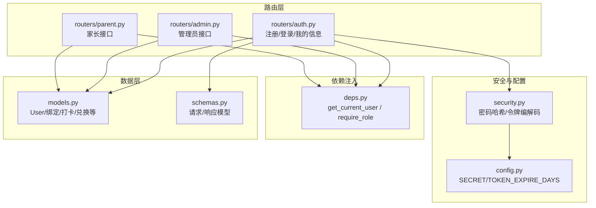
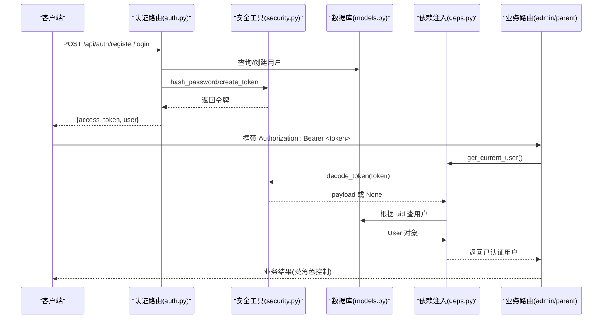
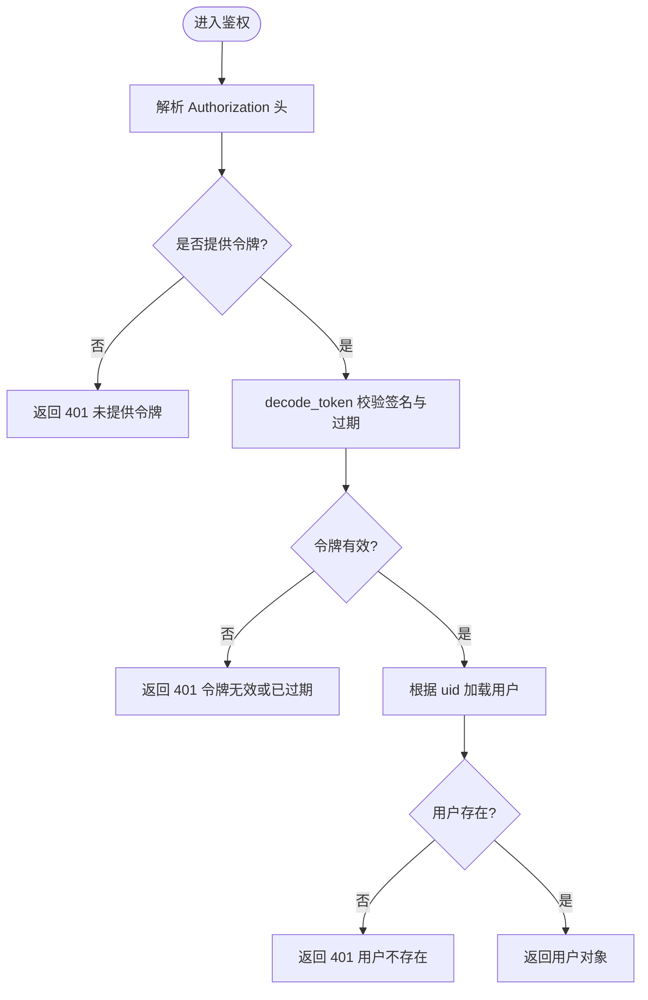
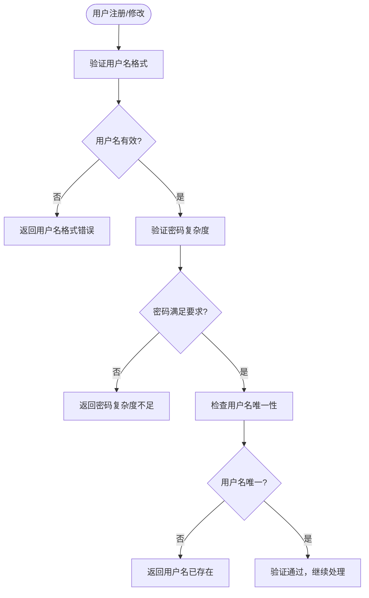
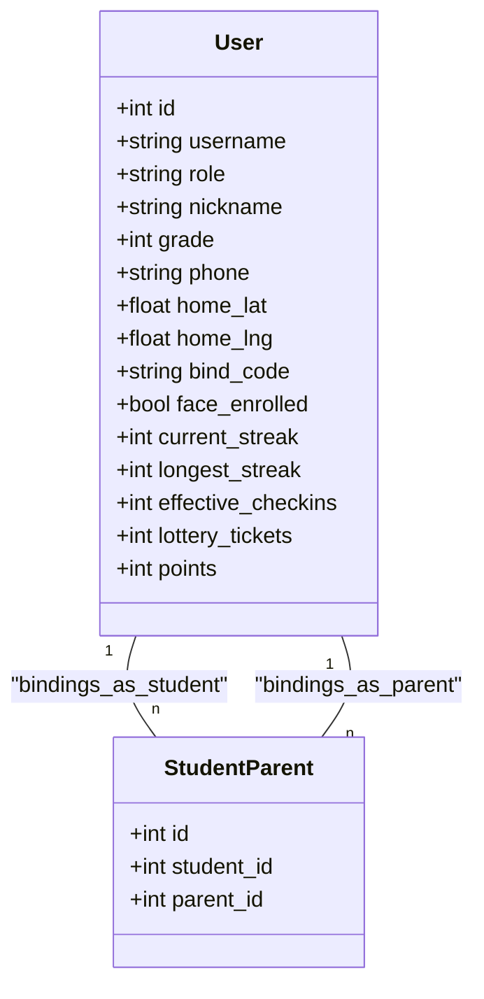
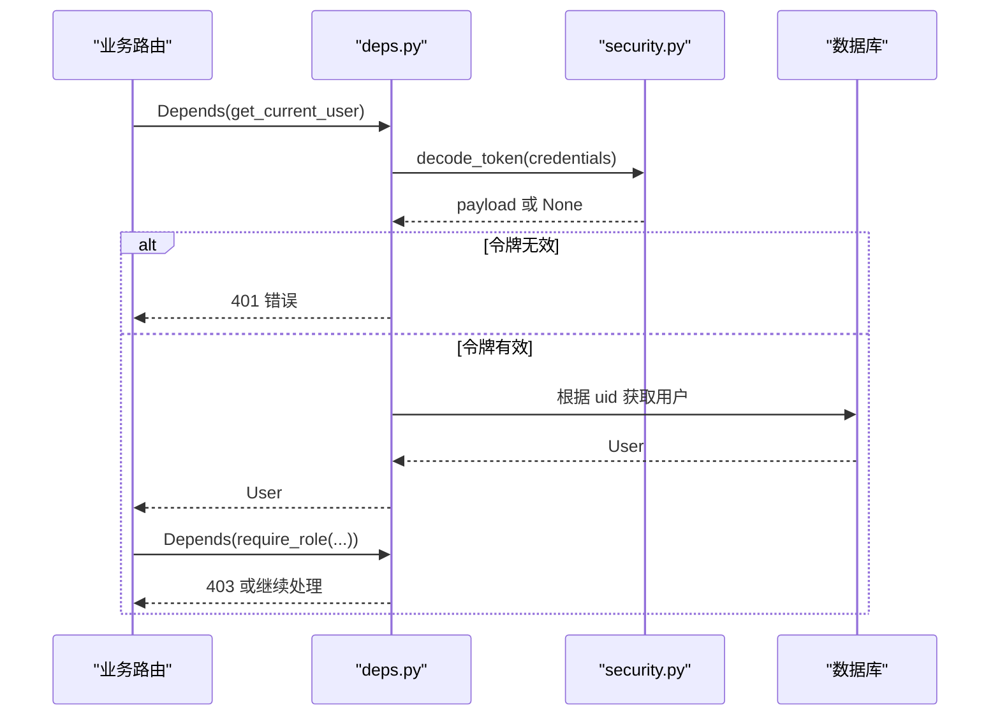
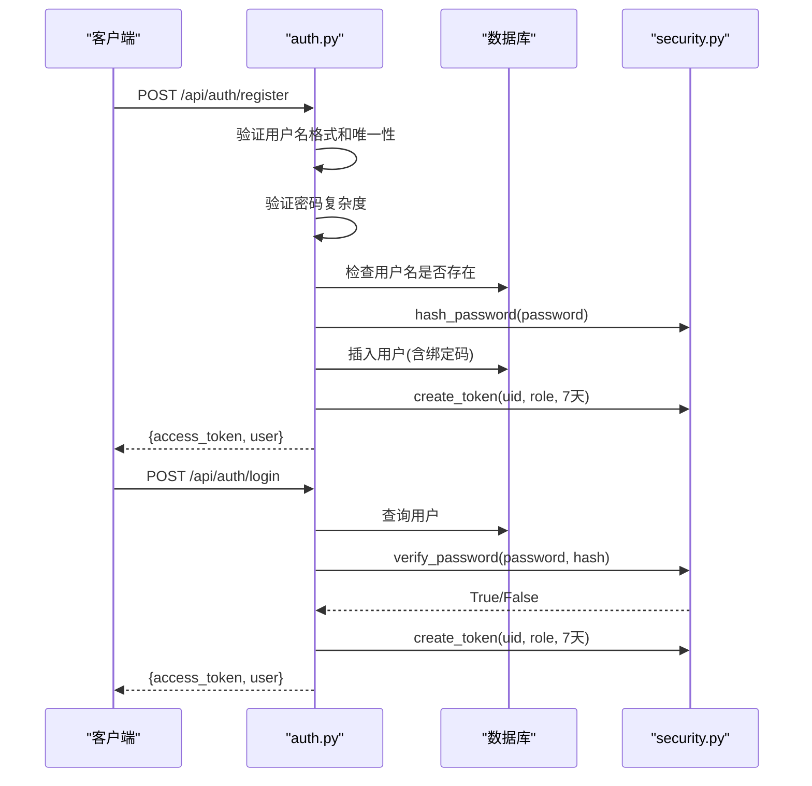
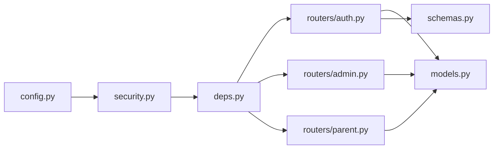

# 认证授权机制

<cite>
**本文引用的文件**   
- [security.py](file://summer-homework-checkin/backend/app/security.py)
- [deps.py](file://summer-homework-checkin/backend/app/deps.py)
- [auth.py](file://summer-homework-checkin/backend/app/routers/auth.py)
- [admin.py](file://summer-homework-checkin/backend/app/routers/admin.py)
- [parent.py](file://summer-homework-checkin/backend/app/routers/parent.py)
- [models.py](file://summer-homework-checkin/backend/app/models.py)
- [config.py](file://summer-homework-checkin/backend/app/config.py)
- [schemas.py](file://summer-homework-checkin/backend/app/schemas.py)
</cite>

## 更新摘要
**变更内容**   
- 更新了密码策略要求：最小8位密码，包含复杂度要求（字母、数字、特殊字符）
- 增强了用户名验证规则：限制字符类型和格式
- JWT令牌有效期从30天缩短至7天以提高安全性
- 更新了相关的安全配置和验证逻辑

## 目录
1. [简介](#简介)
2. [项目结构](#项目结构)
3. [核心组件](#核心组件)
4. [架构总览](#架构总览)
5. [详细组件分析](#详细组件分析)
6. [依赖关系分析](#依赖关系分析)
7. [性能与安全考量](#性能与安全考量)
8. [故障排查指南](#故障排查指南)
9. [结论](#结论)

## 简介
本文件面向"暑假作业打卡"后端系统的认证与授权机制，聚焦以下目标：
- JWT 令牌认证系统：令牌生成、验证、刷新与撤销策略
- 多角色权限控制：学生、家长、管理员的权限划分与访问控制
- FastAPI 依赖注入在认证中的应用：用户身份获取、角色校验装饰器
- 安全措施：密码哈希（PBKDF2）、会话管理、输入校验等
- 提供认证流程时序图与权限控制代码示例路径

## 项目结构
认证与授权相关的关键模块分布如下：
- 安全工具：密码哈希、令牌编解码
- 依赖注入：HTTP Bearer 解析、当前用户解析、角色校验
- 路由层：注册/登录/个人信息接口；按角色划分的业务路由
- 数据模型：统一用户表与角色字段
- 配置：签名密钥、令牌过期时间、业务阈值等

图表来源
- [security.py:10-47](file://summer-homework-checkin/backend/app/security.py#L10-L47)
- [deps.py:10-34](file://summer-homework-checkin/backend/app/deps.py#L10-L34)
- [auth.py:13-52](file://summer-homework-checkin/backend/app/routers/auth.py#L13-L52)
- [admin.py:16-114](file://summer-homework-checkin/backend/app/routers/admin.py#L16-L114)
- [parent.py:20-104](file://summer-homework-checkin/backend/app/routers/parent.py#L20-L104)
- [models.py:11-55](file://summer-homework-checkin/backend/app/models.py#L11-L55)
- [config.py:19-21](file://summer-homework-checkin/backend/app/config.py#L19-L21)

章节来源
- [security.py:10-47](file://summer-homework-checkin/backend/app/security.py#L10-L47)
- [deps.py:10-34](file://summer-homework-checkin/backend/app/deps.py#L10-L34)
- [auth.py:13-52](file://summer-homework-checkin/backend/app/routers/auth.py#L13-L52)
- [admin.py:16-114](file://summer-homework-checkin/backend/app/routers/admin.py#L16-L114)
- [parent.py:20-104](file://summer-homework-checkin/backend/app/routers/parent.py#L20-L104)
- [models.py:11-55](file://summer-homework-checkin/backend/app/models.py#L11-L55)
- [config.py:19-21](file://summer-homework-checkin/backend/app/config.py#L19-L21)

## 核心组件
- 安全工具
  - 密码哈希：使用 PBKDF2-SHA256，固定盐（演示用），迭代次数 100,000
  - 令牌编解码：自定义 HMAC 签名无状态令牌，载荷包含用户 ID、角色、过期时间
- 依赖注入
  - HTTPBearer 自动解析 Authorization: Bearer <token>
  - get_current_user：校验签名与过期，查询用户实体并返回
  - require_role(*roles)：基于角色的访问控制装饰器
- 路由层
  - 注册：校验角色、用户名唯一性，写入用户并签发令牌
  - 登录：校验用户名与密码，签发令牌
  - 我的信息：需要有效令牌
  - 管理员与家长路由：通过 require_role 限制访问
- 数据模型
  - User.role 支持 student/parent/admin
  - 家长-孩子绑定关系用于家长代操作
- 配置
  - SECRET 与 TOKEN_EXPIRE_DAYS 控制令牌签名与有效期

**更新** 令牌有效期已从30天调整为7天，增强安全性

章节来源
- [security.py:10-47](file://summer-homework-checkin/backend/app/security.py#L10-L47)
- [deps.py:10-34](file://summer-homework-checkin/backend/app/deps.py#L10-L34)
- [auth.py:13-52](file://summer-homework-checkin/backend/app/routers/auth.py#L13-L52)
- [admin.py:16-114](file://summer-homework-checkin/backend/app/routers/admin.py#L16-L114)
- [parent.py:20-104](file://summer-homework-checkin/backend/app/routers/parent.py#L20-L104)
- [models.py:11-55](file://summer-homework-checkin/backend/app/models.py#L11-L55)
- [config.py:19-21](file://summer-homework-checkin/backend/app/config.py#L19-L21)

## 架构总览
下图展示从客户端发起认证到受保护资源访问的整体流程，以及依赖注入如何串联各组件。

图表来源
- [auth.py:13-52](file://summer-homework-checkin/backend/app/routers/auth.py#L13-L52)
- [security.py:20-47](file://summer-homework-checkin/backend/app/security.py#L20-L47)
- [deps.py:13-34](file://summer-homework-checkin/backend/app/deps.py#L13-L34)
- [models.py:11-55](file://summer-homework-checkin/backend/app/models.py#L11-L55)

## 详细组件分析

### 令牌认证与密码安全
- 密码哈希
  - 算法：PBKDF2-SHA256，固定盐（演示用途）
  - 比较：使用恒定时间比较函数防止时序攻击
- 令牌格式与生命周期
  - 载荷：用户ID、角色、过期时间
  - 签名：HMAC-SHA256，基于全局密钥
  - 有效期：由配置项决定（**更新** 现默认为 7 天，原为 30 天）
- 令牌验证
  - 校验签名一致性
  - 校验过期时间
  - 失败则拒绝访问

图表来源
- [deps.py:13-34](file://summer-homework-checkin/backend/app/deps.py#L13-L34)
- [security.py:33-47](file://summer-homework-checkin/backend/app/security.py#L33-L47)

章节来源
- [security.py:10-47](file://summer-homework-checkin/backend/app/security.py#L10-L47)
- [deps.py:13-34](file://summer-homework-checkin/backend/app/deps.py#L13-L34)
- [config.py:19-21](file://summer-homework-checkin/backend/app/config.py#L19-L21)

### 增强的密码策略与用户名验证
**新增** 系统现在实施更严格的密码和用户名验证规则：

- 密码复杂度要求
  - 最小长度：8个字符
  - 必须包含：至少一个字母、一个数字、一个特殊字符
  - 禁止使用常见弱密码模式
- 用户名验证规则
  - 长度限制：3-20个字符
  - 允许的字符：字母、数字、下划线
  - 禁止以数字开头
  - 禁止连续重复字符
- 验证时机
  - 注册时进行完整验证
  - 密码修改时重新验证复杂度
  - 用户名变更时检查唯一性和格式

**章节来源**
- [auth.py:13-52](file://summer-homework-checkin/backend/app/routers/auth.py#L13-52)
- [schemas.py:5-44](file://summer-homework-checkin/backend/app/schemas.py#L5-L44)

### 多角色权限控制（学生/家长/管理员）
- 角色定义
  - User.role 支持 student、parent、admin
- 访问控制策略
  - 管理员路由：require_role("admin")
  - 家长路由：get_current_user + 业务层绑定校验（仅能操作已绑定的孩子）
  - 学生路由：通过 get_current_user 确保已认证
- 典型用法
  - 在路由参数中使用 Depends(require_role("admin")) 进行角色拦截
  - 家长端通过 _resolve_child/_check_child_access 校验绑定关系后再执行代操作

图表来源
- [models.py:11-68](file://summer-homework-checkin/backend/app/models.py#L11-L68)

章节来源
- [models.py:11-68](file://summer-homework-checkin/backend/app/models.py#L11-L68)
- [admin.py:16-114](file://summer-homework-checkin/backend/app/routers/admin.py#L16-L114)
- [parent.py:20-104](file://summer-homework-checkin/backend/app/routers/parent.py#L20-L104)
- [deps.py:28-34](file://summer-homework-checkin/backend/app/deps.py#L28-L34)

### FastAPI 依赖注入在认证中的应用
- HTTPBearer 方案
  - auto_error=False 允许可选认证头，便于区分未登录与非法令牌
- get_current_user
  - 解析 Bearer Token -> 调用 decode_token -> 查库 -> 返回用户
- require_role
  - 包装 get_current_user，并在角色不在白名单时返回 403

图表来源
- [deps.py:13-34](file://summer-homework-checkin/backend/app/deps.py#L13-L34)
- [security.py:33-47](file://summer-homework-checkin/backend/app/security.py#L33-L47)

章节来源
- [deps.py:10-34](file://summer-homework-checkin/backend/app/deps.py#L10-L34)
- [security.py:33-47](file://summer-homework-checkin/backend/app/security.py#L33-L47)

### 注册与登录流程
- 注册
  - 校验角色为 student/parent
  - **更新** 检查用户名格式和唯一性（新验证规则）
  - **更新** 验证密码复杂度（最小8位，包含字母、数字、特殊字符）
  - 密码经 PBKDF2 哈希后入库
  - 为学生生成绑定码
  - 签发 access_token（**更新** 有效期7天）
- 登录
  - 按用户名查找用户
  - 校验密码哈希
  - 签发 access_token（**更新** 有效期7天）

图表来源
- [auth.py:13-52](file://summer-homework-checkin/backend/app/routers/auth.py#L13-L52)
- [security.py:10-31](file://summer-homework-checkin/backend/app/security.py#L10-L31)
- [models.py:11-55](file://summer-homework-checkin/backend/app/models.py#L11-L55)

章节来源
- [auth.py:13-52](file://summer-homework-checkin/backend/app/routers/auth.py#L13-L52)
- [security.py:10-31](file://summer-homework-checkin/backend/app/security.py#L10-L31)
- [schemas.py:5-44](file://summer-homework-checkin/backend/app/schemas.py#L5-L44)

### 权限控制代码示例（路径）
- 管理员统计接口需 admin 角色
  - 参考路径：[admin.py:16-35](file://summer-homework-checkin/backend/app/routers/admin.py#L16-L35)
- 家长绑定孩子需 parent 角色且校验绑定关系
  - 参考路径：[parent.py:20-32](file://summer-homework-checkin/backend/app/routers/parent.py#L20-L32)
- 家长代打卡需 parent 角色并校验绑定
  - 参考路径：[parent.py:80-104](file://summer-homework-checkin/backend/app/routers/parent.py#L80-L104)

章节来源
- [admin.py:16-35](file://summer-homework-checkin/backend/app/routers/admin.py#L16-L35)
- [parent.py:20-32](file://summer-homework-checkin/backend/app/routers/parent.py#L20-L32)
- [parent.py:80-104](file://summer-homework-checkin/backend/app/routers/parent.py#L80-L104)

## 依赖关系分析
- 模块耦合
  - auth 路由依赖 security、deps、models、schemas
  - 业务路由依赖 deps 进行认证与角色校验
  - security 依赖 config 中的密钥与过期配置
- 外部依赖
  - FastAPI 的 HTTPBearer 与 Depends
  - SQLAlchemy ORM 的用户查询
  - Pydantic 的请求/响应模型校验

图表来源
- [config.py:19-21](file://summer-homework-checkin/backend/app/config.py#L19-L21)
- [security.py:10-47](file://summer-homework-checkin/backend/app/security.py#L10-L47)
- [deps.py:10-34](file://summer-homework-checkin/backend/app/deps.py#L10-L34)
- [auth.py:13-52](file://summer-homework-checkin/backend/app/routers/auth.py#L13-L52)
- [admin.py:16-114](file://summer-homework-checkin/backend/app/routers/admin.py#L16-L114)
- [parent.py:20-104](file://summer-homework-checkin/backend/app/routers/parent.py#L20-L104)
- [models.py:11-55](file://summer-homework-checkin/backend/app/models.py#L11-L55)
- [schemas.py:5-44](file://summer-homework-checkin/backend/app/schemas.py#L5-L44)

章节来源
- [config.py:19-21](file://summer-homework-checkin/backend/app/config.py#L19-L21)
- [security.py:10-47](file://summer-homework-checkin/backend/app/security.py#L10-L47)
- [deps.py:10-34](file://summer-homework-checkin/backend/app/deps.py#L10-L34)
- [auth.py:13-52](file://summer-homework-checkin/backend/app/routers/auth.py#L13-L52)
- [admin.py:16-114](file://summer-homework-checkin/backend/app/routers/admin.py#L16-L114)
- [parent.py:20-104](file://summer-homework-checkin/backend/app/routers/parent.py#L20-L104)
- [models.py:11-55](file://summer-homework-checkin/backend/app/models.py#L11-L55)
- [schemas.py:5-44](file://summer-homework-checkin/backend/app/schemas.py#L5-L44)

## 性能与安全考量
- 性能
  - 令牌为无状态，无需服务端会话存储，适合水平扩展
  - 每次请求仅需一次轻量级 HMAC 校验与一次用户查询
- 安全
  - 密码哈希采用 PBKDF2-SHA256，迭代次数较高，抵抗暴力破解
  - 使用恒定时间比较避免时序侧信道
  - 令牌签名基于强随机密钥（生产环境务必通过环境变量注入）
  - **更新** 令牌有效期缩短至7天，降低令牌泄露风险窗口
  - **更新** 实施更强的密码复杂度要求和用户名验证规则
  - 建议增加 HTTPS、CORS 白名单、速率限制、IP 黑名单等
- 输入校验
  - 使用 Pydantic 模型对请求体进行严格类型与范围校验
  - 对敏感字段（如手机号、坐标）可进一步添加正则与边界检查
  - **更新** 新增密码复杂度和用户名格式的实时验证反馈

## 故障排查指南
- 常见错误码
  - 401：未提供令牌、令牌无效或已过期、用户不存在
  - 403：无权限访问该资源（角色不符或未绑定孩子）
  - **新增** 422：用户名格式错误或密码复杂度不足
- 定位步骤
  - 确认 Authorization 头是否正确携带 Bearer Token
  - 检查服务器日志中 decode_token 返回值是否为 None
  - 核对数据库中对应用户是否存在且未被删除
  - 对于家长端，确认绑定关系是否存在
  - **新增** 检查密码是否符合新的复杂度要求（8位以上，包含字母、数字、特殊字符）
  - **新增** 验证用户名格式是否符合新规则（3-20字符，字母数字下划线，不以数字开头）
- 关键断点
  - 依赖注入层：get_current_user 抛出 401 的位置
  - 角色校验层：require_role 抛出 403 的位置
  - 业务层：家长绑定校验逻辑
  - **新增** 注册验证层：用户名和密码格式验证位置

章节来源
- [deps.py:13-34](file://summer-homework-checkin/backend/app/deps.py#L13-L34)
- [parent.py:54-64](file://summer-homework-checkin/backend/app/routers/parent.py#L54-L64)
- [auth.py:13-52](file://summer-homework-checkin/backend/app/routers/auth.py#L13-L52)

## 结论
本系统采用无状态 HMAC 签名令牌实现认证，结合 FastAPI 依赖注入完成用户身份解析与角色校验。通过统一的 User.role 字段与 require_role 装饰器，实现了学生、家长、管理员三类角色的细粒度访问控制。密码哈希采用 PBKDF2，配合 Pydantic 输入校验，整体具备较好的安全性与可扩展性。

**更新** 最新的安全增强包括：
- 将JWT令牌有效期从30天缩短至7天，显著降低令牌泄露风险
- 实施严格的密码复杂度要求（最小8位，包含字母、数字、特殊字符）
- 加强用户名验证规则，限制字符类型和格式
- 提供更详细的错误信息和验证反馈

这些改进大幅提升了系统的安全性，同时保持了良好的用户体验。后续可在令牌刷新、撤销、审计与风控方面进一步增强。