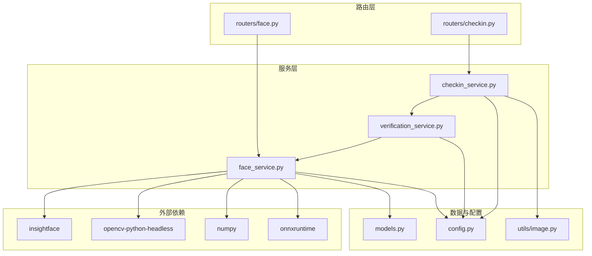
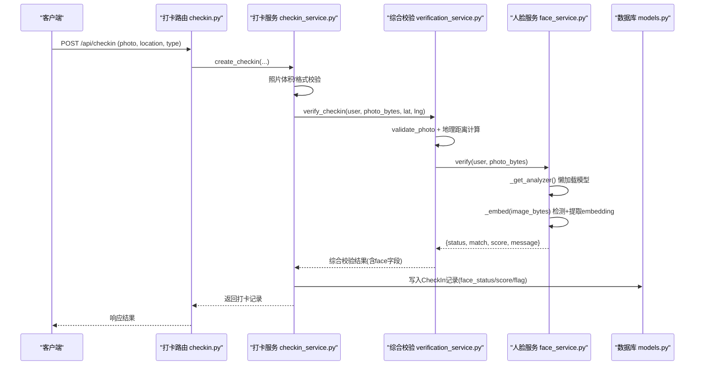
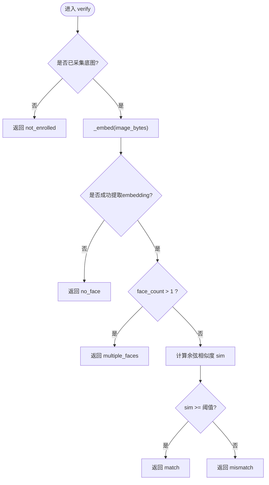
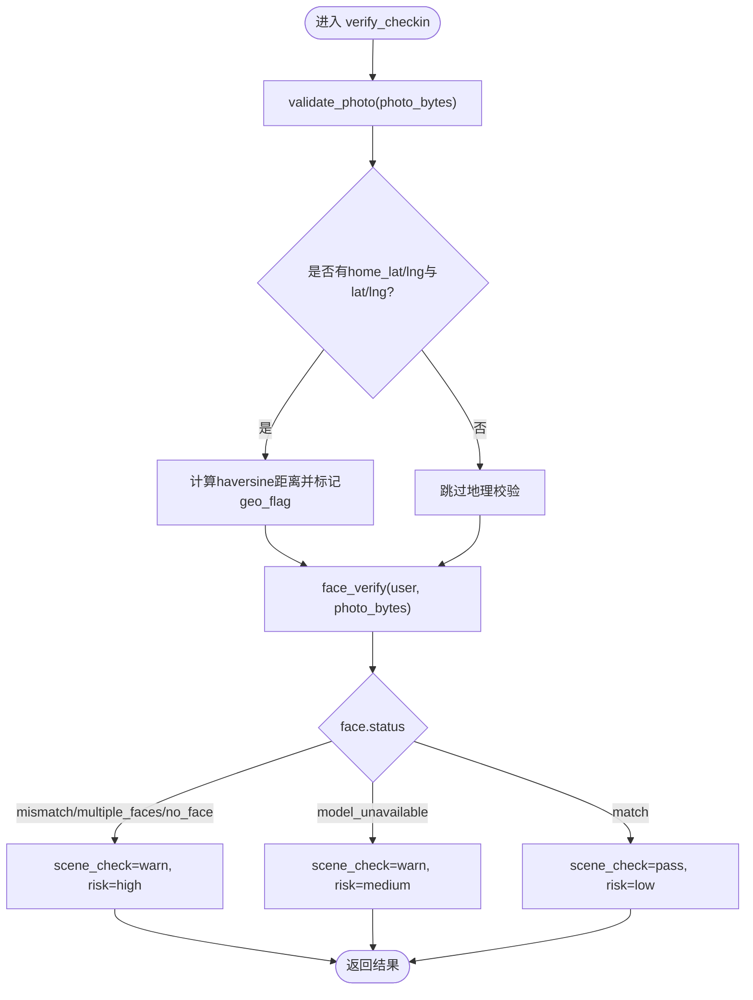
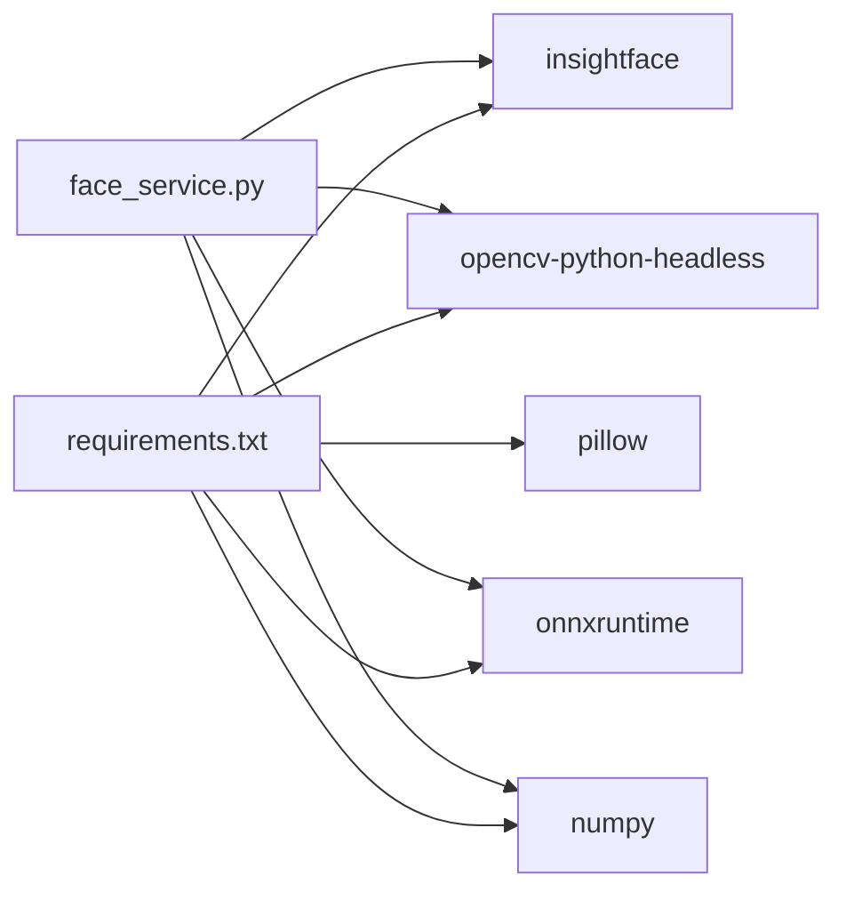

# 人脸识别1:1比对

<cite>
**本文引用的文件列表**
- [face_service.py](file://summer-homework-checkin/backend/app/services/face_service.py)
- [verification_service.py](file://summer-homework-checkin/backend/app/services/verification_service.py)
- [checkin_service.py](file://summer-homework-checkin/backend/app/services/checkin_service.py)
- [config.py](file://summer-homework-checkin/backend/app/config.py)
- [models.py](file://summer-homework-checkin/backend/app/models.py)
- [image.py](file://summer-homework-checkin/backend/app/utils/image.py)
- [requirements.txt](file://summer-homework-checkin/backend/requirements.txt)
- [README.md](file://summer-homework-checkin/README.md)
</cite>

## 目录
1. [简介](#简介)
2. [项目结构](#项目结构)
3. [核心组件](#核心组件)
4. [架构总览](#架构总览)
5. [详细组件分析](#详细组件分析)
6. [依赖关系分析](#依赖关系分析)
7. [性能与优化建议](#性能与优化建议)
8. [故障排查指南](#故障排查指南)
9. [结论](#结论)
10. [附录](#附录)

## 简介
本模块实现基于 InsightFace 的人脸识别 1:1 本人比对能力，用于“暑假作业打卡”场景的防代打卡校验。系统采用本地推理（CPU），首次运行自动下载预训练模型 buffalo_l，完成人脸检测与特征提取；在注册时采集一张正脸作为“人脸底图”，每次打卡时将现场照与底图进行余弦相似度比对，超过阈值即判定为本人。若环境缺失依赖或模型不可用，服务会安全降级，已采集底图的账号不会静默放行，从而保障业务安全性。

## 项目结构
该功能位于 summer-homework-checkin 后端项目中，核心代码集中在 services、routers、utils 与 config 等目录：
- 服务层：face_service.py（InsightFace 集成、特征提取与比对）、verification_service.py（综合校验编排）
- 路由层：routers/face.py（人脸采集与状态查询接口）
- 数据模型：models.py（用户表含 face_embedding 字段）
- 配置项：config.py（阈值、检测尺寸、模型名、策略模式）
- 工具：utils/image.py（图像基础校验）
- 依赖：requirements.txt（insightface、onnxruntime、opencv-python-headless、numpy、pillow）

图表来源
- [face_service.py:1-133](file://summer-homework-checkin/backend/app/services/face_service.py#L1-L133)
- [verification_service.py:1-70](file://summer-homework-checkin/backend/app/services/verification_service.py#L1-L70)
- [checkin_service.py:1-254](file://summer-homework-checkin/backend/app/services/checkin_service.py#L1-L254)
- [config.py:1-50](file://summer-homework-checkin/backend/app/config.py#L1-L50)
- [models.py:1-212](file://summer-homework-checkin/backend/app/models.py#L1-L212)
- [image.py:1-61](file://summer-homework-checkin/backend/app/utils/image.py#L1-L61)

章节来源
- [face_service.py:1-133](file://summer-homework-checkin/backend/app/services/face_service.py#L1-L133)
- [verification_service.py:1-70](file://summer-homework-checkin/backend/app/services/verification_service.py#L1-L70)
- [checkin_service.py:1-254](file://summer-homework-checkin/backend/app/services/checkin_service.py#L1-L254)
- [config.py:1-50](file://summer-homework-checkin/backend/app/config.py#L1-L50)
- [models.py:1-212](file://summer-homework-checkin/backend/app/models.py#L1-L212)
- [image.py:1-61](file://summer-homework-checkin/backend/app/utils/image.py#L1-L61)

## 核心组件
- 人脸服务（face_service.py）
  - 懒加载 InsightFace FaceAnalysis 分析器，强制 CPU 推理，线程安全初始化
  - _embed：解码图像、调用模型检测并提取最大人脸的 512 维 embedding
  - enroll：采集人脸底图，保存路径与 embedding JSON
  - unenroll：撤销底图
  - verify：1:1 比对流程，返回结构化结果（状态、匹配布尔值、相似度分数、消息）
  - is_available：健康检查，判断模型可用性
- 综合校验服务（verification_service.py）
  - 图片合规校验、地理位置一致性计算、调用 face_verify 进行 1:1 比对
  - 根据人脸状态与策略标记风险等级与场景检查结果
- 打卡服务（checkin_service.py）
  - 创建打卡记录前执行照片校验、补卡规则、防代打卡校验（含人脸策略拦截）
  - 将人脸状态与分数持久化到打卡记录
- 配置（config.py）
  - FACE_MATCH_THRESHOLD：余弦相似度阈值（默认 0.4）
  - FACE_DET_SIZE：检测输入尺寸（默认 320x320）
  - FACE_MODEL_NAME：模型名称（buffalo_l）
  - FACE_MODE_ON_ENROLLED：已采集底图后的人脸策略（enforce/soft）
- 数据模型（models.py）
  - User 表包含 face_enrolled、face_embedding、face_id_path 字段
  - CheckIn 表包含 face_status、face_score、face_flag 等字段

章节来源
- [face_service.py:1-133](file://summer-homework-checkin/backend/app/services/face_service.py#L1-L133)
- [verification_service.py:1-70](file://summer-homework-checkin/backend/app/services/verification_service.py#L1-L70)
- [checkin_service.py:1-254](file://summer-homework-checkin/backend/app/services/checkin_service.py#L1-L254)
- [config.py:1-50](file://summer-homework-checkin/backend/app/config.py#L1-L50)
- [models.py:1-212](file://summer-homework-checkin/backend/app/models.py#L1-L212)

## 架构总览
下图展示了从客户端提交打卡请求到最终返回结果的完整链路，包括人脸 1:1 比对的调用位置与关键决策点。

图表来源
- [checkin_service.py:64-163](file://summer-homework-checkin/backend/app/services/checkin_service.py#L64-L163)
- [verification_service.py:19-70](file://summer-homework-checkin/backend/app/services/verification_service.py#L19-L70)
- [face_service.py:99-125](file://summer-homework-checkin/backend/app/services/face_service.py#L99-L125)
- [models.py:70-96](file://summer-homework-checkin/backend/app/models.py#L70-L96)

## 详细组件分析

### 人脸服务（face_service.py）
- 模型懒加载与线程安全
  - 使用全局锁确保仅一次初始化 FaceAnalysis，ctx_id=-1 强制 CPU 推理，det_size 由配置控制
- 特征提取（_embed）
  - 使用 opencv 解码图像，调用 analyzer.get(img) 获取人脸集合
  - 按人脸框面积排序，选择最大人脸的 embedding（512 维 float32）
  - 返回 (embedding|None, face_count, note)
- 采集（enroll）
  - 要求检测到且仅检测到一张人脸，保存上传路径与 embedding JSON，设置 face_enrolled=True
- 撤销（unenroll）
  - 清空 face_embedding 与 face_id_path，重置 face_enrolled=False
- 比对（verify）
  - 未采集则返回 not_enrolled
  - 未检测到人脸返回 no_face
  - 多张人脸返回 multiple_faces
  - 否则计算余弦相似度 sim = dot(ref, emb_b) / (||ref|| * ||emb_b|| + 1e-8)
  - 以 FACE_MATCH_THRESHOLD 为阈值判定 match，返回结构化结果

图表来源
- [face_service.py:99-125](file://summer-homework-checkin/backend/app/services/face_service.py#L99-L125)
- [face_service.py:49-68](file://summer-homework-checkin/backend/app/services/face_service.py#L49-L68)
- [config.py:41-44](file://summer-homework-checkin/backend/app/config.py#L41-L44)

章节来源
- [face_service.py:1-133](file://summer-homework-checkin/backend/app/services/face_service.py#L1-L133)
- [config.py:41-44](file://summer-homework-checkin/backend/app/config.py#L41-L44)

### 综合校验服务（verification_service.py）
- 图片合规校验：validate_photo 过滤占位图/缩略图
- 地理位置一致性：计算距常用位置距离，标记 geo_flag
- 人脸 1:1 比对：调用 face_verify，捕获异常并降级为 model_unavailable
- 风险判定：
  - 图片不合规 -> scene_check=warn, risk=high
  - 地理位置超阈 -> scene_check=warn, risk=medium
  - 已采集但人脸不通过 -> scene_check=warn, risk=high
  - 已采集但模型不可用 -> scene_check=warn, risk=medium

图表来源
- [verification_service.py:19-70](file://summer-homework-checkin/backend/app/services/verification_service.py#L19-L70)
- [image.py:51-61](file://summer-homework-checkin/backend/app/utils/image.py#L51-L61)

章节来源
- [verification_service.py:1-70](file://summer-homework-checkin/backend/app/services/verification_service.py#L1-L70)
- [image.py:1-61](file://summer-homework-checkin/backend/app/utils/image.py#L1-L61)

### 打卡服务（checkin_service.py）
- 照片校验：体积与尺寸门槛，非 JPEG/PNG 直接拒绝
- 补卡规则：目标日期合法性、重复打卡检查、月度上限
- 防代打卡策略：
  - 已采集且人脸不通过 -> 直接拒绝（HTTP 400）
  - 已采集且模型不可用且 enforce 模式 -> 返回 503
- 持久化：写入 CheckIn 记录，包含 face_status、face_score、face_flag 等字段

章节来源
- [checkin_service.py:64-163](file://summer-homework-checkin/backend/app/services/checkin_service.py#L64-L163)
- [models.py:70-96](file://summer-homework-checkin/backend/app/models.py#L70-L96)

### 数据模型（models.py）
- User 表
  - face_enrolled：是否已采集人脸底图
  - face_embedding：JSON 化的 512 维向量
  - face_id_path：人脸底图相对存储路径
- CheckIn 表
  - face_status：match|mismatch|no_face|multiple_faces|not_enrolled|model_unavailable
  - face_score：人脸相似度
  - face_flag：人脸不通过标记

章节来源
- [models.py:11-31](file://summer-homework-checkin/backend/app/models.py#L11-L31)
- [models.py:70-96](file://summer-homework-checkin/backend/app/models.py#L70-L96)

## 依赖关系分析
- 运行时依赖
  - insightface>=0.7：提供 FaceAnalysis 与预训练模型
  - onnxruntime>=1.16：模型推理引擎
  - opencv-python-headless>=4.9：图像解码与处理
  - numpy>=1.24：数值计算与向量操作
  - pillow>=10.0：图像处理辅助
- 配置与环境
  - 首次运行自动下载 buffalo_l 模型至 ~/.insightface
  - ctx_id=-1 强制 CPU 推理，避免 GPU 依赖
  - 无外网或依赖缺失时，服务降级为“模型不可用”，已采集账号严格拦截

图表来源
- [requirements.txt:1-10](file://summer-homework-checkin/backend/requirements.txt#L1-L10)
- [face_service.py:28-46](file://summer-homework-checkin/backend/app/services/face_service.py#L28-L46)

章节来源
- [requirements.txt:1-10](file://summer-homework-checkin/backend/requirements.txt#L1-L10)
- [face_service.py:28-46](file://summer-homework-checkin/backend/app/services/face_service.py#L28-L46)

## 性能与优化建议
- 模型加载与缓存
  - 当前实现使用全局单例与线程锁，避免重复加载；生产环境可考虑进程内共享或预热启动
- 推理加速
  - 保持 det_size=320x320 平衡速度与精度；如需更高吞吐，可在保证精度的前提下降低分辨率
  - 使用 onnxruntime 的优化选项（如线程数、内存池）提升并发性能
- 批量与异步
  - 对高并发场景，可将人脸比对放入任务队列，避免阻塞主请求线程
- 存储与IO
  - 人脸底图与打卡照片建议使用对象存储（OSS/S3）并启用 CDN，减少磁盘 IO 压力
- 监控与指标
  - 记录每次比对的耗时、相似度分布、失败率，便于阈值调优与容量规划

[本节为通用指导，无需具体文件引用]

## 故障排查指南
- 模型不可用
  - 现象：face.status=model_unavailable
  - 原因：缺少 insightface/onnxruntime 或网络无法下载模型
  - 处理：安装依赖、允许外网访问、确认 ~/.insightface 目录权限
- 未检测到人脸
  - 现象：face.status=no_face
  - 原因：光照不足、遮挡、侧脸、距离过远
  - 处理：调整拍摄条件，确保正脸、清晰、光线均匀
- 多张人脸
  - 现象：face.status=multiple_faces
  - 原因：背景有人物或反光造成误检
  - 处理：单独拍摄孩子本人，清理背景
- 相似度偏低
  - 现象：face.status=mismatch，score < 阈值
  - 原因：底图质量差、角度差异大、年龄变化、滤镜/压缩
  - 处理：重新采集高质量底图，必要时微调阈值
- 策略模式影响
  - enforce：已采集且人脸不通过直接拒绝
  - soft：已采集但不通过仍记录，需人工复核
  - 可通过环境变量 FACE_MODE_ON_ENROLLED 切换

章节来源
- [face_service.py:99-132](file://summer-homework-checkin/backend/app/services/face_service.py#L99-L132)
- [verification_service.py:40-70](file://summer-homework-checkin/backend/app/services/verification_service.py#L40-L70)
- [config.py:46-49](file://summer-homework-checkin/backend/app/config.py#L46-L49)

## 结论
本模块以 InsightFace 为核心，实现了稳定可靠的 1:1 人脸比对能力，结合图片合规与地理位置校验，有效降低代打卡风险。通过可配置的阈值与策略模式，系统在安全性与用户体验之间取得良好平衡。未来可扩展为 1:N 检索以提升多用户场景下的效率与精度。

[本节为总结性内容，无需具体文件引用]

## 附录

### 阈值设置策略与置信度评估
- 阈值（FACE_MATCH_THRESHOLD）
  - 默认 0.4，越高越严格；建议基于历史数据绘制 ROC 曲线，选择 FPR/FNR 均衡点
  - 不同年龄段/设备/光照条件下可分群调参
- 置信度评估
  - 使用余弦相似度作为置信度指标，范围 [-1, 1]，实际为正态分布近似
  - 建议记录 score 分布，定期复盘误判案例，动态调整阈值
- 误判率控制
  - 通过 enforce/soft 策略控制拦截强度
  - 引入二次校验（管理员审核）与申诉通道，降低误拒率

章节来源
- [config.py:41-49](file://summer-homework-checkin/backend/app/config.py#L41-L49)
- [face_service.py:114-125](file://summer-homework-checkin/backend/app/services/face_service.py#L114-L125)

### 人脸底图采集规范与最佳实践
- 采集要求
  - 正脸、无遮挡、双眼可见、表情自然
  - 光线均匀，避免强逆光与阴影
  - 背景简洁，避免多人同框
- 设备与环境
  - 手机摄像头像素适中，避免过度美颜/滤镜
  - 室内自然光或柔光灯效果更佳
- 操作流程
  - 先采集底图（/api/face/enroll），再参与打卡
  - 若多次失败，尝试不同角度与距离重拍

章节来源
- [face_service.py:71-87](file://summer-homework-checkin/backend/app/services/face_service.py#L71-L87)
- [image.py:51-61](file://summer-homework-checkin/backend/app/utils/image.py#L51-L61)

### 常见识别失败场景与处理方案
- 低光照/逆光：导致特征不稳定，建议补光或移至明亮环境
- 遮挡（口罩、帽子、刘海）：尽量去除遮挡物，露出五官
- 侧脸/倾斜：保持正面朝向镜头，头部姿态接近正脸
- 年龄变化/发型改变：定期更新底图，提高鲁棒性
- 多设备差异：统一采集设备或校准参数，减少域偏移

章节来源
- [face_service.py:49-68](file://summer-homework-checkin/backend/app/services/face_service.py#L49-L68)
- [verification_service.py:40-70](file://summer-homework-checkin/backend/app/services/verification_service.py#L40-L70)

### 部署与依赖说明
- 依赖安装
  - insightface、onnxruntime、opencv-python-headless、numpy、pillow
- 模型下载
  - 首次运行自动下载 buffalo_l 至 ~/.insightface，需外网
- 运行环境
  - CPU 推理（ctx_id=-1），适合轻量部署
- 参考文档
  - README 中明确说明本地推理与降级策略

章节来源
- [requirements.txt:1-10](file://summer-homework-checkin/backend/requirements.txt#L1-L10)
- [README.md:120-126](file://summer-homework-checkin/README.md#L120-L126)