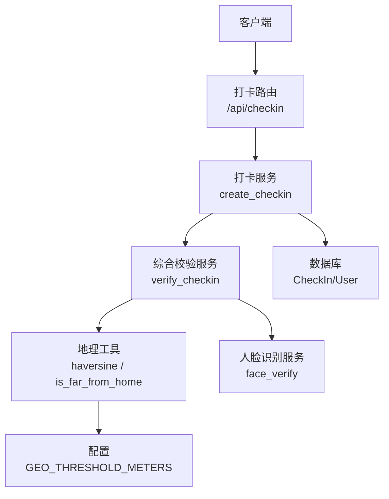
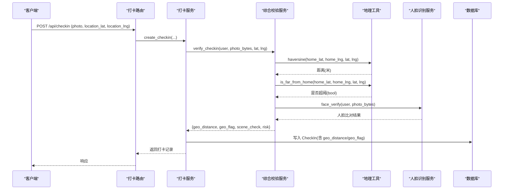
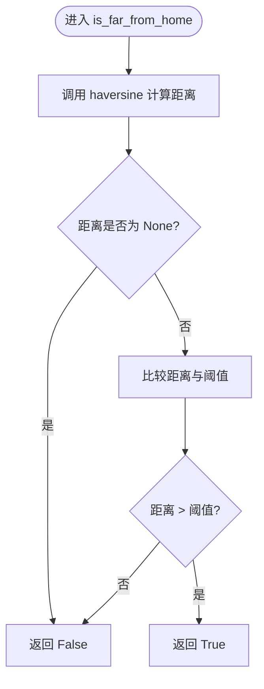
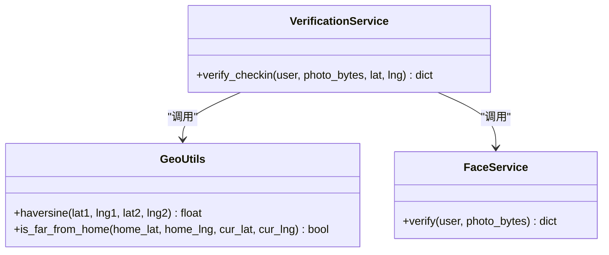
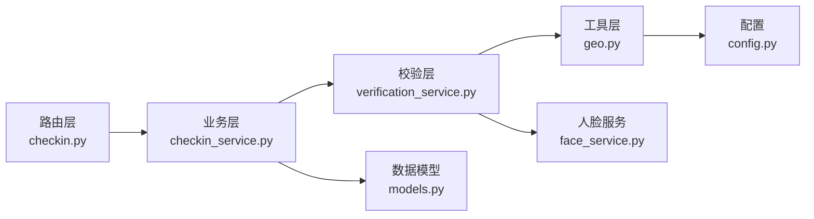

# 地理位置一致性验证

<cite>
**本文引用的文件**   
- [geo.py](file://summer-homework-checkin/backend/app/utils/geo.py)
- [config.py](file://summer-homework-checkin/backend/app/config.py)
- [verification_service.py](file://summer-homework-checkin/backend/app/services/verification_service.py)
- [checkin_service.py](file://summer-homework-checkin/backend/app/services/checkin_service.py)
- [checkin.py](file://summer-homework-checkin/backend/app/routers/checkin.py)
- [models.py](file://summer-homework-checkin/backend/app/models.py)
</cite>

## 目录
1. [简介](#简介)
2. [项目结构](#项目结构)
3. [核心组件](#核心组件)
4. [架构总览](#架构总览)
5. [详细组件分析](#详细组件分析)
6. [依赖关系分析](#依赖关系分析)
7. [性能与精度考量](#性能与精度考量)
8. [故障排查指南](#故障排查指南)
9. [结论](#结论)
10. [附录](#附录)

## 简介
本模块聚焦于“暑假作业打卡”系统中的地理位置一致性验证能力，围绕以下目标展开：
- GPS坐标校验算法：经纬度有效性、坐标精度检查、地理围栏设置。
- 距离计算：Haversine公式的实现原理与精度控制。
- is_far_from_home函数工作机制：阈值配置、边界情况处理与异常场景应对。
- 地理位置伪造防护策略：GPS模拟检测、位置漂移过滤等安全措施建议。

该模块通过后端服务在打卡流程中实时比对用户当前提交的位置与其常用位置（home_lat/home_lng），结合可配置的阈值进行风险标记，并持久化到打卡记录中供审核与追溯。

## 项目结构
与地理位置一致性相关的代码主要分布在以下文件中：
- 工具层：geo.py 提供 Haversine 距离计算与远端判定逻辑。
- 配置层：config.py 提供 GEO_THRESHOLD_METERS 等关键参数。
- 服务层：verification_service.py 将图像校验、人脸比对与地理位置一致性整合为一次综合校验。
- 业务层：checkin_service.py 在创建打卡记录时调用综合校验，并将结果落库。
- 路由层：checkin.py 暴露打卡接口，接收前端提交的 location_lat/location_lng。
- 数据模型：models.py 定义 User.home_lat/home_lng 与 CheckIn.geo_distance/geo_flag 等字段。

图表来源
- [checkin.py:17-37](file://summer-homework-checkin/backend/app/routers/checkin.py#L17-L37)
- [checkin_service.py:64-163](file://summer-homework-checkin/backend/app/services/checkin_service.py#L64-L163)
- [verification_service.py:19-70](file://summer-homework-checkin/backend/app/services/verification_service.py#L19-L70)
- [geo.py:6-23](file://summer-homework-checkin/backend/app/utils/geo.py#L6-L23)
- [config.py:28](file://summer-homework-checkin/backend/app/config.py#L28)
- [models.py:23-24](file://summer-homework-checkin/backend/app/models.py#L23-L24)
- [models.py:84-85](file://summer-homework-checkin/backend/app/models.py#L84-L85)

章节来源
- [checkin.py:17-37](file://summer-homework-checkin/backend/app/routers/checkin.py#L17-L37)
- [checkin_service.py:64-163](file://summer-homework-checkin/backend/app/services/checkin_service.py#L64-L163)
- [verification_service.py:19-70](file://summer-homework-checkin/backend/app/services/verification_service.py#L19-L70)
- [geo.py:6-23](file://summer-homework-checkin/backend/app/utils/geo.py#L6-L23)
- [config.py:28](file://summer-homework-checkin/backend/app/config.py#L28)
- [models.py:23-24](file://summer-homework-checkin/backend/app/models.py#L23-L24)
- [models.py:84-85](file://summer-homework-checkin/backend/app/models.py#L84-L85)

## 核心组件
- 地理工具 geo.py
  - haversine(lat1, lng1, lat2, lng2): 基于球面三角学计算两点间距离（米）。任一输入为 None 时返回 None。
  - is_far_from_home(home_lat, home_lng, cur_lat, cur_lng): 比较距离与阈值，返回是否“远离常用位置”。
- 配置 config.py
  - GEO_THRESHOLD_METERS: 默认 1500 米，可通过环境变量覆盖。
- 综合校验 verification_service.py
  - verify_checkin(user, photo_bytes, lat, lng): 执行照片合规校验、地理位置一致性、人脸 1:1 比对，并输出 scene_check 与 risk。
- 打卡服务 checkin_service.py
  - create_checkin(...): 保存照片、调用综合校验、写入 CheckIn 记录，并根据人脸策略决定是否拒绝。
- 路由 checkin.py
  - POST /api/checkin: 接收 location_lat/location_lng 表单字段，转发至服务层。
- 数据模型 models.py
  - User.home_lat/home_lng: 常用位置坐标。
  - CheckIn.geo_distance/geo_flag: 距离与是否超阈标记。

章节来源
- [geo.py:6-23](file://summer-homework-checkin/backend/app/utils/geo.py#L6-L23)
- [config.py:28](file://summer-homework-checkin/backend/app/config.py#L28)
- [verification_service.py:19-70](file://summer-homework-checkin/backend/app/services/verification_service.py#L19-L70)
- [checkin_service.py:64-163](file://summer-homework-checkin/backend/app/services/checkin_service.py#L64-L163)
- [checkin.py:17-37](file://summer-homework-checkin/backend/app/routers/checkin.py#L17-L37)
- [models.py:23-24](file://summer-homework-checkin/backend/app/models.py#L23-L24)
- [models.py:84-85](file://summer-homework-checkin/backend/app/models.py#L84-L85)

## 架构总览
下图展示了从客户端提交打卡请求到地理位置一致性校验落库的完整链路。

图表来源
- [checkin.py:17-37](file://summer-homework-checkin/backend/app/routers/checkin.py#L17-L37)
- [checkin_service.py:64-163](file://summer-homework-checkin/backend/app/services/checkin_service.py#L64-L163)
- [verification_service.py:19-70](file://summer-homework-checkin/backend/app/services/verification_service.py#L19-L70)
- [geo.py:6-23](file://summer-homework-checkin/backend/app/utils/geo.py#L6-L23)
- [models.py:84-85](file://summer-homework-checkin/backend/app/models.py#L84-L85)

## 详细组件分析

### 地理工具 geo.py
- haversine 实现要点
  - 使用地球半径 r=6371000.0 米，按弧度转换后计算中心角，再换算为距离。
  - 任一坐标为 None 时直接返回 None，避免后续比较出错。
- is_far_from_home 机制
  - 先计算距离；若为 None 则视为未超出阈值（返回 False）。
  - 否则与 GEO_THRESHOLD_METERS 比较，大于阈值即返回 True。

图表来源
- [geo.py:6-23](file://summer-homework-checkin/backend/app/utils/geo.py#L6-L23)
- [config.py:28](file://summer-homework-checkin/backend/app/config.py#L28)

章节来源
- [geo.py:6-23](file://summer-homework-checkin/backend/app/utils/geo.py#L6-L23)
- [config.py:28](file://summer-homework-checkin/backend/app/config.py#L28)

### 配置项 config.py
- GEO_THRESHOLD_METERS
  - 默认 1500 米，支持通过环境变量覆盖。
  - 用于判断“是否远离常用位置”，影响 geo_flag 与风险等级。

章节来源
- [config.py:28](file://summer-homework-checkin/backend/app/config.py#L28)

### 综合校验 verification_service.py
- 地理位置一致性集成
  - 当 user.home_lat/home_lng 与提交 lat/lng 均非空时，计算距离并设置 geo_distance。
  - 调用 is_far_from_home 得到 geo_flag。
- 风险判定
  - 若图片不合规 -> 高风险。
  - 若 geo_flag 为真 -> 中等风险。
  - 否则 -> 低风险。
  - 已采集人脸且人脸不通过 -> 高风险；模型不可用 -> 中等风险。

图表来源
- [verification_service.py:19-70](file://summer-homework-checkin/backend/app/services/verification_service.py#L19-L70)
- [geo.py:6-23](file://summer-homework-checkin/backend/app/utils/geo.py#L6-L23)

章节来源
- [verification_service.py:19-70](file://summer-homework-checkin/backend/app/services/verification_service.py#L19-L70)

### 打卡服务 checkin_service.py
- 创建打卡流程中的地理位置处理
  - 保存照片与凭证后，调用 verify_checkin 获取 geo_distance/geo_flag。
  - 将 geo_distance/geo_flag 写入 CheckIn 记录。
  - 根据人脸策略决定是否拒绝打卡。
- 通知与审计
  - 若 geo_flag 为真，会在家长通知中提示“位置较远”。

章节来源
- [checkin_service.py:64-163](file://summer-homework-checkin/backend/app/services/checkin_service.py#L64-L163)

### 路由 checkin.py
- 接口定义
  - POST /api/checkin 接收 location_lat/location_lng 作为表单字段。
  - 仅学生角色可打卡。
- 转发至服务层
  - 将位置参数传递给 create_checkin，由服务层完成校验与落库。

章节来源
- [checkin.py:17-37](file://summer-homework-checkin/backend/app/routers/checkin.py#L17-L37)

### 数据模型 models.py
- 常用位置
  - User.home_lat/home_lng: 存储用户的常用位置坐标。
- 打卡记录
  - CheckIn.geo_distance/geo_flag: 记录距常用位置的距离与是否超阈。

章节来源
- [models.py:23-24](file://summer-homework-checkin/backend/app/models.py#L23-L24)
- [models.py:84-85](file://summer-homework-checkin/backend/app/models.py#L84-L85)

## 依赖关系分析
- 组件耦合
  - verification_service 依赖 geo 工具与人脸服务，负责组合校验。
  - checkin_service 依赖 verification_service，负责业务规则与持久化。
  - 路由层仅做参数透传与权限校验。
- 外部依赖
  - 配置来自 config.py，GEO_THRESHOLD_METERS 决定阈值。
  - 数据库字段用于持久化校验结果。

图表来源
- [checkin.py:17-37](file://summer-homework-checkin/backend/app/routers/checkin.py#L17-L37)
- [checkin_service.py:64-163](file://summer-homework-checkin/backend/app/services/checkin_service.py#L64-L163)
- [verification_service.py:19-70](file://summer-homework-checkin/backend/app/services/verification_service.py#L19-L70)
- [geo.py:6-23](file://summer-homework-checkin/backend/app/utils/geo.py#L6-L23)
- [config.py:28](file://summer-homework-checkin/backend/app/config.py#L28)
- [models.py:84-85](file://summer-homework-checkin/backend/app/models.py#L84-L85)

章节来源
- [checkin.py:17-37](file://summer-homework-checkin/backend/app/routers/checkin.py#L17-L37)
- [checkin_service.py:64-163](file://summer-homework-checkin/backend/app/services/checkin_service.py#L64-L163)
- [verification_service.py:19-70](file://summer-homework-checkin/backend/app/services/verification_service.py#L19-L70)
- [geo.py:6-23](file://summer-homework-checkin/backend/app/utils/geo.py#L6-L23)
- [config.py:28](file://summer-homework-checkin/backend/app/config.py#L28)
- [models.py:84-85](file://summer-homework-checkin/backend/app/models.py#L84-L85)

## 性能与精度考量
- Haversine 公式精度
  - 采用球面近似，误差通常在数百米以内，适合校园级围栏与日常打卡场景。
  - 对极短距离（同点）或跨经度 180° 的情况仍稳定，但极端高纬度区域误差略增。
- 数值稳定性
  - 输入为浮点数，注意 NaN/Inf 的潜在问题；当前实现未显式处理，建议在调用前增加输入合法性校验。
- 性能特征
  - 单次距离计算为常数时间 O(1)，开销极低，适合高频打卡场景。
- 阈值调优
  - GEO_THRESHOLD_METERS 默认 1500 米，可根据学校规模与定位精度调整。
  - 城市密集区可适当降低阈值；郊区或信号弱环境可适当提高阈值。

[本节为通用指导，无需列出具体文件来源]

## 故障排查指南
- 常见问题与定位
  - 坐标为空或未传入
    - 现象：geo_distance 为 None，geo_flag 为 False。
    - 原因：user.home_lat/home_lng 或提交 lat/lng 存在 None。
    - 处理：确保前端正确上报设备位置；服务端在必要场景下拒绝或降级处理。
  - 距离异常大
    - 现象：geo_flag 为 True，风险等级升高。
    - 原因：定位漂移、GPS 模拟、网络定位偏差。
    - 处理：结合人脸 1:1 比对与人工复核；必要时要求重新打卡。
  - 阈值不合理
    - 现象：误报或漏报较多。
    - 处理：调整 GEO_THRESHOLD_METERS，并结合历史数据评估。
- 日志与追踪
  - 查看 CheckIn 记录的 geo_distance/geo_flag/scene_check/risk 字段，辅助定位问题。
  - 家长通知中包含“位置较远”提示，便于快速识别异常打卡。

章节来源
- [verification_service.py:34-38](file://summer-homework-checkin/backend/app/services/verification_service.py#L34-L38)
- [checkin_service.py:148-161](file://summer-homework-checkin/backend/app/services/checkin_service.py#L148-L161)
- [models.py:84-85](file://summer-homework-checkin/backend/app/models.py#L84-L85)

## 结论
本模块以轻量、可配置的方式实现了地理位置一致性验证，核心包括：
- 基于 Haversine 的距离计算与阈值判定。
- 在综合校验服务中与图像真实性、人脸 1:1 比对协同工作，形成多因子风控。
- 通过配置与环境变量灵活调整阈值，适配不同部署环境。
建议在生产环境中进一步引入坐标有效性校验、GPS 模拟检测与位置漂移过滤等增强措施，以提升整体防作弊能力。

[本节为总结性内容，无需列出具体文件来源]

## 附录

### 经纬度有效性验证与坐标精度检查（建议实现）
- 范围校验
  - 纬度 [-90, 90]，经度 [-180, 180]。
- 精度检查
  - 小数位数限制（如保留 6 位，约 0.1 米精度）。
  - 去噪与平滑：滑动窗口均值/中值滤波，剔除突变点。
- 边界处理
  - 跨 180° 经度时的最短路径计算与异常值过滤。
- 数据来源可信度
  - 区分 GPS/Wi-Fi/基站定位，结合信号强度与更新时间戳进行可信度评分。

[本节为概念性建议，无需列出具体文件来源]

### 地理围栏设置（建议实现）
- 多边形围栏
  - 使用射线法判断点是否在多边形内，适用于校园/教学楼等复杂边界。
- 圆形围栏
  - 基于圆心与半径的快速包含判断，适合简单场景。
- 动态围栏
  - 根据学期/活动周期动态调整围栏范围。

[本节为概念性建议，无需列出具体文件来源]

### 地理位置伪造防护策略（建议实现）
- GPS 模拟检测
  - 检测系统定位来源（gps/network）、定位提供者变更频率、时间戳连续性。
  - 对比设备传感器数据（加速度计、陀螺仪）与移动轨迹的一致性。
- 位置漂移过滤
  - 速度上限约束：单位时间内最大移动距离。
  - 抖动抑制：时间窗内多次采样取稳健估计（中位数/加权平均）。
- 多源融合
  - 结合 Wi-Fi SSID/BSSID、基站 ID、IP 地理位置等多源信息进行交叉验证。
- 行为画像
  - 建立用户历史位置分布模型，对异常偏离进行预警与人工复核。

[本节为概念性建议，无需列出具体文件来源]