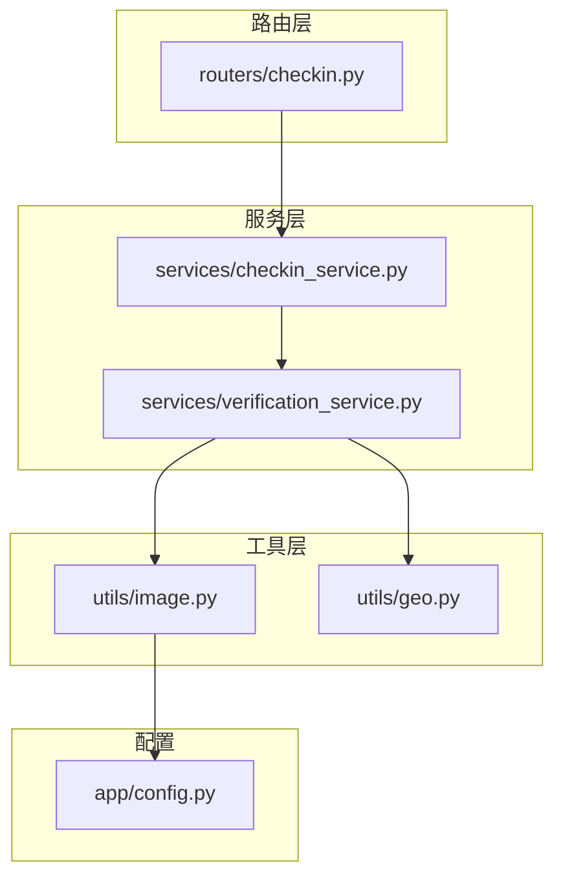
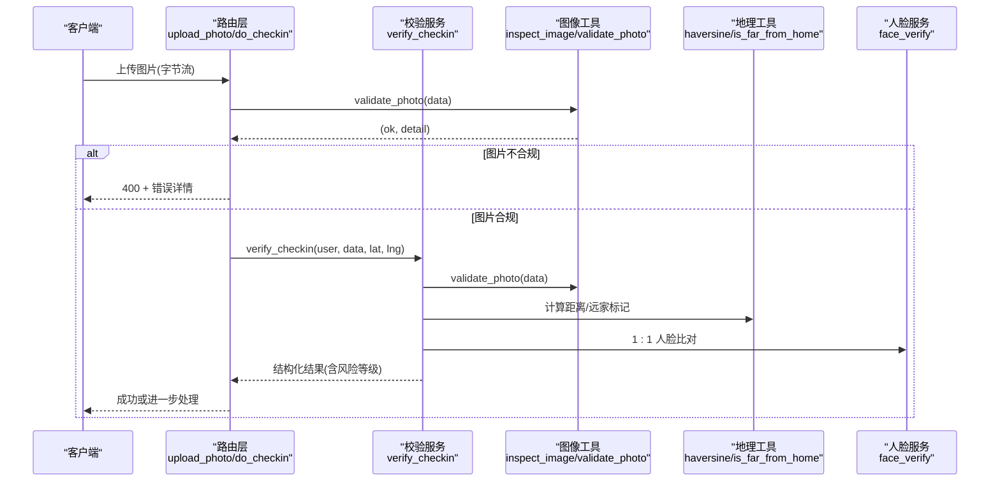
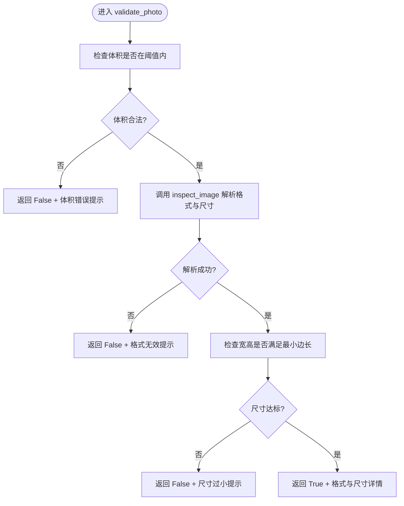
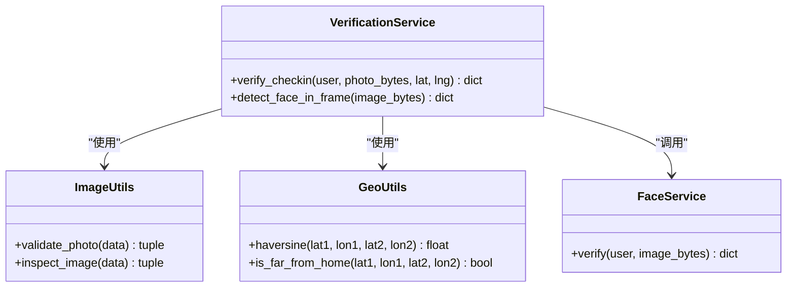
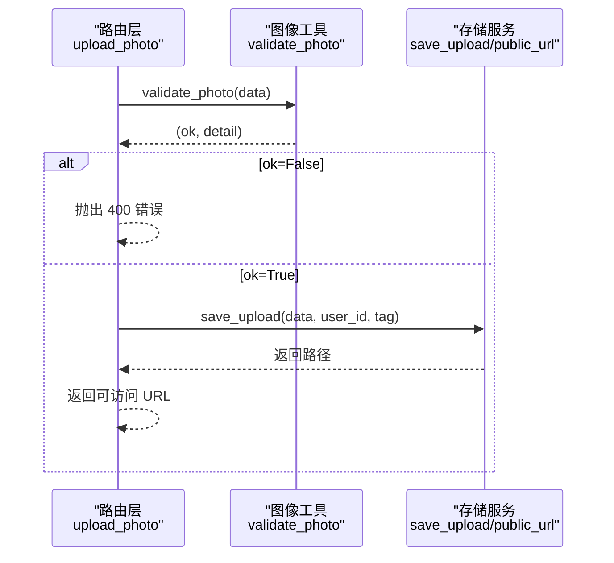
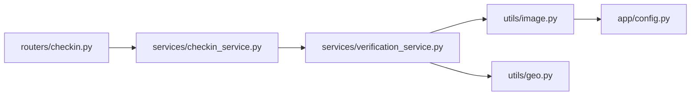

# 照片真实性检测

<cite>
**本文引用的文件**
- [image.py](file://summer-homework-checkin/backend/app/utils/image.py)
- [config.py](file://summer-homework-checkin/backend/app/config.py)
- [verification_service.py](file://summer-homework-checkin/backend/app/services/verification_service.py)
- [checkin_service.py](file://summer-homework-checkin/backend/app/services/checkin_service.py)
- [checkin.py](file://summer-homework-checkin/backend/app/routers/checkin.py)
</cite>

## 目录
1. [简介](#简介)
2. [项目结构](#项目结构)
3. [核心组件](#核心组件)
4. [架构总览](#架构总览)
5. [详细组件分析](#详细组件分析)
6. [依赖关系分析](#依赖关系分析)
7. [性能考量](#性能考量)
8. [故障排查指南](#故障排查指南)
9. [结论](#结论)
10. [附录](#附录)

## 简介
本模块聚焦于“照片真实性检测”，围绕图像质量分析与基础合规校验，提供轻量、无外部依赖的图像解析与验证能力。当前实现覆盖：
- 图片尺寸验证（最小边长）
- 文件大小检查（最小/最大体积）
- 格式校验（JPEG/PNG）
- 与打卡流程的集成（上传、综合校验、风险判定）

说明：
- 元数据验证机制（如 EXIF 信息提取、拍摄时间验证、设备信息分析等防篡改措施）在当前仓库中未实现，属于可扩展方向，本文在“扩展建议”章节给出落地方案与注意事项。

## 项目结构
与照片真实性检测相关的代码主要位于后端应用 utils 与服务层之间，路由层负责将前端上传的图片交由服务层进行校验与处理。

图表来源
- [checkin.py:1-80](file://summer-homework-checkin/backend/app/routers/checkin.py#L1-L80)
- [checkin_service.py:64-163](file://summer-homework-checkin/backend/app/services/checkin_service.py#L64-L163)
- [verification_service.py:19-71](file://summer-homework-checkin/backend/app/services/verification_service.py#L19-L71)
- [image.py:34-61](file://summer-homework-checkin/backend/app/utils/image.py#L34-L61)
- [config.py:30-32](file://summer-homework-checkin/backend/app/config.py#L30-L32)

章节来源
- [checkin.py:1-80](file://summer-homework-checkin/backend/app/routers/checkin.py#L1-L80)
- [checkin_service.py:64-163](file://summer-homework-checkin/backend/app/services/checkin_service.py#L64-L163)
- [verification_service.py:19-71](file://summer-homework-checkin/backend/app/services/verification_service.py#L19-L71)
- [image.py:34-61](file://summer-homework-checkin/backend/app/utils/image.py#L34-L61)
- [config.py:30-32](file://summer-homework-checkin/backend/app/config.py#L30-L32)

## 核心组件
- 图像解析与校验工具
  - inspect_image(data): 识别 JPEG/PNG 并返回是否有效及宽高、格式。
  - validate_photo(data): 基于配置进行体积与尺寸门槛校验，过滤占位图/缩略图。
- 配置常量
  - MIN_PHOTO_BYTES、MIN_PHOTO_DIM、PHOTO_MAX_BYTES：控制最小体积、最小边长、最大体积。
- 校验编排服务
  - verification_service.verify_checkin(user, photo_bytes, lat, lng): 组合图像真实性、地理位置一致性、人脸 1:1 比对，输出结构化结果与风险等级。
- 业务入口
  - routers.checkin.upload_photo: 通用图片上传，调用 validate_photo 做前置校验。
  - services.checkin_service.create_checkin: 创建打卡记录，复用 _validate_photo_size 与 verify_checkin 完成全流程校验。

章节来源
- [image.py:34-61](file://summer-homework-checkin/backend/app/utils/image.py#L34-L61)
- [config.py:30-32](file://summer-homework-checkin/backend/app/config.py#L30-L32)
- [verification_service.py:19-71](file://summer-homework-checkin/backend/app/services/verification_service.py#L19-L71)
- [checkin.py:40-52](file://summer-homework-checkin/backend/app/routers/checkin.py#L40-L52)
- [checkin_service.py:64-163](file://summer-homework-checkin/backend/app/services/checkin_service.py#L64-L163)

## 架构总览
下图展示了从前端上传图片到最终风险判定的完整链路，重点体现图像真实性检测在整体流程中的位置与作用。

图表来源
- [checkin.py:40-52](file://summer-homework-checkin/backend/app/routers/checkin.py#L40-L52)
- [checkin_service.py:64-163](file://summer-homework-checkin/backend/app/services/checkin_service.py#L64-L163)
- [verification_service.py:19-71](file://summer-homework-checkin/backend/app/services/verification_service.py#L19-L71)
- [image.py:34-61](file://summer-homework-checkin/backend/app/utils/image.py#L34-L61)

## 详细组件分析

### 图像解析与校验工具（utils/image.py）
- 设计要点
  - 零依赖解析：仅通过二进制头与固定偏移读取 JPEG/PNG 尺寸，避免引入重型图像处理库。
  - 快速失败：对空数据、非受支持格式、无法解析尺寸的图像直接返回失败。
- 关键函数
  - inspect_image(data): 返回 (ok, width, height, fmt)。用于判断是否为有效 JPEG/PNG 并获取尺寸。
  - validate_photo(data): 结合配置进行体积与尺寸门槛校验，返回 (ok, detail)。
- 复杂度与性能
  - 时间复杂度：O(N)，N 为图片字节长度；实际扫描路径短，且遇到 SOF 段即返回。
  - 空间复杂度：O(1)，无需额外内存分配。
- 异常与边界
  - 空输入、过短数据、非法头部均安全返回 False。
  - 对于损坏但头部合法的图像，解析失败时返回 False，不会抛出异常。

图表来源
- [image.py:51-61](file://summer-homework-checkin/backend/app/utils/image.py#L51-L61)
- [image.py:34-48](file://summer-homework-checkin/backend/app/utils/image.py#L34-L48)

章节来源
- [image.py:34-61](file://summer-homework-checkin/backend/app/utils/image.py#L34-L61)

### 配置项（app/config.py）
- 关键常量
  - MIN_PHOTO_BYTES：最小体积（默认 5KB），用于过滤占位图。
  - MIN_PHOTO_DIM：最小边长（默认 200），用于过滤缩略图。
  - PHOTO_MAX_BYTES：最大体积（默认 10MB），防止超大文件攻击。
- 扩展点
  - 可通过环境变量调整阈值，便于不同环境差异化策略。

章节来源
- [config.py:30-32](file://summer-homework-checkin/backend/app/config.py#L30-L32)

### 校验编排服务（services/verification_service.py）
- 职责
  - 组合图像真实性、地理位置一致性与人脸 1:1 比对，输出结构化结果与风险等级。
- 关键流程
  - 调用 validate_photo 完成图像真实性初筛。
  - 计算用户常用位置与当前位置的距离，标记是否“远离常驻地”。
  - 调用 face_verify 进行 1:1 人脸比对，捕获异常降级为“模型不可用”。
  - 根据各子项结果综合判定 scene_check 与 risk。
- 异常处理
  - 人脸识别服务异常被 try-except 包裹，返回 model_unavailable 状态，避免阻断主流程。

图表来源
- [verification_service.py:19-71](file://summer-homework-checkin/backend/app/services/verification_service.py#L19-L71)
- [image.py:34-61](file://summer-homework-checkin/backend/app/utils/image.py#L34-L61)

章节来源
- [verification_service.py:19-71](file://summer-homework-checkin/backend/app/services/verification_service.py#L19-L71)

### 业务入口与集成（routers/checkin.py 与 services/checkin_service.py）
- 路由层 upload_photo
  - 接收图片字节流，调用 validate_photo 进行前置校验，失败则返回 400。
- 服务层 create_checkin
  - 内部复用 _validate_photo_size 与 verify_checkin，完成图像真实性、补卡规则、存储、通知等全链路逻辑。
  - 当已采集底图且人脸不通过时，按策略拒绝打卡或降级为待复核。

图表来源
- [checkin.py:40-52](file://summer-homework-checkin/backend/app/routers/checkin.py#L40-L52)
- [image.py:51-61](file://summer-homework-checkin/backend/app/utils/image.py#L51-L61)

章节来源
- [checkin.py:40-52](file://summer-homework-checkin/backend/app/routers/checkin.py#L40-L52)
- [checkin_service.py:64-163](file://summer-homework-checkin/backend/app/services/checkin_service.py#L64-L163)

## 依赖关系分析
- 组件耦合
  - 路由层依赖服务层；服务层依赖工具层与配置；工具层仅依赖配置。
- 外部依赖
  - 当前图像解析不依赖第三方库，降低部署成本与攻击面。
  - 地理位置与人脸能力作为可选扩展，当前以本地计算与预留接口为主。

图表来源
- [checkin.py:1-80](file://summer-homework-checkin/backend/app/routers/checkin.py#L1-L80)
- [checkin_service.py:64-163](file://summer-homework-checkin/backend/app/services/checkin_service.py#L64-L163)
- [verification_service.py:19-71](file://summer-homework-checkin/backend/app/services/verification_service.py#L19-L71)
- [image.py:34-61](file://summer-homework-checkin/backend/app/utils/image.py#L34-L61)
- [config.py:30-32](file://summer-homework-checkin/backend/app/config.py#L30-L32)

章节来源
- [checkin.py:1-80](file://summer-homework-checkin/backend/app/routers/checkin.py#L1-L80)
- [checkin_service.py:64-163](file://summer-homework-checkin/backend/app/services/checkin_service.py#L64-L163)
- [verification_service.py:19-71](file://summer-homework-checkin/backend/app/services/verification_service.py#L19-L71)
- [image.py:34-61](file://summer-homework-checkin/backend/app/utils/image.py#L34-L61)
- [config.py:30-32](file://summer-homework-checkin/backend/app/config.py#L30-L32)

## 性能考量
- 零依赖解析的优势
  - 避免加载大型图像处理库，减少启动时间与内存占用。
  - 仅扫描必要头部与标记段，解析开销低。
- 建议优化
  - 并发上传场景下，可对 validate_photo 增加缓存（例如基于前 N 字节哈希的快速命中）。
  - 对超大文件提前截断，避免不必要的扫描。
  - 将图像解析与后续 AI 推理解耦，采用异步队列处理耗时任务。

[本节为通用性能建议，不涉及具体文件分析]

## 故障排查指南
- 常见错误与定位
  - 体积不符合要求：检查 MIN_PHOTO_BYTES 与 PHOTO_MAX_BYTES 配置，确认上传文件大小。
  - 不是有效的 JPEG/PNG 图像：确认文件头是否正确，是否存在重命名伪装。
  - 尺寸过小：检查 MIN_PHOTO_DIM 配置，确认是否为缩略图或占位图。
  - 人脸识别服务不可用：查看 verify_checkin 中 face 字段 status 是否为 model_unavailable，检查相关依赖与健康检查。
- 日志与调试
  - 在路由层与服务层增加请求 ID 与关键步骤日志，便于追踪问题。
  - 对异常分支统一收集错误码与消息，便于前端展示与告警。

章节来源
- [verification_service.py:41-46](file://summer-homework-checkin/backend/app/services/verification_service.py#L41-L46)
- [checkin_service.py:116-123](file://summer-homework-checkin/backend/app/services/checkin_service.py#L116-L123)

## 结论
当前照片真实性检测模块以轻量、无依赖的方式实现了图像体积、格式与尺寸的基础校验，并与打卡流程深度集成，形成“图像真实性 + 地理位置一致性 + 人脸 1:1 比对”的综合风控体系。该实现具备良好扩展性，可在不改变现有接口的前提下逐步增强元数据验证与更复杂的图像取证能力。

[本节为总结性内容，不涉及具体文件分析]

## 附录

### 错误码与返回约定
- 路由层上传接口
  - 400：图片不合规（由 validate_photo 返回的错误详情构成）。
- 服务层
  - 503：人脸识别服务暂不可用（当已采集底图且强制模式开启时）。
- 结构化结果字段（来自 verify_checkin）
  - photo_ok、photo_detail：图像真实性校验结果。
  - geo_distance、geo_flag：地理位置一致性结果。
  - face.status、face.match、face.message：人脸 1:1 比对结果。
  - scene_check、risk：综合风险等级。

章节来源
- [checkin.py:47-52](file://summer-homework-checkin/backend/app/routers/checkin.py#L47-L52)
- [checkin_service.py:116-123](file://summer-homework-checkin/backend/app/services/checkin_service.py#L116-L123)
- [verification_service.py:19-71](file://summer-homework-checkin/backend/app/services/verification_service.py#L19-L71)

### 常见伪造手段与防护措施
- 占位图/缩略图替换
  - 防护：最小体积与最小边长双重门槛。
- 格式伪装（重命名非图像为 jpg/png）
  - 防护：基于文件头的严格格式校验。
- 裁剪/缩放伪造清晰度
  - 防护：最小边长限制，必要时引入清晰度指标（如边缘能量、锐度）作为扩展。
- 合成/拼接图
  - 防护：引入噪声一致性、压缩痕迹分析、EXIF 完整性校验（见扩展建议）。
- 时间戳篡改
  - 防护：EXIF 时间一致性校验、服务器时间对比、多源时间交叉验证（见扩展建议）。

[本节为概念性内容，不涉及具体文件分析]

### 元数据验证机制（扩展建议）
- 目标
  - 提升防篡改能力，识别经过编辑或合成的图像。
- 建议实现
  - EXIF 信息提取：读取相机型号、镜头、焦距、ISO、快门速度、白平衡、GPS 坐标、拍摄时间等。
  - 拍摄时间验证：与服务器时间、地理位置时间戳进行一致性校验。
  - 设备信息分析：识别设备指纹、软件版本、编辑痕迹（如 Photoshop、GIMP 写入的元数据）。
  - 完整性校验：校验 EXIF 块完整性、重复字段冲突、缺失关键字段。
- 技术选型
  - Python 生态：exifread、Pillow、pyexiv2；注意生产环境依赖管理与资源消耗。
  - 性能优化：仅在高风险样本上启用深度元数据分析；对常规样本走快速路径。
- 风险控制
  - 元数据缺失不等于伪造，需结合其他信号（如图像噪声、压缩痕迹）综合判定。
  - 对移动端截图、社交平台二次压缩导致的元数据丢失做好容错。

[本节为概念性内容，不涉及具体文件分析]