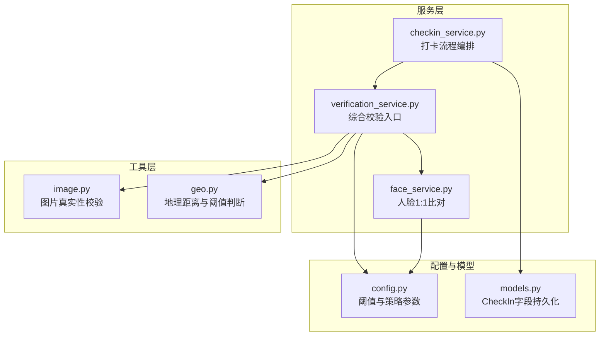
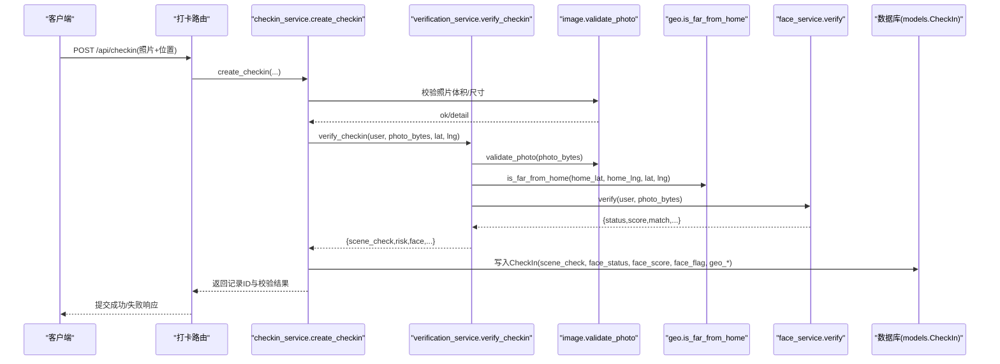
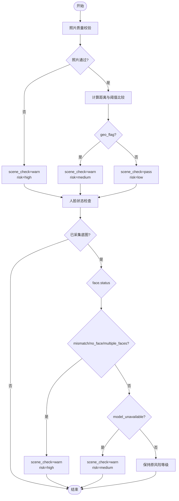
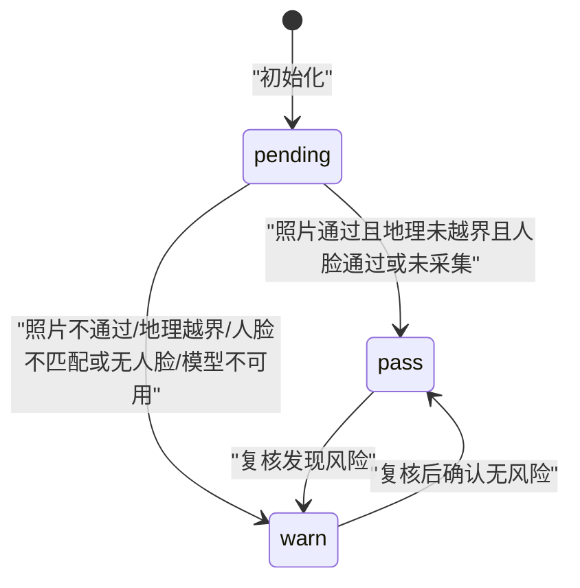
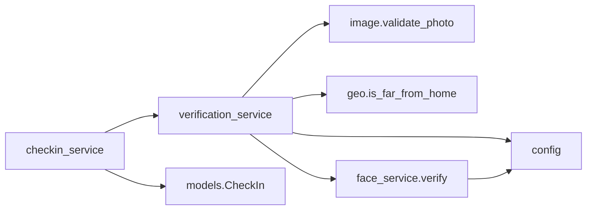

# 综合场景合规判定

<cite>
**本文引用的文件**   
- [verification_service.py](file://summer-homework-checkin/backend/app/services/verification_service.py)
- [face_service.py](file://summer-homework-checkin/backend/app/services/face_service.py)
- [image.py](file://summer-homework-checkin/backend/app/utils/image.py)
- [geo.py](file://summer-homework-checkin/backend/app/utils/geo.py)
- [config.py](file://summer-homework-checkin/backend/app/config.py)
- [models.py](file://summer-homework-checkin/backend/app/models.py)
- [checkin_service.py](file://summer-homework-checkin/backend/app/services/checkin_service.py)
- [README.md](file://summer-homework-checkin/README.md)
</cite>

## 目录
1. [引言](#引言)
2. [项目结构](#项目结构)
3. [核心组件](#核心组件)
4. [架构总览](#架构总览)
5. [详细组件分析](#详细组件分析)
6. [依赖关系分析](#依赖关系分析)
7. [性能与可扩展性](#性能与可扩展性)
8. [故障排查指南](#故障排查指南)
9. [结论](#结论)
10. [附录：调优与A/B测试策略](#附录：调优与ab测试策略)

## 引言
本模块聚焦“综合场景合规判定”，围绕多因子风险评估（照片质量、地理位置一致性、人脸识别结果）进行权重化决策，输出 scene_check 状态机（pass/warn/fail）与风险等级（low/medium/high），并驱动后续业务处理策略。同时提供行为模式分析思路（打卡时间规律、频率异常等）以及模型调优与 A/B 测试方法，帮助在真实生产环境中持续优化风控效果与用户体验。

## 项目结构
与场景合规判定相关的后端代码位于 summer-homework-checkin/backend/app 下，关键路径如下：
- 服务层：services/verification_service.py、services/face_service.py、services/checkin_service.py
- 工具层：utils/image.py、utils/geo.py
- 配置层：config.py
- 数据模型：models.py
- 文档说明：README.md

图表来源
- [verification_service.py:19-70](file://summer-homework-checkin/backend/app/services/verification_service.py#L19-L70)
- [face_service.py:99-125](file://summer-homework-checkin/backend/app/services/face_service.py#L99-L125)
- [image.py:51-61](file://summer-homework-checkin/backend/app/utils/image.py#L51-L61)
- [geo.py:19-24](file://summer-homework-checkin/backend/app/utils/geo.py#L19-L24)
- [config.py:28-49](file://summer-homework-checkin/backend/app/config.py#L28-L49)
- [models.py:74-93](file://summer-homework-checkin/backend/app/models.py#L74-L93)

章节来源
- [README.md:97-109](file://summer-homework-checkin/README.md#L97-L109)

## 核心组件
- 综合校验服务 verification_service.verify_checkin：聚合照片质量、地理位置、人脸识别三项指标，计算 scene_check 与 risk，并返回结构化结果供上层使用。
- 人脸识别服务 face_service.verify：基于 insightface 的 1:1 本人比对，输出 status/score/match 等字段。
- 图像质量工具 image.validate_photo：对上传照片做体积与尺寸门槛校验，过滤占位图/缩略图。
- 地理工具 geo.is_far_from_home：基于 Haversine 公式计算设备位置与常用位置的距离，结合阈值标记 geo_flag。
- 配置 config：集中管理阈值与策略（如 GEO_THRESHOLD_METERS、FACE_MATCH_THRESHOLD、FACE_MODE_ON_ENROLLED）。
- 数据模型 models.CheckIn：持久化 scene_check、face_status、face_score、face_flag、geo_distance、geo_flag 等字段，支撑后台追溯与报表。

章节来源
- [verification_service.py:19-70](file://summer-homework-checkin/backend/app/services/verification_service.py#L19-L70)
- [face_service.py:99-125](file://summer-homework-checkin/backend/app/services/face_service.py#L99-L125)
- [image.py:51-61](file://summer-homework-checkin/backend/app/utils/image.py#L51-L61)
- [geo.py:19-24](file://summer-homework-checkin/backend/app/utils/geo.py#L19-L24)
- [config.py:28-49](file://summer-homework-checkin/backend/app/config.py#L28-L49)
- [models.py:74-93](file://summer-homework-checkin/backend/app/models.py#L74-L93)

## 架构总览
下图展示一次打卡请求从路由到综合判定的调用链路与数据落库过程。

图表来源
- [checkin_service.py:64-163](file://summer-homework-checkin/backend/app/services/checkin_service.py#L64-L163)
- [verification_service.py:19-70](file://summer-homework-checkin/backend/app/services/verification_service.py#L19-L70)
- [image.py:51-61](file://summer-homework-checkin/backend/app/utils/image.py#L51-L61)
- [geo.py:19-24](file://summer-homework-checkin/backend/app/utils/geo.py#L19-L24)
- [face_service.py:99-125](file://summer-homework-checkin/backend/app/services/face_service.py#L99-L125)
- [models.py:74-93](file://summer-homework-checkin/backend/app/models.py#L74-L93)

## 详细组件分析

### 多因子风险评估算法
- 输入维度
  - 照片质量：validate_photo 返回是否通过及详情（体积、格式、最小边长）。
  - 地理位置：haversine 计算距离，is_far_from_home 对比 GEO_THRESHOLD_METERS 得到 geo_flag。
  - 人脸识别：face_service.verify 返回 status（match/mismatch/no_face/multiple_faces/not_enrolled/model_unavailable）、score、match。
- 综合判定逻辑（当前实现为规则式加权）
  - 若照片不通过：scene_check=warn，risk=high。
  - 否则若 geo_flag=True：scene_check=warn，risk=medium。
  - 否则：scene_check=pass，risk=low。
  - 已采集底图且人脸不通过（mismatch/no_face/multiple_faces）：scene_check=warn，risk=high。
  - 已采集底图但模型不可用（model_unavailable）：scene_check=warn，risk=medium。
- 输出字段
  - scene_check：pass/warn/pending（默认初始值）
  - risk：low/medium/high
  - face.status/score/match、geo_distance/geo_flag、photo_ok/photo_detail

图表来源
- [verification_service.py:19-70](file://summer-homework-checkin/backend/app/services/verification_service.py#L19-L70)
- [image.py:51-61](file://summer-homework-checkin/backend/app/utils/image.py#L51-L61)
- [geo.py:19-24](file://summer-homework-checkin/backend/app/utils/geo.py#L19-L24)
- [face_service.py:99-125](file://summer-homework-checkin/backend/app/services/face_service.py#L99-L125)

章节来源
- [verification_service.py:19-70](file://summer-homework-checkin/backend/app/services/verification_service.py#L19-L70)
- [image.py:51-61](file://summer-homework-checkin/backend/app/utils/image.py#L51-L61)
- [geo.py:19-24](file://summer-homework-checkin/backend/app/utils/geo.py#L19-L24)
- [face_service.py:99-125](file://summer-homework-checkin/backend/app/services/face_service.py#L99-L125)

### 风险等级划分标准与业务处理策略
- low：低风险，通常直接放行进入审核或自动生效流程。
- medium：中风险，建议人工复核或附加提示；在已采集人脸且模型不可用时采用降级策略。
- high：高风险，建议拒绝或强拦截；例如照片不通过、人脸不匹配等。
- 业务联动
  - checkin_service 在创建打卡时，若已采集底图且人脸不通过，会直接拒绝提交；若模型不可用且策略为 enforce，则返回 503 提示重试。
  - 所有判定结果持久化至 CheckIn 的 scene_check、face_status、face_score、face_flag、geo_distance、geo_flag 等字段，便于后台审查与报表统计。

章节来源
- [checkin_service.py:113-123](file://summer-homework-checkin/backend/app/services/checkin_service.py#L113-L123)
- [models.py:74-93](file://summer-homework-checkin/backend/app/models.py#L74-L93)

### scene_check 状态机工作原理
- 状态集合：pass、warn、pending（默认初始值）
- 触发条件与转换
  - pending → pass：照片通过、未超地理阈值、人脸通过或未采集人脸。
  - pending → warn：照片不通过、地理越界、人脸不匹配/无人脸/多人脸、或已采集人脸但模型不可用。
  - fail：当前实现未显式设置 fail，如需可在此基础扩展（例如强制拒绝场景）。
- 转换逻辑要点
  - 先按照片与地理快速定级，再叠加人脸状态修正。
  - 已采集人脸时的特殊处理优先于通用规则。

图表来源
- [verification_service.py:19-70](file://summer-homework-checkin/backend/app/services/verification_service.py#L19-L70)
- [models.py:86](file://summer-homework-checkin/backend/app/models.py#L86)

章节来源
- [verification_service.py:19-70](file://summer-homework-checkin/backend/app/services/verification_service.py#L19-L70)
- [models.py:86](file://summer-homework-checkin/backend/app/models.py#L86)

### 行为模式分析算法（智能风控）
以下为建议的行为模式分析能力（概念性设计，便于后续扩展）：
- 打卡时间规律检测
  - 指标：每日打卡时段分布、周/月周期波动、偏离个人历史均值的标准差。
  - 规则：当某日打卡时间与历史均值偏差超过阈值（如±2小时）且伴随其他风险信号（如地理越界、人脸分数偏低），提升风险等级。
- 频率异常监控
  - 指标：单位时间内打卡次数、补卡比例、连续中断天数。
  - 规则：短时间内多次打卡或补卡比例突增，触发预警并纳入人工复核队列。
- 组合策略
  - 将行为特征作为额外因子加入综合判定，形成“静态规则 + 动态行为”的双轨风控。
  - 输出增强字段：behavior_flag、behavior_score，用于后台可视化与审计。

[本节为概念性设计，不直接分析具体源码文件]

## 依赖关系分析
- 低耦合高内聚
  - verification_service 仅依赖 image、geo、face_service 与 config，职责清晰。
  - face_service 内部封装 insightface 加载与推理细节，对外暴露 enroll/verify/is_available。
  - checkin_service 编排业务流程，调用 verification_service 完成风控判定，并将结果持久化。
- 外部依赖
  - insightface 模型懒加载与 CPU 运行，支持无外网环境降级。
  - 地理计算依赖 math.haversine 与 GEO_THRESHOLD_METERS 配置。
  - 图片解析不依赖 Pillow，轻量高效。

图表来源
- [verification_service.py:19-70](file://summer-homework-checkin/backend/app/services/verification_service.py#L19-L70)
- [face_service.py:99-125](file://summer-homework-checkin/backend/app/services/face_service.py#L99-L125)
- [image.py:51-61](file://summer-homework-checkin/backend/app/utils/image.py#L51-L61)
- [geo.py:19-24](file://summer-homework-checkin/backend/app/utils/geo.py#L19-L24)
- [config.py:28-49](file://summer-homework-checkin/backend/app/config.py#L28-L49)
- [models.py:74-93](file://summer-homework-checkin/backend/app/models.py#L74-L93)
- [checkin_service.py:64-163](file://summer-homework-checkin/backend/app/services/checkin_service.py#L64-L163)

章节来源
- [verification_service.py:19-70](file://summer-homework-checkin/backend/app/services/verification_service.py#L19-L70)
- [face_service.py:99-125](file://summer-homework-checkin/backend/app/services/face_service.py#L99-L125)
- [image.py:51-61](file://summer-homework-checkin/backend/app/utils/image.py#L51-L61)
- [geo.py:19-24](file://summer-homework-checkin/backend/app/utils/geo.py#L19-L24)
- [config.py:28-49](file://summer-homework-checkin/backend/app/config.py#L28-L49)
- [models.py:74-93](file://summer-homework-checkin/backend/app/models.py#L74-L93)
- [checkin_service.py:64-163](file://summer-homework-checkin/backend/app/services/checkin_service.py#L64-L163)

## 性能与可扩展性
- 性能特性
  - 人脸模型懒加载与线程锁保护，避免重复初始化开销。
  - 图片解析不引入重型依赖，降低内存与启动成本。
  - 地理计算为 O(1)，开销极低。
- 可扩展点
  - 将规则式判定升级为可配置权重评分（如照片质量分、地理风险分、人脸相似度分），便于 A/B 测试与灰度发布。
  - 增加行为模式分析模块，输出 behavior_score 参与最终风险决策。
  - 支持 fail 状态与更严格的拦截策略，满足不同运营阶段的风控需求。

[本节为通用指导，不直接分析具体源码文件]

## 故障排查指南
- 常见问题定位
  - 人脸模型不可用：检查 insightface 安装与网络下载权限；查看 face_service.is_available 与健康检查。
  - 人脸不通过：核对 FACE_MATCH_THRESHOLD 阈值与用户底图质量；必要时引导重新采集。
  - 地理越界：确认 home_lat/home_lng 是否正确设置，调整 GEO_THRESHOLD_METERS 以适应实际场景。
  - 照片不通过：检查 MIN_PHOTO_BYTES/MIN_PHOTO_DIM/PHOTO_MAX_BYTES 配置是否符合前端上传规范。
- 日志与追踪
  - 利用 CheckIn 的 face_status、face_score、face_flag、geo_distance、geo_flag、scene_check 字段进行回溯。
  - 在 verification_service 与 face_service 的关键分支添加结构化日志，便于问题复现与归因。

章节来源
- [face_service.py:128-132](file://summer-homework-checkin/backend/app/services/face_service.py#L128-L132)
- [models.py:74-93](file://summer-homework-checkin/backend/app/models.py#L74-L93)
- [config.py:28-49](file://summer-homework-checkin/backend/app/config.py#L28-L49)

## 结论
本模块以“照片质量 + 地理位置 + 人脸识别”的多因子综合判定为核心，通过清晰的规则与可配置阈值，实现了稳健的场景合规控制。配合 CheckIn 模型的持久化字段，系统具备完善的审计与报表能力。建议在后续迭代中引入行为模式分析与可配置权重评分，并结合 A/B 测试持续优化风控精度与用户体验。

[本节为总结性内容，不直接分析具体源码文件]

## 附录：调优与A/B测试策略
- 模型与阈值调优
  - FACE_MATCH_THRESHOLD：逐步上调以提升严格度，观察误拒率与漏检率变化。
  - GEO_THRESHOLD_METERS：根据学生活动范围与家庭住址稳定性进行校准。
  - MIN_PHOTO_DIM/MIN_PHOTO_BYTES：平衡安全与用户体验，避免过度限制导致频繁失败。
- 策略灰度与A/B测试
  - 将判定逻辑拆分为“规则引擎 + 评分器”，通过环境变量或配置中心切换不同版本。
  - 实验组与对照组并行运行，评估通过率、人工复核量、家长投诉率等指标。
  - 引入行为模式分析作为增量因子，逐步验证其对整体风险的增益。
- 监控与回滚
  - 建立关键指标看板（通过率、高风险占比、人脸不可用率、地理越界率）。
  - 设定回滚阈值，一旦新策略显著恶化体验，立即切回稳定版本。

[本节为方法论指导，不直接分析具体源码文件]