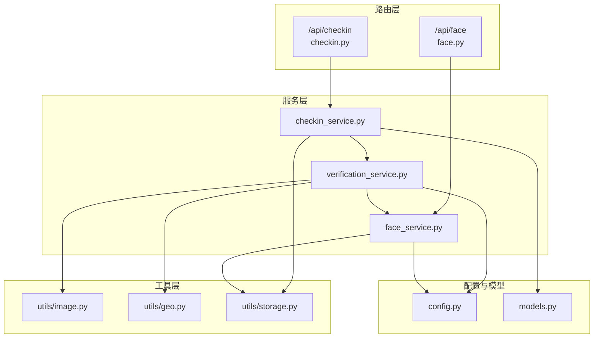
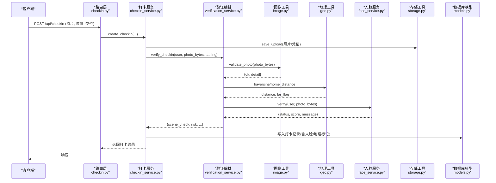
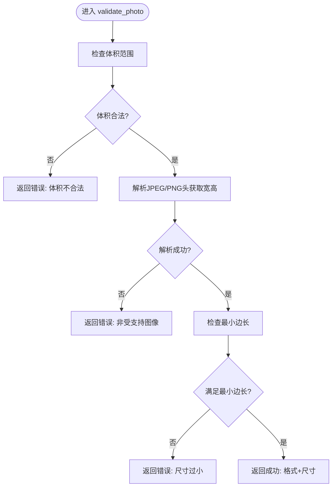
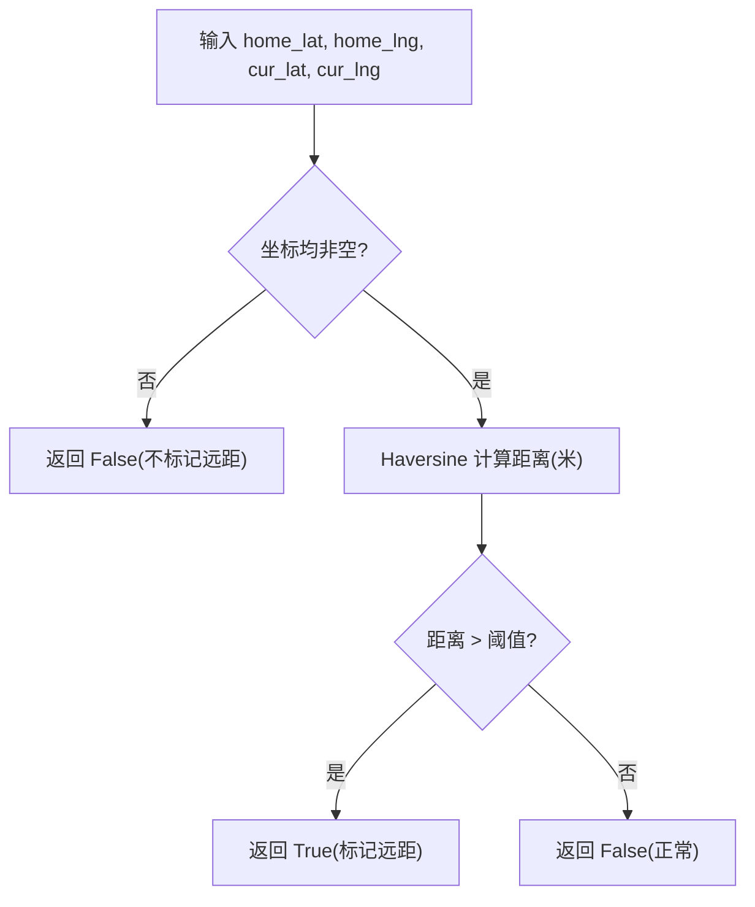
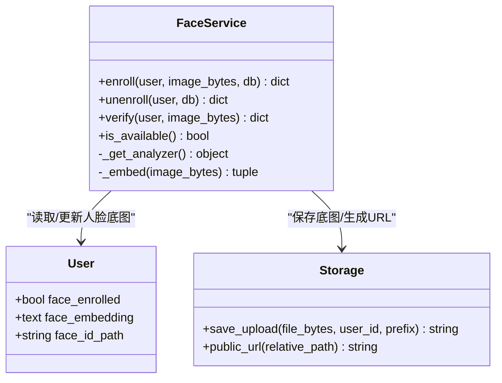
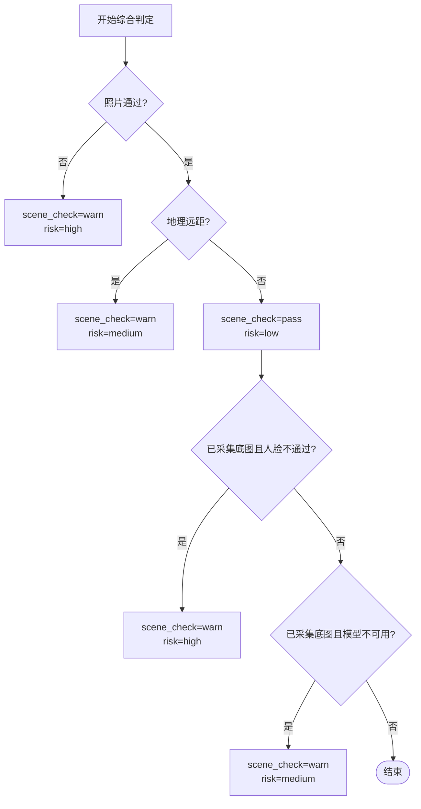
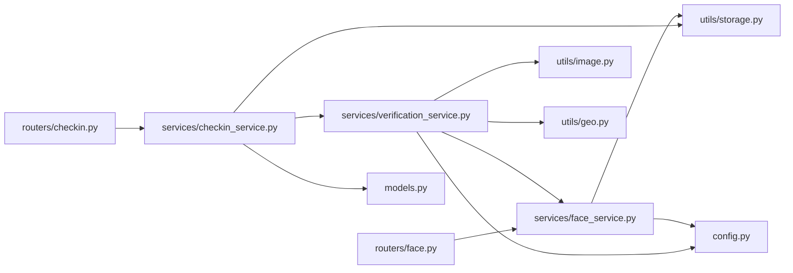

# 防作弊验证系统

<cite>
**本文引用的文件列表**
- [verification_service.py](file://summer-homework-checkin/backend/app/services/verification_service.py)
- [checkin_service.py](file://summer-homework-checkin/backend/app/services/checkin_service.py)
- [face_service.py](file://summer-homework-checkin/backend/app/services/face_service.py)
- [image.py](file://summer-homework-checkin/backend/app/utils/image.py)
- [geo.py](file://summer-homework-checkin/backend/app/utils/geo.py)
- [config.py](file://summer-homework-checkin/backend/app/config.py)
- [models.py](file://summer-homework-checkin/backend/app/models.py)
- [storage.py](file://summer-homework-checkin/backend/app/utils/storage.py)
- [checkin.py](file://summer-homework-checkin/backend/app/routers/checkin.py)
- [face.py](file://summer-homework-checkin/backend/app/routers/face.py)
- [README.md](file://summer-homework-checkin/README.md)
</cite>

## 目录
1. [引言](#引言)
2. [项目结构](#项目结构)
3. [核心组件](#核心组件)
4. [架构总览](#架构总览)
5. [详细组件分析](#详细组件分析)
6. [依赖关系分析](#依赖关系分析)
7. [性能考量与优化建议](#性能考量与优化建议)
8. [故障排查指南](#故障排查指南)
9. [结论](#结论)
10. [附录：阈值与策略配置](#附录阈值与策略配置)

## 引言
本文件面向“暑假作业打卡登记系统”的防代打卡能力，系统性阐述四重防作弊验证机制的技术实现与落地方案：
- 照片真实性检测（图像质量分析与元数据校验）
- 地理位置一致性验证（GPS坐标校验与距离计算）
- 人脸识别 1:1 比对（InsightFace 特征提取与相似度计算）
- 场景合规综合判定（时间逻辑检查、行为模式分析、风险分级）

文档将给出算法原理、阈值设置、错误处理策略、流程图示、性能优化建议以及常见作弊手段的防护措施。

## 项目结构
本仓库采用前后端分离架构，后端基于 FastAPI + SQLAlchemy + SQLite，前端为 H5 学生端与独立后台管理页。防作弊相关代码集中在 backend/app/services、backend/app/utils 与 backend/app/routers 下。

图表来源
- [checkin.py:1-80](file://summer-homework-checkin/backend/app/routers/checkin.py#L1-L80)
- [face.py:1-45](file://summer-homework-checkin/backend/app/routers/face.py#L1-L45)
- [checkin_service.py:1-254](file://summer-homework-checkin/backend/app/services/checkin_service.py#L1-L254)
- [verification_service.py:1-71](file://summer-homework-checkin/backend/app/services/verification_service.py#L1-L71)
- [face_service.py:1-133](file://summer-homework-checkin/backend/app/services/face_service.py#L1-L133)
- [image.py:1-61](file://summer-homework-checkin/backend/app/utils/image.py#L1-L61)
- [geo.py:1-24](file://summer-homework-checkin/backend/app/utils/geo.py#L1-L24)
- [storage.py:1-24](file://summer-homework-checkin/backend/app/utils/storage.py#L1-L24)
- [config.py:1-50](file://summer-homework-checkin/backend/app/config.py#L1-L50)
- [models.py:1-212](file://summer-homework-checkin/backend/app/models.py#L1-L212)

章节来源
- [README.md:1-126](file://summer-homework-checkin/README.md#L1-L126)

## 核心组件
- 验证编排器 verification_service.verify_checkin：串联图片校验、地理校验、人脸 1:1 比对，输出 scene_check 与 risk 等级。
- 人脸服务 face_service：负责底图采集 enroll、撤销 unenroll、1:1 比对 verify；使用 InsightFace 提取 512 维 embedding，余弦相似度与阈值比较。
- 图像工具 image.validate_photo / inspect_image：轻量解析 JPEG/PNG 头，校验体积与尺寸门槛，过滤占位图/缩略图。
- 地理工具 geo.haversine / is_far_from_home：Haversine 公式计算球面距离，结合阈值判断是否“远离常用位置”。
- 打卡流程 checkin_service.create_checkin：业务规则（补卡限额、凭证、重复提交限制）、保存上传、调用验证、记录结果并通知。
- 配置 config：集中定义阈值与策略，支持环境变量覆盖。
- 存储 storage：统一落盘与公开 URL 生成。
- 模型 models：用户、打卡记录等字段承载人脸与地理信息。

章节来源
- [verification_service.py:1-71](file://summer-homework-checkin/backend/app/services/verification_service.py#L1-L71)
- [face_service.py:1-133](file://summer-homework-checkin/backend/app/services/face_service.py#L1-L133)
- [image.py:1-61](file://summer-homework-checkin/backend/app/utils/image.py#L1-L61)
- [geo.py:1-24](file://summer-homework-checkin/backend/app/utils/geo.py#L1-L24)
- [checkin_service.py:1-254](file://summer-homework-checkin/backend/app/services/checkin_service.py#L1-L254)
- [config.py:1-50](file://summer-homework-checkin/backend/app/config.py#L1-L50)
- [storage.py:1-24](file://summer-homework-checkin/backend/app/utils/storage.py#L1-L24)
- [models.py:1-212](file://summer-homework-checkin/backend/app/models.py#L1-L212)

## 架构总览
四重校验在打卡主流程中按顺序执行，最终形成结构化结果供审核与风控使用。

图表来源
- [checkin.py:1-80](file://summer-homework-checkin/backend/app/routers/checkin.py#L1-L80)
- [checkin_service.py:64-163](file://summer-homework-checkin/backend/app/services/checkin_service.py#L64-L163)
- [verification_service.py:19-71](file://summer-homework-checkin/backend/app/services/verification_service.py#L19-L71)
- [image.py:51-61](file://summer-homework-checkin/backend/app/utils/image.py#L51-L61)
- [geo.py:6-24](file://summer-homework-checkin/backend/app/utils/geo.py#L6-L24)
- [face_service.py:99-125](file://summer-homework-checkin/backend/app/services/face_service.py#L99-L125)
- [storage.py:7-16](file://summer-homework-checkin/backend/app/utils/storage.py#L7-L16)
- [models.py:70-96](file://summer-homework-checkin/backend/app/models.py#L70-L96)

## 详细组件分析

### 一、照片真实性检测（图像质量分析与元数据校验）
- 目标：过滤占位图、缩略图、非图像文件，确保现场拍摄的真实性与清晰度。
- 实现要点：
  - 体积门槛：最小/最大字节数由配置控制，避免过小或过大文件。
  - 格式与尺寸：仅支持 JPEG/PNG，通过解析文件头获取宽高，拒绝低于最小边长的图片。
  - 失败路径：直接返回错误详情，阻断后续流程。
- 复杂度：O(n) 扫描文件头，n 为文件大小；空间 O(1)。
- 可观测性：返回格式化后的尺寸与格式字符串，便于日志与审计。

图表来源
- [image.py:51-61](file://summer-homework-checkin/backend/app/utils/image.py#L51-L61)
- [config.py:27-32](file://summer-homework-checkin/backend/app/config.py#L27-L32)

章节来源
- [image.py:1-61](file://summer-homework-checkin/backend/app/utils/image.py#L1-L61)
- [config.py:27-32](file://summer-homework-checkin/backend/app/config.py#L27-L32)

### 二、地理位置一致性验证（GPS坐标校验与距离计算）
- 目标：判断拍照位置是否与账号常用位置一致，超出阈值则标记风险。
- 实现要点：
  - Haversine 公式计算球面距离（米）。
  - 若任一坐标缺失，返回 None 并视为未触发远距标记。
  - 阈值 GEO_THRESHOLD_METERS 可通过环境变量调整。
- 复杂度：常数时间 O(1)，无额外内存占用。
- 可观测性：记录 geo_distance 与 geo_flag，用于后台高亮异常。

图表来源
- [geo.py:6-24](file://summer-homework-checkin/backend/app/utils/geo.py#L6-L24)
- [config.py:27-28](file://summer-homework-checkin/backend/app/config.py#L27-L28)

章节来源
- [geo.py:1-24](file://summer-homework-checkin/backend/app/utils/geo.py#L1-L24)
- [config.py:27-28](file://summer-homework-checkin/backend/app/config.py#L27-L28)

### 三、人脸识别 1:1 比对（InsightFace 特征提取与相似度计算）
- 目标：以“本人底图 vs 现场照”的 1:1 比对为核心，防止他人代打卡。
- 实现要点：
  - 底图采集 enroll：要求检测到且仅检测到一张人脸，提取 512 维 embedding 持久化至用户表。
  - 1:1 比对 verify：现场照提取 embedding，与底图做余弦相似度，超过阈值 FACE_MATCH_THRESHOLD 即通过。
  - 降级策略：若无 insightface 或下载失败，自动降级为“模型不可用”，已采集底图的账号在比对失败时明确提示且不静默放行。
  - 线程安全：全局分析器懒加载，加锁保证并发安全。
- 复杂度：
  - 特征提取：取决于 InsightFace 推理耗时（CPU 默认），单次约数百毫秒级。
  - 相似度计算：向量点积与范数，O(d)，d=512，常数级。
- 可观测性：返回 status、score、message、has_face、face_count，便于审计与排障。

图表来源
- [face_service.py:71-133](file://summer-homework-checkin/backend/app/services/face_service.py#L71-L133)
- [models.py:27-31](file://summer-homework-checkin/backend/app/models.py#L27-L31)
- [storage.py:7-24](file://summer-homework-checkin/backend/app/utils/storage.py#L7-L24)

章节来源
- [face_service.py:1-133](file://summer-homework-checkin/backend/app/services/face_service.py#L1-L133)
- [models.py:27-31](file://summer-homework-checkin/backend/app/models.py#L27-L31)
- [storage.py:1-24](file://summer-homework-checkin/backend/app/utils/storage.py#L1-L24)
- [config.py:41-49](file://summer-homework-checkin/backend/app/config.py#L41-L49)

### 四、场景合规综合判定（时间逻辑检查、行为模式分析）
- 目标：整合照片、地理、人脸结果，输出 scene_check 与 risk 等级，辅助审核与风控。
- 实现要点：
  - 照片不通过 -> scene_check=warn, risk=high。
  - 地理远距 -> scene_check=warn, risk=medium。
  - 其他 -> scene_check=pass, risk=low。
  - 已采集底图但人脸不通过（mismatch/no_face/multiple_faces）-> 提升为 high。
  - 已采集底图但模型不可用 -> 降级为 medium，不静默放行。
- 时间逻辑与行为模式：
  - 打卡日期合法性、补卡日期范围、单月补卡上限、同日多次打卡允许但需逐次审核。
  - 连续天数与里程碑奖励（每满 7 天解锁抽奖资格）。
- 复杂度：常量时间逻辑分支，整体 O(1)。

图表来源
- [verification_service.py:50-70](file://summer-homework-checkin/backend/app/services/verification_service.py#L50-L70)
- [checkin_service.py:64-163](file://summer-homework-checkin/backend/app/services/checkin_service.py#L64-L163)

章节来源
- [verification_service.py:1-71](file://summer-homework-checkin/backend/app/services/verification_service.py#L1-L71)
- [checkin_service.py:1-254](file://summer-homework-checkin/backend/app/services/checkin_service.py#L1-L254)

## 依赖关系分析
- 路由层依赖服务层：/api/checkin 与 /api/face 分别调用 checkin_service 与 face_service。
- 服务层依赖工具层：verification_service 组合 image、geo、face_service；checkin_service 组合 storage、verification_service。
- 配置集中管理：所有阈值与策略来自 config.py，支持环境变量覆盖。
- 模型承载状态：User 与 CheckIn 包含人脸与地理字段，支撑审计与报表。

图表来源
- [checkin.py:1-80](file://summer-homework-checkin/backend/app/routers/checkin.py#L1-L80)
- [face.py:1-45](file://summer-homework-checkin/backend/app/routers/face.py#L1-L45)
- [checkin_service.py:1-254](file://summer-homework-checkin/backend/app/services/checkin_service.py#L1-L254)
- [verification_service.py:1-71](file://summer-homework-checkin/backend/app/services/verification_service.py#L1-L71)
- [face_service.py:1-133](file://summer-homework-checkin/backend/app/services/face_service.py#L1-L133)
- [image.py:1-61](file://summer-homework-checkin/backend/app/utils/image.py#L1-L61)
- [geo.py:1-24](file://summer-homework-checkin/backend/app/utils/geo.py#L1-L24)
- [storage.py:1-24](file://summer-homework-checkin/backend/app/utils/storage.py#L1-L24)
- [models.py:1-212](file://summer-homework-checkin/backend/app/models.py#L1-L212)
- [config.py:1-50](file://summer-homework-checkin/backend/app/config.py#L1-L50)

章节来源
- [checkin.py:1-80](file://summer-homework-checkin/backend/app/routers/checkin.py#L1-L80)
- [face.py:1-45](file://summer-homework-checkin/backend/app/routers/face.py#L1-L45)
- [checkin_service.py:1-254](file://summer-homework-checkin/backend/app/services/checkin_service.py#L1-L254)
- [verification_service.py:1-71](file://summer-homework-checkin/backend/app/services/verification_service.py#L1-L71)
- [face_service.py:1-133](file://summer-homework-checkin/backend/app/services/face_service.py#L1-L133)
- [image.py:1-61](file://summer-homework-checkin/backend/app/utils/image.py#L1-L61)
- [geo.py:1-24](file://summer-homework-checkin/backend/app/utils/geo.py#L1-L24)
- [storage.py:1-24](file://summer-homework-checkin/backend/app/utils/storage.py#L1-L24)
- [models.py:1-212](file://summer-homework-checkin/backend/app/models.py#L1-L212)
- [config.py:1-50](file://summer-homework-checkin/backend/app/config.py#L1-L50)

## 性能考量与优化建议
- 图像解析：
  - 当前仅解析文件头，避免全量解码，开销低。
  - 建议：对超大图片进行快速截断校验，减少 I/O。
- 地理计算：
  - Haversine 为常数时间，无需优化。
- 人脸识别：
  - 首次运行按需下载模型，后续缓存于本地目录，避免重复下载。
  - 分析器懒加载与全局锁保证线程安全，适合多 worker 部署。
  - 建议：
    - 预置模型到 ~/.insightface，避免首次请求延迟。
    - 根据设备 CPU 能力调优 det_size（越小越快，但漏检率上升）。
    - 考虑 GPU 加速或专用推理服务以提升吞吐。
- 存储与网络：
  - 上传文件落盘后返回相对路径，静态资源可通过 CDN 加速。
  - 建议：对象存储 + CDN 分发，降低服务器压力。
- 并发与限流：
  - 建议增加接口级限流与重试退避，保护人脸推理服务。
- 监控与指标：
  - 记录各阶段耗时（图像解析、地理计算、人脸推理），建立告警阈值。

[本节为通用指导，不直接分析具体文件]

## 故障排查指南
- 人脸模型不可用：
  - 现象：face_status=model_unavailable，已采集底图账号可能被拒绝或降级。
  - 排查：确认外网访问权限或预置模型；查看 is_available 健康检查。
- 未检测到人脸或多张人脸：
  - 现象：no_face 或 multiple_faces。
  - 排查：引导用户正对镜头、单独拍摄；检查光线与遮挡。
- 人脸比对不通过：
  - 现象：mismatch，score 低于阈值。
  - 排查：重新采集底图；调整 FACE_MATCH_THRESHOLD；检查底图质量。
- 地理远距标记：
  - 现象：geo_flag=True。
  - 排查：校准设备定位；调整 GEO_THRESHOLD_METERS；核查学校/家庭地址。
- 照片不合法：
  - 现象：体积/尺寸/格式错误。
  - 排查：检查上传源；确保真实相机拍摄而非截图或缩略图。
- 补卡规则冲突：
  - 现象：重复补卡、超月度上限、日期不在统计窗口。
  - 排查：核对 makeup_for_date 与当月已用次数；确认暑假统计窗口。

章节来源
- [face_service.py:99-133](file://summer-homework-checkin/backend/app/services/face_service.py#L99-L133)
- [verification_service.py:40-70](file://summer-homework-checkin/backend/app/services/verification_service.py#L40-L70)
- [checkin_service.py:64-163](file://summer-homework-checkin/backend/app/services/checkin_service.py#L64-L163)
- [image.py:51-61](file://summer-homework-checkin/backend/app/utils/image.py#L51-L61)
- [geo.py:19-24](file://summer-homework-checkin/backend/app/utils/geo.py#L19-L24)
- [config.py:27-49](file://summer-homework-checkin/backend/app/config.py#L27-L49)

## 结论
本系统通过“照片真实性 + 地理位置一致性 + 人脸 1:1 比对 + 场景合规综合判定”的四重防线，有效降低代打卡风险。其设计具备以下优势：
- 模块化与可插拔：人脸服务可替换为外部 API，不影响主流程。
- 安全降级：模型不可用时不静默放行，保障风控底线。
- 可观测与可审计：完整记录人脸与地理信息，便于回溯与报表。
- 可扩展：预留 1:N 扩展能力，未来可平滑升级至班级级身份识别。

[本节为总结性内容，不直接分析具体文件]

## 附录：阈值与策略配置
- 地理阈值：GEO_THRESHOLD_METERS（默认 1500 米）
- 人脸阈值：FACE_MATCH_THRESHOLD（默认 0.4，越高越严格）
- 人脸策略：FACE_MODE_ON_ENROLLED（enforce=不通过则拒绝；soft=仅标记风险）
- 图像门槛：MIN_PHOTO_BYTES、MIN_PHOTO_DIM、PHOTO_MAX_BYTES
- 补卡限额：MAX_MAKEUP_PER_MONTH（默认 3 次/月）
- 积分规则：CHECKIN_POINTS、MAKEUP_POINTS

章节来源
- [config.py:27-49](file://summer-homework-checkin/backend/app/config.py#L27-L49)
- [README.md:65-77](file://summer-homework-checkin/README.md#L65-L77)