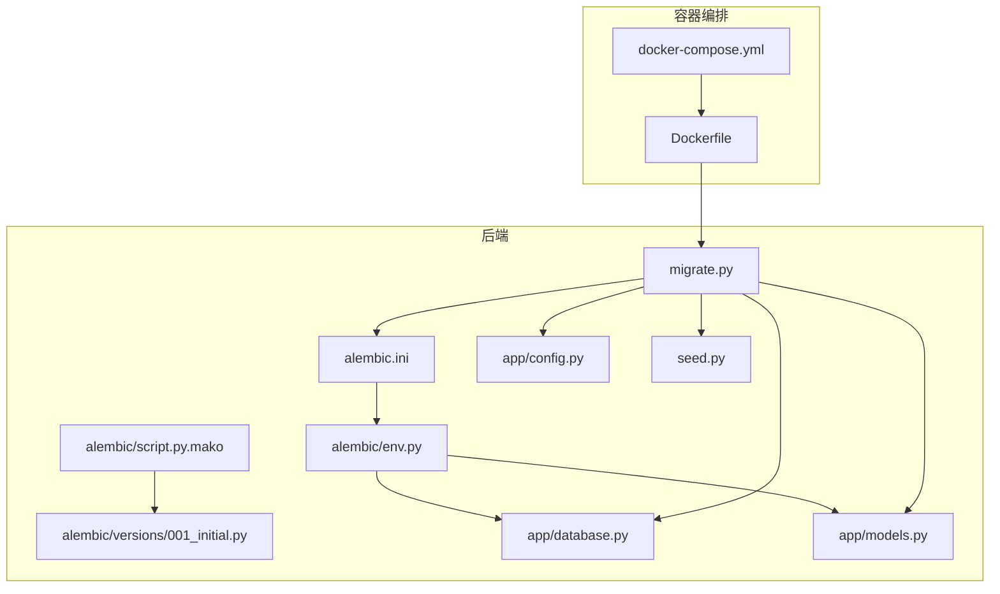
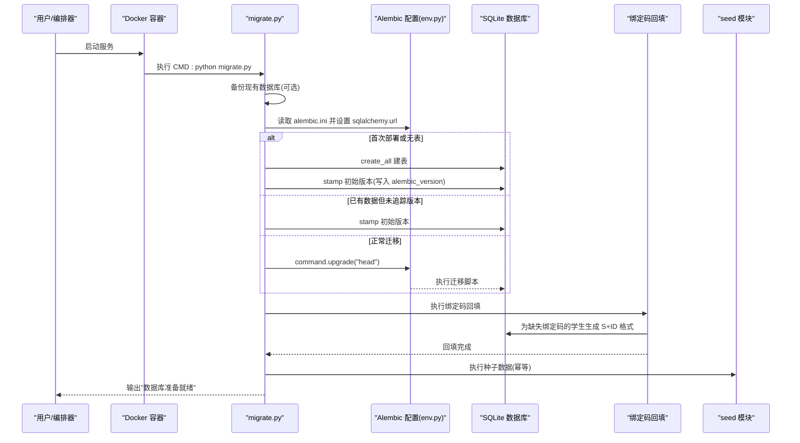
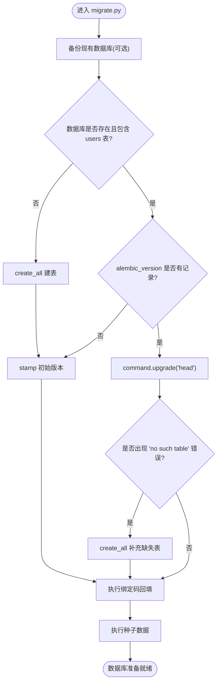
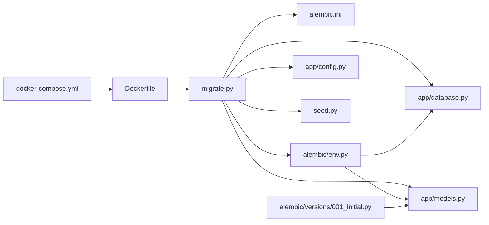

# Alembic数据库迁移系统

<cite>
**本文引用的文件列表**
- [alembic.ini](file://summer-homework-checkin/backend/alembic.ini)
- [env.py](file://summer-homework-checkin/backend/alembic/env.py)
- [script.py.mako](file://summer-homework-checkin/backend/alembic/script.py.mako)
- [001_initial.py](file://summer-homework-checkin/backend/alembic/versions/001_initial.py)
- [migrate.py](file://summer-homework-checkin/backend/migrate.py)
- [database.py](file://summer-homework-checkin/backend/app/database.py)
- [models.py](file://summer-homework-checkin/backend/app/models.py)
- [config.py](file://summer-homework-checkin/backend/app/config.py)
- [seed.py](file://summer-homework-checkin/backend/seed.py)
- [Dockerfile](file://summer-homework-checkin/Dockerfile)
- [docker-compose.yml](file://docker-compose.yml)
</cite>

## 更新摘要
**变更内容**
- 新增 `backfill_bind_codes()` 函数，为现有学生自动补全绑定码
- 修复 `_stamp_initial_revision()` 函数中的 null bytes 问题，提升数据库迁移稳定性
- 增强默认启动流程，在迁移后自动执行绑定码回填

## 目录
1. [简介](#简介)
2. [项目结构](#项目结构)
3. [核心组件](#核心组件)
4. [架构总览](#架构总览)
5. [详细组件分析](#详细组件分析)
6. [依赖关系分析](#依赖关系分析)
7. [性能与并发特性](#性能与并发特性)
8. [故障排查指南](#故障排查指南)
9. [结论](#结论)
10. [附录：常用命令与最佳实践](#附录常用命令与最佳实践)

## 简介
本仓库中的暑假作业打卡系统在后端采用 SQLAlchemy + Alembic 进行数据库版本管理与增量迁移。系统在容器启动时自动执行"备份 → 迁移 → 绑定码回填 → 种子数据"流程，确保在首次部署、已有数据未追踪版本、以及后续迭代升级等场景下均能安全完成数据库初始化与演进。

## 项目结构
与 Alembic 相关的核心目录与文件如下：
- alembic 配置与环境
  - alembic.ini：Alembic 全局配置（脚本位置、日志、SQLAlchemy URL）
  - alembic/env.py：迁移运行环境（离线/在线模式、目标元数据、连接构造）
  - alembic/script.py.mako：迁移脚本模板（生成 upgrade/downgrade 骨架）
  - alembic/versions/001_initial.py：初始迁移脚本（创建所有表）
- 应用层集成
  - app/database.py：SQLAlchemy 引擎、会话、Base 定义及 SQLite 优化
  - app/models.py：ORM 模型定义（映射到数据库表）
  - app/config.py：数据库路径与 URL 配置
- 启动编排
  - migrate.py：迁移入口（含备份、create_all 兜底、stamp 初始版本、绑定码回填、种子数据）
  - seed.py：种子数据初始化（预设奖品、管理员账号、示例任务）
  - Dockerfile：镜像构建与 CMD 启动流程
  - docker-compose.yml：服务编排与持久化卷挂载

**图表来源**
- [alembic.ini:1-41](file://summer-homework-checkin/backend/alembic.ini#L1-L41)
- [env.py:1-57](file://summer-homework-checkin/backend/alembic/env.py#L1-L57)
- [script.py.mako:1-26](file://summer-homework-checkin/backend/alembic/script.py.mako#L1-L26)
- [001_initial.py:1-183](file://summer-homework-checkin/backend/alembic/versions/001_initial.py#L1-L183)
- [migrate.py:1-183](file://summer-homework-checkin/backend/migrate.py#L1-L183)
- [database.py:1-31](file://summer-homework-checkin/backend/app/database.py#L1-L31)
- [models.py:1-213](file://summer-homework-checkin/backend/app/models.py#L1-L213)
- [config.py:1-80](file://summer-homework-checkin/backend/app/config.py#L1-L80)
- [seed.py:1-131](file://summer-homework-checkin/backend/seed.py#L1-L131)
- [Dockerfile:1-22](file://summer-homework-checkin/Dockerfile#L1-L22)
- [docker-compose.yml:1-59](file://docker-compose.yml#L1-L59)

## 核心组件
- Alembic 配置与环境
  - alembic.ini：指定脚本目录、日志级别、SQLAlchemy URL（默认指向 SQLite 文件）。
  - env.py：导入 Base 与 models，设置 target_metadata；提供 offline/online 两种运行模式。
  - script.py.mako：迁移脚本模板，自动生成 revision、upgrade、downgrade 骨架。
  - versions/001_initial.py：一次性创建全部表的初始迁移。
- 应用集成
  - database.py：创建引擎、会话、Base；为 SQLite 开启 WAL 模式与 busy_timeout，提升并发读写稳定性。
  - models.py：完整 ORM 模型集合，作为 Alembic 的元数据来源。包含 User 模型的 bind_code 字段用于家长绑定。
  - config.py：DB_PATH 与 DATABASE_URL 的来源，支持环境变量覆盖。
- 启动编排
  - migrate.py：封装备份、迁移、stamp、create_all 兜底、绑定码回填、种子数据逻辑，并在容器 CMD 中自动执行。
  - seed.py：提供幂等的种子数据初始化，包括预设奖品池、管理员账号和示例闯关任务。
  - Dockerfile/docker-compose.yml：将迁移流程嵌入容器启动流程，并通过卷持久化数据库与上传文件。

**章节来源**
- [alembic.ini:1-41](file://summer-homework-checkin/backend/alembic.ini#L1-L41)
- [env.py:1-57](file://summer-homework-checkin/backend/alembic/env.py#L1-L57)
- [script.py.mako:1-26](file://summer-homework-checkin/backend/alembic/script.py.mako#L1-L26)
- [001_initial.py:1-183](file://summer-homework-checkin/backend/alembic/versions/001_initial.py#L1-L183)
- [database.py:1-31](file://summer-homework-checkin/backend/app/database.py#L1-L31)
- [models.py:1-213](file://summer-homework-checkin/backend/app/models.py#L1-L213)
- [config.py:1-80](file://summer-homework-checkin/backend/app/config.py#L1-L80)
- [migrate.py:1-183](file://summer-homework-checkin/backend/migrate.py#L1-L183)
- [seed.py:1-131](file://summer-homework-checkin/backend/seed.py#L1-L131)
- [Dockerfile:1-22](file://summer-homework-checkin/Dockerfile#L1-L22)
- [docker-compose.yml:1-59](file://docker-compose.yml#L1-L59)

## 架构总览
下图展示了从容器启动到数据库就绪的整体流程，包括备份、迁移、绑定码回填与种子数据注入。

**图表来源**
- [Dockerfile:20-22](file://summer-homework-checkin/Dockerfile#L20-L22)
- [migrate.py:1-183](file://summer-homework-checkin/backend/migrate.py#L1-L183)
- [alembic.ini:1-41](file://summer-homework-checkin/backend/alembic.ini#L1-L41)
- [env.py:1-57](file://summer-homework-checkin/backend/alembic/env.py#L1-L57)
- [001_initial.py:1-183](file://summer-homework-checkin/backend/alembic/versions/001_initial.py#L1-L183)

## 详细组件分析

### Alembic 配置与环境
- alembic.ini
  - 关键项：script_location、sqlalchemy.url、日志级别。
  - 作用：为 Alembic CLI 和 API 提供统一配置入口。
- env.py
  - 导入 Base 与 models，使 Alembic 能够感知完整的 ORM 元数据。
  - 提供 run_migrations_offline 与 run_migrations_online 两套执行路径。
  - 通过 context.config 读取配置，使用 engine_from_config 构造连接。
- script.py.mako
  - 生成每个迁移脚本的头部信息（revision、down_revision、branch_labels、depends_on）与空壳函数。

**章节来源**
- [alembic.ini:1-41](file://summer-homework-checkin/backend/alembic.ini#L1-L41)
- [env.py:1-57](file://summer-homework-checkin/backend/alembic/env.py#L1-L57)
- [script.py.mako:1-26](file://summer-homework-checkin/backend/alembic/script.py.mako#L1-L26)

### 初始迁移脚本
- 001_initial.py
  - 一次性创建所有业务表（users、student_parent、checkins、prizes、lottery_records、redemptions、notifications、challenge_tasks、challenge_checkins）。
  - 包含 downgrade 以反向删除表，便于回滚测试。
  - 字段类型、索引、外键、默认值与 server_default 与 ORM 模型保持一致。

**章节来源**
- [001_initial.py:1-183](file://summer-homework-checkin/backend/alembic/versions/001_initial.py#L1-L183)

### 应用层集成（数据库与模型）
- database.py
  - 创建 SQLAlchemy 引擎与会话工厂，暴露 Base。
  - 监听 connect 事件，启用 SQLite WAL 模式与 busy_timeout，提高并发写时的稳定性。
- models.py
  - 定义所有业务实体与关系，作为 Alembic 的目标元数据源。
  - User 模型包含 bind_code 字段（String(16), nullable=True），用于家长绑定学生的展示码。
- config.py
  - 提供 DB_PATH 与 DATABASE_URL，支持环境变量覆盖，便于容器化部署。

**章节来源**
- [database.py:1-31](file://summer-homework-checkin/backend/app/database.py#L1-L31)
- [models.py:1-213](file://summer-homework-checkin/backend/app/models.py#L1-L213)
- [config.py:1-80](file://summer-homework-checkin/backend/app/config.py#L1-L80)

### 迁移入口与启动编排
- migrate.py
  - 备份：复制当前 app.db 到 backups 目录，带时间戳。
  - 迁移策略：
    - 首次部署或无表：使用 create_all 建表，然后 stamp 初始版本。
    - 已有数据但无 alembic_version 记录：直接 stamp 初始版本。
    - 正常迁移：调用 Alembic command.upgrade 至 head。
    - 异常兜底：若迁移报"表不存在"，则回退到 create_all 确保结构存在。
  - **更新** `_stamp_initial_revision()` 函数：修复了 null bytes 问题，使用纯路径字符串避免编码问题，提升数据库迁移稳定性。
  - **新增** `backfill_bind_codes()` 函数：自动为现有学生补全绑定码，格式为"S+5位数字ID"。
  - 种子数据：调用 seed 模块，保证幂等。
  - **更新** 默认流程：在迁移完成后自动执行绑定码回填，再执行种子数据。
- seed.py
  - 提供幂等的种子数据初始化，包括预设奖品池、管理员账号和示例闯关任务。
  - 支持环境变量配置管理员初始密码。
- Dockerfile
  - CMD 在容器启动时先执行 migrate.py，再启动 uvicorn。
- docker-compose.yml
  - 通过环境变量重定向 DB_PATH 与 UPLOAD_DIR 到持久化卷，保障数据不随容器销毁丢失。

**图表来源**
- [migrate.py:1-183](file://summer-homework-checkin/backend/migrate.py#L1-L183)
- [database.py:1-31](file://summer-homework-checkin/backend/app/database.py#L1-L31)
- [config.py:1-80](file://summer-homework-checkin/backend/app/config.py#L1-L80)

**章节来源**
- [migrate.py:1-183](file://summer-homework-checkin/backend/migrate.py#L1-L183)
- [seed.py:1-131](file://summer-homework-checkin/backend/seed.py#L1-L131)
- [Dockerfile:1-22](file://summer-homework-checkin/Dockerfile#L1-L22)
- [docker-compose.yml:1-59](file://docker-compose.yml#L1-L59)

## 依赖关系分析
- 组件耦合
  - env.py 依赖 app.database.Base 与 app.models，用于获取目标元数据。
  - migrate.py 依赖 alembic 配置与命令行接口，同时依赖 app.config.DB_PATH 与 app.database.engine/Base。
  - backfill_bind_codes() 依赖 app.database.SessionLocal 与 app.models.User。
  - 001_initial.py 与 models.py 保持表结构与字段一致，避免漂移。
- 外部依赖
  - Alembic 与 SQLAlchemy 负责迁移与 ORM 映射。
  - SQLite 作为轻量级存储，配合 WAL 模式提升并发能力。
  - Docker 与 Compose 负责容器化与数据持久化。

**图表来源**
- [migrate.py:1-183](file://summer-homework-checkin/backend/migrate.py#L1-L183)
- [alembic.ini:1-41](file://summer-homework-checkin/backend/alembic.ini#L1-L41)
- [env.py:1-57](file://summer-homework-checkin/backend/alembic/env.py#L1-L57)
- [database.py:1-31](file://summer-homework-checkin/backend/app/database.py#L1-L31)
- [models.py:1-213](file://summer-homework-checkin/backend/app/models.py#L1-L213)
- [config.py:1-80](file://summer-homework-checkin/backend/app/config.py#L1-L80)
- [seed.py:1-131](file://summer-homework-checkin/backend/seed.py#L1-L131)
- [001_initial.py:1-183](file://summer-homework-checkin/backend/alembic/versions/001_initial.py#L1-L183)
- [Dockerfile:1-22](file://summer-homework-checkin/Dockerfile#L1-L22)
- [docker-compose.yml:1-59](file://docker-compose.yml#L1-L59)

**章节来源**
- [migrate.py:1-183](file://summer-homework-checkin/backend/migrate.py#L1-L183)
- [alembic.ini:1-41](file://summer-homework-checkin/backend/alembic.ini#L1-L41)
- [env.py:1-57](file://summer-homework-checkin/backend/alembic/env.py#L1-L57)
- [database.py:1-31](file://summer-homework-checkin/backend/app/database.py#L1-L31)
- [models.py:1-213](file://summer-homework-checkin/backend/app/models.py#L1-L213)
- [config.py:1-80](file://summer-homework-checkin/backend/app/config.py#L1-L80)
- [seed.py:1-131](file://summer-homework-checkin/backend/seed.py#L1-L131)
- [001_initial.py:1-183](file://summer-homework-checkin/backend/alembic/versions/001_initial.py#L1-L183)
- [Dockerfile:1-22](file://summer-homework-checkin/Dockerfile#L1-L22)
- [docker-compose.yml:1-59](file://docker-compose.yml#L1-L59)

## 性能与并发特性
- SQLite WAL 模式
  - 通过 connect 事件监听启用 WAL 模式与 busy_timeout，减少写锁冲突，提升并发读写的稳定性。
- 迁移阶段
  - 首次部署使用 create_all 快速建表；后续迭代使用 Alembic 增量迁移，避免全量重建带来的开销。
- 绑定码回填优化
  - 批量查询缺失绑定码的学生，使用单个事务提交，减少数据库交互次数。
- 数据持久化
  - 通过 Docker 卷将 app.db 与 uploads 目录持久化，避免重启导致的数据丢失。

**章节来源**
- [database.py:13-19](file://summer-homework-checkin/backend/app/database.py#L13-L19)
- [migrate.py:72-98](file://summer-homework-checkin/backend/migrate.py#L72-L98)
- [migrate.py:136-156](file://summer-homework-checkin/backend/migrate.py#L136-L156)
- [docker-compose.yml:20-28](file://docker-compose.yml#L20-L28)

## 故障排查指南
- 常见问题与定位
  - 迁移报"no such table"：说明部分表缺失，migrate.py 会触发 create_all 兜底补表。
  - 已有数据但无 alembic_version 记录：migrate.py 会直接 stamp 初始版本，跳过迁移。
  - 首次部署未建表：migrate.py 会先 create_all 再 stamp。
  - **新增** 绑定码回填失败：检查数据库中是否存在 student 角色的用户，确认 bind_code 字段是否为空。
  - **新增** stamp 失败：检查 alembic.ini 配置是否正确，确认迁移脚本路径有效。
- 建议检查点
  - 确认 alembic.ini 的 sqlalchemy.url 指向正确的 DB_PATH。
  - 确认 env.py 已正确导入 Base 与 models，target_metadata 非空。
  - 确认 Docker 卷挂载路径与 DB_PATH 一致，避免数据落盘失败。
  - 查看容器日志，关注 migrate.py 的输出提示（备份、迁移、绑定码回填、种子数据）。
  - 检查 User 模型的 bind_code 字段定义是否与数据库结构一致。

**章节来源**
- [migrate.py:72-98](file://summer-homework-checkin/backend/migrate.py#L72-L98)
- [migrate.py:101-127](file://summer-homework-checkin/backend/migrate.py#L101-L127)
- [migrate.py:136-156](file://summer-homework-checkin/backend/migrate.py#L136-L156)
- [alembic.ini:1-41](file://summer-homework-checkin/backend/alembic.ini#L1-L41)
- [env.py:1-57](file://summer-homework-checkin/backend/alembic/env.py#L1-L57)

## 结论
该系统的 Alembic 迁移方案兼顾了易用性与健壮性：通过统一的 env.py 与 alembic.ini 管理迁移环境，结合 migrate.py 的"备份 + 智能迁移 + 绑定码回填 + 兜底 + 种子数据"流程，能够在多种部署场景下稳定完成数据库初始化与演进。新增的绑定码回填功能解决了历史数据的兼容性问题，而 null bytes 问题的修复进一步提升了迁移稳定性。配合 Docker 卷持久化与 SQLite WAL 模式，整体具备较好的可维护性与并发表现。

## 附录：常用命令与最佳实践
- 本地开发
  - 仅迁移：python backend/migrate.py --migrate
  - 仅种子数据：python backend/migrate.py --seed
  - 仅备份：python backend/migrate.py --backup
  - 完整流程（默认）：python backend/migrate.py
- 容器化部署
  - 构建并启动：docker compose up -d --build
  - 查看健康检查与日志：docker compose logs -f summer-homework
- 最佳实践
  - 始终在变更模型后生成对应的迁移脚本，并确保 upgrade/downgrade 对称。
  - 生产环境固定 SUMMER_SECRET，避免密钥轮转导致鉴权失效。
  - 定期备份 app.db，迁移前自动备份可降低风险。
  - **新增** 对于历史数据，系统会自动补全缺失的绑定码，无需手动干预。
  - **新增** 管理员初始密码可通过 ADMIN_INIT_PASSWORD 环境变量配置，未设置时自动生成随机密码。

**章节来源**
- [migrate.py:1-183](file://summer-homework-checkin/backend/migrate.py#L1-L183)
- [seed.py:1-131](file://summer-homework-checkin/backend/seed.py#L1-L131)
- [Dockerfile:20-22](file://summer-homework-checkin/Dockerfile#L20-L22)
- [docker-compose.yml:1-59](file://docker-compose.yml#L1-L59)