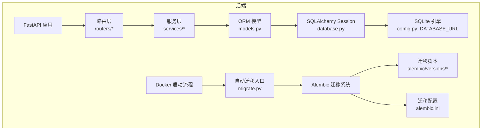
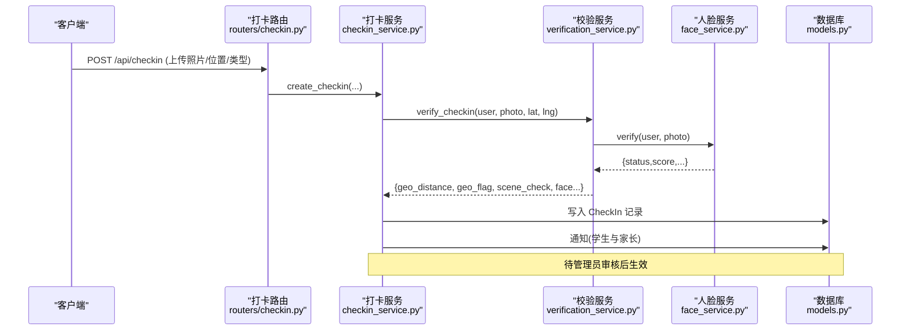
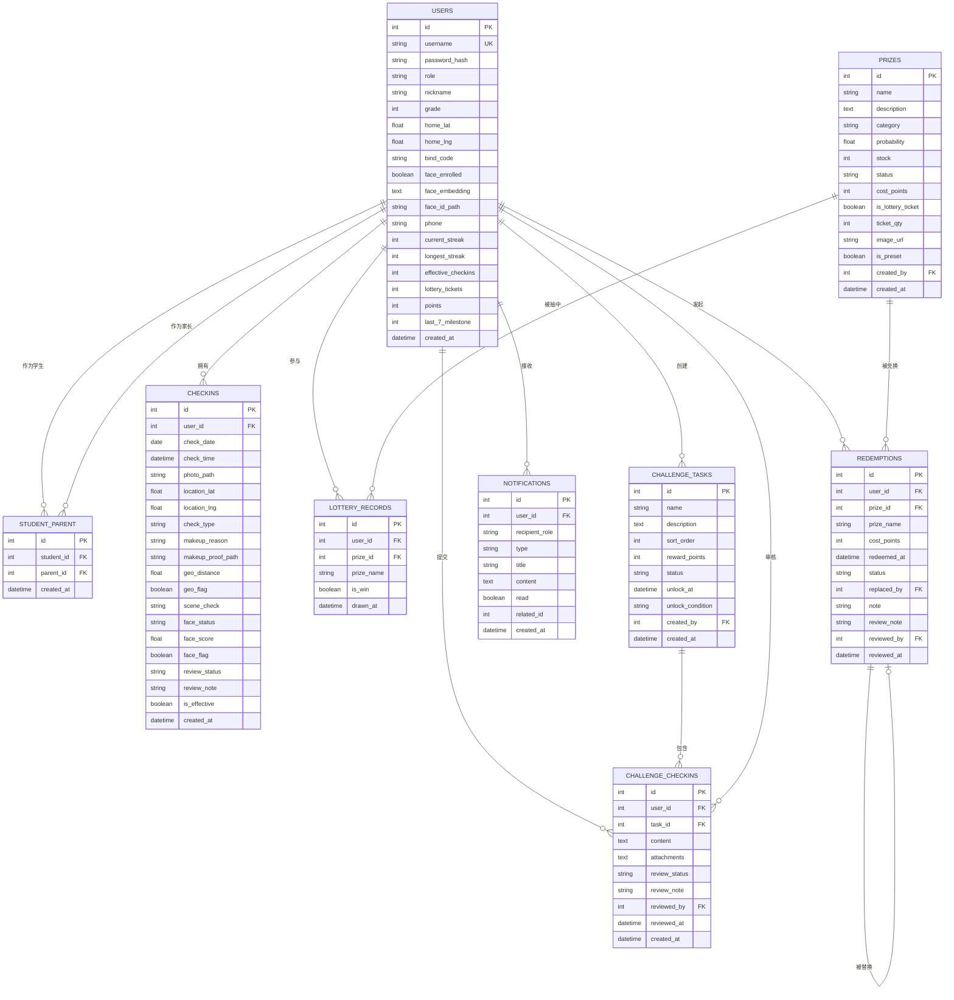
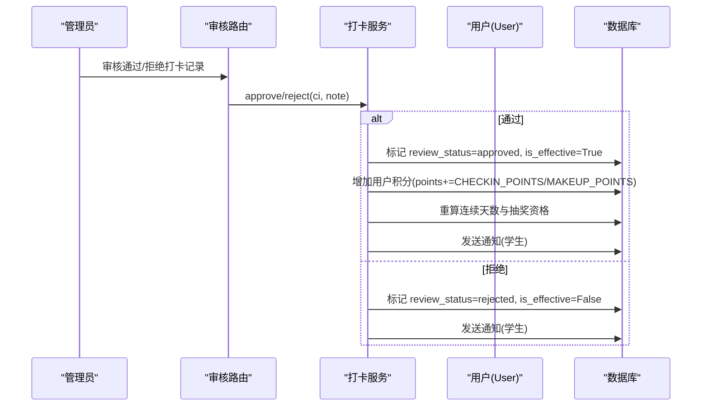
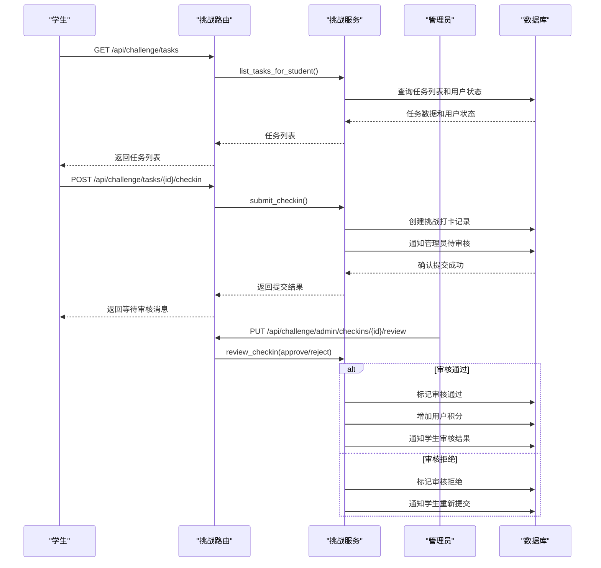
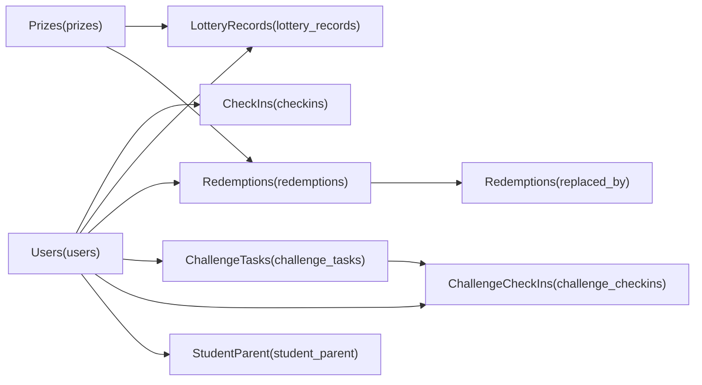
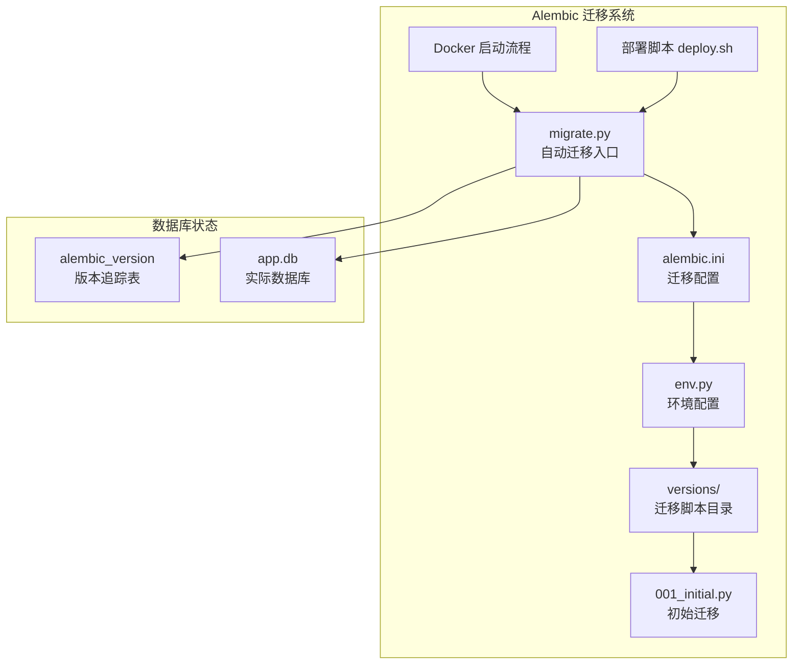
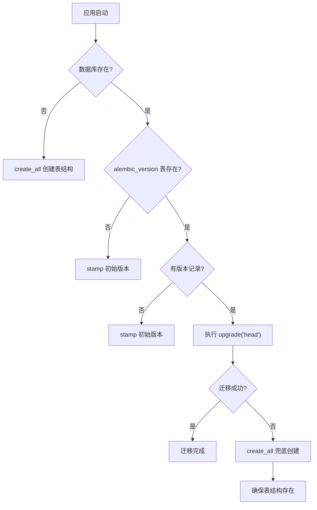
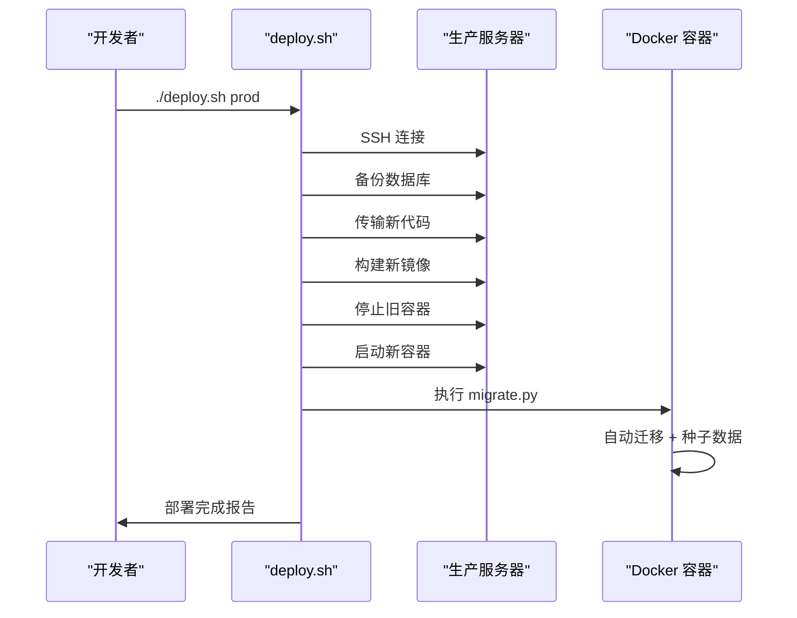

# 数据库设计

<cite>
**本文引用的文件**
- [models.py](file://summer-homework-checkin/backend/app/models.py)
- [database.py](file://summer-homework-checkin/backend/app/database.py)
- [config.py](file://summer-homework-checkin/backend/app/config.py)
- [schemas.py](file://summer-homework-checkin/backend/app/schemas.py)
- [checkin_service.py](file://summer-homework-checkin/backend/app/services/checkin_service.py)
- [verification_service.py](file://summer-homework-checkin/backend/app/services/verification_service.py)
- [face_service.py](file://summer-homework-checkin/backend/app/services/face_service.py)
- [challenge_service.py](file://summer-homework-checkin/backend/app/services/challenge_service.py)
- [seed.py](file://summer-homework-checkin/backend/seed.py)
- [routers/checkin.py](file://summer-homework-checkin/backend/app/routers/checkin.py)
- [routers/prize.py](file://summer-homework-checkin/backend/app/routers/prize.py)
- [routers/lottery.py](file://summer-homework-checkin/backend/app/routers/lottery.py)
- [routers/challenge.py](file://summer-homework-checkin/backend/app/routers/challenge.py)
- [alembic.ini](file://summer-homework-checkin/backend/alembic.ini)
- [migrate.py](file://summer-homework-checkin/backend/migrate.py)
- [env.py](file://summer-homework-checkin/backend/alembic/env.py)
- [001_initial.py](file://summer-homework-checkin/backend/alembic/versions/001_initial.py)
- [Dockerfile](file://summer-homework-checkin/Dockerfile)
- [deploy.sh](file://scripts/deploy.sh)
</cite>

## 更新摘要
**变更内容**
- 新增Alembic数据库迁移系统的完整说明
- 扩展迁移策略、版本控制和回滚机制
- 添加生产环境部署建议和增量更新流程
- 完善数据库初始化与备份恢复策略

## 目录
1. [引言](#引言)
2. [项目结构](#项目结构)
3. [核心组件](#核心组件)
4. [架构总览](#架构总览)
5. [详细组件分析](#详细组件分析)
6. [依赖关系分析](#依赖关系分析)
7. [性能与索引策略](#性能与索引策略)
8. [数据验证与业务规则](#数据验证与业务规则)
9. [迁移与部署建议](#迁移与部署建议)
10. [故障排查指南](#故障排查指南)
11. [结论](#结论)

## 引言
本文件面向暑假作业打卡系统的数据库设计与实现，覆盖实体关系、字段定义、数据类型、外键约束、索引策略、数据验证与完整性约束、性能优化、示例数据与迁移方案，并给出 SQLite 使用场景与向生产环境数据库迁移的建议。文档以代码级事实为依据，结合服务层校验与路由接口行为，确保读者既能理解表结构设计，也能把握业务规则在数据层的落地方式。

**更新** 新增了挑战任务系统的数据模型和业务逻辑，支持管理员创建闯关任务、学生提交任务打卡、管理员审核等完整流程。**同时补充了完整的Alembic数据库迁移系统，支持版本控制、增量升级和回滚操作**。

## 项目结构
系统后端基于 FastAPI + SQLAlchemy，采用 ORM 模型驱动数据库结构。核心数据模型集中在 models.py，配置与连接在 database.py 与 config.py，业务规则在服务层（services）中实现，路由层（routers）暴露 API。**数据库迁移通过 Alembic 系统进行管理，支持版本控制和增量升级**。

图表来源
- [database.py:1-22](file://summer-homework-checkin/backend/app/database.py#L1-L22)
- [config.py:15-17](file://summer-homework-checkin/backend/app/config.py#L15-L17)
- [alembic.ini:1-41](file://summer-homework-checkin/backend/alembic.ini#L1-L41)
- [migrate.py:1-158](file://summer-homework-checkin/backend/migrate.py#L1-L158)
- [Dockerfile:20-21](file://summer-homework-checkin/Dockerfile#L20-L21)

章节来源
- [database.py:1-22](file://summer-homework-checkin/backend/app/database.py#L1-L22)
- [config.py:15-17](file://summer-homework-checkin/backend/app/config.py#L15-L17)

## 核心组件
本节聚焦核心数据模型及其职责：用户与角色、家长绑定、打卡记录、人脸信息、奖品、抽奖记录、兑换记录、通知、挑战任务等。

- 用户表（users）
  - 统一用户表，通过 role 区分学生/家长/管理员；包含基础信息、学生与家长专属字段、统计冗余字段、人脸识别相关字段。
- 家长-孩子绑定表（student_parent）
  - 多对多关系的中间表，关联两个用户（学生与家长）。
- 打卡记录表（checkins）
  - 记录每次打卡详情，含照片路径、位置、补卡信息、风控标记、审核状态、有效性等。
- 人脸信息（存储于 users 表）
  - face_enrolled、face_embedding（JSON 向量）、face_id_path 三字段承载人脸底图与特征。
- 奖品表（prizes）
  - 支持积分兑换与抽奖机会两类奖品，含概率、库存、状态、成本积分等。
- 抽奖记录表（lottery_records）
  - 记录每次抽奖结果与时间。
- 兑换记录表（redemptions）
  - 记录积分兑换行为，支持"直接选择替换"的链式替换。
- 通知表（notifications）
  - 站内通知，面向学生与家长。
- **挑战任务表（challenge_tasks）**
  - 管理员创建的闯关任务定义，支持定时开放、条件解锁、积分奖励等。
- **挑战打卡记录表（challenge_checkins）**
  - 学生提交的闯关任务打卡记录，支持内容、附件、审核流程。

章节来源
- [models.py:11-213](file://summer-homework-checkin/backend/app/models.py#L11-L213)

## 架构总览
下图展示从客户端到数据库的关键调用路径与数据落库点，体现打卡、人脸校验、审核、积分发放与通知的业务闭环。

图表来源
- [routers/checkin.py:17-37](file://summer-homework-checkin/backend/app/routers/checkin.py#L17-L37)
- [checkin_service.py:64-163](file://summer-homework-checkin/backend/app/services/checkin_service.py#L64-L163)
- [verification_service.py:19-70](file://summer-homework-checkin/backend/app/services/verification_service.py#L19-L70)
- [face_service.py:99-125](file://summer-homework-checkin/backend/app/services/face_service.py#L99-L125)
- [models.py:70-96](file://summer-homework-checkin/backend/app/models.py#L70-L96)

## 详细组件分析

### 实体关系图（ER）

图表来源
- [models.py:11-213](file://summer-homework-checkin/backend/app/models.py#L11-L213)

#### 用户表（users）
- 主键：id（自增整数）
- 唯一与索引：username 唯一且建索引；role 用于角色控制
- 角色与扩展字段：
  - role：student | parent | admin
  - 学生：grade、home_lat/lng、bind_code、face_* 系列
  - 家长：phone
- 统计冗余字段：current_streak、longest_streak、effective_checkins、lottery_tickets、points、last_7_milestone
- 人脸信息：face_enrolled、face_embedding（JSON 512 维向量）、face_id_path
- 关系：一对多打卡记录、一对多抽奖记录、多对多家长绑定（双向）、一对多挑战任务创建、一对多挑战打卡记录

章节来源
- [models.py:11-55](file://summer-homework-checkin/backend/app/models.py#L11-L55)

#### 家长-孩子绑定表（student_parent）
- 主键：id
- 外键：student_id、parent_id 均指向 users.id
- 用途：实现家长与学生多对多绑定，支撑家长查看与管理孩子数据

章节来源
- [models.py:57-68](file://summer-homework-checkin/backend/app/models.py#L57-L68)

#### 打卡记录表（checkins）
- 主键：id
- 外键：user_id 指向 users.id
- 关键字段：
  - check_date（自然日）、check_time（提交时间）
  - photo_path、location_lat/lng
  - check_type：normal | makeup
  - makeup_reason、makeup_proof_path（补卡凭证）
  - geo_distance、geo_flag（地理位置风险）
  - scene_check：pass | warn | pending
  - face_status、face_score、face_flag（人脸比对结果）
  - review_status：pending | approved | rejected
  - is_effective：是否计入有效打卡
- 索引：user_id、check_date 建索引，便于按用户与日期查询

章节来源
- [models.py:70-96](file://summer-homework-checkin/backend/app/models.py#L70-L96)

#### 人脸信息（嵌入 users 表）
- face_enrolled：是否已采集人脸底图
- face_embedding：JSON 字符串，保存 512 维向量
- face_id_path：人脸底图相对存储路径
- 业务影响：
  - 未采集时，打卡允许但提示建议采集
  - 已采集且比对失败（mismatch/no_face/multiple_faces），根据策略拒绝或标记高风险

章节来源
- [models.py:27-30](file://summer-homework-checkin/backend/app/models.py#L27-L30)
- [face_service.py:71-87](file://summer-homework-checkin/backend/app/services/face_service.py#L71-L87)
- [face_service.py:99-125](file://summer-homework-checkin/backend/app/services/face_service.py#L99-L125)

#### 奖品表（prizes）
- 主键：id
- 关键字段：name、description、category、probability、stock、status、cost_points、is_lottery_ticket、ticket_qty、image_url、is_preset、created_by、created_at
- 业务含义：
  - is_lottery_ticket=True 表示"抽奖机会"，兑换后增加用户抽奖券，不扣库存、不生成兑换记录
  - cost_points=0 表示不参与积分兑换

章节来源
- [models.py:103-124](file://summer-homework-checkin/backend/app/models.py#L103-L124)

#### 抽奖记录表（lottery_records）
- 主键：id
- 外键：user_id、prize_id（可为空）
- 关键字段：prize_name、is_win、drawn_at
- 用途：记录每次抽奖结果与时间

章节来源
- [models.py:126-139](file://summer-homework-checkin/backend/app/models.py#L126-L139)

#### 兑换记录表（redemptions）
- 主键：id
- 外键：user_id、prize_id、replaced_by、reviewed_by
- 关键字段：prize_name、cost_points、redeemed_at、status、note、review_note、reviewed_at
- 业务含义：
  - status：pending | fulfilled | replaced | cancelled
  - replaced_by：支持"直接选择替换"，形成链式替换

章节来源
- [models.py:141-161](file://summer-homework-checkin/backend/app/models.py#L141-L161)

#### 通知表（notifications）
- 主键：id
- 外键：user_id
- 关键字段：recipient_role、type、title、content、read、related_id、created_at
- 用途：站内通知，面向学生与家长

章节来源
- [models.py:163-176](file://summer-homework-checkin/backend/app/models.py#L163-176)

#### 挑战任务表（challenge_tasks）
- 主键：id
- 外键：created_by 指向 users.id（管理员）
- 关键字段：
  - name：任务名称
  - description：任务描述
  - sort_order：排序顺序
  - reward_points：完成奖励积分
  - status：locked | scheduled | active（锁定/定时/活跃）
  - unlock_at：定时解锁时间
  - unlock_condition：解锁条件描述
- 业务含义：
  - 管理员可创建多个闯关任务
  - 支持定时自动开放和手动开放
  - 完成任务可获得积分奖励

章节来源
- [models.py:179-193](file://summer-homework-checkin/backend/app/models.py#L179-193)

#### 挑战打卡记录表（challenge_checkins）
- 主键：id
- 外键：user_id 指向 users.id、task_id 指向 challenge_tasks.id、reviewed_by 指向 users.id
- 关键字段：
  - content：任务完成内容
  - attachments：附件信息（JSON 格式）
  - review_status：pending | approved | rejected（待审核/已通过/已拒绝）
  - review_note：审核备注
  - reviewed_by：审核管理员ID
  - reviewed_at：审核时间
- 业务含义：
  - 学生提交任务完成记录
  - 支持文本内容和附件上传
  - 需要管理员审核后才能获得积分

章节来源
- [models.py:195-213](file://summer-homework-checkin/backend/app/models.py#L195-213)

### 关键流程时序（打卡与审核）

图表来源
- [checkin_service.py:166-209](file://summer-homework-checkin/backend/app/services/checkin_service.py#L166-L209)
- [checkin_service.py:39-61](file://summer-homework-checkin/backend/app/services/checkin_service.py#L39-L61)
- [models.py:70-96](file://summer-homework-checkin/backend/app/models.py#L70-L96)

### 复杂逻辑流程图（补卡规则）

图表来源
- [checkin_service.py:64-163](file://summer-homework-checkin/backend/app/services/checkin_service.py#L64-L163)
- [config.py:27-32](file://summer-homework-checkin/backend/app/config.py#L27-32)

### 挑战任务业务流程

图表来源
- [routers/challenge.py:20-186](file://summer-homework-checkin/backend/app/routers/challenge.py#L20-186)
- [challenge_service.py:112-234](file://summer-homework-checkin/backend/app/services/challenge_service.py#L112-234)
- [models.py:179-213](file://summer-homework-checkin/backend/app/models.py#L179-213)

## 依赖关系分析
- 模型间依赖
  - CheckIn.user_id -> users.id
  - LotteryRecord.user_id -> users.id；LotteryRecord.prize_id -> prizes.id
  - Redemption.user_id -> users.id；Redemption.prize_id -> prizes.id；Redemption.replaced_by -> redemptions.id
  - StudentParent.student_id/parent_id -> users.id
  - Prize.created_by -> users.id
  - **ChallengeTask.created_by -> users.id**
  - **ChallengeCheckIn.user_id -> users.id；ChallengeCheckIn.task_id -> challenge_tasks.id；ChallengeCheckIn.reviewed_by -> users.id**
- 服务层依赖
  - 打卡服务依赖校验服务与人脸服务，最终落库 CheckIn 并触发通知
  - 人脸服务读写 users 的人脸字段
  - **挑战服务依赖用户、任务、打卡记录和通知模型**
- 路由层依赖
  - 打卡、奖品、抽奖路由分别调用对应服务与模型
  - **挑战路由调用挑战服务和相关模型**

图表来源
- [models.py:11-213](file://summer-homework-checkin/backend/app/models.py#L11-L213)

章节来源
- [models.py:11-213](file://summer-homework-checkin/backend/app/models.py#L11-L213)

## 性能与索引策略
- 现有索引
  - users.username（唯一+索引）
  - users.id（主键）
  - checkins.user_id、checkins.check_date（索引）
  - lottery_records.user_id（索引）
  - redemptions.user_id（索引）
  - notifications.user_id（索引）
  - student_parent.student_id、student_parent.parent_id（索引）
  - **challenge_checkins.user_id、challenge_checkins.task_id（索引）**
- 建议增强索引
  - checkins.review_status：高频筛选待审/已通过记录
  - checkins.is_effective：统计有效打卡
  - redemptions.status：管理端筛选处理中的兑换
  - prizes.status：仅展示上架奖品
  - notifications.read：消息列表分页与已读筛选
  - **challenge_tasks.sort_order：任务排序查询优化**
  - **challenge_checkins.review_status：审核状态筛选优化**
- 复合索引建议
  - checkins(user_id, check_date)：按用户与日期查询更高效
  - redemptions(user_id, status)：按用户与状态组合查询
  - **challenge_checkins(user_id, task_id)：按用户和任务查询打卡记录**
  - **challenge_checkins(task_id, review_status)：按任务和审核状态筛选**
- 统计冗余字段
  - users.current_streak、longest_streak、effective_checkins、lottery_tickets、points、last_7_milestone 由服务层维护，避免频繁聚合计算

章节来源
- [models.py:11-213](file://summer-homework-checkin/backend/app/models.py#L11-L213)
- [checkin_service.py:39-61](file://summer-homework-checkin/backend/app/services/checkin_service.py#L39-L61)

## 数据验证与业务规则
- 图片校验
  - 体积与尺寸限制：最小 5KB、最大 10MB，最小边长 200px
  - 格式校验：JPEG/PNG
- 补卡规则
  - 只能补过去日期，且需在暑假统计范围内
  - 同一日期不可重复补卡（已有有效打卡则不允许）
  - 单月补卡次数上限（可环境变量覆盖）
  - 补卡需上传补充凭证
- 人脸策略
  - 未采集：允许打卡但提示建议采集
  - 已采集且比对失败：根据 FACE_MODE_ON_ENROLLED 策略拒绝或标记高风险
  - 模型不可用：明确提示，不静默放行
- 地理位置一致性
  - 若提供家庭坐标与打卡坐标，计算距离并标记远距风险
- 审核与积分
  - 审核通过后标记有效，发放积分（正常打卡/补卡不同分值）
  - 连续天数达到 7 的倍数解锁抽奖资格，并发通知
- 奖品与抽奖
  - 抽奖机会类奖品兑换后增加用户抽奖券，不扣库存、不生成兑换记录
  - 普通奖品兑换扣减库存（如需要）并生成兑换记录
- **挑战任务规则**
  - 任务状态控制：locked（锁定）、scheduled（定时）、active（活跃）
  - 任务解锁：支持定时自动解锁和手动开放
  - 重复提交限制：已完成或待审核的任务不允许重复提交
  - 积分奖励：审核通过后根据任务奖励积分发放给用户
  - 附件支持：支持 JSON 格式的附件信息存储

章节来源
- [config.py:27-50](file://summer-homework-checkin/backend/app/config.py#L27-50)
- [checkin_service.py:64-163](file://summer-homework-checkin/backend/app/services/checkin_service.py#L64-L163)
- [checkin_service.py:166-209](file://summer-homework-checkin/backend/app/services/checkin_service.py#L166-L209)
- [face_service.py:71-125](file://summer-homework-checkin/backend/app/services/face_service.py#L71-125)
- [routers/prize.py:25-39](file://summer-homework-checkin/backend/app/routers/prize.py#L25-L39)
- [challenge_service.py:17-176](file://summer-homework-checkin/backend/app/services/challenge_service.py#L17-176)

## 迁移与部署建议

### Alembic 数据库迁移系统

#### 迁移架构概览
系统采用 Alembic 进行数据库版本管理和迁移，支持增量升级、回滚和版本追踪。

图表来源
- [alembic.ini:1-41](file://summer-homework-checkin/backend/alembic.ini#L1-L41)
- [env.py:1-57](file://summer-homework-checkin/backend/alembic/env.py#L1-L57)
- [001_initial.py:1-183](file://summer-homework-checkin/backend/alembic/versions/001_initial.py#L1-L183)
- [migrate.py:1-158](file://summer-homework-checkin/backend/migrate.py#L1-L158)

#### 迁移配置详解

**alembic.ini 配置**
- 脚本位置：`%(here)s/alembic`
- 数据库连接：默认 `sqlite:///app.db`
- 日志配置：支持 root、sqlalchemy、alembic 三个日志级别
- 控制台处理器：输出到 stderr

**env.py 环境配置**
- 自动导入所有模型以确保 Base.metadata 包含完整表结构
- 支持离线模式（offline mode）和在线模式（online mode）
- 配置参数样式为 named，支持命名参数

#### 自动迁移流程

**migrate.py 智能迁移入口**
- **首次部署检测**：检查数据库是否存在及 alembic_version 表状态
- **智能降级策略**：当迁移失败时自动回退到 create_all 创建表结构
- **版本标记**：为新数据库标记初始迁移版本
- **幂等性保证**：支持多次运行而不产生重复操作

**迁移工作流程**

图表来源
- [migrate.py:33-98](file://summer-homework-checkin/backend/migrate.py#L33-L98)

#### 初始迁移脚本

**001_initial.py 完整表结构定义**
- 包含所有核心表的 CREATE TABLE 语句
- 定义了完整的外键约束和索引
- 包含 downgrade 函数支持回滚操作
- 使用 server_default 设置默认值

**支持的数据库操作**
- **upgrade()**：执行表结构创建
- **downgrade()**：删除所有表（按依赖逆序）

#### 版本控制策略

**版本号规范**
- 使用语义化版本号：`001_initial`、`002_add_feature` 等
- 每个迁移文件包含 revision、down_revision、branch_labels、depends_on 标识符
- 支持分支合并和依赖声明

**版本追踪机制**
- alembic_version 表记录当前迁移版本
- 支持单向升级和指定版本回滚
- 自动检测版本冲突和依赖问题

#### 生产环境部署建议

**Docker 集成部署**
- **启动流程**：`python migrate.py && uvicorn app.main:app`
- **数据持久化**：通过 volume 挂载 `/data` 目录
- **环境变量**：支持 DB_PATH、UPLOAD_DIR、SUMMER_SECRET 等配置

**增量更新流程**

图表来源
- [deploy.sh:62-144](file://scripts/deploy.sh#L62-L144)
- [Dockerfile:20-21](file://summer-homework-checkin/Dockerfile#L20-L21)

**部署脚本功能**
- **本地部署**：`./deploy.sh local` - 本地 Docker 增量更新
- **生产部署**：`./deploy.sh prod` - 远程服务器增量更新
- **备份策略**：自动备份数据库到时间戳命名的文件
- **健康检查**：部署后自动验证服务可用性
- **回滚支持**：保留旧版本镜像和数据备份

#### 数据库备份与恢复

**自动备份机制**
- **应用内备份**：migrate.py 启动前自动备份数据库
- **部署脚本备份**：deploy.sh 在生产环境执行前备份
- **备份格式**：SQLite 文件直接复制，保持数据一致性

**恢复策略**
- **版本回滚**：使用 `alembic downgrade <version>` 回滚到指定版本
- **数据恢复**：从备份文件恢复数据库
- **混合恢复**：先回滚版本，再恢复数据

#### 迁移最佳实践

**开发环境**
- 修改 models.py 后自动生成迁移：`alembic revision --autogenerate -m "描述"`
- 测试迁移：`alembic upgrade head` 和 `alembic downgrade -1`
- 验证数据完整性：确保迁移前后数据一致

**生产环境**
- **预发布测试**：在 staging 环境充分测试迁移脚本
- **分阶段部署**：先部署迁移，再滚动更新应用
- **监控告警**：监控迁移执行时间和错误日志
- **快速回滚**：准备回滚脚本和备用镜像

**安全考虑**
- **权限控制**：迁移脚本只授予必要的数据库权限
- **事务保护**：重要迁移使用事务包裹，失败自动回滚
- **审计日志**：记录所有迁移操作的详细信息

章节来源
- [alembic.ini:1-41](file://summer-homework-checkin/backend/alembic.ini#L1-L41)
- [env.py:1-57](file://summer-homework-checkin/backend/alembic/env.py#L1-L57)
- [001_initial.py:1-183](file://summer-homework-checkin/backend/alembic/versions/001_initial.py#L1-L183)
- [migrate.py:1-158](file://summer-homework-checkin/backend/migrate.py#L1-L158)
- [Dockerfile:20-21](file://summer-homework-checkin/Dockerfile#L20-L21)
- [deploy.sh:1-163](file://scripts/deploy.sh#L1-L163)

## 故障排查指南
- 人脸服务不可用
  - 现象：打卡返回"人脸识别服务暂不可用"
  - 排查：确认 insightface 安装与模型下载；检查 face_service 可用性
- 补卡失败
  - 现象：日期不在暑假范围、已达月度上限、缺少凭证
  - 排查：核对补卡日期、当月补卡次数、凭证上传
- 审核异常
  - 现象：重复审核、积分未增加
  - 排查：检查 review_status 与 is_effective 状态流转；确认积分发放逻辑
- 奖品问题
  - 现象：概率越界、类别非法
  - 排查：校验输入范围与枚举值；确认奖品状态与库存
- **挑战任务问题**
  - 现象：任务无法提交、审核无响应、积分未发放
  - 排查：检查任务状态是否为 active、是否存在重复提交、审核流程是否正常、用户积分是否正确更新
- **迁移相关问题**
  - 现象：迁移失败、版本冲突、数据不一致
  - 排查：检查 alembic_version 表状态、迁移脚本语法、数据库连接配置、权限设置

章节来源
- [checkin_service.py:64-163](file://summer-homework-checkin/backend/app/services/checkin_service.py#L64-L163)
- [checkin_service.py:166-209](file://summer-homework-checkin/backend/app/services/checkin_service.py#L166-L209)
- [face_service.py:99-125](file://summer-homework-checkin/backend/app/services/face_service.py#L99-L125)
- [routers/prize.py:25-39](file://summer-homework-checkin/backend/app/routers/prize.py#L25-L39)
- [challenge_service.py:149-234](file://summer-homework-checkin/backend/app/services/challenge_service.py#L149-234)
- [migrate.py:85-98](file://summer-homework-checkin/backend/migrate.py#L85-L98)

## 结论
本数据库设计围绕"防代打卡、可审核、可追溯"的核心目标，通过统一的用户模型、严格的打卡校验与审核流程、完善的通知与统计机制，构建了可扩展的打卡系统数据层。**新增的挑战任务系统进一步丰富了学习激励机制，支持多样化的学习任务管理和积分奖励体系。同时引入的 Alembic 迁移系统提供了完善的版本控制、增量升级和回滚能力，确保了数据库结构的演进安全性和生产环境的稳定部署**。配合合理的索引与冗余字段，兼顾了性能与可读性。未来可按需扩展至更复杂的身份识别与风控体系，并在生产环境中进行数据库迁移与性能调优。