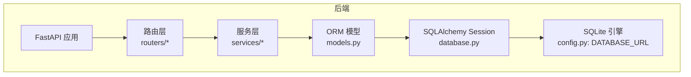
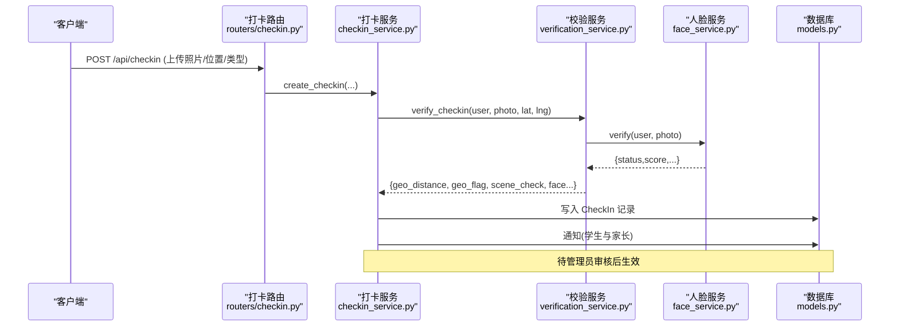
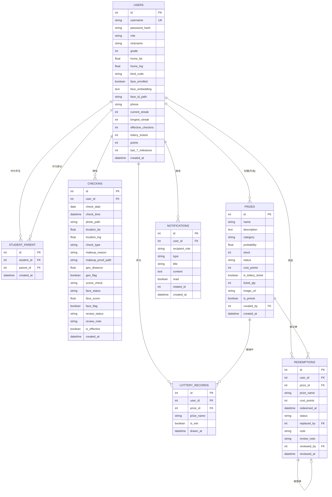
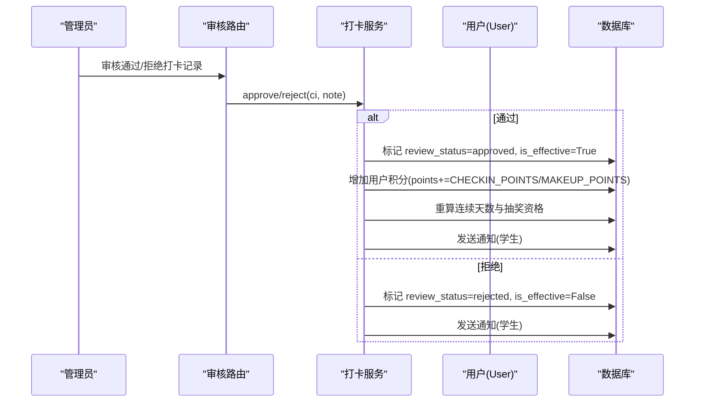
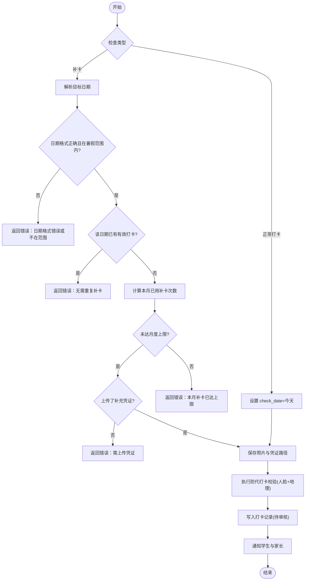
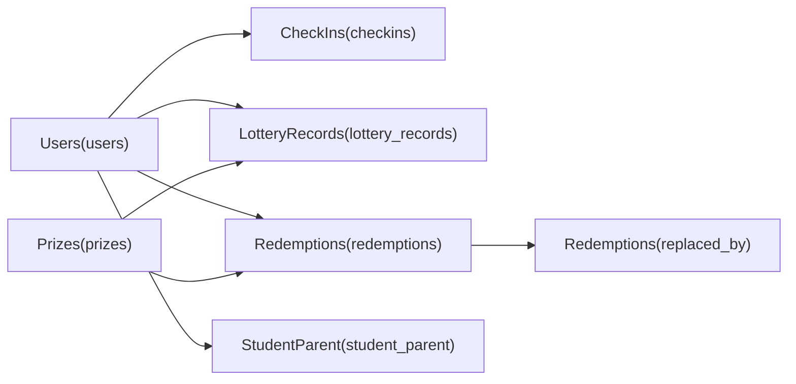

# 数据库设计

<cite>
**本文引用的文件**
- [models.py](file://summer-homework-checkin/backend/app/models.py)
- [database.py](file://summer-homework-checkin/backend/app/database.py)
- [config.py](file://summer-homework-checkin/backend/app/config.py)
- [schemas.py](file://summer-homework-checkin/backend/app/schemas.py)
- [checkin_service.py](file://summer-homework-checkin/backend/app/services/checkin_service.py)
- [verification_service.py](file://summer-homework-checkin/backend/app/services/verification_service.py)
- [face_service.py](file://summer-homework-checkin/backend/app/services/face_service.py)
- [seed.py](file://summer-homework-checkin/backend/seed.py)
- [routers/checkin.py](file://summer-homework-checkin/backend/app/routers/checkin.py)
- [routers/prize.py](file://summer-homework-checkin/backend/app/routers/prize.py)
- [routers/lottery.py](file://summer-homework-checkin/backend/app/routers/lottery.py)
</cite>

## 目录
1. [引言](#引言)
2. [项目结构](#项目结构)
3. [核心组件](#核心组件)
4. [架构总览](#架构总览)
5. [详细组件分析](#详细组件分析)
6. [依赖关系分析](#依赖关系分析)
7. [性能与索引策略](#性能与索引策略)
8. [数据验证与业务规则](#数据验证与业务规则)
9. [迁移与部署建议](#迁移与部署建议)
10. [故障排查指南](#故障排查指南)
11. [结论](#结论)

## 引言
本文件面向暑假作业打卡系统的数据库设计与实现，覆盖实体关系、字段定义、数据类型、外键约束、索引策略、数据验证与完整性约束、性能优化、示例数据与迁移方案，并给出 SQLite 使用场景与向生产环境数据库迁移的建议。文档以代码级事实为依据，结合服务层校验与路由接口行为，确保读者既能理解表结构设计，也能把握业务规则在数据层的落地方式。

## 项目结构
系统后端基于 FastAPI + SQLAlchemy，采用 ORM 模型驱动数据库结构。核心数据模型集中在 models.py，配置与连接在 database.py 与 config.py，业务规则在服务层（services）中实现，路由层（routers）暴露 API。

图表来源
- [database.py:1-22](file://summer-homework-checkin/backend/app/database.py#L1-L22)
- [config.py:15-17](file://summer-homework-checkin/backend/app/config.py#L15-L17)
- [routers/checkin.py:1-80](file://summer-homework-checkin/backend/app/routers/checkin.py#L1-L80)
- [routers/prize.py:1-66](file://summer-homework-checkin/backend/app/routers/prize.py#L1-L66)
- [routers/lottery.py:1-30](file://summer-homework-checkin/backend/app/routers/lottery.py#L1-L30)

章节来源
- [database.py:1-22](file://summer-homework-checkin/backend/app/database.py#L1-L22)
- [config.py:15-17](file://summer-homework-checkin/backend/app/config.py#L15-L17)

## 核心组件
本节聚焦核心数据模型及其职责：用户与角色、家长绑定、打卡记录、人脸信息、奖品、抽奖记录、兑换记录、通知等。

- 用户表（users）
  - 统一用户表，通过 role 区分学生/家长/管理员；包含基础信息、学生与家长专属字段、统计冗余字段、人脸识别相关字段。
- 家长-孩子绑定表（student_parent）
  - 多对多关系的中间表，关联两个用户（学生与家长）。
- 打卡记录表（checkins）
  - 记录每次打卡详情，含照片路径、位置、补卡信息、风控标记、审核状态、有效性等。
- 人脸信息（存储于 users 表）
  - face_enrolled、face_embedding（JSON 向量）、face_id_path 三字段承载人脸底图与特征。
- 奖品表（prizes）
  - 支持积分兑换与抽奖机会两类奖品，含概率、库存、状态、成本积分等。
- 抽奖记录表（lottery_records）
  - 记录每次抽奖结果与时间。
- 兑换记录表（redemptions）
  - 记录积分兑换行为，支持“直接选择替换”的链式替换。
- 通知表（notifications）
  - 站内通知，面向学生与家长。

章节来源
- [models.py:11-176](file://summer-homework-checkin/backend/app/models.py#L11-L176)

## 架构总览
下图展示从客户端到数据库的关键调用路径与数据落库点，体现打卡、人脸校验、审核、积分发放与通知的业务闭环。

图表来源
- [routers/checkin.py:17-37](file://summer-homework-checkin/backend/app/routers/checkin.py#L17-L37)
- [checkin_service.py:64-163](file://summer-homework-checkin/backend/app/services/checkin_service.py#L64-L163)
- [verification_service.py:19-70](file://summer-homework-checkin/backend/app/services/verification_service.py#L19-L70)
- [face_service.py:99-125](file://summer-homework-checkin/backend/app/services/face_service.py#L99-L125)
- [models.py:70-96](file://summer-homework-checkin/backend/app/models.py#L70-L96)

## 详细组件分析

### 实体关系图（ER）

图表来源
- [models.py:11-176](file://summer-homework-checkin/backend/app/models.py#L11-L176)

#### 用户表（users）
- 主键：id（自增整数）
- 唯一与索引：username 唯一且建索引；role 用于角色控制
- 角色与扩展字段：
  - role：student | parent | admin
  - 学生：grade、home_lat/lng、bind_code、face_* 系列
  - 家长：phone
- 统计冗余字段：current_streak、longest_streak、effective_checkins、lottery_tickets、points、last_7_milestone
- 人脸信息：face_enrolled、face_embedding（JSON 512 维向量）、face_id_path
- 关系：一对多打卡记录、一对多抽奖记录、多对多家长绑定（双向）

章节来源
- [models.py:11-55](file://summer-homework-checkin/backend/app/models.py#L11-L55)

#### 家长-孩子绑定表（student_parent）
- 主键：id
- 外键：student_id、parent_id 均指向 users.id
- 用途：实现家长与学生多对多绑定，支撑家长查看与管理孩子数据

章节来源
- [models.py:57-68](file://summer-homework-checkin/backend/app/models.py#L57-L68)

#### 打卡记录表（checkins）
- 主键：id
- 外键：user_id 指向 users.id
- 关键字段：
  - check_date（自然日）、check_time（提交时间）
  - photo_path、location_lat/lng
  - check_type：normal | makeup
  - makeup_reason、makeup_proof_path（补卡凭证）
  - geo_distance、geo_flag（地理位置风险）
  - scene_check：pass | warn | pending
  - face_status、face_score、face_flag（人脸比对结果）
  - review_status：pending | approved | rejected
  - is_effective：是否计入有效打卡
- 索引：user_id、check_date 建索引，便于按用户与日期查询

章节来源
- [models.py:70-96](file://summer-homework-checkin/backend/app/models.py#L70-L96)

#### 人脸信息（嵌入 users 表）
- face_enrolled：是否已采集人脸底图
- face_embedding：JSON 字符串，保存 512 维向量
- face_id_path：人脸底图相对存储路径
- 业务影响：
  - 未采集时，打卡允许但提示建议采集
  - 已采集且比对失败（mismatch/no_face/multiple_faces），根据策略拒绝或标记高风险

章节来源
- [models.py:27-30](file://summer-homework-checkin/backend/app/models.py#L27-L30)
- [face_service.py:71-87](file://summer-homework-checkin/backend/app/services/face_service.py#L71-L87)
- [face_service.py:99-125](file://summer-homework-checkin/backend/app/services/face_service.py#L99-L125)

#### 奖品表（prizes）
- 主键：id
- 关键字段：name、description、category、probability、stock、status、cost_points、is_lottery_ticket、ticket_qty、image_url、is_preset、created_by、created_at
- 业务含义：
  - is_lottery_ticket=True 表示“抽奖机会”，兑换后增加用户抽奖券，不扣库存、不生成兑换记录
  - cost_points=0 表示不参与积分兑换

章节来源
- [models.py:103-124](file://summer-homework-checkin/backend/app/models.py#L103-L124)

#### 抽奖记录表（lottery_records）
- 主键：id
- 外键：user_id、prize_id（可为空）
- 关键字段：prize_name、is_win、drawn_at
- 用途：记录每次抽奖结果与时间

章节来源
- [models.py:126-139](file://summer-homework-checkin/backend/app/models.py#L126-L139)

#### 兑换记录表（redemptions）
- 主键：id
- 外键：user_id、prize_id、replaced_by、reviewed_by
- 关键字段：prize_name、cost_points、redeemed_at、status、note、review_note、reviewed_at
- 业务含义：
  - status：pending | fulfilled | replaced | cancelled
  - replaced_by：支持“直接选择替换”，形成链式替换

章节来源
- [models.py:141-161](file://summer-homework-checkin/backend/app/models.py#L141-L161)

#### 通知表（notifications）
- 主键：id
- 外键：user_id
- 关键字段：recipient_role、type、title、content、read、related_id、created_at
- 用途：站内通知，面向学生与家长

章节来源
- [models.py:163-176](file://summer-homework-checkin/backend/app/models.py#L163-L176)

### 关键流程时序（打卡与审核）

图表来源
- [checkin_service.py:166-209](file://summer-homework-checkin/backend/app/services/checkin_service.py#L166-L209)
- [checkin_service.py:39-61](file://summer-homework-checkin/backend/app/services/checkin_service.py#L39-L61)
- [models.py:70-96](file://summer-homework-checkin/backend/app/models.py#L70-L96)

### 复杂逻辑流程图（补卡规则）

图表来源
- [checkin_service.py:64-163](file://summer-homework-checkin/backend/app/services/checkin_service.py#L64-L163)
- [config.py:27-32](file://summer-homework-checkin/backend/app/config.py#L27-L32)

## 依赖关系分析
- 模型间依赖
  - CheckIn.user_id -> users.id
  - LotteryRecord.user_id -> users.id；LotteryRecord.prize_id -> prizes.id
  - Redemption.user_id -> users.id；Redemption.prize_id -> prizes.id；Redemption.replaced_by -> redemptions.id
  - StudentParent.student_id/parent_id -> users.id
  - Prize.created_by -> users.id
- 服务层依赖
  - 打卡服务依赖校验服务与人脸服务，最终落库 CheckIn 并触发通知
  - 人脸服务读写 users 的人脸字段
- 路由层依赖
  - 打卡、奖品、抽奖路由分别调用对应服务与模型

图表来源
- [models.py:11-176](file://summer-homework-checkin/backend/app/models.py#L11-L176)

章节来源
- [models.py:11-176](file://summer-homework-checkin/backend/app/models.py#L11-L176)

## 性能与索引策略
- 现有索引
  - users.username（唯一+索引）
  - users.id（主键）
  - checkins.user_id、checkins.check_date（索引）
  - lottery_records.user_id（索引）
  - redemptions.user_id（索引）
  - notifications.user_id（索引）
  - student_parent.student_id、student_parent.parent_id（索引）
- 建议增强索引
  - checkins.review_status：高频筛选待审/已通过记录
  - checkins.is_effective：统计有效打卡
  - redemptions.status：管理端筛选处理中的兑换
  - prizes.status：仅展示上架奖品
  - notifications.read：消息列表分页与已读筛选
- 复合索引建议
  - checkins(user_id, check_date)：按用户与日期查询更高效
  - redemptions(user_id, status)：按用户与状态组合查询
- 统计冗余字段
  - users.current_streak、longest_streak、effective_checkins、lottery_tickets、points、last_7_milestone 由服务层维护，避免频繁聚合计算

章节来源
- [models.py:11-176](file://summer-homework-checkin/backend/app/models.py#L11-L176)
- [checkin_service.py:39-61](file://summer-homework-checkin/backend/app/services/checkin_service.py#L39-L61)

## 数据验证与业务规则
- 图片校验
  - 体积与尺寸限制：最小 5KB、最大 10MB，最小边长 200px
  - 格式校验：JPEG/PNG
- 补卡规则
  - 只能补过去日期，且需在暑假统计范围内
  - 同一日期不可重复补卡（已有有效打卡则不允许）
  - 单月补卡次数上限（可环境变量覆盖）
  - 补卡需上传补充凭证
- 人脸策略
  - 未采集：允许打卡但提示建议采集
  - 已采集且比对失败：根据 FACE_MODE_ON_ENROLLED 策略拒绝或标记高风险
  - 模型不可用：明确提示，不静默放行
- 地理位置一致性
  - 若提供家庭坐标与打卡坐标，计算距离并标记远距风险
- 审核与积分
  - 审核通过后标记有效，发放积分（正常打卡/补卡不同分值）
  - 连续天数达到 7 的倍数解锁抽奖资格，并发通知
- 奖品与抽奖
  - 抽奖机会类奖品兑换后增加用户抽奖券，不扣库存、不生成兑换记录
  - 普通奖品兑换扣减库存（如需要）并生成兑换记录

章节来源
- [config.py:27-50](file://summer-homework-checkin/backend/app/config.py#L27-L50)
- [checkin_service.py:64-163](file://summer-homework-checkin/backend/app/services/checkin_service.py#L64-L163)
- [checkin_service.py:166-209](file://summer-homework-checkin/backend/app/services/checkin_service.py#L166-L209)
- [face_service.py:71-125](file://summer-homework-checkin/backend/app/services/face_service.py#L71-L125)
- [routers/prize.py:25-39](file://summer-homework-checkin/backend/app/routers/prize.py#L25-L39)

## 迁移与部署建议
- 初始化与种子数据
  - 使用 seed.py 创建表结构与预设奖品池，并创建默认管理员账号
- SQLite 使用场景
  - 轻量、零配置、可持久化，适合开发测试与小规模运行
- 生产环境迁移建议
  - 将 DATABASE_URL 切换为 PostgreSQL/MySQL 等生产数据库 URL
  - 调整连接参数（线程安全、连接池大小、超时等）
  - 针对热点查询建立复合索引与必要的外键约束
  - 引入事务隔离级别与锁策略，保障并发下的积分与库存一致性
  - 备份与恢复策略：定期导出 SQL 或使用数据库原生工具
  - 监控与审计：开启慢查询日志、访问日志与错误告警

章节来源
- [database.py:1-22](file://summer-homework-checkin/backend/app/database.py#L1-L22)
- [config.py:15-17](file://summer-homework-checkin/backend/app/config.py#L15-L17)
- [seed.py:44-77](file://summer-homework-checkin/backend/seed.py#L44-L77)

## 故障排查指南
- 人脸服务不可用
  - 现象：打卡返回“人脸识别服务暂不可用”
  - 排查：确认 insightface 安装与模型下载；检查 face_service 可用性
- 补卡失败
  - 现象：日期不在暑假范围、已达月度上限、缺少凭证
  - 排查：核对补卡日期、当月补卡次数、凭证上传
- 审核异常
  - 现象：重复审核、积分未增加
  - 排查：检查 review_status 与 is_effective 状态流转；确认积分发放逻辑
- 奖品问题
  - 现象：概率越界、类别非法
  - 排查：校验输入范围与枚举值；确认奖品状态与库存

章节来源
- [checkin_service.py:64-163](file://summer-homework-checkin/backend/app/services/checkin_service.py#L64-L163)
- [checkin_service.py:166-209](file://summer-homework-checkin/backend/app/services/checkin_service.py#L166-L209)
- [face_service.py:99-125](file://summer-homework-checkin/backend/app/services/face_service.py#L99-L125)
- [routers/prize.py:25-39](file://summer-homework-checkin/backend/app/routers/prize.py#L25-L39)

## 结论
本数据库设计围绕“防代打卡、可审核、可追溯”的核心目标，通过统一的用户模型、严格的打卡校验与审核流程、完善的通知与统计机制，构建了可扩展的打卡系统数据层。配合合理的索引与冗余字段，兼顾了性能与可读性。未来可按需扩展至更复杂的身份识别与风控体系，并在生产环境中进行数据库迁移与性能调优。