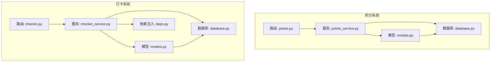
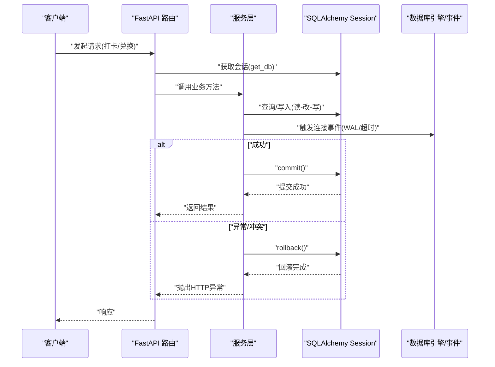
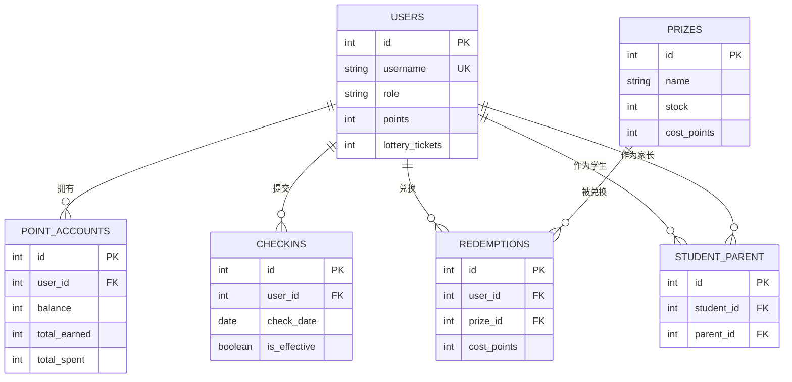
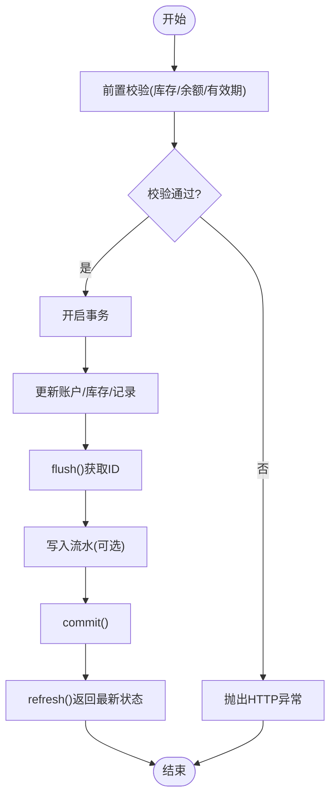
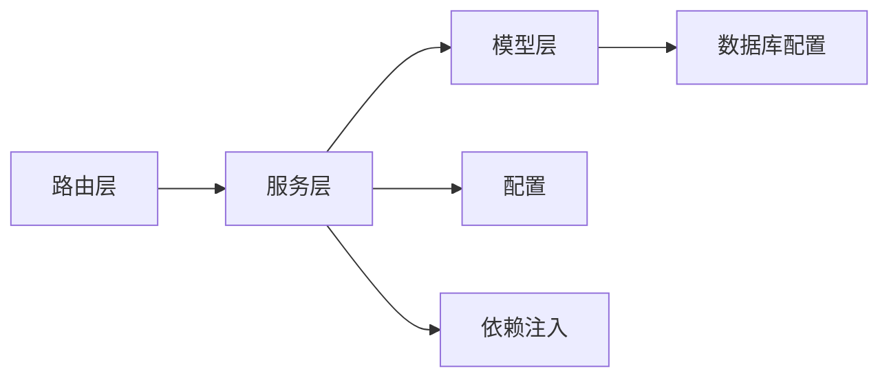

# 数据模型最佳实践

<cite>
**本文引用的文件**   
- [points-system/backend/app/models.py](file://points-system/backend/app/models.py)
- [summer-homework-checkin/backend/app/models.py](file://summer-homework-checkin/backend/app/models.py)
- [points-system/backend/app/database.py](file://points-system/backend/app/database.py)
- [summer-homework-checkin/backend/app/database.py](file://summer-homework-checkin/backend/app/database.py)
- [points-system/backend/app/services/points_service.py](file://points-system/backend/app/services/points_service.py)
- [summer-homework-checkin/backend/app/services/checkin_service.py](file://summer-homework-checkin/backend/app/services/checkin_service.py)
- [points-system/backend/app/routers/points.py](file://points-system/backend/app/routers/points.py)
- [summer-homework-checkin/backend/app/routers/checkin.py](file://summer-homework-checkin/backend/app/routers/checkin.py)
- [points-system/backend/app/config.py](file://points-system/backend/app/config.py)
- [summer-homework-checkin/backend/app/config.py](file://summer-homework-checkin/backend/app/config.py)
- [summer-homework-checkin/backend/app/deps.py](file://summer-homework-checkin/backend/app/deps.py)
</cite>

## 目录
1. [引言](#引言)
2. [项目结构](#项目结构)
3. [核心组件](#核心组件)
4. [架构总览](#架构总览)
5. [详细组件分析](#详细组件分析)
6. [依赖关系分析](#依赖关系分析)
7. [性能考虑](#性能考虑)
8. [故障排查指南](#故障排查指南)
9. [结论](#结论)
10. [附录](#附录)

## 引言
本指南基于两个后端系统（积分系统与暑假打卡系统）的 SQLAlchemy ORM 数据建模与事务处理实践，总结通用数据建模原则、SQLAlchemy 使用最佳实践、一致性保证机制、并发控制策略以及性能优化技巧。文档面向具备基础 Python/FastAPI 经验的读者，力求以循序渐进的方式呈现从概念到代码级实现的关键要点，并提供可操作的排错建议。

## 项目结构
两个系统均采用 FastAPI + SQLAlchemy 的典型分层：
- 路由层：接收请求、参数校验、调用服务层
- 服务层：业务规则、事务边界、一致性保障
- 模型层：ORM 映射、字段约束、关系定义
- 数据库配置：引擎、会话、初始化、事件监听

图表来源
- [points-system/backend/app/routers/points.py:1-28](file://points-system/backend/app/routers/points.py#L1-L28)
- [points-system/backend/app/services/points_service.py:1-146](file://points-system/backend/app/services/points_service.py#L1-L146)
- [points-system/backend/app/models.py:1-151](file://points-system/backend/app/models.py#L1-L151)
- [points-system/backend/app/database.py:1-39](file://points-system/backend/app/database.py#L1-L39)
- [summer-homework-checkin/backend/app/routers/checkin.py:1-80](file://summer-homework-checkin/backend/app/routers/checkin.py#L1-L80)
- [summer-homework-checkin/backend/app/services/checkin_service.py:1-254](file://summer-homework-checkin/backend/app/services/checkin_service.py#L1-L254)
- [summer-homework-checkin/backend/app/models.py:1-212](file://summer-homework-checkin/backend/app/models.py#L1-L212)
- [summer-homework-checkin/backend/app/database.py:1-22](file://summer-homework-checkin/backend/app/database.py#L1-L22)
- [summer-homework-checkin/backend/app/deps.py:1-34](file://summer-homework-checkin/backend/app/deps.py#L1-L34)

章节来源
- [points-system/backend/app/routers/points.py:1-28](file://points-system/backend/app/routers/points.py#L1-L28)
- [summer-homework-checkin/backend/app/routers/checkin.py:1-80](file://summer-homework-checkin/backend/app/routers/checkin.py#L1-L80)

## 核心组件
- 统一用户表与角色扩展
  - 打卡系统采用单 User 表并通过 role 区分学生/家长/管理员，配合多对多绑定表 StudentParent 表达“家长-孩子”关系。
  - 积分系统将用户与账户解耦，User 仅作为主体，PointAccount 记录余额与累计收支，避免在用户表中堆叠业务字段。
- 流水表设计
  - 积分系统通过 PointLedger 记录每一笔收入/支出，并保存 balance_after 用于对账；兑换与抽奖券发放均落流水。
  - 打卡系统不单独维护流水表，而是通过 CheckIn 审核通过后直接更新用户冗余字段（如 points、连续天数、抽奖资格），属于“宽表+冗余”的设计。
- 防重与唯一约束
  - 打卡系统在数据库层通过 (user_id, check_date) 唯一约束兜底重复打卡；服务层先查后写，双重防护。
- 状态机与审核流
  - 打卡系统引入 review_status、is_effective 等字段，形成“提交-审核-生效”的状态机；积分系统则通过流水与账户余额体现变更。
- 奖品与库存
  - 两套系统均存在 Prize 表，但语义不同：积分系统侧重成本与有效期；打卡系统支持“抽奖机会”类奖品，兑换后增加抽奖券且不扣库存。

章节来源
- [summer-homework-checkin/backend/app/models.py:11-68](file://summer-homework-checkin/backend/app/models.py#L11-L68)
- [points-system/backend/app/models.py:10-33](file://points-system/backend/app/models.py#L10-L33)
- [points-system/backend/app/models.py:35-48](file://points-system/backend/app/models.py#L35-L48)
- [summer-homework-checkin/backend/app/models.py:70-96](file://summer-homework-checkin/backend/app/models.py#L70-L96)
- [points-system/backend/app/models.py:68-94](file://points-system/backend/app/models.py#L68-L94)
- [summer-homework-checkin/backend/app/models.py:103-139](file://summer-homework-checkin/backend/app/models.py#L103-L139)

## 架构总览
下图展示两个系统的端到端数据流与关键一致性点：

图表来源
- [points-system/backend/app/routers/points.py:10-27](file://points-system/backend/app/routers/points.py#L10-L27)
- [summer-homework-checkin/backend/app/routers/checkin.py:17-37](file://summer-homework-checkin/backend/app/routers/checkin.py#L17-L37)
- [points-system/backend/app/services/points_service.py:41-91](file://points-system/backend/app/services/points_service.py#L41-L91)
- [summer-homework-checkin/backend/app/services/checkin_service.py:64-163](file://summer-homework-checkin/backend/app/services/checkin_service.py#L64-L163)
- [points-system/backend/app/database.py:16-23](file://points-system/backend/app/database.py#L16-L23)

## 详细组件分析

### 命名规范与字段设计模式
- 表名与字段名
  - 表名采用复数小写下划线（users、point_accounts、checkins、prizes）。
  - 主键统一为 id，外键遵循 <实体>_id 命名（user_id、prize_id）。
  - 时间戳字段使用 created_at、updated_at，默认值使用 UTC 时间。
- 布尔与枚举
  - 使用 Boolean 表示开关（face_enrolled、is_effective、is_win）。
  - 使用 String 列承载有限状态（review_status、status、tx_type），便于扩展与可读性。
- 冗余字段与快照
  - 打卡系统对用户表冗余 current_streak、longest_streak、effective_checkins、lottery_tickets、points 等，减少复杂聚合查询。
  - 兑换记录中 cost_points 做快照，避免后续奖品价格变动影响历史对账。
- 索引与唯一约束
  - 高频查询字段加 index（user_id、check_date、created_at）。
  - 防重通过 UniqueConstraint(user_id, check_date) 兜底。

章节来源
- [points-system/backend/app/models.py:10-48](file://points-system/backend/app/models.py#L10-L48)
- [summer-homework-checkin/backend/app/models.py:11-44](file://summer-homework-checkin/backend/app/models.py#L11-L44)
- [summer-homework-checkin/backend/app/models.py:70-96](file://summer-homework-checkin/backend/app/models.py#L70-L96)
- [points-system/backend/app/models.py:50-66](file://points-system/backend/app/models.py#L50-L66)

### 关系映射策略
- 一对一/一对多
  - User 与 PointAccount 为一对一（通过 user_id 唯一外键）。
  - User 与 CheckIn 为一对多，CheckIn.user 反向引用。
- 多对多
  - StudentParent 作为中间表，表达 users 自关联的多对多（学生与家长）。
- 软关联与快照
  - Redemption/LotteryDraw 保留 prize_name 快照，避免奖品改名导致历史不可读。

图表来源
- [points-system/backend/app/models.py:10-94](file://points-system/backend/app/models.py#L10-L94)
- [summer-homework-checkin/backend/app/models.py:11-161](file://summer-homework-checkin/backend/app/models.py#L11-L161)

章节来源
- [points-system/backend/app/models.py:20-33](file://points-system/backend/app/models.py#L20-L33)
- [summer-homework-checkin/backend/app/models.py:57-68](file://summer-homework-checkin/backend/app/models.py#L57-L68)
- [summer-homework-checkin/backend/app/models.py:141-161](file://summer-homework-checkin/backend/app/models.py#L141-L161)

### 事务处理与一致性保证
- 事务边界
  - 所有“读-改-写”操作在同一 Session 内完成，成功 commit，异常 rollback。
- 并发安全
  - 打卡系统通过唯一约束兜底重复打卡；服务层捕获 IntegrityError 并返回 409。
  - 积分系统注释指出 SQLite 行锁有限，建议迁移至 PostgreSQL 并使用 with_for_update() 悲观锁。
- 审核流一致性
  - 打卡系统审核通过时，先标记有效，再更新用户积分与统计，最后重算连续天数与奖励，全部在各自事务中提交。

图表来源
- [points-system/backend/app/services/points_service.py:94-146](file://points-system/backend/app/services/points_service.py#L94-L146)
- [summer-homework-checkin/backend/app/services/checkin_service.py:166-191](file://summer-homework-checkin/backend/app/services/checkin_service.py#L166-L191)

章节来源
- [points-system/backend/app/services/points_service.py:41-91](file://points-system/backend/app/services/points_service.py#L41-L91)
- [summer-homework-checkin/backend/app/services/checkin_service.py:64-163](file://summer-homework-checkin/backend/app/services/checkin_service.py#L64-L163)

### 并发控制策略
- 乐观锁/唯一约束兜底
  - 打卡系统通过 (user_id, check_date) 唯一约束防止并发重复打卡。
- 悲观锁建议
  - 积分系统注释建议在 PostgreSQL 上使用 with_for_update() 锁定账户与奖品行，避免高并发下超卖或余额不一致。
- 数据库级保护
  - SQLite 开启 WAL 日志与 busy_timeout，降低写忙等待导致的失败率。

章节来源
- [points-system/backend/app/models.py:63-65](file://points-system/backend/app/models.py#L63-L65)
- [points-system/backend/app/services/points_service.py:94-146](file://points-system/backend/app/services/points_service.py#L94-L146)
- [points-system/backend/app/database.py:16-23](file://points-system/backend/app/database.py#L16-L23)

### SQLAlchemy ORM 最佳实践
- 模型继承
  - 当前未使用表继承，推荐在需要共享公共字段（如审计字段）时使用混合基类或声明式继承。
- 混合属性
  - 打卡模型提供 photo_url 计算属性，封装存储路径到 URL 的转换逻辑，提升模型可读性与复用性。
- 自定义验证器
  - 服务层集中实现业务校验（图片大小、人脸相似度阈值、补卡次数上限），避免在模型层散落校验逻辑。
- 事件监听器
  - 数据库连接事件设置 SQLite PRAGMA（WAL、busy_timeout），提升并发读写稳定性。

章节来源
- [summer-homework-checkin/backend/app/models.py:97-101](file://summer-homework-checkin/backend/app/models.py#L97-L101)
- [summer-homework-checkin/backend/app/services/checkin_service.py:212-222](file://summer-homework-checkin/backend/app/services/checkin_service.py#L212-L222)
- [points-system/backend/app/database.py:16-23](file://points-system/backend/app/database.py#L16-L23)

### 数据一致性机制
- 流水对账
  - 积分系统通过 PointLedger 记录每次余额变化后的 balance_after，便于对账与审计。
- 快照字段
  - 兑换记录保存 cost_points、prize_name 快照，确保历史可追溯。
- 冗余字段维护
  - 打卡系统在服务层统一维护用户冗余字段（current_streak、lottery_tickets、points），避免频繁聚合计算。

章节来源
- [points-system/backend/app/models.py:35-48](file://points-system/backend/app/models.py#L35-L48)
- [summer-homework-checkin/backend/app/models.py:141-161](file://summer-homework-checkin/backend/app/models.py#L141-L161)
- [summer-homework-checkin/backend/app/services/checkin_service.py:39-61](file://summer-homework-checkin/backend/app/services/checkin_service.py#L39-L61)

### 常见陷阱与避免方法
- 忘记 flush 导致无法获取 ID
  - 在写入后立即 flush 以获取自增 ID，用于流水 ref_id 关联。
- 事务未正确提交/回滚
  - 统一在 try/except 中 commit/rollback，避免半更新。
- 并发重复打卡
  - 依赖唯一约束兜底，捕获 IntegrityError 并返回 409。
- 奖品过期/库存不足
  - 在事务前进行强校验，避免进入事务后再失败造成不必要的开销。

章节来源
- [points-system/backend/app/services/points_service.py:64-82](file://points-system/backend/app/services/points_service.py#L64-L82)
- [points-system/backend/app/services/points_service.py:94-146](file://points-system/backend/app/services/points_service.py#L94-L146)

## 依赖关系分析
- 模块耦合
  - 路由层依赖服务层与数据库会话；服务层依赖模型与配置；模型依赖 Base 与 Column 定义。
- 外部依赖
  - 配置文件集中管理规则（打卡积分、人脸识别阈值、上传目录等），便于环境切换与测试覆盖。
- 依赖注入
  - 使用 FastAPI Depends 注入认证用户与会话，简化权限校验与资源清理。

图表来源
- [summer-homework-checkin/backend/app/routers/checkin.py:1-80](file://summer-homework-checkin/backend/app/routers/checkin.py#L1-L80)
- [summer-homework-checkin/backend/app/services/checkin_service.py:1-254](file://summer-homework-checkin/backend/app/services/checkin_service.py#L1-L254)
- [summer-homework-checkin/backend/app/config.py:1-50](file://summer-homework-checkin/backend/app/config.py#L1-L50)
- [summer-homework-checkin/backend/app/deps.py:1-34](file://summer-homework-checkin/backend/app/deps.py#L1-L34)
- [points-system/backend/app/database.py:1-39](file://points-system/backend/app/database.py#L1-L39)

章节来源
- [points-system/backend/app/config.py:1-17](file://points-system/backend/app/config.py#L1-L17)
- [summer-homework-checkin/backend/app/config.py:1-50](file://summer-homework-checkin/backend/app/config.py#L1-L50)
- [summer-homework-checkin/backend/app/deps.py:1-34](file://summer-homework-checkin/backend/app/deps.py#L1-L34)

## 性能考虑
- 懒加载与预加载
  - 默认关系为懒加载，适合按需访问；批量读取时可考虑 eager loading（如 joinedload）以减少 N+1 查询。
- 查询优化
  - 针对高频过滤条件建立索引（user_id、check_date、created_at）。
  - 分页与限制 limit，避免一次性拉取大量数据。
- 索引设计
  - 复合索引场景：若经常按 (user_id, check_date) 查询，可考虑复合索引以提升去重与范围扫描效率。
- 连接池与并发
  - SQLite 使用 WAL 与 busy_timeout 提升并发稳定性；生产环境建议迁移至 PostgreSQL 并启用连接池与行级锁。

[本节为通用指导，不直接分析具体文件]

## 故障排查指南
- 重复打卡冲突
  - 现象：并发提交同一用户同一天打卡返回冲突。
  - 定位：检查唯一约束与 IntegrityError 捕获逻辑。
- 奖品兑换失败
  - 现象：库存不足或余额不足导致兑换失败。
  - 定位：确认事务前校验逻辑与余额/库存更新顺序。
- 打卡审核未生效
  - 现象：审核通过后用户积分未更新。
  - 定位：检查审核流程中的多次 commit 与 refresh 顺序。

章节来源
- [points-system/backend/app/services/points_service.py:77-82](file://points-system/backend/app/services/points_service.py#L77-L82)
- [summer-homework-checkin/backend/app/services/checkin_service.py:166-191](file://summer-homework-checkin/backend/app/services/checkin_service.py#L166-L191)

## 结论
两个系统在数据建模上体现了清晰的职责划分与一致性保障：积分系统强调流水与账户分离，打卡系统强调审核流与冗余字段维护。通过唯一约束、事务原子性与服务层校验的组合，实现了可靠的并发控制与数据一致性。在生产环境中，建议结合数据库特性（如 PostgreSQL 的行锁与连接池）进一步优化并发与性能。

[本节为总结性内容，不直接分析具体文件]

## 附录
- 配置项参考
  - 积分系统：打卡积分、连续奖励、兑换比例等。
  - 打卡系统：地理阈值、补卡上限、照片尺寸、人脸识别阈值等。

章节来源
- [points-system/backend/app/config.py:1-17](file://points-system/backend/app/config.py#L1-L17)
- [summer-homework-checkin/backend/app/config.py:1-50](file://summer-homework-checkin/backend/app/config.py#L1-L50)