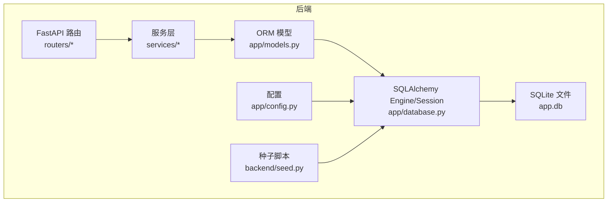
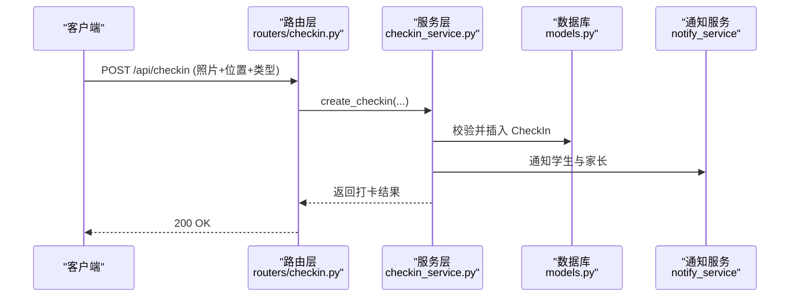
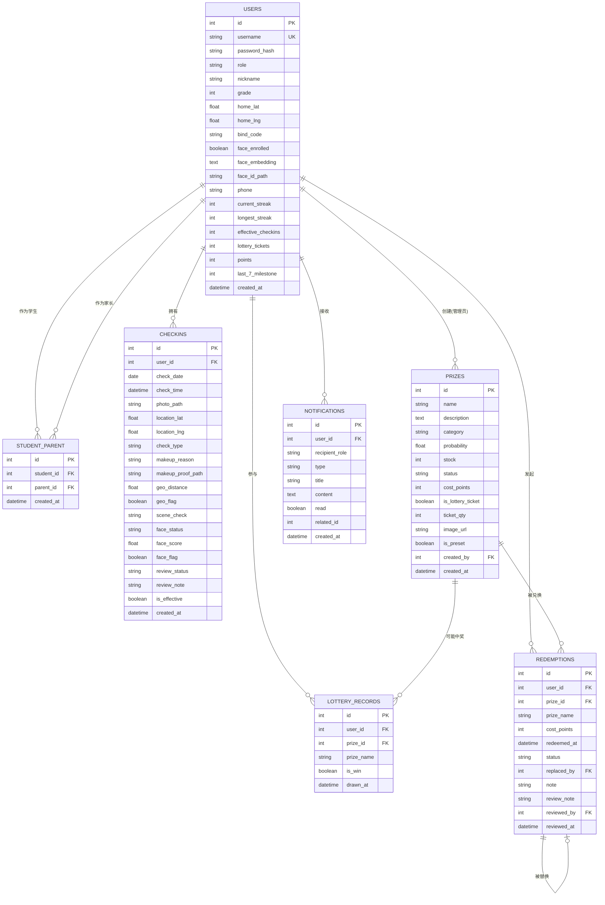
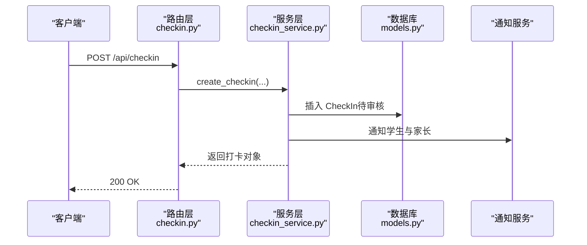
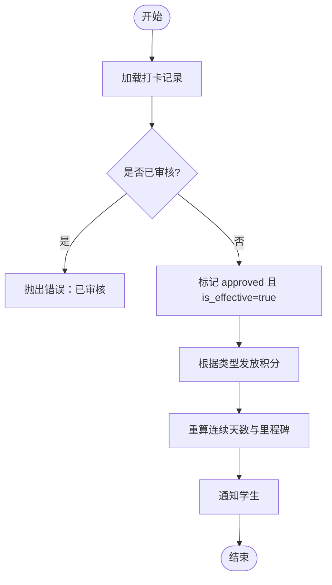
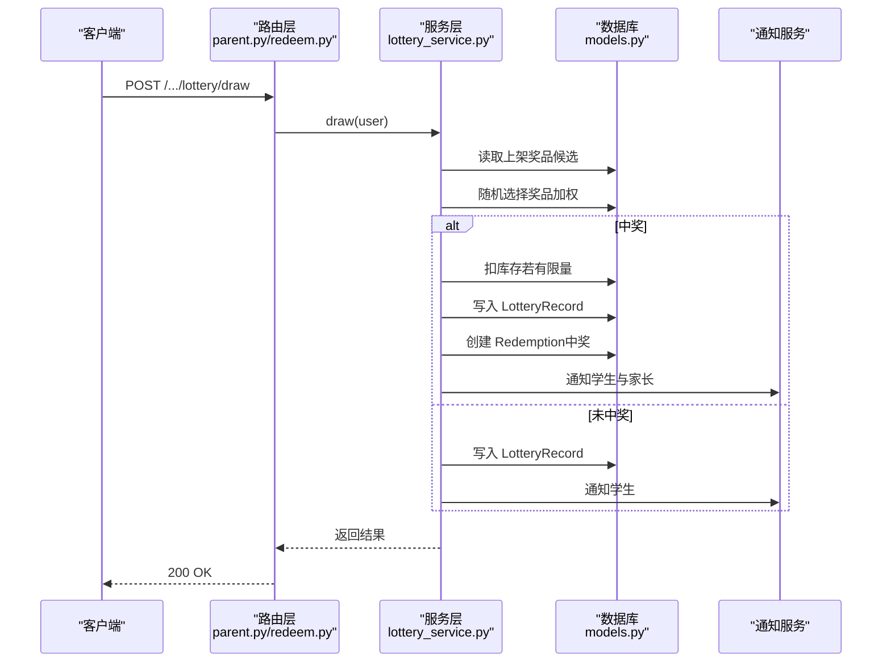
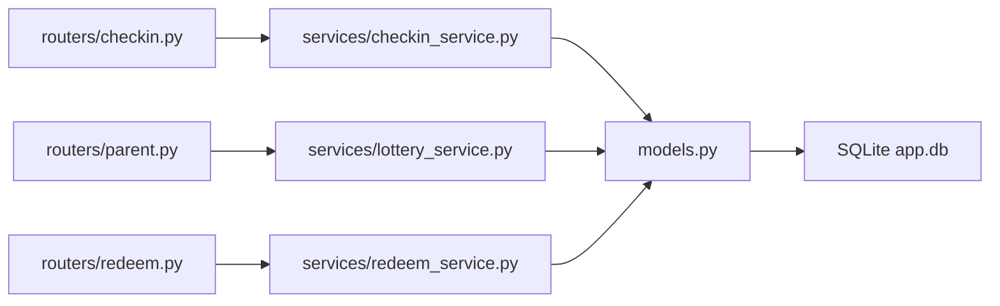
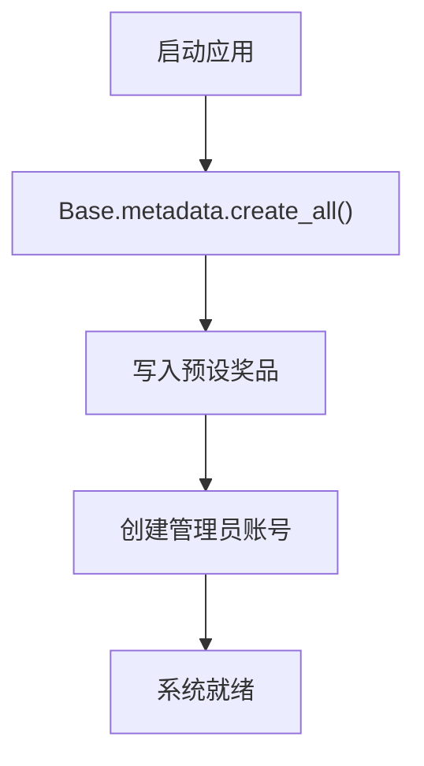

# 暑假作业打卡系统数据库设计

<cite>
**本文引用的文件**   
- [models.py](file://summer-homework-checkin/backend/app/models.py)
- [database.py](file://summer-homework-checkin/backend/app/database.py)
- [config.py](file://summer-homework-checkin/backend/app/config.py)
- [schemas.py](file://summer-homework-checkin/backend/app/schemas.py)
- [seed.py](file://summer-homework-checkin/backend/seed.py)
- [checkin_service.py](file://summer-homework-checkin/backend/app/services/checkin_service.py)
- [lottery_service.py](file://summer-homework-checkin/backend/app/services/lottery_service.py)
- [checkin.py](file://summer-homework-checkin/backend/app/routers/checkin.py)
- [parent.py](file://summer-homework-checkin/backend/app/routers/parent.py)
- [prize.py](file://summer-homework-checkin/backend/app/routers/prize.py)
- [redeem.py](file://summer-homework-checkin/backend/app/routers/redeem.py)
- [report.py](file://summer-homework-checkin/backend/app/routers/report.py)
</cite>

## 目录
1. [引言](#引言)
2. [项目结构](#项目结构)
3. [核心组件](#核心组件)
4. [架构总览](#架构总览)
5. [详细组件分析](#详细组件分析)
6. [依赖关系分析](#依赖关系分析)
7. [性能与索引策略](#性能与索引策略)
8. [数据验证与完整性约束](#数据验证与完整性约束)
9. [示例数据与迁移方案](#示例数据与迁移方案)
10. [故障排查指南](#故障排查指南)
11. [结论](#结论)

## 引言
本文件面向“暑假作业打卡系统”的数据库设计，围绕用户（学生/家长/管理员）、打卡记录、人脸信息、积分账户、奖品管理、抽奖记录、家长-孩子绑定、通知等核心实体进行系统化说明。文档包含表结构设计、字段定义、数据类型与约束、外键关系与关联查询模式、索引策略、数据验证规则、ER 图、示例数据与迁移方案，并结合 SQLite 的使用场景给出性能优化建议。

## 项目结构
后端采用 FastAPI + SQLAlchemy ORM + SQLite 的组合：
- 模型定义位于 models.py，映射到 SQLite 表
- 数据库连接与 Session 管理在 database.py
- 业务规则集中在 services 层（如 checkin_service、lottery_service）
- API 路由在 routers 下，负责参数校验与调用服务层
- 配置项（含 SQLite 路径、阈值、常量）在 config.py
- 种子脚本 seed.py 用于初始化预设奖品与管理员账号

图表来源
- [database.py:1-22](file://summer-homework-checkin/backend/app/database.py#L1-L22)
- [config.py:15-17](file://summer-homework-checkin/backend/app/config.py#L15-L17)
- [seed.py:44-72](file://summer-homework-checkin/backend/seed.py#L44-L72)

章节来源
- [database.py:1-22](file://summer-homework-checkin/backend/app/database.py#L1-L22)
- [config.py:15-17](file://summer-homework-checkin/backend/app/config.py#L15-L17)
- [seed.py:44-72](file://summer-homework-checkin/backend/seed.py#L44-L72)

## 核心组件
本节聚焦数据库核心表及其职责：
- 用户表 users：统一承载学生、家长、管理员三类角色；内置打卡统计冗余字段与人脸识别相关字段
- 家长-孩子绑定 student_parent：多对多关系的中间表
- 打卡记录 checkins：记录每次打卡详情、审核状态、地理与人脸校验结果
- 奖品 prizes：支持普通奖品与“抽奖机会”特殊奖品
- 抽奖记录 lottery_records：记录每次抽奖行为与结果
- 兑换记录 redemptions：积分兑换或抽奖中奖后的兑换申请与审核流转
- 通知 notifications：站内消息，覆盖学生与家长

章节来源
- [models.py:11-176](file://summer-homework-checkin/backend/app/models.py#L11-L176)

## 架构总览
从数据流角度，关键流程包括：
- 打卡提交：路由接收上传与表单 -> 服务层执行照片/人脸/地理校验 -> 写入 checkins -> 发送通知
- 审核通过：更新 is_effective 与 review_status -> 发放积分 -> 重算连续天数与抽奖资格 -> 发送通知
- 抽奖：消耗抽奖券 -> 按概率抽取奖品 -> 扣库存（若有限量）-> 写入抽奖记录 -> 中奖则创建兑换记录 -> 发送通知
- 积分兑换：校验余额与库存 -> 扣积分 -> 创建兑换记录 -> 可选替换旧兑换 -> 返回结果

图表来源
- [checkin.py:17-37](file://summer-homework-checkin/backend/app/routers/checkin.py#L17-L37)
- [checkin_service.py:64-163](file://summer-homework-checkin/backend/app/services/checkin_service.py#L64-L163)
- [models.py:70-96](file://summer-homework-checkin/backend/app/models.py#L70-L96)

## 详细组件分析

### ER 关系图

图表来源
- [models.py:11-176](file://summer-homework-checkin/backend/app/models.py#L11-L176)

### 表结构与字段说明

- 用户表 users
  - 主键：id（自增整数）
  - 唯一与索引：username（唯一、索引）
  - 关键字段：password_hash、role（student/parent/admin）、nickname
  - 学生扩展：grade、home_lat、home_lng、bind_code
  - 人脸信息：face_enrolled、face_embedding（JSON 向量）、face_id_path
  - 家长扩展：phone
  - 统计冗余：current_streak、longest_streak、effective_checkins、lottery_tickets、points、last_7_milestone
  - 时间戳：created_at
  - 关系：一对多打卡、一对多抽奖记录、双向绑定（学生/家长）

- 家长-孩子绑定 student_parent
  - 主键：id
  - 外键：student_id、parent_id 均指向 users.id
  - 时间戳：created_at
  - 关系：多对多中间表

- 打卡记录 checkins
  - 主键：id
  - 外键：user_id 指向 users.id
  - 关键字段：check_date、check_time、photo_path、location_lat/lng、check_type（normal/makeup）、makeup_reason、makeup_proof_path
  - 风控字段：geo_distance、geo_flag、scene_check、face_status、face_score、face_flag
  - 审核字段：review_status（pending/approved/rejected）、review_note、is_effective
  - 时间戳：created_at
  - 关系：属于用户

- 奖品 prizes
  - 主键：id
  - 关键字段：name、description、category（stationery/outdoor/interest）、probability、stock（-1 表示不限量）、status（on/off）、cost_points、is_lottery_ticket、ticket_qty、image_url、is_preset
  - 外键：created_by 指向 users.id（管理员）
  - 时间戳：created_at

- 抽奖记录 lottery_records
  - 主键：id
  - 外键：user_id 指向 users.id；prize_id 指向 prizes.id（可为空）
  - 关键字段：prize_name、is_win、drawn_at

- 兑换记录 redemptions
  - 主键：id
  - 外键：user_id 指向 users.id；prize_id 指向 prizes.id；replaced_by 指向 redemptions.id（自身引用，支持替换）；reviewed_by 指向 users.id（操作管理员）
  - 关键字段：prize_name、cost_points、redeemed_at、status（pending/fulfilled/replaced/cancelled）、note、review_note、reviewed_at

- 通知 notifications
  - 主键：id
  - 外键：user_id 指向 users.id
  - 关键字段：recipient_role（student/parent）、type（checkin/lottery/system/redeem）、title、content、read、related_id、created_at

章节来源
- [models.py:11-176](file://summer-homework-checkin/backend/app/models.py#L11-L176)

### 关联查询模式
- 家长查看孩子列表与汇总
  - 通过 student_parent 表定位绑定的学生，再读取 users 的统计字段与今日打卡状态
  - 参考路由：parent.py 中 children、child-streak、mall、lottery 等接口

- 学生个人报告
  - 基于 checkins 聚合有效打卡日期，计算连续天数、完成率、周桶分布等
  - 参考路由：report.py 中 my_report

- 积分商城聚合
  - 合并 prizes、redemptions、lottery_records 与用户余额
  - 参考路由：redeem.py 中 mall

章节来源
- [parent.py:35-128](file://summer-homework-checkin/backend/app/routers/parent.py#L35-L128)
- [report.py:17-35](file://summer-homework-checkin/backend/app/routers/report.py#L17-L35)
- [redeem.py:24-45](file://summer-homework-checkin/backend/app/routers/redeem.py#L24-L45)

### 关键业务流程时序

#### 打卡提交流程

图表来源
- [checkin.py:17-37](file://summer-homework-checkin/backend/app/routers/checkin.py#L17-L37)
- [checkin_service.py:64-163](file://summer-homework-checkin/backend/app/services/checkin_service.py#L64-L163)
- [models.py:70-96](file://summer-homework-checkin/backend/app/models.py#L70-L96)

#### 审核通过流程

图表来源
- [checkin_service.py:166-191](file://summer-homework-checkin/backend/app/services/checkin_service.py#L166-L191)

#### 抽奖流程

图表来源
- [lottery_service.py:9-76](file://summer-homework-checkin/backend/app/services/lottery_service.py#L9-L76)
- [parent.py:183-187](file://summer-homework-checkin/backend/app/routers/parent.py#L183-L187)
- [redeem.py:48-69](file://summer-homework-checkin/backend/app/routers/redeem.py#L48-L69)

## 依赖关系分析
- 模块耦合
  - 路由层依赖服务层与模型层，仅做参数校验与响应封装
  - 服务层集中实现业务规则（打卡、抽奖、兑换），直接操作模型与数据库
  - 模型层通过 SQLAlchemy 声明式映射到 SQLite 表，定义外键与关系
- 外部依赖
  - SQLite：轻量、零配置、单文件持久化，适合单机部署与演示环境
  - 配置文件提供阈值与开关（地理位置阈值、补卡上限、人脸策略等）

图表来源
- [checkin.py:1-80](file://summer-homework-checkin/backend/app/routers/checkin.py#L1-L80)
- [parent.py:1-237](file://summer-homework-checkin/backend/app/routers/parent.py#L1-L237)
- [redeem.py:1-81](file://summer-homework-checkin/backend/app/routers/redeem.py#L1-L81)
- [checkin_service.py:1-254](file://summer-homework-checkin/backend/app/services/checkin_service.py#L1-L254)
- [lottery_service.py:1-77](file://summer-homework-checkin/backend/app/services/lottery_service.py#L1-L77)
- [models.py:11-176](file://summer-homework-checkin/backend/app/models.py#L11-L176)

章节来源
- [checkin.py:1-80](file://summer-homework-checkin/backend/app/routers/checkin.py#L1-L80)
- [parent.py:1-237](file://summer-homework-checkin/backend/app/routers/parent.py#L1-L237)
- [redeem.py:1-81](file://summer-homework-checkin/backend/app/routers/redeem.py#L1-L81)
- [checkin_service.py:1-254](file://summer-homework-checkin/backend/app/services/checkin_service.py#L1-L254)
- [lottery_service.py:1-77](file://summer-homework-checkin/backend/app/services/lottery_service.py#L1-L77)
- [models.py:11-176](file://summer-homework-checkin/backend/app/models.py#L11-L176)

## 性能与索引策略
- 现有索引
  - users.username（唯一、索引）
  - users.id（主键）
  - student_parent.student_id、student_parent.parent_id（索引）
  - checkins.user_id、checkins.check_date（索引）
  - lottery_records.user_id（索引）
  - redemptions.user_id（索引）
  - notifications.user_id（索引）
- 建议补充索引（依据高频查询）
  - checkins.review_status（审核列表筛选）
  - checkins.is_effective（统计有效打卡）
  - checkins.check_type（区分正常/补卡）
  - prizes.status、prizes.category（奖品展示过滤）
  - redemptions.status（审核队列）
  - notifications.read（未读筛选）
- SQLite 使用场景与优化
  - 适用场景：单机部署、低并发、演示/教学环境
  - 优化要点：合理索引、避免长事务、批量写入时减少 commit 次数、读写分离不适用但可考虑只读副本备份
  - 注意：并发写需控制连接数与锁竞争，必要时引入 WAL 模式（可通过 connect_args 配置）

章节来源
- [models.py:11-176](file://summer-homework-checkin/backend/app/models.py#L11-L176)
- [database.py:6-12](file://summer-homework-checkin/backend/app/database.py#L6-L12)

## 数据验证与完整性约束
- 业务规则与校验
  - 打卡照片体积与尺寸限制（最小/最大字节、最小边长）
  - 补卡目标日期必须在暑假范围内且不可重复补卡，单月补卡次数受限
  - 人脸策略：已采集底图后，不匹配或多脸/无人脸将拒绝打卡（可配置 enforce/soft）
  - 抽奖资格：连续有效打卡每 7 天解锁一次抽奖券
  - 积分发放：正常打卡与补卡分别获得不同积分
- 数据一致性
  - 外键约束保障用户、奖品、兑换记录的关联一致性
  - 审核状态机：pending -> approved/rejected，防止重复审核
  - 兑换替换：replaced_by 指向新记录，保证历史可追溯

章节来源
- [checkin_service.py:64-163](file://summer-homework-checkin/backend/app/services/checkin_service.py#L64-L163)
- [checkin_service.py:166-209](file://summer-homework-checkin/backend/app/services/checkin_service.py#L166-L209)
- [checkin_service.py:39-61](file://summer-homework-checkin/backend/app/services/checkin_service.py#L39-L61)
- [config.py:27-50](file://summer-homework-checkin/backend/app/config.py#L27-L50)
- [models.py:141-161](file://summer-homework-checkin/backend/app/models.py#L141-L161)

## 示例数据与迁移方案
- 示例数据
  - 预设奖品池：学习文具、户外活动、兴趣拓展三类奖品，以及“抽奖机会”特殊奖品
  - 管理员账号：admin/admin123（密码哈希存储）
- 初始化与迁移
  - 使用 Base.metadata.create_all 建表
  - 首次运行 seed 脚本写入预设奖品与管理员
  - 后续变更建议引入迁移工具（如 Alembic），以版本化管理 schema 演进

图表来源
- [seed.py:44-72](file://summer-homework-checkin/backend/seed.py#L44-L72)

章节来源
- [seed.py:12-77](file://summer-homework-checkin/backend/seed.py#L12-L77)

## 故障排查指南
- 常见问题
  - 人脸服务不可用：当已采集底图且模型不可用时，按 enforce 策略拒绝打卡
  - 补卡失败：目标日期无效、不在暑假范围、当月补卡次数已达上限
  - 抽奖失败：无可用抽奖券
  - 审核重复：同一记录多次审核会报错
- 定位方法
  - 检查路由层抛出的 HTTPException 详情
  - 查看服务层日志与数据库记录（checkins.review_status、is_effective、lottery_records.is_win）
  - 核对配置项（GEO_THRESHOLD_METERS、MAX_MAKEUP_PER_MONTH、FACE_MODE_ON_ENROLLED 等）

章节来源
- [checkin_service.py:116-123](file://summer-homework-checkin/backend/app/services/checkin_service.py#L116-L123)
- [checkin_service.py:72-103](file://summer-homework-checkin/backend/app/services/checkin_service.py#L72-L103)
- [lottery_service.py:9-12](file://summer-homework-checkin/backend/app/services/lottery_service.py#L9-L12)
- [checkin_service.py:166-170](file://summer-homework-checkin/backend/app/services/checkin_service.py#L166-L170)
- [config.py:27-50](file://summer-homework-checkin/backend/app/config.py#L27-L50)

## 结论
本设计以统一的 users 表承载多角色，配合 checkins、prizes、lottery_records、redemptions、notifications 等表形成完整的打卡、激励与运营闭环。通过合理的索引与约束、严格的数据验证与状态机，系统在 SQLite 环境下具备良好的一致性与可维护性。建议在规模增长时引入迁移工具与更细粒度的索引策略，并在高并发场景评估数据库升级方案。