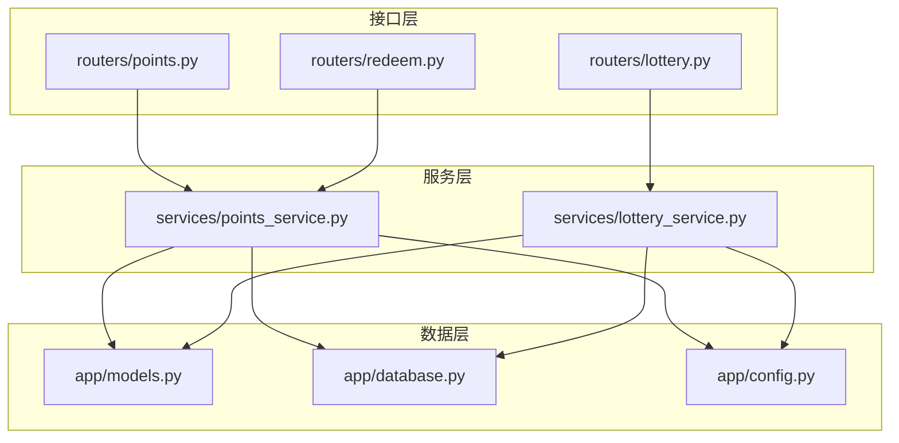
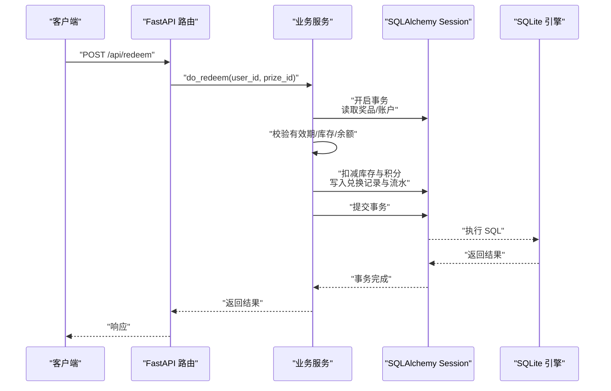
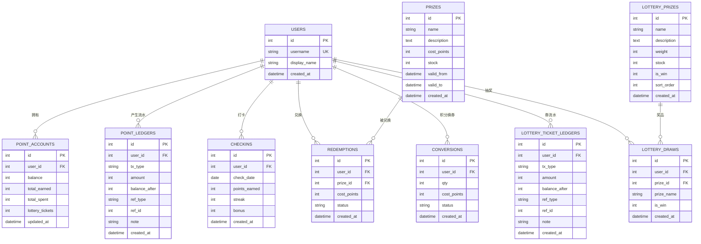
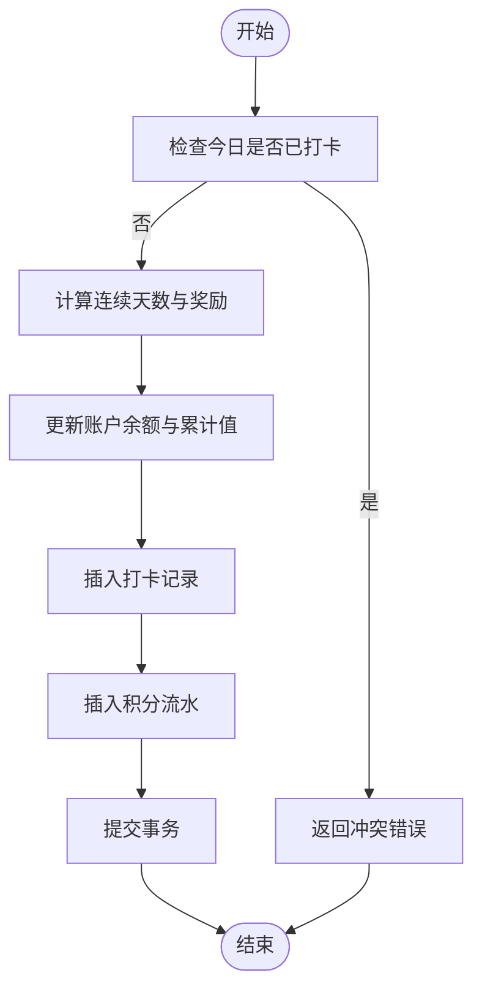
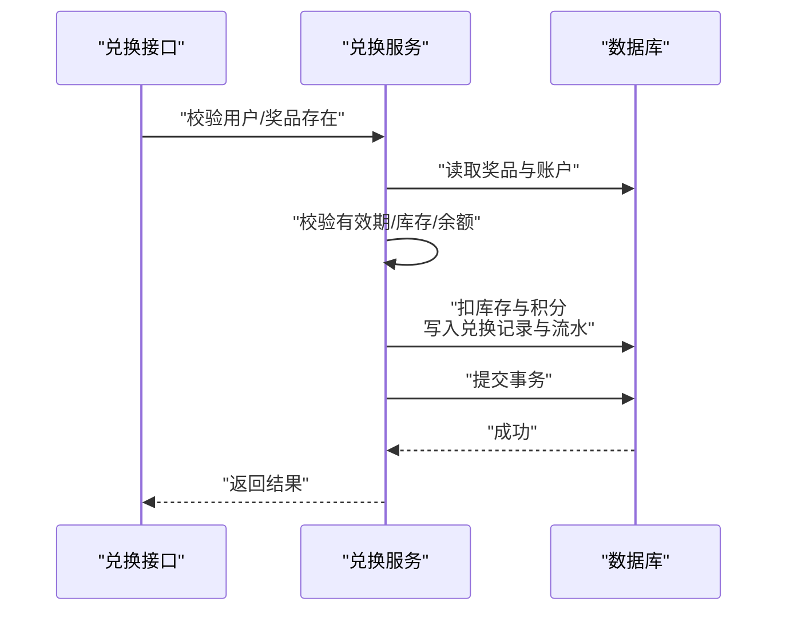
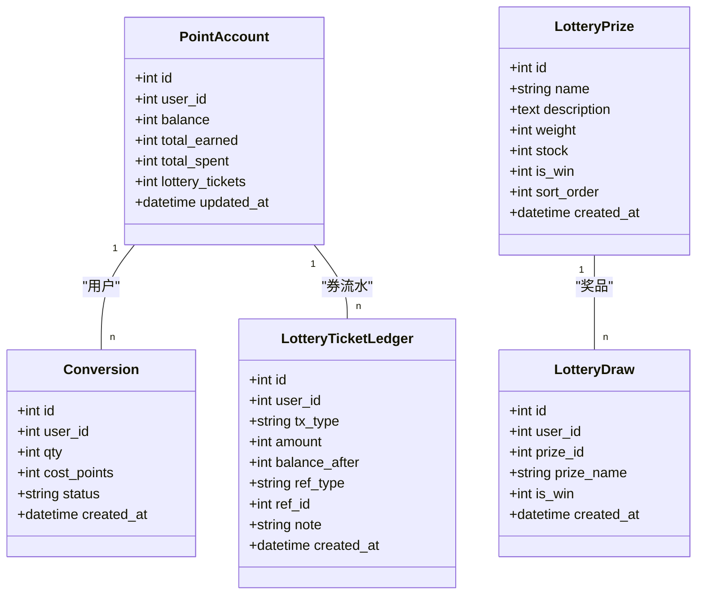
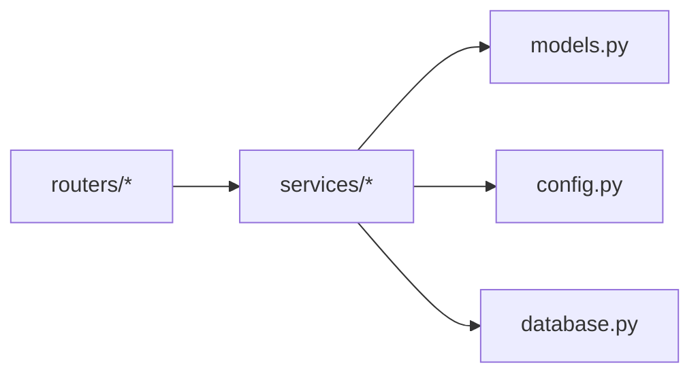

# 积分兑换系统数据库设计

<cite>
**本文引用的文件**   
- [models.py](file://points-system/backend/app/models.py)
- [database.py](file://points-system/backend/app/database.py)
- [schemas.py](file://points-system/backend/app/schemas.py)
- [points_service.py](file://points-system/backend/app/services/points_service.py)
- [lottery_service.py](file://points-system/backend/app/services/lottery_service.py)
- [config.py](file://points-system/backend/app/config.py)
- [points.py](file://points-system/backend/app/routers/points.py)
- [redeem.py](file://points-system/backend/app/routers/redeem.py)
- [lottery.py](file://points-system/backend/app/routers/lottery.py)
</cite>

## 目录
1. [引言](#引言)
2. [项目结构](#项目结构)
3. [核心组件](#核心组件)
4. [架构总览](#架构总览)
5. [详细组件分析](#详细组件分析)
6. [依赖关系分析](#依赖关系分析)
7. [性能与一致性](#性能与一致性)
8. [数据迁移方案](#数据迁移方案)
9. [备份与恢复策略](#备份与恢复策略)
10. [生产环境部署建议](#生产环境部署建议)
11. [故障排查指南](#故障排查指南)
12. [结论](#结论)

## 引言
本文件面向“积分兑换系统”的独立服务，聚焦数据库设计与实现。围绕以下目标展开：
- 用户积分账户表、积分流水记录表、兑换记录表、奖品库存表、抽奖券管理（含奖池与抽奖记录）等核心表的结构与约束
- 积分计算逻辑的数据模型支撑
- 并发控制与数据一致性保证
- 库存管理的原子操作设计
- 表间关系与查询优化策略
- 数据迁移方案、备份恢复策略与生产部署建议

## 项目结构
后端采用 FastAPI + SQLAlchemy ORM，使用 SQLite 作为默认存储；业务逻辑集中在 services 层，路由层仅做参数校验与结果封装。

图表来源
- [points.py:1-28](file://points-system/backend/app/routers/points.py#L1-L28)
- [redeem.py:1-52](file://points-system/backend/app/routers/redeem.py#L1-L52)
- [lottery.py:1-55](file://points-system/backend/app/routers/lottery.py#L1-L55)
- [points_service.py:1-146](file://points-system/backend/app/services/points_service.py#L1-L146)
- [lottery_service.py:1-174](file://points-system/backend/app/services/lottery_service.py#L1-L174)
- [models.py:1-151](file://points-system/backend/app/models.py#L1-L151)
- [database.py:1-39](file://points-system/backend/app/database.py#L1-L39)
- [config.py:1-17](file://points-system/backend/app/config.py#L1-L17)

章节来源
- [points.py:1-28](file://points-system/backend/app/routers/points.py#L1-L28)
- [redeem.py:1-52](file://points-system/backend/app/routers/redeem.py#L1-L52)
- [lottery.py:1-55](file://points-system/backend/app/routers/lottery.py#L1-L55)
- [points_service.py:1-146](file://points-system/backend/app/services/points_service.py#L1-L146)
- [lottery_service.py:1-174](file://points-system/backend/app/services/lottery_service.py#L1-L174)
- [models.py:1-151](file://points-system/backend/app/models.py#L1-L151)
- [database.py:1-39](file://points-system/backend/app/database.py#L1-L39)
- [config.py:1-17](file://points-system/backend/app/config.py#L1-L17)

## 核心组件
- 用户与账户
  - 用户表：用户主体信息
  - 积分账户表：每个用户一行，维护余额、累计收支、抽奖券数量
- 积分流水表：每笔收入/支出落一条，支持对账与审计
- 打卡记录表：每日一次打卡，防重唯一约束
- 奖品与兑换
  - 奖品表：成本、库存、有效期
  - 兑换记录表：每次成功兑换生成一条
- 抽奖券与抽奖
  - 积分兑换抽奖券记录表：记录积分换券
  - 抽奖券流水表：发放/消耗流水
  - 奖池配置表：权重、库存、是否中奖
  - 抽奖记录表：每次抽奖结果

章节来源
- [models.py:10-151](file://points-system/backend/app/models.py#L10-L151)

## 架构总览
下图展示从请求到数据库的关键路径，以及事务边界与并发控制点。

图表来源
- [redeem.py:11-28](file://points-system/backend/app/routers/redeem.py#L11-L28)
- [points_service.py:94-146](file://points-system/backend/app/services/points_service.py#L94-L146)
- [database.py:24-39](file://points-system/backend/app/database.py#L24-L39)

## 详细组件分析

### 实体关系图（ERD）

图表来源
- [models.py:10-151](file://points-system/backend/app/models.py#L10-L151)

章节来源
- [models.py:10-151](file://points-system/backend/app/models.py#L10-L151)

### 积分账户与流水（PointAccount / PointLedger）
- 设计要点
  - 账户行级持久化余额与累计值，避免重复聚合
  - 流水表以 append-only 方式记录每一笔变动，balance_after 用于对账
  - 通过索引加速按用户与时间维度的查询
- 关键约束与索引
  - 账户 user_id 唯一，确保一对一
  - 流水 user_id、created_at 建立索引，便于分页与排序
- 典型流程（打卡得积分）
  - 先查今日是否已打卡（业务层 + 唯一约束兜底）
  - 计算连续天数与奖励
  - 更新账户余额与累计值
  - 插入流水记录
  - 同一事务提交

图表来源
- [points_service.py:41-91](file://points-system/backend/app/services/points_service.py#L41-L91)
- [models.py:20-48](file://points-system/backend/app/models.py#L20-L48)

章节来源
- [points_service.py:41-91](file://points-system/backend/app/services/points_service.py#L41-L91)
- [models.py:20-48](file://points-system/backend/app/models.py#L20-L48)

### 兑换流程（Prize / Redemption）
- 设计要点
  - 奖品表维护库存与有效期
  - 兑换在同一事务内完成：校验→扣库存→扣积分→写记录→写流水
  - 通过事务原子性保证「库存-1」与「积分-N」同时成功或失败
- 并发与一致性
  - SQLite 下依靠单事务原子性与 WAL/busy_timeout 降低竞态风险
  - 若迁移至 PostgreSQL，可在账户与奖品上加悲观锁（with_for_update）

图表来源
- [redeem.py:11-28](file://points-system/backend/app/routers/redeem.py#L11-L28)
- [points_service.py:94-146](file://points-system/backend/app/services/points_service.py#L94-L146)
- [models.py:68-94](file://points-system/backend/app/models.py#L68-L94)

章节来源
- [redeem.py:11-28](file://points-system/backend/app/routers/redeem.py#L11-L28)
- [points_service.py:94-146](file://points-system/backend/app/services/points_service.py#L94-L146)
- [models.py:68-94](file://points-system/backend/app/models.py#L68-L94)

### 积分兑换抽奖券与抽奖（Conversion / LotteryTicketLedger / LotteryPrizes / LotteryDraws）
- 设计要点
  - 积分换券：同事务内扣积分、加券，并分别写入积分支出流水与券发放流水
  - 抽奖权限由 account.lottery_tickets ≥ 1 派生，无需额外状态位
  - 加权随机选奖，有限库存奖品扣库存，写入抽奖记录与券消耗流水
- 并发控制
  - 进程内线程锁将同一用户的读改写串行化，避免 SQLite 丢失更新
  - 多实例部署需改用数据库级悲观锁

图表来源
- [models.py:96-151](file://points-system/backend/app/models.py#L96-L151)
- [lottery_service.py:30-98](file://points-system/backend/app/services/lottery_service.py#L30-L98)
- [lottery_service.py:117-174](file://points-system/backend/app/services/lottery_service.py#L117-L174)

章节来源
- [lottery_service.py:30-98](file://points-system/backend/app/services/lottery_service.py#L30-L98)
- [lottery_service.py:117-174](file://points-system/backend/app/services/lottery_service.py#L117-L174)
- [models.py:96-151](file://points-system/backend/app/models.py#L96-L151)

## 依赖关系分析
- 路由层依赖服务层，服务层依赖模型与配置
- 数据库连接与会话由 database 模块提供，统一创建与释放
- 规则常量集中配置，便于环境与灰度切换

图表来源
- [points.py:1-28](file://points-system/backend/app/routers/points.py#L1-L28)
- [redeem.py:1-52](file://points-system/backend/app/routers/redeem.py#L1-L52)
- [lottery.py:1-55](file://points-system/backend/app/routers/lottery.py#L1-L55)
- [points_service.py:1-146](file://points-system/backend/app/services/points_service.py#L1-L146)
- [lottery_service.py:1-174](file://points-system/backend/app/services/lottery_service.py#L1-L174)
- [models.py:1-151](file://points-system/backend/app/models.py#L1-L151)
- [config.py:1-17](file://points-system/backend/app/config.py#L1-L17)
- [database.py:1-39](file://points-system/backend/app/database.py#L1-L39)

章节来源
- [points.py:1-28](file://points-system/backend/app/routers/points.py#L1-L28)
- [redeem.py:1-52](file://points-system/backend/app/routers/redeem.py#L1-L52)
- [lottery.py:1-55](file://points-system/backend/app/routers/lottery.py#L1-L55)
- [points_service.py:1-146](file://points-system/backend/app/services/points_service.py#L1-L146)
- [lottery_service.py:1-174](file://points-system/backend/app/services/lottery_service.py#L1-L174)
- [models.py:1-151](file://points-system/backend/app/models.py#L1-L151)
- [config.py:1-17](file://points-system/backend/app/config.py#L1-L17)
- [database.py:1-39](file://points-system/backend/app/database.py#L1-L39)

## 性能与一致性
- 事务与原子性
  - 所有「读-改-写」在单个会话事务内完成，commit 前不持久化，异常时 rollback，避免半更新
- 并发控制
  - 进程内线程锁将热点账户操作串行化，规避 SQLite 下的丢失更新
  - 多实例部署建议迁移至支持行级锁的数据库（如 PostgreSQL），并对账户与奖品行加悲观锁
- 索引与查询
  - 流水表按 user_id、created_at 建索引，支持高效分页与倒序查询
  - 打卡表 (user_id, check_date) 唯一约束防止重复打卡
  - 账户 user_id 唯一，避免冗余
- 配置驱动
  - 打卡奖励、换券比例、抽奖券消耗等通过配置文件集中管理，便于调参与灰度

章节来源
- [points_service.py:1-146](file://points-system/backend/app/services/points_service.py#L1-L146)
- [lottery_service.py:1-174](file://points-system/backend/app/services/lottery_service.py#L1-L174)
- [database.py:16-23](file://points-system/backend/app/database.py#L16-L23)
- [config.py:1-17](file://points-system/backend/app/config.py#L1-L17)

## 数据迁移方案
- 当前使用 SQLite，初始化通过 Base.metadata.create_all 自动建表
- 建议引入版本化迁移工具（如 Alembic），步骤如下：
  - 初始化迁移仓库，生成初始版本脚本
  - 新增字段或表时，自动生成增量迁移脚本
  - 在 CI/CD 中执行迁移，确保幂等与回滚能力
  - 针对 SQLite 的 DDL 限制，谨慎处理列删除与类型变更
- 注意事项
  - 大表增删索引建议在低峰期执行
  - 涉及库存与余额的变更，优先通过脚本+事务保障一致性

章节来源
- [database.py:36-39](file://points-system/backend/app/database.py#L36-L39)

## 备份与恢复策略
- SQLite 特性
  - 启用 WAL 模式提升并发读性能，但需注意主库与 wal/shm 文件的一致性
- 备份建议
  - 冷备：停止服务后复制 app.db、wal、shm 三文件
  - 热备：使用数据库导出工具或文件系统快照，确保三者一致
- 恢复建议
  - 停止服务，替换数据库文件，重启服务
  - 验证关键指标：账户余额合计与流水合计一致、最近一笔事务可回放

章节来源
- [database.py:16-23](file://points-system/backend/app/database.py#L16-L23)

## 生产环境部署建议
- 数据库选型
  - 推荐迁移至 PostgreSQL，利用行级锁与更好的并发能力
  - 如需保留 SQLite，务必限制并发实例数，并评估 WAL 与 busy_timeout 的影响
- 连接与事务
  - 为每个请求分配独立会话，短事务快速提交
  - 对热点账户操作增加应用层锁（当前已实现）
- 监控与告警
  - 监控事务失败率、死锁/忙等待次数、慢查询
  - 对库存不足、积分不足等高频错误进行告警
- 容量规划
  - 流水表增长快，建议按月分区或归档历史数据
  - 定期清理过期打卡与无效缓存数据

[本节为通用建议，不直接分析具体文件]

## 故障排查指南
- 常见错误码与定位
  - 409 冲突：重复打卡、库存不足、并发冲突
  - 400 参数错误：积分不足、未满足最低门槛
  - 404 资源不存在：用户或奖品不存在
- 排查步骤
  - 核对流水表 balance_after 序列是否连续
  - 核对账户余额与流水合计是否一致
  - 查看事务日志与异常堆栈，确认是否在 commit 前发生异常
- 参考实现
  - 打卡与兑换的事务与异常处理
  - 抽奖的进程内锁与异常处理

章节来源
- [points_service.py:77-91](file://points-system/backend/app/services/points_service.py#L77-L91)
- [points_service.py:94-146](file://points-system/backend/app/services/points_service.py#L94-L146)
- [lottery_service.py:87-98](file://points-system/backend/app/services/lottery_service.py#L87-L98)
- [lottery_service.py:161-174](file://points-system/backend/app/services/lottery_service.py#L161-L174)

## 结论
本设计通过「账户行 + 追加式流水」的双轨模型，结合事务原子性与必要的并发控制，实现了积分与抽奖券的高一致性管理。配合合理的索引与配置化规则，系统在功能完整性、可观测性与可运维性方面具备良好基础。后续建议向支持行级锁的关系型数据库迁移，并引入版本化迁移与完善的监控体系，进一步提升稳定性与扩展性。