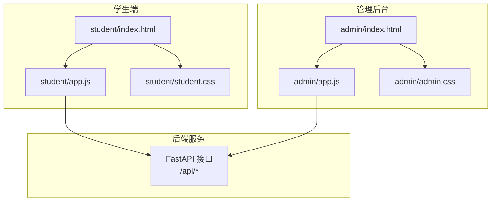
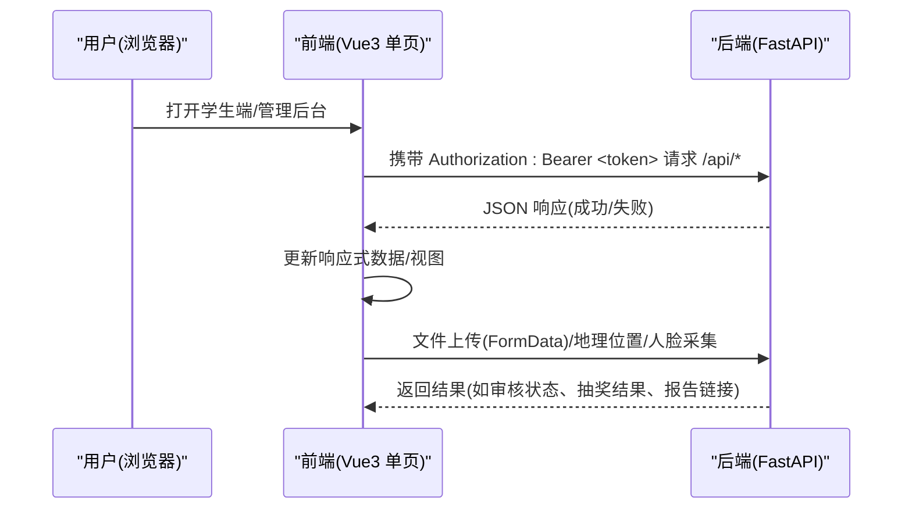
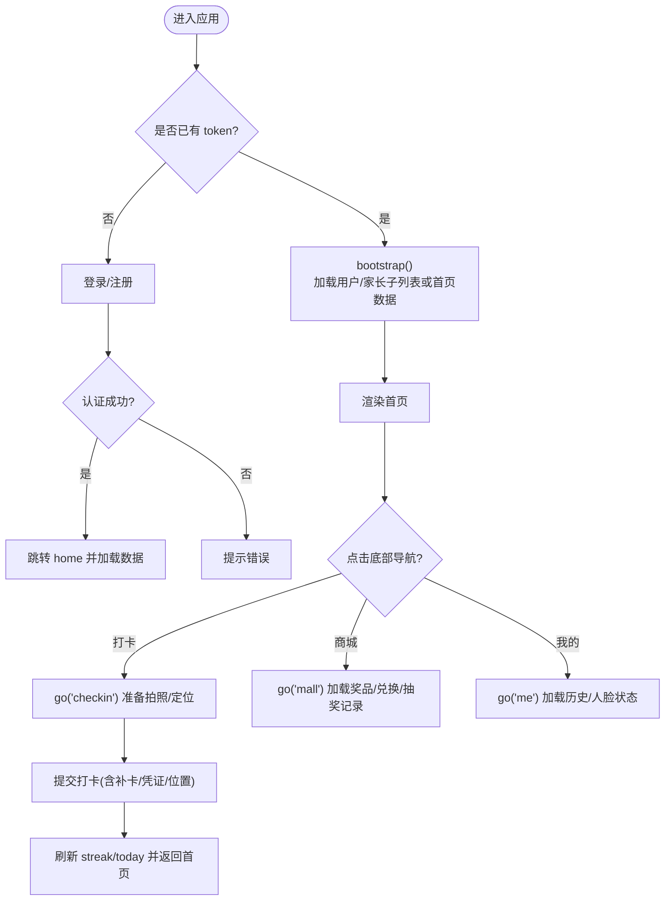
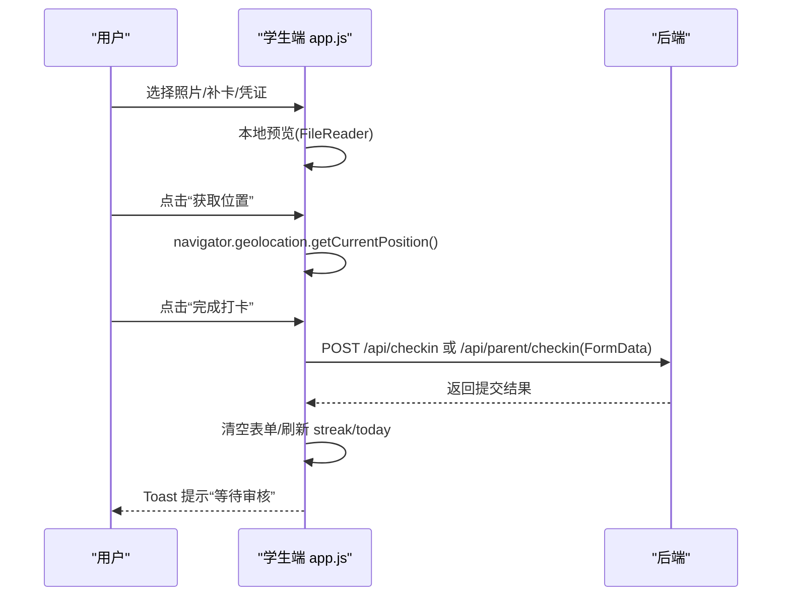
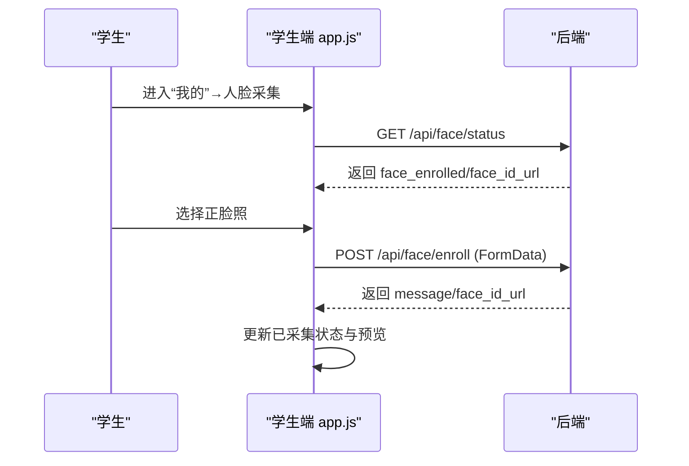
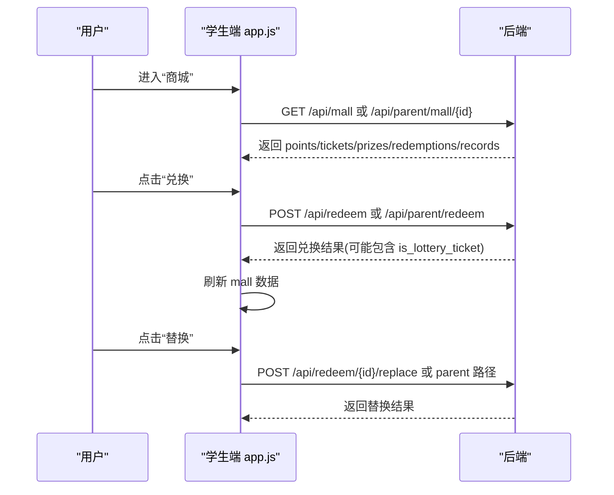
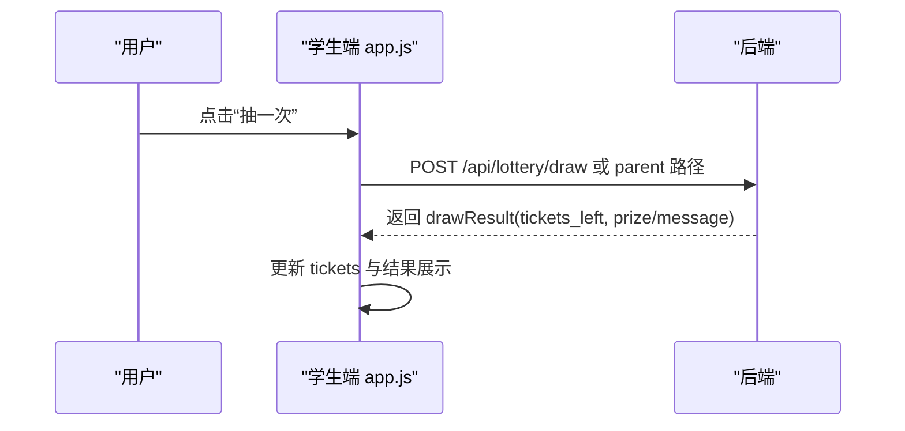
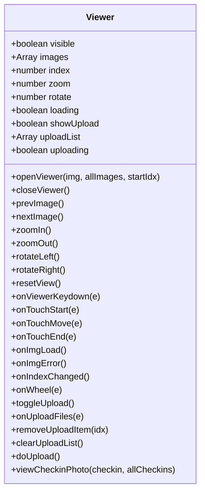
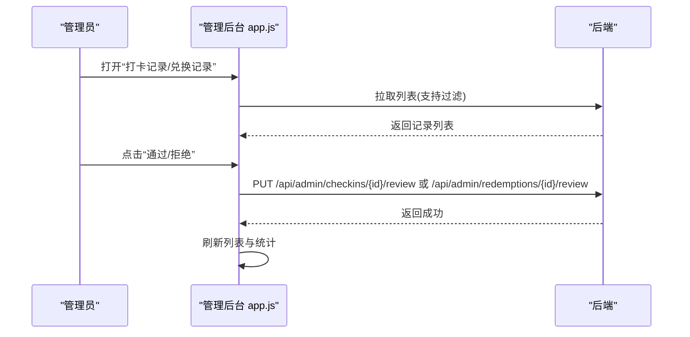
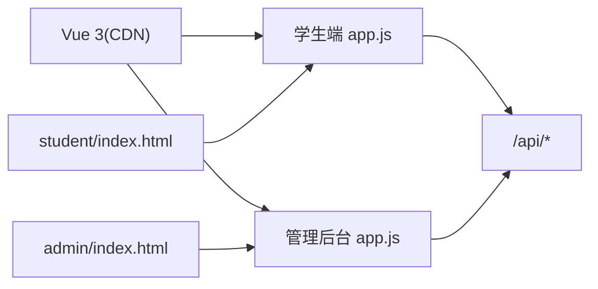

# 前端应用设计

<cite>
**本文引用的文件**   
- [README.md](file://summer-homework-checkin/README.md)
- [学生端入口 index.html](file://summer-homework-checkin/frontend/student/index.html)
- [学生端逻辑 app.js](file://summer-homework-checkin/frontend/student/app.js)
- [学生端样式 student.css](file://summer-homework-checkin/frontend/student/student.css)
- [管理后台入口 index.html](file://summer-homework-checkin/frontend/admin/index.html)
- [管理后台逻辑 app.js](file://summer-homework-checkin/frontend/admin/app.js)
- [管理后台样式 admin.css](file://summer-homework-checkin/frontend/admin/admin.css)
</cite>

## 目录
1. [简介](#简介)
2. [项目结构](#项目结构)
3. [核心组件](#核心组件)
4. [架构总览](#架构总览)
5. [详细组件分析](#详细组件分析)
6. [依赖关系分析](#依赖关系分析)
7. [性能与体验优化](#性能与体验优化)
8. [故障排查指南](#故障排查指南)
9. [结论](#结论)
10. [附录：API 契约与交互要点](#附录api-契约与交互要点)

## 简介
本设计文档面向“暑假作业打卡系统”的前端应用，聚焦 Vue 3 单页应用的架构、组件化模式、状态管理与前后端通信机制。文档覆盖学生端与管理后台的功能差异、响应式布局适配、用户体验优化策略，并详细说明表单验证、文件上传、实时通知等交互实现细节，提供可复用的组件模式与样式组织规范，帮助开发者快速理解与扩展功能。

## 项目结构
前端采用“免构建”的 CDN + 原生 HTML/CSS/JS 方案，按角色拆分为两个独立页面：
- 学生端 H5：移动端优先，底部导航，三步完成打卡
- 管理后台：桌面端为主，支持移动端卡片视图

图表来源
- [学生端入口 index.html:1-271](file://summer-homework-checkin/frontend/student/index.html#L1-L271)
- [学生端逻辑 app.js:1-329](file://summer-homework-checkin/frontend/student/app.js#L1-L329)
- [学生端样式 student.css:1-133](file://summer-homework-checkin/frontend/student/student.css#L1-L133)
- [管理后台入口 index.html:1-411](file://summer-homework-checkin/frontend/admin/index.html#L1-L411)
- [管理后台逻辑 app.js:1-479](file://summer-homework-checkin/frontend/admin/app.js#L1-L479)
- [管理后台样式 admin.css:1-274](file://summer-homework-checkin/frontend/admin/admin.css#L1-L274)

章节来源
- [README.md:26-49](file://summer-homework-checkin/README.md#L26-L49)

## 核心组件
- 学生端
  - 登录/注册（学生/家长双角色）
  - 首页（连续天数、今日状态、快捷入口）
  - 打卡（照片上传、补卡选项、位置获取、提交）
  - 积分商城（兑换、替换、抽奖）
  - 我的（人脸采集/撤销、账号信息、打卡历史、报告）
- 管理后台
  - 数据概览（学生/家长数、有效打卡、绑定关系、异常打卡）
  - 奖品管理（增删改查、概率/库存/上下架、积分兑换价、抽奖券）
  - 用户管理（基础信息与统计）
  - 打卡审核（待审/全部、查看照片、通过/拒绝）
  - 兑换审核（待核实/已兑现/已拒绝、兑现/拒绝）
  - 图片查看器（缩放、旋转、翻页、上传补充图）

章节来源
- [学生端入口 index.html:11-243](file://summer-homework-checkin/frontend/student/index.html#L11-L243)
- [学生端逻辑 app.js:46-327](file://summer-homework-checkin/frontend/student/app.js#L46-L327)
- [管理后台入口 index.html:11-406](file://summer-homework-checkin/frontend/admin/index.html#L11-L406)
- [管理后台逻辑 app.js:4-447](file://summer-homework-checkin/frontend/admin/app.js#L4-L447)

## 架构总览
整体为前后端分离的单页应用，使用浏览器 fetch 直连后端 REST API，基于 Bearer Token 鉴权；学生端以 H5 形式适配手机/平板，管理后台为独立外部页面承载。

图表来源
- [学生端逻辑 app.js:50-58](file://summer-homework-checkin/frontend/student/app.js#L50-L58)
- [管理后台逻辑 app.js:54-62](file://summer-homework-checkin/frontend/admin/app.js#L54-L62)
- [README.md:81-94](file://summer-homework-checkin/README.md#L81-L94)

## 详细组件分析

### 学生端：路由与页面切换
- 使用单一根实例与 view 字段控制页面切换（home/checkin/mall/me），配合底部导航
- 家长态下增加“孩子切换”，动态选择 actingChildId 作为当前操作主体
- 进入页面时按需加载对应数据（streak/today/mall/history/faceStatus）

图表来源
- [学生端入口 index.html:11-243](file://summer-homework-checkin/frontend/student/index.html#L11-L243)
- [学生端逻辑 app.js:46-132](file://summer-homework-checkin/frontend/student/app.js#L46-L132)

章节来源
- [学生端入口 index.html:11-243](file://summer-homework-checkin/frontend/student/index.html#L11-L243)
- [学生端逻辑 app.js:46-132](file://summer-homework-checkin/frontend/student/app.js#L46-L132)

### 学生端：打卡流程与校验
- 步骤 1：上传现场照片（支持 capture="environment"）
- 步骤 2：可选补卡（日期+原因+凭证），校验本月剩余次数
- 步骤 3：获取设备位置（失败仍可提交但标记风险）
- 提交：根据角色调用不同接口（学生 /api/checkin；家长 /api/parent/checkin）

图表来源
- [学生端入口 index.html:98-133](file://summer-homework-checkin/frontend/student/index.html#L98-L133)
- [学生端逻辑 app.js:147-232](file://summer-homework-checkin/frontend/student/app.js#L147-L232)

章节来源
- [学生端入口 index.html:98-133](file://summer-homework-checkin/frontend/student/index.html#L98-L133)
- [学生端逻辑 app.js:147-232](file://summer-homework-checkin/frontend/student/app.js#L147-L232)

### 学生端：人脸采集与比对
- 仅学生可采集人脸底图，支持拍摄/选择正脸照
- 调用 /api/face/enroll 采集，成功后显示已采集状态与底图预览
- 撤销后打卡不再做人脸比对

图表来源
- [学生端入口 index.html:200-212](file://summer-homework-checkin/frontend/student/index.html#L200-L212)
- [学生端逻辑 app.js:162-194](file://summer-homework-checkin/frontend/student/app.js#L162-L194)

章节来源
- [学生端入口 index.html:200-212](file://summer-homework-checkin/frontend/student/index.html#L200-L212)
- [学生端逻辑 app.js:162-194](file://summer-homework-checkin/frontend/student/app.js#L162-L194)

### 学生端：积分商城与兑换
- 展示可用积分与抽奖券，列出可兑换奖品（含抽奖券类商品）
- 兑换接口：学生 /api/redeem；家长 /api/parent/redeem?child_id=...
- 支持“替换”已兑换但未发放的奖品，调用 replace 接口

图表来源
- [学生端入口 index.html:136-196](file://summer-homework-checkin/frontend/student/index.html#L136-L196)
- [学生端逻辑 app.js:234-293](file://summer-homework-checkin/frontend/student/app.js#L234-L293)

章节来源
- [学生端入口 index.html:136-196](file://summer-homework-checkin/frontend/student/index.html#L136-L196)
- [学生端逻辑 app.js:234-293](file://summer-homework-checkin/frontend/student/app.js#L234-L293)

### 学生端：抽奖
- 连续 7 天解锁抽奖资格，永久累积
- 调用 /api/lottery/draw 或家长路径 /api/parent/lottery/{id}/draw

图表来源
- [学生端入口 index.html:176-195](file://summer-homework-checkin/frontend/student/index.html#L176-L195)
- [学生端逻辑 app.js:295-308](file://summer-homework-checkin/frontend/student/app.js#L295-L308)

章节来源
- [学生端入口 index.html:176-195](file://summer-homework-checkin/frontend/student/index.html#L176-L195)
- [学生端逻辑 app.js:295-308](file://summer-homework-checkin/frontend/student/app.js#L295-L308)

### 管理后台：图片查看器
- 支持多图浏览、缩放、旋转、键盘/触摸翻页、上传补充图片
- 从打卡记录中收集同用户照片，自动定位到当前行图片

图表来源
- [管理后台逻辑 app.js:15-447](file://summer-homework-checkin/frontend/admin/app.js#L15-L447)
- [管理后台入口 index.html:287-405](file://summer-homework-checkin/frontend/admin/index.html#L287-L405)

章节来源
- [管理后台逻辑 app.js:15-447](file://summer-homework-checkin/frontend/admin/app.js#L15-L447)
- [管理后台入口 index.html:287-405](file://summer-homework-checkin/frontend/admin/index.html#L287-L405)

### 管理后台：打卡审核与兑换审核
- 打卡审核：筛选待审/全部，查看照片，弹窗备注并通过/拒绝
- 兑换审核：筛选待核实/已兑现/已拒绝，弹窗备注并兑现/拒绝
- 操作后刷新列表与统计数据

图表来源
- [管理后台入口 index.html:128-245](file://summer-homework-checkin/frontend/admin/index.html#L128-L245)
- [管理后台逻辑 app.js:163-184](file://summer-homework-checkin/frontend/admin/app.js#L163-L184)
- [管理后台逻辑 app.js:114-133](file://summer-homework-checkin/frontend/admin/app.js#L114-L133)

章节来源
- [管理后台入口 index.html:128-245](file://summer-homework-checkin/frontend/admin/index.html#L128-L245)
- [管理后台逻辑 app.js:114-184](file://summer-homework-checkin/frontend/admin/app.js#L114-L184)

## 依赖关系分析
- 运行时依赖
  - Vue 3 通过 CDN 引入，无构建工具链
  - 浏览器原生能力：fetch、FileReader、navigator.geolocation
- 模块耦合
  - 学生端与管理后台各自独立，共享同一后端 API
  - 管理后台内置图片查看器组件，复用性强
- 外部集成点
  - 后端 FastAPI 提供的认证、打卡、人脸、抽奖、报表等接口

图表来源
- [学生端入口 index.html:8](file://summer-homework-checkin/frontend/student/index.html#L8)
- [管理后台入口 index.html:8](file://summer-homework-checkin/frontend/admin/index.html#L8)
- [学生端逻辑 app.js:1](file://summer-homework-checkin/frontend/student/app.js#L1)
- [管理后台逻辑 app.js:1](file://summer-homework-checkin/frontend/admin/app.js#L1)

章节来源
- [学生端入口 index.html:1-271](file://summer-homework-checkin/frontend/student/index.html#L1-L271)
- [管理后台入口 index.html:1-411](file://summer-homework-checkin/frontend/admin/index.html#L1-L411)

## 性能与体验优化
- 首屏与资源
  - 使用生产版 Vue 3 压缩包，减少体积
  - 静态资源由后端托管，避免额外构建产物
- 交互反馈
  - 统一 toast 提示，避免阻塞主线程
  - 提交前禁用按钮，防止重复提交
- 图片处理
  - 本地 FileReader 预览，提升感知速度
  - 管理后台图片查看器懒加载大图，缩略图先行
- 网络与容错
  - 401 自动登出，避免无效请求
  - 定位失败仍允许提交，降级为风险标记
- 响应式与触控
  - 学生端限制最大宽度，适配手机
  - 管理后台在窄屏下切换为卡片视图与底部 Tab

[本节为通用指导，不直接分析具体文件]

## 故障排查指南
- 登录失效
  - 现象：请求返回 401，前端自动退出登录
  - 排查：检查 localStorage 中的 token 是否过期或被清理
- 图片无法加载
  - 现象：查看器空白或报错
  - 排查：确认 URL 是否为完整地址，相对路径需补全 origin
- 定位失败
  - 现象：提示“定位失败，仍可提交”
  - 排查：检查浏览器权限与 HTTPS 环境要求
- 兑换/替换失败
  - 现象：提示“积分不足/已兑完/操作失败”
  - 排查：核对奖品库存、积分余额与接口返回 detail

章节来源
- [学生端逻辑 app.js:50-58](file://summer-homework-checkin/frontend/student/app.js#L50-L58)
- [管理后台逻辑 app.js:54-62](file://summer-homework-checkin/frontend/admin/app.js#L54-L62)
- [管理后台逻辑 app.js:462-471](file://summer-homework-checkin/frontend/admin/app.js#L462-L471)

## 结论
该前端应用以轻量、易部署为目标，采用 Vue 3 CDN 与原生 API 直连后端，实现了学生端与管理后台的清晰职责划分。通过统一的鉴权封装、完善的表单与文件交互、以及强大的图片查看器，既保证了用户体验，也便于后续扩展与维护。建议在生产环境中结合 CDN 缓存与后端限流，进一步提升稳定性与性能。

[本节为总结性内容，不直接分析具体文件]

## 附录：API 契约与交互要点
- 认证与会话
  - 登录/注册返回 access_token，前端存入 localStorage 并在请求头附加 Authorization: Bearer
- 关键接口（学生端）
  - /api/auth/login、/api/auth/register、/api/auth/me
  - /api/checkin/streak、/api/checkin/today、/api/checkin
  - /api/face/enroll、/api/face/status
  - /api/mall、/api/redeem、/api/redeem/:id/replace、/api/lottery/draw
  - /api/report/me/html
- 关键接口（家长端代理）
  - /api/parent/children、/api/parent/child-streak/:id
  - /api/parent/checkin、/api/parent/mall/:id、/api/parent/redeem?child_id=:id
  - /api/parent/redeem/:id/replace、/api/parent/lottery/:id/draw
  - /api/parent/child-report/:id/html
- 关键接口（管理后台）
  - /api/admin/stats、/api/admin/prizes、/api/admin/users
  - /api/admin/checkins、/api/admin/checkins/pending-count
  - /api/admin/checkins/:id/review
  - /api/admin/redemptions、/api/admin/redemptions/:id/review
- 文件上传
  - 使用 FormData 上传 photo/proof，后端返回 photo_url 供查看器使用
- 错误处理
  - 非 2xx 响应抛出错误消息，401 触发登出

章节来源
- [README.md:81-94](file://summer-homework-checkin/README.md#L81-L94)
- [学生端逻辑 app.js:50-58](file://summer-homework-checkin/frontend/student/app.js#L50-L58)
- [管理后台逻辑 app.js:54-62](file://summer-homework-checkin/frontend/admin/app.js#L54-L62)