# 学生端应用

<cite>
**本文引用的文件**   
- [README.md](file://summer-homework-checkin/README.md)
- [index.html](file://summer-homework-checkin/frontend/student/index.html)
- [app.js](file://summer-homework-checkin/frontend/student/app.js)
- [student.css](file://summer-homework-checkin/frontend/student/student.css)
- [main.py](file://summer-homework-checkin/backend/app/main.py)
- [config.py](file://summer-homework-checkin/backend/app/config.py)
- [auth.py](file://summer-homework-checkin/backend/app/routers/auth.py)
- [checkin.py](file://summer-homework-checkin/backend/app/routers/checkin.py)
- [face.py](file://summer-homework-checkin/backend/app/routers/face.py)
- [lottery.py](file://summer-homework-checkin/backend/app/routers/lottery.py)
- [redeem.py](file://summer-homework-checkin/backend/app/routers/redeem.py)
- [parent.py](file://summer-homework-checkin/backend/app/routers/parent.py)
- [models.py](file://summer-homework-checkin/backend/app/models.py)
- [schemas.py](file://summer-homework-checkin/backend/app/schemas.py)
- [checkin_service.py](file://summer-homework-checkin/backend/app/services/checkin_service.py)
- [face_service.py](file://summer-homework-checkin/backend/app/services/face_service.py)
- [lottery_service.py](file://summer-homework-checkin/backend/app/services/lottery_service.py)
- [redeem_service.py](file://summer-homework-checkin/backend/app/services/redeem_service.py)
</cite>

## 更新摘要
**变更内容**   
- 修复了家长登录空白页面问题，增强了前端数据结构的健壮性
- 完善了loadChildren()函数中无孩子场景的数据初始化逻辑
- 扩展了streak对象结构，新增current_streak、longest_streak、effective_checkins、lottery_tickets等字段
- 增强了today对象，添加today_pending和pending_count字段用于显示待审核状态
- 优化了mall对象初始化，确保lottery_tickets字段始终存在
- 改进了loadChildHome()函数对new today_pending字段的处理，提供更好的向后兼容性

## 目录
1. [引言](#引言)
2. [项目结构](#项目结构)
3. [核心组件](#核心组件)
4. [架构总览](#架构总览)
5. [详细组件分析](#详细组件分析)
6. [依赖关系分析](#依赖关系分析)
7. [性能与体验优化](#性能与体验优化)
8. [故障排查指南](#故障排查指南)
9. [结论](#结论)
10. [附录：API 参考](#附录api-参考)

## 引言
本设计文档面向"暑假作业打卡系统"的学生端（H5，基于 Vue 3 CDN），围绕用户认证、打卡流程、人脸识别采集、积分商城与抽奖系统、双角色（学生/家长）机制、状态管理与组件通信、文件上传、地理位置获取、表单验证、响应式布局、错误处理策略以及 API 封装与数据同步等主题进行系统化阐述。目标是帮助开发者快速理解并扩展学生端功能。

**更新** 本次更新重点修复了家长登录空白页面问题，通过增强前端数据结构的健壮性，完善了无孩子场景的数据初始化逻辑，提升了系统的稳定性和用户体验。

## 项目结构
学生端采用前后端分离架构：
- 前端：Vue 3 单页应用，通过 CDN 引入，免构建；静态资源由后端托管。
- 后端：FastAPI 提供 RESTful API，统一挂载路由、静态资源与 CORS。

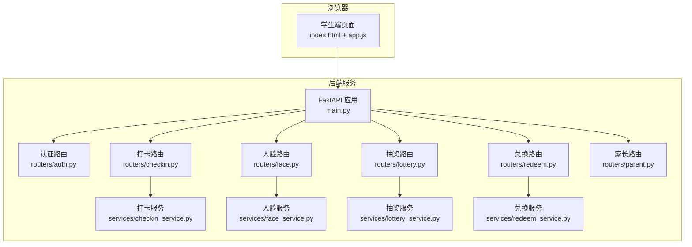

图表来源
- [main.py:1-49](file://summer-homework-checkin/backend/app/main.py#L1-L49)
- [index.html:1-368](file://summer-homework-checkin/frontend/student/index.html#L1-L368)
- [app.js:1-428](file://summer-homework-checkin/frontend/student/app.js#L1-L428)

章节来源
- [README.md:1-126](file://summer-homework-checkin/README.md#L1-L126)
- [main.py:1-49](file://summer-homework-checkin/backend/app/main.py#L1-L49)
- [index.html:1-368](file://summer-homework-checkin/frontend/student/index.html#L1-L368)
- [app.js:1-428](file://summer-homework-checkin/frontend/student/app.js#L1-L428)

## 核心组件
- 认证与会话
  - 注册/登录返回访问令牌，前端持久化到本地存储并在后续请求中携带 Authorization 头。
  - 支持 student/parent 两种角色，注册时按角色写入差异化字段。
- 家长-学生绑定功能
  - 家长登录后显示绑定卡片界面，输入孩子用户名和绑定码完成绑定。
  - 支持多孩子管理，可切换当前操作主体，自动刷新相关数据。
  - 绑定成功后自动导航到首页或保持当前视图。
  - **更新** 增强了无孩子场景的数据初始化，避免家长登录时出现空白页面。
- 打卡与防代打卡
  - 正常打卡与补卡两条路径，照片体积/尺寸校验、地理距离标记、人脸 1:1 比对（可配置策略）。
  - 审核通过后发放积分、重算连续天数并按每满 7 天发放抽奖资格。
  - **更新** 增强了today对象的pending_count字段，提供更准确的待审核状态显示。
- 人脸识别采集
  - 仅学生可采集底图；模型不可用时自动降级为安全模式，已采集账号不通过则拒绝打卡。
- 积分商城与兑换
  - 支持积分兑换实物奖品（待发放）与抽奖券（自动兑现），支持替换未发放的兑换记录。
  - **更新** 优化了mall对象初始化，确保lottery_tickets字段始终存在。
- 抽奖系统
  - 消耗 1 张抽奖券，按概率与库存加权随机抽取；中奖自动生成兑换记录。
- 双角色与家长代理
  - 家长绑定孩子后，可切换查看/代操作（打卡、兑换、抽奖、报告）。
  - **更新** 扩展了streak对象结构，包含完整的统计信息字段。
- 前端状态与通信
  - 单一 Vue 实例集中管理状态；统一的 api 方法封装 fetch，统一鉴权与错误提示；根据 isParent 分支选择不同 API。
  - **更新** 增强了数据结构的健壮性，提供更好的向后兼容性。

章节来源
- [auth.py:1-52](file://summer-homework-checkin/backend/app/routers/auth.py#L1-L52)
- [parent.py:1-237](file://summer-homework-checkin/backend/app/routers/parent.py#L1-L237)
- [checkin.py:1-80](file://summer-homework-checkin/backend/app/routers/checkin.py#L1-L80)
- [face.py:1-45](file://summer-homework-checkin/backend/app/routers/face.py#L1-L45)
- [lottery.py:1-30](file://summer-homework-checkin/backend/app/routers/lottery.py#L1-L30)
- [redeem.py:1-81](file://summer-homework-checkin/backend/app/routers/redeem.py#L1-L81)
- [checkin_service.py:1-254](file://summer-homework-checkin/backend/app/services/checkin_service.py#L1-L254)
- [face_service.py:1-133](file://summer-homework-checkin/backend/app/services/face_service.py#L1-L133)
- [lottery_service.py:1-77](file://summer-homework-checkin/backend/app/services/lottery_service.py#L1-L77)
- [redeem_service.py:1-168](file://summer-homework-checkin/backend/app/services/redeem_service.py#L1-L168)
- [app.js:1-428](file://summer-homework-checkin/frontend/student/app.js#L1-L428)
- [index.html:1-368](file://summer-homework-checkin/frontend/student/index.html#L1-L368)

## 架构总览
整体采用"前端单页 + 后端 FastAPI 微服务化路由 + 业务服务层"的分层架构。前端通过统一 API 封装发起请求，后端路由负责参数解析与权限校验，具体业务逻辑下沉至 services 层，确保高内聚低耦合。

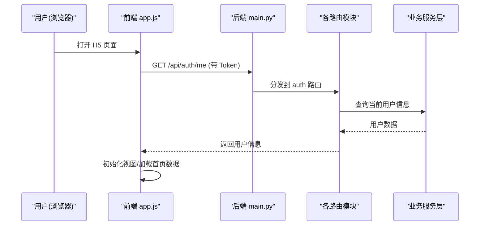

图表来源
- [main.py:1-49](file://summer-homework-checkin/backend/app/main.py#L1-L49)
- [auth.py:1-52](file://summer-homework-checkin/backend/app/routers/auth.py#L1-L52)
- [app.js:1-428](file://summer-homework-checkin/frontend/student/app.js#L1-L428)

## 详细组件分析

### 用户认证流程
- 注册：支持 student/parent 角色，生成绑定码（学生），签发 Token。
- 登录：校验用户名密码，签发 Token。
- 会话：前端在 localStorage 保存 Token，所有请求自动附加 Authorization 头；401 自动登出。

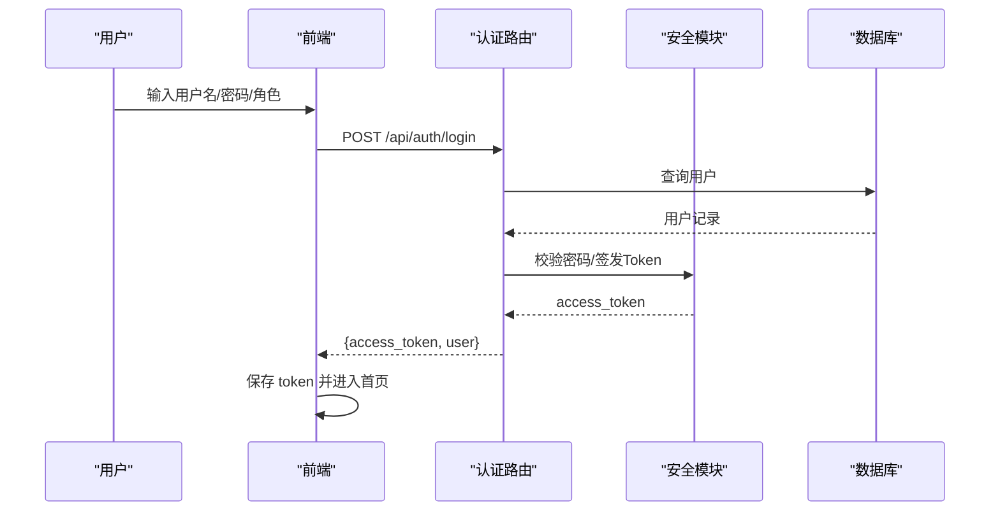

图表来源
- [auth.py:1-52](file://summer-homework-checkin/backend/app/routers/auth.py#L1-L52)
- [app.js:1-428](file://summer-homework-checkin/frontend/student/app.js#L1-L428)

章节来源
- [auth.py:1-52](file://summer-homework-checkin/backend/app/routers/auth.py#L1-L52)
- [app.js:1-428](file://summer-homework-checkin/frontend/student/app.js#L1-L428)

### 家长-学生绑定功能实现

**更新** 家长-学生绑定功能现已完善，修复了家长登录空白页面问题，增强了前端数据结构的健壮性。

#### 前端绑定界面
- **绑定卡片界面**：家长登录后若未绑定任何孩子，显示专门的绑定卡片界面
- **表单设计**：包含孩子用户名和绑定码两个输入框，带有清晰的占位符提示
- **交互反馈**：绑定过程中显示"绑定中..."状态，禁用按钮防止重复提交
- **成功处理**：绑定成功后显示 Toast 提示，清空表单并自动刷新孩子列表

#### 绑定流程实现
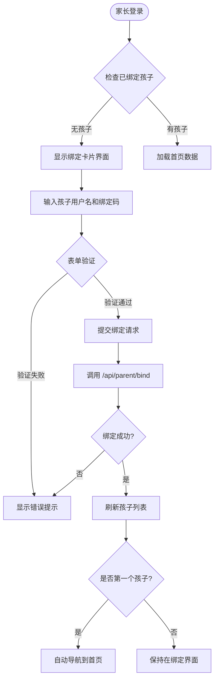

图表来源
- [app.js:112-133](file://summer-homework-checkin/frontend/student/app.js#L112-L133)
- [index.html:53-62](file://summer-homework-checkin/frontend/student/index.html#L53-L62)

#### 表单验证机制
- **必填项验证**：检查孩子用户名和绑定码是否为空
- **实时反馈**：使用 showToast 方法显示验证错误信息
- **防重复提交**：通过 bindBusy 标志位防止重复绑定请求
- **用户体验**：绑定成功后自动清空表单，便于再次绑定其他孩子

#### API 通信处理
- **请求封装**：使用统一的 api 方法处理 HTTP 请求
- **错误处理**：捕获网络错误和业务错误，显示友好提示信息
- **状态管理**：更新 children 数组和 actingChildId 状态
- **自动导航**：绑定第一个孩子时自动跳转到首页

#### 后端绑定接口
- **权限校验**：仅家长角色可以执行绑定操作
- **数据验证**：验证孩子账号存在性和绑定码正确性
- **重复绑定**：防止同一家长重复绑定同一个孩子
- **事务处理**：使用数据库事务确保数据一致性

#### 数据结构增强
**更新** 为了修复家长登录空白页面问题，增强了前端数据结构的健壮性：

- **无孩子场景初始化**：当家长没有绑定任何孩子时，完整初始化streak、today、mall对象的所有必需字段
- **streak对象扩展**：包含current_streak、longest_streak、effective_checkins、lottery_tickets等完整统计字段
- **today对象增强**：新增today_pending和pending_count字段，用于显示待审核打卡状态
- **mall对象优化**：确保lottery_tickets字段始终存在，避免渲染错误
- **向后兼容性**：loadChildHome()函数对new today_pending字段提供更好的兼容处理

**Section sources**
- [app.js:112-133](file://summer-homework-checkin/frontend/student/app.js#L112-L133)
- [app.js:138-149](file://summer-homework-checkin/frontend/student/app.js#L138-L149)
- [app.js:171-180](file://summer-homework-checkin/frontend/student/app.js#L171-L180)
- [index.html:53-62](file://summer-homework-checkin/frontend/student/index.html#L53-L62)
- [parent.py:20-32](file://summer-homework-checkin/backend/app/routers/parent.py#L20-L32)
- [schemas.py:156-159](file://summer-homework-checkin/backend/app/schemas.py#L156-L159)
- [models.py:58-69](file://summer-homework-checkin/backend/app/models.py#L58-L69)

### 打卡功能实现（含补卡）
- 正常打卡：当日提交，照片+位置，触发防代打卡校验，记录待审核。
- 补卡：指定历史日期，需凭证，受月度次数限制；目标日期已有有效打卡则拒绝。
- 审核通过：发放积分、重算连续天数、按每满 7 天发放抽奖资格。
- **更新** 增强了今日打卡状态的显示，包括待审核状态的计数。

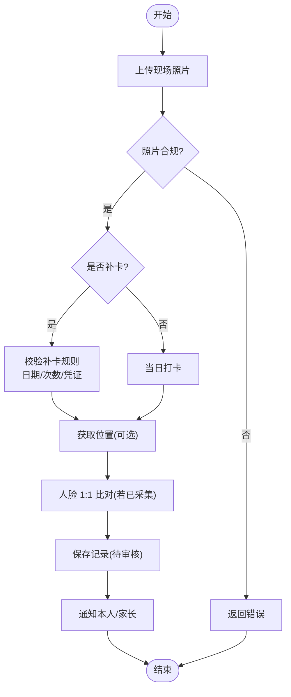

图表来源
- [checkin.py:1-80](file://summer-homework-checkin/backend/app/routers/checkin.py#L1-L80)
- [checkin_service.py:1-254](file://summer-homework-checkin/backend/app/services/checkin_service.py#L1-L254)
- [face_service.py:1-133](file://summer-homework-checkin/backend/app/services/face_service.py#L1-L133)

章节来源
- [checkin.py:1-80](file://summer-homework-checkin/backend/app/routers/checkin.py#L1-L80)
- [checkin_service.py:1-254](file://summer-homework-checkin/backend/app/services/checkin_service.py#L1-L254)
- [face_service.py:1-133](file://summer-homework-checkin/backend/app/services/face_service.py#L1-L133)

### 人脸识别采集与比对
- 采集：仅学生可用，要求检测到且仅一张人脸，保存底图与特征向量。
- 比对：打卡时提取现场照特征，与底图做余弦相似度计算；低于阈值拒绝或标记风险（可配置）。
- 降级：无外网/模型不可用时，已采集账号不通过则拒绝打卡，防止绕过。

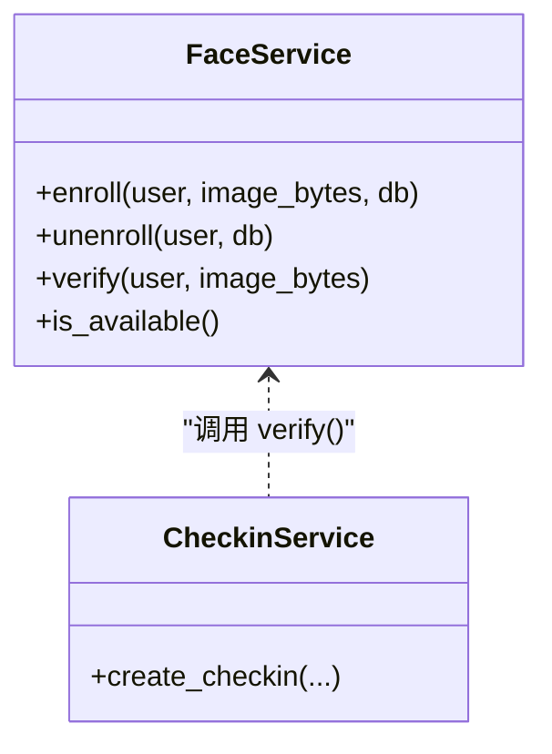

图表来源
- [face_service.py:1-133](file://summer-homework-checkin/backend/app/services/face_service.py#L1-L133)
- [checkin_service.py:1-254](file://summer-homework-checkin/backend/app/services/checkin_service.py#L1-L254)

章节来源
- [face.py:1-45](file://summer-homework-checkin/backend/app/routers/face.py#L1-L45)
- [face_service.py:1-133](file://summer-homework-checkin/backend/app/services/face_service.py#L1-L133)
- [checkin_service.py:1-254](file://summer-homework-checkin/backend/app/services/checkin_service.py#L1-L254)

### 积分商城与兑换
- 列表：展示上架且积分>0的奖品，区分抽奖券与实物。
- 兑换：
  - 抽奖券：直接增加抽奖券数量，创建 fulfilled 记录。
  - 实物：扣积分、减库存，创建 pending 记录，等待管理员核实。
- 替换：将 pending 状态的兑换替换为新奖品，退原积分、扣新积分、回滚/扣减库存。
- **更新** 优化了mall对象初始化，确保lottery_tickets字段始终存在，避免渲染错误。

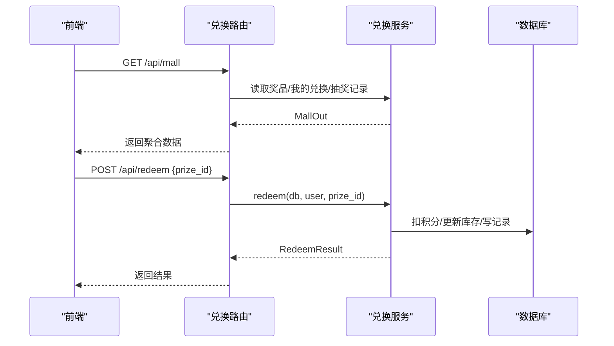

图表来源
- [redeem.py:1-81](file://summer-homework-checkin/backend/app/routers/redeem.py#L1-L81)
- [redeem_service.py:1-168](file://summer-homework-checkin/backend/app/services/redeem_service.py#L1-L168)

章节来源
- [redeem.py:1-81](file://summer-homework-checkin/backend/app/routers/redeem.py#L1-L81)
- [redeem_service.py:1-168](file://summer-homework-checkin/backend/app/services/redeem_service.py#L1-L168)

### 抽奖系统
- 资格：连续有效打卡每满 7 天自动获得 1 次，永久累积。
- 抽取：从上架且库存充足奖品中按概率加权随机；中奖则扣库存并生成兑换记录。
- 结果：返回是否中奖、奖品名、剩余票数等。
- **更新** 扩展了streak对象结构，包含完整的抽奖券统计信息。

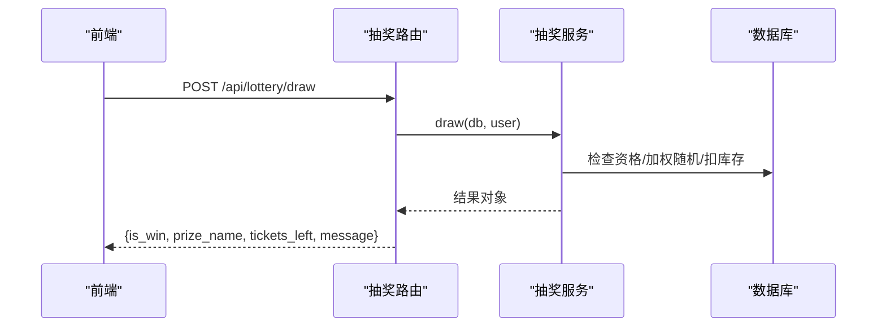

图表来源
- [lottery.py:1-30](file://summer-homework-checkin/backend/app/routers/lottery.py#L1-L30)
- [lottery_service.py:1-77](file://summer-homework-checkin/backend/app/services/lottery_service.py#L1-L77)

章节来源
- [lottery.py:1-30](file://summer-homework-checkin/backend/app/routers/lottery.py#L1-L30)
- [lottery_service.py:1-77](file://summer-homework-checkin/backend/app/services/lottery_service.py#L1-L77)

### 双角色支持（学生/家长）

**更新** 双角色支持现已包含完整的家长-学生绑定功能和多孩子管理能力，并修复了家长登录空白页面问题。

- 学生：独立账号，拥有绑定码，用于家长绑定。
- 家长：绑定一个孩子或多个孩子，可在界面切换当前操作主体，代打卡、代兑换、代抽奖、查看报告。
- 权限：家长接口均校验绑定关系，越权访问将被拒绝。
- 状态管理：通过 actingChildId 控制当前操作的孩子，subjectId 和 subjectName 计算属性动态获取当前主体信息。
- **更新** 增强了无孩子场景的数据初始化，确保家长首次登录时不会出现空白页面。

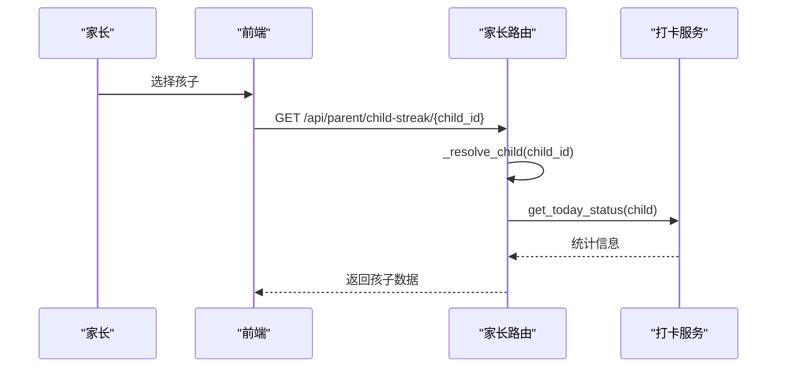

图表来源
- [parent.py:1-237](file://summer-homework-checkin/backend/app/routers/parent.py#L1-L237)
- [checkin_service.py:1-254](file://summer-homework-checkin/backend/app/services/checkin_service.py#L1-L254)

章节来源
- [parent.py:1-237](file://summer-homework-checkin/backend/app/routers/parent.py#L1-L237)
- [app.js:1-428](file://summer-homework-checkin/frontend/student/app.js#L1-L428)

### 前端状态管理与组件通信
- 状态管理：单一 Vue 实例 data 集中管理用户、打卡、人脸、商城、抽奖、闯关任务等状态；computed 派生 isParent、subjectId、subjectName、points 等。
- 组件通信：通过 go(view) 切换页面，按需拉取数据；父子交互通过事件与 v-model 双向绑定；弹窗使用模态变量控制显示。
- 数据同步：进入页面或切换主体时主动刷新相关数据，保证一致性。
- 绑定状态：bindForm 管理绑定表单数据，bindBusy 控制绑定按钮状态。
- **更新** 增强了数据结构的健壮性，确保所有必需字段在任何场景下都存在。

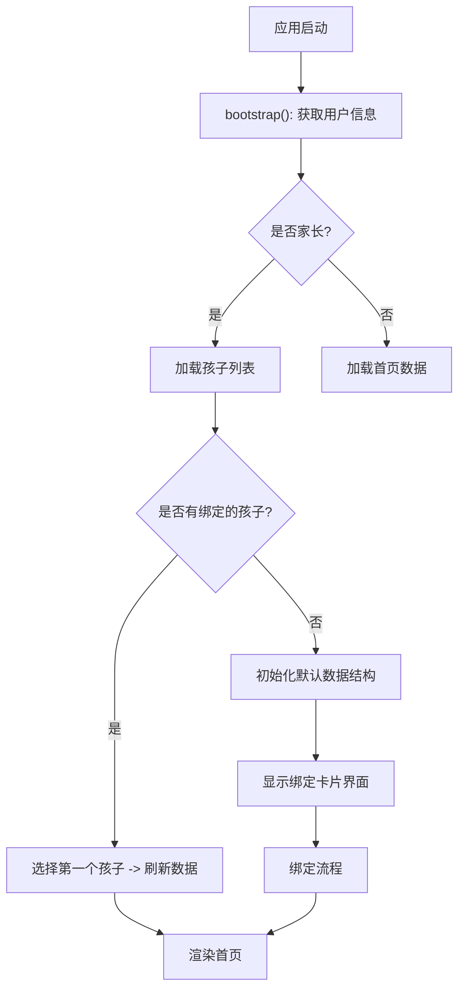

图表来源
- [app.js:1-428](file://summer-homework-checkin/frontend/student/app.js#L1-L428)
- [index.html:1-368](file://summer-homework-checkin/frontend/student/index.html#L1-L368)

章节来源
- [app.js:1-428](file://summer-homework-checkin/frontend/student/app.js#L1-L428)
- [index.html:1-368](file://summer-homework-checkin/frontend/student/index.html#L1-L368)

### 文件上传处理
- 前端：使用 FileReader 预览图片，FormData 组装 photo/proof/face 等字段上传。
- 后端：统一校验图片格式/大小/尺寸，落盘到 uploads 目录并通过静态挂载对外暴露 URL。
- 场景：打卡照片、补卡凭证、人脸底图、通用图片上传。

章节来源
- [checkin.py:1-80](file://summer-homework-checkin/backend/app/routers/checkin.py#L1-L80)
- [face.py:1-45](file://summer-homework-checkin/backend/app/routers/face.py#L1-L45)
- [main.py:1-49](file://summer-homework-checkin/backend/app/main.py#L1-L49)
- [app.js:1-428](file://summer-homework-checkin/frontend/student/app.js#L1-L428)

### 地理位置获取
- 前端：navigator.geolocation 获取经纬度，失败仍可提交但会标记风险。
- 后端：记录 geo_distance/geo_flag，结合常用位置阈值判定风险等级。

章节来源
- [app.js:1-428](file://summer-homework-checkin/frontend/student/app.js#L1-L428)
- [checkin_service.py:1-254](file://summer-homework-checkin/backend/app/services/checkin_service.py#L1-L254)

### 表单验证
- 前端：必填项校验（照片、补卡日期/凭证）、积分不足提示、重复提交保护。
- 后端：照片体积/尺寸、补卡日期范围与次数上限、角色权限校验、业务规则校验。
- 绑定验证：家长-学生绑定时的用户名和绑定码验证，防止重复绑定。

章节来源
- [app.js:1-428](file://summer-homework-checkin/frontend/student/app.js#L1-L428)
- [checkin_service.py:1-254](file://summer-homework-checkin/backend/app/services/checkin_service.py#L1-L254)
- [parent.py:20-32](file://summer-homework-checkin/backend/app/routers/parent.py#L20-L32)

### 响应式布局与用户体验
- 移动端优先：viewport 设置、底部导航、卡片式布局、大按钮与清晰步骤提示。
- 反馈：Toast 提示、禁用态按钮、进度文案（如"抽奖中…"、"提交中…"、"绑定中…"）。
- 容错：定位失败仍可提交、人脸模型不可用时的明确提示。
- 绑定界面：专门的绑定卡片样式，清晰的输入提示和操作反馈。
- **更新** 增强了待审核状态的显示，提供更好的用户反馈。

章节来源
- [index.html:1-368](file://summer-homework-checkin/frontend/student/index.html#L1-L368)
- [student.css:1-202](file://summer-homework-checkin/frontend/student/student.css#L1-202)
- [app.js:1-428](file://summer-homework-checkin/frontend/student/app.js#L1-L428)

### 错误处理策略
- 前端：统一 api 方法捕获非 2xx 响应，抛出错误并 toast 提示；401 自动退出登录。
- 后端：HTTPException 返回 detail 信息；关键流程（人脸、补卡、库存、积分、绑定）均有明确错误码与消息。

章节来源
- [app.js:1-428](file://summer-homework-checkin/frontend/student/app.js#L1-L428)
- [checkin_service.py:1-254](file://summer-homework-checkin/backend/app/services/checkin_service.py#L1-L254)
- [redeem_service.py:1-168](file://summer-homework-checkin/backend/app/services/redeem_service.py#L1-L168)
- [parent.py:20-32](file://summer-homework-checkin/backend/app/routers/parent.py#L20-L32)

## 依赖关系分析
- 路由层依赖服务层，服务层依赖配置与工具（存储、图像、通知等）。
- 前端依赖后端统一入口 main.py 提供的静态资源与 API。
- 家长功能依赖 StudentParent 关联表实现多对多关系。

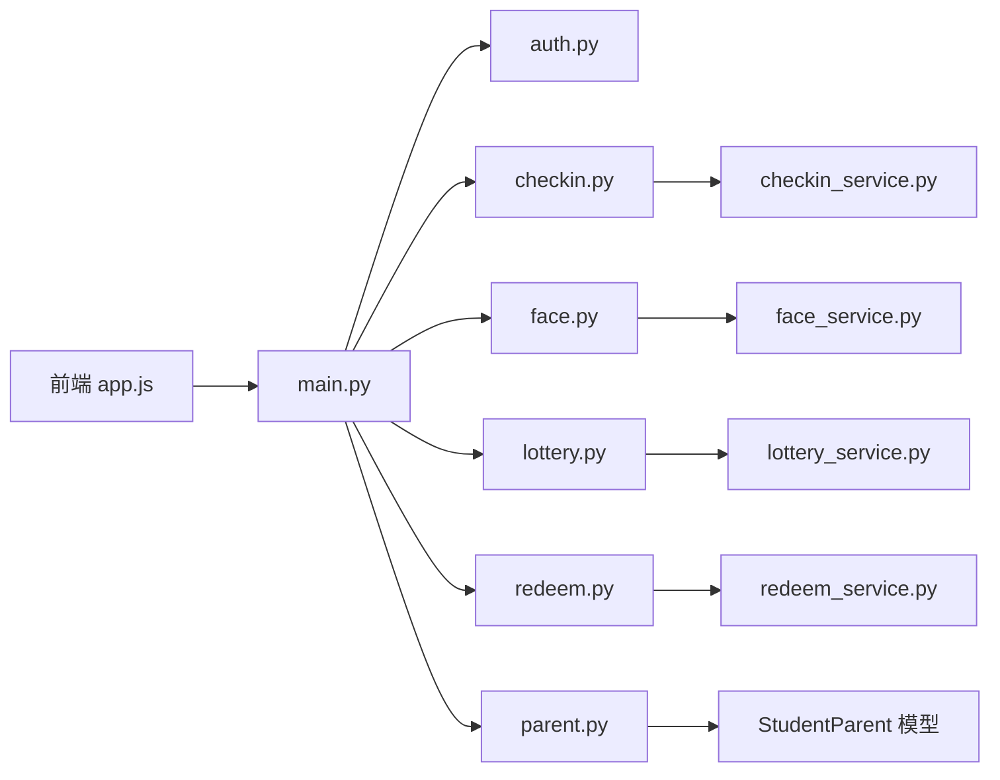

图表来源
- [main.py:1-49](file://summer-homework-checkin/backend/app/main.py#L1-L49)
- [auth.py:1-52](file://summer-homework-checkin/backend/app/routers/auth.py#L1-L52)
- [checkin.py:1-80](file://summer-homework-checkin/backend/app/routers/checkin.py#L1-L80)
- [face.py:1-45](file://summer-homework-checkin/backend/app/routers/face.py#L1-L45)
- [lottery.py:1-30](file://summer-homework-checkin/backend/app/routers/lottery.py#L1-L30)
- [redeem.py:1-81](file://summer-homework-checkin/backend/app/routers/redeem.py#L1-L81)
- [parent.py:1-237](file://summer-homework-checkin/backend/app/routers/parent.py#L1-L237)
- [checkin_service.py:1-254](file://summer-homework-checkin/backend/app/services/checkin_service.py#L1-L254)
- [face_service.py:1-133](file://summer-homework-checkin/backend/app/services/face_service.py#L1-L133)
- [lottery_service.py:1-77](file://summer-homework-checkin/backend/app/services/lottery_service.py#L1-L77)
- [redeem_service.py:1-168](file://summer-homework-checkin/backend/app/services/redeem_service.py#L1-L168)
- [models.py:58-69](file://summer-homework-checkin/backend/app/models.py#L58-L69)

章节来源
- [main.py:1-49](file://summer-homework-checkin/backend/app/main.py#L1-L49)
- [config.py:1-50](file://summer-homework-checkin/backend/app/config.py#L1-L50)

## 性能与体验优化
- 懒加载与缓存
  - 人脸分析器懒加载，避免冷启动开销；首次下载模型后常驻内存。
- 并发与稳定性
  - 后端多 worker 部署建议；SQLite 适合演示，生产建议迁移至 PostgreSQL/MySQL。
- 前端体验
  - 减少不必要的网络请求，仅在必要时机刷新数据；大按钮与分步引导降低误操作。
  - 绑定操作的状态管理和防重复提交机制。
  - **更新** 增强了数据结构的健壮性，避免了因字段缺失导致的渲染错误。
- 图片与存储
  - 严格图片校验，避免恶意文件；静态资源可考虑 CDN 加速。

[本节为通用指导，无需源码引用]

## 故障排查指南
- 401 未授权
  - 检查前端是否携带 Authorization 头；确认 Token 未过期。
- 人脸比对失败
  - 确认已采集人脸底图；检查模型可用性；必要时调整阈值或切换策略。
- 补卡失败
  - 检查目标日期是否在暑假范围内、是否超过月度次数上限、是否已有有效打卡。
- 兑换失败
  - 检查积分是否足够、奖品是否上架、库存是否为 0。
- 定位失败
  - 浏览器可能拒绝定位；仍允许提交但会标记风险。
- 绑定失败
  - 检查孩子用户名是否正确、绑定码是否匹配、是否已重复绑定。
- **更新** 家长登录空白页面
  - 确认loadChildren()函数中的无孩子场景数据初始化逻辑是否正常执行。
  - 检查streak、today、mall对象的所有必需字段是否都已正确初始化。

章节来源
- [app.js:1-428](file://summer-homework-checkin/frontend/student/app.js#L1-L428)
- [checkin_service.py:1-254](file://summer-homework-checkin/backend/app/services/checkin_service.py#L1-L254)
- [face_service.py:1-133](file://summer-homework-checkin/backend/app/services/face_service.py#L1-L133)
- [redeem_service.py:1-168](file://summer-homework-checkin/backend/app/services/redeem_service.py#L1-L168)
- [parent.py:20-32](file://summer-homework-checkin/backend/app/routers/parent.py#L20-L32)

## 结论
学生端以轻量、易用的方式实现了完整的打卡闭环与激励体系。通过严格的防代打卡机制（照片/地理/人脸）与清晰的家长代理能力，兼顾了真实性与易用性。**本次更新重点修复了家长登录空白页面问题，通过增强前端数据结构的健壮性，完善了无孩子场景的数据初始化逻辑，确保了系统在各种边界情况下的稳定运行**。分层架构与统一 API 封装使扩展与维护成本可控，便于后续接入更多玩法与报表能力。

[本节为总结，无需源码引用]

## 附录：API 参考
- 认证
  - POST /api/auth/register
  - POST /api/auth/login
  - GET /api/auth/me
- 家长绑定
  - POST /api/parent/bind
  - GET /api/parent/children
- 打卡
  - POST /api/checkin
  - GET /api/checkin/today
  - GET /api/checkin/streak
  - GET /api/checkin/history
- 人脸
  - POST /api/face/enroll
  - GET /api/face/status
  - DELETE /api/face/enroll
- 抽奖
  - GET /api/lottery/tickets
  - POST /api/lottery/draw
- 积分商城
  - GET /api/mall
  - POST /api/redeem
  - POST /api/redeem/{rid}/replace
- 家长代理
  - GET /api/parent/child-streak/{child_id}
  - POST /api/parent/checkin
  - GET /api/parent/mall/{child_id}
  - POST /api/parent/redeem?child_id=...
  - POST /api/parent/redeem/{rid}/replace
  - GET /api/parent/lottery/{child_id}
  - POST /api/parent/lottery/{child_id}/draw
  - GET /api/parent/notifications
  - PATCH /api/parent/notifications/{nid}/read
  - GET /api/parent/child-report/{child_id}[?start=&end=]
  - GET /api/parent/child-report/{child_id}/html[?start=&end=]
- 健康检查
  - GET /api/health

章节来源
- [README.md:81-94](file://summer-homework-checkin/README.md#L81-L94)
- [auth.py:1-52](file://summer-homework-checkin/backend/app/routers/auth.py#L1-L52)
- [parent.py:1-237](file://summer-homework-checkin/backend/app/routers/parent.py#L1-L237)
- [checkin.py:1-80](file://summer-homework-checkin/backend/app/routers/checkin.py#L1-L80)
- [face.py:1-45](file://summer-homework-checkin/backend/app/routers/face.py#L1-L45)
- [lottery.py:1-30](file://summer-homework-checkin/backend/app/routers/lottery.py#L1-L30)
- [redeem.py:1-81](file://summer-homework-checkin/backend/app/routers/redeem.py#L1-L81)
- [main.py:33-36](file://summer-homework-checkin/backend/app/main.py#L33-L36)