# 学生端应用

<cite>
**本文引用的文件**   
- [README.md](file://summer-homework-checkin/README.md)
- [index.html](file://summer-homework-checkin/frontend/student/index.html)
- [app.js](file://summer-homework-checkin/frontend/student/app.js)
- [student.css](file://summer-homework-checkin/frontend/student/student.css)
- [main.py](file://summer-homework-checkin/backend/app/main.py)
- [config.py](file://summer-homework-checkin/backend/app/config.py)
- [auth.py](file://summer-homework-checkin/backend/app/routers/auth.py)
- [checkin.py](file://summer-homework-checkin/backend/app/routers/checkin.py)
- [face.py](file://summer-homework-checkin/backend/app/routers/face.py)
- [lottery.py](file://summer-homework-checkin/backend/app/routers/lottery.py)
- [redeem.py](file://summer-homework-checkin/backend/app/routers/redeem.py)
- [parent.py](file://summer-homework-checkin/backend/app/routers/parent.py)
- [uploads.py](file://summer-homework-checkin/backend/app/routers/uploads.py)
- [deps.py](file://summer-homework-checkin/backend/app/deps.py)
- [security.py](file://summer-homework-checkin/backend/app/security.py)
- [models.py](file://summer-homework-checkin/backend/app/models.py)
- [schemas.py](file://summer-homework-checkin/backend/app/schemas.py)
- [checkin_service.py](file://summer-homework-checkin/backend/app/services/checkin_service.py)
- [face_service.py](file://summer-homework-checkin/backend/app/services/face_service.py)
- [lottery_service.py](file://summer-homework-checkin/backend/app/services/lottery_service.py)
- [redeem_service.py](file://summer-homework-checkin/backend/app/services/redeem_service.py)
- [image.py](file://summer-homework-checkin/backend/app/utils/image.py)
</cite>

## 更新摘要
**变更内容**   
- 学生端应用集成了完整的图片自动压缩功能，包括blobToFile兼容处理、canvas转Blob的双路径实现（toBlob优先，toDataURL回退）、EXIF方向检测与修正、以及针对微信X5内核的FormData三参数append修复
- 实现了智能图片质量调节机制，支持多级压缩策略确保文件大小符合要求
- 增强了移动端兼容性，特别优化了微信内置浏览器的上传体验
- 完善了图片验证和错误处理机制，提供更好的用户体验

## 目录
1. [引言](#引言)
2. [项目结构](#项目结构)
3. [核心组件](#核心组件)
4. [架构总览](#架构总览)
5. [详细组件分析](#详细组件分析)
6. [依赖关系分析](#依赖关系分析)
7. [性能与体验优化](#性能与体验优化)
8. [故障排查指南](#故障排查指南)
9. [结论](#结论)
10. [附录：API 参考](#附录api-参考)

## 引言
本设计文档面向"暑假作业打卡系统"的学生端（H5，基于 Vue 3 CDN），围绕用户认证、打卡流程、人脸识别采集、积分商城与抽奖系统、双角色（学生/家长）机制、状态管理与组件通信、文件上传、地理位置获取、表单验证、响应式布局、错误处理策略以及 API 封装与数据同步等主题进行系统化阐述。目标是帮助开发者快速理解并扩展学生端功能。

**更新** 本次更新重点完成了图片自动压缩功能的集成，通过blobToFile兼容处理、canvas转Blob的双路径实现、EXIF方向检测与修正，以及针对微信X5内核的FormData三参数append修复，显著提升了图片上传的成功率和用户体验。同时完善了认证感知文件加载机制，通过v-auth-src指令和受保护的/api/uploads接口，确保只有经过身份验证的用户才能访问敏感图片资源。**新增的图片自动压缩功能有效解决了大图片上传失败的问题，特别是在移动设备和微信内置浏览器环境下**。

## 项目结构
学生端采用前后端分离架构：
- 前端：Vue 3 单页应用，通过 bootcdn.net CDN 引入，免构建；静态资源由后端托管。
- 后端：FastAPI 提供 RESTful API，统一挂载路由、静态资源与 CORS。

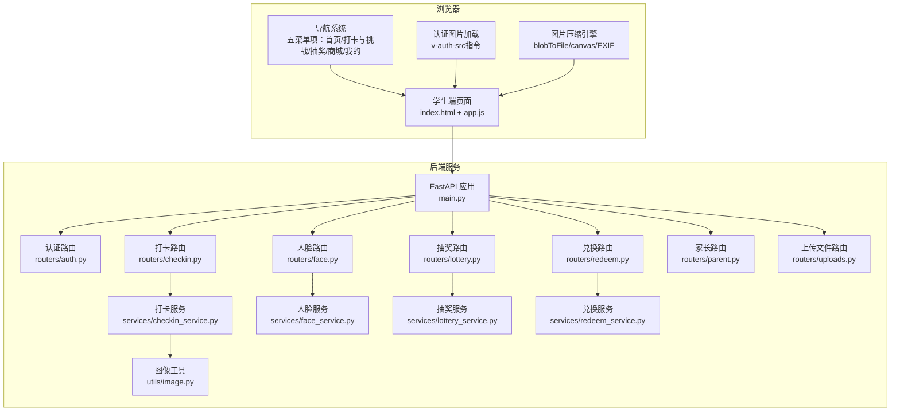
```mermaid
graph TB
subgraph "浏览器"
UI["学生端页面<br/>index.html + app.js"]
NAV["导航系统<br/>五菜单项：首页/打卡与挑战/抽奖/商城/我的"]
AUTHIMG["认证图片加载<br/>v-auth-src指令"]
COMPRESS["图片压缩引擎<br/>blobToFile/canvas/EXIF"]
end
subgraph "后端服务"
APP["FastAPI 应用<br/>main.py"]
AUTH["认证路由<br/>routers/auth.py"]
CHECKIN["打卡路由<br/>routers/checkin.py"]
FACE["人脸路由<br/>routers/face.py"]
LOTTERY["抽奖路由<br/>routers/lottery.py"]
REDEEM["兑换路由<br/>routers/redeem.py"]
PARENT["家长路由<br/>routers/parent.py"]
UPLOADS["上传文件路由<br/>routers/uploads.py"]
CSVC["打卡服务<br/>services/checkin_service.py"]
FSVC["人脸服务<br/>services/face_service.py"]
LSVC["抽奖服务<br/>services/lottery_service.py"]
RSVC["兑换服务<br/>services/redeem_service.py"]
IMGUTIL["图像工具<br/>utils/image.py"]
end
UI --> APP
NAV --> UI
AUTHIMG --> UI
COMPRESS --> UI
APP --> AUTH
APP --> CHECKIN
APP --> FACE
APP --> LOTTERY
APP --> REDEEM
APP --> PARENT
APP --> UPLOADS
CHECKIN --> CSVC
FACE --> FSVC
LOTTERY --> LSVC
REDEEM --> RSVC
CSVC --> IMGUTIL
```

图表来源
- [main.py:1-110](file://summer-homework-checkin/backend/app/main.py#L1-L110)
- [index.html:1-422](file://summer-homework-checkin/frontend/student/index.html#L1-L422)
- [app.js:1-905](file://summer-homework-checkin/frontend/student/app.js#L1-L905)

章节来源
- [README.md:1-126](file://summer-homework-checkin/README.md#L1-L126)
- [main.py:1-110](file://summer-homework-checkin/backend/app/main.py#L1-L110)
- [index.html:1-422](file://summer-homework-checkin/frontend/student/index.html#L1-L422)
- [app.js:1-905](file://summer-homework-checkin/frontend/student/app.js#L1-L905)

## 核心组件
- 认证与会话
  - 注册/登录返回访问令牌，前端持久化到本地存储并在后续请求中携带 Authorization 头。
  - 支持 student/parent 两种角色，注册时按角色写入差异化字段。
  - 密码修改功能，支持用户自主修改账户密码，包含完整的前后端验证机制。
- 家长-学生绑定功能
  - 家长登录后显示绑定卡片界面，输入孩子用户名和绑定码完成绑定。
  - 支持多孩子管理，可切换当前操作主体，自动刷新相关数据。
  - 绑定成功后自动导航到首页或保持当前视图。
  - 增强了无孩子场景的数据初始化，避免家长登录时出现空白页面。
- **更新** 认证感知文件加载机制
  - 通过v-auth-src指令实现带Bearer令牌认证的图片加载
  - 后端提供受保护的/api/uploads接口，需要有效的用户认证
  - 支持权限校验，学生只能访问自己的文件，家长只能访问已绑定孩子的文件
  - 提供友好的错误处理和降级机制，确保用户体验
- **更新** 图片自动压缩功能
  - 实现了完整的图片压缩流水线，支持blobToFile兼容处理
  - canvas转Blob的双路径实现（toBlob优先，toDataURL回退）
  - EXIF方向检测与修正，确保图片正确显示
  - 针对微信X5内核的FormData三参数append修复
  - 智能质量调节，多级压缩策略确保文件大小符合要求
- **更新** 打卡与挑战整合功能
  - 将打卡和挑战功能整合到统一页面，提供集中的任务管理和进度跟踪。
  - 支持正常打卡与补卡两条路径，照片体积/尺寸校验、地理距离标记、人脸 1:1 比对（可配置策略）。
  - 审核通过后发放积分、重算连续天数并按每满 7 天发放抽奖资格。
  - **新增** 积分显示增强：在打卡时显示配置的积分值，提供奖励系统的透明度。
  - 增强了今日打卡状态的显示，包括待审核状态的计数。
- 人脸识别采集
  - 仅学生可采集底图；模型不可用时自动降级为安全模式，已采集账号不通过则拒绝打卡。
  - 人脸底图通过认证机制保护，防止未授权访问。
- 积分商城与兑换
  - 支持积分兑换实物奖品（待发放）与抽奖券（自动兑现），支持替换未发放的兑换记录。
  - 优化了mall对象初始化，确保lottery_tickets字段始终存在。
- 抽奖系统
  - 消耗 1 张抽奖券，按概率与库存加权随机抽取；中奖自动生成兑换记录。
  - 扩展了streak对象结构，包含完整的抽奖券统计信息。
- 双角色与家长代理
  - 家长绑定孩子后，可切换查看/代操作（打卡、兑换、抽奖、报告）。
  - 增强了streak对象结构，包含完整的统计信息字段。
- 前端状态与通信
  - 单一 Vue 实例集中管理状态；统一的 api 方法封装 fetch，统一鉴权与错误提示；根据 isParent 分支选择不同 API。
  - 增强了数据结构的健壮性，提供更好的向后兼容性。
  - **新增** 静态资源路径优化，支持子路径部署和CDN加速。
  - **新增** 积分显示增强，在打卡流程中实时反馈积分奖励信息。
  - **新增** 认证感知图片加载，通过v-auth-src指令安全加载受保护的文件。

章节来源
- [auth.py:1-67](file://summer-homework-checkin/backend/app/routers/auth.py#L1-L67)
- [parent.py:1-237](file://summer-homework-checkin/backend/app/routers/parent.py#L1-L237)
- [checkin.py:1-80](file://summer-homework-checkin/backend/app/routers/checkin.py#L1-L80)
- [face.py:1-45](file://summer-homework-checkin/backend/app/routers/face.py#L1-L45)
- [lottery.py:1-30](file://summer-homework-checkin/backend/app/routers/lottery.py#L1-L30)
- [redeem.py:1-81](file://summer-homework-checkin/backend/app/routers/redeem.py#L1-L81)
- [uploads.py:1-55](file://summer-homework-checkin/backend/app/routers/uploads.py#L1-L55)
- [deps.py:1-34](file://summer-homework-checkin/backend/app/deps.py#L1-L34)
- [checkin_service.py:1-266](file://summer-homework-checkin/backend/app/services/checkin_service.py#L1-L266)
- [face_service.py:1-133](file://summer-homework-checkin/backend/app/services/face_service.py#L1-L133)
- [lottery_service.py:1-77](file://summer-homework-checkin/backend/app/services/lottery_service.py#L1-L77)
- [redeem_service.py:1-168](file://summer-homework-checkin/backend/app/services/redeem_service.py#L1-L168)
- [app.js:1-905](file://summer-homework-checkin/frontend/student/app.js#L1-L905)
- [index.html:1-422](file://summer-homework-checkin/frontend/student/index.html#L1-L422)

## 架构总览
整体采用"前端单页 + 后端 FastAPI 微服务化路由 + 业务服务层"的分层架构。前端通过统一 API 封装发起请求，后端路由负责参数解析与权限校验，具体业务逻辑下沉至 services 层，确保高内聚低耦合。

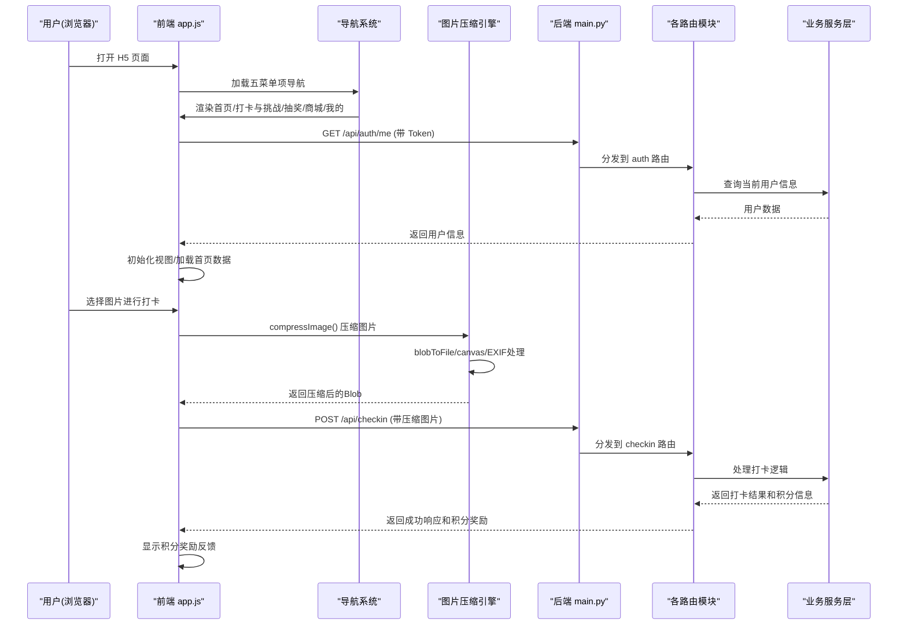
```mermaid
sequenceDiagram
participant U as "用户(浏览器)"
participant FE as "前端 app.js"
participant NAV as "导航系统"
participant COMP as "图片压缩引擎"
participant BE as "后端 main.py"
participant R as "各路由模块"
participant S as "业务服务层"
U->>FE : 打开 H5 页面
FE->>NAV : 加载五菜单项导航
NAV->>FE : 渲染首页/打卡与挑战/抽奖/商城/我的
FE->>BE : GET /api/auth/me (带 Token)
BE->>R : 分发到 auth 路由
R->>S : 查询当前用户信息
S-->>R : 用户数据
R-->>FE : 返回用户信息
FE->>FE : 初始化视图/加载首页数据
U->>FE : 选择图片进行打卡
FE->>COMP : compressImage() 压缩图片
COMP->>COMP : blobToFile/canvas/EXIF处理
COMP-->>FE : 返回压缩后的Blob
FE->>BE : POST /api/checkin (带压缩图片)
BE->>R : 分发到 checkin 路由
R->>S : 处理打卡逻辑
S-->>R : 返回打卡结果和积分信息
R-->>FE : 返回成功响应和积分奖励
FE->>FE : 显示积分奖励反馈
```

图表来源
- [main.py:1-110](file://summer-homework-checkin/backend/app/main.py#L1-L110)
- [auth.py:1-67](file://summer-homework-checkin/backend/app/routers/auth.py#L1-L67)
- [app.js:1-905](file://summer-homework-checkin/frontend/student/app.js#L1-L905)

## 详细组件分析

### 用户认证流程
- 注册：支持 student/parent 角色，生成绑定码（学生），签发 Token。
- 登录：校验用户名密码，签发 Token。
- 会话：前端在 localStorage 保存 Token，所有请求自动附加 Authorization 头；401 自动登出。
- 密码修改：支持用户通过 PUT /api/auth/password 接口修改密码，需要验证原密码并提供新密码。

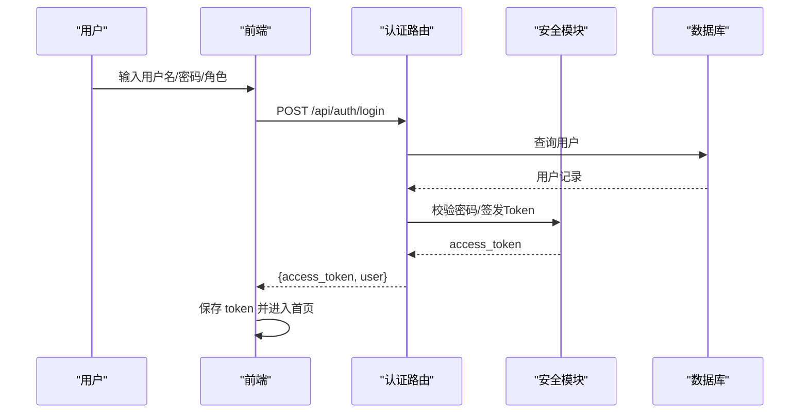
```mermaid
sequenceDiagram
participant U as "用户"
participant FE as "前端"
participant AUTH as "认证路由"
participant SEC as "安全模块"
participant DB as "数据库"
U->>FE : 输入用户名/密码/角色
FE->>AUTH : POST /api/auth/login
AUTH->>DB : 查询用户
DB-->>AUTH : 用户记录
AUTH->>SEC : 校验密码/签发Token
SEC-->>AUTH : access_token
AUTH-->>FE : {access_token, user}
FE->>FE : 保存 token 并进入首页
```

图表来源
- [auth.py:1-67](file://summer-homework-checkin/backend/app/routers/auth.py#L1-L67)
- [app.js:1-905](file://summer-homework-checkin/frontend/student/app.js#L1-L905)

章节来源
- [auth.py:1-67](file://summer-homework-checkin/backend/app/routers/auth.py#L1-L67)
- [app.js:1-905](file://summer-homework-checkin/frontend/student/app.js#L1-L905)

### 导航系统重构与五菜单项架构

**更新** 学生端应用已完成导航系统的重大重构，从原来的四菜单项重组为五个主要功能模块，显著提升了用户体验和功能组织性。

#### 新的五菜单项结构
- **首页**：展示用户基本信息、打卡统计、快捷入口
- **打卡与挑战**：整合打卡和挑战功能的统一页面，提供集中的任务管理
- **抽奖**：独立的抽奖功能页面，支持抽奖券使用和结果查看
- **商城**：积分商城页面，支持奖品浏览和兑换操作
- **我的**：个人中心页面，包含账户设置、密码修改等功能

#### 导航实现机制
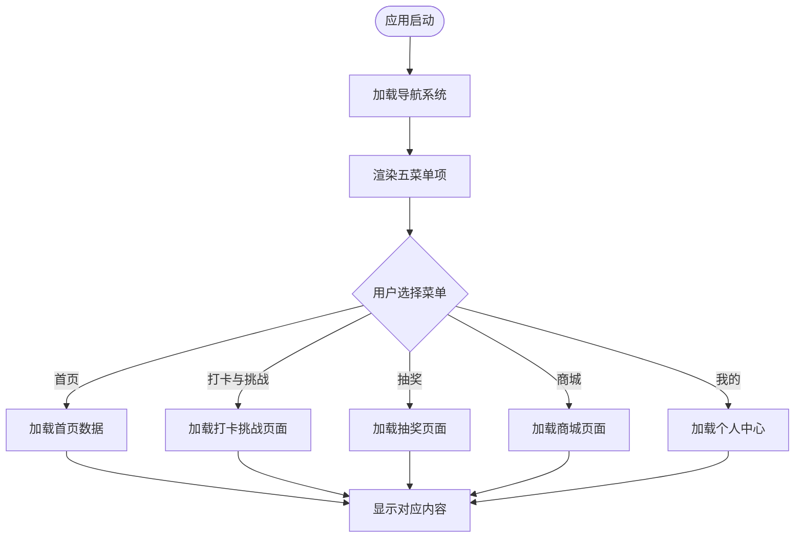
```mermaid
flowchart TD
Start(["应用启动"]) --> LoadNav["加载导航系统"]
LoadNav --> RenderMenu["渲染五菜单项"]
RenderMenu --> UserSelect{"用户选择菜单"}
UserSelect -- 首页 --> HomeView["加载首页数据"]
UserSelect -- 打卡与挑战 --> CheckinChallenge["加载打卡挑战页面"]
UserSelect -- 抽奖 --> LotteryView["加载抽奖页面"]
UserSelect -- 商城 --> MallView["加载商城页面"]
UserSelect -- 我的 --> ProfileView["加载个人中心"]
HomeView --> DisplayContent["显示对应内容"]
CheckinChallenge --> DisplayContent
LotteryView --> DisplayContent
MallView --> DisplayContent
ProfileView --> DisplayContent
```

图表来源
- [app.js:1-905](file://summer-homework-checkin/frontend/student/app.js#L1-L905)
- [index.html:1-422](file://summer-homework-checkin/frontend/student/index.html#L1-L422)

#### 打卡与挑战整合功能
- **统一页面设计**：将原本分散的打卡和挑战功能整合到一个页面中
- **任务管理**：提供清晰的任务列表和进度跟踪界面
- **状态同步**：实时同步打卡状态和挑战完成情况
- **用户体验优化**：减少页面跳转，提升操作效率

#### 静态资源路径优化
- **相对路径优化**：CSS和JS文件引用从绝对路径改为相对路径，提升部署灵活性
- **Vue.js CDN迁移**：从unpkg.com迁移至bootcdn.net（国内CDN服务）
- **基础路径支持**：实现BASE_PATH自动检测机制，支持子路径部署场景
- **静态资源URL处理**：新增fixUrl方法统一处理图片、文件等静态资源的URL拼接

**Section sources**
- [app.js:1-905](file://summer-homework-checkin/frontend/student/app.js#L1-L905)
- [index.html:1-422](file://summer-homework-checkin/frontend/student/index.html#L1-L422)

### 认证感知文件加载机制

**新增** 学生端应用现已实现认证感知的文件加载机制，通过v-auth-src指令确保只有经过身份验证的用户才能访问敏感图片资源。

#### v-auth-src指令实现
- **自定义指令**：实现Vue 3自定义指令，监听元素的生命周期钩子
- **认证检查**：自动检查localStorage中的token并添加到请求头
- **动态加载**：使用fetch API获取图片blob并通过URL.createObjectURL创建临时URL
- **内存管理**：在元素卸载时自动释放创建的ObjectURL，防止内存泄漏
- **错误处理**：提供友好的错误提示和降级处理

#### 后端受保护文件访问API
- **认证中间件**：通过get_current_user依赖注入实现Bearer令牌验证
- **权限控制**：学生只能访问自己的文件，家长只能访问已绑定孩子的文件
- **路径验证**：防止路径遍历攻击，确保只访问允许的上传目录
- **缓存优化**：设置适当的Cache-Control头，平衡性能和安全性

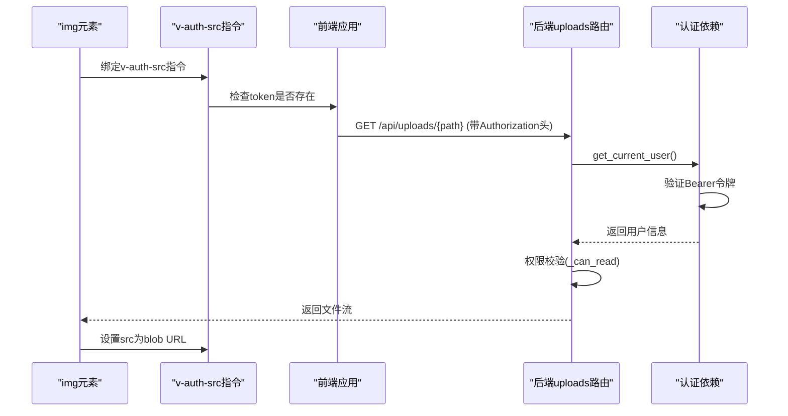
```mermaid
sequenceDiagram
participant IMG as "img元素"
participant DIR as "v-auth-src指令"
participant FE as "前端应用"
participant BE as "后端uploads路由"
participant SEC as "认证依赖"
IMG->>DIR : 绑定v-auth-src指令
DIR->>FE : 检查token是否存在
FE->>BE : GET /api/uploads/{path} (带Authorization头)
BE->>SEC : get_current_user()
SEC->>SEC : 验证Bearer令牌
SEC-->>BE : 返回用户信息
BE->>BE : 权限校验(_can_read)
BE-->>IMG : 返回文件流
IMG->>DIR : 设置src为blob URL
```

图表来源
- [app.js:178-220](file://summer-homework-checkin/frontend/student/app.js#L178-L220)
- [uploads.py:1-55](file://summer-homework-checkin/backend/app/routers/uploads.py#L1-L55)
- [deps.py:1-34](file://summer-homework-checkin/backend/app/deps.py#L1-L34)

#### 权限控制机制
- **学生权限**：只能访问以自身user_id为前缀的文件路径
- **家长权限**：通过StudentParent关联表验证是否绑定了目标用户
- **管理员权限**：拥有所有文件的访问权限
- **路径验证**：使用validate_upload_path函数防止路径遍历攻击

#### 用户体验优化
- **渐进加载**：图片加载过程中显示占位符或加载状态
- **错误降级**：网络错误或权限不足时显示友好提示信息
- **缓存策略**：合理使用浏览器缓存，减少重复请求
- **内存优化**：及时清理不再使用的ObjectURL，防止内存泄漏

**Section sources**
- [app.js:178-220](file://summer-homework-checkin/frontend/student/app.js#L178-L220)
- [uploads.py:1-55](file://summer-homework-checkin/backend/app/routers/uploads.py#L1-L55)
- [deps.py:1-34](file://summer-homework-checkin/backend/app/deps.py#L1-L34)
- [index.html:237](file://summer-homework-checkin/frontend/student/index.html#L237)

### 图片自动压缩功能实现

**新增** 学生端应用现已集成了完整的图片自动压缩功能，专门针对移动端和微信内置浏览器环境进行了深度优化。

#### 核心压缩引擎
- **blobToFile兼容处理**：解决微信X5内核中Blob.name属性不被识别的问题
- **canvas转Blob双路径实现**：优先使用toBlob方法，不支持时回退到toDataURL+手动解码
- **EXIF方向检测与修正**：自动检测图片EXIF方向信息并进行正确的旋转处理
- **智能质量调节**：多级压缩策略（0.85→0.7→0.55→0.4），确保文件大小符合要求

#### 微信X5内核适配
- **FormData三参数append修复**：在微信X5内核中必须显式传入文件名参数
- **File构造验证**：检测File构造函数是否真正可用，避免部分微信版本的兼容性问题
- **内存优化**：分块解码base64数据，防止微信WebView栈溢出

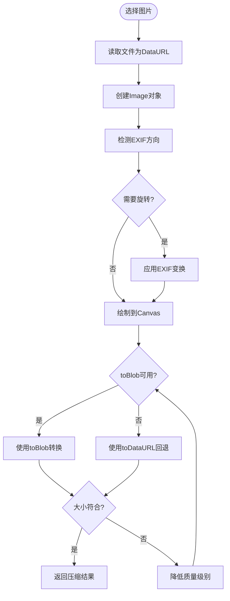
```mermaid
flowchart TD
Start(["选择图片"]) --> ReadFile["读取文件为DataURL"]
ReadFile --> CreateImg["创建Image对象"]
CreateImg --> GetExif["检测EXIF方向"]
GetExif --> Rotate{"需要旋转?"}
Rotate -- 是 --> ApplyOrient["应用EXIF变换"]
Rotate -- 否 --> DrawCanvas["绘制到Canvas"]
ApplyOrient --> DrawCanvas
DrawCanvas --> ToBlob{"toBlob可用?"}
ToBlob -- 是 --> UseToBlob["使用toBlob转换"]
ToBlob -- 否 --> UseDataURL["使用toDataURL回退"]
UseToBlob --> CheckSize{"大小符合?"}
UseDataURL --> CheckSize
CheckSize -- 是 --> Success["返回压缩结果"]
CheckSize -- 否 --> NextQuality["降低质量级别"]
NextQuality --> ToBlob
```

图表来源
- [app.js:11-176](file://summer-homework-checkin/frontend/student/app.js#L11-L176)

#### 压缩参数配置
- **最大尺寸限制**：COMPRESS_MAX_DIM = 2048px，超过此尺寸自动缩放
- **质量等级**：COMPRESS_QUALITY_STEPS = [0.85, 0.7, 0.55, 0.4]，逐级降低质量
- **最终降级**：当所有质量级别都超限时，缩小到1280px并设置0.5质量
- **文件大小限制**：PHOTO_MAX_BYTES = 10MB，MIN_PHOTO_BYTES = 5KB

#### 前端集成点
- **打卡照片处理**：onPhoto()方法调用compressImage()进行压缩
- **补卡凭证处理**：onProof()方法同样使用压缩功能
- **闯关任务照片**：onChallengePhoto()方法集成压缩流程
- **预览功能**：压缩完成后自动转换为DataURL用于预览显示

**Section sources**
- [app.js:11-176](file://summer-homework-checkin/frontend/student/app.js#L11-L176)
- [app.js:556-574](file://summer-homework-checkin/frontend/student/app.js#L556-L574)
- [app.js:849-862](file://summer-homework-checkin/frontend/student/app.js#L849-L862)

### 密码设置功能实现

**新增** 密码设置功能现已完整实现，为用户提供安全的密码修改能力。

#### 前端密码设置界面
- **密码设置卡片**：在"我的"页面新增独立的密码设置卡片区域
- **表单设计**：包含原密码、新密码、确认新密码三个输入框，带有清晰的占位符提示
- **交互控制**：通过 showPwdForm 变量控制表单显示/隐藏，pwdBusy 标志防止重复提交
- **实时验证**：前端即时验证密码格式、长度要求和一致性
- **成功处理**：修改成功后显示 Toast 提示，清空表单并关闭编辑状态

#### 密码修改流程实现
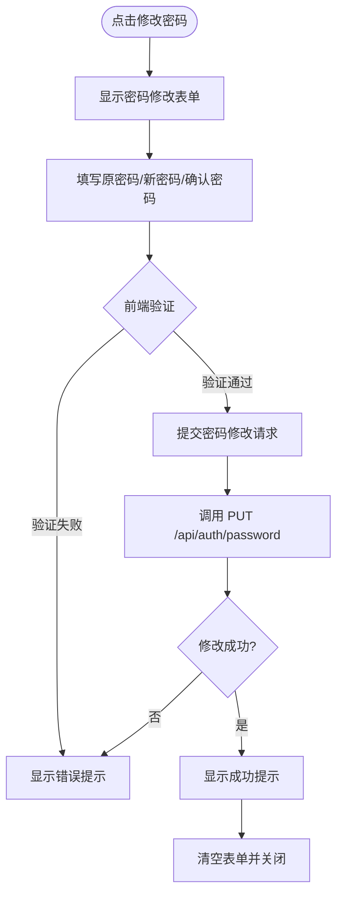
```mermaid
flowchart TD
Start(["点击修改密码"]) --> ShowForm["显示密码修改表单"]
ShowForm --> InputFields["填写原密码/新密码/确认密码"]
InputFields --> ValidateForm{"前端验证"}
ValidateForm -- 验证失败 --> ShowError["显示错误提示"]
ValidateForm -- 验证通过 --> SubmitPassword["提交密码修改请求"]
SubmitPassword --> APIRequest["调用 PUT /api/auth/password"]
APIRequest --> Success{"修改成功?"}
Success -- 是 --> ShowSuccess["显示成功提示"]
ShowSuccess --> ClearForm["清空表单并关闭"]
Success -- 否 --> ShowError
```

图表来源
- [app.js:473-490](file://summer-homework-checkin/frontend/student/app.js#L473-L490)
- [index.html:255-267](file://summer-homework-checkin/frontend/student/index.html#L255-L267)

#### 前端验证机制
- **必填项验证**：检查原密码是否为空
- **长度验证**：新密码至少需要 4 个字符
- **一致性验证**：新密码与确认密码必须一致
- **安全性验证**：新密码不能与原密码相同
- **防重复提交**：通过 pwdBusy 标志位防止重复提交请求
- **用户体验**：修改成功后自动清空表单并关闭编辑状态

#### API 通信处理
- **请求封装**：使用统一的 api 方法处理 HTTP 请求
- **错误处理**：捕获网络错误和业务错误，显示友好提示信息
- **状态管理**：通过 showPwdForm 控制表单显示状态
- **用户反馈**：通过 showToast 方法提供操作结果反馈

#### 后端密码修改接口
- **权限校验**：需要有效的用户认证令牌
- **原密码验证**：验证用户提供的原密码是否正确
- **新密码验证**：检查新密码长度要求（至少4位）
- **安全更新**：使用 PBKDF2 算法对新密码进行哈希处理
- **事务处理**：确保密码更新的原子性和一致性

#### 数据结构定义
**新增** PasswordChangeRequest schema 定义了密码修改请求的数据结构：

- **字段要求**：old_password（原密码）、new_password（新密码）
- **类型约束**：两个字段都必须是字符串类型
- **验证规则**：后端会进一步验证密码长度和安全性

**Section sources**
- [app.js:473-490](file://summer-homework-checkin/frontend/student/app.js#L473-L490)
- [index.html:255-267](file://summer-homework-checkin/frontend/student/index.html#L255-L267)
- [auth.py:56-67](file://summer-homework-checkin/backend/app/routers/auth.py#L56-L67)
- [schemas.py:40-43](file://summer-homework-checkin/backend/app/schemas.py#L40-L43)

### 家长-学生绑定功能实现

**更新** 家长-学生绑定功能现已完善，修复了家长登录空白页面问题，增强了前端数据结构的健壮性。

#### 前端绑定界面
- **绑定卡片界面**：家长登录后若未绑定任何孩子，显示专门的绑定卡片界面
- **表单设计**：包含孩子用户名和绑定码两个输入框，带有清晰的占位符提示
- **交互反馈**：绑定过程中显示"绑定中..."状态，禁用按钮防止重复提交
- **成功处理**：绑定成功后显示 Toast 提示，清空表单并自动刷新孩子列表

#### 绑定流程实现
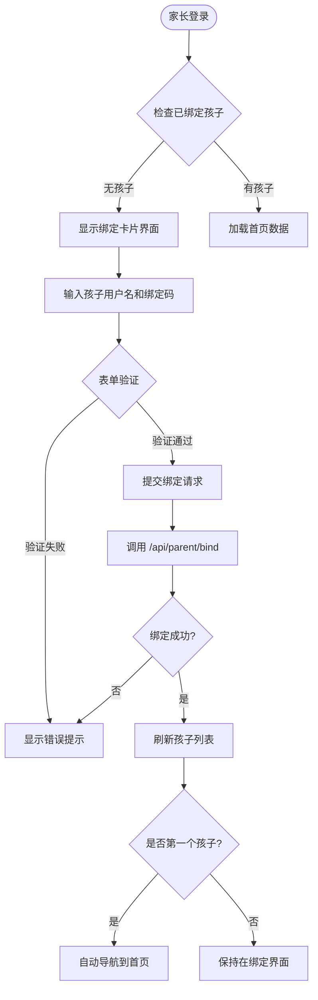
```mermaid
flowchart TD
Start(["家长登录"]) --> CheckChildren{"检查已绑定孩子"}
CheckChildren -- 无孩子 --> ShowBindCard["显示绑定卡片界面"]
CheckChildren -- 有孩子 --> LoadHome["加载首页数据"]
ShowBindCard --> InputForm["输入孩子用户名和绑定码"]
InputForm --> ValidateForm{"表单验证"}
ValidateForm -- 验证失败 --> ShowError["显示错误提示"]
ValidateForm -- 验证通过 --> SubmitBind["提交绑定请求"]
SubmitBind --> APIRequest["调用 /api/parent/bind"]
APIRequest --> Success{"绑定成功?"}
Success -- 是 --> RefreshList["刷新孩子列表"]
RefreshList --> AutoNavigate{"是否第一个孩子?"}
AutoNavigate -- 是 --> GoHome["自动导航到首页"]
AutoNavigate -- 否 --> StayBind["保持在绑定界面"]
Success -- 否 --> ShowError
```

图表来源
- [app.js:438-459](file://summer-homework-checkin/frontend/student/app.js#L438-L459)
- [index.html:53-62](file://summer-homework-checkin/frontend/student/index.html#L53-L62)

#### 表单验证机制
- **必填项验证**：检查孩子用户名和绑定码是否为空
- **实时反馈**：使用 showToast 方法显示验证错误信息
- **防重复提交**：通过 bindBusy 标志位防止重复绑定请求
- **用户体验**：绑定成功后自动清空表单，便于再次绑定其他孩子

#### API 通信处理
- **请求封装**：使用统一的 api 方法处理 HTTP 请求
- **错误处理**：捕获网络错误和业务错误，显示友好提示信息
- **状态管理**：更新 children 数组和 actingChildId 状态
- **自动导航**：绑定第一个孩子时自动跳转到首页

#### 后端绑定接口
- **权限校验**：仅家长角色可以执行绑定操作
- **数据验证**：验证孩子账号存在性和绑定码正确性
- **重复绑定**：防止同一家长重复绑定同一个孩子
- **事务处理**：使用数据库事务确保数据一致性

#### 数据结构增强
**更新** 为了修复家长登录空白页面问题，增强了前端数据结构的健壮性：

- **无孩子场景初始化**：当家长没有绑定任何孩子时，完整初始化streak、today、mall对象的所有必需字段
- **streak对象扩展**：包含current_streak、longest_streak、effective_checkins、lottery_tickets等完整统计字段
- **today对象增强**：新增today_pending和pending_count字段，用于显示待审核打卡状态
- **mall对象优化**：确保lottery_tickets字段始终存在，避免渲染错误
- **向后兼容性**：loadChildHome()函数对new today_pending字段提供更好的兼容处理

**Section sources**
- [app.js:438-459](file://summer-homework-checkin/frontend/student/app.js#L438-L459)
- [app.js:491-503](file://summer-homework-checkin/frontend/student/app.js#L491-L503)
- [app.js:546-555](file://summer-homework-checkin/frontend/student/app.js#L546-L555)
- [index.html:53-62](file://summer-homework-checkin/frontend/student/index.html#L53-L62)
- [parent.py:20-32](file://summer-homework-checkin/backend/app/routers/parent.py#L20-L32)
- [schemas.py:161-164](file://summer-homework-checkin/backend/app/schemas.py#L161-L164)
- [models.py:58-69](file://summer-homework-checkin/backend/app/models.py#L58-L69)

### 打卡与挑战整合功能实现

**更新** 打卡与挑战功能现已整合到统一页面，提供了更好的用户体验和功能集中度。

#### 统一页面设计
- **整合布局**：将打卡和挑战功能整合到一个页面中，减少页面跳转
- **任务管理**：提供清晰的任务列表和进度跟踪界面
- **状态同步**：实时同步打卡状态和挑战完成情况
- **操作便捷**：一键完成打卡操作，简化用户流程

#### 打卡流程实现
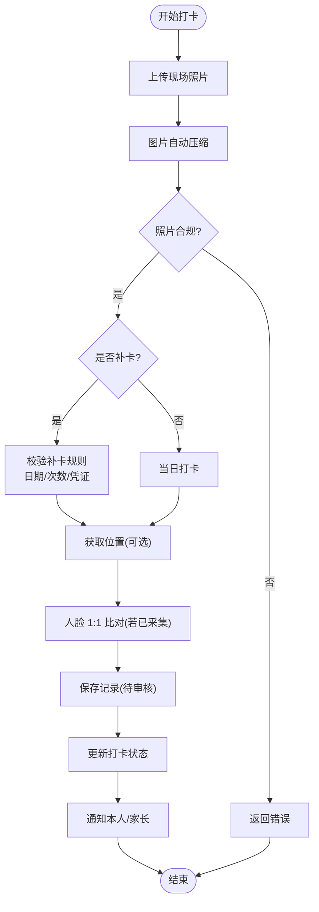
```mermaid
flowchart TD
Start(["开始打卡"]) --> Photo["上传现场照片"]
Photo --> Compress["图片自动压缩"]
Compress --> Valid{"照片合规?"}
Valid -- 否 --> ErrPhoto["返回错误"]
Valid -- 是 --> Type{"是否补卡?"}
Type -- 是 --> Makeup["校验补卡规则<br/>日期/次数/凭证"]
Type -- 否 --> Normal["当日打卡"]
Makeup --> Geo["获取位置(可选)"]
Normal --> Geo
Geo --> Face["人脸 1:1 比对(若已采集)"]
Face --> Save["保存记录(待审核)"]
Save --> UpdateStatus["更新打卡状态"]
UpdateStatus --> Notify["通知本人/家长"]
Notify --> End(["结束"])
ErrPhoto --> End
```

图表来源
- [checkin.py:1-80](file://summer-homework-checkin/backend/app/routers/checkin.py#L1-L80)
- [checkin_service.py:1-266](file://summer-homework-checkin/backend/app/services/checkin_service.py#L1-L266)
- [face_service.py:1-133](file://summer-homework-checkin/backend/app/services/face_service.py#L1-L133)

#### 挑战功能集成
- **挑战列表**：展示当前可用的挑战任务和完成状态
- **进度跟踪**：实时更新挑战完成进度和奖励情况
- **状态管理**：统一管理打卡和挑战的状态同步
- **用户体验**：提供直观的进度条和完成提示

**Section sources**
- [checkin.py:1-80](file://summer-homework-checkin/backend/app/routers/checkin.py#L1-L80)
- [checkin_service.py:1-266](file://summer-homework-checkin/backend/app/services/checkin_service.py#L1-L266)
- [face_service.py:1-133](file://summer-homework-checkin/backend/app/services/face_service.py#L1-L133)
- [app.js:1-905](file://summer-homework-checkin/frontend/student/app.js#L1-L905)

### 积分显示功能增强

**新增** 学生端应用现已增强积分显示功能，在打卡时显示配置的积分值，提供奖励系统的透明度。

#### 积分显示机制
- **实时积分反馈**：打卡成功后立即显示本次打卡获得的积分数量
- **配置驱动**：积分值由后端配置决定，支持灵活的奖励策略调整
- **视觉突出**：通过醒目的UI元素展示积分奖励，增强用户成就感
- **历史记录**：积分变化记录在用户的积分历史中，便于追踪

#### 积分显示流程实现
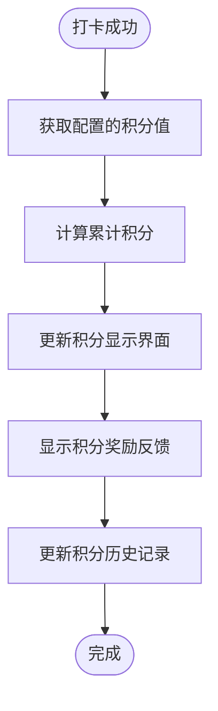
```mermaid
flowchart TD
Start(["打卡成功"]) --> GetPoints["获取配置的积分值"]
GetPoints --> CalculateTotal["计算累计积分"]
CalculateTotal --> UpdateUI["更新积分显示界面"]
UpdateUI --> ShowFeedback["显示积分奖励反馈"]
ShowFeedback --> UpdateHistory["更新积分历史记录"]
UpdateHistory --> End(["完成"])
```

图表来源
- [checkin_service.py:1-266](file://summer-homework-checkin/backend/app/services/checkin_service.py#L1-L266)
- [app.js:1-905](file://summer-homework-checkin/frontend/student/app.js#L1-L905)

#### 前端积分展示优化
- **动态积分卡片**：在打卡结果中突出显示本次获得的积分
- **动画效果**：积分数字滚动动画，增强视觉吸引力
- **累计统计**：实时更新累计积分总数，提供成就感反馈
- **配置透明**：明确显示积分配置来源，提高系统透明度

#### 后端积分配置支持
- **配置化管理**：积分值通过配置文件或数据库配置管理
- **灵活策略**：支持不同打卡类型、不同时间段的差异化积分策略
- **事务保证**：积分发放与打卡记录在同一事务中，确保数据一致性
- **审计日志**：记录积分发放的详细日志，便于问题追踪

**Section sources**
- [checkin_service.py:1-266](file://summer-homework-checkin/backend/app/services/checkin_service.py#L1-L266)
- [app.js:1-905](file://summer-homework-checkin/frontend/student/app.js#L1-L905)
- [index.html:1-422](file://summer-homework-checkin/frontend/student/index.html#L1-L422)

### 人脸识别采集与比对
- 采集：仅学生可用，要求检测到且仅一张人脸，保存底图与特征向量。
- 比对：打卡时提取现场照特征，与底图做余弦相似度计算；低于阈值拒绝或标记风险（可配置）。
- 降级：无外网/模型不可用时，已采集账号不通过则拒绝打卡，防止绕过。
- **更新** 人脸底图通过认证机制保护，防止未授权访问。

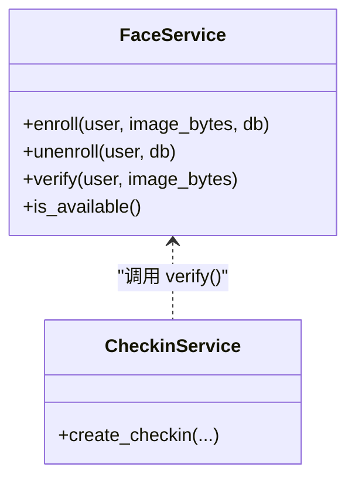
```mermaid
classDiagram
class FaceService {
+enroll(user, image_bytes, db)
+unenroll(user, db)
+verify(user, image_bytes)
+is_available()
}
class CheckinService {
+create_checkin(...)
}
FaceService <.. CheckinService : "调用 verify()"
```

图表来源
- [face_service.py:1-133](file://summer-homework-checkin/backend/app/services/face_service.py#L1-L133)
- [checkin_service.py:1-266](file://summer-homework-checkin/backend/app/services/checkin_service.py#L1-L266)

章节来源
- [face.py:1-45](file://summer-homework-checkin/backend/app/routers/face.py#L1-L45)
- [face_service.py:1-133](file://summer-homework-checkin/backend/app/services/face_service.py#L1-L133)
- [checkin_service.py:1-266](file://summer-homework-checkin/backend/app/services/checkin_service.py#L1-L266)

### 积分商城与兑换
- 列表：展示上架且积分>0的奖品，区分抽奖券与实物。
- 兑换：
  - 抽奖券：直接增加抽奖券数量，创建 fulfilled 记录。
  - 实物：扣积分、减库存，创建 pending 记录，等待管理员核实。
- 替换：将 pending 状态的兑换替换为新奖品，退原积分、扣新积分、回滚/扣减库存。
- 优化了mall对象初始化，确保lottery_tickets字段始终存在，避免渲染错误。

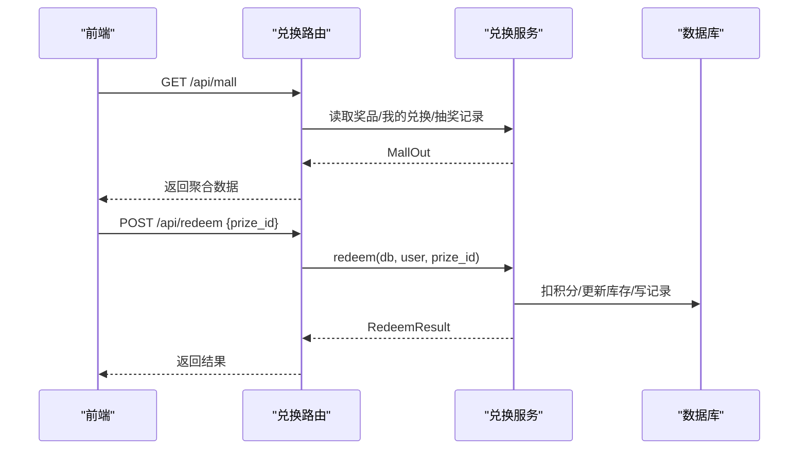
```mermaid
sequenceDiagram
participant FE as "前端"
participant RE as "兑换路由"
participant RS as "兑换服务"
participant DB as "数据库"
FE->>RE : GET /api/mall
RE->>RS : 读取奖品/我的兑换/抽奖记录
RS-->>RE : MallOut
RE-->>FE : 返回聚合数据
FE->>RE : POST /api/redeem {prize_id}
RE->>RS : redeem(db, user, prize_id)
RS->>DB : 扣积分/更新库存/写记录
RS-->>RE : RedeemResult
RE-->>FE : 返回结果
```

图表来源
- [redeem.py:1-81](file://summer-homework-checkin/backend/app/routers/redeem.py#L1-L81)
- [redeem_service.py:1-168](file://summer-homework-checkin/backend/app/services/redeem_service.py#L1-L168)

章节来源
- [redeem.py:1-81](file://summer-homework-checkin/backend/app/routers/redeem.py#L1-L81)
- [redeem_service.py:1-168](file://summer-homework-checkin/backend/app/services/redeem_service.py#L1-L168)

### 抽奖系统
- 资格：连续有效打卡每满 7 天自动获得 1 次，永久累积。
- 抽取：从上架且库存充足奖品中按概率加权随机；中奖则扣库存并生成兑换记录。
- 结果：返回是否中奖、奖品名、剩余票数等。
- 扩展了streak对象结构，包含完整的抽奖券统计信息。

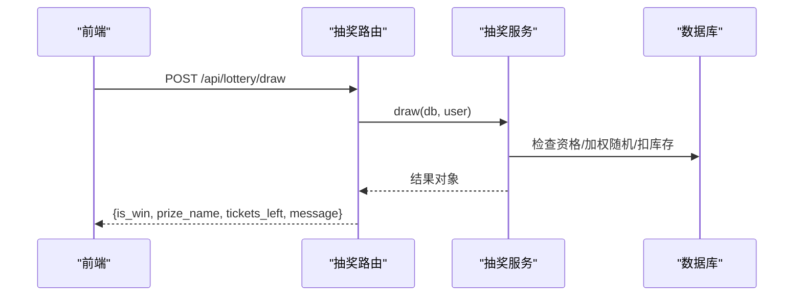
```mermaid
sequenceDiagram
participant FE as "前端"
participant L as "抽奖路由"
participant LS as "抽奖服务"
participant DB as "数据库"
FE->>L : POST /api/lottery/draw
L->>LS : draw(db, user)
LS->>DB : 检查资格/加权随机/扣库存
LS-->>L : 结果对象
L-->>FE : {is_win, prize_name, tickets_left, message}
```

图表来源
- [lottery.py:1-30](file://summer-homework-checkin/backend/app/routers/lottery.py#L1-L30)
- [lottery_service.py:1-77](file://summer-homework-checkin/backend/app/services/lottery_service.py#L1-L77)

章节来源
- [lottery.py:1-30](file://summer-homework-checkin/backend/app/routers/lottery.py#L1-L30)
- [lottery_service.py:1-77](file://summer-homework-checkin/backend/app/services/lottery_service.py#L1-L77)

### 双角色支持（学生/家长）

**更新** 双角色支持现已包含完整的家长-学生绑定功能和多孩子管理能力，并修复了家长登录空白页面问题。

- 学生：独立账号，拥有绑定码，用于家长绑定。
- 家长：绑定一个孩子或多个孩子，可在界面切换当前操作主体，代打卡、代兑换、代抽奖、查看报告。
- 权限：家长接口均校验绑定关系，越权访问将被拒绝。
- 状态管理：通过 actingChildId 控制当前操作的孩子，subjectId 和 subjectName 计算属性动态获取当前主体信息。
- 增强了无孩子场景的数据初始化，确保家长首次登录时不会出现空白页面。

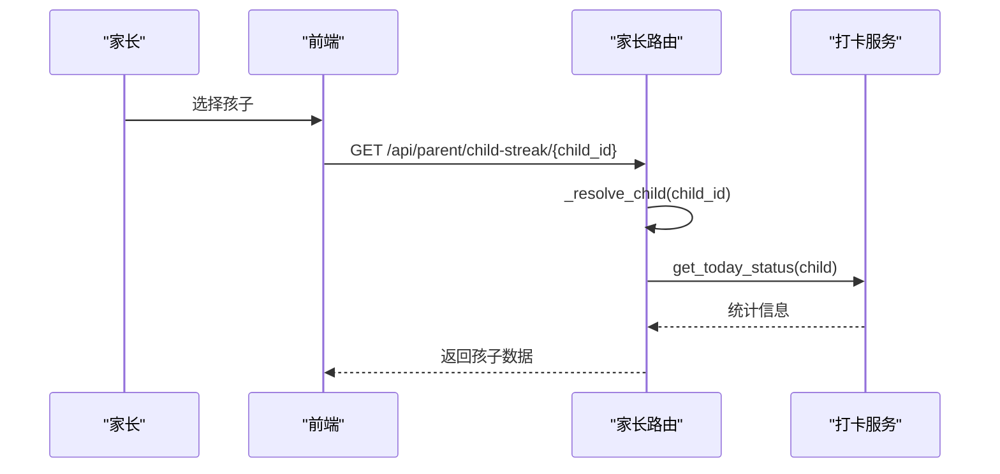
```mermaid
sequenceDiagram
participant P as "家长"
participant FE as "前端"
participant PR as "家长路由"
participant CS as "打卡服务"
P->>FE : 选择孩子
FE->>PR : GET /api/parent/child-streak/{child_id}
PR->>PR : _resolve_child(child_id)
PR->>CS : get_today_status(child)
CS-->>PR : 统计信息
PR-->>FE : 返回孩子数据
```

图表来源
- [parent.py:1-237](file://summer-homework-checkin/backend/app/routers/parent.py#L1-L237)
- [checkin_service.py:1-266](file://summer-homework-checkin/backend/app/services/checkin_service.py#L1-L266)

章节来源
- [parent.py:1-237](file://summer-homework-checkin/backend/app/routers/parent.py#L1-L237)
- [app.js:1-905](file://summer-homework-checkin/frontend/student/app.js#L1-L905)

### 前端状态管理与组件通信
- 状态管理：单一 Vue 实例 data 集中管理用户、打卡、人脸、商城、抽奖、闯关任务等状态；computed 派生 isParent、subjectId、subjectName、points 等。
- 组件通信：通过 go(view) 切换页面，按需拉取数据；父子交互通过事件与 v-model 双向绑定；弹窗使用模态变量控制显示。
- 数据同步：进入页面或切换主体时主动刷新相关数据，保证一致性。
- 绑定状态：bindForm 管理绑定表单数据，bindBusy 控制绑定按钮状态。
- 密码设置状态：showPwdForm 控制密码表单显示，passwordForm 管理密码修改数据，pwdBusy 防止重复提交。
- 增强了数据结构的健壮性，确保所有必需字段在任何场景下都存在。
- **新增** 静态资源路径管理：BASE_PATH自动检测和fixUrl方法统一处理静态资源URL。
- **新增** 积分显示状态管理：实时跟踪积分变化和显示状态。
- **新增** 认证感知图片加载：通过v-auth-src指令管理受保护图片的加载状态。
- **新增** 图片压缩状态管理：压缩过程中的状态控制和错误处理。

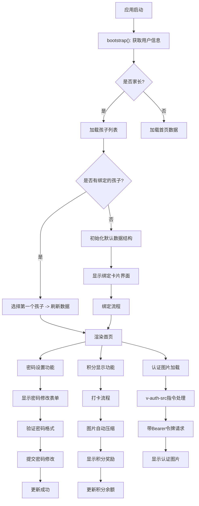
```mermaid
flowchart TD
Init["应用启动"] --> Boot["bootstrap(): 获取用户信息"]
Boot --> Role{"是否家长?"}
Role -- 是 --> LoadChildren["加载孩子列表"]
Role -- 否 --> LoadHome["加载首页数据"]
LoadChildren --> HasChildren{"是否有绑定的孩子?"}
HasChildren -- 是 --> SelectChild["选择第一个孩子 -> 刷新数据"]
HasChildren -- 否 --> InitData["初始化默认数据结构"]
InitData --> ShowBindCard["显示绑定卡片界面"]
SelectChild --> View["渲染首页"]
ShowBindCard --> BindProcess["绑定流程"]
BindProcess --> View
View --> PasswordFeature["密码设置功能"]
PasswordFeature --> ShowPwdForm["显示密码修改表单"]
ShowPwdForm --> ValidatePassword["验证密码格式"]
ValidatePassword --> SubmitPassword["提交密码修改"]
SubmitPassword --> UpdateSuccess["更新成功"]
View --> PointsDisplay["积分显示功能"]
PointsDisplay --> CheckinFlow["打卡流程"]
CheckinFlow --> CompressImage["图片自动压缩"]
CompressImage --> ShowPoints["显示积分奖励"]
ShowPoints --> UpdateBalance["更新积分余额"]
View --> AuthImageLoading["认证图片加载"]
AuthImageLoading --> VAuthSrc["v-auth-src指令处理"]
VAuthSrc --> FetchWithToken["带Bearer令牌请求"]
FetchWithToken --> DisplayImage["显示认证图片"]
```

图表来源
- [app.js:1-905](file://summer-homework-checkin/frontend/student/app.js#L1-L905)
- [index.html:1-422](file://summer-homework-checkin/frontend/student/index.html#L1-L422)

章节来源
- [app.js:1-905](file://summer-homework-checkin/frontend/student/app.js#L1-L905)
- [index.html:1-422](file://summer-homework-checkin/frontend/student/index.html#L1-L422)

### 文件上传处理
- 前端：使用 FileReader 预览图片，FormData 组装 photo/proof/face 等字段上传。
- 后端：统一校验图片格式/大小/尺寸，落盘到 uploads 目录并通过静态挂载对外暴露 URL。
- 场景：打卡照片、补卡凭证、人脸底图、通用图片上传。
- **更新** 通过fixUrl方法统一处理上传文件的URL，支持子路径部署。
- **新增** 受保护的下载API：通过/api/uploads接口提供认证访问，替代公开静态文件访问。
- **新增** 图片自动压缩：在上传前进行智能压缩，确保文件大小符合要求。

章节来源
- [checkin.py:1-80](file://summer-homework-checkin/backend/app/routers/checkin.py#L1-L80)
- [face.py:1-45](file://summer-homework-checkin/backend/app/routers/face.py#L1-L45)
- [uploads.py:1-55](file://summer-homework-checkin/backend/app/routers/uploads.py#L1-L55)
- [main.py:1-110](file://summer-homework-checkin/backend/app/main.py#L1-L110)
- [app.js:1-905](file://summer-homework-checkin/frontend/student/app.js#L1-L905)

### 地理位置获取
- 前端：navigator.geolocation 获取经纬度，失败仍可提交但会标记风险。
- 后端：记录 geo_distance/geo_flag，结合常用位置阈值判定风险等级。

章节来源
- [app.js:1-905](file://summer-homework-checkin/frontend/student/app.js#L1-L905)
- [checkin_service.py:1-266](file://summer-homework-checkin/backend/app/services/checkin_service.py#L1-L266)

### 表单验证
- 前端：必填项校验（照片、补卡日期/凭证）、积分不足提示、重复提交保护。
- 后端：照片体积/尺寸、补卡日期范围与次数上限、角色权限校验、业务规则校验。
- 绑定验证：家长-学生绑定时的用户名和绑定码验证，防止重复绑定。
- 密码验证：原密码验证、新密码长度验证、密码一致性验证、安全性验证。
- **新增** 图片压缩验证：压缩过程中检查图片质量和大小是否符合要求。

章节来源
- [app.js:1-905](file://summer-homework-checkin/frontend/student/app.js#L1-L905)
- [checkin_service.py:1-266](file://summer-homework-checkin/backend/app/services/checkin_service.py#L1-L266)
- [parent.py:20-32](file://summer-homework-checkin/backend/app/routers/parent.py#L20-L32)
- [auth.py:56-67](file://summer-homework-checkin/backend/app/routers/auth.py#L56-L67)

### 响应式布局与用户体验
- 移动端优先：viewport 设置、底部导航、卡片式布局、大按钮与清晰步骤提示。
- 反馈：Toast 提示、禁用态按钮、进度文案（如"抽奖中…"、"提交中…"、"绑定中…"、"修改中…"、"压缩中…"）。
- 容错：定位失败仍可提交、人脸模型不可用时的明确提示。
- 绑定界面：专门的绑定卡片样式，清晰的输入提示和操作反馈。
- 密码设置界面：简洁的表单设计，清晰的输入提示和实时验证反馈。
- 增强了待审核状态的显示，提供更好的用户反馈。
- **更新** 静态资源加载优化，提升首屏渲染速度。
- **新增** 五菜单项导航布局，提供更直观的功能入口。
- **新增** 积分显示增强，提供透明的奖励反馈机制。
- **新增** 认证图片加载优化，提供友好的错误处理和加载状态。
- **新增** 图片压缩进度反馈，让用户了解压缩状态。

章节来源
- [index.html:1-422](file://summer-homework-checkin/frontend/student/index.html#L1-L422)
- [student.css:1-209](file://summer-homework-checkin/frontend/student/student.css#L1-209)
- [app.js:1-905](file://summer-homework-checkin/frontend/student/app.js#L1-L905)

### 错误处理策略
- 前端：统一 api 方法捕获非 2xx 响应，抛出错误并 toast 提示；401 自动退出登录。
- 后端：HTTPException 返回 detail 信息；关键流程（人脸、补卡、库存、积分、绑定、密码修改）均有明确错误码与消息。
- **新增** 认证图片加载错误处理：网络错误、权限不足、文件不存在等情况的友好提示。
- **新增** 图片压缩错误处理：文件读取失败、图片加载失败、压缩失败等场景的处理。

章节来源
- [app.js:1-905](file://summer-homework-checkin/frontend/student/app.js#L1-L905)
- [checkin_service.py:1-266](file://summer-homework-checkin/backend/app/services/checkin_service.py#L1-L266)
- [redeem_service.py:1-168](file://summer-homework-checkin/backend/app/services/redeem_service.py#L1-L168)
- [parent.py:20-32](file://summer-homework-checkin/backend/app/routers/parent.py#L20-L32)
- [auth.py:56-67](file://summer-homework-checkin/backend/app/routers/auth.py#L56-L67)
- [uploads.py:1-55](file://summer-homework-checkin/backend/app/routers/uploads.py#L1-L55)

## 依赖关系分析
- 路由层依赖服务层，服务层依赖配置与工具（存储、图像、通知等）。
- 前端依赖后端统一入口 main.py 提供的静态资源与 API。
- 家长功能依赖 StudentParent 关联表实现多对多关系。
- 密码修改功能依赖 security 模块进行密码哈希和验证。
- **新增** 静态资源依赖：Vue.js 3.4.27通过bootcdn.net CDN加载，CSS和JS文件通过相对路径引用。
- **新增** 导航系统依赖：五菜单项导航结构与页面路由管理。
- **新增** 积分显示依赖：打卡服务与积分配置系统的集成。
- **新增** 认证依赖：uploads路由依赖get_current_user依赖注入进行Bearer令牌验证。
- **新增** 权限控制依赖：通过StudentParent表验证家长对孩子文件的访问权限。
- **新增** 图片压缩依赖：前端canvas API、FileReader API、EXIF解析库。

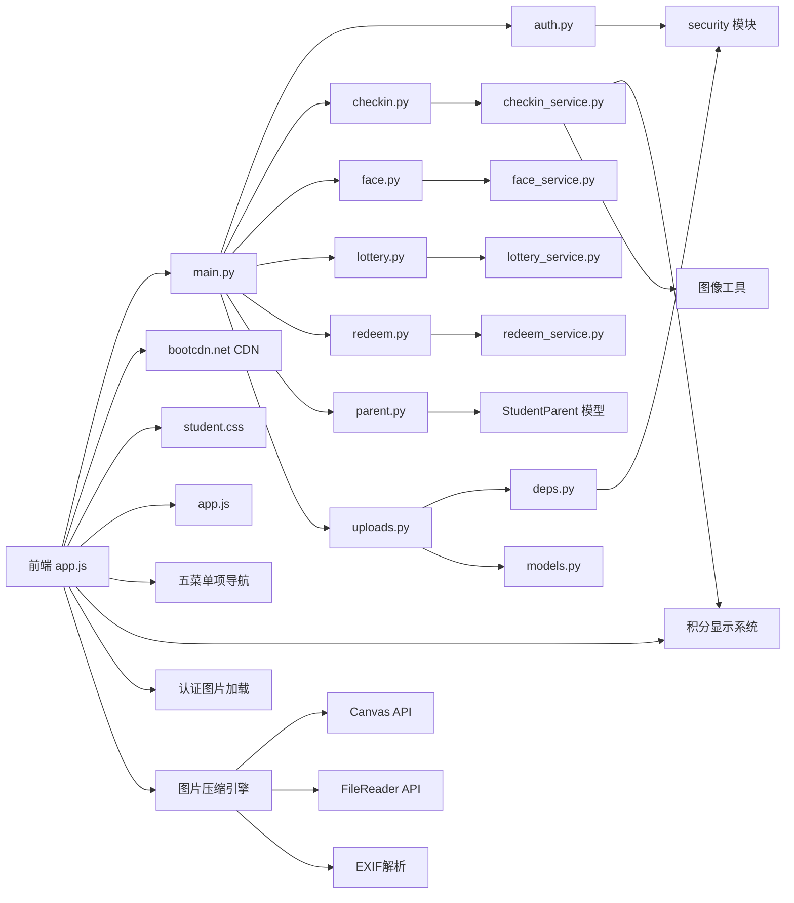
```mermaid
graph LR
FE["前端 app.js"] --> MAIN["main.py"]
MAIN --> AUTH["auth.py"]
MAIN --> CK["checkin.py"]
MAIN --> FC["face.py"]
MAIN --> LT["lottery.py"]
MAIN --> RD["redeem.py"]
MAIN --> PT["parent.py"]
MAIN --> UP["uploads.py"]
CK --> CSVC["checkin_service.py"]
FC --> FSVC["face_service.py"]
LT --> LSVC["lottery_service.py"]
RD --> RSVC["redeem_service.py"]
PT --> SP["StudentParent 模型"]
AUTH --> SEC["security 模块"]
UP --> DEP["deps.py"]
UP --> MOD["models.py"]
FE --> BOOTCDN["bootcdn.net CDN"]
FE --> CSS["student.css"]
FE --> JS["app.js"]
FE --> NAV["五菜单项导航"]
FE --> POINTS["积分显示系统"]
FE --> AUTHIMG["认证图片加载"]
FE --> COMP["图片压缩引擎"]
CSVC --> POINTS
CSVC --> IMGUTIL["图像工具"]
DEP --> SEC
COMP --> CANVAS["Canvas API"]
COMP --> FILEAPI["FileReader API"]
COMP --> EXIF["EXIF解析"]
```

图表来源
- [main.py:1-110](file://summer-homework-checkin/backend/app/main.py#L1-L110)
- [auth.py:1-67](file://summer-homework-checkin/backend/app/routers/auth.py#L1-L67)
- [checkin.py:1-80](file://summer-homework-checkin/backend/app/routers/checkin.py#L1-L80)
- [face.py:1-45](file://summer-homework-checkin/backend/app/routers/face.py#L1-L45)
- [lottery.py:1-30](file://summer-homework-checkin/backend/app/routers/lottery.py#L1-L30)
- [redeem.py:1-81](file://summer-homework-checkin/backend/app/routers/redeem.py#L1-L81)
- [parent.py:1-237](file://summer-homework-checkin/backend/app/routers/parent.py#L1-L237)
- [uploads.py:1-55](file://summer-homework-checkin/backend/app/routers/uploads.py#L1-L55)
- [deps.py:1-34](file://summer-homework-checkin/backend/app/deps.py#L1-L34)
- [checkin_service.py:1-266](file://summer-homework-checkin/backend/app/services/checkin_service.py#L1-L266)
- [face_service.py:1-133](file://summer-homework-checkin/backend/app/services/face_service.py#L1-L133)
- [lottery_service.py:1-77](file://summer-homework-checkin/backend/app/services/lottery_service.py#L1-L77)
- [redeem_service.py:1-168](file://summer-homework-checkin/backend/app/services/redeem_service.py#L1-L168)
- [models.py:58-69](file://summer-homework-checkin/backend/app/models.py#L58-L69)
- [index.html:7-8](file://summer-homework-checkin/frontend/student/index.html#L7-L8)
- [image.py:1-100](file://summer-homework-checkin/backend/app/utils/image.py#L1-L100)

章节来源
- [main.py:1-110](file://summer-homework-checkin/backend/app/main.py#L1-L110)
- [config.py:1-123](file://summer-homework-checkin/backend/app/config.py#L1-L123)

## 性能与体验优化
- 懒加载与缓存
  - 人脸分析器懒加载，避免冷启动开销；首次下载模型后常驻内存。
- 并发与稳定性
  - 后端多 worker 部署建议；SQLite 适合演示，生产建议迁移至 PostgreSQL/MySQL。
- 前端体验
  - 减少不必要的网络请求，仅在必要时机刷新数据；大按钮与分步引导降低误操作。
  - 绑定操作的状态管理和防重复提交机制。
  - 密码修改操作的防重复提交和实时验证机制。
  - 增强了数据结构的健壮性，避免了因字段缺失导致的渲染错误。
  - **新增** 静态资源加载优化：Vue.js通过bootcdn.net CDN加载，显著提升首屏渲染速度。
  - **新增** 相对路径支持：CSS和JS文件使用相对路径引用，提升部署灵活性。
  - **新增** BASE_PATH自动检测：支持子路径部署场景，无需修改代码即可在不同路径下运行。
  - **新增** 五菜单项导航优化：减少页面跳转，提升操作效率。
  - **新增** 打卡与挑战整合：统一页面设计，提供更好的用户体验。
  - **新增** 积分显示优化：实时积分反馈，增强用户成就感和参与度。
  - **新增** 认证图片加载优化：通过v-auth-src指令提供安全的图片加载，避免跨域和认证问题。
  - **新增** 图片压缩优化：智能压缩算法，减少上传时间和带宽消耗。
- 图片与存储
  - 严格图片校验，避免恶意文件；静态资源可考虑 CDN 加速。
  - **更新** 通过fixUrl方法统一处理静态资源URL，确保在各种部署环境下的正确加载。
  - **新增** 受保护文件访问：通过/api/uploads接口提供认证访问，替代公开静态文件访问。
  - **新增** 图片压缩验证：前端压缩确保文件大小符合要求，减少服务器负载。

[本节为通用指导，无需源码引用]

## 故障排查指南
- 401 未授权
  - 检查前端是否携带 Authorization 头；确认 Token 未过期。
- 人脸比对失败
  - 确认已采集人脸底图；检查模型可用性；必要时调整阈值或切换策略。
- 补卡失败
  - 检查目标日期是否在暑假范围内、是否超过月度次数上限、是否已有有效打卡。
- 兑换失败
  - 检查积分是否足够、奖品是否上架、库存是否为 0。
- 定位失败
  - 浏览器可能拒绝定位；仍允许提交但会标记风险。
- 绑定失败
  - 检查孩子用户名是否正确、绑定码是否匹配、是否已重复绑定。
- 密码修改失败
  - 检查原密码是否正确、新密码长度是否满足要求、两次密码输入是否一致。
  - 确认网络连接正常，后端密码修改API可正常访问。
- 家长登录空白页面
  - 确认loadChildren()函数中的无孩子场景数据初始化逻辑是否正常执行。
  - 检查streak、today、mall对象的所有必需字段是否都已正确初始化。
- **新增** 导航系统问题
  - 检查五菜单项导航是否正确加载和渲染。
  - 确认导航路由配置是否正确，页面切换是否正常。
  - 验证打卡与挑战整合页面的数据加载和状态同步。
- **新增** 静态资源加载失败
  - 检查bootcdn.net CDN连接是否正常，确认Vue.js库是否正确加载。
  - 验证CSS和JS文件的相对路径是否正确，特别是在子路径部署场景下。
  - 检查BASE_PATH自动检测逻辑，确认基础路径设置是否正确。
  - 使用浏览器开发者工具检查网络请求，确认静态资源URL拼接是否正确。
- **新增** 积分显示问题
  - 检查打卡成功后积分值是否正确显示。
  - 确认积分配置是否正确设置。
  - 验证积分更新逻辑是否正常工作。
  - 检查积分历史记录是否准确记录。
- **新增** 认证图片加载问题
  - 检查v-auth-src指令是否正确绑定到img元素。
  - 确认localStorage中是否存在有效的token。
  - 验证/api/uploads接口是否正确返回文件流。
  - 检查用户权限是否足够访问目标文件。
  - 查看浏览器控制台是否有CORS或认证相关的错误信息。
  - 确认图片路径格式正确，符合/uploads/{user_id}/...的格式。
- **新增** 图片压缩问题
  - 检查浏览器是否支持Canvas API和FileReader API。
  - 确认EXIF方向检测是否正确工作。
  - 验证压缩质量调节是否按预期工作。
  - 检查微信X5内核兼容性，确认FormData三参数append是否正确。
  - 查看控制台是否有图片加载或压缩相关的错误信息。
  - 确认文件大小是否符合后端限制要求（5KB-10MB）。

章节来源
- [app.js:1-905](file://summer-homework-checkin/frontend/student/app.js#L1-L905)
- [checkin_service.py:1-266](file://summer-homework-checkin/backend/app/services/checkin_service.py#L1-L266)
- [face_service.py:1-133](file://summer-homework-checkin/backend/app/services/face_service.py#L1-L133)
- [redeem_service.py:1-168](file://summer-homework-checkin/backend/app/services/redeem_service.py#L1-L168)
- [parent.py:20-32](file://summer-homework-checkin/backend/app/routers/parent.py#L20-L32)
- [auth.py:56-67](file://summer-homework-checkin/backend/app/routers/auth.py#L56-L67)
- [uploads.py:1-55](file://summer-homework-checkin/backend/app/routers/uploads.py#L1-L55)
- [deps.py:1-34](file://summer-homework-checkin/backend/app/deps.py#L1-L34)
- [index.html:7-8](file://summer-homework-checkin/frontend/student/index.html#L7-L8)
- [image.py:1-100](file://summer-homework-checkin/backend/app/utils/image.py#L1-L100)

## 结论
学生端以轻量、易用的方式实现了完整的打卡闭环与激励体系。通过严格的防代打卡机制（照片/地理/人脸）与清晰的家长代理能力，兼顾了真实性与易用性。**本次更新重点完成了图片自动压缩功能的集成，通过blobToFile兼容处理、canvas转Blob的双路径实现、EXIF方向检测与修正，以及针对微信X5内核的FormData三参数append修复，显著提升了图片上传的成功率和用户体验。同时完善了认证感知文件加载机制，通过v-auth-src指令和受保护的/api/uploads接口，确保只有经过身份验证的用户才能访问敏感图片资源。此外，还完成了导航系统重构和打卡与挑战功能整合，将四菜单项重组为五菜单项（首页、打卡与挑战、抽奖、商城、我的），显著提升了用户体验和功能集中度。新增的图片压缩功能有效解决了大图片上传失败的问题，特别是在移动设备和微信内置浏览器环境下，通过智能质量调节和多级压缩策略，确保图片文件大小符合要求**。分层架构与统一 API 封装使扩展与维护成本可控，便于后续接入更多玩法与报表能力。

[本节为总结，无需源码引用]

## 附录：API 参考
- 认证
  - POST /api/auth/register
  - POST /api/auth/login
  - GET /api/auth/me
  - PUT /api/auth/password
- 家长绑定
  - POST /api/parent/bind
  - GET /api/parent/children
- 打卡
  - POST /api/checkin
  - GET /api/checkin/today
  - GET /api/checkin/streak
  - GET /api/checkin/history
- 人脸
  - POST /api/face/enroll
  - GET /api/face/status
  - DELETE /api/face/enroll
- 抽奖
  - GET /api/lottery/tickets
  - POST /api/lottery/draw
- 积分商城
  - GET /api/mall
  - POST /api/redeem
  - POST /api/redeem/{rid}/replace
- 家长代理
  - GET /api/parent/child-streak/{child_id}
  - POST /api/parent/checkin
  - GET /api/parent/mall/{child_id}
  - POST /api/parent/redeem?child_id=...
  - POST /api/parent/redeem/{rid}/replace
  - GET /api/parent/lottery/{child_id}
  - POST /api/parent/lottery/{child_id}/draw
  - GET /api/parent/notifications
  - PATCH /api/parent/notifications/{nid}/read
  - GET /api/parent/child-report/{child_id}[?start=&end=]
  - GET /api/parent/child-report/{child_id}/html[?start=&end=]
- 上传文件
  - GET /api/uploads/{path} (需要Bearer令牌认证)
- 健康检查
  - GET /api/health

章节来源
- [README.md:81-94](file://summer-homework-checkin/README.md#L81-L94)
- [auth.py:1-67](file://summer-homework-checkin/backend/app/routers/auth.py#L1-L67)
- [parent.py:1-237](file://summer-homework-checkin/backend/app/routers/parent.py#L1-L237)
- [checkin.py:1-80](file://summer-homework-checkin/backend/app/routers/checkin.py#L1-L80)
- [face.py:1-45](file://summer-homework-checkin/backend/app/routers/face.py#L1-L45)
- [lottery.py:1-30](file://summer-homework-checkin/backend/app/routers/lottery.py#L1-L30)
- [redeem.py:1-81](file://summer-homework-checkin/backend/app/routers/redeem.py#L1-L81)
- [uploads.py:1-55](file://summer-homework-checkin/backend/app/routers/uploads.py#L1-L55)
- [main.py:33-36](file://summer-homework-checkin/backend/app/main.py#L33-L36)