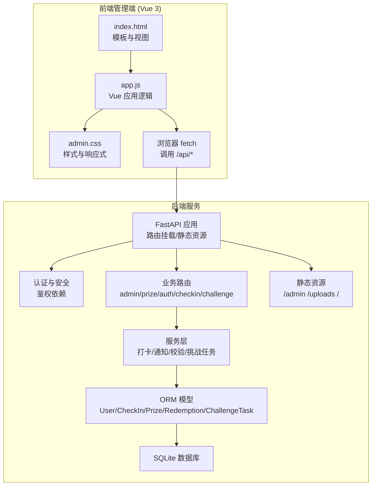
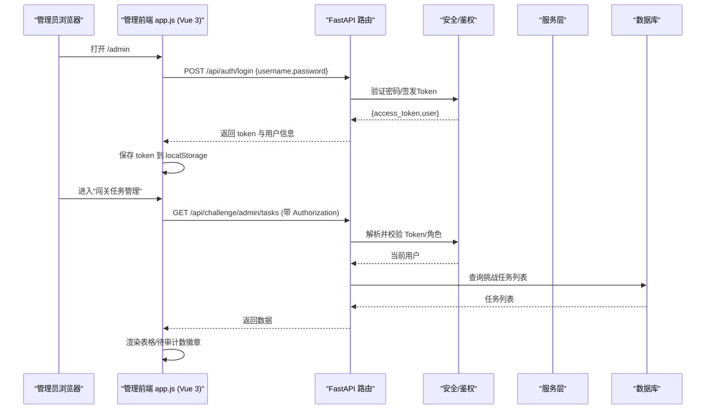
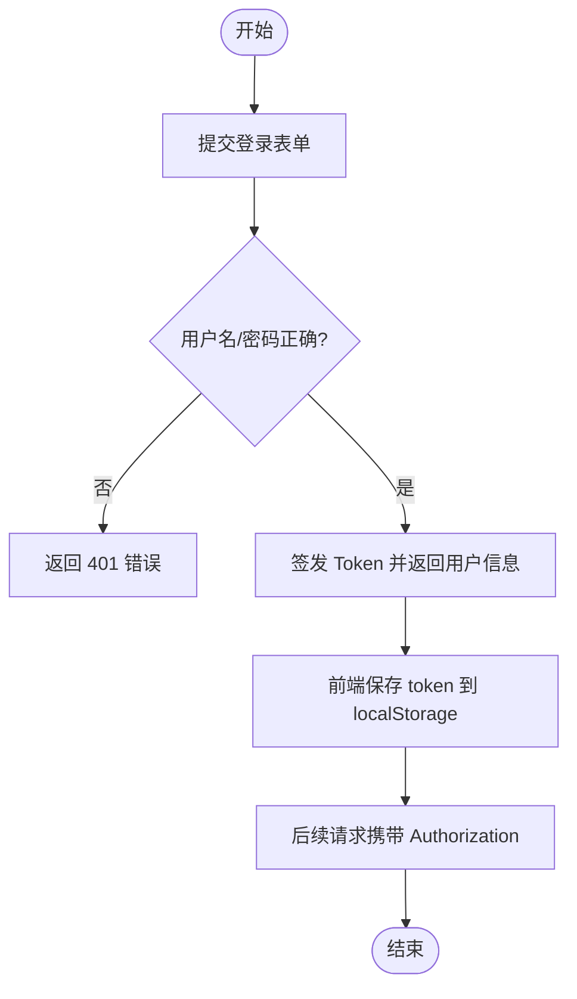
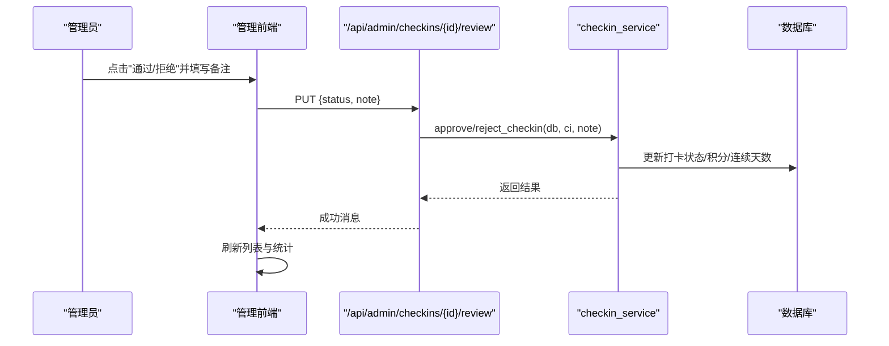
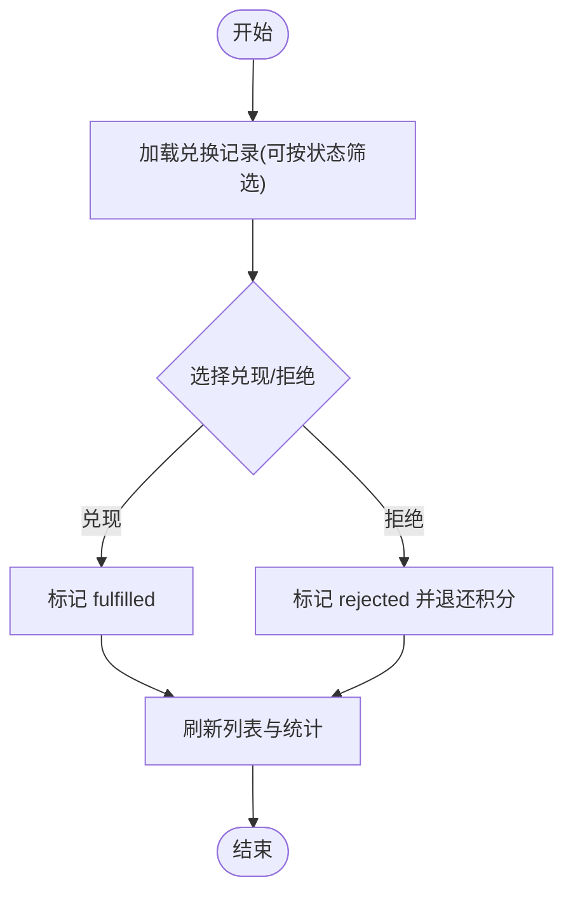
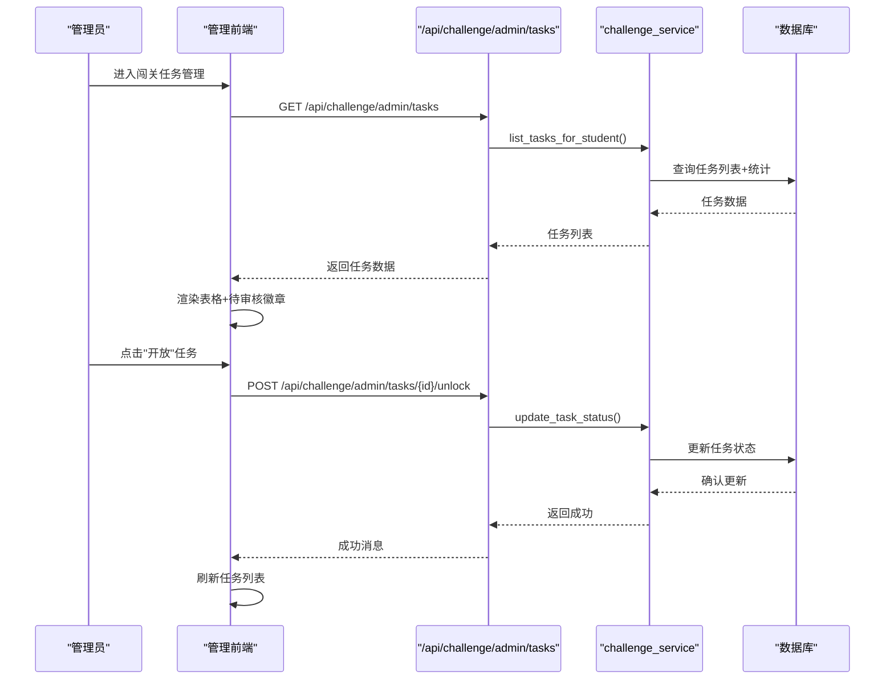
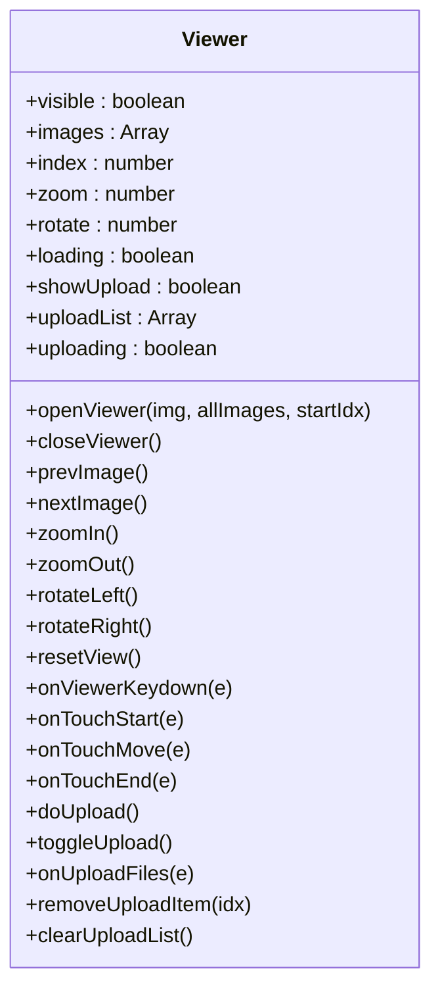
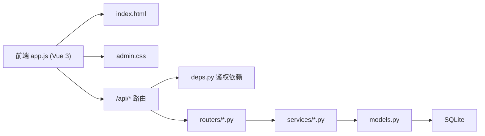

# 管理后台应用

<cite>
**本文引用的文件**   
- [README.md](file://summer-homework-checkin/README.md)
- [main.py](file://summer-homework-checkin/backend/app/main.py)
- [config.py](file://summer-homework-checkin/backend/app/config.py)
- [security.py](file://summer-homework-checkin/backend/app/security.py)
- [deps.py](file://summer-homework-checkin/backend/app/deps.py)
- [models.py](file://summer-homework-checkin/backend/app/models.py)
- [schemas.py](file://summer-homework-checkin/backend/app/schemas.py)
- [auth.py](file://summer-homework-checkin/backend/app/routers/auth.py)
- [admin.py](file://summer-homework-checkin/backend/app/routers/admin.py)
- [prize.py](file://summer-homework-checkin/backend/app/routers/prize.py)
- [checkin.py](file://summer-homework-checkin/backend/app/routers/checkin.py)
- [challenge.py](file://summer-homework-checkin/backend/app/routers/challenge.py)
- [checkin_service.py](file://summer-homework-checkin/backend/app/services/checkin_service.py)
- [challenge_service.py](file://summer-homework-checkin/backend/app/services/challenge_service.py)
- [index.html](file://summer-homework-checkin/frontend/admin/index.html)
- [app.js](file://summer-homework-checkin/frontend/admin/app.js)
- [admin.css](file://summer-homework-checkin/frontend/admin/admin.css)
</cite>

## 更新摘要
**所做更改**   
- 新增Vue.js驱动的现代化管理界面架构说明
- 扩展挑战任务管理功能的详细实现
- 添加实时统计和徽章通知机制
- 完善移动端响应式设计和交互体验
- 增强图片查看器的上传和管理功能
- 更新API接口文档以包含挑战任务相关接口

## 目录
1. [引言](#引言)
2. [项目结构](#项目结构)
3. [核心组件](#核心组件)
4. [架构总览](#架构总览)
5. [详细组件分析](#详细组件分析)
6. [依赖关系分析](#依赖关系分析)
7. [性能与优化](#性能与优化)
8. [故障排查指南](#故障排查指南)
9. [结论](#结论)
10. [附录：API 参考](#附录api-参考)

## 引言
本设计文档面向"暑假作业打卡系统"的管理后台，聚焦于基于 Vue 3 的单页管理界面与企业级功能实现。内容覆盖管理员认证、用户管理、打卡审核、奖品管理、兑换记录审核、闯关任务管理与数据统计等模块；并深入阐述权限控制机制、数据表格操作、批量处理、报表生成、复杂表单、图片预览与上传、实时状态更新等企业级特性。同时给出与后端 FastAPI 管理 API 的交互模式、筛选与搜索策略，以及最佳实践与性能优化建议，帮助开发者快速构建高效稳定的管理后台。

**更新** 新增了Vue.js驱动的现代化管理界面，包含完整的挑战任务管理系统、实时统计徽章、移动端响应式设计和增强的图片查看器功能。

## 项目结构
本项目采用前后端分离架构：
- 后端：FastAPI + SQLAlchemy + SQLite，提供 RESTful API，静态托管学生端与管理端页面。
- 前端（管理端）：Vue 3 CDN 单页应用，独立部署在 /admin 路径下，包含登录、概览、奖品、用户、打卡审核、兑换审核、闯关任务管理等页面。

**图示来源**
- [main.py:1-49](file://summer-homework-checkin/backend/app/main.py#L1-L49)
- [config.py:1-50](file://summer-homework-checkin/backend/app/config.py#L1-L50)
- [index.html:1-657](file://summer-homework-checkin/frontend/admin/index.html#L1-L657)
- [app.js:1-654](file://summer-homework-checkin/frontend/admin/app.js#L1-L654)
- [admin.css:1-383](file://summer-homework-checkin/frontend/admin/admin.css#L1-L383)

章节来源
- [README.md:1-126](file://summer-homework-checkin/README.md#L1-L126)
- [main.py:1-49](file://summer-homework-checkin/backend/app/main.py#L1-L49)
- [config.py:1-50](file://summer-homework-checkin/backend/app/config.py#L1-L50)

## 核心组件
- 认证与安全
  - 无状态 Token 签发与校验，角色区分 admin/student/parent。
  - 依赖注入获取当前用户与角色校验。
- 管理路由
  - 统计概览、用户列表、打卡审核、兑换审核、奖品 CRUD、挑战任务管理。
- 业务服务
  - 打卡创建、审核通过/拒绝、连续天数重算、积分发放、通知推送、挑战任务管理。
- 前端管理应用
  - Vue 3 驱动、登录态维护、全局 API 封装、多模块视图、图片查看器与上传、弹窗审核流程、筛选与计数、实时徽章通知。

**更新** 新增了挑战任务管理服务层和Vue 3前端框架集成。

章节来源
- [security.py:1-47](file://summer-homework-checkin/backend/app/security.py#L1-L47)
- [deps.py:1-34](file://summer-homework-checkin/backend/app/deps.py#L1-L34)
- [admin.py:1-214](file://summer-homework-checkin/backend/app/routers/admin.py#L1-L214)
- [challenge.py:1-377](file://summer-homework-checkin/backend/app/routers/challenge.py#L1-L377)
- [checkin_service.py:1-254](file://summer-homework-checkin/backend/app/services/checkin_service.py#L1-L254)
- [challenge_service.py:1-281](file://summer-homework-checkin/backend/app/services/challenge_service.py#L1-L281)
- [app.js:1-654](file://summer-homework-checkin/frontend/admin/app.js#L1-L654)

## 架构总览
管理后台整体由"前端管理 SPA + 后端 FastAPI 服务 + 数据库"构成。前端通过统一 API 方法携带 Bearer Token 访问受保护接口；后端通过依赖注入解析令牌、校验角色，再调用服务层执行业务规则，最终持久化到数据库。

**图示来源**
- [auth.py:1-52](file://summer-homework-checkin/backend/app/routers/auth.py#L1-L52)
- [deps.py:1-34](file://summer-homework-checkin/backend/app/deps.py#L1-L34)
- [challenge.py:190-218](file://summer-homework-checkin/backend/app/routers/challenge.py#L190-L218)
- [app.js:465-473](file://summer-homework-checkin/frontend/admin/app.js#L465-L473)

## 详细组件分析

### 管理员认证与权限控制
- 登录流程
  - 前端提交用户名/密码至 /api/auth/login，后端校验成功后返回 access_token 与用户信息。
  - 前端将 token 写入 localStorage，并在后续请求头中附加 Authorization: Bearer <token>。
- 权限控制
  - 使用 HTTPBearer 自动解析令牌，decode_token 校验签名与过期时间。
  - require_role("admin") 确保仅管理员可访问管理接口。
- 错误处理
  - 未提供或无效令牌返回 401；非管理员返回 403；前端统一捕获并提示。

**图示来源**
- [auth.py:1-52](file://summer-homework-checkin/backend/app/routers/auth.py#L1-L52)
- [security.py:1-47](file://summer-homework-checkin/backend/app/security.py#L1-L47)
- [deps.py:1-34](file://summer-homework-checkin/backend/app/deps.py#L1-L34)
- [app.js:83-94](file://summer-homework-checkin/frontend/admin/app.js#L83-L94)

章节来源
- [auth.py:1-52](file://summer-homework-checkin/backend/app/routers/auth.py#L1-L52)
- [security.py:1-47](file://summer-homework-checkin/backend/app/security.py#L1-L47)
- [deps.py:1-34](file://summer-homework-checkin/backend/app/deps.py#L1-L34)
- [app.js:1-654](file://summer-homework-checkin/frontend/admin/app.js#L1-L654)

### 数据概览与统计
- 概览指标
  - 学生数、家长数、有效打卡数、绑定关系数、位置异常打卡数、兑换统计（待核实/已兑现/已拒绝）。
- 数据来源
  - 聚合查询 User、CheckIn、StudentParent、Redemption 表，按条件计数。
- 展示方式
  - 前端以卡片网格展示关键指标，支持暑期统计窗口范围显示。

章节来源
- [admin.py:1-214](file://summer-homework-checkin/backend/app/routers/admin.py#L1-L214)
- [index.html:46-56](file://summer-homework-checkin/frontend/admin/index.html#L46-L56)

### 用户管理
- 功能点
  - 列出所有用户，展示角色、昵称、连续天数、有效打卡、积分、抽奖券、绑定码等。
- 数据源
  - 直接查询 User 表并按 ID 排序输出。

章节来源
- [admin.py:1-214](file://summer-homework-checkin/backend/app/routers/admin.py#L1-L214)
- [models.py:1-213](file://summer-homework-checkin/backend/app/models.py#L1-L213)
- [index.html:141-173](file://summer-homework-checkin/frontend/admin/index.html#L141-L173)

### 打卡审核
- 列表与筛选
  - 支持"待审核/全部"筛选，计算待审数量并在导航角标显示。
- 审核流程
  - 管理员点击"通过/拒绝"，弹出备注输入框，提交后调用审核接口。
  - 通过后：标记有效、发放积分、重算连续天数与抽奖资格、发送通知。
  - 拒绝后：标记拒绝、发送通知。
- 照片预览
  - 点击"查看"打开图片查看器，支持多图翻页、缩放、旋转、键盘与触摸操作。

**图示来源**
- [admin.py:1-214](file://summer-homework-checkin/backend/app/routers/admin.py#L1-L214)
- [checkin_service.py:1-254](file://summer-homework-checkin/backend/app/services/checkin_service.py#L1-L254)
- [app.js:179-200](file://summer-homework-checkin/frontend/admin/app.js#L179-L200)

章节来源
- [admin.py:1-214](file://summer-homework-checkin/backend/app/routers/admin.py#L1-L214)
- [checkin_service.py:1-254](file://summer-homework-checkin/backend/app/services/checkin_service.py#L1-L254)
- [index.html:175-248](file://summer-homework-checkin/frontend/admin/index.html#L175-L248)

### 兑换记录审核
- 列表与筛选
  - 支持"待核实/已兑现/已拒绝/全部"筛选，顶部统计栏展示各状态数量。
- 审核流程
  - 通过：标记为已兑现。
  - 拒绝：标记为已拒绝并退还积分。
- 移动端适配
  - 小屏设备以卡片形式展示，提升操作体验。

**图示来源**
- [admin.py:1-214](file://summer-homework-checkin/backend/app/routers/admin.py#L1-L214)
- [app.js:119-149](file://summer-homework-checkin/frontend/admin/app.js#L119-L149)
- [index.html:250-319](file://summer-homework-checkin/frontend/admin/index.html#L250-L319)

章节来源
- [admin.py:1-214](file://summer-homework-checkin/backend/app/routers/admin.py#L1-L214)
- [app.js:1-654](file://summer-homework-checkin/frontend/admin/app.js#L1-L654)
- [index.html:250-319](file://summer-homework-checkin/frontend/admin/index.html#L250-L319)

### 奖品管理
- 功能点
  - 新增/编辑/删除奖品，设置类别、概率、库存、上架状态、积分兑换价、是否"抽奖机会"。
- 数据模型
  - Prize 表支持 is_lottery_ticket 与 ticket_qty，用于"抽奖机会"类奖品。
- 前端交互
  - 弹窗表单，保存后刷新列表。

章节来源
- [prize.py:1-66](file://summer-homework-checkin/backend/app/routers/prize.py#L1-66)
- [models.py:1-213](file://summer-homework-checkin/backend/app/models.py#L1-L213)
- [index.html:58-138](file://summer-homework-checkin/frontend/admin/index.html#L58-L138)

### 闯关任务管理
- 功能点
  - 新增/编辑/删除任务，设置开放状态与开放时间，开放后可查看该任务的打卡记录并进行审核。
- 打卡审核
  - 支持附件预览与批量审核，审核通过后奖励积分。
- 前端交互
  - 列表展示任务状态与待审核数量，弹窗编辑任务与审核详情。
- 实时更新
  - 导航栏显示待审核徽章，操作后自动刷新统计数据。

**新增** 完整的挑战任务管理系统，包括任务CRUD、状态管理、打卡审核和积分奖励机制。

**图示来源**
- [challenge.py:190-218](file://summer-homework-checkin/backend/app/routers/challenge.py#L190-L218)
- [challenge_service.py:112-146](file://summer-homework-checkin/backend/app/services/challenge_service.py#L112-L146)
- [app.js:465-473](file://summer-homework-checkin/frontend/admin/app.js#L465-L473)
- [index.html:321-446](file://summer-homework-checkin/frontend/admin/index.html#L321-L446)

章节来源
- [index.html:321-446](file://summer-homework-checkin/frontend/admin/index.html#L321-L446)
- [app.js:464-622](file://summer-homework-checkin/frontend/admin/app.js#L464-L622)
- [challenge.py:190-377](file://summer-homework-checkin/backend/app/routers/challenge.py#L190-L377)
- [challenge_service.py:1-281](file://summer-homework-checkin/backend/app/services/challenge_service.py#L1-281)
- [models.py:178-213](file://summer-homework-checkin/backend/app/models.py#L178-L213)

### 图片查看器与上传
- 能力
  - 全屏查看、左右翻页、缩略条、缩放、旋转、键盘与触摸操作、加载占位与错误处理。
  - 内置上传面板，支持多选图片、预览、批量上传，上传成功后追加到当前查看列表。
- 技术要点
  - normalizeImg 标准化图片对象，fixUrl 补全相对路径为完整 URL。
  - 上传调用 /api/checkin/upload，返回 photo_url 并追加到 viewer.images。
- 移动端优化
  - 触摸滑动支持、响应式工具栏、优化的触控区域。

**更新** 增强了图片查看器的功能，支持上传、更好的移动端体验和更丰富的交互操作。

**图示来源**
- [app.js:17-33](file://summer-homework-checkin/frontend/admin/app.js#L17-L33)
- [app.js:202-437](file://summer-homework-checkin/frontend/admin/app.js#L202-L437)
- [admin.css:53-176](file://summer-homework-checkin/frontend/admin/admin.css#L53-L176)

章节来源
- [app.js:1-654](file://summer-homework-checkin/frontend/admin/app.js#L1-L654)
- [admin.css:1-383](file://summer-homework-checkin/frontend/admin/admin.css#L1-L383)

### 数据表格操作与批量处理
- 表格展示
  - 统一表格样式，行背景根据状态高亮（待审/已通过/已拒绝/已兑现）。
- 筛选与计数
  - 顶部筛选按钮切换过滤条件，导航角标显示待审数量。
- 批量处理
  - 当前实现以单条审核为主；如需批量，可在前端增加复选框与批量提交逻辑，后端扩展批量审核接口。
- 移动端适配
  - 小屏幕设备自动切换到卡片式布局，提供更好的触控体验。

**更新** 新增了移动端响应式卡片布局和导航徽章功能。

章节来源
- [index.html:1-657](file://summer-homework-checkin/frontend/admin/index.html#L1-L657)
- [admin.css:276-383](file://summer-homework-checkin/frontend/admin/admin.css#L276-L383)
- [app.js:1-654](file://summer-homework-checkin/frontend/admin/app.js#L1-L654)

### 复杂表单处理
- 奖品表单
  - 支持布尔开关（是否抽奖机会）、数值字段（概率、库存、积分）、下拉选择（类别、状态）。
- 闯关任务表单
  - 文本描述、排序序号、积分奖励、状态与定时开放、开放条件说明。
- 审核弹窗
  - 统一弹窗布局，支持备注输入与确认/取消操作。
- 移动端优化
  - 弹窗在小屏幕上变为底部滑入全屏抽屉，触控区域不小于44px。

**更新** 新增了闯关任务表单和移动端弹窗优化。

章节来源
- [index.html:104-138](file://summer-homework-checkin/frontend/admin/index.html#L104-L138)
- [index.html:452-474](file://summer-homework-checkin/frontend/admin/index.html#L452-L474)
- [app.js:475-531](file://summer-homework-checkin/frontend/admin/app.js#L475-L531)

### 与后端管理 API 的交互模式
- 统一 API 封装
  - 自动附加 Authorization 头，统一错误处理与 401 登出逻辑。
- 主要接口
  - 认证：POST /api/auth/login
  - 统计：GET /api/admin/stats
  - 用户：GET /api/admin/users
  - 打卡：GET /api/admin/checkins、PUT /api/admin/checkins/{id}/review
  - 兑换：GET /api/admin/redemptions、PUT /api/admin/redemptions/{id}/review
  - 奖品：GET/POST/PUT/DELETE /api/admin/prizes[/id]
  - 上传：POST /api/checkin/upload
  - 闯关任务：/api/challenge/admin/tasks、/api/challenge/admin/checkins、/api/challenge/admin/tasks/{id}/unlock

**更新** 新增了挑战任务相关的API接口。

章节来源
- [app.js:66-75](file://summer-homework-checkin/frontend/admin/app.js#L66-L75)
- [admin.py:1-214](file://summer-homework-checkin/backend/app/routers/admin.py#L1-L214)
- [prize.py:1-66](file://summer-homework-checkin/backend/app/routers/prize.py#L1-66)
- [checkin.py:1-80](file://summer-homework-checkin/backend/app/routers/checkin.py#L1-80)
- [challenge.py:190-377](file://summer-homework-checkin/backend/app/routers/challenge.py#L190-L377)

### 数据筛选与搜索
- 现有筛选
  - 打卡：待审核/全部
  - 兑换：待核实/已兑现/已拒绝/全部
  - 闯关任务：待审核/全部
- 扩展建议
  - 增加关键词搜索（用户名、日期区间、状态组合），后端分页与索引优化。

**更新** 新增了闯关任务的筛选功能。

章节来源
- [index.html:175-446](file://summer-homework-checkin/frontend/admin/index.html#L175-L446)
- [app.js:108-118](file://summer-homework-checkin/frontend/admin/app.js#L108-L118)

### 实时数据更新
- 现状
  - 前端在操作成功后主动刷新相关列表与统计。
  - 导航栏显示待审核徽章，实时更新待审核数量。
- 增强建议
  - 引入轮询或 WebSocket 推送，减少手动刷新，提升时效性。

**更新** 实现了实时的待审核徽章显示和自动刷新机制。

章节来源
- [app.js:95-101](file://summer-homework-checkin/frontend/admin/app.js#L95-L101)
- [app.js:465-473](file://summer-homework-checkin/frontend/admin/app.js#L465-L473)

### 移动端响应式设计
- 布局适配
  - 侧边栏在移动端变为底部Tab导航，主内容区域自适应调整。
- 卡片式布局
  - 桌面端的表格在移动端自动转换为卡片式布局，提升可读性和操作性。
- 触控优化
  - 所有交互元素的最小触控区域为44px，符合移动端设计规范。
- 弹窗适配
  - 弹窗在移动端变为底部滑入的全屏抽屉，提供更好的用户体验。

**新增** 完整的移动端响应式设计，支持手机和平板设备的完美适配。

章节来源
- [admin.css:320-383](file://summer-homework-checkin/frontend/admin/admin.css#L320-L383)
- [index.html:24-42](file://summer-homework-checkin/frontend/admin/index.html#L24-L42)

## 依赖关系分析
- 组件耦合
  - 前端 app.js 依赖 index.html 模板与 admin.css 样式；后端路由依赖 models/schemas 与 services。
- 外部依赖
  - FastAPI、SQLAlchemy、SQLite、Vue 3 CDN、insightface（可选，人脸识别）。
- 潜在循环依赖
  - 路由层不直接依赖前端，服务层不依赖路由，保持清晰分层。

**图示来源**
- [app.js:1-654](file://summer-homework-checkin/frontend/admin/app.js#L1-L654)
- [index.html:1-657](file://summer-homework-checkin/frontend/admin/index.html#L1-L657)
- [admin.css:1-383](file://summer-homework-checkin/frontend/admin/admin.css#L1-L383)
- [deps.py:1-34](file://summer-homework-checkin/backend/app/deps.py#L1-L34)
- [models.py:1-213](file://summer-homework-checkin/backend/app/models.py#L1-L213)

章节来源
- [app.js:1-654](file://summer-homework-checkin/frontend/admin/app.js#L1-L654)
- [deps.py:1-34](file://summer-homework-checkin/backend/app/deps.py#L1-L34)
- [models.py:1-213](file://summer-homework-checkin/backend/app/models.py#L1-L213)

## 性能与优化
- 前端
  - 图片懒加载与缩略图优先，避免大图阻塞渲染。
  - 列表分页与虚拟滚动（大数据量时）。
  - 防抖/节流搜索与筛选，减少频繁请求。
  - Vue 3 响应式数据绑定，自动DOM更新。
- 后端
  - 数据库索引：对常用查询字段建立索引（如 check_date、user_id、review_status、status）。
  - 连接池与并发：生产环境替换为 PostgreSQL/MySQL，配置 uvicorn workers。
  - 静态资源：CDN 托管上传照片与前端资源。
- 网络
  - 合并请求与缓存策略，减少重复拉取。
  - 错误重试与超时控制。
- 移动端优化
  - 响应式图片加载，根据屏幕尺寸选择合适的图片质量。
  - 触摸事件优化，减少不必要的重绘。

**更新** 新增了Vue 3性能和移动端优化策略。

## 故障排查指南
- 认证失败
  - 检查 Authorization 头是否正确携带；确认 Token 未过期。
- 权限不足
  - 确认当前用户 role 为 admin；后端 require_role 校验失败返回 403。
- 图片上传失败
  - 检查文件格式与大小限制；确认 /api/checkin/upload 返回 photo_url。
- 审核报错
  - 确认记录状态为 pending；注意重复操作与备注必填项。
- 挑战任务问题
  - 检查任务状态是否为active或scheduled且unlock_at时间已过。
  - 确认学生端有权限访问任务（任务已解锁且未被完成）。

**更新** 新增了挑战任务相关的故障排查指南。

章节来源
- [deps.py:1-34](file://summer-homework-checkin/backend/app/deps.py#L1-L34)
- [checkin.py:1-80](file://summer-homework-checkin/backend/app/routers/checkin.py#L1-80)
- [admin.py:1-214](file://summer-homework-checkin/backend/app/routers/admin.py#L1-L214)
- [challenge.py:190-377](file://summer-homework-checkin/backend/app/routers/challenge.py#L190-L377)

## 结论
本管理后台以清晰的模块化设计与前后端分离架构为基础，实现了管理员认证、用户与奖品管理、打卡与兑换审核、闯关任务与数据统计等企业级功能。通过统一的鉴权依赖、完善的错误处理与丰富的前端交互（图片查看器、弹窗审核、筛选与计数），提供了良好的用户体验与可维护性。

**更新** 新增的Vue.js驱动的现代化管理界面大幅提升了用户体验，完整的挑战任务管理系统为企业级应用提供了强大的管理能力。移动端响应式设计和实时徽章通知功能确保了在各种设备上的良好使用体验。在生产环境中，建议进一步优化数据库索引、引入分页与缓存、启用多 worker 与 CDN，以提升性能与稳定性。

## 附录：API 参考
- 认证
  - POST /api/auth/register
  - POST /api/auth/login
  - GET /api/auth/me
- 管理
  - GET /api/admin/stats
  - GET /api/admin/users
  - GET /api/admin/checkins
  - PUT /api/admin/checkins/{id}/review
  - GET /api/admin/redemptions
  - PUT /api/admin/redemptions/{id}/review
  - GET/POST/PUT/DELETE /api/admin/prizes[/id]
- 打卡
  - POST /api/checkin
  - POST /api/checkin/upload
  - GET /api/checkin/today
  - GET /api/checkin/streak
  - GET /api/checkin/history
- 闯关任务
  - 管理端：
    - GET /api/challenge/admin/tasks
    - POST /api/challenge/admin/tasks
    - PUT /api/challenge/admin/tasks/{task_id}
    - DELETE /api/challenge/admin/tasks/{task_id}
    - POST /api/challenge/admin/tasks/{task_id}/unlock
    - GET /api/challenge/admin/checkins
    - PUT /api/challenge/admin/checkins/{checkin_id}/review
  - 学生端：
    - GET /api/challenge/tasks
    - GET /api/challenge/tasks/{task_id}
    - POST /api/challenge/tasks/{task_id}/checkin
    - GET /api/challenge/my-checkins
    - POST /api/challenge/upload

**更新** 新增了完整的挑战任务API接口文档。

章节来源
- [auth.py:1-52](file://summer-homework-checkin/backend/app/routers/auth.py#L1-L52)
- [admin.py:1-214](file://summer-homework-checkin/backend/app/routers/admin.py#L1-L214)
- [prize.py:1-66](file://summer-homework-checkin/backend/app/routers/prize.py#L1-66)
- [checkin.py:1-80](file://summer-homework-checkin/backend/app/routers/checkin.py#L1-80)
- [challenge.py:1-377](file://summer-homework-checkin/backend/app/routers/challenge.py#L1-L377)