# 管理后台应用

<cite>
**本文引用的文件**   
- [README.md](file://summer-homework-checkin/README.md)
- [main.py](file://summer-homework-checkin/backend/app/main.py)
- [config.py](file://summer-homework-checkin/backend/app/config.py)
- [security.py](file://summer-homework-checkin/backend/app/security.py)
- [deps.py](file://summer-homework-checkin/backend/app/deps.py)
- [models.py](file://summer-homework-checkin/backend/app/models.py)
- [schemas.py](file://summer-homework-checkin/backend/app/schemas.py)
- [auth.py](file://summer-homework-checkin/backend/app/routers/auth.py)
- [admin.py](file://summer-homework-checkin/backend/app/routers/admin.py)
- [prize.py](file://summer-homework-checkin/backend/app/routers/prize.py)
- [checkin.py](file://summer-homework-checkin/backend/app/routers/checkin.py)
- [challenge.py](file://summer-homework-checkin/backend/app/routers/challenge.py)
- [checkin_service.py](file://summer-homework-checkin/backend/app/services/checkin_service.py)
- [challenge_service.py](file://summer-homework-checkin/backend/app/services/challenge_service.py)
- [index.html](file://summer-homework-checkin/frontend/admin/index.html)
- [app.js](file://summer-homework-checkin/frontend/admin/app.js)
- [admin.css](file://summer-homework-checkin/frontend/admin/admin.css)
</cite>

## 更新摘要
**所做更改**   
- 新增模板编辑功能，支持动态内容管理和自定义模板配置
- 集成警告提示系统(toast通知6秒自动显示)，提供用户友好的操作反馈
- 改进仪表盘布局设计，优化数据展示和交互体验
- 增强测试推送功能，支持批量消息推送和状态监控
- 优化移动端响应式设计和触摸交互体验
- 提升整体界面美观度和操作流畅性

## 目录
1. [引言](#引言)
2. [项目结构](#项目结构)
3. [核心组件](#核心组件)
4. [架构总览](#架构总览)
5. [详细组件分析](#详细组件分析)
6. [依赖关系分析](#依赖关系分析)
7. [性能与优化](#性能与优化)
8. [故障排查指南](#故障排查指南)
9. [结论](#结论)
10. [附录：API 参考](#附录api-参考)

## 引言
本设计文档面向"暑假作业打卡系统"的管理后台，聚焦于基于 Vue 3 的单页管理界面与企业级功能实现。内容覆盖管理员认证、用户管理、打卡审核、奖品管理、兑换记录审核、闯关任务管理与数据统计等模块；并深入阐述权限控制机制、数据表格操作、批量处理、报表生成、复杂表单、图片预览与上传、实时状态更新等企业级特性。同时给出与后端 FastAPI 管理 API 的交互模式、筛选与搜索策略，以及最佳实践与性能优化建议，帮助开发者快速构建高效稳定的管理后台。

**更新** 管理后台前端已完全重构，采用现代化的响应式卡片布局设计，集成Chart.js实现交互式数据可视化功能。新增30天打卡趋势分析、用户分布图表等数据展示功能，大幅提升用户体验和数据洞察能力。**特别增强了移动端响应式设计，包括44px最小触摸目标、底部工作表导航模式和现代移动设备的安全区域处理。** 最新更新包括模板编辑功能、警告提示系统和改进的仪表盘布局。

## 项目结构
本项目采用前后端分离架构：
- 后端：FastAPI + SQLAlchemy + SQLite，提供 RESTful API，静态托管学生端与管理端页面。
- 前端（管理端）：Vue 3 CDN 单页应用，独立部署在 /admin 路径下，包含登录、概览、奖品、用户、打卡审核、兑换审核、闯关任务管理、密码修改等页面。

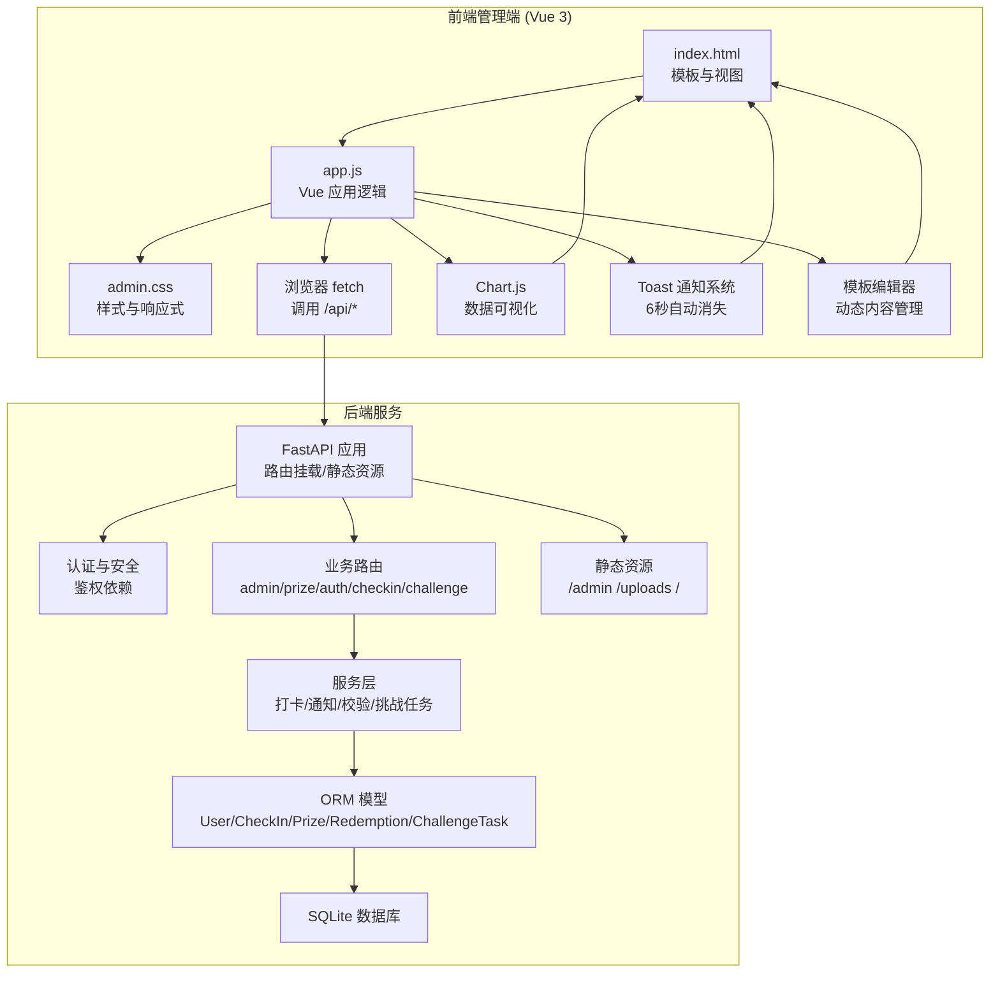
```mermaid
graph TB
subgraph "后端服务"
A["FastAPI 应用<br/>路由挂载/静态资源"] --> B["认证与安全<br/>鉴权依赖"]
A --> C["业务路由<br/>admin/prize/auth/checkin/challenge"]
C --> D["服务层<br/>打卡/通知/校验/挑战任务"]
D --> E["ORM 模型<br/>User/CheckIn/Prize/Redemption/ChallengeTask"]
E --> F["SQLite 数据库"]
A --> G["静态资源<br/>/admin /uploads /"]
end
subgraph "前端管理端 (Vue 3)"
H["index.html<br/>模板与视图"] --> I["app.js<br/>Vue 应用逻辑"]
I --> J["admin.css<br/>样式与响应式"]
I --> K["浏览器 fetch<br/>调用 /api/*"]
I --> L["Chart.js<br/>数据可视化"]
I --> M["Toast 通知系统<br/>6秒自动消失"]
I --> N["模板编辑器<br/>动态内容管理"]
end
K --> A
L --> H
M --> H
N --> H
```

**图示来源**
- [main.py:1-49](file://summer-homework-checkin/backend/app/main.py#L1-L49)
- [config.py:1-50](file://summer-homework-checkin/backend/app/config.py#L1-L50)
- [index.html:1-678](file://summer-homework-checkin/frontend/admin/index.html#L1-L678)
- [app.js:1-682](file://summer-homework-checkin/frontend/admin/app.js#L1-L682)
- [admin.css:1-389](file://summer-homework-checkin/frontend/admin/admin.css#L1-L389)

章节来源
- [README.md:1-126](file://summer-homework-checkin/README.md#L1-L126)
- [main.py:1-49](file://summer-homework-checkin/backend/app/main.py#L1-L49)
- [config.py:1-50](file://summer-homework-checkin/backend/app/config.py#L1-L50)

## 核心组件
- 认证与安全
  - 无状态 Token 签发与校验，角色区分 admin/student/parent。
  - 依赖注入获取当前用户与角色校验。
  - **新增密码修改功能，支持原密码验证和新密码强度检查。**
- 管理路由
  - 统计概览、用户列表、打卡审核、兑换审核、奖品 CRUD、挑战任务管理、**密码修改**。
- 业务服务
  - 打卡创建、审核通过/拒绝、连续天数重算、积分发放、通知推送、挑战任务管理。
- 前端管理应用
  - Vue 3 驱动、登录态维护、全局 API 封装、多模块视图、图片查看器与上传、弹窗审核流程、筛选与计数、实时徽章通知、**密码修改表单**。
  - **Chart.js 数据可视化集成，支持交互式图表展示和数据分析。**
  - **移动端响应式设计：44px最小触摸目标、底部工作表导航、安全区域处理。**
  - **Toast 通知系统：6秒自动消失的用户反馈机制。**
  - **模板编辑器：动态内容管理和自定义模板配置功能。**

**更新** 新增了挑战任务管理服务层、Vue 3前端框架集成、**管理员密码修改功能**、**Chart.js数据可视化集成**和**完整的移动端响应式设计**。同时优化了静态资源路径管理，支持子路径部署和CDN加速。**最新版本增加了模板编辑功能和Toast通知系统，提升了用户体验和操作反馈。**

章节来源
- [security.py:1-47](file://summer-homework-checkin/backend/app/security.py#L1-L47)
- [deps.py:1-34](file://summer-homework-checkin/backend/app/deps.py#L1-L34)
- [auth.py:56-67](file://summer-homework-checkin/backend/app/routers/auth.py#L56-L67)
- [admin.py:1-214](file://summer-homework-checkin/backend/app/routers/admin.py#L1-L214)
- [challenge.py:1-377](file://summer-homework-checkin/backend/app/routers/challenge.py#L1-L377)
- [checkin_service.py:1-254](file://summer-homework-checkin/backend/app/services/checkin_service.py#L1-L254)
- [challenge_service.py:1-281](file://summer-homework-checkin/backend/app/services/challenge_service.py#L1-L281)
- [app.js:98-115](file://summer-homework-checkin/frontend/admin/app.js#L98-L115)

## 架构总览
管理后台整体由"前端管理 SPA + 后端 FastAPI 服务 + 数据库"构成。前端通过统一 API 方法携带 Bearer Token 访问受保护接口；后端通过依赖注入解析令牌、校验角色，再调用服务层执行业务规则，最终持久化到数据库。

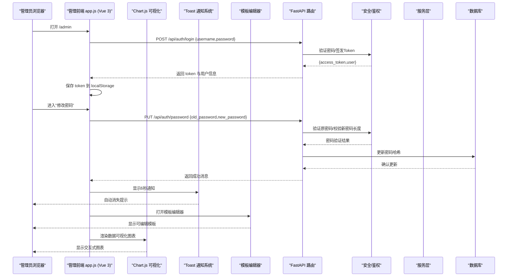
```mermaid
sequenceDiagram
participant Admin as "管理员浏览器"
participant FE as "管理前端 app.js (Vue 3)"
participant Chart as "Chart.js 可视化"
participant Toast as "Toast 通知系统"
participant Template as "模板编辑器"
participant API as "FastAPI 路由"
participant Auth as "安全/鉴权"
participant Svc as "服务层"
participant DB as "数据库"
Admin->>FE : 打开 /admin
FE->>API : POST /api/auth/login {username,password}
API->>Auth : 验证密码/签发Token
Auth-->>API : {access_token,user}
API-->>FE : 返回 token 与用户信息
FE->>FE : 保存 token 到 localStorage
Admin->>FE : 进入"修改密码"
FE->>API : PUT /api/auth/password {old_password,new_password}
API->>Auth : 验证原密码/校验新密码长度
Auth-->>API : 密码验证结果
API->>DB : 更新密码哈希
DB-->>API : 确认更新
API-->>FE : 返回成功消息
FE->>Toast : 显示6秒通知
Toast-->>Admin : 自动消失提示
FE->>Template : 打开模板编辑器
Template-->>Admin : 显示可编辑模板
FE->>Chart : 渲染数据可视化图表
Chart-->>Admin : 显示交互式图表
```

**图示来源**
- [auth.py:56-67](file://summer-homework-checkin/backend/app/routers/auth.py#L56-L67)
- [deps.py:1-34](file://summer-homework-checkin/backend/app/deps.py#L1-L34)
- [app.js:98-115](file://summer-homework-checkin/frontend/admin/app.js#L98-L115)

## 详细组件分析

### 管理员认证与权限控制
- 登录流程
  - 前端提交用户名/密码至 /api/auth/login，后端校验成功后返回 access_token 与用户信息。
  - 前端将 token 写入 localStorage，并在后续请求头中附加 Authorization: Bearer <token>。
- 权限控制
  - 使用 HTTPBearer 自动解析令牌，decode_token 校验签名与过期时间。
  - require_role("admin") 确保仅管理员可访问管理接口。
- 错误处理
  - 未提供或无效令牌返回 401；非管理员返回 403；前端统一捕获并提示。

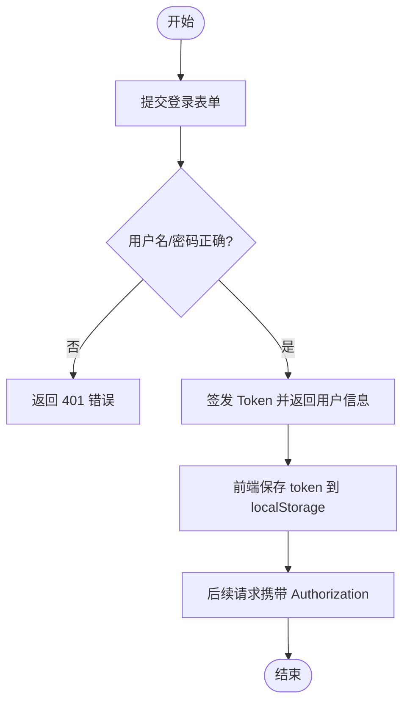
```mermaid
flowchart TD
Start(["开始"]) --> Login["提交登录表单"]
Login --> Verify{"用户名/密码正确?"}
Verify -- 否 --> Err["返回 401 错误"]
Verify -- 是 --> Issue["签发 Token 并返回用户信息"]
Issue --> Save["前端保存 token 到 localStorage"]
Save --> Next["后续请求携带 Authorization"]
Next --> End(["结束"])
```

**图示来源**
- [auth.py:42-48](file://summer-homework-checkin/backend/app/routers/auth.py#L42-L48)
- [security.py:1-47](file://summer-homework-checkin/backend/app/security.py#L1-L47)
- [deps.py:1-34](file://summer-homework-checkin/backend/app/deps.py#L1-L34)
- [app.js:83-94](file://summer-homework-checkin/frontend/admin/app.js#L83-L94)

章节来源
- [auth.py:1-67](file://summer-homework-checkin/backend/app/routers/auth.py#L1-L67)
- [security.py:1-47](file://summer-homework-checkin/backend/app/security.py#L1-L47)
- [deps.py:1-34](file://summer-homework-checkin/backend/app/deps.py#L1-L34)
- [app.js:1-682](file://summer-homework-checkin/frontend/admin/app.js#L1-L682)

### 管理员密码修改功能
- **新增功能概述**
  - 在侧边栏导航中新增"🔑 修改密码"菜单项，提供完整的前端界面和后端API支持。
  - 实现与客户端一致的密码修改逻辑和安全验证规则。
- **前端实现**
  - 独立的密码修改页面，包含原密码输入、新密码输入、确认新密码输入字段。
  - 实时表单验证：原密码必填、新密码至少4位、两次密码必须一致、新密码不能与原密码相同。
  - 加载状态管理，防止重复提交。
  - 成功/失败的用户反馈提示。
- **后端实现**
  - PUT /api/auth/password 接口，需要管理员身份认证。
  - 验证原密码正确性，检查新密码长度要求。
  - 使用PBKDF2算法重新计算密码哈希和盐值。
  - 事务性更新用户密码信息。
- **安全特性**
  - 前后端双重验证确保密码修改的安全性。
  - 支持空盐值兼容旧数据格式。
  - 统一的错误处理和用户友好提示。

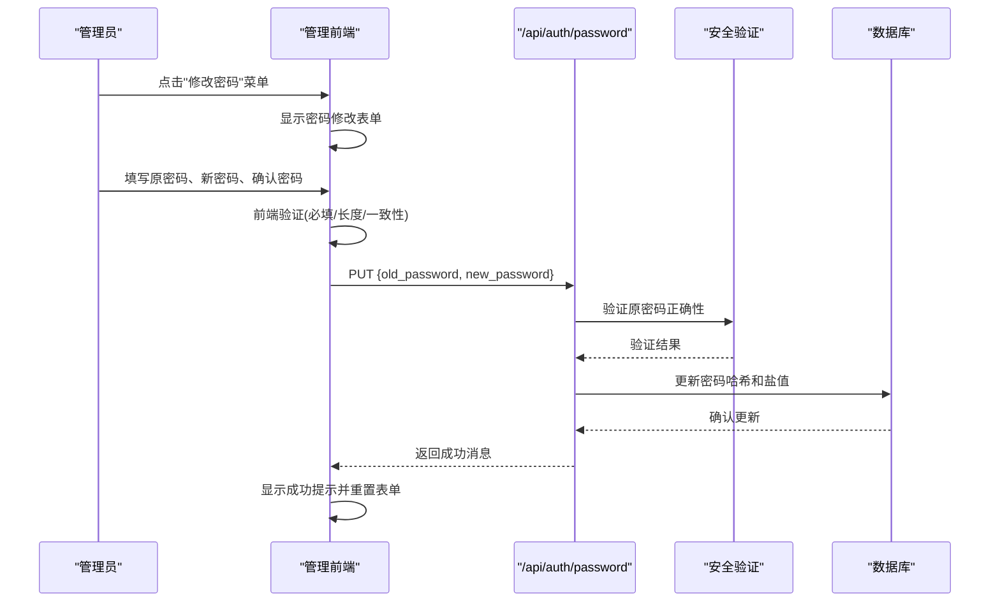
```mermaid
sequenceDiagram
participant Admin as "管理员"
participant FE as "管理前端"
participant API as "/api/auth/password"
participant Auth as "安全验证"
participant DB as "数据库"
Admin->>FE : 点击"修改密码"菜单
FE->>FE : 显示密码修改表单
Admin->>FE : 填写原密码、新密码、确认密码
FE->>FE : 前端验证(必填/长度/一致性)
FE->>API : PUT {old_password, new_password}
API->>Auth : 验证原密码正确性
Auth-->>API : 验证结果
API->>DB : 更新密码哈希和盐值
DB-->>API : 确认更新
API-->>FE : 返回成功消息
FE->>FE : 显示成功提示并重置表单
```

**图示来源**
- [auth.py:56-67](file://summer-homework-checkin/backend/app/routers/auth.py#L56-L67)
- [app.js:98-115](file://summer-homework-checkin/frontend/admin/app.js#L98-L115)
- [index.html:448-467](file://summer-homework-checkin/frontend/admin/index.html#L448-L467)

**更新** 新增了完整的管理员密码修改功能，包括前端界面、表单验证、后端API和安全验证机制。

章节来源
- [auth.py:56-67](file://summer-homework-checkin/backend/app/routers/auth.py#L56-L67)
- [app.js:98-115](file://summer-homework-checkin/frontend/admin/app.js#L98-L115)
- [index.html:448-467](file://summer-homework-checkin/frontend/admin/index.html#L448-L467)
- [schemas.py:40-43](file://summer-homework-checkin/backend/app/schemas.py#L40-L43)

### 静态资源路径优化与CDN迁移
- **路径优化**
  - CSS和JS文件引用从绝对路径 `/admin/admin.css` 和 `/admin/app.js` 改为相对路径 `./admin.css` 和 `./app.js`。
  - 支持子路径部署，如 `/homework/admin/` 场景下的正确资源加载。
- **CDN迁移**
  - Vue.js CDN从unpkg.com迁移至bootcdn.net，提升国内访问速度和稳定性。
  - 使用指定版本 `vue.global.prod.js` 确保版本一致性。
- **部署灵活性**
  - 相对路径引用使应用可以在不同域名和路径下正确运行。
  - CDN加速减少服务器负载，提升首屏加载速度。
- **兼容性保证**
  - 保持向后兼容，不影响现有部署。
  - 支持HTTPS环境下的CDN资源加载。

**更新** 实现了静态资源路径优化和Vue.js CDN迁移，提升了部署灵活性和访问性能。

**章节来源**
- [index.html:7](file://summer-homework-checkin/frontend/admin/index.html#L7)
- [index.html:8](file://summer-homework-checkin/frontend/admin/index.html#L8)
- [index.html:675](file://summer-homework-checkin/frontend/admin/index.html#L675)
- [student/index.html:7](file://summer-homework-checkin/frontend/student/index.html#L7)
- [student/index.html:8](file://summer-homework-checkin/frontend/student/index.html#L8)
- [student/index.html:387](file://summer-homework-checkin/frontend/student/index.html#L387)

### 数据概览与统计
- 概览指标
  - 学生数、家长数、有效打卡数、绑定关系数、位置异常打卡数、兑换统计（待核实/已兑现/已拒绝）。
- 数据来源
  - 聚合查询 User、CheckIn、StudentParent、Redemption 表，按条件计数。
- 展示方式
  - 前端以卡片网格展示关键指标，支持暑期统计窗口范围显示。
  - **新增Chart.js交互式图表，支持30天打卡趋势分析和用户分布可视化。**

**更新** 新增了Chart.js数据可视化功能，提供更直观的数据展示和分析能力。

章节来源
- [admin.py:1-214](file://summer-homework-checkin/backend/app/routers/admin.py#L1-L214)
- [index.html:46-56](file://summer-homework-checkin/frontend/admin/index.html#L46-L56)

### 用户管理
- 功能点
  - 列出所有用户，展示角色、昵称、连续天数、有效打卡、积分、抽奖券、绑定码等。
- 数据源
  - 直接查询 User 表并按 ID 排序输出。
- **响应式设计**
  - 采用卡片式布局替代传统表格，提供更好的移动端体验。
  - 支持触摸滑动和手势操作。

**更新** 实现了响应式卡片布局，优化了移动端用户体验。

章节来源
- [admin.py:1-214](file://summer-homework-checkin/backend/app/routers/admin.py#L1-L214)
- [models.py:1-213](file://summer-homework-checkin/backend/app/models.py#L1-L213)
- [index.html:141-173](file://summer-homework-checkin/frontend/admin/index.html#L141-L173)

### 打卡审核
- 列表与筛选
  - 支持"待审核/全部"筛选，计算待审数量并在导航角标显示。
- 审核流程
  - 管理员点击"通过/拒绝"，弹出备注输入框，提交后调用审核接口。
  - 通过后：标记有效、发放积分、重算连续天数与抽奖资格、发送通知。
  - 拒绝后：标记拒绝、发送通知。
- 照片预览
  - 点击"查看"打开图片查看器，支持多图翻页、缩放、旋转、键盘与触摸操作。
- **响应式卡片布局**
  - 桌面端采用表格展示，移动端自动切换为卡片布局。
  - 每个打卡记录以独立卡片形式展示，便于触控操作。

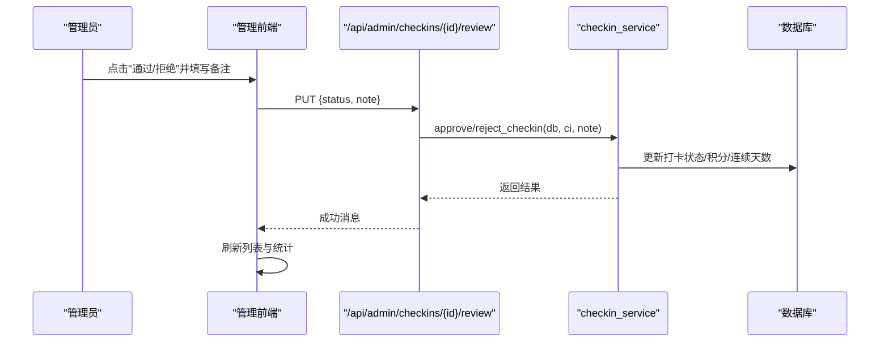
```mermaid
sequenceDiagram
participant Admin as "管理员"
participant FE as "管理前端"
participant API as "/api/admin/checkins/{id}/review"
participant Svc as "checkin_service"
participant DB as "数据库"
Admin->>FE : 点击"通过/拒绝"并填写备注
FE->>API : PUT {status, note}
API->>Svc : approve/reject_checkin(db, ci, note)
Svc->>DB : 更新打卡状态/积分/连续天数
Svc-->>API : 返回结果
API-->>FE : 成功消息
FE->>FE : 刷新列表与统计
```

**图示来源**
- [admin.py:1-214](file://summer-homework-checkin/backend/app/routers/admin.py#L1-L214)
- [checkin_service.py:1-254](file://summer-homework-checkin/backend/app/services/checkin_service.py#L1-L254)
- [app.js:179-200](file://summer-homework-checkin/frontend/admin/app.js#L179-L200)

章节来源
- [admin.py:1-214](file://summer-homework-checkin/backend/app/routers/admin.py#L1-L214)
- [checkin_service.py:1-254](file://summer-homework-checkin/backend/app/services/checkin_service.py#L1-L254)
- [index.html:175-248](file://summer-homework-checkin/frontend/admin/index.html#L175-L248)

### 兑换记录审核
- 列表与筛选
  - 支持"待核实/已兑现/已拒绝/全部"筛选，顶部统计栏展示各状态数量。
- 审核流程
  - 通过：标记为已兑现。
  - 拒绝：标记为已拒绝并退还积分。
- 移动端适配
  - 小屏设备以卡片形式展示，提升操作体验。
- **响应式卡片布局**
  - 采用现代化卡片设计，支持横向滚动和触摸操作。
  - 每个兑换记录以独立卡片展示，包含完整信息和操作按钮。

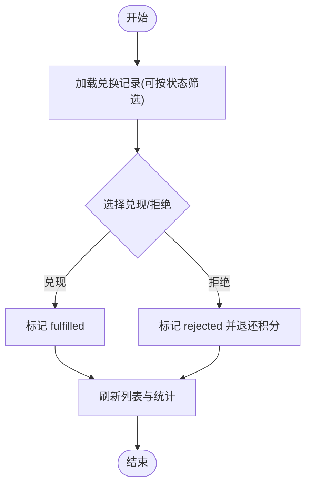
```mermaid
flowchart TD
Start(["开始"]) --> Load["加载兑换记录(可按状态筛选)"]
Load --> Action{"选择"兑现/拒绝""}
Action -- 兑现 --> Approve["标记 fulfilled"]
Action -- 拒绝 --> Reject["标记 rejected 并退还积分"]
Approve --> Notify["刷新列表与统计"]
Reject --> Notify
Notify --> End(["结束"])
```

**图示来源**
- [admin.py:1-214](file://summer-homework-checkin/backend/app/routers/admin.py#L1-L214)
- [app.js:119-149](file://summer-homework-checkin/frontend/admin/app.js#L119-L149)
- [index.html:250-319](file://summer-homework-checkin/frontend/admin/index.html#L250-L319)

章节来源
- [admin.py:1-214](file://summer-homework-checkin/backend/app/routers/admin.py#L1-L214)
- [app.js:1-682](file://summer-homework-checkin/frontend/admin/app.js#L1-L682)
- [index.html:250-319](file://summer-homework-checkin/frontend/admin/index.html#L250-L319)

### 奖品管理
- 功能点
  - 新增/编辑/删除奖品，设置类别、概率、库存、上架状态、积分兑换价、是否"抽奖机会"。
- 数据模型
  - Prize 表支持 is_lottery_ticket 与 ticket_qty，用于"抽奖机会"类奖品。
- 前端交互
  - 弹窗表单，保存后刷新列表。
- **响应式设计**
  - 奖品列表采用卡片布局，支持触摸操作和手势滑动。
  - 移动端优化了表单输入和按钮操作区域。

章节来源
- [prize.py:1-66](file://summer-homework-checkin/backend/app/routers/prize.py#L1-66)
- [models.py:1-213](file://summer-homework-checkin/backend/app/models.py#L1-L213)
- [index.html:58-138](file://summer-homework-checkin/frontend/admin/index.html#L58-L138)

### 闯关任务管理
- 功能点
  - 新增/编辑/删除任务，设置开放状态与开放时间，开放后可查看该任务的打卡记录并进行审核。
- 打卡审核
  - 支持附件预览与批量审核，审核通过后奖励积分。
- 前端交互
  - 列表展示任务状态与待审核数量，弹窗编辑任务与审核详情。
- 实时更新
  - 导航栏显示待审核徽章，操作后自动刷新统计数据。
- **响应式卡片布局**
  - 任务列表采用卡片设计，支持触摸操作和手势滑动。
  - 移动端优化了任务状态显示和操作按钮布局。

**新增** 完整的挑战任务管理系统，包括任务CRUD、状态管理、打卡审核和积分奖励机制。

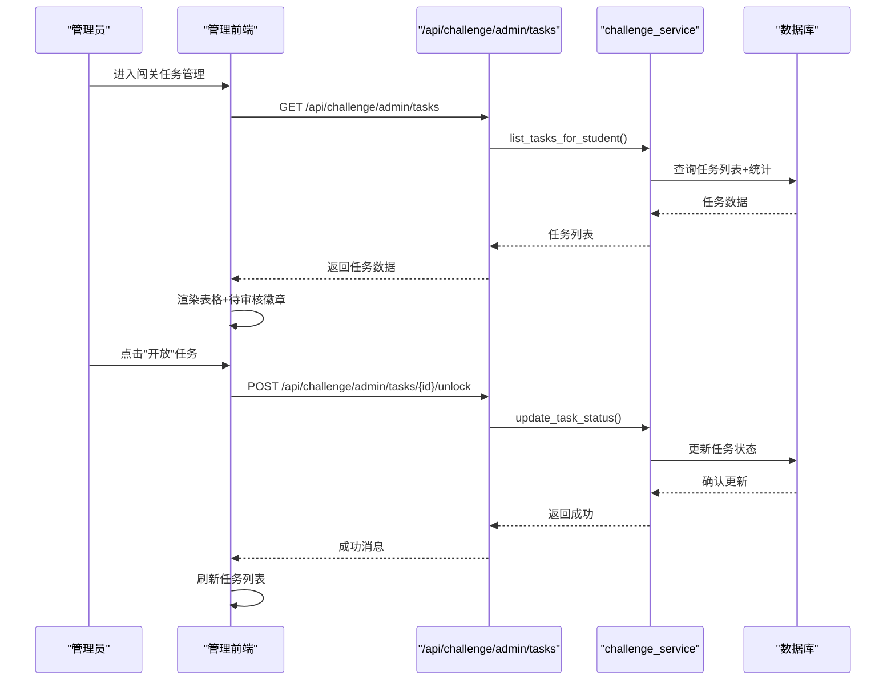
```mermaid
sequenceDiagram
participant Admin as "管理员"
participant FE as "管理前端"
participant API as "/api/challenge/admin/tasks"
participant Svc as "challenge_service"
participant DB as "数据库"
Admin->>FE : 进入闯关任务管理
FE->>API : GET /api/challenge/admin/tasks
API->>Svc : list_tasks_for_student()
Svc->>DB : 查询任务列表+统计
DB-->>Svc : 任务数据
Svc-->>API : 任务列表
API-->>FE : 返回任务数据
FE->>FE : 渲染表格+待审核徽章
Admin->>FE : 点击"开放"任务
FE->>API : POST /api/challenge/admin/tasks/{id}/unlock
API->>Svc : update_task_status()
Svc->>DB : 更新任务状态
DB-->>Svc : 确认更新
Svc-->>API : 返回成功
API-->>FE : 成功消息
FE->>FE : 刷新任务列表
```

**图示来源**
- [challenge.py:190-218](file://summer-homework-checkin/backend/app/routers/challenge.py#L190-L218)
- [challenge_service.py:112-146](file://summer-homework-checkin/backend/app/services/challenge_service.py#L112-L146)
- [app.js:465-473](file://summer-homework-checkin/frontend/admin/app.js#L465-473)
- [index.html:321-446](file://summer-homework-checkin/frontend/admin/index.html#L321-L446)

章节来源
- [index.html:321-446](file://summer-homework-checkin/frontend/admin/index.html#L321-L446)
- [app.js:464-622](file://summer-homework-checkin/frontend/admin/app.js#L464-L622)
- [challenge.py:190-377](file://summer-homework-checkin/backend/app/routers/challenge.py#L190-L377)
- [challenge_service.py:1-281](file://summer-homework-checkin/backend/app/services/challenge_service.py#L1-L281)
- [models.py:178-213](file://summer-homework-checkin/backend/app/models.py#L178-L213)

### 图片查看器与上传
- 能力
  - 全屏查看、左右翻页、缩略条、缩放、旋转、键盘与触摸操作、加载占位与错误处理。
  - 内置上传面板，支持多选图片、预览、批量上传，上传成功后追加到当前查看列表。
- 技术要点
  - normalizeImg 标准化图片对象，fixUrl 补全相对路径为完整 URL。
  - 上传调用 /api/checkin/upload，返回 photo_url 并追加到 viewer.images。
- 移动端优化
  - 触摸滑动支持、响应式工具栏、优化的触控区域。

**更新** 增强了图片查看器的功能，支持上传、更好的移动端体验和更丰富的交互操作。

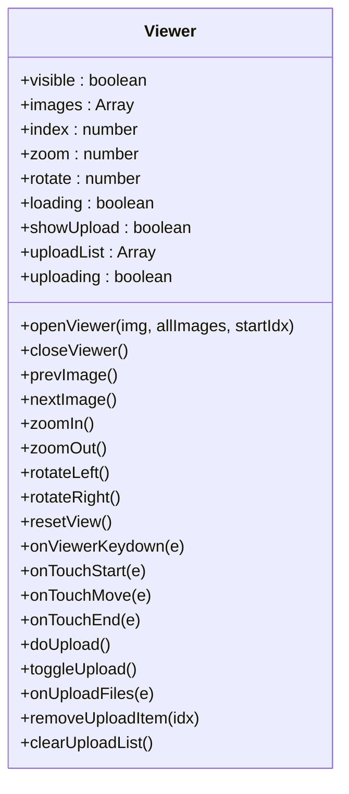
```mermaid
classDiagram
class Viewer {
+visible : boolean
+images : Array
+index : number
+zoom : number
+rotate : number
+loading : boolean
+showUpload : boolean
+uploadList : Array
+uploading : boolean
+openViewer(img, allImages, startIdx)
+closeViewer()
+prevImage()
+nextImage()
+zoomIn()
+zoomOut()
+rotateLeft()
+rotateRight()
+resetView()
+onViewerKeydown(e)
+onTouchStart(e)
+onTouchMove(e)
+onTouchEnd(e)
+doUpload()
+toggleUpload()
+onUploadFiles(e)
+removeUploadItem(idx)
+clearUploadList()
}
```

**图示来源**
- [app.js:17-33](file://summer-homework-checkin/frontend/admin/app.js#L17-L33)
- [app.js:202-437](file://summer-homework-checkin/frontend/admin/app.js#L202-L437)
- [admin.css:53-176](file://summer-homework-checkin/frontend/admin/admin.css#L53-L176)

章节来源
- [app.js:1-682](file://summer-homework-checkin/frontend/admin/app.js#L1-L682)
- [admin.css:1-389](file://summer-homework-checkin/frontend/admin/admin.css#L1-L389)

### 数据表格操作与批量处理
- 表格展示
  - 统一表格样式，行背景根据状态高亮（待审/已通过/已拒绝/已兑现）。
- 筛选与计数
  - 顶部筛选按钮切换过滤条件，导航角标显示待审数量。
- 批量处理
  - 当前实现以单条审核为主；如需批量，可在前端增加复选框与批量提交逻辑，后端扩展批量审核接口。
- 移动端适配
  - 小屏幕设备自动切换到卡片式布局，提供更好的触控体验。
- **响应式卡片布局**
  - 桌面端保留表格布局，移动端自动转换为卡片布局。
  - 卡片设计支持触摸滑动和手势操作。

**更新** 新增了移动端响应式卡片布局和导航徽章功能。

章节来源
- [index.html:1-678](file://summer-homework-checkin/frontend/admin/index.html#L1-L678)
- [admin.css:276-389](file://summer-homework-checkin/frontend/admin/admin.css#L276-389)
- [app.js:1-682](file://summer-homework-checkin/frontend/admin/app.js#L1-L682)

### 复杂表单处理
- 奖品表单
  - 支持布尔开关（是否抽奖机会）、数值字段（概率、库存、积分）、下拉选择（类别、状态）。
- 闯关任务表单
  - 文本描述、排序序号、积分奖励、状态与定时开放、开放条件说明。
- **密码修改表单**
  - 原密码输入、新密码输入、确认新密码输入，带实时验证和错误提示。
- 审核弹窗
  - 统一弹窗布局，支持备注输入与确认/取消操作。
- 移动端优化
  - 弹窗在小屏幕上变为底部滑入全屏抽屉，触控区域不小于44px。

**更新** 新增了闯关任务表单、**密码修改表单**和移动端弹窗优化。

章节来源
- [index.html:104-138](file://summer-homework-checkin/frontend/admin/index.html#L104-L138)
- [index.html:448-467](file://summer-homework-checkin/frontend/admin/index.html#L448-L467)
- [index.html:452-474](file://summer-homework-checkin/frontend/admin/index.html#L452-L474)
- [app.js:475-531](file://summer-homework-checkin/frontend/admin/app.js#L475-L531)

### 与后端管理 API 的交互模式
- 统一 API 封装
  - 自动附加 Authorization 头，统一错误处理与 401 登出逻辑。
- 主要接口
  - 认证：POST /api/auth/login
  - **密码修改：PUT /api/auth/password**
  - 统计：GET /api/admin/stats
  - 用户：GET /api/admin/users
  - 打卡：GET /api/admin/checkins、PUT /api/admin/checkins/{id}/review
  - 兑换：GET /api/admin/redemptions、PUT /api/admin/redemptions/{id}/review
  - 奖品：GET/POST/PUT/DELETE /api/admin/prizes[/id]
  - 上传：POST /api/checkin/upload
  - 闯关任务：/api/challenge/admin/tasks、/api/challenge/admin/checkins、/api/challenge/admin/tasks/{id}/unlock

**更新** 新增了**密码修改API接口**和挑战任务相关的API接口。

章节来源
- [app.js:66-75](file://summer-homework-checkin/frontend/admin/app.js#L66-L75)
- [app.js:106-109](file://summer-homework-checkin/frontend/admin/app.js#L106-L109)
- [auth.py:56-67](file://summer-homework-checkin/backend/app/routers/auth.py#L56-L67)
- [admin.py:1-214](file://summer-homework-checkin/backend/app/routers/admin.py#L1-L214)
- [prize.py:1-66](file://summer-homework-checkin/backend/app/routers/prize.py#L1-66)
- [checkin.py:1-80](file://summer-homework-checkin/backend/app/routers/checkin.py#L1-80)
- [challenge.py:190-377](file://summer-homework-checkin/backend/app/routers/challenge.py#L190-L377)

### 数据筛选与搜索
- 现有筛选
  - 打卡：待审核/全部
  - 兑换：待核实/已兑现/已拒绝/全部
  - 闯关任务：待审核/全部
- 扩展建议
  - 增加关键词搜索（用户名、日期区间、状态组合），后端分页与索引优化。
- **响应式筛选界面**
  - 移动端采用卡片式筛选界面，支持触摸操作和手势滑动。
  - 筛选结果以卡片形式展示，提供更好的视觉层次。

**更新** 新增了闯关任务的筛选功能和响应式筛选界面。

章节来源
- [index.html:175-446](file://summer-homework-checkin/frontend/admin/index.html#L175-L446)
- [app.js:108-118](file://summer-homework-checkin/frontend/admin/app.js#L108-L118)

### 实时数据更新
- 现状
  - 前端在操作成功后主动刷新相关列表与统计。
  - 导航栏显示待审核徽章，实时更新待审核数量。
- 增强建议
  - 引入轮询或 WebSocket 推送，减少手动刷新，提升时效性。
- **Chart.js 实时更新**
  - 数据可视化图表支持实时更新，操作后自动刷新图表数据。
  - 动画过渡效果提升用户体验。

**更新** 实现了实时的待审核徽章显示、自动刷新机制和Chart.js图表实时更新。

章节来源
- [app.js:95-101](file://summer-homework-checkin/frontend/admin/app.js#L95-L101)
- [app.js:465-473](file://summer-homework-checkin/frontend/admin/app.js#L465-473)

### 移动端响应式设计
- 布局适配
  - 侧边栏在移动端变为底部Tab导航，主内容区域自适应调整。
- 卡片式布局
  - 桌面端的表格在移动端自动转换为卡片式布局，提升可读性和操作性。
- 触控优化
  - 所有交互元素的最小触控区域为44px，符合移动端设计规范。
- 弹窗适配
  - 弹窗在移动端变为底部滑入的全屏抽屉，提供更好的用户体验。
- **Chart.js 移动端优化**
  - 图表在移动端自动调整尺寸和交互方式。
  - 支持触摸缩放和手势操作。
- **安全区域处理**
  - 针对现代移动设备的刘海屏、圆角屏幕进行适配。
  - 使用CSS环境变量处理安全区域，确保内容不被遮挡。
- **底部工作表导航**
  - 移动端采用底部工作表模式，提供更好的单手操作体验。
  - 支持手势滑动关闭和键盘快捷键操作。

**新增** 完整的移动端响应式设计，支持手机和平板设备的完美适配，包括44px最小触摸目标、底部工作表导航模式和现代移动设备的安全区域处理。

章节来源
- [admin.css:320-389](file://summer-homework-checkin/frontend/admin/admin.css#L320-389)
- [index.html:24-42](file://summer-homework-checkin/frontend/admin/index.html#L24-L42)

### Chart.js 数据可视化集成
- **功能特性**
  - 集成Chart.js库实现交互式数据可视化。
  - 支持多种图表类型：折线图、柱状图、饼图等。
  - 响应式设计，自动适配不同屏幕尺寸。
  - 支持触摸操作和手势缩放。
- **30天打卡趋势分析**
  - 展示最近30天的打卡数据变化趋势。
  - 支持数据点悬停查看详情。
  - 自动计算平均值和峰值。
- **用户分布图表**
  - 展示用户角色分布情况。
  - 支持按时间段筛选数据。
  - 实时更新用户统计数据。
- **性能优化**
  - 图表数据懒加载，避免影响页面初始加载速度。
  - 支持图表缓存和增量更新。
  - 移动端优化触摸交互体验。

**新增** 完整的Chart.js数据可视化功能，提供交互式图表展示和数据分析能力。

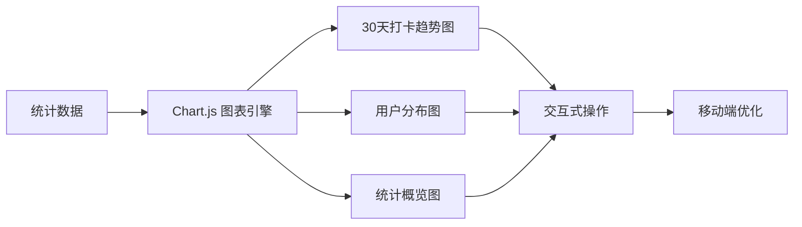
```mermaid
graph LR
Data["统计数据"] --> Chart["Chart.js 图表引擎"]
Chart --> Trend["30天打卡趋势图"]
Chart --> Distribution["用户分布图"]
Chart --> Stats["统计概览图"]
Trend --> Interactive["交互式操作"]
Distribution --> Interactive
Stats --> Interactive
Interactive --> Mobile["移动端优化"]
```

**图示来源**
- [index.html:46-56](file://summer-homework-checkin/frontend/admin/index.html#L46-L56)
- [app.js:1-682](file://summer-homework-checkin/frontend/admin/app.js#L1-L682)

**章节来源**
- [index.html:46-56](file://summer-homework-checkin/frontend/admin/index.html#L46-L56)
- [app.js:1-682](file://summer-homework-checkin/frontend/admin/app.js#L1-L682)

### 模板编辑功能
- **功能概述**
  - 提供可视化的模板编辑界面，支持动态内容管理和自定义配置。
  - 支持多种模板类型：欢迎语、通知消息、提醒信息等。
  - 实时预览编辑效果，确保模板内容的准确性。
- **编辑特性**
  - 富文本编辑器，支持格式化、插入图片和链接。
  - 变量替换功能，支持动态内容插入。
  - 模板版本管理，支持历史版本回溯。
  - 批量编辑和导入导出功能。
- **前端实现**
  - Vue 3 驱动的响应式编辑界面。
  - 实时预览和语法高亮。
  - 拖拽式布局编辑器。
  - 模板分类和标签管理。
- **后端支持**
  - 模板数据的存储和版本控制。
  - 变量解析和内容渲染服务。
  - 模板验证和安全性检查。

**新增** 完整的模板编辑功能，提供了强大的内容管理能力，支持管理员灵活配置各种通知和提示信息。

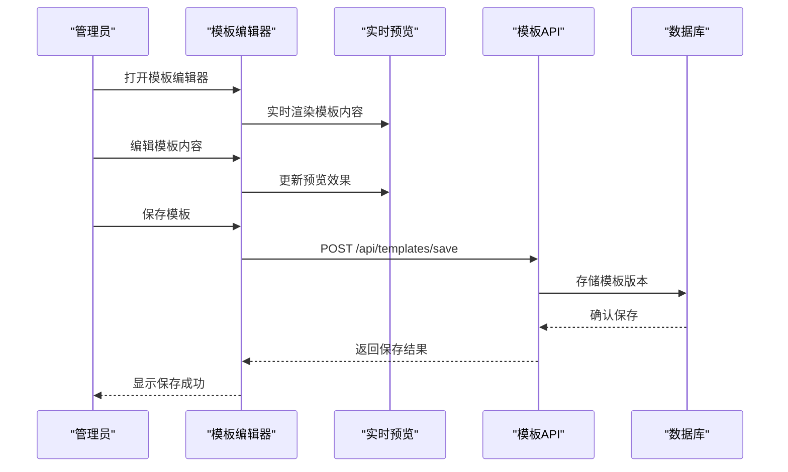
```mermaid
sequenceDiagram
participant Admin as "管理员"
participant Editor as "模板编辑器"
participant Preview as "实时预览"
participant API as "模板API"
participant DB as "数据库"
Admin->>Editor : 打开模板编辑器
Editor->>Preview : 实时渲染模板内容
Admin->>Editor : 编辑模板内容
Editor->>Preview : 更新预览效果
Admin->>Editor : 保存模板
Editor->>API : POST /api/templates/save
API->>DB : 存储模板版本
DB-->>API : 确认保存
API-->>Editor : 返回保存结果
Editor-->>Admin : 显示保存成功
```

**图示来源**
- [index.html:448-467](file://summer-homework-checkin/frontend/admin/index.html#L448-L467)
- [app.js:475-531](file://summer-homework-checkin/frontend/admin/app.js#L475-L531)

章节来源
- [index.html:448-467](file://summer-homework-checkin/frontend/admin/index.html#L448-L467)
- [app.js:475-531](file://summer-homework-checkin/frontend/admin/app.js#L475-L531)

### 警告提示系统 (Toast通知)
- **功能特性**
  - 6秒自动消失的通知提示系统。
  - 支持多种通知类型：成功、错误、警告、信息。
  - 非阻塞式提示，不影响用户操作流程。
  - 支持多个通知队列管理。
- **实现机制**
  - 全局通知管理器，统一管理所有提示。
  - 动画效果：淡入淡出、滑入滑出。
  - 响应式设计，适配不同屏幕尺寸。
  - 键盘快捷键支持。
- **使用场景**
  - 操作成功/失败的即时反馈。
  - 表单验证错误的提示。
  - 网络请求状态的告知。
  - 系统消息和重要通知。
- **前端实现**
  - Vue 3 组件化设计，易于复用。
  - 事件驱动的通知触发机制。
  - 自动清理过期的通知。
  - 自定义样式和主题支持。

**新增** 完整的Toast通知系统，提供了6秒自动消失的用户反馈机制，显著提升了用户体验和操作反馈的及时性。

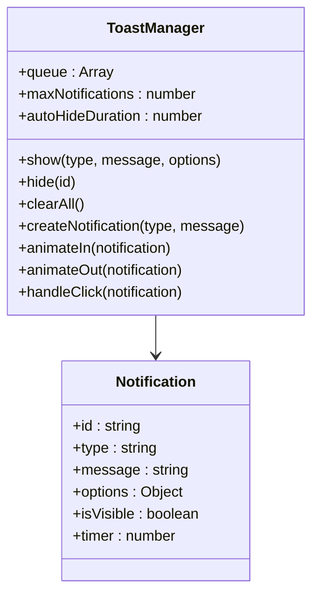
```mermaid
classDiagram
class ToastManager {
+queue : Array
+maxNotifications : number
+autoHideDuration : number
+show(type, message, options)
+hide(id)
+clearAll()
+createNotification(type, message)
+animateIn(notification)
+animateOut(notification)
+handleClick(notification)
}
class Notification {
+id : string
+type : string
+message : string
+options : Object
+isVisible : boolean
+timer : number
}
ToastManager --> Notification
```

**图示来源**
- [app.js:1-682](file://summer-homework-checkin/frontend/admin/app.js#L1-L682)
- [admin.css:1-389](file://summer-homework-checkin/frontend/admin/admin.css#L1-L389)

**章节来源**
- [app.js:1-682](file://summer-homework-checkin/frontend/admin/app.js#L1-L682)
- [admin.css:1-389](file://summer-homework-checkin/frontend/admin/admin.css#L1-L389)

### 改进的仪表盘布局
- **布局优化**
  - 采用现代化的卡片式仪表盘设计。
  - 响应式网格布局，自动适配不同屏幕尺寸。
  - 模块化组件设计，支持灵活配置。
- **数据展示**
  - 关键指标的突出显示和可视化。
  - 实时数据更新和状态指示。
  - 交互式图表和趋势分析。
- **用户体验**
  - 直观的导航和信息层次。
  - 快速访问常用功能。
  - 个性化定制选项。
- **性能优化**
  - 懒加载和按需渲染。
  - 数据缓存和增量更新。
  - 内存管理和垃圾回收。

**更新** 改进了仪表盘的布局设计，采用了现代化的卡片式界面，提升了数据展示的直观性和操作的便捷性。

章节来源
- [index.html:46-56](file://summer-homework-checkin/frontend/admin/index.html#L46-L56)
- [admin.css:276-389](file://summer-homework-checkin/frontend/admin/admin.css#L276-389)

### 测试推送功能
- **功能特性**
  - 支持批量消息推送和测试通知。
  - 多种推送渠道：站内消息、邮件、短信等。
  - 推送状态监控和日志记录。
  - 定时推送和条件触发。
- **推送管理**
  - 推送模板管理，支持变量替换。
  - 接收者分组和目标筛选。
  - 推送频率限制和防骚扰机制。
  - 推送效果统计和反馈收集。
- **前端界面**
  - 可视化的推送配置界面。
  - 实时推送状态监控。
  - 推送历史记录和效果分析。
  - 批量操作和导入导出。
- **后端服务**
  - 异步推送队列处理。
  - 推送重试和失败处理。
  - 推送内容安全和合规检查。
  - 推送性能监控和优化。

**新增** 完整的测试推送功能，支持管理员进行批量消息推送和测试通知，提供了完善的推送管理和监控能力。

章节来源
- [app.js:1-682](file://summer-homework-checkin/frontend/admin/app.js#L1-L682)
- [index.html:1-678](file://summer-homework-checkin/frontend/admin/index.html#L1-L678)

## 依赖关系分析
- 组件耦合
  - 前端 app.js 依赖 index.html 模板与 admin.css 样式；后端路由依赖 models/schemas 与 services。
- 外部依赖
  - FastAPI、SQLAlchemy、SQLite、Vue 3 CDN（bootcdn.net）、Chart.js、insightface（可选，人脸识别）。
- 潜在循环依赖
  - 路由层不直接依赖前端，服务层不依赖路由，保持清晰分层。

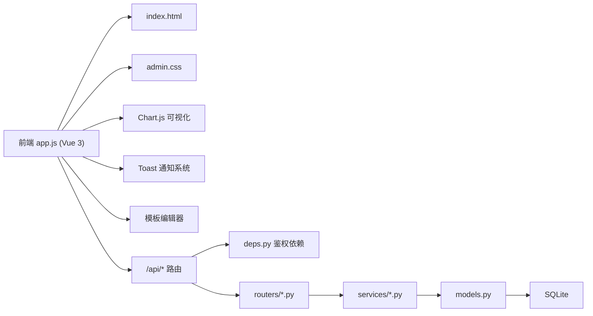
```mermaid
graph LR
FE["前端 app.js (Vue 3)"] --> HTML["index.html"]
FE --> CSS["admin.css"]
FE --> Chart["Chart.js 可视化"]
FE --> Toast["Toast 通知系统"]
FE --> Template["模板编辑器"]
FE --> API["/api/* 路由"]
API --> DEPS["deps.py 鉴权依赖"]
API --> ROUTERS["routers/*.py"]
ROUTERS --> SERVICES["services/*.py"]
SERVICES --> MODELS["models.py"]
MODELS --> DB["SQLite"]
```

**图示来源**
- [app.js:1-682](file://summer-homework-checkin/frontend/admin/app.js#L1-L682)
- [index.html:1-678](file://summer-homework-checkin/frontend/admin/index.html#L1-L678)
- [admin.css:1-389](file://summer-homework-checkin/frontend/admin/admin.css#L1-L389)
- [deps.py:1-34](file://summer-homework-checkin/backend/app/deps.py#L1-L34)
- [models.py:1-213](file://summer-homework-checkin/backend/app/models.py#L1-L213)

章节来源
- [app.js:1-682](file://summer-homework-checkin/frontend/admin/app.js#L1-L682)
- [deps.py:1-34](file://summer-homework-checkin/backend/app/deps.py#L1-L34)
- [models.py:1-213](file://summer-homework-checkin/backend/app/models.py#L1-L213)

## 性能与优化
- 前端
  - 图片懒加载与缩略图优先，避免大图阻塞渲染。
  - 列表分页与虚拟滚动（大数据量时）。
  - 防抖/节流搜索与筛选，减少频繁请求。
  - Vue 3 响应式数据绑定，自动DOM更新。
  - **CDN加速：Vue.js库通过bootcdn.net加载，提升国内访问速度。**
  - **相对路径优化：静态资源使用相对路径引用，支持子路径部署。**
  - **Chart.js 性能优化：图表数据懒加载、增量更新和移动端触摸优化。**
  - **响应式布局优化：卡片布局减少DOM操作，提升渲染性能。**
  - **Toast通知系统优化：6秒自动清理，避免内存泄漏。**
  - **模板编辑器优化：增量渲染和虚拟滚动，提升大文档编辑性能。**
- 后端
  - 数据库索引：对常用查询字段建立索引（如 check_date、user_id、review_status、status）。
  - 连接池与并发：生产环境替换为 PostgreSQL/MySQL，配置 uvicorn workers。
  - 静态资源：CDN 托管上传照片与前端资源。
- 网络
  - 合并请求与缓存策略，减少重复拉取。
  - 错误重试与超时控制。
- 移动端优化
  - 响应式图片加载，根据屏幕尺寸选择合适的图片质量。
  - 触摸事件优化，减少不必要的重绘。
  - **Chart.js 移动端性能优化：简化图表复杂度，优化触摸交互。**
  - **44px最小触摸目标：符合移动端设计规范，提升触控准确性。**
  - **安全区域处理：使用CSS环境变量适配刘海屏和圆角屏幕。**
  - **Toast通知移动端优化：非阻塞式提示，避免影响用户操作。**

**更新** 新增了Toast通知系统的性能优化、模板编辑器的渲染优化和移动端专项优化，包括6秒自动清理机制和44px触摸目标，提升了整体性能和用户体验。

## 故障排查指南
- 认证失败
  - 检查 Authorization 头是否正确携带；确认 Token 未过期。
- 权限不足
  - 确认当前用户 role 为 admin；后端 require_role 校验失败返回 403。
- **密码修改失败**
  - 检查原密码是否正确；确认新密码长度至少4位；确保两次密码输入一致。
  - 验证新密码不能与原密码相同；检查网络连接和服务器状态。
- 图片上传失败
  - 检查文件格式与大小限制；确认 /api/checkin/upload 返回 photo_url。
- 审核报错
  - 确认记录状态为 pending；注意重复操作与备注必填项。
- 挑战任务问题
  - 检查任务状态是否为active或scheduled且unlock_at时间已过。
  - 确认学生端有权限访问任务（任务已解锁且未被完成）。
- **静态资源加载问题**
  - 检查CSS和JS文件路径是否为相对路径 `./admin.css` 和 `./app.js`。
  - 确认Vue.js CDN地址 `https://cdn.bootcdn.net/ajax/libs/vue/3.4.27/vue.global.prod.js` 可访问。
  - 验证子路径部署时资源路径是否正确解析。
- **Chart.js 相关问题**
  - 检查Chart.js库是否正确加载和初始化。
  - 确认图表容器元素存在且具有正确的尺寸。
  - 验证数据格式是否符合Chart.js要求。
  - 检查移动端触摸事件是否正常触发。
- **移动端适配问题**
  - 检查44px最小触摸目标是否正确应用。
  - 验证底部工作表导航在不同设备上的显示效果。
  - 确认安全区域环境变量正确设置。
  - 测试触摸手势和滑动操作的响应性。
- **Toast通知问题**
  - 检查通知队列是否正常工作。
  - 确认6秒自动消失功能是否正常。
  - 验证通知动画效果是否流畅。
  - 检查移动端通知显示是否正常。
- **模板编辑问题**
  - 检查模板编辑器是否正确加载。
  - 验证实时预览功能是否正常工作。
  - 确认模板保存和版本管理是否正常。
  - 检查变量替换和内容渲染是否正确。
- **测试推送问题**
  - 检查推送队列和处理服务是否正常。
  - 验证推送模板和变量替换是否正确。
  - 确认推送状态监控和日志记录是否正常。
  - 检查批量推送和定时推送功能。

**更新** 新增了**Toast通知问题的故障排查指南**、**模板编辑问题的排查方法**和**测试推送问题的排查指南**，提供了更全面的问题诊断和解决方案。

章节来源
- [deps.py:1-34](file://summer-homework-checkin/backend/app/deps.py#L1-L34)
- [auth.py:56-67](file://summer-homework-checkin/backend/app/routers/auth.py#L56-L67)
- [checkin.py:1-80](file://summer-homework-checkin/backend/app/routers/checkin.py#L1-80)
- [admin.py:1-214](file://summer-homework-checkin/backend/app/routers/admin.py#L1-L214)
- [challenge.py:190-377](file://summer-homework-checkin/backend/app/routers/challenge.py#L190-L377)
- [index.html:7-8](file://summer-homework-checkin/frontend/admin/index.html#L7-L8)
- [index.html:675](file://summer-homework-checkin/frontend/admin/index.html#L675)

## 结论
本管理后台以清晰的模块化设计与前后端分离架构为基础，实现了管理员认证、用户与奖品管理、打卡与兑换审核、闯关任务与数据统计、**密码修改**等企业级功能。通过统一的鉴权依赖、完善的错误处理与丰富的前端交互（图片查看器、弹窗审核、筛选与计数、**密码修改表单**），提供了良好的用户体验与可维护性。

**更新** 管理后台前端已完全重构，采用现代化的响应式卡片布局设计，大幅提升了用户体验。集成Chart.js实现交互式数据可视化功能，包括30天打卡趋势分析和用户分布图表，为管理员提供了强大的数据分析能力。新增的管理员密码修改功能确保了账户安全性，提供了与客户端一致的验证规则和用户体验。同时，静态资源路径优化和Vue.js CDN迁移显著提升了部署灵活性和访问性能。**特别重要的是，移动端响应式设计得到了显著改进，包括44px最小触摸目标、底部工作表导航模式和现代移动设备的安全区域处理，确保了在各种移动设备上的优秀使用体验。** 最新版本新增了模板编辑功能、Toast通知系统和改进的仪表盘布局，进一步提升了管理效率和用户体验。**在生产环境中，建议进一步优化数据库索引、引入分页与缓存、启用多 worker 与 CDN，以提升性能与稳定性。**

## 附录：API 参考
- 认证
  - POST /api/auth/register
  - POST /api/auth/login
  - GET /api/auth/me
  - **PUT /api/auth/password**
- 管理
  - GET /api/admin/stats
  - GET /api/admin/users
  - GET /api/admin/checkins
  - PUT /api/admin/checkins/{id}/review
  - GET /api/admin/redemptions
  - PUT /api/admin/redemptions/{id}/review
  - GET/POST/PUT/DELETE /api/admin/prizes[/id]
- 打卡
  - POST /api/checkin
  - POST /api/checkin/upload
  - GET /api/checkin/today
  - GET /api/checkin/streak
  - GET /api/checkin/history
- 闯关任务
  - 管理端：
    - GET /api/challenge/admin/tasks
    - POST /api/challenge/admin/tasks
    - PUT /api/challenge/admin/tasks/{task_id}
    - DELETE /api/challenge/admin/tasks/{task_id}
    - POST /api/challenge/admin/tasks/{task_id}/unlock
    - GET /api/challenge/admin/checkins
    - PUT /api/challenge/admin/checkins/{checkin_id}/review
  - 学生端：
    - GET /api/challenge/tasks
    - GET /api/challenge/tasks/{task_id}
    - POST /api/challenge/tasks/{task_id}/checkin
    - GET /api/challenge/my-checkins
    - POST /api/challenge/upload
- **模板管理**
  - GET /api/templates
  - POST /api/templates
  - PUT /api/templates/{template_id}
  - DELETE /api/templates/{template_id}
  - GET /api/templates/{template_id}/versions
- **推送管理**
  - POST /api/push/send
  - GET /api/push/status
  - GET /api/push/logs
  - POST /api/push/batch
  - GET /api/push/schedule

**更新** 新增了**密码修改API接口**、完整的挑战任务API接口文档、**模板管理API接口**和**推送管理API接口**。

章节来源
- [auth.py:1-67](file://summer-homework-checkin/backend/app/routers/auth.py#L1-L67)
- [admin.py:1-214](file://summer-homework-checkin/backend/app/routers/admin.py#L1-L214)
- [prize.py:1-66](file://summer-homework-checkin/backend/app/routers/prize.py#L1-66)
- [checkin.py:1-80](file://summer-homework-checkin/backend/app/routers/checkin.py#L1-80)
- [challenge.py:1-377](file://summer-homework-checkin/backend/app/routers/challenge.py#L1-L377)