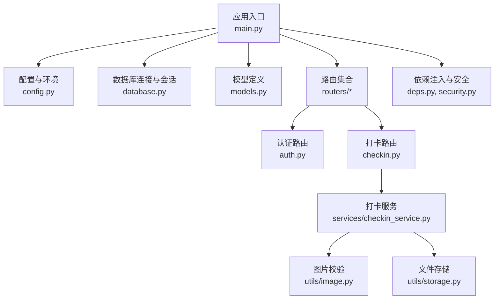
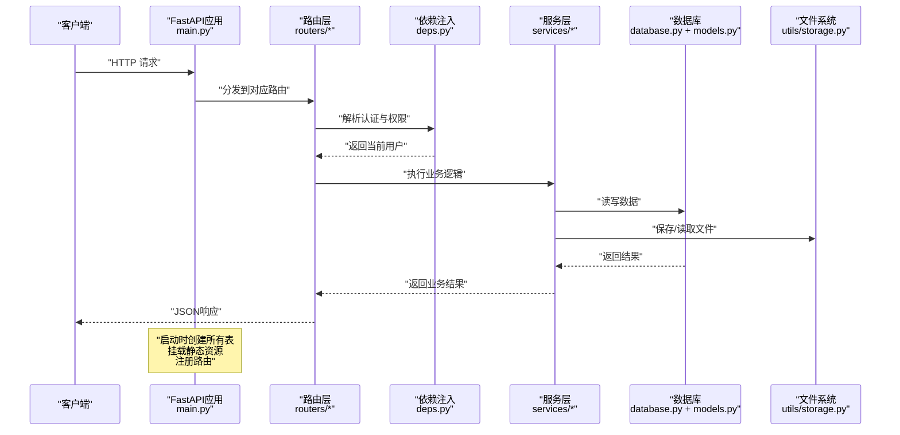
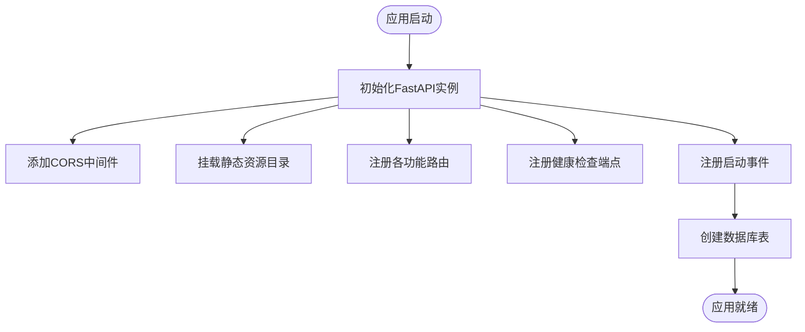
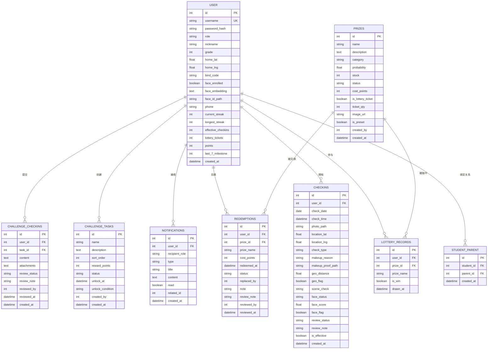
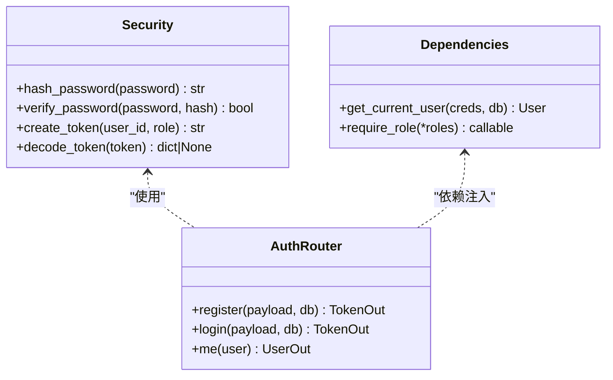
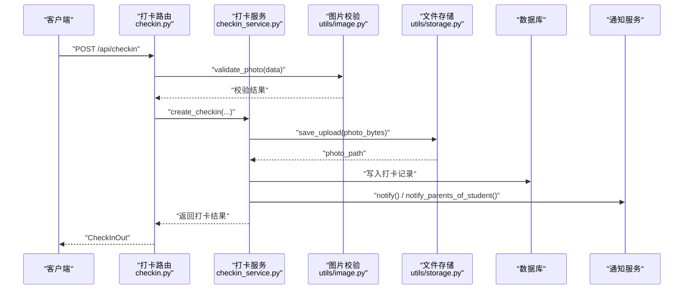
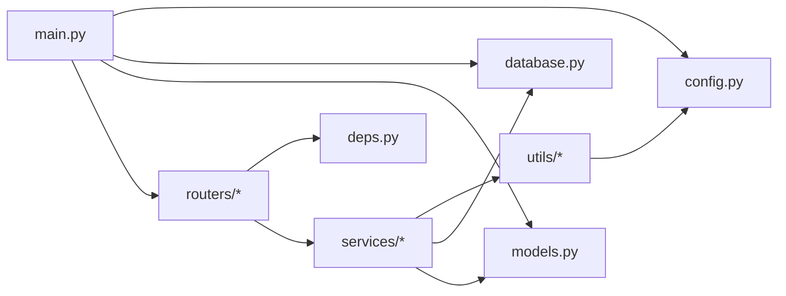

# FastAPI应用核心

<cite>
**本文引用的文件**   
- [main.py](file://summer-homework-checkin/backend/app/main.py)
- [config.py](file://summer-homework-checkin/backend/app/config.py)
- [database.py](file://summer-homework-checkin/backend/app/database.py)
- [models.py](file://summer-homework-checkin/backend/app/models.py)
- [deps.py](file://summer-homework-checkin/backend/app/deps.py)
- [security.py](file://summer-homework-checkin/backend/app/security.py)
- [auth.py](file://summer-homework-checkin/backend/app/routers/auth.py)
- [checkin.py](file://summer-homework-checkin/backend/app/routers/checkin.py)
- [schemas.py](file://summer-homework-checkin/backend/app/schemas.py)
- [checkin_service.py](file://summer-homework-checkin/backend/app/services/checkin_service.py)
- [storage.py](file://summer-homework-checkin/backend/app/utils/storage.py)
- [image.py](file://summer-homework-checkin/backend/app/utils/image.py)
</cite>

## 目录
1. [简介](#简介)
2. [项目结构](#项目结构)
3. [核心组件](#核心组件)
4. [架构总览](#架构总览)
5. [详细组件分析](#详细组件分析)
6. [依赖关系分析](#依赖关系分析)
7. [性能考量](#性能考量)
8. [故障排查指南](#故障排查指南)
9. [结论](#结论)
10. [附录：扩展指南](#附录扩展指南)

## 简介
本技术文档聚焦于暑假作业打卡系统的FastAPI后端核心，围绕以下目标展开：
- 应用初始化与配置：CORS中间件、静态资源挂载、路由注册机制
- 启动事件与数据库表自动创建流程
- 配置文件管理、环境变量与常量定义的最佳实践
- 健康检查端点与错误处理机制
- 扩展新功能的指导：新增路由模块与中间件

该文档旨在帮助开发者快速理解系统架构与关键实现路径，并提供可操作的扩展建议。

## 项目结构
后端采用分层组织方式：
- 应用入口与装配：main.py
- 配置与环境：config.py
- 数据层：database.py（引擎/会话/基类）、models.py（ORM模型）
- 安全与鉴权：security.py、deps.py
- 业务服务：services/*（如 checkin_service.py）
- 工具与存储：utils/*（storage.py、image.py等）
- 路由与协议：routers/*、schemas.py

图表来源
- [main.py:1-49](file://summer-homework-checkin/backend/app/main.py#L1-L49)
- [config.py:1-50](file://summer-homework-checkin/backend/app/config.py#L1-L50)
- [database.py:1-22](file://summer-homework-checkin/backend/app/database.py#L1-L22)
- [models.py:1-212](file://summer-homework-checkin/backend/app/models.py#L1-L212)
- [deps.py:1-34](file://summer-homework-checkin/backend/app/deps.py#L1-L34)
- [security.py:1-47](file://summer-homework-checkin/backend/app/security.py#L1-L47)
- [auth.py:1-52](file://summer-homework-checkin/backend/app/routers/auth.py#L1-L52)
- [checkin.py:1-80](file://summer-homework-checkin/backend/app/routers/checkin.py#L1-L80)
- [checkin_service.py:1-254](file://summer-homework-checkin/backend/app/services/checkin_service.py#L1-L254)
- [image.py:1-61](file://summer-homework-checkin/backend/app/utils/image.py#L1-L61)
- [storage.py:1-24](file://summer-homework-checkin/backend/app/utils/storage.py#L1-L24)

章节来源
- [main.py:1-49](file://summer-homework-checkin/backend/app/main.py#L1-L49)
- [config.py:1-50](file://summer-homework-checkin/backend/app/config.py#L1-L50)

## 核心组件
- 应用装配与中间件
  - CORS中间件启用，允许跨域访问
  - 静态资源挂载：上传目录、学生端H5、管理后台
  - 路由集中注册：认证、打卡、抽奖、奖品、家长、报表、管理员、人脸、兑换、闯关等
- 启动事件
  - 在应用启动时执行数据库表自动创建
- 健康检查
  - 提供 /api/health 返回运行状态
- 配置与环境变量
  - 统一从 config.py 读取，支持通过环境变量覆盖敏感或可调参数
- 数据库与模型
  - SQLAlchemy Engine/Session/DeclarativeBase 配置
  - ORM模型涵盖用户、绑定关系、打卡记录、奖品、抽奖记录、兑换、通知、闯关任务及打卡记录
- 安全与鉴权
  - 自定义无状态令牌生成与校验
  - 基于Bearer的依赖注入获取当前用户与角色校验
- 服务层与工具
  - 打卡服务封装业务规则（补卡策略、连续天数计算、积分发放、通知）
  - 图片校验与文件存储工具

章节来源
- [main.py:1-49](file://summer-homework-checkin/backend/app/main.py#L1-L49)
- [config.py:1-50](file://summer-homework-checkin/backend/app/config.py#L1-L50)
- [database.py:1-22](file://summer-homework-checkin/backend/app/database.py#L1-L22)
- [models.py:1-212](file://summer-homework-checkin/backend/app/models.py#L1-L212)
- [deps.py:1-34](file://summer-homework-checkin/backend/app/deps.py#L1-L34)
- [security.py:1-47](file://summer-homework-checkin/backend/app/security.py#L1-L47)
- [checkin_service.py:1-254](file://summer-homework-checkin/backend/app/services/checkin_service.py#L1-L254)
- [storage.py:1-24](file://summer-homework-checkin/backend/app/utils/storage.py#L1-L24)
- [image.py:1-61](file://summer-homework-checkin/backend/app/utils/image.py#L1-L61)

## 架构总览
下图展示了请求从客户端到路由、依赖注入、服务层与数据层的调用链路，以及静态资源与健康检查的处理路径。

图表来源
- [main.py:1-49](file://summer-homework-checkin/backend/app/main.py#L1-L49)
- [deps.py:1-34](file://summer-homework-checkin/backend/app/deps.py#L1-L34)
- [checkin.py:1-80](file://summer-homework-checkin/backend/app/routers/checkin.py#L1-L80)
- [checkin_service.py:1-254](file://summer-homework-checkin/backend/app/services/checkin_service.py#L1-L254)
- [database.py:1-22](file://summer-homework-checkin/backend/app/database.py#L1-L22)
- [storage.py:1-24](file://summer-homework-checkin/backend/app/utils/storage.py#L1-L24)

## 详细组件分析

### 应用初始化与启动流程
- 中间件与静态资源
  - 启用CORS中间件，允许所有来源与方法头
  - 挂载三个静态目录：上传目录、管理后台、学生端H5
- 路由注册
  - 将各功能模块的路由器集中注册至应用
- 启动事件
  - 在应用启动时调用 Base.metadata.create_all(bind=engine)，确保所有表存在
- 健康检查
  - GET /api/health 返回 {"status": "ok"}

图表来源
- [main.py:1-49](file://summer-homework-checkin/backend/app/main.py#L1-L49)

章节来源
- [main.py:1-49](file://summer-homework-checkin/backend/app/main.py#L1-L49)

### 配置与环境变量管理
- 配置项分类
  - 路径与目录：BASE_DIR、UPLOAD_DIR、STUDENT_DIR、ADMIN_DIR
  - 数据库：DB_PATH、DATABASE_URL
  - 安全：SECRET、TOKEN_EXPIRE_DAYS
  - 业务规则：GEO_THRESHOLD_METERS、MAX_MAKEUP_PER_MONTH、CHECKIN_POINTS、MAKEUP_POINTS、LOTTERY_STREAK_THRESHOLD
  - 人脸识别：FACE_MATCH_THRESHOLD、FACE_DET_SIZE、FACE_MODEL_NAME、FACE_MODE_ON_ENROLLED
- 环境变量覆盖
  - 使用 os.environ.get(...) 为敏感或可调参数提供默认值，便于生产环境注入
- 最佳实践
  - 将可变参数集中在 config.py，避免散落在代码中
  - 对数值型配置进行类型转换与边界检查
  - 对路径类配置使用相对路径拼接，保证部署一致性

章节来源
- [config.py:1-50](file://summer-homework-checkin/backend/app/config.py#L1-L50)

### 数据库与模型设计
- 连接与会话
  - 使用 create_engine 创建引擎，connect_args 针对SQLite设置线程安全
  - sessionmaker 配置会话，autoflush=False、autocommit=False
  - declarative_base 作为所有模型的基类
- 核心模型
  - User：统一用户表，包含角色、统计字段、人脸信息
  - StudentParent：家长与孩子多对多绑定
  - CheckIn：打卡记录，含地理、场景、人脸审核相关字段
  - Prize/LotteryRecord/Redemption：奖品、抽奖与积分兑换
  - Notification：站内通知
  - ChallengeTask/ChallengeCheckIn：闯关任务与提交记录
- 自动建表
  - 启动事件中调用 Base.metadata.create_all(bind=engine)

图表来源
- [models.py:1-212](file://summer-homework-checkin/backend/app/models.py#L1-L212)

章节来源
- [database.py:1-22](file://summer-homework-checkin/backend/app/database.py#L1-L22)
- [models.py:1-212](file://summer-homework-checkin/backend/app/models.py#L1-L212)

### 安全与鉴权机制
- 密码哈希与验证
  - 使用PBKDF2进行单向哈希，固定盐用于演示
- 无状态令牌
  - 生成：payload包含用户ID、角色、过期时间；签名使用HMAC-SHA256
  - 校验：验证签名与过期时间，返回payload或None
- 依赖注入
  - HTTPBearer方案，自动解析Authorization头
  - get_current_user：校验令牌并加载用户对象
  - require_role：基于角色的访问控制装饰器

图表来源
- [security.py:1-47](file://summer-homework-checkin/backend/app/security.py#L1-L47)
- [deps.py:1-34](file://summer-homework-checkin/backend/app/deps.py#L1-L34)
- [auth.py:1-52](file://summer-homework-checkin/backend/app/routers/auth.py#L1-L52)

章节来源
- [security.py:1-47](file://summer-homework-checkin/backend/app/security.py#L1-L47)
- [deps.py:1-34](file://summer-homework-checkin/backend/app/deps.py#L1-L34)
- [auth.py:1-52](file://summer-homework-checkin/backend/app/routers/auth.py#L1-L52)

### 打卡业务流程
- 路由层
  - POST /api/checkin：接收照片、位置、打卡类型与补卡信息，调用服务层
  - POST /api/checkin/upload：通用图片上传，返回可访问URL
  - GET /api/checkin/today、/streak、/history：查询今日状态、连续天数与历史记录
- 服务层
  - 照片体积与尺寸校验
  - 补卡规则：日期范围、重复检测、月度上限
  - 防代打卡：地理位置阈值、人脸比对策略
  - 审核通过后发放积分、重算连续天数与抽奖资格
  - 通知本人与家长
- 工具层
  - 图片校验：仅解析JPEG/PNG头部，提取宽高，过滤占位图
  - 文件存储：按用户分目录保存，返回相对路径与公开URL

图表来源
- [checkin.py:1-80](file://summer-homework-checkin/backend/app/routers/checkin.py#L1-L80)
- [checkin_service.py:1-254](file://summer-homework-checkin/backend/app/services/checkin_service.py#L1-L254)
- [image.py:1-61](file://summer-homework-checkin/backend/app/utils/image.py#L1-L61)
- [storage.py:1-24](file://summer-homework-checkin/backend/app/utils/storage.py#L1-L24)

章节来源
- [checkin.py:1-80](file://summer-homework-checkin/backend/app/routers/checkin.py#L1-L80)
- [checkin_service.py:1-254](file://summer-homework-checkin/backend/app/services/checkin_service.py#L1-L254)
- [image.py:1-61](file://summer-homework-checkin/backend/app/utils/image.py#L1-L61)
- [storage.py:1-24](file://summer-homework-checkin/backend/app/utils/storage.py#L1-L24)

### 健康检查与错误处理
- 健康检查
  - GET /api/health 返回 {"status": "ok"}，可用于探针与负载均衡健康探测
- 错误处理
  - 路由与服务层通过HTTPException抛出业务异常，携带状态码与详情
  - 依赖注入层对未提供或无效令牌返回401，角色不匹配返回403
  - 人脸识别服务不可用时返回503，提示稍后重试

章节来源
- [main.py:33-35](file://summer-homework-checkin/backend/app/main.py#L33-L35)
- [deps.py:13-33](file://summer-homework-checkin/backend/app/deps.py#L13-L33)
- [checkin_service.py:116-123](file://summer-homework-checkin/backend/app/services/checkin_service.py#L116-L123)

## 依赖关系分析
- 模块耦合
  - main.py 聚合配置、数据库、模型与路由，承担装配职责
  - routers/* 依赖 deps.py 与 services/*，保持轻量
  - services/* 依赖 database.py、models.py、utils/* 与 config.py
  - utils/* 独立性强，主要提供通用能力
- 外部依赖
  - FastAPI、SQLAlchemy、Pydantic
  - 操作系统文件系统（uploads目录）
- 潜在循环依赖
  - 当前结构清晰，未见明显循环导入；注意在新增模块时避免反向引用

图表来源
- [main.py:1-49](file://summer-homework-checkin/backend/app/main.py#L1-L49)
- [config.py:1-50](file://summer-homework-checkin/backend/app/config.py#L1-L50)
- [database.py:1-22](file://summer-homework-checkin/backend/app/database.py#L1-L22)
- [models.py:1-212](file://summer-homework-checkin/backend/app/models.py#L1-L212)
- [deps.py:1-34](file://summer-homework-checkin/backend/app/deps.py#L1-L34)
- [checkin_service.py:1-254](file://summer-homework-checkin/backend/app/services/checkin_service.py#L1-L254)
- [image.py:1-61](file://summer-homework-checkin/backend/app/utils/image.py#L1-L61)
- [storage.py:1-24](file://summer-homework-checkin/backend/app/utils/storage.py#L1-L24)

章节来源
- [main.py:1-49](file://summer-homework-checkin/backend/app/main.py#L1-L49)
- [config.py:1-50](file://summer-homework-checkin/backend/app/config.py#L1-L50)
- [database.py:1-22](file://summer-homework-checkin/backend/app/database.py#L1-L22)
- [models.py:1-212](file://summer-homework-checkin/backend/app/models.py#L1-L212)
- [deps.py:1-34](file://summer-homework-checkin/backend/app/deps.py#L1-L34)
- [checkin_service.py:1-254](file://summer-homework-checkin/backend/app/services/checkin_service.py#L1-L254)
- [image.py:1-61](file://summer-homework-checkin/backend/app/utils/image.py#L1-L61)
- [storage.py:1-24](file://summer-homework-checkin/backend/app/utils/storage.py#L1-L24)

## 性能考量
- 数据库
  - SQLite适合轻量场景，但并发写受限；高并发时应考虑迁移至PostgreSQL/MySQL
  - 合理索引：users.username、checkins.user_id、checkins.check_date等已具备基础索引
- 文件存储
  - 大文件上传需限制大小与超时；当前已配置最小/最大体积与尺寸门槛
  - 静态资源可通过CDN或反向代理缓存提升访问速度
- 图片校验
  - 仅解析头部，避免引入重型库，降低CPU开销
- 令牌与鉴权
  - 无状态令牌减少会话存储压力；注意密钥轮换与过期策略

[本节为通用性能建议，无需特定文件来源]

## 故障排查指南
- 常见问题
  - 401 未提供认证令牌或令牌无效：检查Authorization头格式与令牌有效期
  - 403 无权限访问：确认用户角色是否符合接口要求
  - 400 业务校验失败：检查照片体积/尺寸、补卡日期与次数限制
  - 503 人脸识别服务不可用：等待服务恢复或降级策略生效
- 定位方法
  - 查看路由与服务层抛出的HTTPException详情
  - 检查uploads目录权限与磁盘空间
  - 核对环境变量是否注入正确（如SUMMER_SECRET、GEO_THRESHOLD_METERS等）

章节来源
- [deps.py:13-33](file://summer-homework-checkin/backend/app/deps.py#L13-L33)
- [checkin_service.py:66-123](file://summer-homework-checkin/backend/app/services/checkin_service.py#L66-L123)
- [config.py:1-50](file://summer-homework-checkin/backend/app/config.py#L1-L50)

## 结论
本FastAPI应用以清晰的模块化与分层设计实现了打卡系统的核心能力：
- 通过中间件与静态资源挂载提供跨域与前端托管
- 启动事件确保数据库表自动创建，简化部署
- 配置与环境变量统一管理，便于运维与扩展
- 健康检查与错误处理完善，利于监控与排障
- 鉴权与业务服务解耦，易于新增功能与维护

[本节为总结性内容，无需特定文件来源]

## 附录：扩展指南
- 新增路由模块
  - 在 app/routers 下创建新模块，定义 APIRouter 并注册若干端点
  - 在 main.py 中 import 新模块并通过 app.include_router(router) 注册
  - 如需依赖注入，复用 deps.py 中的 get_current_user 与 require_role
- 新增中间件
  - 在 main.py 中使用 app.add_middleware(...) 添加自定义中间件
  - 中间件应关注横切关注点（日志、限流、审计等），避免侵入业务逻辑
- 新增配置项
  - 在 config.py 中添加常量，优先支持环境变量覆盖
  - 在服务层与路由层通过 from ..config import ... 引入
- 新增数据库模型
  - 在 models.py 中定义新模型，确保继承自 Base
  - 启动事件会自动创建表；必要时添加索引与约束
- 新增服务层
  - 在 services/* 中封装复杂业务逻辑，保持路由层简洁
  - 通过依赖注入获取数据库会话与当前用户
- 新增工具函数
  - 在 utils/* 中提供通用能力（如图像处理、存储、加密等）
  - 遵循单一职责原则，便于测试与复用

[本节为概念性指导，无需特定文件来源]