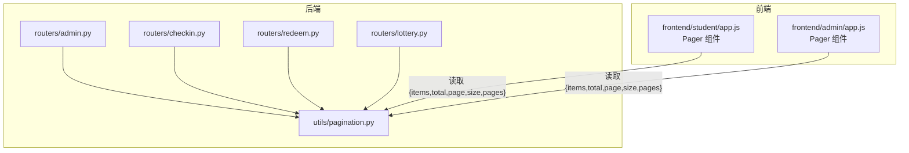
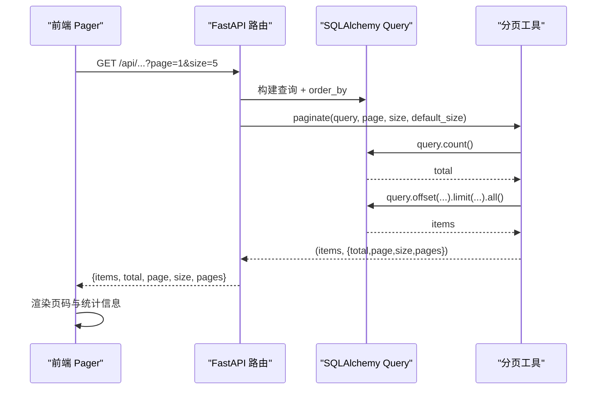
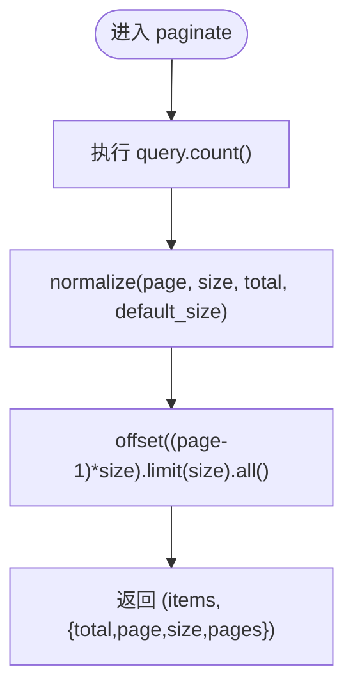
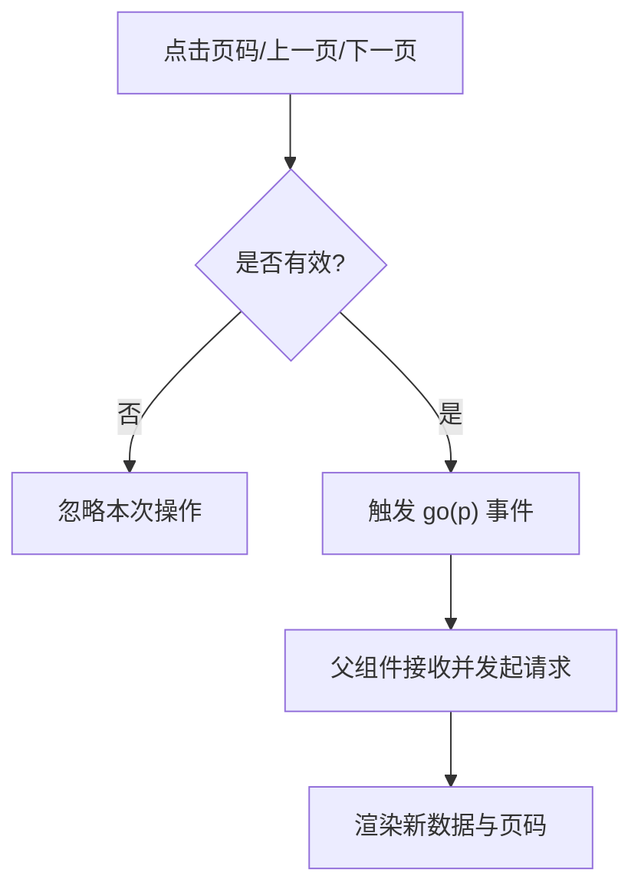
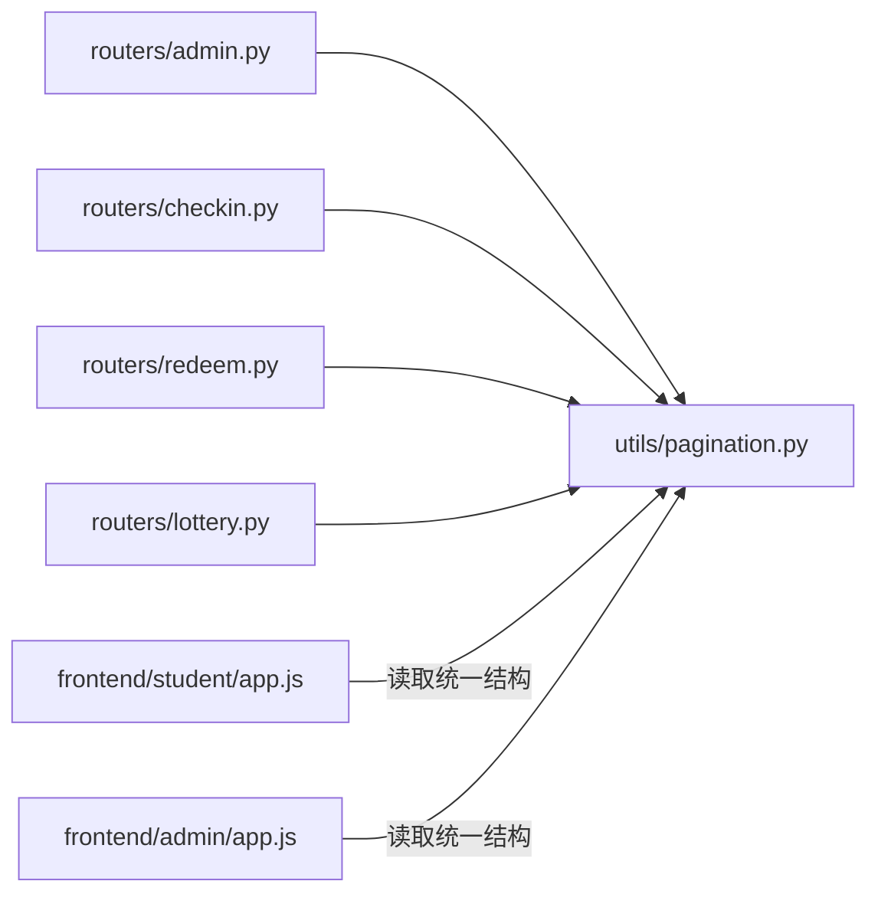

# 分页系统

<cite>
**本文引用的文件**
- [pagination.py](file://summer-homework-checkin/backend/app/utils/pagination.py)
- [admin.py](file://summer-homework-checkin/backend/app/routers/admin.py)
- [checkin.py](file://summer-homework-checkin/backend/app/routers/checkin.py)
- [redeem.py](file://summer-homework-checkin/backend/app/routers/redeem.py)
- [lottery.py](file://summer-homework-checkin/backend/app/routers/lottery.py)
- [app.js（学生端）](file://summer-homework-checkin/frontend/student/app.js)
- [app.js（管理端）](file://summer-homework-checkin/frontend/admin/app.js)
</cite>

## 目录
1. [简介](#简介)
2. [项目结构](#项目结构)
3. [核心组件](#核心组件)
4. [架构总览](#架构总览)
5. [详细组件分析](#详细组件分析)
6. [依赖关系分析](#依赖关系分析)
7. [性能考量](#性能考量)
8. [故障排查指南](#故障排查指南)
9. [结论](#结论)
10. [附录](#附录)

## 简介
本仓库实现了一套统一的后端分页工具与前后端一致的分页约定，覆盖后台管理与客户端（学生/家长）两类场景。后端通过统一的响应结构与参数规整逻辑，确保所有列表接口返回一致的元信息；前端提供可复用的分页控件，自动处理页码折叠、边界保护与状态展示。该设计降低了各模块重复实现成本，提升了数据一致性、可维护性与用户体验。

## 项目结构
- 后端分页能力集中在 utils/pagination.py，提供：
  - 统一分页响应模型 Page[T]
  - 参数规整 normalize
  - SQLAlchemy Query 分页 paginate
  - 内存列表分页 paginate_list
- 路由层在各业务模块中复用上述能力，如用户列表、打卡记录、兑换记录、抽奖记录等
- 前端在 admin 与 student 两个页面分别实现了相同的 Pager 组件，用于渲染页码、上一页/下一页与“第 X/Y 页 · 共 N 条”的信息

图表来源
- [pagination.py:1-60](file://summer-homework-checkin/backend/app/utils/pagination.py#L1-L60)
- [admin.py:157-182](file://summer-homework-checkin/backend/app/routers/admin.py#L157-L182)
- [checkin.py:77-87](file://summer-homework-checkin/backend/app/routers/checkin.py#L77-L87)
- [redeem.py:49-62](file://summer-homework-checkin/backend/app/routers/redeem.py#L49-L62)
- [lottery.py:14-27](file://summer-homework-checkin/backend/app/routers/lottery.py#L14-L27)
- [app.js（学生端）:58-94](file://summer-homework-checkin/frontend/student/app.js#L58-L94)
- [app.js（管理端）:57-96](file://summer-homework-checkin/frontend/admin/app.js#L57-L96)

章节来源
- [pagination.py:1-60](file://summer-homework-checkin/backend/app/utils/pagination.py#L1-L60)
- [admin.py:157-182](file://summer-homework-checkin/backend/app/routers/admin.py#L157-L182)
- [checkin.py:77-87](file://summer-homework-checkin/backend/app/routers/checkin.py#L77-L87)
- [redeem.py:49-62](file://summer-homework-checkin/backend/app/routers/redeem.py#L49-L62)
- [lottery.py:14-27](file://summer-homework-checkin/backend/app/routers/lottery.py#L14-L27)
- [app.js（学生端）:58-94](file://summer-homework-checkin/frontend/student/app.js#L58-L94)
- [app.js（管理端）:57-96](file://summer-homework-checkin/frontend/admin/app.js#L57-L96)

## 核心组件
- 分页响应模型 Page[T]
  - 字段：items、total、page、size、pages
  - 用途：作为 FastAPI response_model，统一序列化输出结构
- 参数规整 normalize(page, size, total, default_size)
  - 将 page 限制到 [1, pages]
  - 将 size 限制到 (0, MAX_PAGE_SIZE]，默认使用 ADMIN_PAGE_SIZE 或传入的 default_size
  - 计算 pages = ceil(total / size)，至少为 1
- 数据库分页 paginate(query, page, size, default_size)
  - 先 count()，再 offset((page-1)*size).limit(size).all()
  - 返回 (items, meta)
- 内存分页 paginate_list(rows, page, size, default_size)
  - 对已聚合的内存列表进行切片分页
  - 返回 (slice, meta)

章节来源
- [pagination.py:24-59](file://summer-homework-checkin/backend/app/utils/pagination.py#L24-L59)

## 架构总览
后端所有列表接口遵循同一契约：请求携带 page、size；响应包含 items、total、page、size、pages。路由层负责构建查询与排序，调用 paginate 完成计数与切片；服务层不直接参与分页细节，保持职责清晰。前端通过 Pager 组件消费统一结构，自动处理页码窗口折叠与边界保护。

图表来源
- [pagination.py:43-51](file://summer-homework-checkin/backend/app/utils/pagination.py#L43-L51)
- [admin.py:185-200](file://summer-homework-checkin/backend/app/routers/admin.py#L185-L200)
- [checkin.py:77-87](file://summer-homework-checkin/backend/app/routers/checkin.py#L77-L87)
- [redeem.py:49-62](file://summer-homework-checkin/backend/app/routers/redeem.py#L49-L62)
- [lottery.py:14-27](file://summer-homework-checkin/backend/app/routers/lottery.py#L14-L27)

## 详细组件分析

### 后端分页工具（utils/pagination.py）
- 设计要点
  - 统一响应结构，便于前端复用控件
  - 安全限制：MAX_PAGE_SIZE 防止超大 size 拖垮数据库
  - 容错：page 越界时收敛至有效区间，避免空页 4xx
  - 通用性：支持 SQLAlchemy Query 与内存列表两种场景
- 复杂度
  - count() 时间复杂度 O(N) 或取决于索引与过滤条件
  - offset/limit 由数据库优化器决定，通常 O(1) 获取一页
  - 内存分页为 O(1) 切片
- 扩展点
  - 可通过传入不同 default_size 适配不同客户端（如 CLIENT_PAGE_SIZE）
  - 可在 normalize 中增加更多校验规则（如 size 下限）

图表来源
- [pagination.py:43-51](file://summer-homework-checkin/backend/app/utils/pagination.py#L43-L51)

章节来源
- [pagination.py:1-60](file://summer-homework-checkin/backend/app/utils/pagination.py#L1-L60)

### 管理端路由（routers/admin.py）
- 典型用法
  - 用户列表：按角色筛选后分页
  - 打卡记录：按审核状态或位置异常筛选后分页
  - 兑换记录：按状态筛选后分页
  - 推送日志：倒序分页
- 特点
  - 使用 ADMIN_PAGE_SIZE 作为默认每页大小
  - 批量加载关联数据（如昵称映射），减少 N+1 查询
  - 返回结构符合统一分页约定

章节来源
- [admin.py:157-182](file://summer-homework-checkin/backend/app/routers/admin.py#L157-L182)
- [admin.py:185-226](file://summer-homework-checkin/backend/app/routers/admin.py#L185-L226)
- [admin.py:258-285](file://summer-homework-checkin/backend/app/routers/admin.py#L258-L285)
- [admin.py:477-486](file://summer-homework-checkin/backend/app/routers/admin.py#L477-L486)

### 客户端路由（routers/checkin.py、redeem.py、lottery.py）
- 打卡历史：按用户维度分页，默认 CLIENT_PAGE_SIZE
- 我的兑换记录：按用户维度分页，默认 CLIENT_PAGE_SIZE
- 我的抽奖记录：按用户维度分页，默认 CLIENT_PAGE_SIZE
- 特点
  - 使用 CLIENT_PAGE_SIZE 作为默认每页大小，适合移动端小屏
  - 返回类型使用 Page[Schema]，保证响应结构稳定

章节来源
- [checkin.py:77-87](file://summer-homework-checkin/backend/app/routers/checkin.py#L77-L87)
- [redeem.py:49-62](file://summer-homework-checkin/backend/app/routers/redeem.py#L49-L62)
- [lottery.py:14-27](file://summer-homework-checkin/backend/app/routers/lottery.py#L14-L27)

### 前端分页控件（student/admin app.js）
- 功能
  - 上一页/下一页按钮禁用态控制
  - 页码窗口折叠：总页数较少时全部显示；较多时保留首末页并在当前页附近展开，其余以省略号表示
  - 显示“第 X/Y 页 · 共 N 条”
- 交互
  - 点击页码触发 go(p) 事件，父组件根据 p 发起新的分页请求
  - 忽略无效页码（如省略号、越界、当前页）

图表来源
- [app.js（学生端）:58-94](file://summer-homework-checkin/frontend/student/app.js#L58-L94)
- [app.js（管理端）:57-96](file://summer-homework-checkin/frontend/admin/app.js#L57-L96)

章节来源
- [app.js（学生端）:58-94](file://summer-homework-checkin/frontend/student/app.js#L58-L94)
- [app.js（管理端）:57-96](file://summer-homework-checkin/frontend/admin/app.js#L57-L96)

## 依赖关系分析
- 后端
  - 路由层依赖分页工具，但不关心具体实现细节
  - 分页工具依赖 Pydantic 模型与 SQLAlchemy Query
  - 路由层通过常量区分默认分页大小（ADMIN_PAGE_SIZE vs CLIENT_PAGE_SIZE）
- 前端
  - 两个端均实现相同 Pager 组件，仅样式略有差异
  - 组件依赖后端统一响应结构

图表来源
- [pagination.py:1-60](file://summer-homework-checkin/backend/app/utils/pagination.py#L1-L60)
- [admin.py:157-182](file://summer-homework-checkin/backend/app/routers/admin.py#L157-L182)
- [checkin.py:77-87](file://summer-homework-checkin/backend/app/routers/checkin.py#L77-L87)
- [redeem.py:49-62](file://summer-homework-checkin/backend/app/routers/redeem.py#L49-L62)
- [lottery.py:14-27](file://summer-homework-checkin/backend/app/routers/lottery.py#L14-L27)
- [app.js（学生端）:58-94](file://summer-homework-checkin/frontend/student/app.js#L58-L94)
- [app.js（管理端）:57-96](file://summer-homework-checkin/frontend/admin/app.js#L57-L96)

章节来源
- [pagination.py:1-60](file://summer-homework-checkin/backend/app/utils/pagination.py#L1-L60)
- [admin.py:157-182](file://summer-homework-checkin/backend/app/routers/admin.py#L157-L182)
- [checkin.py:77-87](file://summer-homework-checkin/backend/app/routers/checkin.py#L77-L87)
- [redeem.py:49-62](file://summer-homework-checkin/backend/app/routers/redeem.py#L49-L62)
- [lottery.py:14-27](file://summer-homework-checkin/backend/app/routers/lottery.py#L14-L27)
- [app.js（学生端）:58-94](file://summer-homework-checkin/frontend/student/app.js#L58-L94)
- [app.js（管理端）:57-96](file://summer-homework-checkin/frontend/admin/app.js#L57-L96)

## 性能考量
- 数据库层面
  - 合理使用索引：对常用过滤字段（如 user_id、review_status、geo_flag、created_at 等）建立索引，降低 count() 与排序开销
  - 避免无谓的全表扫描：在路由层先 filter/order_by，再交给 paginate 做 count 与切片
- 参数安全
  - MAX_PAGE_SIZE 限制防止恶意构造大 size
  - page 越界收敛避免空页导致的额外前端处理
- 前端体验
  - 页码折叠减少 DOM 节点数量，提升渲染性能
  - 禁用态控制减少无效请求

## 故障排查指南
- 现象：翻页后为空页
  - 可能原因：page 超出范围且未收敛
  - 定位：检查 normalize 是否正确将 page 限制到 [1, pages]
  - 参考：[pagination.py:34-40](file://summer-homework-checkin/backend/app/utils/pagination.py#L34-L40)
- 现象：响应缺少 total/pages
  - 可能原因：未使用 paginate 或未合并 meta
  - 定位：检查路由是否返回 {items, **meta}
  - 参考：[admin.py:169-182](file://summer-homework-checkin/backend/app/routers/admin.py#L169-L182)
- 现象：前端页码不更新
  - 可能原因：未监听 go 事件或未发起新请求
  - 定位：检查父组件对 Pager 的 @go 处理逻辑
  - 参考：[app.js（学生端）:58-94](file://summer-homework-checkin/frontend/student/app.js#L58-L94)

章节来源
- [pagination.py:34-40](file://summer-homework-checkin/backend/app/utils/pagination.py#L34-L40)
- [admin.py:169-182](file://summer-homework-checkin/backend/app/routers/admin.py#L169-L182)
- [app.js（学生端）:58-94](file://summer-homework-checkin/frontend/student/app.js#L58-L94)

## 结论
本分页系统通过统一的后端工具与前端控件，实现了跨模块、跨端的一致分页体验。其核心优势在于：
- 低耦合：路由只关注业务查询，分页细节封装在工具层
- 高可用：参数规整与边界保护提升鲁棒性
- 易扩展：新增列表接口只需复用 paginate 与 Page 模型
建议后续结合索引优化与缓存策略，进一步提升大数据量下的分页性能。

## 附录
- 统一分页响应结构示例
  - {items: [...], total: 123, page: 1, size: 20, pages: 7}
- 默认分页大小
  - 管理端：20
  - 客户端：5
- 最大每页条数限制：100