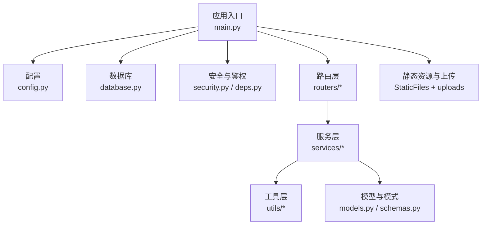
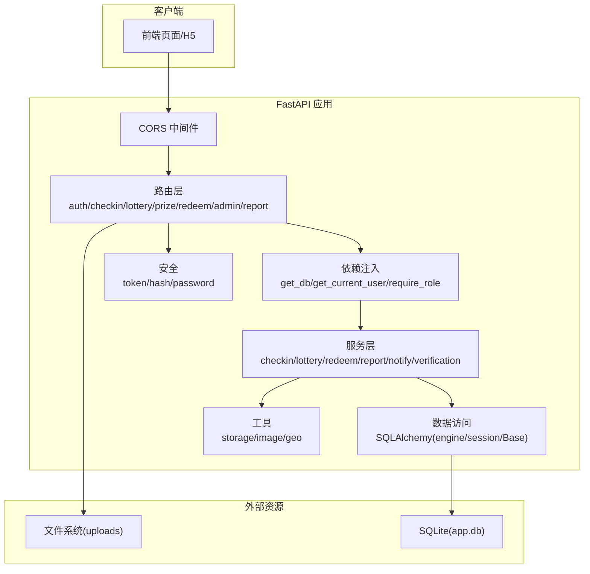
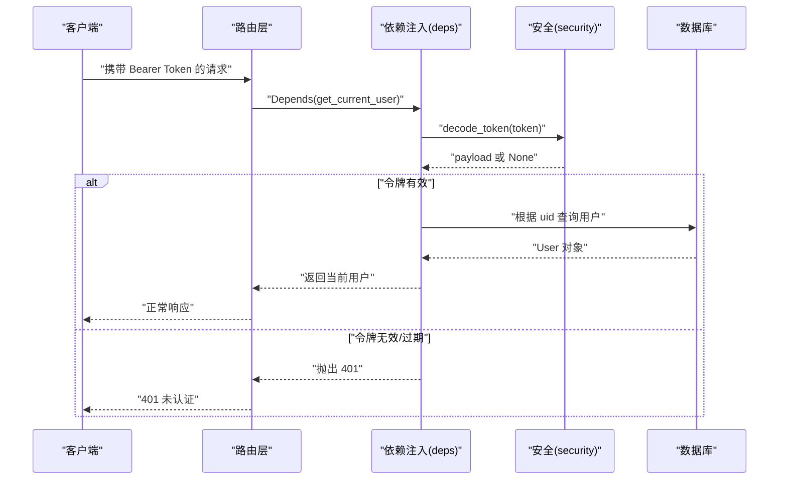
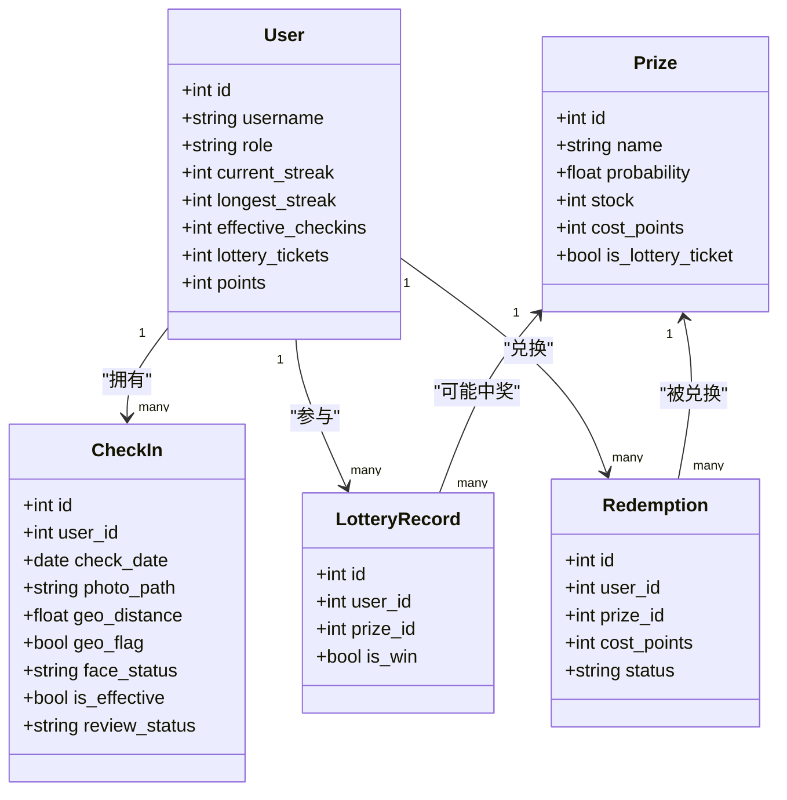
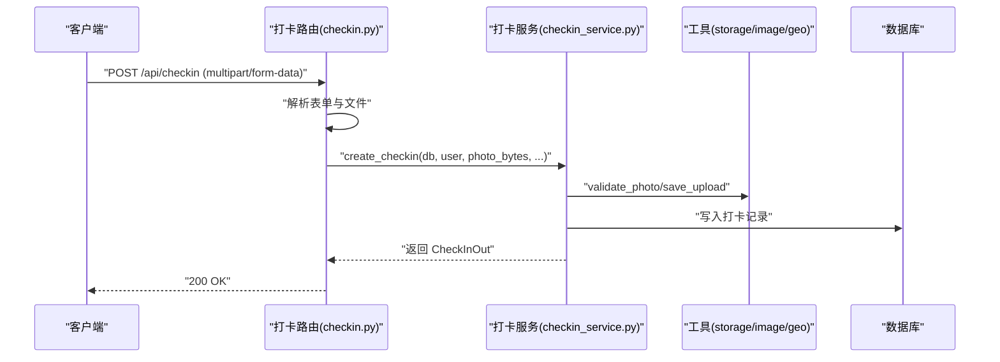
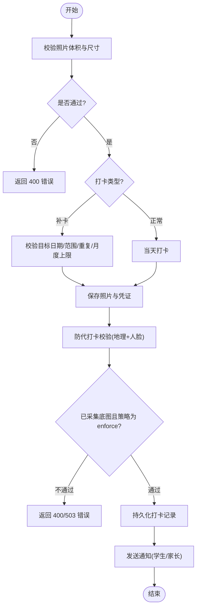
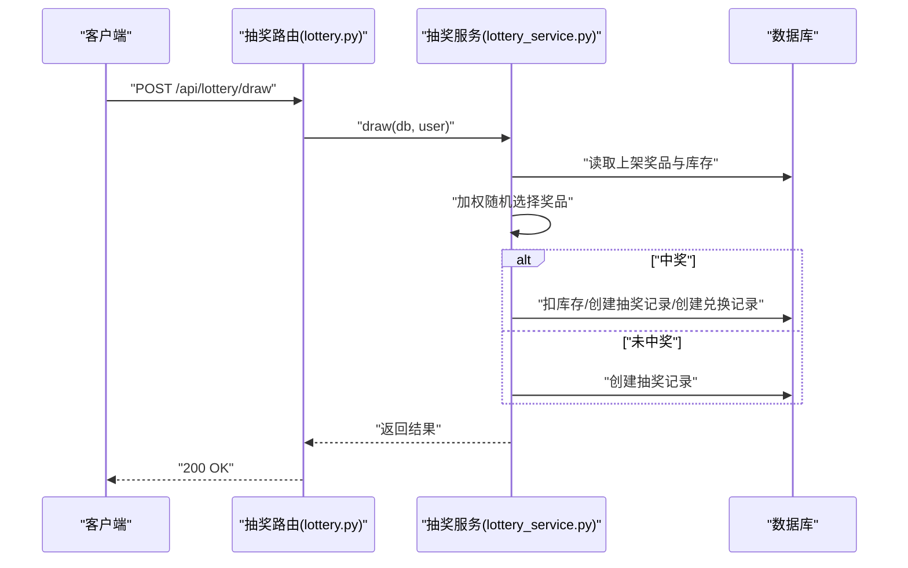
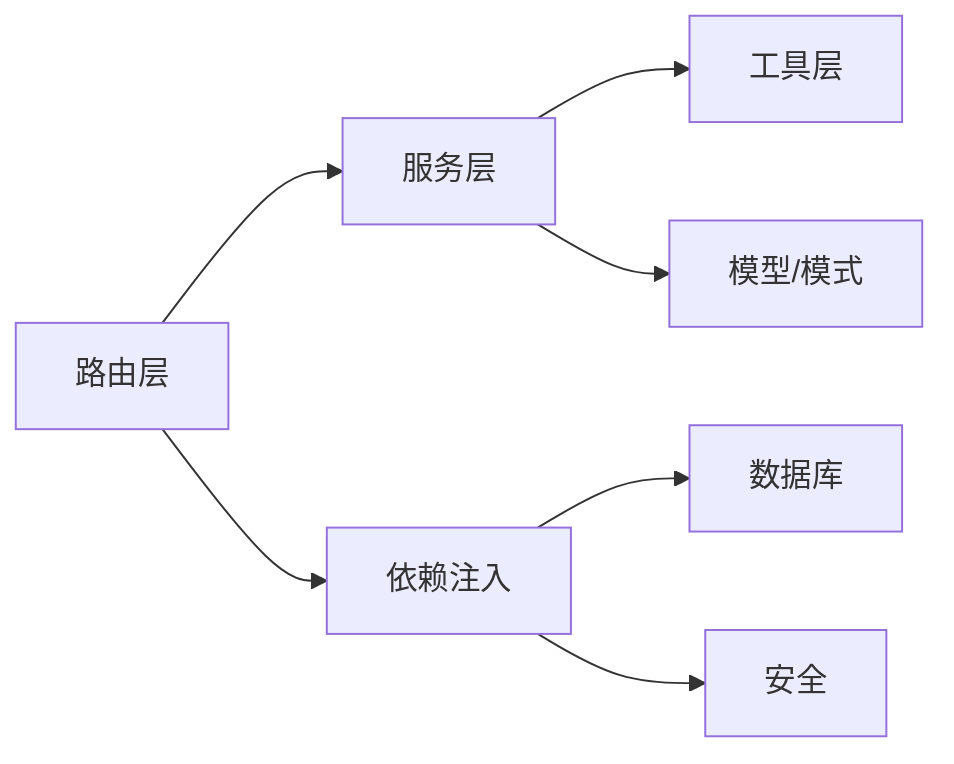

# 后端服务架构

<cite>
**本文引用的文件**
- [main.py](file://summer-homework-checkin/backend/app/main.py)
- [config.py](file://summer-homework-checkin/backend/app/config.py)
- [database.py](file://summer-homework-checkin/backend/app/database.py)
- [deps.py](file://summer-homework-checkin/backend/app/deps.py)
- [security.py](file://summer-homework-checkin/backend/app/security.py)
- [models.py](file://summer-homework-checkin/backend/app/models.py)
- [schemas.py](file://summer-homework-checkin/backend/app/schemas.py)
- [auth.py](file://summer-homework-checkin/backend/app/routers/auth.py)
- [checkin.py](file://summer-homework-checkin/backend/app/routers/checkin.py)
- [lottery.py](file://summer-homework-checkin/backend/app/routers/lottery.py)
- [prize.py](file://summer-homework-checkin/backend/app/routers/prize.py)
- [redeem.py](file://summer-homework-checkin/backend/app/routers/redeem.py)
- [admin.py](file://summer-homework-checkin/backend/app/routers/admin.py)
- [report.py](file://summer-homework-checkin/backend/app/routers/report.py)
- [checkin_service.py](file://summer-homework-checkin/backend/app/services/checkin_service.py)
- [lottery_service.py](file://summer-homework-checkin/backend/app/services/lottery_service.py)
- [redeem_service.py](file://summer-homework-checkin/backend/app/services/redeem_service.py)
- [report_service.py](file://summer-homework-checkin/backend/app/services/report_service.py)
- [storage.py](file://summer-homework-checkin/backend/app/utils/storage.py)
- [image.py](file://summer-homework-checkin/backend/app/utils/image.py)
- [geo.py](file://summer-homework-checkin/backend/app/utils/geo.py)
</cite>

## 目录
1. [简介](#简介)
2. [项目结构](#项目结构)
3. [核心组件](#核心组件)
4. [架构总览](#架构总览)
5. [详细组件分析](#详细组件分析)
6. [依赖关系分析](#依赖关系分析)
7. [性能与并发](#性能与并发)
8. [故障排查指南](#故障排查指南)
9. [结论](#结论)
10. [附录：扩展指南](#附录扩展指南)

## 简介
本技术文档面向“暑假作业打卡系统”的后端服务，围绕 FastAPI 应用的模块化设计展开，重点说明路由层、服务层、数据访问层的职责分离；阐述依赖注入机制、中间件实现与自定义异常处理；解释异步编程模型的应用、数据库事务管理与连接池优化；并覆盖文件上传、静态资源服务与错误日志记录等工程实践。文末提供扩展新模块与集成第三方服务的示例路径，帮助读者快速上手与二次开发。

## 项目结构
后端采用按功能域划分的分层架构：
- 应用入口与装配：应用初始化、中间件、路由挂载、静态资源、启动钩子
- 配置与环境：路径、阈值、密钥、规则常量
- 数据访问：SQLAlchemy 引擎、会话工厂、声明式基类、依赖注入的 get_db
- 安全与鉴权：密码哈希、令牌签发与校验、当前用户解析、角色守卫
- 领域模型与模式：ORM 模型、Pydantic 请求/响应模式
- 路由层：按业务域拆分的路由（认证、打卡、抽奖、奖品、兑换、管理、报告、人脸）
- 服务层：跨路由复用的业务编排（打卡、抽奖、兑换、报表、通知、验证）
- 工具层：存储、图像校验、地理距离计算

图表来源
- [main.py:1-48](file://summer-homework-checkin/backend/app/main.py#L1-L48)
- [config.py:1-50](file://summer-homework-checkin/backend/app/config.py#L1-L50)
- [database.py:1-22](file://summer-homework-checkin/backend/app/database.py#L1-L22)
- [security.py:1-47](file://summer-homework-checkin/backend/app/security.py#L1-L47)
- [deps.py:1-34](file://summer-homework-checkin/backend/app/deps.py#L1-L34)
- [models.py:1-212](file://summer-homework-checkin/backend/app/models.py#L1-L212)
- [schemas.py:1-322](file://summer-homework-checkin/backend/app/schemas.py#L1-L322)
- [storage.py:1-24](file://summer-homework-checkin/backend/app/utils/storage.py#L1-L24)

章节来源
- [main.py:1-48](file://summer-homework-checkin/backend/app/main.py#L1-L48)
- [config.py:1-50](file://summer-homework-checkin/backend/app/config.py#L1-L50)

## 核心组件
- 应用装配与中间件
  - 注册 CORS 中间件，挂载各业务路由，启动时创建表结构，挂载静态资源与上传目录
- 配置中心
  - 集中管理路径、数据库 URL、令牌过期时间、打卡与人脸识别策略、积分与抽奖阈值等
- 数据访问层
  - SQLAlchemy 引擎与会话工厂，提供 get_db 生成器用于依赖注入；SQLite 开启多线程访问开关
- 安全与鉴权
  - 基于 HMAC 的无状态令牌签发与校验；HTTPBearer 方案解析凭据；get_current_user 解析当前用户；require_role 进行角色守卫
- 领域模型与模式
  - ORM 模型定义用户、打卡、奖品、兑换、通知、闯关任务等实体及关系；Pydantic 模式统一输入输出校验与序列化
- 路由层
  - 按域划分：认证、打卡、抽奖、奖品、兑换、管理、报告、人脸等，仅做参数校验、权限检查与服务调用
- 服务层
  - 封装复杂业务逻辑：打卡流程（含补卡、防代打卡、通知）、抽奖概率与库存、积分兑换与替换、报表聚合与 HTML 渲染
- 工具层
  - 文件保存与公开 URL 生成、轻量图片格式与尺寸校验、Haversine 距离计算

章节来源
- [main.py:1-48](file://summer-homework-checkin/backend/app/main.py#L1-L48)
- [config.py:1-50](file://summer-homework-checkin/backend/app/config.py#L1-L50)
- [database.py:1-22](file://summer-homework-checkin/backend/app/database.py#L1-L22)
- [security.py:1-47](file://summer-homework-checkin/backend/app/security.py#L1-L47)
- [deps.py:1-34](file://summer-homework-checkin/backend/app/deps.py#L1-L34)
- [models.py:1-212](file://summer-homework-checkin/backend/app/models.py#L1-L212)
- [schemas.py:1-322](file://summer-homework-checkin/backend/app/schemas.py#L1-L322)

## 架构总览
整体采用“路由层薄、服务层厚”的分层设计，结合 FastAPI 的依赖注入与中间件能力，形成清晰的职责边界与可扩展性。

图表来源
- [main.py:1-48](file://summer-homework-checkin/backend/app/main.py#L1-L48)
- [database.py:1-22](file://summer-homework-checkin/backend/app/database.py#L1-L22)
- [deps.py:1-34](file://summer-homework-checkin/backend/app/deps.py#L1-L34)
- [security.py:1-47](file://summer-homework-checkin/backend/app/security.py#L1-L47)
- [checkin_service.py:1-254](file://summer-homework-checkin/backend/app/services/checkin_service.py#L1-L254)
- [lottery_service.py:1-77](file://summer-homework-checkin/backend/app/services/lottery_service.py#L1-L77)
- [redeem_service.py:1-168](file://summer-homework-checkin/backend/app/services/redeem_service.py#L1-L168)
- [report_service.py:1-109](file://summer-homework-checkin/backend/app/services/report_service.py#L1-L109)
- [storage.py:1-24](file://summer-homework-checkin/backend/app/utils/storage.py#L1-L24)
- [image.py:1-61](file://summer-homework-checkin/backend/app/utils/image.py#L1-L61)
- [geo.py:1-24](file://summer-homework-checkin/backend/app/utils/geo.py#L1-L24)

## 详细组件分析

### 应用入口与中间件
- 应用初始化：标题、版本、健康检查端点
- 中间件：CORS 全放行（演示环境），生产建议收紧 allow_origins
- 路由挂载：按域注册路由
- 启动事件：Base.metadata.create_all 确保表存在
- 静态资源：/uploads、/admin、/ 分别映射到上传目录与管理端、学生端静态资源

章节来源
- [main.py:1-48](file://summer-homework-checkin/backend/app/main.py#L1-L48)

### 配置与环境
- 路径与目录：BASE_DIR、UPLOAD_DIR、STUDENT_DIR、ADMIN_DIR
- 数据库：SQLite 路径与 URL
- 安全：SECRET、TOKEN_EXPIRE_DAYS
- 业务规则：GEO_THRESHOLD_METERS、MAX_MAKEUP_PER_MONTH、CHECKIN_POINTS、MAKEUP_POINTS、LOTTERY_STREAK_THRESHOLD
- 人脸识别：FACE_MATCH_THRESHOLD、FACE_DET_SIZE、FACE_MODEL_NAME、FACE_MODE_ON_ENROLLED

章节来源
- [config.py:1-50](file://summer-homework-checkin/backend/app/config.py#L1-L50)

### 数据访问层与事务
- 引擎与会话：create_engine 指定 connect_args 以支持多线程 SQLite；sessionmaker 关闭自动提交/刷新
- 依赖注入：get_db 生成器在请求开始时创建会话，结束时关闭
- 事务管理：服务层内 db.commit() 控制事务边界；关键写操作前后使用 refresh 保证一致性

章节来源
- [database.py:1-22](file://summer-homework-checkin/backend/app/database.py#L1-L22)
- [checkin_service.py:166-209](file://summer-homework-checkin/backend/app/services/checkin_service.py#L166-L209)
- [redeem_service.py:22-94](file://summer-homework-checkin/backend/app/services/redeem_service.py#L22-L94)

### 安全与鉴权
- 密码哈希与校验：PBKDF2-HMAC-SHA256，固定盐（演示用）
- 令牌：HMAC 签名 + Base64 编码 body，包含 uid、role、exp；decode_token 校验签名与过期
- 依赖注入：HTTPBearer 解析 Authorization；get_current_user 解码并加载用户；require_role 进行角色守卫

图表来源
- [deps.py:1-34](file://summer-homework-checkin/backend/app/deps.py#L1-L34)
- [security.py:1-47](file://summer-homework-checkin/backend/app/security.py#L1-L47)
- [auth.py:1-52](file://summer-homework-checkin/backend/app/routers/auth.py#L1-L52)

章节来源
- [security.py:1-47](file://summer-homework-checkin/backend/app/security.py#L1-L47)
- [deps.py:1-34](file://summer-homework-checkin/backend/app/deps.py#L1-L34)
- [auth.py:1-52](file://summer-homework-checkin/backend/app/routers/auth.py#L1-L52)

### 领域模型与模式
- 用户：区分 student/parent/admin，包含连续打卡、抽奖券、积分等统计字段
- 打卡：记录照片、位置、人脸与场景检查结果、审核状态与有效性
- 奖品/兑换/抽奖记录：支持积分兑换、库存扣减、中奖自动生成兑换记录
- 通知：站内消息，关联业务实体
- 闯关任务：任务定义与学生提交记录，支持审核

图表来源
- [models.py:1-212](file://summer-homework-checkin/backend/app/models.py#L1-L212)

章节来源
- [models.py:1-212](file://summer-homework-checkin/backend/app/models.py#L1-L212)
- [schemas.py:1-322](file://summer-homework-checkin/backend/app/schemas.py#L1-L322)

### 路由层与依赖注入
- 认证路由：注册、登录、获取当前用户
- 打卡路由：提交打卡（含照片与凭证）、今日状态、连续天数、历史记录
- 抽奖路由：查看抽奖券与记录、执行抽奖
- 奖品路由：公开列表、管理员 CRUD
- 兑换路由：商城聚合、积分兑换、直接替换
- 管理路由：统计概览、用户/打卡/兑换管理、审核
- 报告路由：JSON 与 HTML 报告

图表来源
- [checkin.py:1-80](file://summer-homework-checkin/backend/app/routers/checkin.py#L1-L80)
- [checkin_service.py:64-163](file://summer-homework-checkin/backend/app/services/checkin_service.py#L64-L163)
- [storage.py:1-24](file://summer-homework-checkin/backend/app/utils/storage.py#L1-L24)
- [image.py:1-61](file://summer-homework-checkin/backend/app/utils/image.py#L1-L61)

章节来源
- [auth.py:1-52](file://summer-homework-checkin/backend/app/routers/auth.py#L1-L52)
- [checkin.py:1-80](file://summer-homework-checkin/backend/app/routers/checkin.py#L1-L80)
- [lottery.py:1-30](file://summer-homework-checkin/backend/app/routers/lottery.py#L1-L30)
- [prize.py:1-66](file://summer-homework-checkin/backend/app/routers/prize.py#L1-L66)
- [redeem.py:1-81](file://summer-homework-checkin/backend/app/routers/redeem.py#L1-L81)
- [admin.py:1-214](file://summer-homework-checkin/backend/app/routers/admin.py#L1-L214)
- [report.py:1-36](file://summer-homework-checkin/backend/app/routers/report.py#L1-L36)

### 服务层：打卡流程与规则
- 照片合规：体积与尺寸门槛，过滤占位图/缩略图
- 补卡规则：目标日期合法性、暑假范围、重复检测、月度上限
- 防代打卡：地理位置风险标记、人脸 1:1 比对策略（enforce/soft）
- 审核与奖励：批准发放积分、重算连续天数与里程碑、发放抽奖券
- 通知：学生与家长双向通知

图表来源
- [checkin_service.py:64-163](file://summer-homework-checkin/backend/app/services/checkin_service.py#L64-L163)
- [image.py:1-61](file://summer-homework-checkin/backend/app/utils/image.py#L1-L61)
- [geo.py:1-24](file://summer-homework-checkin/backend/app/utils/geo.py#L1-L24)

章节来源
- [checkin_service.py:1-254](file://summer-homework-checkin/backend/app/services/checkin_service.py#L1-L254)

### 服务层：抽奖与兑换
- 抽奖：消耗资格、加权随机、库存扣减、生成中奖记录与兑换记录、通知
- 兑换：区分虚拟奖品（自动成功）与实物奖品（待发放），支持直接替换（多退少补、库存回滚）

图表来源
- [lottery.py:1-30](file://summer-homework-checkin/backend/app/routers/lottery.py#L1-L30)
- [lottery_service.py:1-77](file://summer-homework-checkin/backend/app/services/lottery_service.py#L1-L77)

章节来源
- [lottery_service.py:1-77](file://summer-homework-checkin/backend/app/services/lottery_service.py#L1-L77)
- [redeem_service.py:1-168](file://summer-homework-checkin/backend/app/services/redeem_service.py#L1-L168)

### 服务层：报表与可视化
- 报表构建：统计区间内的有效打卡、补卡次数、完成率、每周分布、中奖记录
- HTML 渲染：卡通风格卡片布局、柱状图、打印按钮

章节来源
- [report_service.py:1-109](file://summer-homework-checkin/backend/app/services/report_service.py#L1-L109)
- [report.py:1-36](file://summer-homework-checkin/backend/app/routers/report.py#L1-L36)

### 工具层：存储、图像与地理
- 存储：按用户分目录保存，返回相对路径；public_url 生成可访问 HTTP 路径
- 图像：轻量解析 JPEG/PNG 头，提取宽高，拒绝过小或无效文件
- 地理：Haversine 公式计算两点距离，判断是否超出常用位置阈值

章节来源
- [storage.py:1-24](file://summer-homework-checkin/backend/app/utils/storage.py#L1-L24)
- [image.py:1-61](file://summer-homework-checkin/backend/app/utils/image.py#L1-L61)
- [geo.py:1-24](file://summer-homework-checkin/backend/app/utils/geo.py#L1-L24)

## 依赖关系分析
- 低耦合高内聚：路由层仅负责参数校验与权限检查，服务层承载业务编排，数据访问通过依赖注入解耦
- 直接依赖：
  - 路由 -> 服务、依赖注入、模型/模式
  - 服务 -> 工具、模型、通知
  - 依赖注入 -> 数据库、安全
- 潜在循环：避免在服务中反向导入路由；当前结构未见循环依赖迹象

图表来源
- [main.py:1-48](file://summer-homework-checkin/backend/app/main.py#L1-L48)
- [deps.py:1-34](file://summer-homework-checkin/backend/app/deps.py#L1-L34)
- [security.py:1-47](file://summer-homework-checkin/backend/app/security.py#L1-L47)
- [models.py:1-212](file://summer-homework-checkin/backend/app/models.py#L1-L212)
- [schemas.py:1-322](file://summer-homework-checkin/backend/app/schemas.py#L1-L322)

章节来源
- [main.py:1-48](file://summer-homework-checkin/backend/app/main.py#L1-L48)
- [deps.py:1-34](file://summer-homework-checkin/backend/app/deps.py#L1-L34)

## 性能与并发
- 异步模型：路由中使用 async def 接收 multipart/form-data 与 Form 字段，配合 await 读取文件流，避免阻塞事件循环
- 数据库连接池：SQLite 默认单进程，connect_args 设置 check_same_thread=False 以支持多线程；若迁移至 PostgreSQL/MySQL，建议使用连接池（如 create_engine 的 pool_size/max_overflow）提升并发
- 事务粒度：服务层显式 commit，尽量缩小事务范围，减少锁竞争
- 静态资源：使用 StaticFiles 直接提供静态文件，降低应用层压力
- 文件上传：限制体积与尺寸，避免大文件导致内存峰值

[本节为通用指导，无需源码引用]

## 故障排查指南
- 常见异常
  - 401 未认证：令牌缺失、签名错误或已过期
  - 403 无权限：非学生/家长/管理员角色访问受限接口
  - 400 业务错误：照片不合规、补卡规则违反、人脸校验失败、积分不足、库存不足
  - 404 资源不存在：奖品/兑换记录不存在
  - 503 服务不可用：人脸识别服务暂不可用
- 定位要点
  - 检查依赖注入链：get_current_user 是否正确解析 token 与用户
  - 核对服务层规则：补卡日期范围、月度上限、连续天数重算
  - 确认文件校验：体积与尺寸门槛、JPEG/PNG 头部解析
  - 观察数据库事务：commit 时机与 refresh 后字段一致性
- 日志记录建议
  - 在路由或服务层关键分支添加结构化日志（请求 ID、用户 ID、动作、耗时、异常堆栈）
  - 对文件上传与人脸校验增加详细日志，便于追踪问题

章节来源
- [deps.py:1-34](file://summer-homework-checkin/backend/app/deps.py#L1-L34)
- [checkin_service.py:64-163](file://summer-homework-checkin/backend/app/services/checkin_service.py#L64-L163)
- [redeem_service.py:22-94](file://summer-homework-checkin/backend/app/services/redeem_service.py#L22-L94)

## 结论
本后端采用清晰的分层与依赖注入，将路由、服务与数据访问解耦，结合中间件与安全机制，实现了打卡、抽奖、兑换、管理等核心能力。通过工具层对文件、图像与地理的轻量处理，提升了系统的健壮性与可维护性。后续可在保持现有架构的前提下，平滑扩展新功能与集成第三方服务。

[本节为总结，无需源码引用]

## 附录：扩展指南

### 新增功能模块步骤
- 定义 Pydantic 模式：在 schemas.py 中添加请求/响应模型
- 编写服务函数：在 services/ 下新建或扩展现有服务，封装业务逻辑
- 创建路由：在 routers/ 下新增路由文件，挂载到 app.include_router
- 更新应用入口：在 main.py 中 include 新路由
- 测试与文档：补充单元测试与 API 文档注释

章节来源
- [schemas.py:1-322](file://summer-homework-checkin/backend/app/schemas.py#L1-L322)
- [main.py:1-48](file://summer-homework-checkin/backend/app/main.py#L1-L48)

### 集成第三方服务（示例：短信/邮件通知）
- 抽象接口：在 services/notify_service.py 中定义 send_sms/send_email 接口
- 实现适配：根据环境变量切换不同供应商实现
- 调用点：在打卡、抽奖、兑换等服务中调用通知接口
- 容错与重试：对网络异常进行捕获与重试，避免影响主流程

章节来源
- [checkin_service.py:148-163](file://summer-homework-checkin/backend/app/services/checkin_service.py#L148-L163)
- [lottery_service.py:59-68](file://summer-homework-checkin/backend/app/services/lottery_service.py#L59-L68)
- [redeem_service.py:65-94](file://summer-homework-checkin/backend/app/services/redeem_service.py#L65-L94)